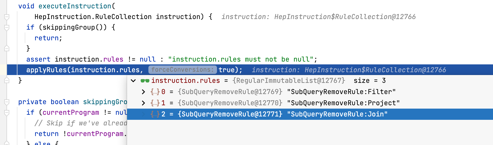

findBestExp:

1.1. 先执行 executeProgram(mainProgram) 逻辑，并将 mainProgram 赋予 currentProgram，然后循环 currentProgram.instructions。

```java
    for (HepInstruction instruction : currentProgram.instructions) {
      instruction.execute(this);
      int delta = nTransformations - nTransformationsLastGC;
      if (delta > graphSizeLastGC) {
        // The number of transformations performed since the last
        // garbage collection is greater than the number of vertices in
        // the graph at that time.  That means there should be a
        // reasonable amount of garbage to collect now.  We do it this
        // way to amortize garbage collection cost over multiple
        // instructions, while keeping the highwater memory usage
        // proportional to the graph size.
        collectGarbage();
      }
    }
```

​      instruction.execute(this); execute 方法内部调用 applyRules 方法，按照规则进行优化。

```
applyRules(instruction.rules, true);
```

可以看到有三个优化规则。



HepMatchOrder 代表了基于规则优化的顺序，包含了 ARBITRARY（任意顺序）、BOTTOM_UP（自底向上）、TOP_DOWN（自顶向下） 和 DEPTH_FIRST（深度优先）。然后循环进行匹配：

```java
    boolean fixedPoint;
    do {
      Iterator<HepRelVertex> iter = getGraphIterator(requireNonNull(root, "root"));
      fixedPoint = true;
      while (iter.hasNext()) {
        HepRelVertex vertex = iter.next();
        for (RelOptRule rule : rules) {
          HepRelVertex newVertex =
              applyRule(rule, vertex, forceConversions);
          if (newVertex == null || newVertex == vertex) {
            continue;
          }
          ++nMatches;
          if (nMatches >= requireNonNull(currentProgram, "currentProgram").matchLimit) {
            return;
          }
          if (fullRestartAfterTransformation) {
            iter = getGraphIterator(requireNonNull(root, "root"));
          } else {
            // To the extent possible, pick up where we left
            // off; have to create a new iterator because old
            // one was invalidated by transformation.
            iter = getGraphIterator(newVertex);
            if (requireNonNull(currentProgram, "currentProgram").matchOrder
                == HepMatchOrder.DEPTH_FIRST) {
              nMatches =
                  depthFirstApply(iter, rules, forceConversions, nMatches);
              if (nMatches >= requireNonNull(currentProgram, "currentProgram").matchLimit) {
                return;
              }
            }
            // Remember to go around again since we're
            // skipping some stuff.
            fixedPoint = false;
          }
          break;
        }
      }
    } while (!fixedPoint);
```

