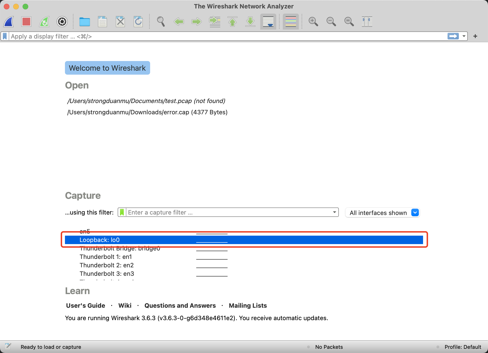
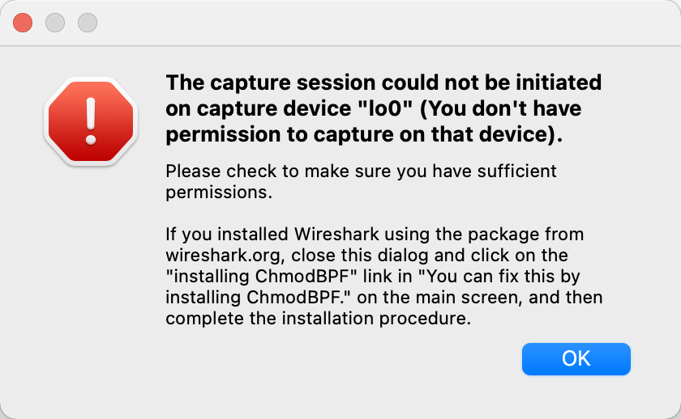
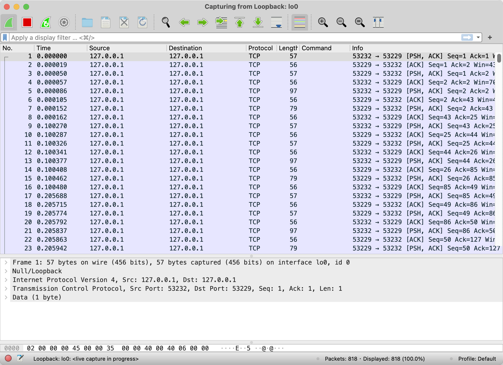
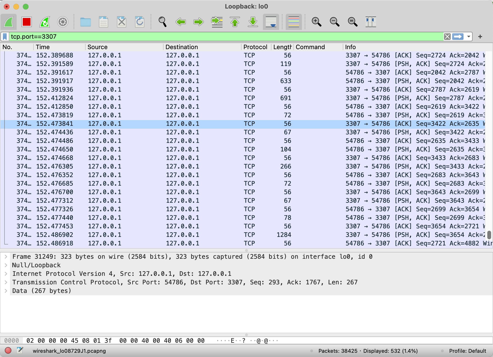
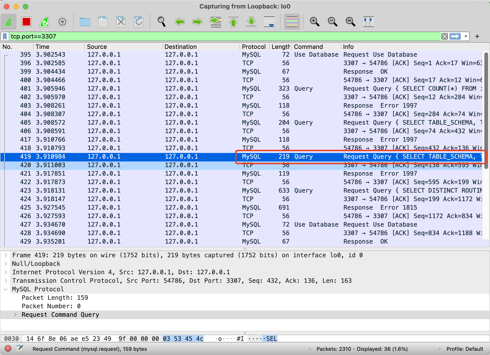

## 背景

## 问题分析

首先，打开 Wireshark，选择对应的网卡，由于 Proxy, MySQL 都部署在本地，因此选择本地回环地址即可。

双击之后，出现如下异常：

参考晚上的解决办法：https://www.jianshu.com/p/23f54c8a6eff，`sudo chmod 777 /dev/bpf*`，立马解决了问题。双击之后进入如下界面：

可以看到 Wireshark 拦截了很多 TCP 请求，我们可以通过 filter 对请求进行过滤，从而找到我们关心的 Proxy 请求。

通过 tcp.port==3307 条件进行过滤，可以看到都是 TCP 协议的传输包，我们很难看清客户端再向 Proxy 请求什么内容。

我们打开 `Preferences -> Protocols -> MySQL`，勾选 `Show SQL Query string in INFO column`，并且将 MySQL TCP port 调整为 3307：

此时，我们可以看到请求的 SQL 语句。

## 参考文档

* [浅析 MySQL 协议——从一个 bug 谈起](https://zhuanlan.zhihu.com/p/41979884)
* [记一次 Wireshark 抓包 Sharding-Proxy 过程](https://dongzl.github.io/2019/10/23/07-Wireshark-Sharding-Proxy/index.html)
* [我给 Apache 顶级项目提了个 Bug](https://mp.weixin.qq.com/s?__biz=MzU2MTM4NDAwMw==&mid=2247487705&idx=1&sn=cae3bcb015e03f71b60cf780f6bbaf17&chksm=fc78cff5cb0f46e327e6a25915f1c9854b561a25eae2587139fa0a9a1ec6153816f4bcf44b8e#rd)
* https://blog.51cto.com/riverxyz/3797016
* http://hutaow.com/blog/2013/11/06/mysql-protocol-analysis/
* https://cloud.tencent.com/developer/article/1436290
* wireshark分析mysql数据包：https://blog.51cto.com/riverxyz/3797016
* MySQL协议分析：http://hutaow.com/blog/2013/11/06/mysql-protocol-analysis/
* [每天一个 Linux 命令（131）：tcpdump 命令](https://mp.weixin.qq.com/s/m02EcN9dRhbMtUzQi1u-Bw)

