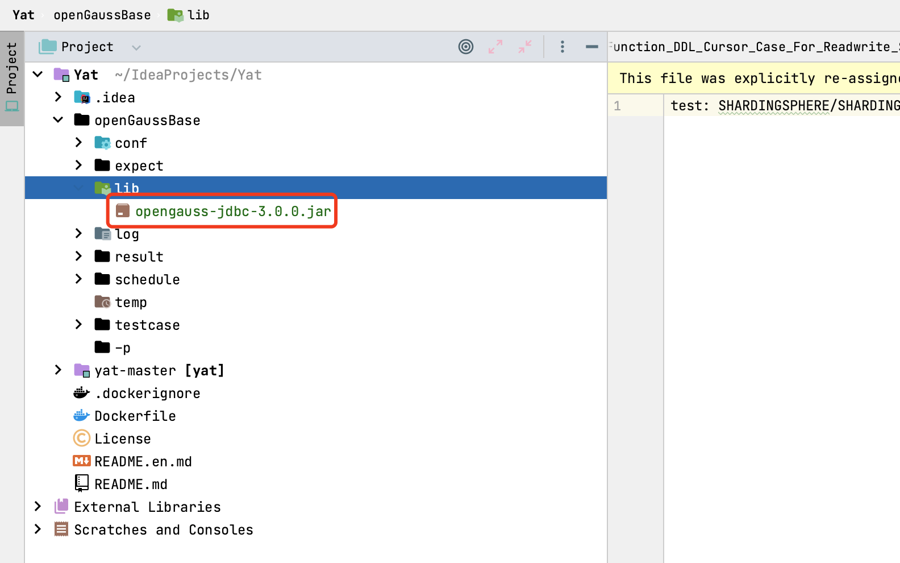
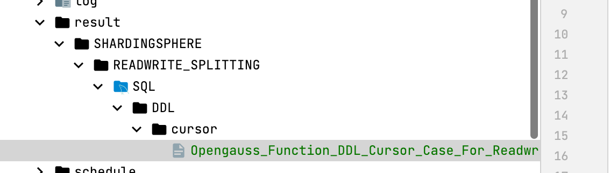

YAT 安装:

参考伟杰整理的文档，使用 Docker 打包 YAT 镜像：https://u01f1kqxrl.feishu.cn/wiki/wikcntI9SpneFFXM9VKnBM5lfjd#

下周 OG 3.0 驱动：https://mvnrepository.com/artifact/org.opengauss/opengauss-jdbc/3.0.0 并放到 lib 目录下：



在 testcase 目录下添加测试用例：


在 schedule 目录下创建调度文件 SHARDINGSPHERE_SHARDING_SQL.schd，指定要执行的 CASE：

```
test: SHARDINGSPHERE/SHARDING/SQL/DDL/cursor/Opengauss_Function_DDL_Cursor_Case_For_Sharding
```

启动 YAT 测试容器：

```bash
docker run --privileged --name yat0 -i -t -v /Users/strongduanmu/IdeaProjects/Yat/openGaussBase:/root/openGaussBase -w /root/openGaussBase --entrypoint=bash teslacn/yat:with-og-jdbc-3
```

执行yat时，默认需要检查core路径是否设置且有权限，通过后才开始执行yat.举例设置unlimite和core路径为/home/core

```bash
mkdir /home/core
chmod -R 777 /home/core
echo "/home/core/core-%e-%u-%s-%t-%h">/proc/sys/kernel/core_pattern
ulimit -c unlimited
chown root:root /root/openGaussBase/log
```

然后安装 JDBC 驱动，我们使用全局安装的方式。

适用场景，有多个测试套需要在同一个环境的同一个用户下运行

修改用户.bashrc文件，通过环境变量指定驱动搜索路径

```
mkdir -p ~/lib
cp lib/opengauss-jdbc-3.0.0.jar ~/lib
chmod a+r ~/lib/*.jar
echo `export YAT_LIB_PATH=$HOME/LIB` >> ~/.bashrc
source ~/.bashrc
```

执行测试程序：

```
yat suite -s /root/openGaussBase/schedule/SHARDINGSPHERE_SHARDING_SQL.schd
yat suite -s /root/openGaussBase/schedule/SHARDINGSPHERE_READWRITE_SPLITTING_SQL.schd
yat suite -s /root/openGaussBase/schedule/OPENGAUSS_DQL.schd
```

将 result 目录下生成的结果，复制到 expect 对应目录下，并检查是否和测试期望值一直（YAT 测试程序返回的结果集格式和 OG 不同）。



## 参考文档

https://gitee.com/opengauss/Yat/blob/master/yat-master/docs/index.md#yat-quick-start
