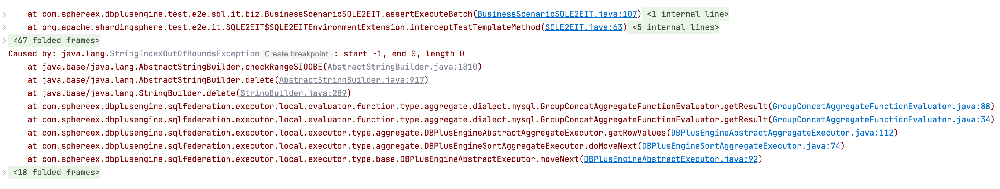
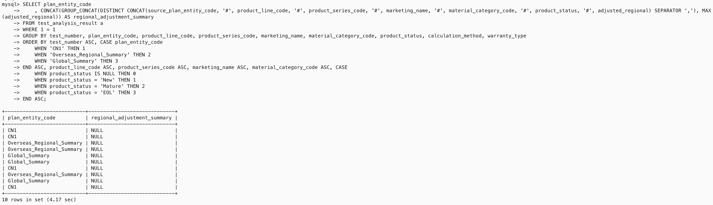
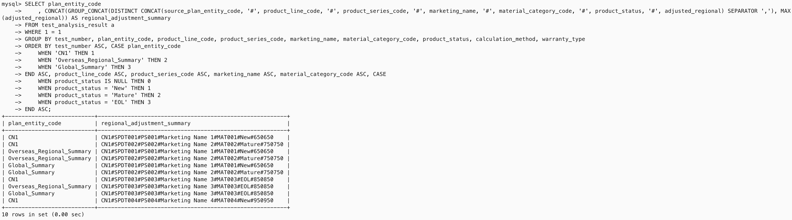
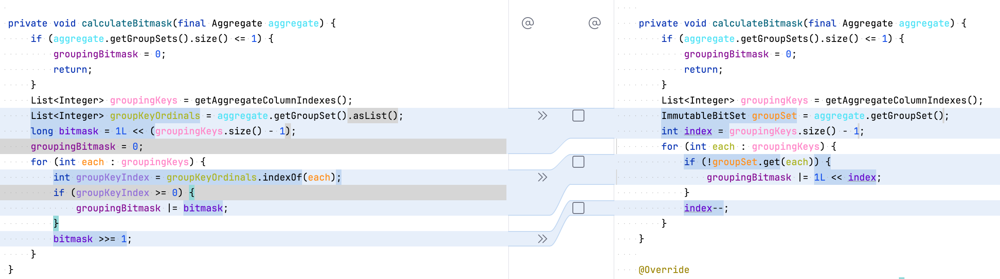
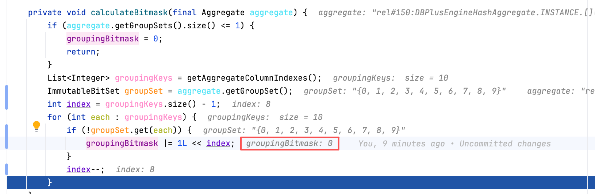
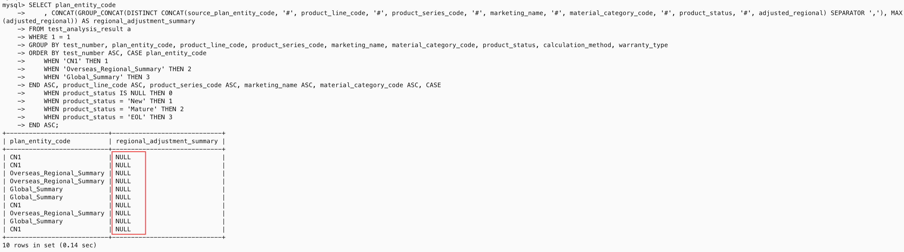
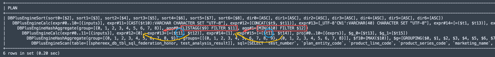

## 问题背景

上周笔者所在公司客户反馈，使用商业版联邦查询进行复杂 SQL 聚合分析时，出现了 `StringIndexOutOfBoundsException` 异常。根据客户反馈的异常信息，起初笔者觉得这只是一个简单的下标越界问题，于是快速通过 E2E 测试程序复现问题（如下图所示），并对下标越界的代码进行了增强。



但是问题似乎没有这么简单，修改后 E2E 测试仍然没有通过，根据断言结果来看，查询结果同样不符合预期，为了彻底搞清楚这个问题，笔者在周末进行了一番探索研究，最终解决了这个问题。调查问题过程中，笔者对 `GROUPING` 函数的语义有了更深的理解，为了方便自己以及其他有需要的同学参考学习，本文将对问题调查过程进行记录总结，如有介绍不详细或者错误之处，还恳请大家留言指导。

## 问题分析

由于原始 SQL 非常复杂，为了方便问题描述，我们使用一个精简版的 SQL 来进行分析。首先，我们搭建一个 Proxy 集群，并参考[商业文档](https://docs.sphere-ex.com/sphereex-dbplussuite/master/zh/docs/plugin-guide/sql-federation/)开启联邦查询功能，然后在 Proxy 上配置分片规则，按照 `data_batch_id` 字段对 `test_analysis_result` 表进行哈希取模分片。

```yaml
rules:
- !SINGLE
  tables:
    - "*.*"
- !SHARDING
  tables:
    test_analysis_result:
      actualDataNodes: ds_${0..9}.test_analysis_result
      databaseStrategy:
        standard:
          shardingColumn: data_batch_id
          shardingAlgorithmName: data_batch_inline
          
  defaultTableStrategy:
    none:

  shardingAlgorithms:
    data_batch_inline:
      type: INLINE
      props:
        algorithm-expression: ds_${Math.abs(data_batch_id.hashCode() % 10)}
```

再通过 Proxy 执行如下的建表语句，创建 `test_analysis_result` 测试表：

```sql
CREATE TABLE `test_analysis_result` ( `creator_account` varchar(200) DEFAULT NULL, `is_deleted` varchar(1) DEFAULT NULL, `last_modified_time` datetime DEFAULT NULL, `data_batch_id` date DEFAULT NULL, `modifier_account` varchar(200) DEFAULT NULL, `analysis_id` varchar(200) NOT NULL, `analysis_description` varchar(1000) DEFAULT NULL, `last_modifier_id` bigint DEFAULT NULL, `creator_id` bigint DEFAULT NULL, `create_time` datetime DEFAULT NULL, `data_version` int DEFAULT '0', `test_identifier` varchar(200) NOT NULL, `test_number` varchar(40) NOT NULL, `plan_entity_code` varchar(40) NOT NULL, `plan_entity_name_cn` varchar(100) DEFAULT NULL, `plan_entity_name_en` varchar(100) DEFAULT NULL, `material_code` varchar(40) NOT NULL, `test_create_date` date NOT NULL, `analysis_version` int NOT NULL, `calculation_complete_date` date DEFAULT NULL, `calculation_method` varchar(10) DEFAULT NULL, `warranty_type` varchar(10) DEFAULT NULL, `standard_type` varchar(10) DEFAULT NULL, `product_line_code` varchar(50) DEFAULT NULL, `product_line_name_cn` varchar(1000) DEFAULT NULL, `product_line_name_en` varchar(1000) DEFAULT NULL, `product_series_code` varchar(30) DEFAULT NULL, `product_series_name_cn` varchar(512) DEFAULT NULL, `product_series_name_en` varchar(512) DEFAULT NULL, `marketing_name` text, `material_category_code` varchar(100) DEFAULT NULL, `price_rmb` decimal(18, 2) DEFAULT NULL, `price_usd` decimal(18, 2) DEFAULT NULL, `material_desc_cn` text, `material_desc_en` text, `market_launch_date` date DEFAULT NULL, `total` bigint DEFAULT NULL, `lifecycle_consumed_total` bigint DEFAULT NULL, `actual_consumption_qty` bigint DEFAULT NULL, `forecast_total_consumption` bigint DEFAULT NULL, `current_and_transit_inventory` bigint DEFAULT NULL, `forecast_future` bigint DEFAULT NULL, `distribution_center_stock` bigint DEFAULT NULL, `distribution_center_transit` bigint DEFAULT NULL, `service_center_stock` bigint DEFAULT NULL, `service_center_transit` bigint DEFAULT NULL, `return_good_stock` bigint DEFAULT NULL, `period_1` varchar(20) DEFAULT NULL, `period_2` varchar(20) DEFAULT NULL, `period_3` varchar(20) DEFAULT NULL, `period_4` varchar(20) DEFAULT NULL, `period_5` varchar(20) DEFAULT NULL, `value_1` varchar(20) DEFAULT NULL, `value_2` varchar(20) DEFAULT NULL, `value_3` varchar(20) DEFAULT NULL, `value_4` varchar(20) DEFAULT NULL, `value_5` varchar(20) DEFAULT NULL, `analysis_start_period` varchar(20) DEFAULT NULL, `analysis_end_period` varchar(20) DEFAULT NULL, `integration_task_no` varchar(120) DEFAULT NULL, `source_plan_entity_code` varchar(40) DEFAULT NULL, `test_completion_date` varchar(20) DEFAULT NULL, `source_test_number` varchar(40) DEFAULT NULL, `monitoring_month` date DEFAULT NULL, `analysis_task_type` varchar(1) DEFAULT NULL, `return_good_transit` bigint DEFAULT NULL, `summary_entity_stock` bigint DEFAULT NULL, `product_status` varchar(64) DEFAULT NULL, `peak_consumption_flag` varchar(1) DEFAULT NULL, `actual_consumption_current` bigint DEFAULT NULL, `actual_consumption_previous` bigint DEFAULT NULL, `total_actual_consumption` bigint DEFAULT NULL, `historical_test_consumption` bigint DEFAULT NULL, `regional_forecast` bigint DEFAULT NULL, `current_region_application` bigint DEFAULT NULL, `current_region_consumption` bigint DEFAULT NULL, `future_test_consumption` bigint DEFAULT NULL, `adjusted_regional` bigint DEFAULT NULL, `regional_adjustment_reason` varchar(240) DEFAULT NULL, `product_adjustment_reason` varchar(240) DEFAULT NULL, `regional_risk_assessment_reason` varchar(240) DEFAULT NULL, `product_risk_assessment_reason` varchar(240) DEFAULT NULL, `business_decision` varchar(240) DEFAULT NULL, `product_line_remaining_application` bigint DEFAULT NULL, `product_line_remaining_consumption` bigint DEFAULT NULL, `overall_adjusted` bigint DEFAULT NULL, `inventory_risk_quantity` bigint DEFAULT NULL, `monthly_consumption_risk_reason` varchar(240) DEFAULT NULL, `total_consumption_deviation_risk_reason` varchar(240) DEFAULT NULL, `new_forecast_consumption_risk_reason` varchar(240) DEFAULT NULL, `test_investment_ratio` decimal(10, 2) DEFAULT NULL, `test_peak_period` int DEFAULT NULL, `actual_peak_period` int DEFAULT NULL, `peak_period_deviation` int DEFAULT NULL, `peak_period_activation_rate` decimal(18, 4) DEFAULT NULL, `memory_spec` varchar(100) DEFAULT NULL, `material_type` varchar(100) DEFAULT NULL, `actual_vs_forecast_comparison` decimal(18, 2) DEFAULT NULL, `forecast_comparison_ratio` decimal(18, 2) DEFAULT NULL, `adjusted_model_future_consumption` bigint DEFAULT NULL, `adopted_model_future_consumption` bigint DEFAULT NULL, `color_en` varchar(120) DEFAULT NULL, `color_cn` varchar(120) DEFAULT NULL, PRIMARY KEY (`analysis_id`) ) ENGINE = InnoDB;
```

为了复现问题，我们再为这张表 Mock 10 条数据：

```sql
INSERT INTO `test_analysis_result` VALUES ('user001', 'N', '2023-05-15 10:30:00', '2023-05-15', 'user001' , 'ID000001', 'Initial record', 1001, 1001, '2023-05-15 10:00:00' , 1, 'LTB001', 'LTB-2023-001', 'CN1', '中国区' , 'China Region', 'ITEM001', '2023-01-10', 1, '2023-05-10' , 'MODEL1', 'ACTIVE', '3', 'SPDT001', '产品系列1' , 'Product Series 1', 'PS001', '产品系列1', 'Product Series 1', 'Marketing Name 1' , 'MAT001', 1000.00, 150.00, '产品描述中文1', 'Product Description 1' , '2023-03-01', 24, 12, 500, 1000 , 200, 300, 100, 50, 150 , 30, 70, '2023-06', '2023-07', '2023-08' , '2023-09', '2023-10', '100', '150', '200' , '180', '160', '2023-05', '2023-10', 'API001' , 'CN1', '2023-05-20', 'LTB-2023-001', '2023-05-01', '1' , 40, 250, 'New', 'Y', 120 , 150, 270, 400, 600, 200 , 180, 800, 650, 'Regional adjustment reason 1', 'Product adjustment reason 1' , 'Regional risk reason 1', 'Product risk reason 1', 'TRADE1', 300, 280 , 700, 50, 'Monthly risk reason 1', 'Total deviation reason 1', 'New predict reason 1' , 0.75, 18, 16, 2, 88.8889 , '16GB', 'Aluminum', 95.00, 105.00, 750 , 800, 'Black', '黑色'), ('user002', 'N', '2023-05-16 11:30:00', '2023-05-15', 'user002' , 'ID000002', 'Second record', 1002, 1002, '2023-05-16 11:00:00' , 1, 'LTB001', 'LTB-2023-001', 'Overseas_Regional_Summary', '海外区域汇总' , 'Overseas Regional Summary', 'ITEM001', '2023-01-10', 1, '2023-05-10' , 'MODEL1', 'ACTIVE', '3', 'SPDT001', '产品系列1' , 'Product Series 1', 'PS001', '产品系列1', 'Product Series 1', 'Marketing Name 1' , 'MAT001', 1000.00, 150.00, '产品描述中文1', 'Product Description 1' , '2023-03-01', 24, 12, 500, 1000 , 200, 300, 100, 50, 150 , 30, 70, '2023-06', '2023-07', '2023-08' , '2023-09', '2023-10', '100', '150', '200' , '180', '160', '2023-05', '2023-10', 'API001' , 'CN1', '2023-05-20', 'LTB-2023-001', '2023-05-01', '1' , 40, 250, 'New', 'Y', 120 , 150, 270, 400, 600, 200 , 180, 800, 650, 'Regional adjustment reason 1', 'Product adjustment reason 1' , 'Regional risk reason 1', 'Product risk reason 1', 'TRADE1', 300, 280 , 700, 50, 'Monthly risk reason 1', 'Total deviation reason 1', 'New predict reason 1' , 0.75, 18, 16, 2, 88.8889 , '16GB', 'Aluminum', 95.00, 105.00, 750 , 800, 'Black', '黑色'), ('user003', 'N', '2023-05-17 12:30:00', '2023-05-15', 'user003' , 'ID000003', 'Third record', 1003, 1003, '2023-05-17 12:00:00' , 1, 'LTB001', 'LTB-2023-001', 'Global_Summary', '全球汇总' , 'Global Summary', 'ITEM001', '2023-01-10', 1, '2023-05-10' , 'MODEL1', 'ACTIVE', '3', 'SPDT001', '产品系列1' , 'Product Series 1', 'PS001', '产品系列1', 'Product Series 1', 'Marketing Name 1' , 'MAT001', 1000.00, 150.00, '产品描述中文1', 'Product Description 1' , '2023-03-01', 24, 12, 500, 1000 , 200, 300, 100, 50, 150 , 30, 70, '2023-06', '2023-07', '2023-08' , '2023-09', '2023-10', '100', '150', '200' , '180', '160', '2023-05', '2023-10', 'API001' , 'CN1', '2023-05-20', 'LTB-2023-001', '2023-05-01', '1' , 40, 250, 'New', 'Y', 120 , 150, 270, 400, 600, 200 , 180, 800, 650, 'Regional adjustment reason 1', 'Product adjustment reason 1' , 'Regional risk reason 1', 'Product risk reason 1', 'TRADE1', 300, 280 , 700, 50, 'Monthly risk reason 1', 'Total deviation reason 1', 'New predict reason 1' , 0.75, 18, 16, 2, 88.8889 , '16GB', 'Aluminum', 95.00, 105.00, 750 , 800, 'Black', '黑色'), ('user004', 'N', '2023-05-18 13:30:00', '2023-05-15', 'user004' , 'ID000004', 'Fourth record', 1004, 1004, '2023-05-18 13:00:00' , 1, 'LTB001', 'LTB-2023-001', 'CN1', '中国区' , 'China Region', 'ITEM002', '2023-01-15', 1, '2023-05-12' , 'MODEL2', 'ACTIVE', '3', 'SPDT002', '产品系列2' , 'Product Series 2', 'PS002', '产品系列2', 'Product Series 2', 'Marketing Name 2' , 'MAT002', 1200.00, 180.00, '产品描述中文2', 'Product Description 2' , '2023-03-15', 36, 18, 600, 1200 , 250, 350, 120, 60, 180 , 40, 90, '2023-06', '2023-07', '2023-08' , '2023-09', '2023-10', '120', '160', '210' , '190', '170', '2023-05', '2023-10', 'API002' , 'CN1', '2023-05-22', 'LTB-2023-001', '2023-05-01', '1' , 50, 300, 'Mature', 'Y', 140 , 170, 310, 500, 700, 250 , 220, 900, 750, 'Regional adjustment reason 2', 'Product adjustment reason 2' , 'Regional risk reason 2', 'Product risk reason 2', 'TRADE2', 350, 320 , 800, 60, 'Monthly risk reason 2', 'Total deviation reason 2', 'New predict reason 2' , 0.80, 20, 18, 2, 90.0000 , '32GB', 'Plastic', 98.00, 108.00, 850 , 900, 'Silver', '银色'), ('user005', 'N', '2023-05-19 14:30:00', '2023-05-15', 'user005' , 'ID000005', 'Fifth record', 1005, 1005, '2023-05-19 14:00:00' , 1, 'LTB001', 'LTB-2023-001', 'Overseas_Regional_Summary', '海外区域汇总' , 'Overseas Regional Summary', 'ITEM002', '2023-01-15', 1, '2023-05-12' , 'MODEL2', 'ACTIVE', '3', 'SPDT002', '产品系列2' , 'Product Series 2', 'PS002', '产品系列2', 'Product Series 2', 'Marketing Name 2' , 'MAT002', 1200.00, 180.00, '产品描述中文2', 'Product Description 2' , '2023-03-15', 36, 18, 600, 1200 , 250, 350, 120, 60, 180 , 40, 90, '2023-06', '2023-07', '2023-08' , '2023-09', '2023-10', '120', '160', '210' , '190', '170', '2023-05', '2023-10', 'API002' , 'CN1', '2023-05-22', 'LTB-2023-001', '2023-05-01', '1' , 50, 300, 'Mature', 'Y', 140 , 170, 310, 500, 700, 250 , 220, 900, 750, 'Regional adjustment reason 2', 'Product adjustment reason 2' , 'Regional risk reason 2', 'Product risk reason 2', 'TRADE2', 350, 320 , 800, 60, 'Monthly risk reason 2', 'Total deviation reason 2', 'New predict reason 2' , 0.80, 20, 18, 2, 90.0000 , '32GB', 'Plastic', 98.00, 108.00, 850 , 900, 'Silver', '银色'), ('user006', 'N', '2023-05-20 15:30:00', '2023-05-15', 'user006' , 'ID000006', 'Sixth record', 1006, 1006, '2023-05-20 15:00:00' , 1, 'LTB001', 'LTB-2023-001', 'Global_Summary', '全球汇总' , 'Global Summary', 'ITEM002', '2023-01-15', 1, '2023-05-12' , 'MODEL2', 'ACTIVE', '3', 'SPDT002', '产品系列2' , 'Product Series 2', 'PS002', '产品系列2', 'Product Series 2', 'Marketing Name 2' , 'MAT002', 1200.00, 180.00, '产品描述中文2', 'Product Description 2' , '2023-03-15', 36, 18, 600, 1200 , 250, 350, 120, 60, 180 , 40, 90, '2023-06', '2023-07', '2023-08' , '2023-09', '2023-10', '120', '160', '210' , '190', '170', '2023-05', '2023-10', 'API002' , 'CN1', '2023-05-22', 'LTB-2023-001', '2023-05-01', '1' , 50, 300, 'Mature', 'Y', 140 , 170, 310, 500, 700, 250 , 220, 900, 750, 'Regional adjustment reason 2', 'Product adjustment reason 2' , 'Regional risk reason 2', 'Product risk reason 2', 'TRADE2', 350, 320 , 800, 60, 'Monthly risk reason 2', 'Total deviation reason 2', 'New predict reason 2' , 0.80, 20, 18, 2, 90.0000 , '32GB', 'Plastic', 98.00, 108.00, 850 , 900, 'Silver', '银色'), ('user007', 'N', '2023-05-21 16:30:00', '2023-05-15', 'user007' , 'ID000007', 'Seventh record', 1007, 1007, '2023-05-21 16:00:00' , 1, 'LTB002', 'LTB-2023-002', 'CN1', '中国区' , 'China Region', 'ITEM003', '2023-01-20', 1, '2023-05-14' , 'MODEL3', 'ACTIVE', '3', 'SPDT003', '产品系列3' , 'Product Series 3', 'PS003', '产品系列3', 'Product Series 3', 'Marketing Name 3' , 'MAT003', 1500.00, 220.00, '产品描述中文3', 'Product Description 3' , '2023-04-01', 24, 12, 700, 1400 , 300, 400, 150, 70, 200 , 50, 100, '2023-06', '2023-07', '2023-08' , '2023-09', '2023-10', '140', '180', '230' , '210', '190', '2023-05', '2023-10', 'API003' , 'CN1', '2023-05-24', 'LTB-2023-002', '2023-05-01', '1' , 60, 350, 'EOL', 'N', 160 , 190, 350, 600, 800, 300 , 260, 1000, 850, 'Regional adjustment reason 3', 'Product adjustment reason 3' , 'Regional risk reason 3', 'Product risk reason 3', 'TRADE3', 400, 360 , 900, 70, 'Monthly risk reason 3', 'Total deviation reason 3', 'New predict reason 3' , 0.85, 22, 20, 2, 90.9091 , '64GB', 'Glass', 102.00, 112.00, 950 , 1000, 'Gold', '金色'), ('user008', 'N', '2023-05-22 17:30:00', '2023-05-15', 'user008' , 'ID000008', 'Eighth record', 1008, 1008, '2023-05-22 17:00:00' , 1, 'LTB002', 'LTB-2023-002', 'Overseas_Regional_Summary', '海外区域汇总' , 'Overseas Regional Summary', 'ITEM003', '2023-01-20', 1, '2023-05-14' , 'MODEL3', 'ACTIVE', '3', 'SPDT003', '产品系列3' , 'Product Series 3', 'PS003', '产品系列3', 'Product Series 3', 'Marketing Name 3' , 'MAT003', 1500.00, 220.00, '产品描述中文3', 'Product Description 3' , '2023-04-01', 24, 12, 700, 1400 , 300, 400, 150, 70, 200 , 50, 100, '2023-06', '2023-07', '2023-08' , '2023-09', '2023-10', '140', '180', '230' , '210', '190', '2023-05', '2023-10', 'API003' , 'CN1', '2023-05-24', 'LTB-2023-002', '2023-05-01', '1' , 60, 350, 'EOL', 'N', 160 , 190, 350, 600, 800, 300 , 260, 1000, 850, 'Regional adjustment reason 3', 'Product adjustment reason 3' , 'Regional risk reason 3', 'Product risk reason 3', 'TRADE3', 400, 360 , 900, 70, 'Monthly risk reason 3', 'Total deviation reason 3', 'New predict reason 3' , 0.85, 22, 20, 2, 90.9091 , '64GB', 'Glass', 102.00, 112.00, 950 , 1000, 'Gold', '金色'), ('user009', 'N', '2023-05-23 18:30:00', '2023-05-15', 'user009' , 'ID000009', 'Ninth record', 1009, 1009, '2023-05-23 18:00:00' , 1, 'LTB002', 'LTB-2023-002', 'Global_Summary', '全球汇总' , 'Global Summary', 'ITEM003', '2023-01-20', 1, '2023-05-14' , 'MODEL3', 'ACTIVE', '3', 'SPDT003', '产品系列3' , 'Product Series 3', 'PS003', '产品系列3', 'Product Series 3', 'Marketing Name 3' , 'MAT003', 1500.00, 220.00, '产品描述中文3', 'Product Description 3' , '2023-04-01', 24, 12, 700, 1400 , 300, 400, 150, 70, 200 , 50, 100, '2023-06', '2023-07', '2023-08' , '2023-09', '2023-10', '140', '180', '230' , '210', '190', '2023-05', '2023-10', 'API003' , 'CN1', '2023-05-24', 'LTB-2023-002', '2023-05-01', '1' , 60, 350, 'EOL', 'N', 160 , 190, 350, 600, 800, 300 , 260, 1000, 850, 'Regional adjustment reason 3', 'Product adjustment reason 3' , 'Regional risk reason 3', 'Product risk reason 3', 'TRADE3', 400, 360 , 900, 70, 'Monthly risk reason 3', 'Total deviation reason 3', 'New predict reason 3' , 0.85, 22, 20, 2, 90.9091 , '64GB', 'Glass', 102.00, 112.00, 950 , 1000, 'Gold', '金色'), ('user010', 'N', '2023-05-24 19:30:00', '2023-05-15', 'user010' , 'ID000010', 'Tenth record', 1010, 1010, '2023-05-24 19:00:00' , 1, 'LTB003', 'LTB-2023-003', 'CN1', '中国区' , 'China Region', 'ITEM004', '2023-02-01', 1, '2023-05-16' , 'MODEL1', 'ACTIVE', '3', 'SPDT004', '产品系列4' , 'Product Series 4', 'PS004', '产品系列4', 'Product Series 4', 'Marketing Name 4' , 'MAT004', 1800.00, 260.00, '产品描述中文4', 'Product Description 4' , '2023-04-15', 36, 18, 800, 1600 , 350, 450, 180, 80, 220 , 60, 120, '2023-06', '2023-07', '2023-08' , '2023-09', '2023-10', '160', '200', '250' , '230', '210', '2023-05', '2023-10', 'API004' , 'CN1', '2023-05-26', 'LTB-2023-003', '2023-05-01', '1' , 70, 400, 'New', 'Y', 180 , 210, 390, 700, 900, 350 , 300, 1100, 950, 'Regional adjustment reason 4', 'Product adjustment reason 4' , 'Regional risk reason 4', 'Product risk reason 4', 'TRADE4', 450, 400 , 1000, 80, 'Monthly risk reason 4', 'Total deviation reason 4', 'New predict reason 4' , 0.90, 24, 22, 2, 91.6667 , '128GB', 'Ceramic', 105.00, 115.00, 1050 , 1100, 'Blue', '蓝色');
```

在 Proxy 上执行完成后，我们同样在 MySQL 上创建相同的单表，并初始化下相同的数据。然后我们在 Proxy 和 MySQL 上执行如下的查询 SQL，对比返回的结果差异。

```sql
SELECT plan_entity_code
	, CONCAT(GROUP_CONCAT(DISTINCT CONCAT(source_plan_entity_code, '#', product_line_code, '#', product_series_code, '#', marketing_name, '#', material_category_code, '#', product_status, '#', adjusted_regional) SEPARATOR ','), MAX(adjusted_regional)) AS regional_adjustment_summary
FROM test_analysis_result a
WHERE 1 = 1
GROUP BY test_number, plan_entity_code, product_line_code, product_series_code, marketing_name, material_category_code, product_status, calculation_method, warranty_type
ORDER BY test_number ASC, CASE plan_entity_code
	WHEN 'CN1' THEN 1
	WHEN 'Overseas_Regional_Summary' THEN 2
	WHEN 'Global_Summary' THEN 3
END ASC, product_line_code ASC, product_series_code ASC, marketing_name ASC, material_category_code ASC, CASE 
	WHEN product_status IS NULL THEN 0
	WHEN product_status = 'New' THEN 1
	WHEN product_status = 'Mature' THEN 2
	WHEN product_status = 'EOL' THEN 3
END ASC;
```

如下是通过 Proxy 执行返回的结果，可以看到第二列 `CONCAT` 函数拼接返回结果为 NULL，这不符合预期，因为我们 Mock 的数据中，这些列都有值。



我们再通过 MySQL 执行相同的 SQL 语句，可以看到 `CONCAT` 函数拼接结果应该是有值的，Proxy 联邦查询的执行逻辑存在 BUG。



确定问题后，我们通过 `EXPLAIN` 语句来观察下联邦查询的执行计划，可以看到执行计划中包含了 2 次 `DBPlusEngineHashAggregate`，最底层的 `DBPlusEngineHashAggregate` 中除了常见的 `group` 分组条件外，还包含了 `groups` 和 `GROUPING` 函数，这块之前联邦查询并未进行兼容实现。

```sql
mysql> EXPLAIN SELECT plan_entity_code
    ->     , CONCAT(GROUP_CONCAT(DISTINCT CONCAT(source_plan_entity_code, '#', product_line_code, '#', product_series_code, '#', marketing_name, '#', material_category_code, '#', product_status, '#', adjusted_regional) SEPARATOR ','), MAX(adjusted_regional)) AS regional_adjustment_summary
    -> FROM test_analysis_result a
    -> WHERE 1 = 1
    -> GROUP BY test_number, plan_entity_code, product_line_code, product_series_code, marketing_name, material_category_code, product_status, calculation_method, warranty_type
    -> ORDER BY test_number ASC, CASE plan_entity_code
    ->     WHEN 'CN1' THEN 1
    ->     WHEN 'Overseas_Regional_Summary' THEN 2
    ->     WHEN 'Global_Summary' THEN 3
    -> END ASC, product_line_code ASC, product_series_code ASC, marketing_name ASC, material_category_code ASC, CASE
    ->     WHEN product_status IS NULL THEN 0
    ->     WHEN product_status = 'New' THEN 1
    ->     WHEN product_status = 'Mature' THEN 2
    ->     WHEN product_status = 'EOL' THEN 3
    -> END ASC;
+---------------------------------------------------------------------------------------------------------------------------------------------------------------------------------------------------------------------------------------------------------------------------------------------------------------------------------------------------------------------------------------------------------------------------------------------------------------------------------------------------------------------------------------------------------------------------------------------------------------------------------------------------------------------------------------------------------------------------------------------------------------------------------------------------------------------------------------------------------------------------------------------------------------------------------------------------------------------------------------------------------------------------------------------------------------------------------------------------------------------------------------------------------------------------------------------------------------------------------------------------------------------------------------------------------------------+
| PLAN                                                                                                                                                                                                                                                                                                                                                                                                                                                                                                                                                                                                                                                                                                                                                                                                                                                                                                                                                                                                                                                             |
+---------------------------------------------------------------------------------------------------------------------------------------------------------------------------------------------------------------------------------------------------------------------------------------------------------------------------------------------------------------------------------------------------------------------------------------------------------------------------------------------------------------------------------------------------------------------------------------------------------------------------------------------------------------------------------------------------------------------------------------------------------------------------------------------------------------------------------------------------------------------------------------------------------------------------------------------------------------------------------------------------------------------------------------------------------------------------------------------------------------------------------------------------------------------------------------------------------------------------------------------------------------------------------------------------------------------+
| DBPlusEngineSort(sort0=[$2], sort1=[$3], sort2=[$4], sort3=[$5], sort4=[$6], sort5=[$7], sort6=[$8], dir0=[ASC], dir1=[ASC], dir2=[ASC], dir3=[ASC], dir4=[ASC], dir5=[ASC], dir6=[ASC])                                                                                                                                                                                                                                                                                                                                                                                                                                                                                                                                                                                                                                                                                                                                                                                                                                                                         |
|   DBPlusEngineCalc(expr#0..10=[{inputs}], expr#11=[CAST($t10):VARCHAR CHARACTER SET "UTF-8"], expr#12=[CONCAT($t9, $t11)], expr#13=[_UTF-8'CN1':VARCHAR(40) CHARACTER SET "UTF-8"], expr#14=[=($t1, $t13)], expr#15=[_UTF-8'1':VARCHAR CHARACTER SET "UTF-8"], expr#16=[_UTF-8'Overseas_Regional_Summary':VARCHAR(40) CHARACTER SET "UTF-8"], expr#17=[=($t1, $t16)], expr#18=[_UTF-8'2':VARCHAR CHARACTER SET "UTF-8"], expr#19=[_UTF-8'Global_Summary':VARCHAR(40) CHARACTER SET "UTF-8"], expr#20=[=($t1, $t19)], expr#21=[_UTF-8'3':VARCHAR CHARACTER SET "UTF-8"], expr#22=[_UTF-8'NULL':VARCHAR CHARACTER SET "UTF-8"], expr#23=[CASE($t14, $t15, $t17, $t18, $t20, $t21, $t22)], expr#24=[IS NULL($t6)], expr#25=[_UTF-8'0':VARCHAR CHARACTER SET "UTF-8"], expr#26=[_UTF-8'New':VARCHAR(64) CHARACTER SET "UTF-8"], expr#27=[=($t6, $t26)], expr#28=[_UTF-8'Mature':VARCHAR(64) CHARACTER SET "UTF-8"], expr#29=[=($t6, $t28)], expr#30=[_UTF-8'EOL':VARCHAR(64) CHARACTER SET "UTF-8"], expr#31=[=($t6, $t30)], expr#32=[CASE($t24, $t25, $t27, $t15, $t29, $t18, $t31, $t21, $t22)], plan_entity_code=[$t1], regional_adjustment_summary=[$t12], test_number=[$t0], EXPR$3=[$t23], product_line_code=[$t2], product_series_code=[$t3], marketing_name=[$t4], material_category_code=[$t5], EXPR$8=[$t32]) |
|     DBPlusEngineHashAggregate(group=[{0, 1, 2, 3, 4, 5, 6, 7, 8}], agg#0=[LISTAGG($9) FILTER $11], agg#1=[MIN($10) FILTER $12])                                                                                                                                                                                                                                                                                                                                                                                                                                                                                                                                                                                                                                                                                                                                                                                                                                                                                                                                  |
|       DBPlusEngineCalc(expr#0..11=[{inputs}], expr#12=[0], expr#13=[=($t11, $t12)], expr#14=[1], expr#15=[=($t11, $t14)], proj#0..10=[{exprs}], $g_0=[$t13], $g_1=[$t15])                                                                                                                                                                                                                                                                                                                                                                                                                                                                                                                                                                                                                                                                                                                                                                                                                                                                                        |
|         DBPlusEngineHashAggregate(group=[{0, 1, 2, 3, 4, 5, 6, 7, 8, 9}], groups=[[{0, 1, 2, 3, 4, 5, 6, 7, 8, 9}, {0, 1, 2, 3, 4, 5, 6, 7, 8}]], $f10=[MAX($10)], $g=[GROUPING($0, $1, $2, $3, $4, $5, $6, $7, $8, $9)])                                                                                                                                                                                                                                                                                                                                                                                                                                                                                                                                                                                                                                                                                                                                                                                                                                        |
|           DBPlusEngineScan(table=[[sphereex_db_tbl_sql_federation_honor, test_analysis_result]], sql=[SELECT `test_number`, `plan_entity_code`, `product_line_code`, `product_series_code`, `marketing_name`, `material_category_code`, `product_status`, `calculation_method`, `warranty_type`, CONCAT(`source_plan_entity_code`, '#', `product_line_code`, '#', `product_series_code`, '#', `marketing_name`, '#', `material_category_code`, '#', `product_status`, '#', CAST(`adjusted_regional` AS CHAR)) AS `$f9`, `adjusted_regional` FROM `sphereex_db_tbl_sql_federation_honor`.`test_analysis_result`])                                                                                                                                                                                                                                                                                                                                                                                                                                                 |
+---------------------------------------------------------------------------------------------------------------------------------------------------------------------------------------------------------------------------------------------------------------------------------------------------------------------------------------------------------------------------------------------------------------------------------------------------------------------------------------------------------------------------------------------------------------------------------------------------------------------------------------------------------------------------------------------------------------------------------------------------------------------------------------------------------------------------------------------------------------------------------------------------------------------------------------------------------------------------------------------------------------------------------------------------------------------------------------------------------------------------------------------------------------------------------------------------------------------------------------------------------------------------------------------------------------------+
6 rows in set (1.60 sec)
```

为了排查具体是哪个运算符执行时数据出错，笔者尝试在执行器 `current` 方法中打印出数据行。首先观察最底层的 `DBPlusEngineHashAggregate` 执行结果，可以看到，除了返回分组条件 `group=[{0, 1, 2, 3, 4, 5, 6, 7, 8, 9}` 对应的值之外，数据行中还额外包含了 2 列，分别对应执行计划中的 `$f10=[MAX($10)]` 和 `$g=[GROUPING($0, $1, $2, $3, $4, $5, $6, $7, $8, $9)]`。

```
DBPlusEngineHashAggregateExecutor: LTB-2023-001, Global_Summary, SPDT002, PS002, Marketing Name 2, MAT002, Mature, MODEL2, ACTIVE, CN1#SPDT002#PS002#Marketing Name 2#MAT002#Mature#750, 750, 1023
DBPlusEngineHashAggregateExecutor: LTB-2023-002, CN1, SPDT003, PS003, Marketing Name 3, MAT003, EOL, MODEL3, ACTIVE, CN1#SPDT003#PS003#Marketing Name 3#MAT003#EOL#850, 850, 1023
DBPlusEngineHashAggregateExecutor: LTB-2023-001, CN1, SPDT002, PS002, Marketing Name 2, MAT002, Mature, MODEL2, ACTIVE, CN1#SPDT002#PS002#Marketing Name 2#MAT002#Mature#750, 750, 1023
DBPlusEngineHashAggregateExecutor: LTB-2023-003, CN1, SPDT004, PS004, Marketing Name 4, MAT004, New, MODEL1, ACTIVE, CN1#SPDT004#PS004#Marketing Name 4#MAT004#New#950, 950, 1023
DBPlusEngineHashAggregateExecutor: LTB-2023-002, Global_Summary, SPDT003, PS003, Marketing Name 3, MAT003, EOL, MODEL3, ACTIVE, CN1#SPDT003#PS003#Marketing Name 3#MAT003#EOL#850, 850, 1023
DBPlusEngineHashAggregateExecutor: LTB-2023-001, Overseas_Regional_Summary, SPDT002, PS002, Marketing Name 2, MAT002, Mature, MODEL2, ACTIVE, CN1#SPDT002#PS002#Marketing Name 2#MAT002#Mature#750, 750, 1023
DBPlusEngineHashAggregateExecutor: LTB-2023-001, Overseas_Regional_Summary, SPDT001, PS001, Marketing Name 1, MAT001, New, MODEL1, ACTIVE, CN1#SPDT001#PS001#Marketing Name 1#MAT001#New#650, 650, 1023
DBPlusEngineHashAggregateExecutor: LTB-2023-002, Overseas_Regional_Summary, SPDT003, PS003, Marketing Name 3, MAT003, EOL, MODEL3, ACTIVE, CN1#SPDT003#PS003#Marketing Name 3#MAT003#EOL#850, 850, 1023
DBPlusEngineHashAggregateExecutor: LTB-2023-001, Global_Summary, SPDT001, PS001, Marketing Name 1, MAT001, New, MODEL1, ACTIVE, CN1#SPDT001#PS001#Marketing Name 1#MAT001#New#650, 650, 1023
DBPlusEngineHashAggregateExecutor: LTB-2023-001, CN1, SPDT001, PS001, Marketing Name 1, MAT001, New, MODEL1, ACTIVE, CN1#SPDT001#PS001#Marketing Name 1#MAT001#New#650, 650, 1023
```

`MAX` 函数没什么特别，`GROUPING` 具体是用来做什么的呢？从网上查阅了一些资料，`GROUPING` 函数是用于在 `GROUPING SETS` 多维度分组中标识哪些列被聚合（即不在当前分组中），`GROUPING` 函数返回一个位掩码，其中每位对应了一个分组列，若该列被聚合（即不在当前分组中），则位值为 1，否则为 0。按照 `GROUPING` 函数的定义，当前分组为 `group=[{0, 1, 2, 3, 4, 5, 6, 7, 8, 9}]`，所有列都在分组中，应当全部为 0，而数据行中返回的则是 1023，显然是 `GROUPING` 函数的计算逻辑出错了。

## 问题解决

搞清楚问题后，我们尝试修改 `GroupingAggregateFunctionEvaluator` 计算逻辑，如下图所示，左侧逻辑是之前参考 Calcite 内置的 `GroupingImplementor` 执行逻辑实现的，该逻辑似乎和 `Grouping` 函数的语义相反，如果当前列不被聚合（即在当前分组中），则位值为 1，否则为 0。我们暂且先不深究 Calcite 的实现逻辑，按照 `Grouping` 函数语义，笔者对函数逻辑进行了修改，严格按照函数语义实现，只有当该列被聚合（即不在当前分组中），才将当前位赋值为 1。



修改完成后，通过 IDEA Debug 观察 `GROUPING` 函数的计算结果，可以看到这次得到了符合预期的结果 `0`。



不过意外情况又出现了，修改完 GROUPING 函数逻辑后，SQL 的执行结果仍然不正确。



问题又是出在哪里呢？无奈继续观察前面输出的数据行日志，排查 `DBPlusEngineHashAggregate` 上层的 `DBPlusEngineCalc` 执行结果，如下是具体的数据：

```
DBPlusEngineCalcExecutor: LTB-2023-001, Overseas_Regional_Summary, SPDT001, PS001, Marketing Name 1, MAT001, New, MODEL1, ACTIVE, CN1#SPDT001#PS001#Marketing Name 1#MAT001#New#650, 650, true, false
DBPlusEngineCalcExecutor: LTB-2023-003, CN1, SPDT004, PS004, Marketing Name 4, MAT004, New, MODEL1, ACTIVE, CN1#SPDT004#PS004#Marketing Name 4#MAT004#New#950, 950, true, false
DBPlusEngineCalcExecutor: LTB-2023-002, Overseas_Regional_Summary, SPDT003, PS003, Marketing Name 3, MAT003, EOL, MODEL3, ACTIVE, CN1#SPDT003#PS003#Marketing Name 3#MAT003#EOL#850, 850, true, false
DBPlusEngineCalcExecutor: LTB-2023-001, Global_Summary, SPDT002, PS002, Marketing Name 2, MAT002, Mature, MODEL2, ACTIVE, CN1#SPDT002#PS002#Marketing Name 2#MAT002#Mature#750, 750, true, false
DBPlusEngineCalcExecutor: LTB-2023-001, Global_Summary, SPDT001, PS001, Marketing Name 1, MAT001, New, MODEL1, ACTIVE, CN1#SPDT001#PS001#Marketing Name 1#MAT001#New#650, 650, true, false
DBPlusEngineCalcExecutor: LTB-2023-002, Global_Summary, SPDT003, PS003, Marketing Name 3, MAT003, EOL, MODEL3, ACTIVE, CN1#SPDT003#PS003#Marketing Name 3#MAT003#EOL#850, 850, true, false
DBPlusEngineCalcExecutor: LTB-2023-001, Overseas_Regional_Summary, SPDT002, PS002, Marketing Name 2, MAT002, Mature, MODEL2, ACTIVE, CN1#SPDT002#PS002#Marketing Name 2#MAT002#Mature#750, 750, true, false
DBPlusEngineCalcExecutor: LTB-2023-002, CN1, SPDT003, PS003, Marketing Name 3, MAT003, EOL, MODEL3, ACTIVE, CN1#SPDT003#PS003#Marketing Name 3#MAT003#EOL#850, 850, true, false
DBPlusEngineCalcExecutor: LTB-2023-001, CN1, SPDT001, PS001, Marketing Name 1, MAT001, New, MODEL1, ACTIVE, CN1#SPDT001#PS001#Marketing Name 1#MAT001#New#650, 650, true, false
DBPlusEngineCalcExecutor: LTB-2023-001, CN1, SPDT002, PS002, Marketing Name 2, MAT002, Mature, MODEL2, ACTIVE, CN1#SPDT002#PS002#Marketing Name 2#MAT002#Mature#750, 750, true, false
```

可以看到最后 2 列的值固定为 `true` 和 `false`，而这 2 列对应的是执行计划中的 `expr#13=[=($t11, $t12)]`（即：`$t11 = 0`），以及 `expr#15=[=($t11, $t14)]`（即：`$t11 = 1`），由于 `DBPlusEngineHashAggregate` 返回的结果都是 `0`，因此这 2 列计算结果为 `true` 和 `false`。`DBPlusEngineCalc` 上层的 `DBPlusEngineHashAggregate` 会根据这 2 列来过滤数据，由于 `MIN($10) FILTER $12`  对应的状态都是 false，因此导致 SQL 聚合列为 NULL。



TODO

## 结语




笔者因为工作原因接触到 Calcite，前期学习过程中，深感 Calcite 学习资料之匮乏，因此创建了 [Calcite 从入门到精通知识星球](https://wx.zsxq.com/dweb2/index/group/51128414222814)，希望能够将学习过程中的资料和经验沉淀下来，为更多想要学习 Calcite 的朋友提供一些帮助。




欢迎关注「**端小强的博客**」微信公众号，会不定期分享日常学习和工作经验，欢迎大家关注交流。


