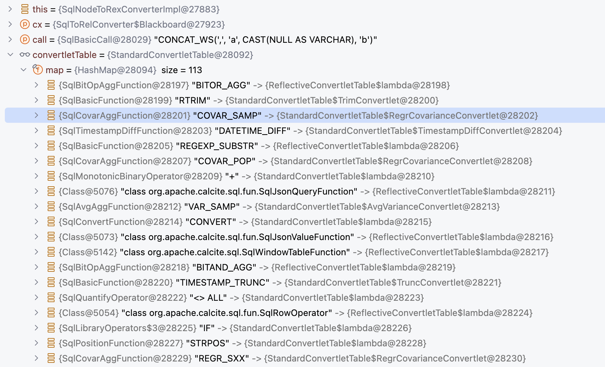
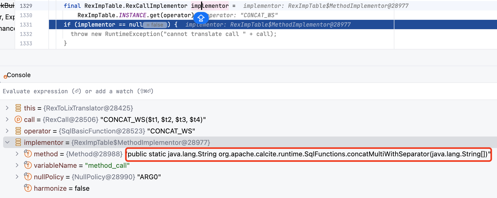
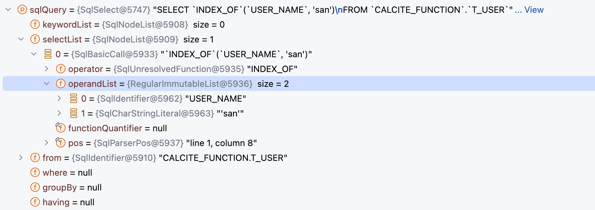
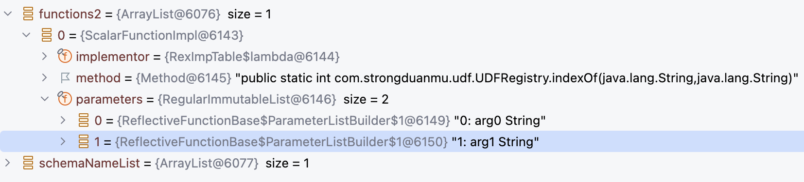
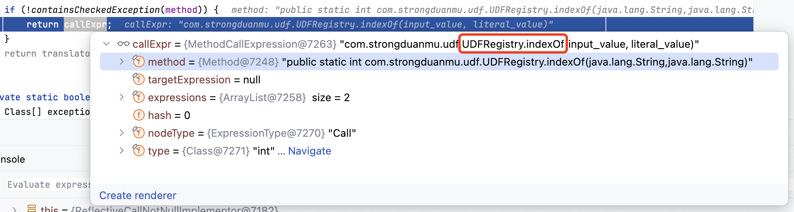
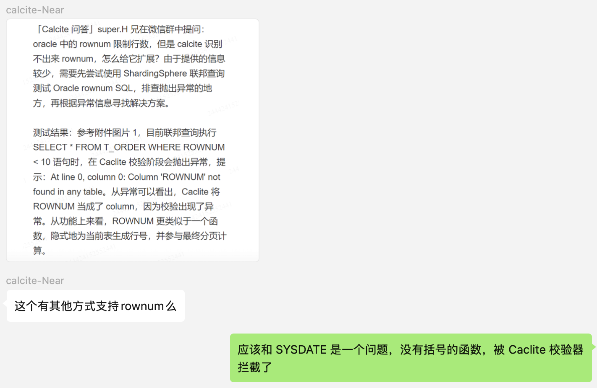
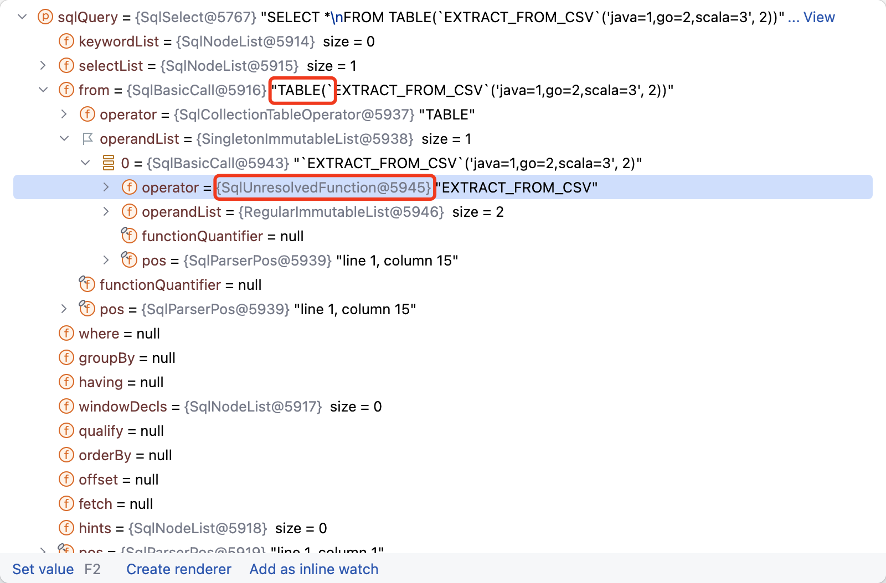
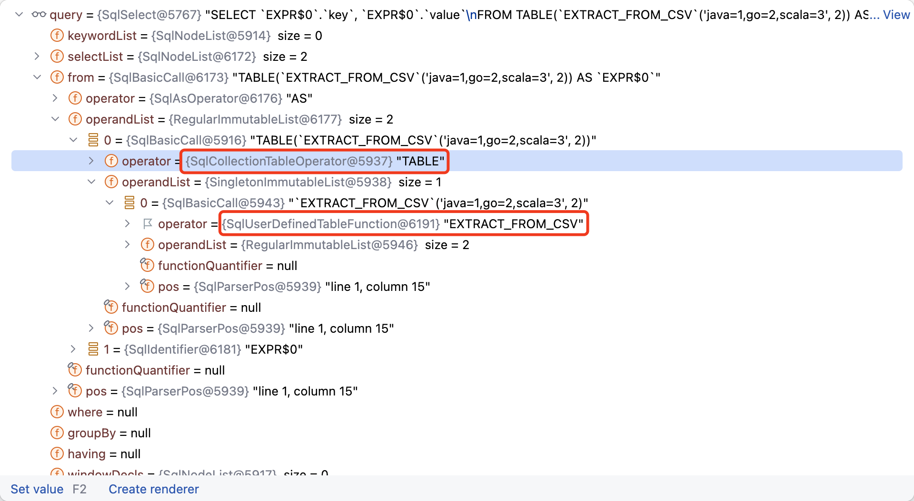

> 注意：本文基于 [Calcite main 分支 60e0a3f](https://github.com/apache/calcite/commit/60e0a3f441a009e55a36cac192253a436bec3f6d) 版本源码进行学习研究，其他版本可能会存在实现逻辑差异，对源码感兴趣的读者**请注意版本选择**。

## 前言

最近，很多朋友咨询关于 `Calcite UDF` 实现和扩展的问题，在之前 [Apache Calcite System Catalog 实现探究](https://strongduanmu.com/blog/explore-apache-calcite-system-catalog-implementation.html)一文中，我们简单介绍过 `Catalog` 中的 `Function` 对象，也了解到 Calcite 内置了很多函数实现，但在实际使用中内置函数往往无法满足要求，用户需要能够根据自己的需求，灵活地注册新的函数。Caclite 允许用户动态注册 UDF 函数，从而实现更加复杂的 SQL 逻辑，下面本文将深入探讨 Calcite 函数的实现原理，以及 UDF 函数的扩展方式，帮助大家更好地在项目中使用 Calcite UDF。

## Calcite 函数简介

在日常开发、数据分析工作中，我们除了会使用常用的 SQL 语句外，还会经常用到函数来实现一些特殊功能，函数功能的强弱直接会影响我们的开发效率。Calcite 作为当前流行的计算引擎，对函数功能也有较好的支持，它内置了不同数据库的上百种常用函数，可以直接调用执行。此外，Calcite 也提供了 UDF 自定义函数能力，用户可以通过 Schema 注册 UDF，从而实现更灵活地 SQL 运算逻辑。

在了解 UDF 函数实现和扩展前，我们先来了解下 Calcite 函数的基本概念。Calcite 对函数的定义是：**接受参数并返回结果的命名表达式**，函数一般通过 Schema 进行注册，然后使用 `Schema#getFunctions` 获取函数，获取函数时会根据参数类型进行过滤。下面是 Schema 中 `Function` 接口声明：

```java
public interface Function {
    List<FunctionParameter> getParameters();
}
```

Function 接口提供了 `getParameters` 获取函数参数的方法，它包含了 `ScalarFunction`、`AggregateFunction`、`TableFunction` 和 `TableMarco` 等几个主要的子接口。ScalarFunction 对应标量函数，也就是函数返回的结果为一个标量，AggregateFunction 对应聚合函数，会将多个值聚合计算为一个标量返回。

TableFunction 和 TableMacro 都对应了表函数，会返回一个表，他们的区别是 TableMacro 会在编译期间进行调用，编译期展开表达式允许 Calcite 实现更加强大的查询优化，例如我们可以对视图在编译期进行展开。相比于 TableMacro，TableFunction 则需要在执行阶段才能知道表的结果。

下图展示了 Function 的继承体系，Function 接口的 4 个子接口 `ScalarFunction`、`AggregateFunction`、`TableFunction` 和 `TableMarco`，他们都有对应的 `Impl` 实现类，实现类中定义了很多函数处理相关的方法，下面小节我们将分别对这几类函数的内部实现进行探究。




## 内置函数实现探究

### 标量函数

标量函数（`ScalarFunction`）是指**将输入数据转换为输出数据的函数，通常用于对单个字段值进行计算和转换**。例如：`ABS(num)` 函数，它负责将每行输入的 `num` 字段值转换为绝对值再输出。

下图展示了标量函数在 Schema 对象中的继承体系，核心的实现逻辑在 `ScalarFunctionImpl` 类中，它实现了 `ScalarFunction` 和 `ImplementableFunction` 接口，并继承了 `ReflectiveFunctionBase` 抽象类，下面我们分别来介绍下这些接口和类的作用。


* ScalarFunction 接口：

`ScalarFunction` 接口继承了 `Function` 接口，并在接口中声明了 `getReturnType` 方法，用于表示标量函数返回值的类型。

```java
/**
 * Function that returns a scalar result.
 */
public interface ScalarFunction extends Function {
    /**
     * Returns the return type of this function, constructed using the given
     * type factory.
     *
     * @param typeFactory Type factory
     */
    RelDataType getReturnType(RelDataTypeFactory typeFactory);
}
```

* ImplementableFunction 接口：

`ImplementableFunction` 接口用于声明该函数可以转换为 Java 代码进行执行，接口中提供了 `getImplementor` 方法，可以返回一个函数实现器 `CallImplementor`。

```java
/**
 * Function that can be translated to java code.
 *
 * @see ScalarFunction
 * @see TableFunction
 */
public interface ImplementableFunction extends Function {
    /**
     * Returns implementor that translates the function to linq4j expression.
     *
     * @return implementor that translates the function to linq4j expression.
     */
    CallImplementor getImplementor();
}
```

`CallImplementor` 接口中声明了 `implement` 方法，可以将函数转换为 `linq4j` 表达式，用于函数逻辑的调用（`linq4j` 参考了 `.NET` 中的 `LINQ（Language-Integrated Query）` 功能，可以实现类似于 SQL 的声明式语法，后续我们专门写一篇文章介绍 `linq4j`）。

```java
public interface CallImplementor {
    /**
     * Implements a call.
     *
     * @param translator Translator for the call
     * @param call Call that should be implemented
     * @param nullAs The desired mode of {@code null} translation
     * @return Translated call
     */
    Expression implement(RexToLixTranslator translator, RexCall call, RexImpTable.NullAs nullAs);
}
```

* ReflectiveFunctionBase 抽象类：

`ReflectiveFunctionBase` 抽象类用于处理基于方法实现的函数，负责将方法参数映射为 `List<FunctionParameter>`。在初始化 ReflectiveFunctionBase 时，会传入函数逻辑对应的 `Method` 对象，`ParameterListBuilder` 类会根据 method 对象构造 `List<FunctionParameter>`。

```java
/**
 * Creates a ReflectiveFunctionBase.
 *
 * @param method Method that is used to get type information from
 */
protected ReflectiveFunctionBase(Method method) {
    this.method = method;
    this.parameters = builder().addMethodParameters(method).build();
}
```

`ParameterListBuilder` 类的核心逻辑为 `addMethodParameters` 方法，内部会遍历方法参数，通过 ReflectUtil 工具类获取参数名称（优先从 Parameter 注解中获取名称，无注解则使用参数名）和参数是否可选（优先从 Parameter 注解中获取是否可选，无注解则为 false），然后将 `type`、`name` 和 `optional` 参数传入 `add` 方法，用于创建 FunctionParameter 对象。

```java
public ParameterListBuilder addMethodParameters(Method method) {
    final Class<?>[] types = method.getParameterTypes();
    for (int i = 0; i < types.length; i++) {
        add(types[i], ReflectUtil.getParameterName(method, i), ReflectUtil.isParameterOptional(method, i));
    }
    return this;
}
```

`add` 方法实现逻辑如下，主要将传入的 `type` 参数通过 `typeFactory` 构建为 `RelDataType` 类型，将 `name` 和 `optional` 封装到对应的 `FunctionParameter` 接口方法中。此外，还根据参数的个数生成了 `ordinal` 序号，并封装到 `getOrdinal` 方法中。

```java
public ParameterListBuilder add(final Class<?> type, final String name, final boolean optional) {
    final int ordinal = builder.size();
    builder.add(new FunctionParameter() {
        @Override
        public String toString() {
            return ordinal + ": " + name + " " + type.getSimpleName() + (optional ? "?" : "");
        }
        
        // 基于 0 的参数序号
        @Override
        public int getOrdinal() {
            return ordinal;
        }
        
        // 参数名称
        @Override
        public String getName() {
            return name;
        }
        
        // 参数类型
        @Override
        public RelDataType getType(RelDataTypeFactory typeFactory) {
            return typeFactory.createJavaType(type);
        }
        
        // 参数是否可选，可选参数可以在函数调用时省略
        @Override
        public boolean isOptional() {
            return optional;
        }
    });
    return this;
}
```

除了 FunctionParameter 构建逻辑外，ReflectiveFunctionBase 还提供了 `classHasPublicZeroArgsConstructor` 和 `classHasPublicFunctionContextConstructor` 方法，用于判断函数逻辑类是否提供了无关构造方法，以及包含 `FunctionContext`（提供函数调用的相关信息，可以使函数在构造期间提前执行，无需每次调用执行，具体可以参考 [FunctionContext](https://github.com/apache/calcite/blob/b2e9e6cba1e2ce28368d1281f527a9e53f4628ca/core/src/main/java/org/apache/calcite/schema/FunctionContext.java#L24-L85)）的构造方法，这些构造方法会在函数初始化时进行调用，不包含可能会抛出异常。

* ScalarFunctionImpl 类：

`ScalarFunctionImpl` 类实现了 ScalarFunction 和 ImplementableFunction 接口中的相关方法，内部方法通过调用如下的私有构造方法进行初始化。如下展示了 ScalarFunctionImpl 了的构造方法，首先会调用 `super(method)` 初始化函数参数 `List<FunctionParameter>`，然后将函数实现器 CallImplementor 存储在成员变量中。 

```java
/**
 * Private constructor.
 */
private ScalarFunctionImpl(Method method, CallImplementor implementor) {
    super(method);
    this.implementor = implementor;
}
```

ScalarFunctionImpl 核心的创建逻辑是由公共的 `create` 方法触发的，外部调用将函数方法 Method 对象传递给 `create` 方法。方法内部会先判断 Method 是否为静态方法，非静态方法如果没有无参构造方法，或者没有包含 FunctionContext 的构造方法，则会抛出异常。

如果检查通过，则根据 Method 对象创建 CallImplementor 函数实现器，然后调用私有的 ScalarFunctionImpl 构造方法，将 Method 对象和 CallImplementor 函数实现器传递给构造方法。

```java
public static ScalarFunction create(Method method) {
    if (!isStatic(method)) {
        Class<?> clazz = method.getDeclaringClass();
        if (!classHasPublicZeroArgsConstructor(clazz) && !classHasPublicFunctionContextConstructor(clazz)) {
            throw RESOURCE.requireDefaultConstructor(clazz.getName()).ex();
        }
    }
    CallImplementor implementor = createImplementor(method);
    return new ScalarFunctionImpl(method, implementor);
}
```

创建 CallImplementor 函数实现器的逻辑如下，首先会调用 `getNullPolicy` 方法，返回 `NullPolicy` 枚举类型用于描述函数（或运算符）何时返回 NULL。

```java
private static CallImplementor createImplementor(final Method method) {
    final NullPolicy nullPolicy = getNullPolicy(method);
    return RexImpTable.createImplementor(new ReflectiveCallNotNullImplementor(method), nullPolicy, false);
}
```

`NullPolicy` 枚举类包含了 `ALL`、`STRICT`、`SEMI_STRICT`、`ANY`、`ARG0` 和 `NONE`。`ALL` 表示只有所有的参数为 NULL，函数结果采返回 NULL。`STRICT` 表示只有一个参数为 NULL 使，函数结果返回 NULL。`SEMI_STRICT` 表示有 1 个或多个参数为 NULL 时，函数结果返回 NULL。`ANY` 表示只要有任意一个参数为 NULL，则函数结果返回 NULL，`ANY` 和 `STRICT` 比较类似，Caclite 更推荐使用 `STRICT` 类型。`ARG0` 表示第一个参数为 NULL 时，函数结果返回 NULL。`NONE` 表示不指定 NULL 策略，由函数逻辑进行处理。

这些枚举类型中，`STRICT`、`SEMI_STRICT` 比较常用，Calcite 分别为他们提供了 `Strict` 和 `SemiStrict` 注解，可以标注在函数方法或类上，用来声明 NULL 值策略。

```java
public enum NullPolicy {
    /**
     * Returns null if and only if all of the arguments are null;
     * If all of the arguments are false return false otherwise true.
     */
    ALL,
    /**
     * Returns null if and only if one of the arguments are null.
     */
    STRICT,
    /**
     * Returns null if one of the arguments is null, and possibly other times.
     */
    SEMI_STRICT,
    /**
     * If any of the arguments are null, return null.
     */
    ANY,
    /**
     * If the first argument is null, return null.
     */
    ARG0, NONE
}
```

获取到 NullPolicy 后，调用 `RexImpTable.createImplementor()` 方法创建函数实现器，由于函数实现器中的 `implement` 方法在执行阶段才会调用，我们将在后面的 ScalarFunction 案例中进行详细介绍。

### 聚合函数

聚合函数（`AggregateFunction`）是指**将多个值组合转换为标量值输出的函数**。例如：`SUM(num)` 函数，它负责将每行输入的 `num` 字段值进行累加，最终输出累加总和。

Calcite 聚合函数内部包含了一个累加过程，如下面的伪代码所示，`Accumulator` 累加器内部维护了一个 `sum` 变量，用于存储 `SUM` 函数计算的累加值。聚合函数调用 `init` 方法进行初始化，此时会创建一个累加器对象，并将 `sum` 初始化为 0，然后通过 `add` 方法将当前行的值添加到累加器中进行计算。如果有多个累加器，则可以使用 `merge` 方法将两个累加器中的值合二为一，最后计算完成可以通过 `result` 方法返回结果。

```java
// 聚合函数累加器
struct Accumulator {
    final int sum;
}

// 聚合函数初始化方法
Accumulator init() {
    return new Accumulator(0);
}

// 聚合函数累加方法
Accumulator add(Accumulator a, int x) {
    return new Accumulator(a.sum + x);
}

// 聚合函数合并方法
Accumulator merge(Accumulator a, Accumulator a2) {
    return new Accumulator(a.sum + a2.sum);
}

// 聚合函数获取结果方法
int result(Accumulator a) {
    return a.sum;
}
```

下图展示了聚合函数在 Schema 对象中的继承体系，核心的实现逻辑在 `AggregateFunctionImpl` 类中，它实现了 `AggregateFunction` 和 `ImplementableAggFunction` 接口，下面我们分别来介绍下这些接口和类的作用。


* AggregateFunction 接口：

`AggregateFunction` 接口继承了 `Function` 接口，并在接口中声明了 `getReturnType` 方法，用于表示聚合函数返回值的类型。

```java
/**
 * Function that combines several values into a scalar result.
 */
public interface AggregateFunction extends Function {
    /**
     * Returns the return type of this function, constructed using the given
     * type factory.
     *
     * @param typeFactory Type factory
     */
    RelDataType getReturnType(RelDataTypeFactory typeFactory);
}
```

* ImplementableAggFunction 接口：

`ImplementableAggFunction` 接口用于声明该函数可以转换为 Java 代码进行执行，接口中提供了 `getImplementor` 方法，可以返回一个聚合函数实现器 `AggImplementor`，`windowContext` 用于标记当前聚合函数是否包含在窗口运算中。

```java
public interface ImplementableAggFunction extends AggregateFunction {
    /**
     * Returns implementor that translates the function to linq4j expression.
     *
     * @param windowContext true when aggregate is used in window context
     * @return implementor that translates the function to linq4j expression.
     */
    AggImplementor getImplementor(boolean windowContext);
}
```

`AggImplementor` 接口可以实现聚合函数所需的初始化、累加以及获取结果方法，如下展示了 `AggImplementor` 接口中的方法，`getStateType` 方法可以返回聚合函数实现时，中间变量的类型，例如：字符串连接函数，它的中间变量类型可以是 StringBuilder。`implementReset`、`implementAdd` 和 `implementResult` 分别对应了聚合函数的初始化、累加和获取结果方法，AggImplementor 接口的实现类，会根据不同的聚合函数类型实现其逻辑。

```java
public interface AggImplementor {
    
    // 返回聚合函数实现时，中间变量的类型
    // 例如：字符串连接函数，它的中间变量类型可以是 StringBuilder
    List<Type> getStateType(AggContext info);
    
    // 将中间变量重置为初识状态
    // 应使用 AggResetContext.accumulator() 来引用状态变量
    void implementReset(AggContext info, AggResetContext reset);
    
    // 将新增加的当前值，累加到中间变量
    void implementAdd(AggContext info, AggAddContext add);
    
    // 根据中间变量计算结果值
    Expression implementResult(AggContext info, AggResultContext result);
}
```

* AggregateFunctionImpl 类：

`AggregateFunctionImpl` 类实现了 `AggregateFunction` 和 `ImplementableAggFunction` 接口，通过私有的构造方法进行初始化，构造方法如下，`declaringClass` 表示聚合函数对应的实现类，`params` 表示聚合函数的参数，`valueTypes` 表示聚合函数参数的类型，`accumulatorType` 表示聚合器的类型，`resultType` 表示函数结果类型。

`initMethod`、`addMethod`、`mergeMethod` 和 `resultMethod` 分别表示聚合函数初始化方法、累加方法、合并方法和结果方法，`isStatic` 表示 `initMethod` 是否为静态方法。

```java
private AggregateFunctionImpl(Class<?> declaringClass, List<FunctionParameter> params, List<Class<?>> valueTypes, Class<?> accumulatorType, Class<?> resultType, Method initMethod, Method addMethod, @Nullable Method mergeMethod, @Nullable Method resultMethod) {
    this.declaringClass = declaringClass;
    this.valueTypes = ImmutableList.copyOf(valueTypes);
    this.parameters = params;
    this.accumulatorType = accumulatorType;
    this.resultType = resultType;
    this.initMethod = requireNonNull(initMethod, "initMethod");
    this.addMethod = requireNonNull(addMethod, "addMethod");
    this.mergeMethod = mergeMethod;
    this.resultMethod = resultMethod;
    this.isStatic = isStatic(initMethod);
    assert resultMethod != null || accumulatorType == resultType;
}
```

由于 AggregateFunctionImpl 构造方法是私有的，通常 Calcite 内部都是通过 `create` 方法来创建 AggregateFunctionImpl 对象，`create` 方法实现逻辑如下：

```java
/**
 * Creates an aggregate function, or returns null.
 */
public static @Nullable AggregateFunctionImpl create(Class<?> clazz) {
    // 获取函数类中的 init 方法
    final Method initMethod = ReflectiveFunctionBase.findMethod(clazz, "init");
    // 获取函数类中的 add 方法
    final Method addMethod = ReflectiveFunctionBase.findMethod(clazz, "add");
    // merge 方法暂未实现
    final Method mergeMethod = null; // TODO:
    // 获取函数类中的 result 方法
    final Method resultMethod = ReflectiveFunctionBase.findMethod(clazz, "result");
    if (initMethod != null && addMethod != null) {
        // A is return type of init by definition
        // A 表示 init 方法的返回类型
        final Class<?> accumulatorType = initMethod.getReturnType();
        // R is return type of result by definition
        // R 表示 result 方法的返回类型
        final Class<?> resultType = resultMethod != null ? resultMethod.getReturnType() : accumulatorType;
        // V is remaining args of add by definition
        // V 表示 add 方法第一个参数之外的类型
        final List<Class> addParamTypes = ImmutableList.copyOf(addMethod.getParameterTypes());
        // 检查 add 方法第一个参数和累加器类型是否一致
        if (addParamTypes.isEmpty() || addParamTypes.get(0) != accumulatorType) {
            throw RESOURCE.firstParameterOfAdd(clazz.getName()).ex();
        }
        final ReflectiveFunctionBase.ParameterListBuilder params = ReflectiveFunctionBase.builder();
        final ImmutableList.Builder<Class<?>> valueTypes = ImmutableList.builder();
        // 跳过第一个构造器参数，从第二个参数开始遍历
        for (int i = 1; i < addParamTypes.size(); i++) {
            final Class type = addParamTypes.get(i);
            // 调用 ReflectUtil 获取参数名称和参数是否可选标记，优先选择 Parameter 注解声明的信息
            final String name = ReflectUtil.getParameterName(addMethod, i);
            final boolean optional = ReflectUtil.isParameterOptional(addMethod, i);
            params.add(type, name, optional);
            valueTypes.add(type);
        }
        // 如下展示了聚合函数中的方法和类型
        // A init()
        // A add(A, V)
        // A merge(A, A)
        // R result(A)        
        return new AggregateFunctionImpl(clazz, params.build(), valueTypes.build(), accumulatorType, resultType, initMethod, addMethod, mergeMethod, resultMethod);
    }
    return null;
}
```

`create` 方法首先会从 `clazz` 类中获取 `init`、`add`、`merge` 和 `result` 对应的 Method 对象，目前 `merge` 方法仍然没有实现，`init` 和 `add` 方法是必须的，否则 `create` 方法会直接返回 null，外部调用的地方会判断是否允许函数为 null。

如果 `init` 和 `add` 方法不为 null，则会从 Method 对象中获取聚合函数相关的类型及参数信息，代码中使用 A 表示 init 方法的返回类型，使用 R 表示 result 方法的返回类型，使用 V 表示 add 方法第一个参数之外的类型，并检查 add 方法中的第一个参数是否和累加器类型一致，不一致则抛出异常。

然后循环 `add` 方法的参数，循环时会跳过第一个累加器参数，从第二个参数开始遍历，然后使用 `ReflectUtil` 优先从 `Parameter` 注解中获取参数名称和参数是否可选标记，循环过程中会把参数和参数类型存储在 params 和 valueTypes 中，最终所有的参数会传递给 `AggregateFunctionImpl` 私有构造方法，用于创建 AggregateFunctionImpl 对象。

```java
@Override
public AggImplementor getImplementor(boolean windowContext) {
    return new RexImpTable.UserDefinedAggReflectiveImplementor(this);
}
```

`AggregateFunctionImpl#getImplementor` 方法用于获取聚合函数实现器，参数 `windowContext` 表示当前是否是位于窗口运算中，聚合函数实现器直接调用了 `RexImpTable.UserDefinedAggReflectiveImplementor` 构造方法，并将当前的聚合函数实现类对象传递进去，实现器内部具体的逻辑，我们后文再详细分析，此处暂时跳过。

### 表函数 & 表宏

表函数（`TableFunction`）是指**在执行阶段将某些数据转换为表的函数**，表宏（`TableMacro`）是指**在编译阶段将某些数据转换为表的函数**。表函数或者表宏，通常会使用在 FROM 子句中，作为一张表进行使用，例如：`SELECT * FROM XML_EXTRACT("/opt/csv/test.csv")`，`XML_EXTRACT` 就是一个表函数，它负责从 `test.csv` 文件中获取数据，并返回一张表。

下图展示了表函数和表宏在 Schema 对象中的继承体系，表函数的核心实现逻辑在 `TableFunctionImpl` 类中，它实现了 `ImplementableFunction` 和 `TableFunction` 接口，并继承了 `ReflectiveFunctionBase` 抽象类。表宏的核心实现逻辑在 `TableMarcoImpl` 类中，它实现了 `TableMarco` 接口，并继承了 `ReflectiveFunctionBase` 抽象类，下面我们分别来介绍下这些接口和类的作用。


* TableFunction 接口：

`TableFunction` 接口继承了 `Function` 接口，并在接口中声明了 `getRowType` 方法，用于表示表函数返回表的数据行类型。

```java
public interface TableFunction extends Function {
    // 使用指定参数产生的表对应的数据行类型
    RelDataType getRowType(RelDataTypeFactory typeFactory, List<? extends @Nullable Object> arguments);
    
    // 获取表对应的数据行类型（Java 类型）
    Type getElementType(List<? extends @Nullable Object> arguments);
}
```

* TableFunctionImpl 类：

`TableFunctionImpl` 类实现了 `TableFunction` 和 `ImplementableFunction` 接口，并继承了 `ReflectiveFunctionBase` 抽象类，私有构造方法允许传入函数实现的 Method 对象，以及调用实现逻辑 CallImplementor，`super(method)` 会调用 ReflectiveFunctionBase 抽象类的方法，对函数参数进行处理。

```java
private TableFunctionImpl(Method method, CallImplementor implementor) {
    super(method);
    this.implementor = implementor;
}
```

私有构造方法会被 `create` 方法调用，`create` 方法会传入一个 `Class` 对象，以及函数方法名 `methodName`，根据方法名会查找 `Method` 对象，如果对象为 null，则返回 TableFunction 为 null。

```java
/**
 * Creates a {@link TableFunctionImpl} from a class, looking for a method
 * with a given name. Returns null if there is no such method.
 */
public static @Nullable TableFunction create(Class<?> clazz, String methodName) {
    final Method method = findMethod(clazz, methodName);
    if (method == null) {
        return null;
    }
    return create(method);
}
```

如果 `Method` 对象存在，则继续判断方法是否为静态，如果是非静态方法，则需要提供无参的构造方法，否则抛出异常。此外，表函数返回值需要是 `QueryableTable` 或者 `ScannableTable` 类型，否则表函数直接返回 null。`Method` 对象检查满足条件后，则调用 `createImplementor` 创建方法实现器，再调用私有的 `TableFunctionImpl` 构造方法创建表函数对象。

```java
/**
 * Creates a {@link TableFunctionImpl} from a method.
 */
public static @Nullable TableFunction create(final Method method) {
    // 判断是否为非静态方法
    if (!isStatic(method)) {
        Class clazz = method.getDeclaringClass();
        // 非静态方法，如果没有公有的无参构造方法，则抛出异常
        if (!classHasPublicZeroArgsConstructor(clazz)) {
            throw RESOURCE.requireDefaultConstructor(clazz.getName()).ex();
        }
    }
    final Class<?> returnType = method.getReturnType();
    // 如果表函数返回值不为 QueryableTable 或者 ScannableTable，则直接返回 null
    if (!QueryableTable.class.isAssignableFrom(returnType) && !ScannableTable.class.isAssignableFrom(returnType)) {
        return null;
    }
    // 创建调用实现器
    CallImplementor implementor = createImplementor(method);
    // 创建 TableFunctionImpl 对象
    return new TableFunctionImpl(method, implementor);
}
```

* TableMacro 接口：

`TableMacro` 和 `TableFunction` 接口类似，都继承了 `Function` 接口，但是它是在编译期间进行调用，如下展示了 TableMacro 接口提供的 `apply` 方法，它可以根据传入的参数转换为 TranslatableTable，通过 `TranslatableTable#toRel` 方法，可以得到 `RelNode`。

```java
public interface TableMacro extends Function {
    /**
     * Applies arguments to yield a table.
     *
     * @param arguments Arguments
     * @return Table
     */
    TranslatableTable apply(List<? extends @Nullable Object> arguments);
}
```

* TableMacroImpl 类：

`TableMacroImpl` 类实现了 `TableMacro` 接口，并继承了 `ReflectiveFunctionBase` 抽象类，私有构造方法接受一个 Method 参数，并会调用 `super(method)` 方法，处理函数参数。

```java
/**
 * Private constructor; use {@link #create}.
 */
private TableMacroImpl(Method method) {
    super(method);
}
```

Calcite 内部通过 `create` 方法创建 `TableMacro` 对象，和 `TableFunction` 一样，在创建之前会判断方法是否为非静态方法，非静态方法必须提供公有无参构造方法。然后检查 TableMacro 函数返回值，必须为 `TranslatableTable` 类型，否则返回 null，最后调用 `TableMacroImpl` 构造方法创建表宏对象。

```java
/**
 * Creates a {@code TableMacro} from a method.
 */
public static @Nullable TableMacro create(final Method method) {
    Class clazz = method.getDeclaringClass();
    // 非静态方法，必须提供公有无参构造方法
    if (!isStatic(method)) {
        if (!classHasPublicZeroArgsConstructor(clazz)) {
            throw RESOURCE.requireDefaultConstructor(clazz.getName()).ex();
        }
    }
    final Class<?> returnType = method.getReturnType();
    // 检查表宏返回值是否为 TranslatableTable
    if (!TranslatableTable.class.isAssignableFrom(returnType)) {
        return null;
    }
    return new TableMacroImpl(method);
}
```

TableMacroImpl 类中的 `apply` 方法负责调用 method 方法，并将参数 arguments 传递给该方法，最终会返回 `TranslatableTable` 对象。

```java
@Override
public TranslatableTable apply(List<? extends @Nullable Object> arguments) {
    try {
        Object o = null;
        if (!isStatic(method)) {
            final Constructor<?> constructor = method.getDeclaringClass().getConstructor();
            o = constructor.newInstance();
        }
        return (TranslatableTable) requireNonNull(method.invoke(o, arguments.toArray()), () -> "got null from " + method + " with arguments " + arguments);
    } catch (IllegalArgumentException e) {
        throw new RuntimeException("Expected " + Arrays.toString(method.getParameterTypes()) + " actual " + arguments, e);
    } catch (IllegalAccessException | InvocationTargetException | NoSuchMethodException | InstantiationException e) {
        throw new RuntimeException(e);
    }
}
```

### 函数执行流程

前文我们介绍了标量函数、聚合函数、表函数和表宏中的核心类，下面我们将结合 Calcite 中的 CoreQuidemTest（该测试使用了 [quidem](https://github.com/julianhyde/quidem) 测试框架，可以像编写脚本一样编写测试程序），一起来看看 `functions.iq` 中的函数是如何执行的。下面的 SQL 取自 `functions.iq` 文件，它包含了 `concat_ws` 和 `cast` 两个函数，会将参数按照分隔符进行组装。

```sql
select concat_ws(',', 'a', cast(null as varchar), 'b');
```

测试程序的入口在 [QuidemTest#test](https://github.com/apache/calcite/blob/9f231cc5b91b100b6a6fbc3cd6324873529dbf49/testkit/src/main/java/org/apache/calcite/test/QuidemTest.java#L223) 方法，通过 `getPath` 获取 `functions.iq` 文件路径，然后调用 `checkRun` 中的 `new Quidem(config).execute()` 执行测试用例。我们可以在 `net/hydromatic/quidem/Quidem.java:285` 位置打断点，然后设置条件断点——`sqlCommand instanceof SqlCommand && ((SqlCommand) sqlCommand).sql.equalsIgnoreCase("select concat_ws(',', 'a', cast(null as varchar), 'b')")`，这样可以跟踪上面测试 SQL 的 `checkResult` 断言逻辑。

#### SqlValidator 函数注册

SQL 语句在 Calcite 中执行，首先会调用 [Avatica](https://calcite.apache.org/avatica/) 提供的 JDBC 接口，内部会对 SQL 语句进行解析，得到 SqlNode 对象。然后创建 `SqlValidator` 进行校验，校验器创建逻辑具体参考 [CalcitePrepareImpl#createSqlValidator](https://github.com/apache/calcite/blob/b1308feff49c8b747b3bbb52e1519d334bc984ec/core/src/main/java/org/apache/calcite/prepare/CalcitePrepareImpl.java#L743)，首先会根据 `context.config()` 中配置的 `fun` 属性，获取对应方言中的函数或运算符，具体调用的方法是 `SqlLibraryOperatorTableFactory.INSTANCE.getOperatorTable()`，返回方言对应的函数、运算符表对象。

```java
@Override
public <T> @PolyNull T fun(Class<T> operatorTableClass, @PolyNull T defaultOperatorTable) {
    final String fun = CalciteConnectionProperty.FUN.wrap(properties).getString();
    if (fun == null || fun.equals("") || fun.equals("standard")) {
        return defaultOperatorTable;
    }
    // Parse the libraries
    final List<SqlLibrary> libraryList = SqlLibrary.parse(fun);
    // Load standard plus the specified libraries. If 'all' is among the
    // specified libraries, it is expanded to all libraries (except standard,
    // spatial, all).
    final List<SqlLibrary> libraryList1 = SqlLibrary.expand(ConsList.of(SqlLibrary.STANDARD, libraryList));
    // 根据 libraries 获取对应的 SqlLibraryOperatorTable
    final SqlOperatorTable operatorTable = SqlLibraryOperatorTableFactory.INSTANCE.getOperatorTable(libraryList1);
    return operatorTableClass.cast(operatorTable);
}
```

`SqlLibraryOperatorTableFactory.INSTANCE.getOperatorTable()` 方法内部会遍历 `SqlLibraryOperators` 中的成员变量，获取类型为 `SqlOperator` 的变量，并判断 `LibraryOperator` 指定的方言和当前 `fun` 指定的方言是否一致，如果不匹配则继续比较方言继承的父类是否一致，一致则将 SqlOperator 添加到集合中，并组装为 SqlOperatorTable 返回。

```java
for (Class aClass : classes) {
    for (Field field : aClass.getFields()) {
        try {
            if (SqlOperator.class.isAssignableFrom(field.getType())) {
                final SqlOperator op = (SqlOperator) requireNonNull(field.get(this), () -> "null value of " + field + " for " + this);
                // 判断 Library 是否一致
                if (operatorIsInLibrary(op.getName(), field, librarySet)) {
                    list.add(op);
                }
            }
        } catch (IllegalArgumentException | IllegalAccessException e) {
            throw Util.throwAsRuntime(Util.causeOrSelf(e));
        }
    }
}
```

如果未配置或配置为 `standard`，则使用 `SqlStdOperatorTable.instance()` 创建 `SqlOperatorTable` 标准函数、运算符表对象。然后会将 CalciteCatalogReader 对象添加到集合中，CalciteCatalogReader 对象也实现了 SqlOperatorTable 接口，提供了 `lookupOperatorOverloads` 查找 Schema 中注册的函数和运算符。

```java
private static SqlValidator createSqlValidator(Context context, CalciteCatalogReader catalogReader, UnaryOperator<SqlValidator.Config> configTransform) {
    // 根据 context.config() 中配置的 fun 属性，获取对应方言中的函数或运算符
    // 未配置或配置为 standard，则使用 SqlStdOperatorTable.instance() 创建的标准函数、运算符表对象
    final SqlOperatorTable opTab0 = context.config().fun(SqlOperatorTable.class, SqlStdOperatorTable.instance());
    final List<SqlOperatorTable> list = new ArrayList<>();
    list.add(opTab0);
    // 添加 catalogReader
    list.add(catalogReader);
    // 组装为调用链 Chain
    final SqlOperatorTable opTab = SqlOperatorTables.chain(list);
    final JavaTypeFactory typeFactory = context.getTypeFactory();
    final CalciteConnectionConfig connectionConfig = context.config();
    final SqlValidator.Config config = configTransform.apply(SqlValidator.Config.DEFAULT.withLenientOperatorLookup(connectionConfig.lenientOperatorLookup()).withConformance(connectionConfig.conformance()).withDefaultNullCollation(connectionConfig.defaultNullCollation()).withIdentifierExpansion(true));
    return new CalciteSqlValidator(opTab, catalogReader, typeFactory, config);
}
```

`SqlOperatorTable` 对象实例是一个单例对象，只有在第一次执行 `ReflectiveSqlOperatorTable#init` 方法时才会创建，`init` 方法会使用反射获取 `SqlStdOperatorTable` 类中的成员变量，遍历时会判断变量是否使用 `LibraryOperator` 注解标注，对于有注解但是没有包含 STANDARD 类型的方言函数，直接跳过。处理完成后，会将 SqlOperator 构建为 Map 结果，key 为 SqlOperator 大写名称，value 为 SqlOperator 对象，并存储到 SqlStdOperatorTable 中的 operators 对象中，方便后续使用。

```java
public final SqlOperatorTable init() {
    // Use reflection to register the expressions stored in public fields.
    final List<SqlOperator> list = new ArrayList<>();
    for (Field field : getClass().getFields()) {
        try {
            final Object o = field.get(this);
            if (o instanceof SqlOperator) {
                // Fields do not need the LibraryOperator tag, but if they have it,
                // we index them only if they contain STANDARD library.
                // 获取 LibraryOperator 注解，有注解但是没有 STANDARD 类型的函数为方言函数，直接跳过
                LibraryOperator libraryOperator = field.getAnnotation(LibraryOperator.class);
                if (libraryOperator != null) {
                    if (Arrays.stream(libraryOperator.libraries()).noneMatch(library -> library == SqlLibrary.STANDARD)) {
                        continue;
                    }
                }
                // 标准函数大多不用 LibraryOperator 注解标记，直接添加到集合中
                list.add((SqlOperator) o);
            }
        } catch (IllegalArgumentException | IllegalAccessException e) {
            throw Util.throwAsRuntime(Util.causeOrSelf(e));
        }
    }
    // 将 SqlOperator 构建为 Map 结果，key 为 SqlOperator 大写名称，value 为 SqlOperator 对象
    // 存储到 SqlStdOperatorTable 中的 operators 对象中
    setOperators(buildIndex(list));
    return this;
}
```

至此就完成了 CalciteSqlValidator 函数注册流程，函数和运算符会存储在 SqlOperatorTable 对象中，通过 `CalciteSqlValidator#getOperatorTable` 方法，可以快速获取到 SqlOperatorTable 进行函数和运算符查找。

#### 函数解析和校验

函数注册完成后，按照 Calcite SQL 执行的流程，会先对 SQL 语句进行解析，下图展示了 SQL 中函数解析的结果，`CONCAT_WS` 函数被解析为 `SqlUnresolvedFunction`，它表示该函数在 SQL 解析阶段无法处理，需要通过校验器从 SqlOperatorTable 中查找对应的函数，并将其改写为对应的函数类型，`CAST` 函数被解析为 `SqlCastFunction`，在后续的校验阶段无需再进行处理。


那么，哪些函数会被解析为 `SqlUnresolvedFunction` 类型呢？根据 Julian 在 [Calcite does not return correct SqlKind](https://stackoverflow.com/questions/73066108/calcite-does-not-return-correct-sqlkind) 中的回答，所有函数在解析阶段都会被处理为 SqlUnresolvedFunction 类型，这样能够保持解析器简单、高效、可预测，在 Calcite 校验阶段，会从 SqlOperatorTable 中查找函数，并将 SqlUnresolvedFunction 转换为具体的 Function 对象。

但是实际上，从 Calcite `Parser.jj` 文件来看，不论是标准函数，还是方言函数，都有直接处理为具体 Function 对象的情况，SqlUnresolvedFunction 只是作为最后的处理方式。此外，SqlUnresolvedFunction 也适用于自定义函数场景，这些自定义函数，在 SQL 解析时是无法知道具体的函数对象。

完成 SQL 解析后，Calcite 会调用校验器对 SqlNode 语法树进行校验，参考[深度探究 Apache Calcite SQL 校验器实现原理](https://strongduanmu.com/blog/in-depth-exploration-of-implementation-principle-of-apache-calcite-sql-validator.html#performunconditionalrewrites)一文，我们知道，在校验阶段执行 `performUnconditionalRewrites` 方法时，会判断当前运算符是否为 `SqlUnresolvedFunction`，如果是则调用 `SqlOperatorTable#lookupOperatorOverloads` 方法，从 SqlOperatorTable 中查找函数，查找的范围包括内置函数以及元数据中注册的函数，然后替换 SqlNode 中的函数对象。

```java
// 判断当前 SqlNode 是否为 SqlCall
if (node instanceof SqlCall) {
    ...
    SqlCall call = (SqlCall) node;
    // 获取 SqlKind 类型
    final SqlKind kind = call.getKind();
    // 获取 SqlNode 中包含的运算符
    final List<SqlNode> operands = call.getOperandList();
    for (int i = 0; i < operands.size(); i++) {
        SqlNode operand = operands.get(i);
        ...
        // 每一个运算法调用 performUnconditionalRewrites 并设置到 SqlCall 中
        SqlNode newOperand = performUnconditionalRewrites(operand, childUnderFrom);
        if (newOperand != null && newOperand != operand) {
            call.setOperand(i, newOperand);
        }
    }

    // 当前运算符为未解析函数 SqlUnresolvedFunction
    if (call.getOperator() instanceof SqlUnresolvedFunction) {
        final SqlUnresolvedFunction function = (SqlUnresolvedFunction) call.getOperator();
        final List<SqlOperator> overloads = new ArrayList<>();
        // 从 SqlOperatorTable 中查找函数，查找的范围包括内置函数以及元数据中注册的函数
        opTab.lookupOperatorOverloads(function.getNameAsId(), function.getFunctionType(), SqlSyntax.FUNCTION, overloads, catalogReader.nameMatcher());
        if (overloads.size() == 1) {
          	// 查找到函数则设置新的运算符
            ((SqlBasicCall) call).setOperator(overloads.get(0));
        }
    }
}
```

校验完成后，可以看到 `SqlUnresolvedFunction` 被替换为 `SqlBasicFunction`，它是 SqlFunction 类的一个具体实现，主要用来处理常规的函数格式，例如：`NVL(value, value)`、`LENGTH(string)`、`LTRIM(string)` 等。而 `CAST(NULL AS VARCHAR)` 由于包含了类型信息，SqlBasicFunction 无法处理，因此需要额外定义一个 `SqlCastFunction`。


刚好聊到 `SqlFunction` 对象，我们结合下图，一起来看看 `SqlOperator` 和 `SqlFunction` 继承体系。下图展示了部分 SqlFunction 实现类，除了我们刚刚介绍的 `SqlBasicFunction`、`SqlCastFunction` 和 `SqlUnresolvedFunction` 外，还有 `SqlUserDefinedFunction`、`SqlUserDefinedAggFunction`、`SqlUserDefinedTableFunction` 和 `SqlUserDefinedTableMacro`，他们用于处理用户自定义的函数。


* SqlOperator 抽象类：

`SqlOperator` 代表了 SQL 运算符，具体包括函数、运算符（例如：`=`）和语法结构（例如：`CASE` 语句），运算符可以表示查询级表达式（例如：`SqlSelectOperator`），也可以表示行级表达式（例如：`SqlBetweenOperator`）。

SqlOperator 不是 SQL 解析树中的 SqlNode 节点，它具体表示了 SqlNode 所对应的运算符类型。运算符中通常包含了若干个操作数，例如：除法运算符中包含两个操作数，分别是分子和分母，而在 SqlFunction 函数中，参数则是操作数。

如下展示了 SqlOperator 抽象类的核心字段和方法，包含了 `name`、`kind` 等表示名称、类型的基础字段，以及用于区分计算优先级的 `leftPrec` 和 `rightPrec`，此外，还包含了 `returnTypeInference`、`operandTypeInference` 字段，分别用于推断返回类型、操作数类型。

```java
public abstract class SqlOperator {
    // 运算符/函数名称
    private final String name;
    // SqlNode 类型，例如：EQUALS，可以使用 exp.isA(EQUALS) 判断
    public final SqlKind kind;
    // 运算符绑定到左侧表达式的优先级，如果运算符是左结合，则此优先级低于右侧优先级
    private final int leftPrec;
    // 运算符绑定到右侧表达式的优先级，如果运算符是左结合，则此优先级高于右侧优先级
    private final int rightPrec;
    // 推断运算符调用后的返回类型
    private final @Nullable SqlReturnTypeInference returnTypeInference;
    // 推断操作数的类型
    private final @Nullable SqlOperandTypeInference operandTypeInference;
    // 用于校验操作数类型
    private final @Nullable SqlOperandTypeChecker operandTypeChecker;
    // 返回运算符的语法类型
    public abstract SqlSyntax getSyntax();
    // 推断运算符调用后的返回类型，仅在操作数的数量和类型校验后调用
    public RelDataType inferReturnType(SqlOperatorBinding opBinding) {...}
}
```

* SqlFunction 类：

`SqlFunction` 继承了 `SqlOperator`，是用来表示函数调用语法的运算符，SqlFunction 中额外维护了 `category` 和 `sqlIdentifier` 字段，category 表示函数的分类，主要包括：`STRING`、`NUMERIC`、`TIMEDATE`、`SYSTEM` 等函数类型，完整函数类型可查看 [SqlFunctionCategory](https://github.com/apache/calcite/blob/edbd35acf76dbd44cc148f036d0d02cbe2105c81/core/src/main/java/org/apache/calcite/sql/SqlFunctionCategory.java#L33)，sqlIdentifier 表示函数的全限定名称，内置函数为 `null`。

```java
public class SqlFunction extends SqlOperator {
    // SQL 函数分类
    private final SqlFunctionCategory category;
    // 函数的全限定名称，内置函数为 null
    private final @Nullable SqlIdentifier sqlIdentifier;
    
    protected SqlFunction(String name, @Nullable SqlIdentifier sqlIdentifier, SqlKind kind, @Nullable SqlReturnTypeInference returnTypeInference, @Nullable SqlOperandTypeInference operandTypeInference, @Nullable SqlOperandTypeChecker operandTypeChecker, SqlFunctionCategory category) {
        // SqlFunction 默认传递给父类 SqlOperator 的 leftPrec 和 rightPrec 为 100
        super(name, kind, 100, 100, returnTypeInference, operandTypeInference, operandTypeChecker);
        this.sqlIdentifier = sqlIdentifier;
        this.category = requireNonNull(category, "category");
    }
    
    // 获取语法类型，SqlSyntax.FUNCTION 表示 Foo(x, y) 格式的函数
    @Override
    public SqlSyntax getSyntax() {
        return SqlSyntax.FUNCTION;
    }
}
```

* SqlBasicFunction 类：

`SqlBasicFunction` 类继承了 `SqlFunction`，它是常规函数（例如：`NVL(value, value)`、`LENGTH(string)`、`LTRIM(string)`）的具体实现类，由于该类字段都是 `final` 类型，因此 SqlFunction 对象是不可变的，只允许通过 `with` 方法修改字段，然后创建一个新的对象。

SqlBasicFunction 字段中记录了 SqlSyntax，允许注册不同类型的函数语法，全部语法类型可以参考 [SqlSyntax](https://github.com/apache/calcite/blob/db60219198442f2c60345fda95a117d379d87a61/core/src/main/java/org/apache/calcite/sql/SqlSyntax.java#L28)。此外，还提供了 `deterministic` 和 `dynamic` 两个属性，`deterministic` 表示是否是确定函数，即：是否传入相同操作数时返回相同结果，默认为 true，`dynamic` 则表示是否是动态函数，即：是否传入相同操作数时返回不同结果，默认为 false，动态函数不能被缓存。`monotonicityInference` 是一个函数式接口，用于推测函数单调性的策略，入参是 SqlOperatorBinding，表示 SqlOperator 与操作数之间的绑定关系，出参则是 [SqlMonotonicity](https://github.com/apache/calcite/blob/571731b80a58eb095ebac7123285c375e7afff90/core/src/main/java/org/apache/calcite/sql/validate/SqlMonotonicity.java#L22)，表示 SQL 中值的单调性。

```java
public class SqlBasicFunction extends SqlFunction {
    // 语法类型，可以使用 withSyntax 修改
    private final SqlSyntax syntax;
    // 是否是确定函数，即：是否传入相同操作数时返回相同结果，默认为 true
    private final boolean deterministic;
    // 操作数处理器
    private final SqlOperandHandler operandHandler;
    // 校验调用的策略，目前没有发现使用场景
    private final int callValidator;
    // 推断函数单调性的策略
    // 入参是 SqlOperatorBinding，表示 SqlOperator 与操作数之间的绑定关系
    // 出参是 SqlMonotonicity，表示 SQL 中值的单调性
    private final Function<SqlOperatorBinding, SqlMonotonicity> monotonicityInference;
    // 是否是动态函数，即：是否传入相同操作数时返回不同结果，默认为 false，动态函数不能被缓存
    private final boolean dynamic;
}
```

* SqlCastFunction 类：

`SqlCastFunction` 类和 `SqlBasicFunction` 平级，都继承了 `SqlFunction`，它表示了常规函数之外的特殊函数，此处表示 `CAST(NULL AS VARCHAR)` 函数，其他特殊函数也有相应的函数类表示。

如下展示了 SqlCastFunction 中的核心方法，`getSignatureTemplate` 方法会返回一个模板，描述如何构建运算符签名，以 CAST 函数为例，`{0}` 表示运算符 CAST，`{1}`、`{2}`、`{3}` 是操作数。`getSyntax` 方法此处返回的是 `SqlSyntax.SPECIAL` 语法类型，它表示特殊语法，例如：CASE、CAST 运算符。`getMonotonicity` 方法用于获取函数的单调性，会根据函数操作数中配置的排序规则进行比较，如果排序规则的比较器不同，则返回 NOT_MONOTONIC，如果操作数的类型族包含在 `nonMonotonicCasts` 中，同样会返回 NOT_MONOTONIC 单调性，如果都不满足，则会返回第一个操作数的单调性。

```java
public class SqlCastFunction extends SqlFunction {
    
    // 所有不保持单调性的类型转换映射，getMonotonicity 方法根据 map 判断，包含在其中的，则返回 NOT_MONOTONIC
    private final SetMultimap<SqlTypeFamily, SqlTypeFamily> nonMonotonicCasts = ImmutableSetMultimap.<SqlTypeFamily, SqlTypeFamily>builder().put(SqlTypeFamily.EXACT_NUMERIC, SqlTypeFamily.CHARACTER).put(SqlTypeFamily.NUMERIC, SqlTypeFamily.CHARACTER).put(SqlTypeFamily.APPROXIMATE_NUMERIC, SqlTypeFamily.CHARACTER).put(SqlTypeFamily.DATETIME_INTERVAL, SqlTypeFamily.CHARACTER).put(SqlTypeFamily.CHARACTER, SqlTypeFamily.EXACT_NUMERIC).put(SqlTypeFamily.CHARACTER, SqlTypeFamily.NUMERIC).put(SqlTypeFamily.CHARACTER, SqlTypeFamily.APPROXIMATE_NUMERIC).put(SqlTypeFamily.CHARACTER, SqlTypeFamily.DATETIME_INTERVAL).put(SqlTypeFamily.DATETIME, SqlTypeFamily.TIME).put(SqlTypeFamily.TIMESTAMP, SqlTypeFamily.TIME).put(SqlTypeFamily.TIME, SqlTypeFamily.DATETIME).put(SqlTypeFamily.TIME, SqlTypeFamily.TIMESTAMP).build();
    
    // 构造方法传入 name 和 kind，SAFE_CAST 和 CAST 类似，它转换失败时会返回 NULL，而不是异常
    public SqlCastFunction(String name, SqlKind kind) {
        super(name, kind, returnTypeInference(kind == SqlKind.SAFE_CAST), InferTypes.FIRST_KNOWN, null, SqlFunctionCategory.SYSTEM);
        checkArgument(kind == SqlKind.CAST || kind == SqlKind.SAFE_CAST, kind);
    }
    
    // 返回一个模板，描述如何构建运算符签名，以 CAST 函数为例，{0} 表示运算符 CAST，{1}、{2}、{3} 是操作数
    @Override
    public String getSignatureTemplate(final int operandsCount) {
        assert operandsCount <= 3;
        return "{0}({1} AS {2} [FORMAT {3}])";
    }
    
    // 获取语法类型，SqlSyntax.SPECIAL 表示特殊语法，例如：CASE、CAST 运算符
    @Override
    public SqlSyntax getSyntax() {
        return SqlSyntax.SPECIAL;
    }
    
    @Override
    public SqlMonotonicity getMonotonicity(SqlOperatorBinding call) {
        // 获取第一个操作数类型，CAST 原始类型
        final RelDataType castFromType = call.getOperandType(0);
        // 获取第一个操作数类型族
        final RelDataTypeFamily castFromFamily = castFromType.getFamily();
        // 获取第一个操作数排序规则对应的排序器
        final Collator castFromCollator = castFromType.getCollation() == null ? null : castFromType.getCollation().getCollator();
        // 获取第二个操作数类型，CAST 目标类型
        final RelDataType castToType = call.getOperandType(1);
        // 获取第二个操作数类型族
        final RelDataTypeFamily castToFamily = castToType.getFamily();
        // 获取第二个操作数排序规则对应的排序器
        final Collator castToCollator = castToType.getCollation() == null ? null : castToType.getCollation().getCollator();
        // 如果两个操作数的排序器不同，则返回 NOT_MONOTONIC
        if (!Objects.equals(castFromCollator, castToCollator)) {
            // Cast between types compared with different collators: not monotonic.
            return SqlMonotonicity.NOT_MONOTONIC;
            // 如果两个操作数的类型族包含在 nonMonotonicCasts 中，则返回 NOT_MONOTONIC
        } else if (castFromFamily instanceof SqlTypeFamily && castToFamily instanceof SqlTypeFamily && nonMonotonicCasts.containsEntry(castFromFamily, castToFamily)) {
            return SqlMonotonicity.NOT_MONOTONIC;
        } else {
            // 否则返回第一个操作数的单调性策略
            return call.getOperandMonotonicity(0);
        }
    }
}
```

除了以上介绍的 `SqlOperator`、`SqlFunction`、`SqlBasicFunction` 以及 `SqlCastFunction`，其他的函数运算符，大家可以根据兴趣进行探索，本文就不再一一介绍，下面的小节，我们将继续跟踪函数语句的执行。

#### SQL 优化和函数执行

完成 SQL 语句的解析和校验后，我们就得到了一个包含不同 SqlFunction 运算符的 SqlNode 语法树，Caclite JDBC 流程会调用 `sqlToRelConverter.convertQuery(sqlQuery, needsValidation, true)`，将 SqlNode 转换为关系代数表达式 RelNode。

由于示例 SQL 中的函数位于投影列中，因此我们只需要关注 Projection 转换逻辑即可，下面展示了 `SqlToRelConverter#convertSelectList` 的部分转换逻辑，投影列会调用 [Blackboard](https://github.com/apache/calcite/blob/98b252b36c84c4715c5bbe8c8a65355c103b3f9e/core/src/main/java/org/apache/calcite/sql2rel/SqlToRelConverter.java#L5116) 对象的 `convertExpression` 方法，该类实现了 `SqlVisitor` 接口，可以用于遍历 AST 处理对应 SqlNode 转换。

```java
// Project select clause.
int i = -1;
for (SqlNode expr : selectList) {
    ++i;
    final SqlNode measure = SqlValidatorUtil.getMeasure(expr);
    final RexNode e;
    if (measure != null) {
        ...
    } else {
        // 调用 Blackboard 对象 convertExpression 方法，该类实现了 SqlVisitor，用于遍历 AST 处理对应 SqlCall 转换
        e = bb.convertExpression(expr);
    }
    exprs.add(e);
    fieldNames.add(deriveAlias(expr, aliases, i));
}
```

由于 `expr` 是一个 `SqlBasicCall`，遍历语法树时会调用 `visit(SqlCall call)` 方法，该方法内部会调用 `exprConverter.convertCall` 方法，exprConverter 对应的类是 `SqlNodeToRexConverter` 用于将 SqlNode 转换为 `RexNode` 行表达式。

```java
public RexNode visit (SqlCall call){
    if (agg != null) {
        final SqlOperator op = call.getOperator();
        if (window == null && (op.isAggregator() || op.getKind() == SqlKind.FILTER || op.getKind() == SqlKind.WITHIN_DISTINCT || op.getKind() == SqlKind.WITHIN_GROUP)) {
            return requireNonNull(agg.lookupAggregates(call), () -> "agg.lookupAggregates for call " + call);
        }
    }
    // 调用 SqlNodeToRexConverter#convertCall 方法，SqlNodeToRexConverter 用于将 SqlNode 转换为 RexNode 行表达式
    return exprConverter.convertCall(this, new SqlCallBinding(validator(), scope, call).permutedCall());
}
```

`SqlNodeToRexConverter#convertCall` 内部则是调用 `convertletTable` 获取 `SqlRexConvertlet`，然后调用 `SqlRexConvertlet#convertCall` 转换为 RexNode。



`SqlRexConvertlet#convertCall` 通过反射调用 `StandardConvertletTable#convertFunction` 方法，`CONCAT_WS` 函数就会调用该方法进行转换，`CAST` 函数则会调用 `StandardConvertletTable#convertCast` 方法。Calcite 支持的运算符、函数转换逻辑，可以参考 [StandardConvertletTable](https://github.com/strongduanmu/calcite/blob/c8cb56525dbc908da4a9081f062d87adfe27ab80/core/src/main/java/org/apache/calcite/sql2rel/StandardConvertletTable.java#L120) 构造方法。

```java
public RexNode convertFunction(SqlRexContext cx, SqlFunction fun, SqlCall call) {
    // 转换操作数为 RexNode
    final List<RexNode> exprs = convertOperands(cx, call, SqlOperandTypeChecker.Consistency.NONE);
    if (fun.getFunctionType() == SqlFunctionCategory.USER_DEFINED_CONSTRUCTOR) {
        return makeConstructorCall(cx, fun, exprs);
    }
    RelDataType returnType = cx.getValidator().getValidatedNodeTypeIfKnown(call);
    if (returnType == null) {
        returnType = cx.getRexBuilder().deriveReturnType(fun, exprs);
    }
    // 调用 RexBuilder#makeCall 转换
    return cx.getRexBuilder().makeCall(call.getParserPosition(), returnType, fun, exprs);
}
```

转换完成后，我们就得到了逻辑执行计划树 `RelNode Tree`，通过 `RelOptUtil.toString()` 方法输出，可以得到如下结构，`CONCAT_WS` 函数被转换为 `LogicalProject(EXPR$0=[CONCAT_WS(',', 'a', null:VARCHAR, 'b')])`，而 `CAST` 函数则转换为 `null:VARCHAR`。

```
LogicalProject(EXPR$0=[CONCAT_WS(',', 'a', null:VARCHAR, 'b')])
  LogicalValues(tuples=[[{ 0 }]])
```

经过 Calcite 优化后，逻辑执行计划会被转换为物理执行计划，如下展示了逻辑执行计划的结构，`CONCAT_WS` 被转换为 `expr#5=[CONCAT_WS($t1, $t2, $t3, $t4)`，`CAST` 函数被转换为 `expr#3=[null:VARCHAR]`。

```
EnumerableCalc(expr#0=[{inputs}], expr#1=[','], expr#2=['a'], expr#3=[null:VARCHAR], expr#4=['b'], expr#5=[CONCAT_WS($t1, $t2, $t3, $t4)], EXPR$0=[$t5])
  EnumerableValues(tuples=[[{ 0 }]])
```

由于 Calcite JDBC 默认使用 `Enumerable` 调用约定，生成的物理运算符都是 `EnumerableRel`，调用 `implement` 方法执行时，会调用 `EnumerableInterpretable#toBindable` 方法生成 `Bindable` 对象，[Bindable](https://github.com/apache/calcite/blob/571731b80a58eb095ebac7123285c375e7afff90/core/src/main/java/org/apache/calcite/runtime/Bindable.java#L27) 类可以绑定 DataContext 生成 Enumerable 进行执行。`EnumerableInterpretable#toBindable` 方法实现逻辑如下，它会调用 `implementRoot` 生成执行代码，然后使用 Janio 将代码库编译为 Bindable 实现类。

```java
public static Bindable toBindable(Map<String, Object> parameters, CalcitePrepare.@Nullable SparkHandler spark, EnumerableRel rel, EnumerableRel.Prefer prefer) {
    EnumerableRelImplementor relImplementor = new EnumerableRelImplementor(rel.getCluster().getRexBuilder(), parameters);
    // 调用 implementRoot 生成执行代码
    final ClassDeclaration expr = relImplementor.implementRoot(rel, prefer);
    String s = Expressions.toString(expr.memberDeclarations, "\n", false);
    try {
        if (spark != null && spark.enabled()) {
            return spark.compile(expr, s);
        } else {
            // 使用 Janio 编译代码为 Bindable 实现类
            return getBindable(expr, s, rel.getRowType().getFieldCount());
        }
    } catch (Exception e) {
        throw Helper.INSTANCE.wrap("Error while compiling generated Java code:\n" + s, e);
    }
}
```

`implementRoot` 方法根据物理计划树进行遍历，首先调用 `EnumerableValues#implement` 方法，生成的代码如下：

```java
{
    return org.apache.calcite.linq4j.Linq4j.asEnumerable(new Integer[] {
        0
    });
}
```

然后会回到 `EnumerableCalc#implement` 继续执行，EnumerableValues 生成的结果会作为 EnumerableCalc 执行代码的一部分，EnumerableCalc 核心生成投影列函数执行代码的逻辑如下，会调用 `RexToLixTranslator#translateProjects` 方法进行转换：

```java
// EnumerableValues#implement() 方法
List<Expression> expressions = RexToLixTranslator.translateProjects(program, typeFactory, conformance, builder3, null, physType, DataContext.ROOT, new RexToLixTranslator.InputGetterImpl(input, result.physType), implementor.allCorrelateVariables);
builder3.add(Expressions.return_(null, physType.record(expressions)));
```

`RexToLixTranslator#translateProjects` 内部则会继续调用 `RexToLixTranslator#translateList` 方法，translateList 方法会遍历运算符的操作数，此案例中操作数对象为 `RexLocalRef` 类型，内容为 `$t5`，表示引用 `expr#5=[CONCAT_WS($t1, $t2, $t3, $t4)]`，获取到 RexNode 后，会继续内部的调用 translate 方法，该方法内会使用 RexToLixTranslator（实现了 [RexVisitor](https://github.com/apache/calcite/blob/6f64865eb8c71a65bde60a19de2de42775fae4ed/core/src/main/java/org/apache/calcite/rex/RexVisitor.java#L33) 接口）访问 RexNode，该方法会访问 `RexToLixTranslator#visitLocalRef` 方法。

```java
public List<Expression> translateList(List<? extends RexNode> operandList, @Nullable List<? extends @Nullable Type> storageTypes) {
    final List<Expression> list = new ArrayList<>(operandList.size());
    // 遍历投影列操作数
    for (int i = 0; i < operandList.size(); i++) {
        // 返回 RexLocalRef 类型，内容为 $t5，表示引用 expr#5=[CONCAT_WS($t1, $t2, $t3, $t4)]
        RexNode rex = operandList.get(i);
        Type desiredType = null;
        if (storageTypes != null) {
            desiredType = storageTypes.get(i);
        }
        // 继续调用 translate 方法转换函数
        final Expression translate = translate(rex, desiredType);
        list.add(translate);
        ...
    }
    return list;
}

Expression translate(RexNode expr, RexImpTable.NullAs nullAs, @Nullable Type storageType) {
    currentStorageType = storageType;
    // 使用 RexToLixTranslator 遍历 RexNode，该方法会访问 RexToLixTranslator#visitLocalRef 方法
    final Result result = expr.accept(this);
    final Expression translated = requireNonNull(EnumUtils.toInternal(result.valueVariable, storageType));
    // When we asked for not null input that would be stored as box, avoid unboxing
    if (RexImpTable.NullAs.NOT_POSSIBLE == nullAs && translated.type.equals(storageType)) {
        return translated;
    }
    return nullAs.handle(translated);
}
```

`visitLocalRef` 方法会根据 `RexLocalRef` 中记录的引用下标，将对象转换为 `RexCall`，然后继续使用 RexToLixTranslator 进行访问，最终逻辑会执行到 `RexToLixTranslator#visitCall` 方法。正如下面 Calcite java doc 中说明的那样，大部分的运算符实现时都会从 [RexImpTable](https://github.com/apache/calcite/blob/60e0a3f441a009e55a36cac192253a436bec3f6d/core/src/main/java/org/apache/calcite/adapter/enumerable/RexImpTable.java#L521) 中获取实现器，但也有些特殊的函数需要单独实现，例如 `CASE` 语句。

```java
/**
 * Visit {@code RexCall}. For most {@code SqlOperator}s, we can get the implementor
 * from {@code RexImpTable}. Several operators (e.g., CaseWhen) with special semantics
 * need to be implemented separately.
 */
@Override
public Result visitCall(RexCall call) {
    ...
    // 从 RexImpTable 中获取运算符实现器
    final RexImpTable.RexCallImplementor implementor = RexImpTable.INSTANCE.get(operator);
    if (implementor == null) {
        throw new RuntimeException("cannot translate call " + call);
    }
    // 获取操作数
    final List<RexNode> operandList = call.getOperands();
    final List<@Nullable Type> storageTypes = EnumUtils.internalTypes(operandList);
    final List<Result> operandResults = new ArrayList<>();
    // 遍历操作数，调用各自的 implement 方法生成代码
    for (int i = 0; i < operandList.size(); i++) {
        final Result operandResult = implementCallOperand(operandList.get(i), storageTypes.get(i), this);
        operandResults.add(operandResult);
    }
    callOperandResultMap.put(call, operandResults);
    final Result result = implementor.implement(this, call, operandResults);
    rexResultMap.put(call, result);
    return result;
}
```

下图展示了从 RexImpTable 中获取的运算符实现器，可以看到实现器中包含了 `CONCAT_WS` 函数对应的实现方法 `SqlFunctions.concatMultiWithSeparator()`。



最终，Caclite 会生成如下的代码，对函数的调用逻辑位于 `current()` 方法中，`CONCAT_WS` 函数会调用 `SqlFunctions.concatMultiWithSeparator()` 方法，并将 SQL 中的参数传递给函数方法。`CAST` 函数由于入参为 `null`，因此无需调用具体的函数，可以直接执行 `(String) null` 进行转换。`getElementType` 用于返回 SQL 执行结果的类型，示例 SQL 返回结果为 String 类型。

```java
public org.apache.calcite.linq4j.Enumerable bind(final org.apache.calcite.DataContext root) {
    final org.apache.calcite.linq4j.Enumerable _inputEnumerable = org.apache.calcite.linq4j.Linq4j.asEnumerable(new Integer[] {
        0
    });
    return new org.apache.calcite.linq4j.AbstractEnumerable() {
        public org.apache.calcite.linq4j.Enumerator enumerator() {
            return new org.apache.calcite.linq4j.Enumerator() {
                public final org.apache.calcite.linq4j.Enumerator inputEnumerator = _inputEnumerable.enumerator();
                public void reset() {
                    inputEnumerator.reset();
                }

                public boolean moveNext() {
                    return inputEnumerator.moveNext();
                }

                public void close() {
                    inputEnumerator.close();
                }

                public Object current() {
                    return org.apache.calcite.runtime.SqlFunctions.concatMultiWithSeparator(new String[] {
                        ",",
                        "a", (String) null,
                        "b"
                    });
                }
            };
        }
    };
}

public Class getElementType() {
    return java.lang.String.class;
}
```

最后 Caclite JDBC 会调用 `Bindable#bind` 方法执行，会返回一个 Enumerable 枚举对象，使用枚举对象就可以很容易地获取到查询结果集。

## UDF 函数扩展实践

前文我们介绍了 Caclite 函数相关的实现类，带领大家一起探究了标量函数、聚合函数、表函数 & 表宏在 Schema 中的实现，并结合 Calcite 函数测试 Case，一起跟踪了函数的执行流程。**UDF 函数和 Calcite 内置函数类似，只是实现逻辑由用户提供并注册到 Schema 中，Calcite 在执行时会从 Schema 中找到函数实现类，并生成可执行代码**。下面小节，我们结合一些 UDF 案例，为大家介绍下不同类型的 UDF 函数如何扩展。

### UDF 标量函数扩展

首先，我们来实现一个自定义的标量函数 `INDEX_OF`，用于从 `content` 中查找 `target` 字符串，并返回其位置。我们知道，UDF 函数最重要的是函数实现逻辑，所以我们先来实现如下的 `indexOf` 方法，内部实现逻辑很简单，调用 `String#indexOf` 实现字符串位置查找。

```java
@SuppressWarnings("unused")
public class UDFRegistry {
    // 从 content 中查找 target 字符串，并返回其位置
    public static int indexOf(String content, String target) {
        return content.indexOf(target);
    }
}
```

实现函数逻辑后，第二步需要注册函数实现到 Schema 中，我们编写如下的逻辑，从 `calciteConnection` 中获取 `SchemaPlus` 对象，然后通过 `add` 方法将 `Function` 对象添加到 Schema 中。`ScalarFunctionImpl#create` 方法负责 `Function` 对象负责函数对象的创建，它的内部实现逻辑我们前文已经介绍，内部使用反射获取 Method 对象，然后创建 CallImplementor 存储在 ScalarFunctionImpl 中，用于后续的函数执行。

```java
@Slf4j
public final class UDFExample {
    
    public static void main(String[] args) throws Exception {
        Class.forName("org.apache.calcite.jdbc.Driver");
        try (Connection connection = DriverManager.getConnection("jdbc:calcite:", initProps())) {
            CalciteConnection calciteConnection = connection.unwrap(CalciteConnection.class);
            SchemaPlus rootSchema = calciteConnection.getRootSchema();
            Schema schema = createSchema(rootSchema);
            rootSchema.add("calcite_function", schema);
            rootSchema.add("INDEX_OF", Objects.requireNonNull(ScalarFunctionImpl.create(UDFRegistry.class, "indexOf")));
            executeQuery(calciteConnection, "SELECT INDEX_OF(user_name, 'san') FROM calcite_function.t_user");
        }
    }
}
```

那么，**自定义函数在执行阶段和内置函数又有什么不同呢**？我们来跟踪下这段代码，一起来看看内部实现有哪些差异。首先，Schema 中注册的 Function 对象，会在 Calcite JDBC 执行时，封装到 `CalciteCatalogReader` 对象中，并提供了 [lookupOperatorOverloads](https://github.com/apache/calcite/blob/b1308feff49c8b747b3bbb52e1519d334bc984ec/core/src/main/java/org/apache/calcite/prepare/CalciteCatalogReader.java#L254) 用于查找内置和自定义函数。然后会创建 `SqlValidator` 对象，此时会将 `CalciteCatalogReader` 对象封装到 `SqlOperatorTable` 对象中，用于后续运算符和函数的查找，也包含了自定义函数的查找。

Calcite SQL 解析器会将 `SELECT INDEX_OF(user_name, 'san') FROM calcite_function.t_user` 解析为 SqlNode 抽象语法树，此时可以看到 `INDEX_OF` 函数被解析为 SqlUnresolvedFunction 对象。



解析完成后，会继续执行 SQL 校验，此时会调用 `SqlValidatorImpl#performUnconditionalRewrites` 方法，此时会判断运算符是否为 SqlUnresolvedFunction，是则从 opTab 中的 CalciteCatalogReader 查找自定义函数。

```java
if (call.getOperator() instanceof SqlUnresolvedFunction) {
    assert call instanceof SqlBasicCall;
    final SqlUnresolvedFunction function = (SqlUnresolvedFunction) call.getOperator();
    // This function hasn't been resolved yet.  Perform
    // a half-hearted resolution now in case it's a
    // builtin function requiring special casing.  If it's
    // not, we'll handle it later during overload resolution.
    final List<SqlOperator> overloads = new ArrayList<>();
    opTab.lookupOperatorOverloads(function.getNameAsId(), function.getFunctionType(), SqlSyntax.FUNCTION, overloads, catalogReader.nameMatcher());
    if (overloads.size() == 1) {
        ((SqlBasicCall) call).setOperator(overloads.get(0));
    }
}
```

最终从 Schema 中查找到了如下的自定义函数对象：



然后调用 `CalciteCatalogReader#toOp` 将 Function 对象转换为 SQL 运算符，内部会根据 function 类型转换为不同函数运算符，标量函数会转换为 `SqlUserDefinedFunction` 对象。

```java
if (function instanceof ScalarFunction) {
    final SqlReturnTypeInference returnTypeInference = infer((ScalarFunction) function);
    // 标量函数转换为 SqlUserDefinedFunction
    return new SqlUserDefinedFunction(name, kind, returnTypeInference, operandTypeInference, operandMetadata, function);
} else if (function instanceof AggregateFunction) {
    final SqlReturnTypeInference returnTypeInference = infer((AggregateFunction) function);
    // 聚合函数转换为 SqlUserDefinedAggFunction
    return new SqlUserDefinedAggFunction(name, kind, returnTypeInference, operandTypeInference, operandMetadata, (AggregateFunction) function, false, false, Optionality.FORBIDDEN);
} else if (function instanceof TableMacro) {
    // 表宏转换为 SqlUserDefinedTableMacro
    return new SqlUserDefinedTableMacro(name, kind, ReturnTypes.CURSOR, operandTypeInference, operandMetadata, (TableMacro) function);
} else if (function instanceof TableFunction) {
    // 表函数转换为 SqlUserDefinedTableFunction
    return new SqlUserDefinedTableFunction(name, kind, ReturnTypes.CURSOR, operandTypeInference, operandMetadata, (TableFunction) function);
} else {
    throw new AssertionError("unknown function type " + function);
}
```

校验完成后，Calcite 会调用 SqlToRelConverter 将 SqlNode 转换为 RelNode，转换的流程和内置函数类似，最终会调用到 [StandardConvertletTable#convertFunction](https://github.com/apache/calcite/blob/c8cb56525dbc908da4a9081f062d87adfe27ab80/core/src/main/java/org/apache/calcite/sql2rel/StandardConvertletTable.java#L936) 方法，将函数运算符转换为 RexCall，完整的 RelNode 树如下：

```
LogicalProject(EXPR$0=[INDEX_OF($1, 'san')])
  JdbcTableScan(table=[[calcite_function, t_user]])
```

经过 Calcite 内置的优化器和优化规则优化，可以得到如下的物理执行计划，最底层使用了 `JdbcTableScan` 运算符扫描表中的数据，然后使用 [JdbcToEnumerableConverter](https://github.com/apache/calcite/blob/b1308feff49c8b747b3bbb52e1519d334bc984ec/core/src/main/java/org/apache/calcite/adapter/jdbc/JdbcToEnumerableConverter.java#L72) 将 JdbcConvention 转换为 EnumerableConvention，转换后数据就可以传递给 `EnumerableCalc` 运算符进行处理。

```
EnumerableCalc(expr#0..3=[{inputs}], expr#4=['san'], expr#5=[INDEX_OF($t1, $t4)], EXPR$0=[$t5])
  JdbcToEnumerableConverter
    JdbcTableScan(table=[[calcite_function, t_user]])
```

最后会调用 `CalcitePrepareImpl#implement` 方法生成执行逻辑，内部生成自定义函数逻辑时会调用 `ReflectiveCallNotNullImplementor#implement` 方法，并返回一个 MethodCallExpression 对象，里面包含了对 UDF 函数的调用。



UDF 函数生成的代码逻辑如下，该逻辑会嵌入到最终的执行逻辑中，可以看到每行记录获取时，都会调用一次 UDF 函数，因此数据量越大，UDF 函数执行消耗的时间越多。

```java
{
    final Object[] current = (Object[]) inputEnumerator.current();
    return com.strongduanmu.udf.UDFRegistry.indexOf(current[1] == null ? null : current[1].toString(), "san");
}
```

最终 SQL 执行结果如下：

```
# 表中的 user_name 记录
19:46:54.104 [main] INFO com.strongduanmu.udf.UDFExample - ColumnLabel: USER_NAME, ColumnValue: zhangsan
19:46:54.104 [main] INFO com.strongduanmu.udf.UDFExample - ColumnLabel: USER_NAME, ColumnValue: lisi
19:46:54.104 [main] INFO com.strongduanmu.udf.UDFExample - ColumnLabel: USER_NAME, ColumnValue: wangwu
# user_name index_of 执行结果
19:43:32.790 [main] INFO com.strongduanmu.udf.UDFExample - ColumnLabel: EXPR$0, ColumnValue: 5
19:43:32.790 [main] INFO com.strongduanmu.udf.UDFExample - ColumnLabel: EXPR$0, ColumnValue: -1
19:43:32.790 [main] INFO com.strongduanmu.udf.UDFExample - ColumnLabel: EXPR$0, ColumnValue: -1
```

除了前面介绍的 UDF 标量函数外，Calcite 社区的同学之前还咨询关于 Oracle `ROWNUM`、`SYSDATE` 这些特殊函数，在 Oracle 中无参数的函数不能写括号，无参数的函数通常也叫做 [Niladic Function](https://aplwiki.com/wiki/Niladic_function)，在 Calcite 中使用 `allowNiladicParentheses` 属性控制无参函数是否可以使用括号，像 MySQL、Apache Phoenix 就允许使用括号，而 Oracle、PostgreSQL、SQL Server 则不支持括号。



我们将上面的示例进行一些改造，设置 Calcite JDBC 中的 `conformance` 属性为 `ORACLE_12`，它对应的 `allowNiladicParentheses` 实现为 `false`。然后在 UDFRegistry 类中增加一个 `sysDate` 函数实现，并使用 `rootSchema.add("SYS_DATE", Objects.requireNonNull(ScalarFunctionImpl.create(UDFRegistry.class, "sysDate")));` 将 `SYS_DATE` 函数注册到 Schema 中。

```java
public static LocalDate sysDate() {
    return LocalDate.now();
}
```

然后执行 `SELECT SYS_DATE FROM calcite_function.t_user` 语句，按照预期 Calcite 应当能够正确执行该 SQL，并返回结果。但是执行之后，Calcite 却抛出了异常，具体异常堆栈信息如下：

```
Caused by: org.apache.calcite.runtime.CalciteContextException: From line 1, column 8 to line 1, column 15: Column 'SYS_DATE' not found in any table
	at sun.reflect.NativeConstructorAccessorImpl.newInstance0(Native Method)
	at sun.reflect.NativeConstructorAccessorImpl.newInstance(NativeConstructorAccessorImpl.java:62)
	at sun.reflect.DelegatingConstructorAccessorImpl.newInstance(DelegatingConstructorAccessorImpl.java:45)
	at java.lang.reflect.Constructor.newInstance(Constructor.java:423)
	at org.apache.calcite.runtime.Resources$ExInstWithCause.ex(Resources.java:511)
	at org.apache.calcite.sql.SqlUtil.newContextException(SqlUtil.java:952)
	at org.apache.calcite.sql.SqlUtil.newContextException(SqlUtil.java:937)
	at org.apache.calcite.sql.validate.SqlValidatorImpl.newValidationError(SqlValidatorImpl.java:5899)
	at org.apache.calcite.sql.validate.DelegatingScope.fullyQualify(DelegatingScope.java:293)
	at org.apache.calcite.sql.validate.SqlValidatorImpl$Expander.visit(SqlValidatorImpl.java:7105)
	at org.apache.calcite.sql.validate.SqlValidatorImpl$SelectExpander.visit(SqlValidatorImpl.java:7276)
	at org.apache.calcite.sql.validate.SqlValidatorImpl$SelectExpander.visit(SqlValidatorImpl.java:7261)
	at org.apache.calcite.sql.SqlIdentifier.accept(SqlIdentifier.java:324)
	at org.apache.calcite.sql.validate.SqlValidatorImpl$Expander.go(SqlValidatorImpl.java:7094)
	at org.apache.calcite.sql.validate.SqlValidatorImpl.expandSelectExpr(SqlValidatorImpl.java:6665)
	at org.apache.calcite.sql.validate.SqlValidatorImpl.expandSelectItem(SqlValidatorImpl.java:481)
	at org.apache.calcite.sql.validate.SqlValidatorImpl.validateSelectList(SqlValidatorImpl.java:5015)
	at org.apache.calcite.sql.validate.SqlValidatorImpl.validateSelect(SqlValidatorImpl.java:4096)
	at org.apache.calcite.sql.validate.SelectNamespace.validateImpl(SelectNamespace.java:62)
	at org.apache.calcite.sql.validate.AbstractNamespace.validate(AbstractNamespace.java:95)
	at org.apache.calcite.sql.validate.SqlValidatorImpl.validateNamespace(SqlValidatorImpl.java:1206)
	at org.apache.calcite.sql.validate.SqlValidatorImpl.validateQuery(SqlValidatorImpl.java:1177)
	at org.apache.calcite.sql.SqlSelect.validate(SqlSelect.java:282)
	at org.apache.calcite.sql.validate.SqlValidatorImpl.validateScopedExpression(SqlValidatorImpl.java:1143)
	at org.apache.calcite.sql.validate.SqlValidatorImpl.validate(SqlValidatorImpl.java:849)
	at org.apache.calcite.sql2rel.SqlToRelConverter.convertQuery(SqlToRelConverter.java:624)
	at org.apache.calcite.prepare.Prepare.prepareSql(Prepare.java:257)
	at org.apache.calcite.prepare.Prepare.prepareSql(Prepare.java:220)
	at org.apache.calcite.prepare.CalcitePrepareImpl.prepare2_(CalcitePrepareImpl.java:673)
	at org.apache.calcite.prepare.CalcitePrepareImpl.prepare_(CalcitePrepareImpl.java:524)
	at org.apache.calcite.prepare.CalcitePrepareImpl.prepareSql(CalcitePrepareImpl.java:492)
	at org.apache.calcite.jdbc.CalciteConnectionImpl.parseQuery(CalciteConnectionImpl.java:237)
	at org.apache.calcite.jdbc.CalciteMetaImpl.prepareAndExecute(CalciteMetaImpl.java:702)
	at org.apache.calcite.avatica.AvaticaConnection.prepareAndExecuteInternal(AvaticaConnection.java:677)
	at org.apache.calcite.avatica.AvaticaStatement.executeInternal(AvaticaStatement.java:157)
	... 3 more
```

我们在 `SqlValidatorImpl.java:7105` 位置设置断点，可以发现在校验 SYS_DATE 函数标识符时，会调用 `validator.makeNullaryCall(id)` 方法，该方法内部加载完函数后，会判断运算符的语法类型是否为 [SqlSyntax.FUNCTION_ID](https://github.com/apache/calcite/blob/db60219198442f2c60345fda95a117d379d87a61/core/src/main/java/org/apache/calcite/sql/SqlSyntax.java#L139)，而 FUNCTION_ID 代表的就是类似于 CURRENTTIME 和 SYS_DATE 这样无括号的函数。

```java
// SqlValidatorImpl#Expander 类 visit 方法
@Override
public @Nullable SqlNode visit(SqlIdentifier id) {
    // First check for builtin functions which don't have
    // parentheses, like "LOCALTIME".
    final SqlCall call = validator.makeNullaryCall(id);
    if (call != null) {
        return call.accept(this);
    }
    final SqlIdentifier fqId = getScope().fullyQualify(id).identifier;
    SqlNode expandedExpr = expandDynamicStar(id, fqId);
    validator.setOriginal(expandedExpr, id);
    return expandedExpr;
}

// SqlValidatorImpl 类 makeNullaryCall 方法
@Override
public @Nullable SqlCall makeNullaryCall(SqlIdentifier id) {
    if (id.names.size() == 1 && !id.isComponentQuoted(0)) {
        final List<SqlOperator> list = new ArrayList<>();
        opTab.lookupOperatorOverloads(id, null, SqlSyntax.FUNCTION, list, catalogReader.nameMatcher());
        for (SqlOperator operator : list) {
            if (operator.getSyntax() == SqlSyntax.FUNCTION_ID) {
                // Even though this looks like an identifier, it is a
                // actually a call to a function. Construct a fake
                // call to this function, so we can use the regular
                // operator validation.
                return new SqlBasicCall(operator, ImmutableList.of(), id.getParserPosition(), null).withExpanded(true);
            }
        }
    }
    return null;
}
```

那么问题的根源就变成了，为什么自定义函数转换为运算符后，它的语法类型不是 FUNCTION_ID？我们回顾下前面介绍的 `INDEX_OF` 函数执行过程，在 SQL 校验阶段，会将 ScalarFunction 转换为 SqlUserDefinedFunction 运算符，而它则继承了 SqlFunction 类，[SqlFunction#getSyntax](https://github.com/apache/calcite/blob/ba36004fb1e52b9bfb06623c7d869e6e01e25082/core/src/main/java/org/apache/calcite/sql/SqlFunction.java#L140) 方法默认返回 SqlSyntax.FUNCTION。笔者排查了 SqlUserDefinedFunction 类，发现 Calcite 没有提供用户自定义语法类型的 API，如果想要支持这种不带括号的写法，需要修改源码调整 CalciteCatalogReader 类中的 `toOp` 方法。

本地尝试修改了下 Calcite CalciteCatalogReader 类源码，在 `toOp` 方法转换时，判断参数个数以及 allowNiladicParentheses 属性，如果无参数并且 allowNiladicParentheses 设置为 false，则将语法类型设置为 FUNCTION_ID。

```java
if (function instanceof ScalarFunction) {
    final SqlReturnTypeInference returnTypeInference = infer((ScalarFunction) function);
    SqlSyntax syntax = function.getParameters().isEmpty() && config.conformance().allowNiladicParentheses() ? SqlSyntax.FUNCTION : SqlSyntax.FUNCTION_ID;
    return new SqlUserDefinedFunction(name, kind, returnTypeInference, operandTypeInference, operandMetadata, function, syntax);
}
```

修改完成后，使用 `./gradlew publishToMavenLocal` 发布到本地 Maven 仓库进行测试，然后引入新版本测试 `SELECT SYS_DATE FROM calcite_function.t_user`，此时可以正确执行并返回结果。

```
08:49:17.625 [main] INFO com.strongduanmu.udf.UDFExample - ColumnLabel: SYS_DATE, ColumnValue: 2024-10-18
08:49:17.648 [main] INFO com.strongduanmu.udf.UDFExample - ColumnLabel: SYS_DATE, ColumnValue: 2024-10-18
08:49:17.668 [main] INFO com.strongduanmu.udf.UDFExample - ColumnLabel: SYS_DATE, ColumnValue: 2024-10-18
```

目前，该 PR 还存在部分单测异常，笔者稍后修复后会提交到 Calcite 仓库，争取下个版本能够支持自定义函数不带括号的写法。

### UDAF 聚合函数扩展

聚合函数的扩展和标量函数稍有不同，聚合函数会将多个值组合转换为标量值，因此在聚合函数内部需要维护一个累加器，负责将数据行的值进行累加，当所有数据行遍历完成后，输出聚合函数的结果。因此，扩展聚合函数需要实现 `init`、`add` 和 `result` 方法，如下展示了一个将记录聚合为集合的函数实现：

```java
@SuppressWarnings("unused")
public class UDAFRegistry {
    
    public Collection<Object> init() {
        return new LinkedList<>();
    }
    
    public Collection<Object> add(final Collection<Object> accumulator, final Object newElement) {
        accumulator.add(newElement);
        return accumulator;
    }
    
    public Collection<Object> result(final Collection<Object> accumulator) {
        return accumulator;
    }
}
```

在 `init` 方法中初始化了一个 `Collection<Object>` 容器，执行时每行数据都会调用 `add` 方法，并将 `Collection<Object>` 容器和当前行的元素传递进来，此时可以将新元数据添加到容器中，然后返回容器对象，最后所有行遍历完成后，会调用 `result` 方法，此时会返回容器对象，容器中记录了所有元素。

实现完 UDAF 后，我们需要通过 `AggregateFunctionImpl#create` 方法，将其注册到 Scehma 中：

```java
rootSchema.add("CONCAT_TO_LIST", Objects.requireNonNull(AggregateFunctionImpl.create(UDAFRegistry.class)));
CalciteJDBCUtils.executeQuery(calciteConnection, "SELECT CONCAT_TO_LIST(user_name) FROM calcite_function.t_user");
```

然后我们执行 `SELECT CONCAT_TO_LIST(user_name) FROM calcite_function.t_user` 语句进行测试，执行结果如下，可以发现 `user_name` 列中的值被转换为数组进行输出。

```sql
10:50:18.709 [main] INFO com.strongduanmu.udaf.UDAFExample - ColumnLabel: EXPR$0, ColumnValue: [zhangsan, lisi, wangwu]
```

查看执行过程中的执行计划，可以发现聚合函数位于 LogicalAggregate 运算符中，并且没有指定分组条件，会对所有数据行进行聚合计算。

```sql
# 逻辑执行计划
LogicalAggregate(group=[{}], EXPR$0=[CONCAT_TO_LIST($0)])
  LogicalProject(user_name=[$1])
    JdbcTableScan(table=[[calcite_function, t_user]])

# 物理执行计划
EnumerableAggregate(group=[{}], EXPR$0=[CONCAT_TO_LIST($1)])
  JdbcToEnumerableConverter
    JdbcTableScan(table=[[calcite_function, t_user]])
```

跟踪 Calcite 生成的执行代码，会依次调用 `apply()` 方法初始化，内部调用的是 `UDAFRegistry#init` 方法，然后调用 `accumulatorAdder()` 方法执行聚合逻辑，每行数据都会调用 `UDAFRegistry#add` 方法，最后调用 `singleGroupResultSelector` 获取结果，内部调用的是 `UDAFRegistry#result` 方法。

```java
java.util.List accumulatorAdders = new java.util.LinkedList();
accumulatorAdders.add(new org.apache.calcite.linq4j.function.Function2() {
    public Record3_0 apply(Record3_0 acc, Object[] in ) {
        if (!( in [1] == null || in [1].toString() == null)) {
            acc.f2 = true;
            // 调用 add 方法，增加新元数据
            acc.f0 = acc.f1.add(acc.f0, in [1] == null ? null : in [1].toString());
        }
        return acc;
    }
    public Record3_0 apply(Object acc, Object in ) {
        return apply(
            (Record3_0) acc, (Object[]) in );
    }
});
org.apache.calcite.adapter.enumerable.AggregateLambdaFactory lambdaFactory = new org.apache.calcite.adapter.enumerable.BasicAggregateLambdaFactory(
    new org.apache.calcite.linq4j.function.Function0() {
        public Object apply() {
            java.util.Collection a0s0;
            com.strongduanmu.udaf.UDAFRegistry a0s1;
            boolean a0s2;
            a0s2 = false;
            // 创建 UDAFRegistry 对象
            a0s1 = new com.strongduanmu.udaf.UDAFRegistry();
            // 调用 init 方法初始化
            a0s0 = a0s1.init();
            Record3_0 record0;
            // 将聚合函数的累加器、UDF 对象、是否计算完成标记记录到 Record3_0 的 f0、f1 和 f2 中
            record0 = new Record3_0();
            record0.f0 = a0s0;
            record0.f1 = a0s1;
            record0.f2 = a0s2;
            return record0;
        }
    },
    accumulatorAdders);
// 先调用 apply() 初始化，然后调用 accumulatorAdder() 执行聚合逻辑，最后调用 singleGroupResultSelector 获取结果
return org.apache.calcite.linq4j.Linq4j.singletonEnumerable(enumerable.aggregate(lambdaFactory.accumulatorInitializer().apply(), lambdaFactory.accumulatorAdder(), lambdaFactory.singleGroupResultSelector(new org.apache.calcite.linq4j.function.Function1() {
                    public Object apply(Record3_0 acc) {
                        // 判断是否计算完成，完成则调用 result 方法
                        return acc.f2 ? acc.f1.result(acc.f0) : null;
                    }
                    public Object apply(Object acc) {
                        return apply(
                            (Record3_0) acc);
                    }
                }
```

### UDTF 表函数 & 表宏扩展

根据前文介绍，UDTF 表函数是指**在执行阶段将某些数据转换为表的函数**，而表宏则是指**在编译阶段将某些数据转换为表的函数**，两者都可以用于 FROM 子句中，作为一张表进行使用。本小节重点探究下 UDTF 表函数的扩展，来实现一个将 `java=1,go=2,scala=3` 结构数据，拆分为两列三行表结构的表函数，表宏的扩展方式类似，留给大家自行探究。

首先，我们需要实现表函数的逻辑，根据前面介绍，表函数需要实现 `QueryableTable` 或者 `ScannableTable` 接口，然后才可以创建出 TableFunction 实现对象，在前面很多文章中，我们介绍过 ScannableTable，本次我们使用 QueryableTable 来实现表函数逻辑。

UDTF 函数的实现逻辑如下，`eval` 方法是函数的主体逻辑，它接收 `content` 字符串以及 `columnSize` 数值两个参数，并返回 `QueryableTable` 实现对象。`eval` 方法内部我们创建了一个 `AbstractQueryableTable` 对象，构造方法中传递了函数的返回类型，是一个对象数组 `Object[].class`。

[AbstractQueryableTable](https://github.com/apache/calcite/blob/66caa54c5e272f8287ca132ca012733898a38768/core/src/main/java/org/apache/calcite/adapter/java/AbstractQueryableTable.java#L30) 中需要实现 `asQueryable` 和 `getRowType` 方法，asQueryable 方法负责将数据转换为可以遍历的对象，内部可以覆盖 `enumerator` 方法，该方法内部函数会对传入的 `content` 字段进行切割处理，并根据 `columnSize` 组装结果集的列数，`moveNext` 方法会首先被调用，将游标移动到结果集的第一位，然后调用 `current` 方法获取当前记录，然后循环调用 `moveNext` 和 `current` 直到所有记录遍历完成，最后会调用 `reset` 和 `close` 方法重置和关闭资源。`getRowType` 方法用于返回 UDTF 计算结果集的类型，本案例中表函数返回 key、value 两列，分别为 String 和 int 类型。

```java
@SuppressWarnings({"unused", "unchecked"})
public class UDTFRegistry {
    
    public static final Method UDTF_METHOD = Types.lookupMethod(UDTFRegistry.class, "eval", String.class, int.class);
    
    public QueryableTable eval(final String content, final int columnSize) {
        return new AbstractQueryableTable(Object[].class) {
            @Override
            public <T> Queryable<T> asQueryable(final QueryProvider queryProvider, final SchemaPlus schema, final String tableName) {
                return (Queryable<T>) new BaseQueryable<Object[]>(queryProvider, String.class, null) {
                    @Override
                    public Enumerator<Object[]> enumerator() {
                        return new Enumerator<Object[]>() {
                            String[] rows = content.split(",");
                            int index = -1;
                            
                            @Override
                            public Object[] current() {
                                String row = rows[index];
                                Object[] result = new Object[columnSize];
                                String[] columns = row.split("=");
                                Preconditions.checkArgument(columns.length == 2, String.format("Invalid row: %s, row must constains %d columns.", row, columnSize));
                                return columns;
                            }
                            
                            @Override
                            public boolean moveNext() {
                                if (index < rows.length - 1) {
                                    index++;
                                    return true;
                                }
                                return false;
                            }
                            
                            @Override
                            public void reset() {
                            }
                            
                            @Override
                            public void close() {
                            }
                        };
                    }
                };
            }
            
            @Override
            public RelDataType getRowType(final RelDataTypeFactory typeFactory) {
                return typeFactory.createStructType(Arrays.asList(typeFactory.createJavaType(String.class), typeFactory.createJavaType(String.class)), Arrays.asList("key", "value"));
            }
        };
    }
}
```

实现完 UDTF 逻辑后，我们需要使用 `TableFunctionImpl#create` 方法，将 UDTF 函数注册到 Schema 中。

```java
rootSchema.add("EXTRACT_FROM_CSV", Objects.requireNonNull(TableFunctionImpl.create(UDTFRegistry.UDTF_METHOD)));
CalciteJDBCUtils.executeQuery(calciteConnection, "SELECT * FROM EXTRACT_FROM_CSV('java=1,go=2,scala=3', 2)");
```

然后我们执行 `SELECT * FROM EXTRACT_FROM_CSV('java=1,go=2,scala=3', 2)` 语句，可以得到如下结果，可以看到原先的字符串，被表函数按照 `,` 拆分为 3 行，每行又按照 `=` 拆分为 2 列，列名也是我们指定的 `key` 和 `value`。

```
08:33:14.584 [main] INFO com.strongduanmu.common.CalciteJDBCUtils - ColumnLabel: key, ColumnValue: java
08:33:14.584 [main] INFO com.strongduanmu.common.CalciteJDBCUtils - ColumnLabel: value, ColumnValue: 1
08:33:14.584 [main] INFO com.strongduanmu.common.CalciteJDBCUtils - ColumnLabel: key, ColumnValue: go
08:33:14.584 [main] INFO com.strongduanmu.common.CalciteJDBCUtils - ColumnLabel: value, ColumnValue: 2
08:33:14.584 [main] INFO com.strongduanmu.common.CalciteJDBCUtils - ColumnLabel: key, ColumnValue: scala
08:33:14.584 [main] INFO com.strongduanmu.common.CalciteJDBCUtils - ColumnLabel: value, ColumnValue: 3
```

跟踪 UDTF 函数的执行过程，我们可以发现 Calcite 解析后增加了一个 TABLE 函数嵌套在 `EXTRACT_FROM_CSV` 外部，用于标记这是一个表函数，内部的函数和其他自定义函数一样，是 SqlUnresolvedFunction 类型。



在校验阶段，TABLE 函数会被转换为 `SqlCollectionTableOperator`，根据 Calcite 注释说明，它表示表函数派生表运算符，用于将表函数的值转换为关系 Relation，EXTRACT_FROM_CSV 函数被转换为 SqlUserDefinedTableFunction 对象。



校验完成后，Calcite 又生成了如下的逻辑执行计划和物理执行计划，可以看到最终物理执行计划只包含了 EnumerableTableFunctionScan，这是因为我们使用 `*` 查询，最终的投影列和 EnumerableTableFunctionScan 一致，因此无需再进行投影计算。EnumerableTableFunctionScan 中还包含了函数调用信息，以及返回结果类型信息。

```sql
# 逻辑执行计划
LogicalProject(key=[$0], value=[$1])
  LogicalTableFunctionScan(invocation=[EXTRACT_FROM_CSV('java=1,go=2,scala=3', 2)], rowType=[RecordType(JavaType(class java.lang.String) key, JavaType(class java.lang.String) value)], elementType=[class [Ljava.lang.Object;])

# 物理执行计划
EnumerableTableFunctionScan(invocation=[EXTRACT_FROM_CSV('java=1,go=2,scala=3', 2)], rowType=[RecordType(JavaType(class java.lang.String) key, JavaType(class java.lang.String) value)], elementType=[class [Ljava.lang.Object;])
```

最终通过 Calcite 代码生成，生成的可执行逻辑如下，在调用 `bind` 方法时，内部会调用到 `UDTFRegistry#eval` 方法，并转换为可枚举的 Enumerable 对象，最终通过 Calcite JDBC 提供查询结果。

```java
public org.apache.calcite.linq4j.Enumerable bind(final org.apache.calcite.DataContext root) {
    final com.strongduanmu.udtf.UDTFRegistry f = new com.strongduanmu.udtf.UDTFRegistry();
    return f.eval("java=1,go=2,scala=3", 2).asQueryable(root.getQueryProvider(), (org.apache.calcite.schema.SchemaPlus) null, "EXTRACT_FROM_CSV").asEnumerable();
}

public Class getElementType() {
    return java.lang.Object[].class;
}
```

## 结语

本文首先介绍了 Calcite 函数相关的概念和构成体系，然后按照函数的分类：**标量函数、聚合函数以及表函数/表宏**，为大家介绍了这些函数内部的实现细节，并通过 Calcite `functions.iq` 测试用例中的一个典型案例，和大家一起跟踪了函数的执行流程。

Calcite 函数执行的过程中，首先会创建 `SqlValidator` 对象，此时会将 Calcite 内置函数以及用户自定义函数注册进来。然后会依次进行 SQL 解析和 SQL 校验，通常函数都会被解析为 `SqlUnresolvedFunction` 对象，并在 SQL 校验时，通过查找函数注册表将 SqlUnresolvedFunction 转换为 SqlBasicFunction 或其他函数运算符对象。SQL 校验完成后，Calcite 会继续进行 SQL 优化和 SQL 执行，优化阶段会调用 `StandardConvertletTable#convertFunction` 方法，将函数运算符转换为 RexNode，并和其他 SQL 部分一起构成一个 RelNode 执行计划树。最后 Calcite 会调用 `implement` 方法生成可执行代码，此时会将内置函数或自定义函数的实现逻辑，嵌入到整个可执行代码中，通过 Janio 将代码编译为可执行的对象，这样就完成了整个 SQL 执行逻辑。

在文章的最后部分，我们又介绍了不同类型函数的扩展方式。Calcite 扩展函数非常简单，用户只需按照规范编写函数逻辑，然后通过 Schema API 注册到 Calcite 中，就可以成功执行函数逻辑，感兴趣的同学可以参考文中的代码示例，尝试实现不同逻辑的自定义函数。

根据 [Apache Calcite System Catalog 实现探究](https://strongduanmu.com/blog/explore-apache-calcite-system-catalog-implementation.html)中介绍，Calcite Catalog 中除了函数外，还包含了**类型系统、视图、物化视图等**对象，这些对象在日常数据处理中也都非常重要，我们将在后续文章中继续探究学习，欢迎感兴趣的朋友持续关注。




笔者因为工作原因接触到 Calcite，前期学习过程中，深感 Calcite 学习资料之匮乏，因此创建了 [Calcite 从入门到精通知识星球](https://wx.zsxq.com/dweb2/index/group/51128414222814)，希望能够将学习过程中的资料和经验沉淀下来，为更多想要学习 Calcite 的朋友提供一些帮助。




欢迎关注「**端小强的博客**」微信公众号，会不定期分享日常学习和工作经验，欢迎大家关注交流。


