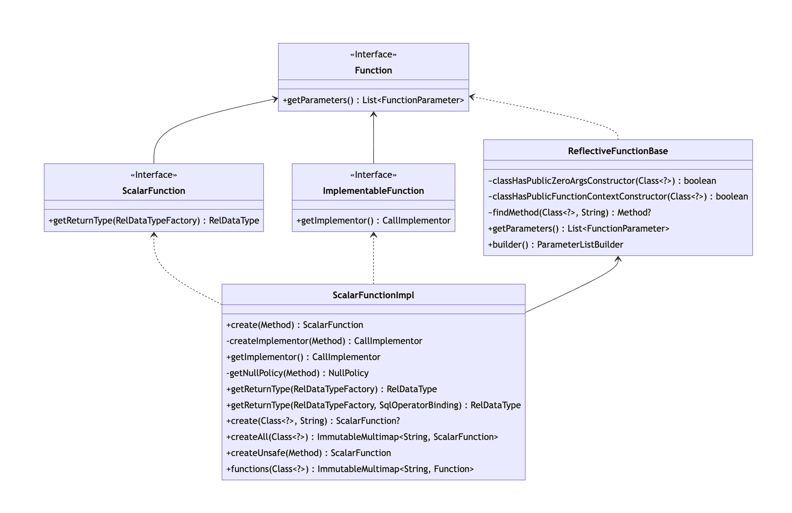

> 注意：本文基于 [Calcite main 分支 60e0a3f](https://github.com/apache/calcite/commit/60e0a3f441a009e55a36cac192253a436bec3f6d) 版本源码进行学习研究，其他版本可能会存在实现逻辑差异，对源码感兴趣的读者**请注意版本选择**。

## 前言

最近，很多星友咨询关于 `Calcite UDF` 实现和扩展的问题，在之前 [Apache Calcite System Catalog 实现探究](https://strongduanmu.com/blog/explore-apache-calcite-system-catalog-implementation.html)一文中，我们简单介绍过 `Catalog` 中的 `Function` 对象，也了解到 Calcite 内置了很多函数实现，但在实际使用中内置函数往往无法满足要求，用户需要能够根据自己的需求，灵活地注册新的函数。Caclite 允许用户动态注册 UDF 函数，从而实现更加复杂的 SQL 逻辑，下面本文将深入探讨 Calcite 内置函数的实现原理，UDF 函数的实现原理以及扩展方式，帮助大家更好地在项目中使用 Calcite UDF。

## Calcite 函数简介

在日常开发、数据分析工作中，我们除了会使用常用的 SQL 语句外，还会经常用到函数来实现一些特殊功能，函数功能的强弱直接会影响我们的开发效率。Calcite 作为当前流行的计算引擎，对函数功能也有较好的支持，它内置了不同数据库的上百种常用函数，可以直接调用执行。此外，Calcite 也提供了 UDF 自定义函数能力，用户可以通过 Schema 注册 UDF，从而实现更灵活地 SQL 运算逻辑。

在了解 UDF 函数实现和扩展前，我们先来了解下 Calcite 函数的基本概念。Calcite 对函数的定义是：**接受参数并返回结果的命名表达式**，函数一般通过 Schema 进行注册，然后使用 `Schema#getFunctions` 获取函数，获取函数时会根据参数类型进行过滤。下面是 Schema 中 `Function` 接口声明：

```java
public interface Function {
    List<FunctionParameter> getParameters();
}
```

Function 接口提供了 `getParameters` 获取函数参数的方法，它包含了 `ScalarFunction`、`AggregateFunction`、`TableFunction` 和 `TableMarco` 等几个主要的子接口。ScalarFunction 对应标量函数，也就是函数返回的结果为一个标量，AggregateFunction 对应聚合函数，会将多个值聚合计算为一个标量返回。

TableFunction 和 TableMacro 都对应了表函数，会返回一个表，他们的区别是 TableMacro 会在编译期间进行调用，编译期展开表达式允许 Calcite 实现更加强大的查询优化，例如我们可以对视图在编译期进行展开。相比于 TableMacro，TableFunction 则需要在执行阶段才能知道表的结果。

下图展示了 Function 的继承体系，Function 接口的 4 个子接口 `ScalarFunction`、`AggregateFunction`、`TableFunction` 和 `TableMarco`，他们都有对应的 `Impl` 实现类，实现类中定义了很多函数处理相关的方法，下面小节我们将分别对这几类函数的内部实现进行探究。


## 内置函数实现探究

### 标量函数

标量函数（`ScalarFunction`）是指**将输入数据转换为输出数据的函数，通常用于对单个字段值进行计算和转换**。例如：`ABS(num)` 函数，它负责将每行输入的 `num` 字段值转换为绝对值再输出。

下图展示了标量函数在 Schema 对象中的继承体系，核心的实现逻辑在 `ScalarFunctionImpl` 类中，它实现了 `ScalarFunction` 和 `ImplementableFunction` 接口，并继承了 `ReflectiveFunctionBase` 抽象类，下面我们分别来介绍下这些接口和类的作用。



* ScalarFunction 接口：

`ScalarFunction` 接口继承了 `Function` 接口，并在接口中声明了 `getReturnType` 方法，用于表示标量函数返回值的类型。

```java
/**
 * Function that returns a scalar result.
 */
public interface ScalarFunction extends Function {
    /**
     * Returns the return type of this function, constructed using the given
     * type factory.
     *
     * @param typeFactory Type factory
     */
    RelDataType getReturnType(RelDataTypeFactory typeFactory);
}
```

* ImplementableFunction 接口：

`ImplementableFunction` 接口用于声明该函数可以转换为 Java 代码进行执行，接口中提供了 `getImplementor` 方法，可以返回一个函数实现器 `CallImplementor`。

```java
/**
 * Function that can be translated to java code.
 *
 * @see ScalarFunction
 * @see TableFunction
 */
public interface ImplementableFunction extends Function {
    /**
     * Returns implementor that translates the function to linq4j expression.
     *
     * @return implementor that translates the function to linq4j expression.
     */
    CallImplementor getImplementor();
}
```

`CallImplementor` 接口中声明了 `implement` 方法，可以将函数转换为 `linq4j` 表达式，用于函数逻辑的调用（`linq4j` 参考了 `.NET` 中的 `LINQ（Language-Integrated Query）` 功能，可以实现类似于 SQL 的声明式语法，后续我们专门写一篇文章介绍 `linq4j`）。

```java
public interface CallImplementor {
    /**
     * Implements a call.
     *
     * @param translator Translator for the call
     * @param call Call that should be implemented
     * @param nullAs The desired mode of {@code null} translation
     * @return Translated call
     */
    Expression implement(RexToLixTranslator translator, RexCall call, RexImpTable.NullAs nullAs);
}
```

* ReflectiveFunctionBase 抽象类：

`ReflectiveFunctionBase` 抽象类用于处理基于方法实现的函数，负责将方法参数映射为 `List<FunctionParameter>`。在初始化 ReflectiveFunctionBase 时，会传入函数逻辑对应的 `Method` 对象，`ParameterListBuilder` 类会根据 method 对象构造 `List<FunctionParameter>`。

```java
/**
 * Creates a ReflectiveFunctionBase.
 *
 * @param method Method that is used to get type information from
 */
protected ReflectiveFunctionBase(Method method) {
    this.method = method;
    this.parameters = builder().addMethodParameters(method).build();
}
```

`ParameterListBuilder` 类的核心逻辑为 `addMethodParameters` 方法，内部会遍历方法参数，通过 ReflectUtil 工具类获取参数名称（优先从 Parameter 注解中获取名称，无注解则使用参数名）和参数是否可选（优先从 Parameter 注解中获取是否可选，无注解则为 false），然后将 `type`、`name` 和 `optional` 参数传入 `add` 方法，用于创建 FunctionParameter 对象。

```java
public ParameterListBuilder addMethodParameters(Method method) {
    final Class<?>[] types = method.getParameterTypes();
    for (int i = 0; i < types.length; i++) {
        add(types[i], ReflectUtil.getParameterName(method, i), ReflectUtil.isParameterOptional(method, i));
    }
    return this;
}
```

`add` 方法实现逻辑如下，主要将传入的 `type` 参数通过 `typeFactory` 构建为 `RelDataType` 类型，将 `name` 和 `optional` 封装到对应的 `FunctionParameter` 接口方法中。此外，还根据参数的个数生成了 `ordinal` 序号，并封装到 `getOrdinal` 方法中。

```java
public ParameterListBuilder add(final Class<?> type, final String name, final boolean optional) {
    final int ordinal = builder.size();
    builder.add(new FunctionParameter() {
        @Override
        public String toString() {
            return ordinal + ": " + name + " " + type.getSimpleName() + (optional ? "?" : "");
        }
        
        // 基于 0 的参数序号
        @Override
        public int getOrdinal() {
            return ordinal;
        }
        
        // 参数名称
        @Override
        public String getName() {
            return name;
        }
        
        // 参数类型
        @Override
        public RelDataType getType(RelDataTypeFactory typeFactory) {
            return typeFactory.createJavaType(type);
        }
        
        // 参数是否可选，可选参数可以在函数调用时省略
        @Override
        public boolean isOptional() {
            return optional;
        }
    });
    return this;
}
```

除了 FunctionParameter 构建逻辑外，ReflectiveFunctionBase 还提供了 `classHasPublicZeroArgsConstructor` 和 `classHasPublicFunctionContextConstructor` 方法，用于判断函数逻辑类是否提供了无关构造方法，以及包含 `FunctionContext`（提供函数调用的相关信息，可以使函数在构造期间提前执行，无需每次调用执行，具体可以参考 [FunctionContext](https://github.com/apache/calcite/blob/b2e9e6cba1e2ce28368d1281f527a9e53f4628ca/core/src/main/java/org/apache/calcite/schema/FunctionContext.java#L24-L85)）的构造方法，这些构造方法会在函数初始化时进行调用，不包含可能会抛出异常。

* ScalarFunctionImpl 类：

`ScalarFunctionImpl` 类实现了 ScalarFunction 和 ImplementableFunction 接口中的相关方法，内部方法通过调用如下的私有构造方法进行初始化。如下展示了 ScalarFunctionImpl 了的构造方法，首先会调用 `super(method)` 初始化函数参数 `List<FunctionParameter>`，然后将函数实现器 CallImplementor 存储在成员变量中。 

```java
/**
 * Private constructor.
 */
private ScalarFunctionImpl(Method method, CallImplementor implementor) {
    super(method);
    this.implementor = implementor;
}
```

ScalarFunctionImpl 核心的创建逻辑是由公共的 `create` 方法触发的，外部调用将函数方法 Method 对象传递给 `create` 方法。方法内部会先判断 Method 是否为静态方法，非静态方法如果没有无参构造方法，或者没有包含 FunctionContext 的构造方法，则会抛出异常。

如果检查通过，则根据 Method 对象创建 CallImplementor 函数实现器，然后调用私有的 ScalarFunctionImpl 构造方法，将 Method 对象和 CallImplementor 函数实现器传递给构造方法。

```java
public static ScalarFunction create(Method method) {
    if (!isStatic(method)) {
        Class<?> clazz = method.getDeclaringClass();
        if (!classHasPublicZeroArgsConstructor(clazz) && !classHasPublicFunctionContextConstructor(clazz)) {
            throw RESOURCE.requireDefaultConstructor(clazz.getName()).ex();
        }
    }
    CallImplementor implementor = createImplementor(method);
    return new ScalarFunctionImpl(method, implementor);
}
```

创建 CallImplementor 函数实现器的逻辑如下，首先会调用 `getNullPolicy` 方法，返回 `NullPolicy` 枚举类型用于描述函数（或运算符）何时返回 NULL。

```java
private static CallImplementor createImplementor(final Method method) {
    final NullPolicy nullPolicy = getNullPolicy(method);
    return RexImpTable.createImplementor(new ReflectiveCallNotNullImplementor(method), nullPolicy, false);
}
```

`NullPolicy` 枚举类包含了 `ALL`、`STRICT`、`SEMI_STRICT`、`ANY`、`ARG0` 和 `NONE`。`ALL` 表示只有所有的参数为 NULL，函数结果采返回 NULL。`STRICT` 表示只有一个参数为 NULL 使，函数结果返回 NULL。`SEMI_STRICT` 表示有 1 个或多个参数为 NULL 时，函数结果返回 NULL。`ANY` 表示只要有任意一个参数为 NULL，则函数结果返回 NULL，`ANY` 和 `STRICT` 比较类似，Caclite 更推荐使用 `STRICT` 类型。`ARG0` 表示第一个参数为 NULL 时，函数结果返回 NULL。`NONE` 表示不指定 NULL 策略，由函数逻辑进行处理。

这些枚举类型中，`STRICT`、`SEMI_STRICT` 比较常用，Calcite 分别为他们提供了 `Strict` 和 `SemiStrict` 注解，可以标注在函数方法或类上，用来声明 NULL 值策略。

```java
public enum NullPolicy {
    /**
     * Returns null if and only if all of the arguments are null;
     * If all of the arguments are false return false otherwise true.
     */
    ALL,
    /**
     * Returns null if and only if one of the arguments are null.
     */
    STRICT,
    /**
     * Returns null if one of the arguments is null, and possibly other times.
     */
    SEMI_STRICT,
    /**
     * If any of the arguments are null, return null.
     */
    ANY,
    /**
     * If the first argument is null, return null.
     */
    ARG0, NONE
}
```

获取到 NullPolicy 后，调用 `RexImpTable.createImplementor()` 方法创建函数实现器，由于函数实现器中的 `implement` 方法在执行阶段才会调用，我们将在后面的 ScalarFunction 案例中进行详细介绍。

### 聚合函数

聚合函数（`AggregateFunction`）是指**将多个值组合转换为标量值输出的函数**。例如：`SUM(num)` 函数，它负责将每行输入的 `num` 字段值进行累加，最终输出累加总和。

Calcite 聚合函数内部包含了一个累加过程，如下面的伪代码所示，`Accumulator` 累加器内部维护了一个 `sum` 变量，用于存储 `SUM` 函数计算的累加值。聚合函数调用 `init` 方法进行初始化，此时会创建一个累加器对象，并将 `sum` 初始化为 0，然后通过 `add` 方法将当前行的值添加到累加器中进行计算。如果有多个累加器，则可以使用 `merge` 方法将两个累加器中的值合二为一，最后计算完成可以通过 `result` 方法返回结果。

```java
// 聚合函数累加器
struct Accumulator {
    final int sum;
}

// 聚合函数初始化方法
Accumulator init() {
    return new Accumulator(0);
}

// 聚合函数累加方法
Accumulator add(Accumulator a, int x) {
    return new Accumulator(a.sum + x);
}

// 聚合函数合并方法
Accumulator merge(Accumulator a, Accumulator a2) {
    return new Accumulator(a.sum + a2.sum);
}

// 聚合函数获取结果方法
int result(Accumulator a) {
    return a.sum;
}
```

下图展示了聚合函数在 Schema 对象中的继承体系，核心的实现逻辑在 `AggregateFunctionImpl` 类中，它实现了 `AggregateFunction` 和 `ImplementableAggFunction` 接口，下面我们分别来介绍下这些接口和类的作用。


* AggregateFunction 接口：

`AggregateFunction` 接口继承了 `Function` 接口，并在接口中声明了 `getReturnType` 方法，用于表示聚合函数返回值的类型。

```java
/**
 * Function that combines several values into a scalar result.
 */
public interface AggregateFunction extends Function {
    /**
     * Returns the return type of this function, constructed using the given
     * type factory.
     *
     * @param typeFactory Type factory
     */
    RelDataType getReturnType(RelDataTypeFactory typeFactory);
}
```

* ImplementableAggFunction 接口：

`ImplementableAggFunction` 接口用于声明该函数可以转换为 Java 代码进行执行，接口中提供了 `getImplementor` 方法，可以返回一个聚合函数实现器 `AggImplementor`，`windowContext` 用于标记当前聚合函数是否包含在窗口运算中。

```java
public interface ImplementableAggFunction extends AggregateFunction {
    /**
     * Returns implementor that translates the function to linq4j expression.
     *
     * @param windowContext true when aggregate is used in window context
     * @return implementor that translates the function to linq4j expression.
     */
    AggImplementor getImplementor(boolean windowContext);
}
```

`AggImplementor` 接口可以实现聚合函数所需的初始化、累加以及获取结果方法，如下展示了 `AggImplementor` 接口中的方法，`getStateType` 方法可以返回聚合函数实现时，中间变量的类型，例如：字符串连接函数，它的中间变量类型可以是 StringBuilder。`implementReset`、`implementAdd` 和 `implementResult` 分别对应了聚合函数的初始化、累加和获取结果方法，AggImplementor 接口的实现类，会根据不同的聚合函数类型实现其逻辑。

```java
public interface AggImplementor {
    
    // 返回聚合函数实现时，中间变量的类型
    // 例如：字符串连接函数，它的中间变量类型可以是 StringBuilder
    List<Type> getStateType(AggContext info);
    
    // 将中间变量重置为初识状态
    // 应使用 AggResetContext.accumulator() 来引用状态变量
    void implementReset(AggContext info, AggResetContext reset);
    
    // 将新增加的当前值，累加到中间变量
    void implementAdd(AggContext info, AggAddContext add);
    
    // 根据中间变量计算结果值
    Expression implementResult(AggContext info, AggResultContext result);
}
```

* AggregateFunctionImpl 类：

`AggregateFunctionImpl` 类实现了 `AggregateFunction` 和 `ImplementableAggFunction` 接口，通过私有的构造方法进行初始化，构造方法如下，`declaringClass` 表示聚合函数对应的实现类，`params` 表示聚合函数的参数，`valueTypes` 表示聚合函数参数的类型，`accumulatorType` 表示聚合器的类型，`resultType` 表示函数结果类型。

`initMethod`、`addMethod`、`mergeMethod` 和 `resultMethod` 分别表示聚合函数初始化方法、累加方法、合并方法和结果方法，`isStatic` 表示 `initMethod` 是否为静态方法。

```java
private AggregateFunctionImpl(Class<?> declaringClass, List<FunctionParameter> params, List<Class<?>> valueTypes, Class<?> accumulatorType, Class<?> resultType, Method initMethod, Method addMethod, @Nullable Method mergeMethod, @Nullable Method resultMethod) {
    this.declaringClass = declaringClass;
    this.valueTypes = ImmutableList.copyOf(valueTypes);
    this.parameters = params;
    this.accumulatorType = accumulatorType;
    this.resultType = resultType;
    this.initMethod = requireNonNull(initMethod, "initMethod");
    this.addMethod = requireNonNull(addMethod, "addMethod");
    this.mergeMethod = mergeMethod;
    this.resultMethod = resultMethod;
    this.isStatic = isStatic(initMethod);
    assert resultMethod != null || accumulatorType == resultType;
}
```

由于 AggregateFunctionImpl 构造方法是私有的，通常 Calcite 内部都是通过 `create` 方法来创建 AggregateFunctionImpl 对象，`create` 方法实现逻辑如下：

```java
/**
 * Creates an aggregate function, or returns null.
 */
public static @Nullable AggregateFunctionImpl create(Class<?> clazz) {
    // 获取函数类中的 init 方法
    final Method initMethod = ReflectiveFunctionBase.findMethod(clazz, "init");
    // 获取函数类中的 add 方法
    final Method addMethod = ReflectiveFunctionBase.findMethod(clazz, "add");
    // merge 方法暂未实现
    final Method mergeMethod = null; // TODO:
    // 获取函数类中的 result 方法
    final Method resultMethod = ReflectiveFunctionBase.findMethod(clazz, "result");
    if (initMethod != null && addMethod != null) {
        // A is return type of init by definition
        // A 表示 init 方法的返回类型
        final Class<?> accumulatorType = initMethod.getReturnType();
        // R is return type of result by definition
        // R 表示 result 方法的返回类型
        final Class<?> resultType = resultMethod != null ? resultMethod.getReturnType() : accumulatorType;
        // V is remaining args of add by definition
        // V 表示 add 方法第一个参数之外的类型
        final List<Class> addParamTypes = ImmutableList.copyOf(addMethod.getParameterTypes());
        // 检查 add 方法第一个参数和累加器类型是否一致
        if (addParamTypes.isEmpty() || addParamTypes.get(0) != accumulatorType) {
            throw RESOURCE.firstParameterOfAdd(clazz.getName()).ex();
        }
        final ReflectiveFunctionBase.ParameterListBuilder params = ReflectiveFunctionBase.builder();
        final ImmutableList.Builder<Class<?>> valueTypes = ImmutableList.builder();
        // 跳过第一个构造器参数，从第二个参数开始遍历
        for (int i = 1; i < addParamTypes.size(); i++) {
            final Class type = addParamTypes.get(i);
            // 调用 ReflectUtil 获取参数名称和参数是否可选标记，优先选择 Parameter 注解声明的信息
            final String name = ReflectUtil.getParameterName(addMethod, i);
            final boolean optional = ReflectUtil.isParameterOptional(addMethod, i);
            params.add(type, name, optional);
            valueTypes.add(type);
        }
        // 如下展示了聚合函数中的方法和类型
        // A init()
        // A add(A, V)
        // A merge(A, A)
        // R result(A)        
        return new AggregateFunctionImpl(clazz, params.build(), valueTypes.build(), accumulatorType, resultType, initMethod, addMethod, mergeMethod, resultMethod);
    }
    return null;
}
```

`create` 方法首先会从 `clazz` 类中获取 `init`、`add`、`merge` 和 `result` 对应的 Method 对象，目前 `merge` 方法仍然没有实现，`init` 和 `add` 方法是必须的，否则 `create` 方法会直接返回 null，外部调用的地方会判断是否允许函数为 null。

如果 `init` 和 `add` 方法不为 null，则会从 Method 对象中获取聚合函数相关的类型及参数信息，代码中使用 A 表示 init 方法的返回类型，使用 R 表示 result 方法的返回类型，使用 V 表示 add 方法第一个参数之外的类型，并检查 add 方法中的第一个参数是否和累加器类型一致，不一致则抛出异常。

然后循环 `add` 方法的参数，循环时会跳过第一个累加器参数，从第二个参数开始遍历，然后使用 `ReflectUtil` 优先从 `Parameter` 注解中获取参数名称和参数是否可选标记，循环过程中会把参数和参数类型存储在 params 和 valueTypes 中，最终所有的参数会传递给 `AggregateFunctionImpl` 私有构造方法，用于创建 AggregateFunctionImpl 对象。

```java
@Override
public AggImplementor getImplementor(boolean windowContext) {
    return new RexImpTable.UserDefinedAggReflectiveImplementor(this);
}
```

`AggregateFunctionImpl#getImplementor` 方法用于获取聚合函数实现器，参数 `windowContext` 表示当前是否是位于窗口运算中，聚合函数实现器直接调用了 `RexImpTable.UserDefinedAggReflectiveImplementor` 构造方法，并将当前的聚合函数实现类对象传递进去，实现器内部具体的逻辑，我们后文再详细分析，此处暂时跳过。

### 表函数 & 表宏

表函数（`TableFunction`）是指**在执行阶段将某些数据转换为表的函数**，表宏（`TableMacro`）是指**在编译阶段将某些数据转换为表的函数**。表函数或者表宏，通常会使用在 FROM 子句中，作为一张表进行使用，例如：`SELECT * FROM XML_EXTRACT("/opt/csv/test.csv")`，`XML_EXTRACT` 就是一个表函数，它负责从 `test.csv` 文件中获取数据，并返回一张表。

下图展示了表函数和表宏在 Schema 对象中的继承体系，表函数的核心实现逻辑在 `TableFunctionImpl` 类中，它实现了 `ImplementableFunction` 和 `TableFunction` 接口，并继承了 `ReflectiveFunctionBase` 抽象类。表宏的核心实现逻辑在 `TableMarcoImpl` 类中，它实现了 `TableMarco` 接口，并继承了 `ReflectiveFunctionBase` 抽象类，下面我们分别来介绍下这些接口和类的作用。


* TableFunction 接口：

`TableFunction` 接口继承了 `Function` 接口，并在接口中声明了 `getRowType` 方法，用于表示表函数返回表的数据行类型。

```java
public interface TableFunction extends Function {
    // 使用指定参数产生的表对应的数据行类型
    RelDataType getRowType(RelDataTypeFactory typeFactory, List<? extends @Nullable Object> arguments);
    
    // 获取表对应的数据行类型（Java 类型）
    Type getElementType(List<? extends @Nullable Object> arguments);
}
```

* TableFunctionImpl 类：

`TableFunctionImpl` 类实现了 `TableFunction` 和 `ImplementableFunction` 接口，并继承了 `ReflectiveFunctionBase` 抽象类，私有构造方法允许传入函数实现的 Method 对象，以及调用实现逻辑 CallImplementor，`super(method)` 会调用 ReflectiveFunctionBase 抽象类的方法，对函数参数进行处理。

```java
private TableFunctionImpl(Method method, CallImplementor implementor) {
    super(method);
    this.implementor = implementor;
}
```

私有构造方法会被 `create` 方法调用，`create` 方法会传入一个 `Class` 对象，以及函数方法名 `methodName`，根据方法名会查找 `Method` 对象，如果对象为 null，则返回 TableFunction 为 null。

```java
/**
 * Creates a {@link TableFunctionImpl} from a class, looking for a method
 * with a given name. Returns null if there is no such method.
 */
public static @Nullable TableFunction create(Class<?> clazz, String methodName) {
    final Method method = findMethod(clazz, methodName);
    if (method == null) {
        return null;
    }
    return create(method);
}
```

如果 `Method` 对象存在，则继续判断方法是否为静态，如果是非静态方法，则需要提供无参的构造方法，否则抛出异常。此外，表函数返回值需要是 `QueryableTable` 或者 `ScannableTable` 类型，否则表函数直接返回 null。`Method` 对象检查满足条件后，则调用 `createImplementor` 创建方法实现器，再调用私有的 `TableFunctionImpl` 构造方法创建表函数对象。

```java
/**
 * Creates a {@link TableFunctionImpl} from a method.
 */
public static @Nullable TableFunction create(final Method method) {
    // 判断是否为非静态方法
    if (!isStatic(method)) {
        Class clazz = method.getDeclaringClass();
        // 非静态方法，如果没有公有的无参构造方法，则抛出异常
        if (!classHasPublicZeroArgsConstructor(clazz)) {
            throw RESOURCE.requireDefaultConstructor(clazz.getName()).ex();
        }
    }
    final Class<?> returnType = method.getReturnType();
    // 如果表函数返回值不为 QueryableTable 或者 ScannableTable，则直接返回 null
    if (!QueryableTable.class.isAssignableFrom(returnType) && !ScannableTable.class.isAssignableFrom(returnType)) {
        return null;
    }
    // 创建调用实现器
    CallImplementor implementor = createImplementor(method);
    // 创建 TableFunctionImpl 对象
    return new TableFunctionImpl(method, implementor);
}
```

* TableMacro 接口：

`TableMacro` 和 `TableFunction` 接口类似，都继承了 `Function` 接口，但是它是在编译期间进行调用，如下展示了 TableMacro 接口提供的 `apply` 方法，它可以根据传入的参数转换为 TranslatableTable，通过 `TranslatableTable#toRel` 方法，可以得到 `RelNode`。

```java
public interface TableMacro extends Function {
    /**
     * Applies arguments to yield a table.
     *
     * @param arguments Arguments
     * @return Table
     */
    TranslatableTable apply(List<? extends @Nullable Object> arguments);
}
```

* TableMacroImpl 类：

`TableMacroImpl` 类实现了 `TableMacro` 接口，并继承了 `ReflectiveFunctionBase` 抽象类，私有构造方法接受一个 Method 参数，并会调用 `super(method)` 方法，处理函数参数。

```java
/**
 * Private constructor; use {@link #create}.
 */
private TableMacroImpl(Method method) {
    super(method);
}
```

Calcite 内部通过 `create` 方法创建 `TableMacro` 对象，和 `TableFunction` 一样，在创建之前会判断方法是否为非静态方法，非静态方法必须提供公有无参构造方法。然后检查 TableMacro 函数返回值，必须为 `TranslatableTable` 类型，否则返回 null，最后调用 `TableMacroImpl` 构造方法创建表宏对象。

```java
/**
 * Creates a {@code TableMacro} from a method.
 */
public static @Nullable TableMacro create(final Method method) {
    Class clazz = method.getDeclaringClass();
    // 非静态方法，必须提供公有无参构造方法
    if (!isStatic(method)) {
        if (!classHasPublicZeroArgsConstructor(clazz)) {
            throw RESOURCE.requireDefaultConstructor(clazz.getName()).ex();
        }
    }
    final Class<?> returnType = method.getReturnType();
    // 检查表宏返回值是否为 TranslatableTable
    if (!TranslatableTable.class.isAssignableFrom(returnType)) {
        return null;
    }
    return new TableMacroImpl(method);
}
```

TableMacroImpl 类中的 `apply` 方法负责调用 method 方法，并将参数 arguments 传递给该方法，最终会返回 `TranslatableTable` 对象。

```java
@Override
public TranslatableTable apply(List<? extends @Nullable Object> arguments) {
    try {
        Object o = null;
        if (!isStatic(method)) {
            final Constructor<?> constructor = method.getDeclaringClass().getConstructor();
            o = constructor.newInstance();
        }
        return (TranslatableTable) requireNonNull(method.invoke(o, arguments.toArray()), () -> "got null from " + method + " with arguments " + arguments);
    } catch (IllegalArgumentException e) {
        throw new RuntimeException("Expected " + Arrays.toString(method.getParameterTypes()) + " actual " + arguments, e);
    } catch (IllegalAccessException | InvocationTargetException | NoSuchMethodException | InstantiationException e) {
        throw new RuntimeException(e);
    }
}
```

### 函数执行流程

前文我们介绍了标量函数、聚合函数、表函数和表宏中的核心类，下面我们将结合 Calcite 中的 CoreQuidemTest（该测试使用了 [quidem](https://github.com/julianhyde/quidem) 测试框架，可以像编写脚本一样编写测试程序），一起来看看 `functions.iq` 中的函数是如何执行的。下面的 SQL 取自 `functions.iq` 文件，它包含了 `concat_ws` 和 `cast` 两个函数，会将参数按照分隔符进行组装。

```sql
select concat_ws(',', 'a', cast(null as varchar), 'b');
```

测试程序的入口在 [QuidemTest#test](https://github.com/apache/calcite/blob/9f231cc5b91b100b6a6fbc3cd6324873529dbf49/testkit/src/main/java/org/apache/calcite/test/QuidemTest.java#L223) 方法，通过 `getPath` 获取 `functions.iq` 文件路径，然后调用 `checkRun` 中的 `new Quidem(config).execute()` 执行测试用例。我们可以在 `net/hydromatic/quidem/Quidem.java:285` 位置打断点，然后设置条件断点——`sqlCommand instanceof SqlCommand && ((SqlCommand) sqlCommand).sql.equalsIgnoreCase("select concat_ws(',', 'a', cast(null as varchar), 'b')")`，这样可以跟踪上面测试 SQL 的 `checkResult` 断言逻辑。

#### SqlValidator 函数注册

SQL 语句在 Calcite 中执行，首先会调用 [Avatica](https://calcite.apache.org/avatica/) 提供的 JDBC 接口，内部会对 SQL 语句进行解析，得到 SqlNode 对象。然后创建 `SqlValidator` 进行校验，校验器创建逻辑具体参考 [CalcitePrepareImpl#createSqlValidator](https://github.com/apache/calcite/blob/b1308feff49c8b747b3bbb52e1519d334bc984ec/core/src/main/java/org/apache/calcite/prepare/CalcitePrepareImpl.java#L743)，首先会根据 `context.config()` 中配置的 `fun` 属性，获取对应方言中的函数或运算符，具体调用的方法是 `SqlLibraryOperatorTableFactory.INSTANCE.getOperatorTable()`，返回方言对应的函数、运算符表对象。

```java
@Override
public <T> @PolyNull T fun(Class<T> operatorTableClass, @PolyNull T defaultOperatorTable) {
    final String fun = CalciteConnectionProperty.FUN.wrap(properties).getString();
    if (fun == null || fun.equals("") || fun.equals("standard")) {
        return defaultOperatorTable;
    }
    // Parse the libraries
    final List<SqlLibrary> libraryList = SqlLibrary.parse(fun);
    // Load standard plus the specified libraries. If 'all' is among the
    // specified libraries, it is expanded to all libraries (except standard,
    // spatial, all).
    final List<SqlLibrary> libraryList1 = SqlLibrary.expand(ConsList.of(SqlLibrary.STANDARD, libraryList));
    // 根据 libraries 获取对应的 SqlLibraryOperatorTable
    final SqlOperatorTable operatorTable = SqlLibraryOperatorTableFactory.INSTANCE.getOperatorTable(libraryList1);
    return operatorTableClass.cast(operatorTable);
}
```

`SqlLibraryOperatorTableFactory.INSTANCE.getOperatorTable()` 方法内部会遍历 `SqlLibraryOperators` 中的成员变量，获取类型为 `SqlOperator` 的变量，并判断 `LibraryOperator` 指定的方言和当前 `fun` 指定的方言是否一致，如果不匹配则继续比较方言继承的父类是否一致，一致则将 SqlOperator 添加到集合中，并组装为 SqlOperatorTable 返回。

```java
for (Class aClass : classes) {
    for (Field field : aClass.getFields()) {
        try {
            if (SqlOperator.class.isAssignableFrom(field.getType())) {
                final SqlOperator op = (SqlOperator) requireNonNull(field.get(this), () -> "null value of " + field + " for " + this);
                // 判断 Library 是否一致
                if (operatorIsInLibrary(op.getName(), field, librarySet)) {
                    list.add(op);
                }
            }
        } catch (IllegalArgumentException | IllegalAccessException e) {
            throw Util.throwAsRuntime(Util.causeOrSelf(e));
        }
    }
}
```

如果未配置或配置为 `standard`，则使用 `SqlStdOperatorTable.instance()` 创建 `SqlOperatorTable` 标准函数、运算符表对象。然后会将 CalciteCatalogReader 对象添加到集合中，CalciteCatalogReader 对象也实现了 SqlOperatorTable 接口，提供了 `lookupOperatorOverloads` 查找 Schema 中注册的函数和运算符。

```java
private static SqlValidator createSqlValidator(Context context, CalciteCatalogReader catalogReader, UnaryOperator<SqlValidator.Config> configTransform) {
    // 根据 context.config() 中配置的 fun 属性，获取对应方言中的函数或运算符
    // 未配置或配置为 standard，则使用 SqlStdOperatorTable.instance() 创建的标准函数、运算符表对象
    final SqlOperatorTable opTab0 = context.config().fun(SqlOperatorTable.class, SqlStdOperatorTable.instance());
    final List<SqlOperatorTable> list = new ArrayList<>();
    list.add(opTab0);
    // 添加 catalogReader
    list.add(catalogReader);
    // 组装为调用链 Chain
    final SqlOperatorTable opTab = SqlOperatorTables.chain(list);
    final JavaTypeFactory typeFactory = context.getTypeFactory();
    final CalciteConnectionConfig connectionConfig = context.config();
    final SqlValidator.Config config = configTransform.apply(SqlValidator.Config.DEFAULT.withLenientOperatorLookup(connectionConfig.lenientOperatorLookup()).withConformance(connectionConfig.conformance()).withDefaultNullCollation(connectionConfig.defaultNullCollation()).withIdentifierExpansion(true));
    return new CalciteSqlValidator(opTab, catalogReader, typeFactory, config);
}
```

`SqlOperatorTable` 对象实例是一个单例对象，只有在第一次执行 `ReflectiveSqlOperatorTable#init` 方法时才会创建，`init` 方法会使用反射获取 `SqlStdOperatorTable` 类中的成员变量，遍历时会判断变量是否使用 `LibraryOperator` 注解标注，对于有注解但是没有包含 STANDARD 类型的方言函数，直接跳过。处理完成后，会将 SqlOperator 构建为 Map 结果，key 为 SqlOperator 大写名称，value 为 SqlOperator 对象，并存储到 SqlStdOperatorTable 中的 operators 对象中，方便后续使用。

```java
public final SqlOperatorTable init() {
    // Use reflection to register the expressions stored in public fields.
    final List<SqlOperator> list = new ArrayList<>();
    for (Field field : getClass().getFields()) {
        try {
            final Object o = field.get(this);
            if (o instanceof SqlOperator) {
                // Fields do not need the LibraryOperator tag, but if they have it,
                // we index them only if they contain STANDARD library.
                // 获取 LibraryOperator 注解，有注解但是没有 STANDARD 类型的函数为方言函数，直接跳过
                LibraryOperator libraryOperator = field.getAnnotation(LibraryOperator.class);
                if (libraryOperator != null) {
                    if (Arrays.stream(libraryOperator.libraries()).noneMatch(library -> library == SqlLibrary.STANDARD)) {
                        continue;
                    }
                }
                // 标准函数大多不用 LibraryOperator 注解标记，直接添加到集合中
                list.add((SqlOperator) o);
            }
        } catch (IllegalArgumentException | IllegalAccessException e) {
            throw Util.throwAsRuntime(Util.causeOrSelf(e));
        }
    }
    // 将 SqlOperator 构建为 Map 结果，key 为 SqlOperator 大写名称，value 为 SqlOperator 对象
    // 存储到 SqlStdOperatorTable 中的 operators 对象中
    setOperators(buildIndex(list));
    return this;
}
```

至此就完成了 CalciteSqlValidator 函数注册流程，函数和运算符会存储在 SqlOperatorTable 对象中，通过 `CalciteSqlValidator#getOperatorTable` 方法，可以快速获取到 SqlOperatorTable 进行函数和运算符查找。

#### 函数解析和校验

函数注册完成后，按照 Calcite SQL 执行的流程，会先对 SQL 语句进行解析，下图展示了 SQL 中函数解析的结果，`CONCAT_WS` 函数被解析为 `SqlUnresolvedFunction`，它表示该函数在 SQL 解析阶段无法处理，需要通过校验器从 SqlOperatorTable 中查找对应的函数，并将其改写为对应的函数类型，`CAST` 函数被解析为 `SqlCastFunction`，在后续的校验阶段无需再进行处理。


那么，哪些函数会被解析为 `SqlUnresolvedFunction` 类型呢？根据 Julian 在 [Calcite does not return correct SqlKind](https://stackoverflow.com/questions/73066108/calcite-does-not-return-correct-sqlkind) 中的回答，所有函数在解析阶段都会被处理为 SqlUnresolvedFunction 类型，这样能够保持解析器简单、高效、可预测，在 Calcite 校验阶段，会从 SqlOperatorTable 中查找函数，并将 SqlUnresolvedFunction 转换为具体的 Function 对象。

但是实际上，从 Calcite `Parser.jj` 文件来看，不论是标准函数，还是方言函数，都有直接处理为具体 Function 对象的情况，SqlUnresolvedFunction 只是作为最后的处理方式。此外，SqlUnresolvedFunction 也适用于自定义函数场景，这些自定义函数，在 SQL 解析时是无法知道具体的函数对象。

完成 SQL 解析后，Calcite 会调用校验器对 SqlNode 语法树进行校验，参考[深度探究 Apache Calcite SQL 校验器实现原理](https://strongduanmu.com/blog/in-depth-exploration-of-implementation-principle-of-apache-calcite-sql-validator.html#performunconditionalrewrites)一文，我们知道，在校验阶段执行 `performUnconditionalRewrites` 方法时，会判断当前运算符是否为 `SqlUnresolvedFunction`，如果是则调用 `SqlOperatorTable#lookupOperatorOverloads` 方法，从 SqlOperatorTable 中查找函数，查找的范围包括内置函数以及元数据中注册的函数，然后替换 SqlNode 中的函数对象。

```java
// 判断当前 SqlNode 是否为 SqlCall
if (node instanceof SqlCall) {
    ...
    SqlCall call = (SqlCall) node;
    // 获取 SqlKind 类型
    final SqlKind kind = call.getKind();
    // 获取 SqlNode 中包含的运算符
    final List<SqlNode> operands = call.getOperandList();
    for (int i = 0; i < operands.size(); i++) {
        SqlNode operand = operands.get(i);
        ...
        // 每一个运算法调用 performUnconditionalRewrites 并设置到 SqlCall 中
        SqlNode newOperand = performUnconditionalRewrites(operand, childUnderFrom);
        if (newOperand != null && newOperand != operand) {
            call.setOperand(i, newOperand);
        }
    }

    // 当前运算符为未解析函数 SqlUnresolvedFunction
    if (call.getOperator() instanceof SqlUnresolvedFunction) {
        final SqlUnresolvedFunction function = (SqlUnresolvedFunction) call.getOperator();
        final List<SqlOperator> overloads = new ArrayList<>();
        // 从 SqlOperatorTable 中查找函数，查找的范围包括内置函数以及元数据中注册的函数
        opTab.lookupOperatorOverloads(function.getNameAsId(), function.getFunctionType(), SqlSyntax.FUNCTION, overloads, catalogReader.nameMatcher());
        if (overloads.size() == 1) {
          	// 查找到函数则设置新的运算符
            ((SqlBasicCall) call).setOperator(overloads.get(0));
        }
    }
}
```

校验完成后，可以看到 `SqlUnresolvedFunction` 被替换为 `SqlBasicFunction`，它是 SqlFunction 类的一个具体实现，主要用来处理常规的函数格式，例如：`NVL(value, value)`、`LENGTH(string)`、`LTRIM(string)` 等。而 `CAST(NULL AS VARCHAR)` 由于包含了类型信息，SqlBasicFunction 无法处理，因此需要额外定义一个 `SqlCastFunction`。


刚好聊到 `SqlFunction` 对象，我们结合下图，一起来看看 `SqlOperator` 和 `SqlFunction` 继承体系。下图展示了部分 SqlFunction 实现类，除了我们刚刚介绍的 `SqlBasicFunction`、`SqlCastFunction` 和 `SqlUnresolvedFunction` 外，还有 `SqlUserDefinedFunction`、`SqlUserDefinedAggFunction`、`SqlUserDefinedTableFunction` 和 `SqlUserDefinedTableMacro`，他们用于处理用户自定义的函数。


* SqlOperator 抽象类：

`SqlOperator` 代表了 SQL 运算符，具体包括函数、运算符（例如：`=`）和语法结构（例如：`CASE` 语句），运算符可以表示查询级表达式（例如：`SqlSelectOperator`），也可以表示行级表达式（例如：`SqlBetweenOperator`）。

SqlOperator 不是 SQL 解析树中的 SqlNode 节点，它具体表示了 SqlNode 所对应的运算符类型。运算符中通常包含了若干个操作数，例如：除法运算符中包含两个操作数，分别是分子和分母，而在 SqlFunction 函数中，参数则是操作数。

如下展示了 SqlOperator 抽象类的核心字段和方法，包含了 `name`、`kind` 等表示名称、类型的基础字段，以及用于区分计算优先级的 `leftPrec` 和 `rightPrec`，此外，还包含了 `returnTypeInference`、`operandTypeInference` 字段，分别用于推断返回类型、操作数类型。

```java
public abstract class SqlOperator {
    // 运算符/函数名称
    private final String name;
    // SqlNode 类型，例如：EQUALS，可以使用 exp.isA(EQUALS) 判断
    public final SqlKind kind;
    // 运算符绑定到左侧表达式的优先级，如果运算符是左结合，则此优先级低于右侧优先级
    private final int leftPrec;
    // 运算符绑定到右侧表达式的优先级，如果运算符是左结合，则此优先级高于右侧优先级
    private final int rightPrec;
    // 推断运算符调用后的返回类型
    private final @Nullable SqlReturnTypeInference returnTypeInference;
    // 推断操作数的类型
    private final @Nullable SqlOperandTypeInference operandTypeInference;
    // 用于校验操作数类型
    private final @Nullable SqlOperandTypeChecker operandTypeChecker;
    // 返回运算符的语法类型
    public abstract SqlSyntax getSyntax();
    // 推断运算符调用后的返回类型，仅在操作数的数量和类型校验后调用
    public RelDataType inferReturnType(SqlOperatorBinding opBinding) {...}
}
```

* SqlFunction 类：

`SqlFunction` 继承了 `SqlOperator`，是用来表示函数调用语法的运算符，SqlFunction 中额外维护了 `category` 和 `sqlIdentifier` 字段，category 表示函数的分类，主要包括：`STRING`、`NUMERIC`、`TIMEDATE`、`SYSTEM` 等函数类型，完整函数类型可查看 [SqlFunctionCategory](https://github.com/apache/calcite/blob/edbd35acf76dbd44cc148f036d0d02cbe2105c81/core/src/main/java/org/apache/calcite/sql/SqlFunctionCategory.java#L33)，sqlIdentifier 表示函数的全限定名称，内置函数为 `null`。

```java
public class SqlFunction extends SqlOperator {
    // SQL 函数分类
    private final SqlFunctionCategory category;
    // 函数的全限定名称，内置函数为 null
    private final @Nullable SqlIdentifier sqlIdentifier;
    
    protected SqlFunction(String name, @Nullable SqlIdentifier sqlIdentifier, SqlKind kind, @Nullable SqlReturnTypeInference returnTypeInference, @Nullable SqlOperandTypeInference operandTypeInference, @Nullable SqlOperandTypeChecker operandTypeChecker, SqlFunctionCategory category) {
        // SqlFunction 默认传递给父类 SqlOperator 的 leftPrec 和 rightPrec 为 100
        super(name, kind, 100, 100, returnTypeInference, operandTypeInference, operandTypeChecker);
        this.sqlIdentifier = sqlIdentifier;
        this.category = requireNonNull(category, "category");
    }
    
    // 获取语法类型，SqlSyntax.FUNCTION 表示 Foo(x, y) 格式的函数
    @Override
    public SqlSyntax getSyntax() {
        return SqlSyntax.FUNCTION;
    }
}
```

* SqlBasicFunction 类：

`SqlBasicFunction` 类继承了 `SqlFunction`，它是常规函数（例如：`NVL(value, value)`、`LENGTH(string)`、`LTRIM(string)`）的具体实现类，由于该类字段都是 `final` 类型，因此 SqlFunction 对象是不可变的，只允许通过 `with` 方法修改字段，然后创建一个新的对象。

SqlBasicFunction 字段中记录了 SqlSyntax，允许注册不同类型的函数语法，全部语法类型可以参考 [SqlSyntax](https://github.com/apache/calcite/blob/db60219198442f2c60345fda95a117d379d87a61/core/src/main/java/org/apache/calcite/sql/SqlSyntax.java#L28)。此外，还提供了 `deterministic` 和 `dynamic` 两个属性，`deterministic` 表示是否是确定函数，即：是否传入相同操作数时返回相同结果，默认为 true，`dynamic` 则表示是否是动态函数，即：是否传入相同操作数时返回不同结果，默认为 false，动态函数不能被缓存。`monotonicityInference` 是一个函数式接口，用于推测函数单调性的策略，入参是 SqlOperatorBinding，表示 SqlOperator 与操作数之间的绑定关系，出参则是 [SqlMonotonicity](https://github.com/apache/calcite/blob/571731b80a58eb095ebac7123285c375e7afff90/core/src/main/java/org/apache/calcite/sql/validate/SqlMonotonicity.java#L22)，表示 SQL 中值的单调性。

```java
public class SqlBasicFunction extends SqlFunction {
    // 语法类型，可以使用 withSyntax 修改
    private final SqlSyntax syntax;
    // 是否是确定函数，即：是否传入相同操作数时返回相同结果，默认为 true
    private final boolean deterministic;
    // 操作数处理器
    private final SqlOperandHandler operandHandler;
    // 校验调用的策略，目前没有发现使用场景
    private final int callValidator;
    // 推断函数单调性的策略
    // 入参是 SqlOperatorBinding，表示 SqlOperator 与操作数之间的绑定关系
    // 出参是 SqlMonotonicity，表示 SQL 中值的单调性
    private final Function<SqlOperatorBinding, SqlMonotonicity> monotonicityInference;
    // 是否是动态函数，即：是否传入相同操作数时返回不同结果，默认为 false，动态函数不能被缓存
    private final boolean dynamic;
}
```

* SqlCastFunction 类：

`SqlCastFunction` 类和 `SqlBasicFunction` 平级，都继承了 `SqlFunction`，它表示了常规函数之外的特殊函数，此处表示 `CAST(NULL AS VARCHAR)` 函数，其他特殊函数也有相应的函数类表示。

如下展示了 SqlCastFunction 中的核心方法，`getSignatureTemplate` 方法会返回一个模板，描述如何构建运算符签名，以 CAST 函数为例，`{0}` 表示运算符 CAST，`{1}`、`{2}`、`{3}` 是操作数。`getSyntax` 方法此处返回的是 `SqlSyntax.SPECIAL` 语法类型，它表示特殊语法，例如：CASE、CAST 运算符。`getMonotonicity` 方法用于获取函数的单调性，会根据函数操作数中配置的排序规则进行比较，如果排序规则的比较器不同，则返回 NOT_MONOTONIC，如果操作数的类型族包含在 `nonMonotonicCasts` 中，同样会返回 NOT_MONOTONIC 单调性，如果都不满足，则会返回第一个操作数的单调性。

```java
public class SqlCastFunction extends SqlFunction {
    
    // 所有不保持单调性的类型转换映射，getMonotonicity 方法根据 map 判断，包含在其中的，则返回 NOT_MONOTONIC
    private final SetMultimap<SqlTypeFamily, SqlTypeFamily> nonMonotonicCasts = ImmutableSetMultimap.<SqlTypeFamily, SqlTypeFamily>builder().put(SqlTypeFamily.EXACT_NUMERIC, SqlTypeFamily.CHARACTER).put(SqlTypeFamily.NUMERIC, SqlTypeFamily.CHARACTER).put(SqlTypeFamily.APPROXIMATE_NUMERIC, SqlTypeFamily.CHARACTER).put(SqlTypeFamily.DATETIME_INTERVAL, SqlTypeFamily.CHARACTER).put(SqlTypeFamily.CHARACTER, SqlTypeFamily.EXACT_NUMERIC).put(SqlTypeFamily.CHARACTER, SqlTypeFamily.NUMERIC).put(SqlTypeFamily.CHARACTER, SqlTypeFamily.APPROXIMATE_NUMERIC).put(SqlTypeFamily.CHARACTER, SqlTypeFamily.DATETIME_INTERVAL).put(SqlTypeFamily.DATETIME, SqlTypeFamily.TIME).put(SqlTypeFamily.TIMESTAMP, SqlTypeFamily.TIME).put(SqlTypeFamily.TIME, SqlTypeFamily.DATETIME).put(SqlTypeFamily.TIME, SqlTypeFamily.TIMESTAMP).build();
    
    // 构造方法传入 name 和 kind，SAFE_CAST 和 CAST 类似，它转换失败时会返回 NULL，而不是异常
    public SqlCastFunction(String name, SqlKind kind) {
        super(name, kind, returnTypeInference(kind == SqlKind.SAFE_CAST), InferTypes.FIRST_KNOWN, null, SqlFunctionCategory.SYSTEM);
        checkArgument(kind == SqlKind.CAST || kind == SqlKind.SAFE_CAST, kind);
    }
    
    // 返回一个模板，描述如何构建运算符签名，以 CAST 函数为例，{0} 表示运算符 CAST，{1}、{2}、{3} 是操作数
    @Override
    public String getSignatureTemplate(final int operandsCount) {
        assert operandsCount <= 3;
        return "{0}({1} AS {2} [FORMAT {3}])";
    }
    
    // 获取语法类型，SqlSyntax.SPECIAL 表示特殊语法，例如：CASE、CAST 运算符
    @Override
    public SqlSyntax getSyntax() {
        return SqlSyntax.SPECIAL;
    }
    
    @Override
    public SqlMonotonicity getMonotonicity(SqlOperatorBinding call) {
        // 获取第一个操作数类型，CAST 原始类型
        final RelDataType castFromType = call.getOperandType(0);
        // 获取第一个操作数类型族
        final RelDataTypeFamily castFromFamily = castFromType.getFamily();
        // 获取第一个操作数排序规则对应的排序器
        final Collator castFromCollator = castFromType.getCollation() == null ? null : castFromType.getCollation().getCollator();
        // 获取第二个操作数类型，CAST 目标类型
        final RelDataType castToType = call.getOperandType(1);
        // 获取第二个操作数类型族
        final RelDataTypeFamily castToFamily = castToType.getFamily();
        // 获取第二个操作数排序规则对应的排序器
        final Collator castToCollator = castToType.getCollation() == null ? null : castToType.getCollation().getCollator();
        // 如果两个操作数的排序器不同，则返回 NOT_MONOTONIC
        if (!Objects.equals(castFromCollator, castToCollator)) {
            // Cast between types compared with different collators: not monotonic.
            return SqlMonotonicity.NOT_MONOTONIC;
            // 如果两个操作数的类型族包含在 nonMonotonicCasts 中，则返回 NOT_MONOTONIC
        } else if (castFromFamily instanceof SqlTypeFamily && castToFamily instanceof SqlTypeFamily && nonMonotonicCasts.containsEntry(castFromFamily, castToFamily)) {
            return SqlMonotonicity.NOT_MONOTONIC;
        } else {
            // 否则返回第一个操作数的单调性策略
            return call.getOperandMonotonicity(0);
        }
    }
}
```

除了以上介绍的 `SqlOperator`、`SqlFunction`、`SqlBasicFunction` 以及 `SqlCastFunction`，其他的函数运算符，大家可以根据兴趣进行探索，本文就不再一一介绍，下面的小节，我们将继续跟踪函数语句的执行。

#### SQL 优化和函数执行

```
LogicalProject(EXPR$0=[CONCAT_WS(',', 'a', null:VARCHAR, 'b')])
  LogicalValues(tuples=[[{ 0 }]])

EnumerableCalc(expr#0=[{inputs}], expr#1=[','], expr#2=['a'], expr#3=[null:VARCHAR], expr#4=['b'], expr#5=[CONCAT_WS($t1, $t2, $t3, $t4)], EXPR$0=[$t5])
  EnumerableValues(tuples=[[{ 0 }]])
```


TODO

## UDF 函数扩展实践

### UDF 标量函数扩展

TODO

探索 UDF 注册 Oracle 无括号函数支持

### UDAF 聚合函数扩展

TODO

### UDTF 表函数 & 表宏扩展

TODO

## 结语

Schema 中有 Function 接口，用于注册不同类型的函数

SqlFunction 继承 SqlOperator

SqlFunctionCategory 函数分类枚举
SqlBasicFunction SqlUnresolvedFunction
RexImpTable——注册 operator（包含函数，通过注解 @LibraryOperator 标记当前函数属于哪个方言）和 method（BuiltInMethod）对应关系，BuiltInMethod 中定义了对 SqlFunctions 等函数实现类的调用
SqlLibraryOperators 用于定义非标准运算和函数，由 SqlLibraryOperatorTableFactory 调用读取到 SqlOperatorTable 中
SqlStdOperatorTable 实现标准运算和函数

普通函数 SqlFunctions 函数实现逻辑
空间函数 SpatialTypeFunctions
JSON 函数 JsonFunctions

和 UDF 相关的 Jira：https://issues.apache.org/jira/browse/CALCITE-6363?jql=project%20%3D%20CALCITE%20AND%20resolution%20%3D%20Unresolved%20AND%20text%20~%20%22UDF%22%20ORDER%20BY%20created%20DESC%2C%20updated%20DESC%2C%20priority%20ASC

改动 UDF 函数重载逻辑：https://issues.apache.org/jira/browse/CALCITE-3000?jql=project%20%3D%20CALCITE%20AND%20resolution%20%3D%20Unresolved%20AND%20text%20~%20%22UDF%22%20ORDER%20BY%20priority%20DESC%2C%20updated%20DESC

UDF Test：calcite/core/src/test/java/org/apache/calcite/test/UdfTest.java at master · apache/calcite

PI 函数带不带括号的讨论：https://issues.apache.org/jira/browse/CALCITE-6566?page=com.atlassian.jira.plugin.system.issuetabpanels%3Aall-tabpanel

关于函数参数的讨论：https://mail.google.com/mail/u/0/#inbox/FMfcgzQXJGsbkVFdDsKlrjSHbGTVxflZ

CoreQuidemTest（各种测试语句）：https://github.com/apache/calcite/tree/99a0df108a9f72805afb6d87ec5b2c0ed258f1ec/core/src/test/resources/sql


TODO




笔者因为工作原因接触到 Calcite，前期学习过程中，深感 Calcite 学习资料之匮乏，因此创建了 [Calcite 从入门到精通知识星球](https://wx.zsxq.com/dweb2/index/group/51128414222814)，希望能够将学习过程中的资料和经验沉淀下来，为更多想要学习 Calcite 的朋友提供一些帮助。


