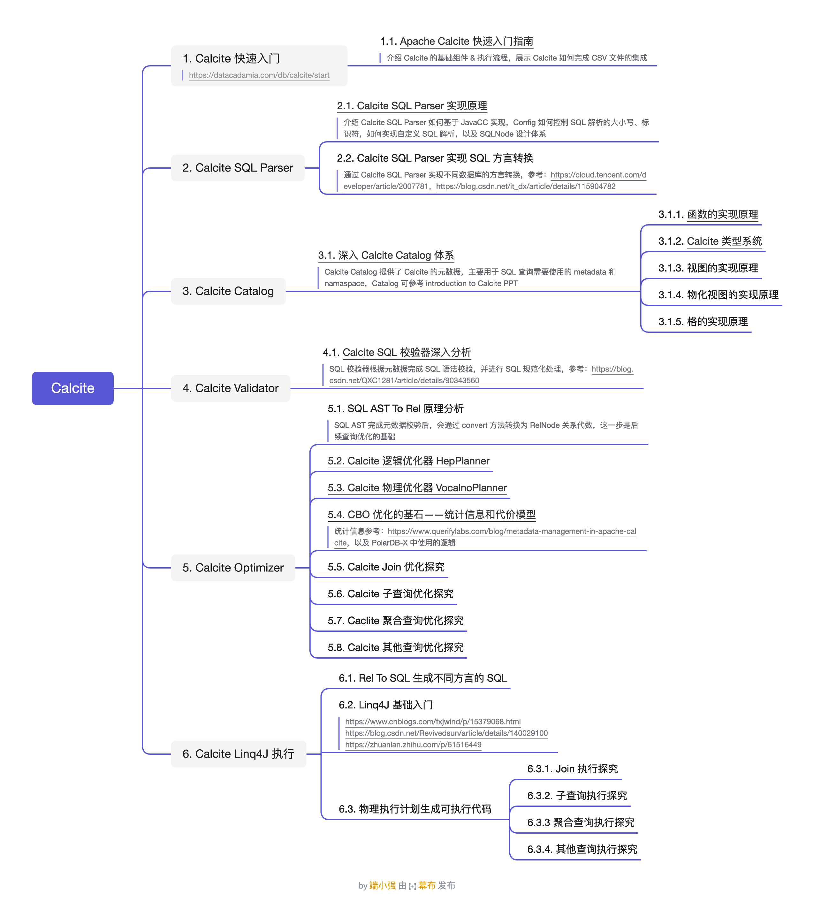

## 前言

Apache Calcite 是一个优秀的动态数据管理框架，提供了如：SQL 解析、SQL 校验、SQL 查询优化、SQL 生成以及数据连接查询等典型数据库管理功能。本文主要记录了学习 Calcite 过程中整理收集的资料，希望能够由点及面，逐步深入理解 Calcite 及数据库优化的精髓，也希望能够帮助其他学习 Calcite 的同学。

## 个人整理

* Calcite 知识图谱：[思维导图（密码: kiqs）](https://www.mubu.com/doc/18VzEyDdpBR)
* Calcite 源码学习第 1 弹：[Apache Calcite 快速入门指南](https://strongduanmu.com/blog/apache-calcite-quick-start-guide.html)
* Calcite 源码学习第 2 弹：[Apache Calcite SQL Parser 原理剖析](https://strongduanmu.com/blog/implementation-principle-of-apache-calcite-sql-parser.html)
* Calcite 源码学习第 3 弹：[Apache Calcite System Catalog 实现探究](https://strongduanmu.com/blog/explore-apache-calcite-system-catalog-implementation.html)
* Calcite 源码学习第 4 弹：[深度探究 Apache Calcite SQL 校验器实现原理](https://strongduanmu.com/blog/in-depth-exploration-of-implementation-principle-of-apache-calcite-sql-validator.html)
* Calcite 源码学习第 5 弹：TODO
* Calcite 源码学习第 6 弹：[深入理解 Apache Calcite HepPlanner 优化器](https://strongduanmu.com/blog/deep-understand-of-apache-calcite-hep-planner.html)
* Calcite 源码学习第 7 弹：[深入理解 Apache Calcite ValcanoPlanner 优化器](https://strongduanmu.com/blog/deep-understand-of-apache-calcite-volcano-planner.html)
* Calcite 源码学习第 8 弹：[CBO 优化的基石——Apache Calcite 统计信息和代价模型详解](https://strongduanmu.com/blog/cornerstone-of-cbo-optimization-apache-calcite-statistics-and-cost-model.html)
* Calcite 源码学习第 8 弹：TODO
* Calcite 源码学习第 9 弹：TODO
* Calcite 源码学习第 10 弹：[Apache Calcite Catalog 拾遗之 UDF 函数实现和扩展](https://strongduanmu.com/blog/apache-calcite-catalog-udf-function-implementation-and-extension.html)
* Calcite 源码学习第 11 弹：[Calcite UDF 实战之 ShardingSphere 联邦查询适配 MySQL BIT_COUNT](https://strongduanmu.com/blog/calcite-udf-in-action-shardingsphere-sql-federation-adapte-to-mysql-bit-count.html)

## 官方文档

* [Calcite 官方文档](https://calcite.apache.org/docs/)

* [Calcite 官方文档中文版](https://strongduanmu.com/wiki/calcite/background.html)
* [Calcite 社区](https://calcite.apache.org/community/)
* [Calcite Jira](https://issues.apache.org/jira/projects/CALCITE/issues/CALCITE-4589?filter=allopenissues)
* [Calcite StackOverflow](https://stackoverflow.com/questions/tagged/apache-calcite?tab=Newest)

## 网络资料

### 基础介绍

* [Apache Calcite：Hadoop 中新型大数据查询引擎](https://www.infoq.cn/article/new-big-data-hadoop-query-engine-apache-calcite/)
* [Apache Calcite中的基本概念](https://zhuanlan.zhihu.com/p/144129698?utm_source=wechat_session&utm_medium=social&utm_oi=985120462346670080&utm_campaign=shareopn)
* [Calcite 概念和架构](https://www.cnblogs.com/nightbreeze/p/14486935.html)
* [Apache Calcite: A Foundational Framework for Optimized Query Processing Over Heterogeneous Data Sources](https://arxiv.org/pdf/1802.10233.pdf)
* [Apache Calcite 处理流程详解（一）](http://matt33.com/2019/03/07/apache-calcite-process-flow/)
* [Apache Calcite 框架 50 倍性能优化实践](https://cloud.tencent.com/developer/article/1781262)
* [tsangpo 总结 Calcite 学习系列](https://www.zhihu.com/column/tsangpo)
* [静水流深总结 Calcite 学习系列](https://www.zhihu.com/column/c_1110245426124554240)

### 优化器

* [Apache Calcite 优化器详解（二）](http://matt33.com/2019/03/17/apache-calcite-planner/)
* [Cascades Optimizer](https://zhuanlan.zhihu.com/p/73545345)
* [The Volcano/Cascades Optimizer](https://www.slideshare.net/slideshow/the-volcanocascades-optimizer/127681467#1)
* [Extensible Query Optimizers in Practice](https://www.microsoft.com/en-us/research/publication/extensible-query-optimizers-in-practice/)

### 执行器

* [Calcite分析——Implement](https://www.cnblogs.com/fxjwind/p/15403929.html)
* [Calcite分析——Linq4j](https://www.cnblogs.com/fxjwind/p/15379068.html)

* [TiDB 社区分享火山模型](https://asktug.com/t/topic/693579)
* [SQL 优化之火山模型](https://zhuanlan.zhihu.com/p/219516250)



笔者因为工作原因接触到 Calcite，前期学习过程中，深感 Calcite 学习资料之匮乏，因此创建了 [Calcite 从入门到精通知识星球](https://wx.zsxq.com/dweb2/index/group/51128414222814)，希望能够将学习过程中的资料和经验沉淀下来，为更多想要学习 Calcite 的朋友提供一些帮助。



欢迎关注「**端小强的博客**」微信公众号，会不定期分享日常学习和工作经验，欢迎大家关注交流。

