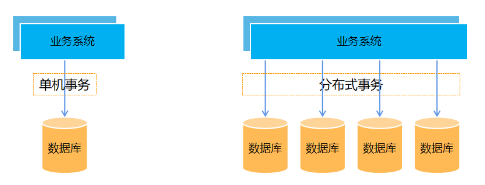
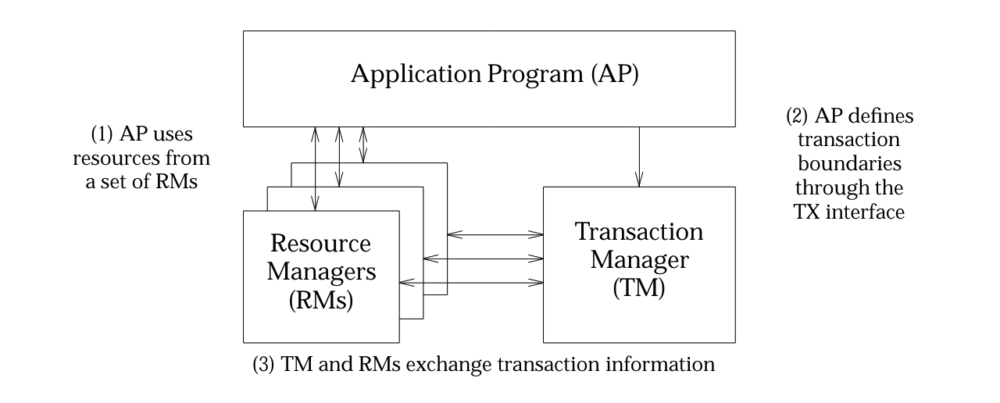
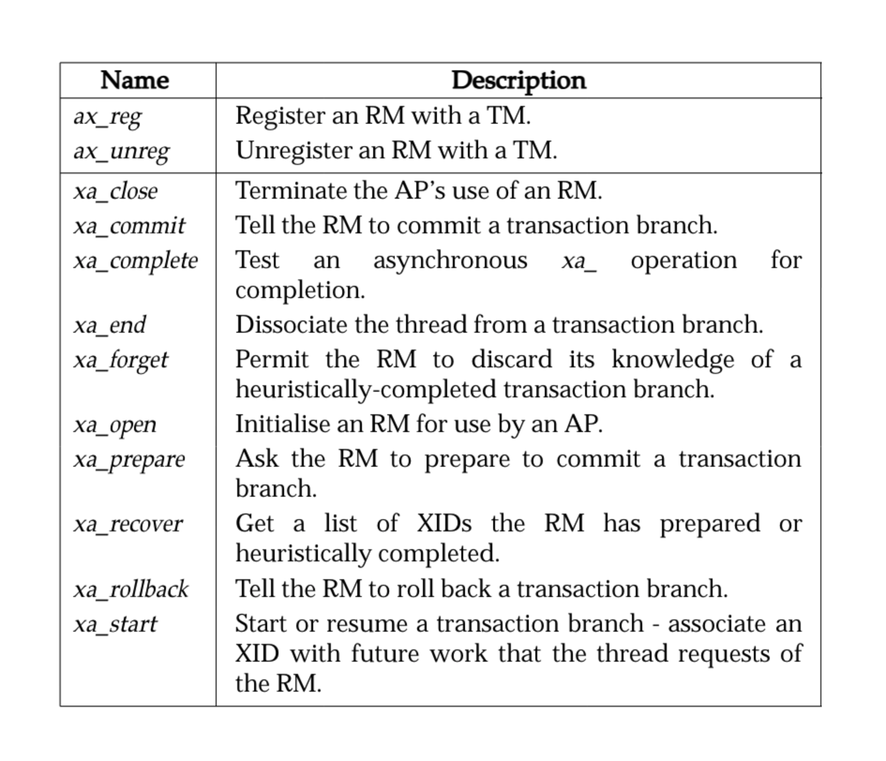

## 前言

TODO

## 什么是分布式事务

### 基本定义


### 使用场景

随着互联网、金融等行业的快速发展，业务越来越复杂，一个完整的业务往往需要调用多个子业务或服务，随着业务的不断增多，涉及的服务及数据也越来越多越来越复杂。传统的系统难以支撑，出现了应用和数据库等的分布式系统。分布式系统又带来了数据一致性的问题，从而产生了分布式事务。



## 如何实现分布式事务

基于第一个强一致的思路，就有了基于数据库本身支持的协议，XA 分布式事务。XA 整体设计思路可以概括为，如何在现有事务模型上微调扩展，实现分布式事务。

> X/Open，即现在的 open group，是一个独立的组织，主要负责制定各种行业技术标准。 X/Open 组织主要由各大知名公司或者厂商进行支持，这些组织不光遵循 X/Open 组织定义的行业技术标准，也参与到标准的制定。


### XA 分布式协议

应用程序(Application Program ，简称AP)：用于定义事务边界(即定义事务的开始和结束)，并且在事务边界内对资源进行操作。

资源管理器(Resource Manager，简称 RM)：如数据库、文件系统等，并提供访问资源的方式

事务管理器(Transaction Manager ，简称 TM)：负责分配事务唯一标识，监控事务的执行进度，并负责事务的提交、回滚等。




XA 接口，如下的命令会在单机的 MySQL 数据库上执行。

xa_start ：负责开启或者恢复一个事务分支
xa_end： 负责取消当前线程与事务分支的关联（表示 SQL 执行完成）
xa_prepare：询问 RM 是否准备好提交事务分支（判断当前数据库是否锁定资源，是否能够提交）
xa_commit：通知 RM 提交事务分支
xa_rollback： 通知 RM 回滚事务分支
xa_recover : 需要恢复的 XA 事务（查看当前的事务列表，即完成了 prepare 操作，但未提交或回滚）
思考：为什么 XA 事务又叫两阶段事务？




MySQL 数据库中，使用 `SHOW ENGINES;` 语句可以查看存储引擎是否支持 XA 事务，可以看到最常用的 `InnoDB` 存储引擎是支持 XA 事务的。

```sql
mysql> SHOW ENGINES;
+--------------------+---------+----------------------------------------------------------------+--------------+------+------------+
| Engine             | Support | Comment                                                        | Transactions | XA   | Savepoints |
+--------------------+---------+----------------------------------------------------------------+--------------+------+------------+
| ndbcluster         | NO      | Clustered, fault-tolerant tables                               | NULL         | NULL | NULL       |
| FEDERATED          | NO      | Federated MySQL storage engine                                 | NULL         | NULL | NULL       |
| MEMORY             | YES     | Hash based, stored in memory, useful for temporary tables      | NO           | NO   | NO         |
| InnoDB             | DEFAULT | Supports transactions, row-level locking, and foreign keys     | YES          | YES  | YES        |
| PERFORMANCE_SCHEMA | YES     | Performance Schema                                             | NO           | NO   | NO         |
| MyISAM             | YES     | MyISAM storage engine                                          | NO           | NO   | NO         |
| ndbinfo            | NO      | MySQL Cluster system information storage engine                | NULL         | NULL | NULL       |
| MRG_MYISAM         | YES     | Collection of identical MyISAM tables                          | NO           | NO   | NO         |
| BLACKHOLE          | YES     | /dev/null storage engine (anything you write to it disappears) | NO           | NO   | NO         |
| CSV                | YES     | CSV storage engine                                             | NO           | NO   | NO         |
| ARCHIVE            | YES     | Archive storage engine                                         | NO           | NO   | NO         |
+--------------------+---------+----------------------------------------------------------------+--------------+------+------------+
11 rows in set (0.01 sec)
```

如下演示了在 MySQL 数据库上执行 XA 事务的过程，分布式事务通过相同的 xid 来关联，表示他们属于同一个分布式事务。

```sql
mysql> XA START 'test';
Query OK, 0 rows affected (0.01 sec)

mysql> INSERT INTO t_order_0 VALUES(1000, 1, 'OK', 1, 'TEST', NOW());
Query OK, 1 row affected, 1 warning (0.01 sec)

mysql> SELECT * FROM t_order_0;
+----------+---------+--------+-------------+--------+---------------+
| order_id | user_id | status | merchant_id | remark | creation_date |
+----------+---------+--------+-------------+--------+---------------+
|     1000 |       1 | OK     |           1 | TEST   | 2024-04-29    |
+----------+---------+--------+-------------+--------+---------------+
1 row in set (0.01 sec)

mysql> XA END 'test';
Query OK, 0 rows affected (0.00 sec)

mysql> XA PREPARE 'test';
Query OK, 0 rows affected (0.00 sec)

mysql> XA RECOVER;
+----------+--------------+--------------+------+
| formatID | gtrid_length | bqual_length | data |
+----------+--------------+--------------+------+
|        1 |            4 |            0 | test |
+----------+--------------+--------------+------+
1 row in set (0.00 sec)

mysql> XA ROLLBACK 'test';
Query OK, 0 rows affected (0.01 sec)

mysql> SELECT * FROM t_order_0;
Empty set (0.00 sec)
```


## 分布式事务常见方案

### XA 分布式事务


