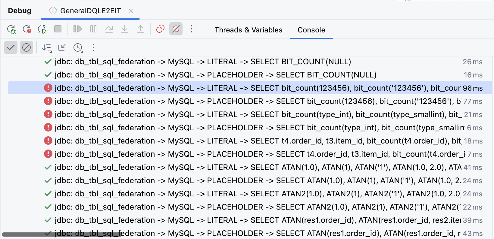
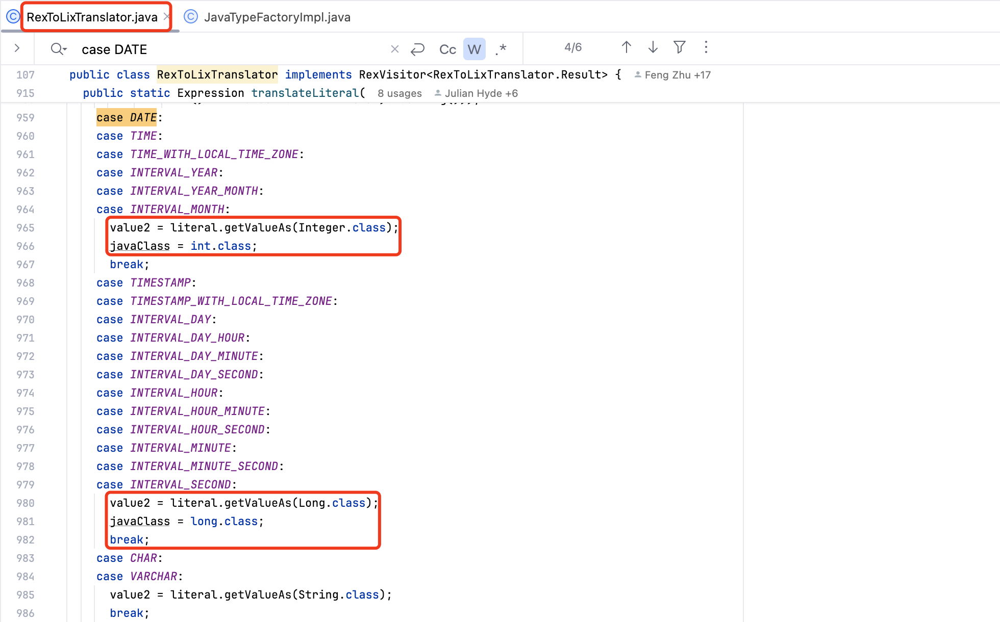

## 前言

熟悉 Apache ShardingSphere 的朋友们，可能听说过 SQL Federation 功能，它主要适用于海量数据水平分片场景下，提供对`跨节点关联查询`、`子查询`、`分页`、`排序`、`聚合查询`等复杂查询语句的支持。SQL Federation 功能内部使用了 Apache Calcite 项目，来实现 SQL 优化和执行。随着 [Calcite 1.38.0 版本](https://calcite.apache.org/docs/history.html#v1-38-0)的发布，Calcite 对于不同数据库的函数支持度进一步提升，为了提升 SQL Federation 功能支持度，升级 Calcite 至 1.38.0 版本也成为必然的选择。

由于升级前 ShardingSphere 使用的是 Caclite 1.35.0 版本，该版本和 1.38.0 相差了 1 年多，Calcite 内部进行了大量的优化和增强，因此升级后出现了 `BIT_COUNT` 函数无法执行的问题，下图展示了 ShardingSphere E2E 中出现异常的 `BIT_COUNT` Case。



## BIT_COUNT 异常初探

根据 ShardingSphere E2E 中抛出的异常信息，主要可以分为两类：`NumberFormatException` 和 `CalciteContextException`，下面我们分别来看下这两类异常出现的原因，并探究下 `1.38.0` 版本对于 MySQL `BIT_COUNT` 函数的支持情况。

### NumberFormatException

首先，我们来看下 `NumberFormatException`，根据异常信息可以看出，Calcite 会将 BIT_COUNT 函数的参数，转换为 `BigDecimal` 类型，然后在初始化 `BigDecimal` 对象时，遇到了不支持的字符 `a`。检查联邦查询的测试 Case，确实存在包含字符 `a` 的 SQL。

```
java.lang.NumberFormatException: Character a is neither a decimal digit number, decimal point, nor "e" notation exponential mark.
	at java.base/java.math.BigDecimal.<init>(BigDecimal.java:522)
	at java.base/java.math.BigDecimal.<init>(BigDecimal.java:405)
	at java.base/java.math.BigDecimal.<init>(BigDecimal.java:838)
	at org.apache.calcite.linq4j.tree.Primitive.charToDecimalCast(Primitive.java:433)
	at Baz$1$1.current(Unknown Source)
	at org.apache.shardingsphere.sqlfederation.resultset.SQLFederationResultSet.next(SQLFederationResultSet.java:105)
	at com.zaxxer.hikari.pool.HikariProxyResultSet.next(HikariProxyResultSet.java)
	at org.apache.shardingsphere.test.e2e.engine.type.dql.BaseDQLE2EIT.assertRows(BaseDQLE2EIT.java:157)
	at org.apache.shardingsphere.test.e2e.engine.type.dql.BaseDQLE2EIT.assertResultSet(BaseDQLE2EIT.java:107)
	at org.apache.shardingsphere.test.e2e.engine.type.dql.GeneralDQLE2EIT.assertExecuteQueryForStatement(GeneralDQLE2EIT.java:99)
	at org.apache.shardingsphere.test.e2e.engine.type.dql.GeneralDQLE2EIT.assertExecuteQueryWithExpectedDataSource(GeneralDQLE2EIT.java:85)
	at org.apache.shardingsphere.test.e2e.engine.type.dql.GeneralDQLE2EIT.assertExecuteQuery(GeneralDQLE2EIT.java:62)
	at org.apache.shardingsphere.test.e2e.engine.type.dql.GeneralDQLE2EIT.assertExecuteQuery(GeneralDQLE2EIT.java:55)
```

在 MySQL 中执行可以发现，当 BIT_COUNT 函数的参数，包含了 `abcdefg` 等非数值字符时，BIT_COUNT 函数会返回 0，而非抛出异常。因此，我们需要为 Calcite 函数进行增强，来支持 BIT_COUNT 函数包含非法字符的 SQL 场景。

```sql
mysql> SELECT bit_count(123456), bit_count('123456'), bit_count('abcdefg');
+-------------------+---------------------+----------------------+
| bit_count(123456) | bit_count('123456') | bit_count('abcdefg') |
+-------------------+---------------------+----------------------+
|                 6 |                   6 |                    0 |
+-------------------+---------------------+----------------------+
1 row in set, 1 warning (0.00 sec)
```

### CalciteContextException

我们再来看下 `CalciteContextException` 异常，根据异常堆栈可以发现，该异常是 Calcite 进行元数据校验时抛出的，`checkOperandTypes` 方法在进行操作数类型判断时，发现当前 Case 中的 `BIT_COUNT(<JAVATYPE(CLASS JAVA.LANG.BOOLEAN)>)` 还不支持，因此抛出了异常，我们需要为 Calcite BIT_COUNT 函数适配 `Boolean` 类型的参数。

```
Caused by: org.apache.calcite.runtime.CalciteContextException: At line 0, column 0: Cannot apply 'BIT_COUNT' to arguments of type 'BIT_COUNT(<JAVATYPE(CLASS JAVA.LANG.BOOLEAN)>)'. Supported form(s): 'BIT_COUNT(<NUMERIC>)'
'BIT_COUNT(<BINARY>)'
	at java.base/jdk.internal.reflect.NativeConstructorAccessorImpl.newInstance0(Native Method)
	at java.base/jdk.internal.reflect.NativeConstructorAccessorImpl.newInstance(NativeConstructorAccessorImpl.java:62)
	at java.base/jdk.internal.reflect.DelegatingConstructorAccessorImpl.newInstance(DelegatingConstructorAccessorImpl.java:45)
	at java.base/java.lang.reflect.Constructor.newInstance(Constructor.java:490)
	at org.apache.calcite.runtime.Resources$ExInstWithCause.ex(Resources.java:511)
	at org.apache.calcite.sql.SqlUtil.newContextException(SqlUtil.java:952)
	at org.apache.calcite.sql.SqlUtil.newContextException(SqlUtil.java:937)
	at org.apache.calcite.sql.validate.SqlValidatorImpl.newValidationError(SqlValidatorImpl.java:5899)
	at org.apache.calcite.sql.SqlCallBinding.newValidationSignatureError(SqlCallBinding.java:399)
	at org.apache.calcite.sql.type.FamilyOperandTypeChecker.checkSingleOperandType(FamilyOperandTypeChecker.java:137)
	at org.apache.calcite.sql.type.FamilyOperandTypeChecker.checkOperandTypes(FamilyOperandTypeChecker.java:172)
	at org.apache.calcite.sql.type.CompositeOperandTypeChecker.check(CompositeOperandTypeChecker.java:345)
	at org.apache.calcite.sql.type.CompositeOperandTypeChecker.checkOperandTypes(CompositeOperandTypeChecker.java:275)
	at org.apache.calcite.sql.SqlOperator.checkOperandTypes(SqlOperator.java:754)
	at org.apache.calcite.sql.SqlOperator.validateOperands(SqlOperator.java:496)
	at org.apache.calcite.sql.SqlFunction.deriveType(SqlFunction.java:350)
	at org.apache.calcite.sql.SqlFunction.deriveType(SqlFunction.java:232)
	at org.apache.calcite.sql.validate.SqlValidatorImpl$DeriveTypeVisitor.visit(SqlValidatorImpl.java:6967)
	at org.apache.calcite.sql.validate.SqlValidatorImpl$DeriveTypeVisitor.visit(SqlValidatorImpl.java:6954)
	at org.apache.calcite.sql.SqlCall.accept(SqlCall.java:168)
	at org.apache.calcite.sql.validate.SqlValidatorImpl.deriveTypeImpl(SqlValidatorImpl.java:2006)
	at org.apache.calcite.sql.validate.SqlValidatorImpl.deriveType(SqlValidatorImpl.java:1993)
	at org.apache.calcite.sql.validate.SqlValidatorImpl.expandSelectItem(SqlValidatorImpl.java:505)
	at org.apache.calcite.sql.validate.SqlValidatorImpl.validateSelectList(SqlValidatorImpl.java:5015)
	at org.apache.calcite.sql.validate.SqlValidatorImpl.validateSelect(SqlValidatorImpl.java:4096)
	at org.apache.calcite.sql.validate.SelectNamespace.validateImpl(SelectNamespace.java:62)
	at org.apache.calcite.sql.validate.AbstractNamespace.validate(AbstractNamespace.java:95)
	at org.apache.calcite.sql.validate.SqlValidatorImpl.validateNamespace(SqlValidatorImpl.java:1206)
	at org.apache.calcite.sql.validate.SqlValidatorImpl.validateQuery(SqlValidatorImpl.java:1177)
	at org.apache.calcite.sql.SqlSelect.validate(SqlSelect.java:282)
	at org.apache.calcite.sql.validate.SqlValidatorImpl.validateScopedExpression(SqlValidatorImpl.java:1143)
	at org.apache.calcite.sql.validate.SqlValidatorImpl.validate(SqlValidatorImpl.java:849)
	at org.apache.calcite.sql2rel.SqlToRelConverter.convertQuery(SqlToRelConverter.java:624)
	at org.apache.shardingsphere.sqlfederation.optimizer.statement.SQLStatementCompiler.compile(SQLStatementCompiler.java:55)
	at org.apache.shardingsphere.sqlfederation.optimizer.statement.SQLStatementCompilerEngine.compile(SQLStatementCompilerEngine.java:45)
	at org.apache.shardingsphere.sqlfederation.optimizer.SQLFederationCompilerEngine.compile(SQLFederationCompilerEngine.java:44)
	at org.apache.shardingsphere.sqlfederation.engine.SQLFederationEngine.compileQuery(SQLFederationEngine.java:227)
	at org.apache.shardingsphere.sqlfederation.engine.SQLFederationEngine.executeQuery(SQLFederationEngine.java:208)
	at org.apache.shardingsphere.driver.executor.engine.DriverExecuteQueryExecutor.executeQuery(DriverExecuteQueryExecutor.java:85)
	at org.apache.shardingsphere.driver.executor.engine.facade.DriverExecutorFacade.executeQuery(DriverExecutorFacade.java:104)
	at org.apache.shardingsphere.driver.jdbc.core.statement.ShardingSpherePreparedStatement.executeQuery(ShardingSpherePreparedStatement.java:180)
```

## MySQL BIT_COUNT 调研

初步分析了 ShardingSphere 联邦查询中的 BIT_COUNT 函数异常后，我们再来调研下 MySQL BIT_COUNT 函数，看下该函数的实际作用，以及它支持的参数类型。

根据 MySQL [BIT_COUNT 函数](https://dev.mysql.com/doc/refman/8.4/en/bit-functions.html#function_bit-count)文档说明，函数语法格式为 `BIT_COUNT(N)`，用于计算参数 `N` 的二进制形式中 `1` 的个数，如果参数为 NULL，BIT_COUNT 函数也会返回 NULL。

```
Returns the number of bits that are set in the argument N as an unsigned 64-bit integer, or NULL if the argument is NULL.
以无符号 64 位整数形式返回参数 N 中设置的位数，如果参数为 NULL，则返回 NULL。
```

MySQL 文档中并未具体说明 BIT_COUNT 具体支持哪些参数，我们使用 MySQL 来实际测试下 BIT_COUNT 函数。如下是一些常用类型的测试，包括数值类型、字符串类型，数值表达式，Boolean 类型以及 NULL。可以看到，当字符串中包含非 `0-9` 数字时，BIT_COUNT 函数会直接返回 0，而对于 Boolean 类型，会将 `true`、`false` 转换为 `1` 和 `0`，然后再进行 BIT_COUNT 计算。

```sql
mysql> SELECT bit_count(123456), bit_count('123456'), bit_count('abcdefg'), BIT_COUNT('abcdef1234'), bit_count(''), bit_count(1 + 1), bit_count(true), bit_count(null);
+-------------------+---------------------+----------------------+-------------------------+---------------+------------------+-----------------+-----------------+
| bit_count(123456) | bit_count('123456') | bit_count('abcdefg') | BIT_COUNT('abcdef1234') | bit_count('') | bit_count(1 + 1) | bit_count(true) | bit_count(null) |
+-------------------+---------------------+----------------------+-------------------------+---------------+------------------+-----------------+-----------------+
|                 6 |                   6 |                    0 |                       0 |             0 |                1 |               1 |            NULL |
+-------------------+---------------------+----------------------+-------------------------+---------------+------------------+-----------------+-----------------+
1 row in set, 3 warnings (0.00 sec)
```

除了数值类型外，BIT_COUNT 函数还支持日期/时间类型，MySQL BIT_COUNT 对于日期和时间的处理也比较特别，它会删除日期和时间格式中的非数字字符，例如：`BIT_COUNT(TIMESTAMP '1996-08-03 16:22:34')` 会转换为 `BIT_COUNT('19960803162234')` 进行计算。

```sql
mysql> SELECT BIT_COUNT(DATE '1996-08-03'), BIT_COUNT(TIME '16:22:34'), BIT_COUNT(TIMESTAMP '1996-08-03 16:22:34') UNION ALL
    -> SELECT BIT_COUNT(DATE '2001-01-01'), BIT_COUNT(TIME '12:20:00'), BIT_COUNT(TIMESTAMP '2001-01-01 12:20:00') UNION ALL
    -> SELECT BIT_COUNT(DATE '2002-05-03'), BIT_COUNT(TIME '13:12:14'), BIT_COUNT(TIMESTAMP '2002-05-03 13:12:14') UNION ALL
    -> SELECT BIT_COUNT(DATE '2005-09-07'), BIT_COUNT(TIME '06:02:04'), BIT_COUNT(TIMESTAMP '2005-09-07 06:02:04') UNION ALL
    -> SELECT BIT_COUNT(DATE '2007-01-01'), BIT_COUNT(TIME '23:09:59'), BIT_COUNT(TIMESTAMP '2007-01-01 23:09:59');
+------------------------------+----------------------------+--------------------------------------------+
| BIT_COUNT(DATE '1996-08-03') | BIT_COUNT(TIME '16:22:34') | BIT_COUNT(TIMESTAMP '1996-08-03 16:22:34') |
+------------------------------+----------------------------+--------------------------------------------+
|                           12 |                         11 |                                         24 |
|                           12 |                          8 |                                         22 |
|                           14 |                          5 |                                         22 |
|                           16 |                          9 |                                         25 |
|                           14 |                         10 |                                         21 |
+------------------------------+----------------------------+--------------------------------------------+
5 rows in set (0.03 sec)
```

此外，BIT_COUNT 函数还支持 `BINARY` 和 `VARBINARY` 类型以及负数等特殊类型和数值，下面展示了 `BINARY` 类型和 `-1` 计算 BIT_COUNT 值的结果。

```sql
mysql> SELECT BIT_COUNT(CAST(x'ad' AS BINARY(1))), BIT_COUNT(-1);
+-------------------------------------+---------------+
| BIT_COUNT(CAST(x'ad' AS BINARY(1))) | BIT_COUNT(-1) |
+-------------------------------------+---------------+
|                                   5 |            64 |
+-------------------------------------+---------------+
1 row in set (0.01 sec)
```

了解了 MySQL 中 BIT_COUNT 函数的含义，以及支持的类型后，下面我们再来探究下 Calcite 目前对 BIT_COUNT 函数的适配，以及我们如何扩展 BIT_COUNT 函数，能让它适配更多的 MySQL 数据类型，从而解决 ShardingSphere 联邦查询中出现的问题。

## Calcite BIT_COUNT 适配

### Calcite BIT_COUNT 现状梳理

参考 [CALCITE-3697](https://issues.apache.org/jira/browse/CALCITE-3697)，在 Calcite `1.38.0` 版本中，`Norman Jordan` 支持了 MySQL `BIT_COUNT` 函数。MySQL BIT_COUNT 函数除了支持标准 BITCOUNT 函数中的数值类型和二进制类型外，它还支持小数类型的参数，会使用参数的整数部分进行计算，下面展示了 MySQL BIT_COUNT 函数的一些示例。

|           Expression            | Result |
| :-----------------------------: | :----: |
|         bit_count(5.23)         |   2    |
| bit_count(18446744073709551615) |   64   |
| bit_count(18446744073709551616) |   63   |
| bit_count(18446744073709551617) |   63   |
| bit_count(-9223372036854775808) |   1    |
| bit_count(-9223372036854775809) |   1    |

Norman Jordan 在 [PR#3927](https://github.com/apache/calcite/pull/3927/files) 中增加了标准 `BITCOUNT` 函数，以及 `BIT_COUNT_BIG_QUERY` 和 `BIT_COUNT_MYSQL` 方言函数，函数实现都是调用的 `BuiltInMethod.BITCOUNT.method` 方法，`NullPolicy.STRICT` 表示参数为 NULL 时，函数直接返回 NULL 结果。

```java
// bitwise
defineMethod(BITCOUNT, BuiltInMethod.BITCOUNT.method, NullPolicy.STRICT);
defineMethod(BIT_COUNT_BIG_QUERY, BuiltInMethod.BITCOUNT.method, NullPolicy.STRICT);
defineMethod(BIT_COUNT_MYSQL, BuiltInMethod.BITCOUNT.method, NullPolicy.STRICT);
```

MySQL `BIT_COUNT` 函数声明接受 `NUMERIC` 或者 `BINARY` 类型的参数，因此 ShardingSphere 联邦查询传递字符 `a` 以及 `Boolean` 类型时，会出现报错。此外，MySQL 支持的 `DATE/TIME` 类型，Calcite `BIT_COUNT` 函数也没有进行实现。

```java
@LibraryOperator(libraries = {MYSQL})
public static final SqlFunction BIT_COUNT_MYSQL =
    new SqlFunction(
        "BIT_COUNT",
        SqlKind.OTHER_FUNCTION,
        ReturnTypes.BIGINT_NULLABLE,
        null,
        OperandTypes.NUMERIC.or(OperandTypes.BINARY),
        SqlFunctionCategory.NUMERIC);
```

`BIT_COUNT` 函数的具体实现逻辑在 `SqlFunctions` 类中，目前支持 `long`、`BigDecimal` 及 `ByteString` 3 种参数类型，`long` 类型入参用于支持常规的整数类型参数，直接调用 `Long#bitCount` 实现计算。

```java
/**
 * Helper function for implementing <code>BITCOUNT</code>. Counts the number
 * of bits set in an integer value.
 */
public static long bitCount(long b) {
    return Long.bitCount(b);
}
```

如果参数类型是 `BigDecimal`，则会比较参数值是否在 `(-2^63, 2^64 - 1)` 范围内，如果等于最大值，则返回 `64`，如果大于最大值，则返回 `63`，如果小于等于最小值，则固定返回 `1`，如果在区间范围内，则会丢弃小数部分，然后按照整数计算 BIT_COUNT 结果。

```java
private static final BigDecimal BITCOUNT_MAX = new BigDecimal(2).pow(64).subtract(new BigDecimal(1));
private static final BigDecimal BITCOUNT_MIN = new BigDecimal(2).pow(63).negate();

/**
 * Helper function for implementing <code>BITCOUNT</code>. Counts the number
 * of bits set in the integer portion of a decimal value.
 */
public static long bitCount(BigDecimal b) {
    final int comparison = b.compareTo(BITCOUNT_MAX);
    if (comparison < 0) {
        if (b.compareTo(BITCOUNT_MIN) <= 0) {
            return 1;
        } else {
            return bitCount(b.setScale(0, RoundingMode.DOWN).longValue());
        }
    } else if (comparison == 0) {
        return 64;
    } else {
        return 63;
    }
}
```

对于二进制类型，BIT_COUNT 函数会使用 `0xff` 逐字节去计算，然后将 BIT 位为 1 的个数进行累加，得到最终 BIT_COUNT 结果。

```java
/**
 * Helper function for implementing <code>BITCOUNT</code>. Counts the number
 * of bits set in a ByteString value.
 */
public static long bitCount(ByteString b) {
    long bitsSet = 0;
    for (int i = 0; i < b.length(); i++) {
        bitsSet += Integer.bitCount(0xff & b.byteAt(i));
    }
    return bitsSet;
}
```

从 Calcite BIT_COUNT 实现逻辑可以了解到，目前，Calcite 还没有适配非数值字符、Boolean 以及日期/时间类型，下面我们来探究下如何增强 BIT_COUNT 实现逻辑，来支持 MySQL 的这些特殊类型。

### Calcite BIT_COUNT 增强适配

想要为 BIT_COUNT 函数适配更多的数据类型，首先需要在 `SqlLibraryOperators` 中为 BIT_COUNT 函数声明更多的参数类型，我们增加如下的 `OperandTypes.BOOLEAN`、`OperandTypes.CHARACTER`、`OperandTypes.DATETIME`、`OperandTypes.DATE`、`OperandTypes.TIME` 和 `OperandTypes.TIMESTAMP` 类型。

```java
@LibraryOperator(libraries = {MYSQL})
public static final SqlFunction BIT_COUNT_MYSQL =
    new SqlFunction(
        "BIT_COUNT",
        SqlKind.OTHER_FUNCTION,
        ReturnTypes.BIGINT_NULLABLE,
        null,
        OperandTypes.or(OperandTypes.NUMERIC,
            OperandTypes.BINARY,
            OperandTypes.BOOLEAN,
            OperandTypes.CHARACTER,
            OperandTypes.DATETIME,
            OperandTypes.DATE,
            OperandTypes.TIME,
            OperandTypes.TIMESTAMP),
        SqlFunctionCategory.NUMERIC);
```

然后我们需要在 `RexImpTable` 类中定义函数实现，将上面的函数声明对象 `BIT_COUNT_MYSQL` 和具体的函数实现逻辑关联上。下面展示了定义函数实现的具体逻辑，Calcite 动态编译会根据这个映射关系，找到函数的具体实现，即：`SqlFunctions#bitCountMySQL`，声明中最后一个参数 `Object.class` 代表的函数的参数类型，由于 MySQL BIT_COUNT 函数支持多种类型，因此我们先将参数类型定义为 `Object.class`。

```java
// 定义函数实现
defineMethod(BIT_COUNT_MYSQL, BuiltInMethod.BIT_COUNT_MYSQL.method, NullPolicy.STRICT);
// 声明 MySQL BIT_COUNT 函数实现方法
BIT_COUNT_MYSQL(SqlFunctions.class, "bitCountMySQL", Object.class),
```

`SqlFunctions#bitCountMySQL` 具体实现逻辑如下，除了支持原有的数值和二进制类型，我们还增加了 Boolean 和 String 类型，并且当 String 类型中出现非数字字符时，捕获异常然后返回 0。对于 `Date`、`Time` 和 `Timestamp`，实现逻辑中模拟了 MySQL 的行为，将这几个类型中的非数字字符去除，然后计算 `BIT_COUNT` 值。

```java
/**
 * Helper function for implementing <code>BIT_COUNT_MYSQL</code>. Counts the number
 * of bits set in an Object value.
 */
public static long bitCountMySQL(Object b) {
    // Boolean 转换为 1 或 0 计算
    if (b instanceof Boolean) {
        return Long.bitCount((Boolean) b ? 1L : 0L);
    }
    // 当出现非数字字符时，捕获异常返回 0
    if (b instanceof String) {
        try {
            return bitCount(new BigDecimal((String) b));
        } catch (Exception ignore) {
            return 0;
        }
    }
    if (b instanceof Number) {
        return bitCount(new BigDecimal(b.toString()));
    }
    if (b instanceof ByteString) {
        return bitCount((ByteString) b);
    }
    // Date 去除非数字字符后计算
    if (b instanceof java.sql.Date) {
        return bitCountMySQL(new SimpleDateFormat("yyyyMMdd").format(((java.sql.Date) b)));
    }
    // Time 去除非数字字符后计算
    if (b instanceof Time) {
        return bitCountMySQL(new SimpleDateFormat("HHmmss").format(((Time) b)));
    }
    // Timestamp 去除非数字字符后计算
    if (b instanceof Timestamp) {
        return bitCountMySQL(new SimpleDateFormat("yyyyMMddHHmmss").format(((Timestamp) b)));
    }
    return 0;
}
```

`BIT_COUNT` 实现逻辑增强后，我们在 Calcite `functions.iq` 文件中增加相关类型的测试用例，执行后发现 `Date`、`Time` 和 `Timestamp` 类型计算的结果和 MySQL 不一致，这又是为什么呢？

跟踪 `BIT_COUNT` 函数的执行逻辑可以发现，Calcite 在生成执行代码前，会调用 `implement` 方法生成可执行代码，生成的过程中会调用 `RexToLixTranslator` 将日期、时间类型转换为自 1970 年以来的整数值，因此传入 `bitCountMySQL` 方法的日期、时间参数被转换为整数，此时计算的 `BIT_COUNT` 结果出现了错误。



TODO


## 结语

TODO




笔者因为工作原因接触到 Calcite，前期学习过程中，深感 Calcite 学习资料之匮乏，因此创建了 [Calcite 从入门到精通知识星球](https://wx.zsxq.com/dweb2/index/group/51128414222814)，希望能够将学习过程中的资料和经验沉淀下来，为更多想要学习 Calcite 的朋友提供一些帮助。




欢迎关注「**端小强的博客**」微信公众号，会不定期分享日常学习和工作经验，欢迎大家关注交流。


