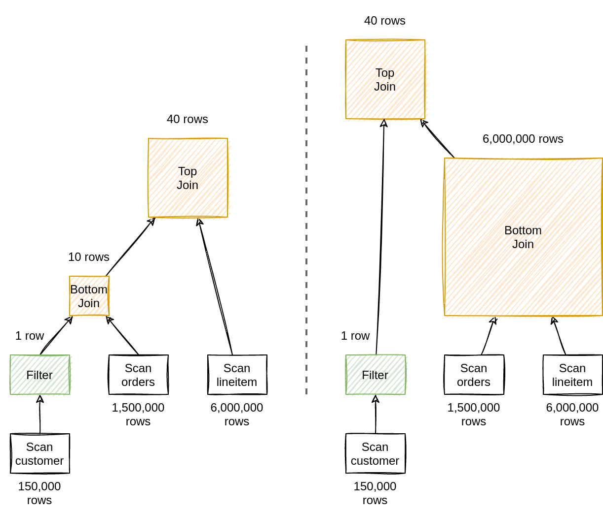

> 注意：本文基于 [Calcite 1.35.0](https://github.com/apache/calcite/tree/75750b78b5ac692caa654f506fc1515d4d3991d6) 版本源码进行学习研究，其他版本可能会存在实现逻辑差异，对源码感兴趣的读者**请注意版本选择**。

## 前言

在上一篇[深入理解 Apache Calcite ValcanoPlanner 优化器](https://strongduanmu.com/blog/deep-understand-of-apache-calcite-volcano-planner.html)一文中，我们介绍了 Calcite VolcanoPlanner 的理论基础、核心概念和整体流程，VolcanoPlanner 在优化时会计算不同执行计划的代价 Cost，然后通过代价的比较，最终寻找出最小代价的执行计划。代价 Cost 的计算依赖于`统计信息`和`代价模型`，统计信息是否准确，代价模型是否合理，直接影响了 VolcanoPlanner 优化的效果。上一篇文章中，我们对 Calcite 统计信息和代价模型，只进行了简单的介绍，今天我们将结合一个多表关联查询的案例，和大家一起探究下 Calcite 是如何使用统计信息和代价模型，以及在优化过程中，Calcite 会使用哪些优化方式得到最优执行计划。

## 统计信息和代价模型

在探究 Calcite 如何使用统计信息和代价模型之前，让我们先来了解下相关的基础知识，笔者参考了一些优秀的网络资料，进行了总结整理，原文链接见文末参考资料，感兴趣的读者可阅读研究。

### 统计信息

统计信息 `Statistic` 为优化器的 Cost 计算提供了必要的数据支撑，通常我们可以将统计信息划分为`基础统计信息`和`高级统计信息`。

基础统计信息负责大部分通用场景下的 Cost 计算，具体包括表级别的统计信息 `Row Count`，单个字段的统计信息：每个字段的 `NDV 值`（The Number of Distinct Values），`Max 值`，`Min 值`，`NULL 值`，`Histogram 值`（分布信息，用于区间查询）, `Count-Min Sketch 值`（用于等值查询），`DataSize 值` 等。由于基础统计信息对 Cost 计算至关重要，需要做到自动收集，自动更新，否则很可能因为基础统计信息的缺失，导致优化器产生灾难性的执行计划。

高级统计信息主要用于提升复杂场景下的决策质量，通常包括`多字段间的关联度`（Column Group）、`Functional Deplendency`、`数据倾斜` 等，高级统计信息需要手工触发，只有在必要的时候才会收集。

### 基数估计

有了统计信息后，我们就可以对执行计划中的各个算子进行基数估计（`Cardinality Estimation`），估算这些算子产生结果的行数（或基数）。如下图所示，通过基数估计我们可以选择更优的 `JOIN` 顺序以减少中间结果。`Scan` 算子的行数可以直接从表的统计信息 `Row Count` 获取，而对于 `Filter` 算子，可以使用输入的 `Scan` 算子的行数乘以谓词的选择性。



下面展示了常用算子基数估计的例子：

- `Scan` 算子基数估计：统计信息中收集的表 Row Count；
- `Filter` 算子基数估计：对于唯一属性的谓词，相等条件下结果不超过一行，对于非唯一属性的谓词，相等条件下结果使用 `NDV` 估算选择率，然后计算结果。对于范围查询，我们可以使用直方图估算选择率，然后计算结果；
- `Join` 算子基数估计：`LeftRowCount * RightRowCount * Join Condition Selectivity`；
- `Union` 算子基数估计：`LeftRowCount + RightRowCount`；
- `Agg` 算子基数估计：Group By 列的 Distinct 值数量（NDV）。

### 代价模型

代价模型（`Cost Model`）是用于估算物理执行计划的代价，代价通常使用 `CPU`、`Memory`、`IO`、`Net` 四元组来描述，每一算子都会通过上述四元组来描述其代价。执行计划的代价即是其全部算子的代价之和，最终优化器会根据求和后的 CPU、Memory、IO、Net 加权计算出执行计划的最终代价。

* `CPU`：代表 CPU 的消耗数值；
* `Memory`：代表 Memory 的占用量；
* `IO`：代表磁盘的逻辑 IO 次数；
* `Net`：代表网络的逻辑 IO 次数（交互次数及传输量）；
* 最终 Cost = (CPU, Memory, IO, Net) · (w<sub>1</sub>, w<sub>2</sub>, w<sub>3</sub>, w<sub>4</sub>)，w 为权重向量。

## Calcite 统计信息实现

Calcite 将统计信息存储在元数据对象中进行管理，通过 `RelMetadataQuery` 类提供了所有元数据的访问入口，该类包含每个元数据的访问方法，访问方法中需要传递对应的关系代数类 RelNode 及其他参数。例如，获取基数 `Cardinality` 只需要 RelNode，而获取选择性 `Selectivity` 还需要传入谓词：

```java
class RelMetadataQuery {
    // Cardinality
    public Double getRowCount(RelNode rel) {...}

    // Selectivity
    public Double getSelectivity(RelNode rel, RexNode predicate) {...}
}
```

TODO

org/apache/calcite/test/JdbcAdapterTest.java:315 testJoin3TablesPlan 作为示例：

```java
@Test
void testJoin3TablesPlan() {
    CalciteAssert.model(JdbcTest.SCOTT_MODEL)
        .query("select  empno, ename, dname, grade\n"
            + "from scott.emp e inner join scott.dept d\n"
            + "on e.deptno = d.deptno\n"
            + "inner join scott.salgrade s\n"
            + "on e.sal > s.losal and e.sal < s.hisal")
        .explainContains("PLAN=JdbcToEnumerableConverter\n"
            + "  JdbcProject(EMPNO=[$0], ENAME=[$1], DNAME=[$5], GRADE=[$6])\n"
            + "    JdbcJoin(condition=[AND(>($2, $7), <($2, $8))], joinType=[inner])\n"
            + "      JdbcJoin(condition=[=($3, $4)], joinType=[inner])\n"
            + "        JdbcProject(EMPNO=[$0], ENAME=[$1], SAL=[$5], DEPTNO=[$7])\n"
            + "          JdbcTableScan(table=[[SCOTT, EMP]])\n"
            + "        JdbcProject(DEPTNO=[$0], DNAME=[$1])\n"
            + "          JdbcTableScan(table=[[SCOTT, DEPT]])\n"
            + "      JdbcTableScan(table=[[SCOTT, SALGRADE]])\n")
        .runs()
        .enable(CalciteAssert.DB == CalciteAssert.DatabaseInstance.HSQLDB)
        .planHasSql("SELECT \"t\".\"EMPNO\", \"t\".\"ENAME\", "
            + "\"t0\".\"DNAME\", \"SALGRADE\".\"GRADE\"\n"
            + "FROM (SELECT \"EMPNO\", \"ENAME\", \"SAL\", \"DEPTNO\"\n"
            + "FROM \"SCOTT\".\"EMP\") AS \"t\"\n"
            + "INNER JOIN (SELECT \"DEPTNO\", \"DNAME\"\n"
            + "FROM \"SCOTT\".\"DEPT\") AS \"t0\" ON \"t\".\"DEPTNO\" = \"t0\".\"DEPTNO\"\n"
            + "INNER JOIN \"SCOTT\".\"SALGRADE\" "
            + "ON \"t\".\"SAL\" > \"SALGRADE\".\"LOSAL\" "
            + "AND \"t\".\"SAL\" < \"SALGRADE\".\"HISAL\"");
}
```


## Calcite 代价模型实现

TODO


## 结语

TODO




笔者因为工作原因接触到 Calcite，前期学习过程中，深感 Calcite 学习资料之匮乏，因此创建了 [Calcite 从入门到精通知识星球](https://wx.zsxq.com/dweb2/index/group/51128414222814)，希望能够将学习过程中的资料和经验沉淀下来，为更多想要学习 Calcite 的朋友提供一些帮助。


