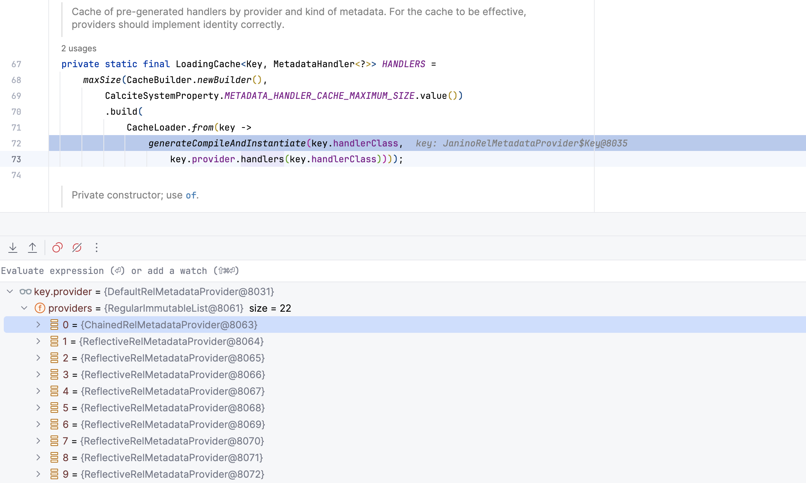
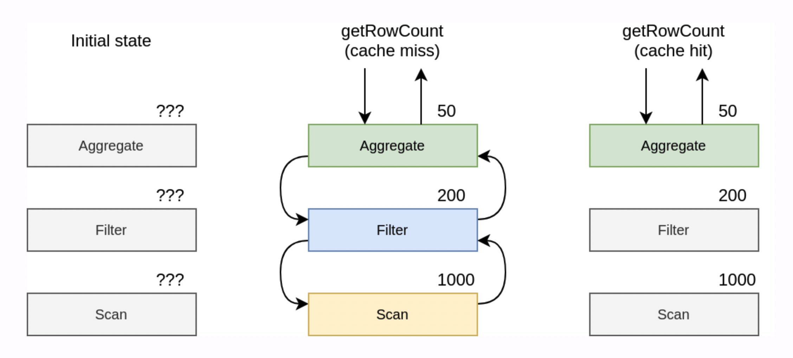
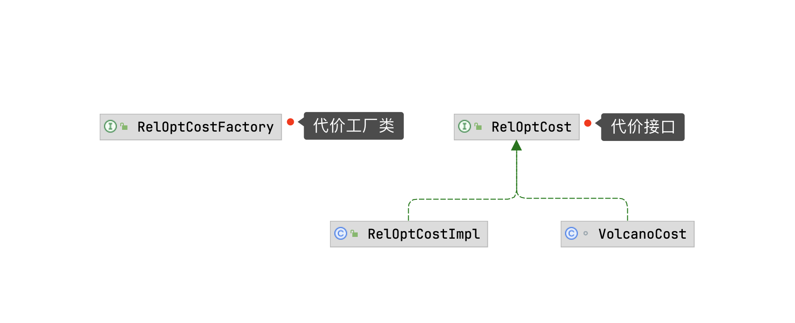
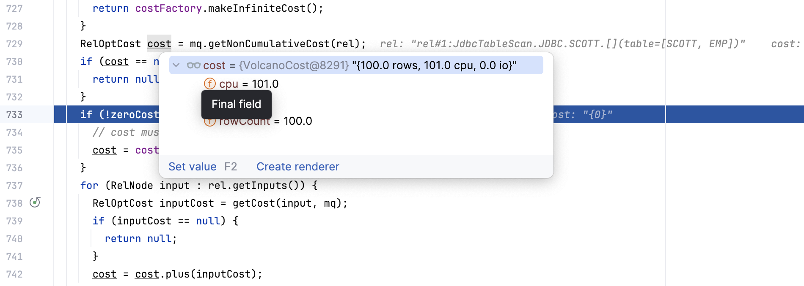

> 注意：本文基于 [Calcite 1.35.0](https://github.com/apache/calcite/tree/75750b78b5ac692caa654f506fc1515d4d3991d6) 版本源码进行学习研究，其他版本可能会存在实现逻辑差异，对源码感兴趣的读者**请注意版本选择**。

## 前言

在上一篇[深入理解 Apache Calcite ValcanoPlanner 优化器](https://strongduanmu.com/blog/deep-understand-of-apache-calcite-volcano-planner.html)一文中，我们介绍了 Calcite VolcanoPlanner 的理论基础、核心概念和整体流程，VolcanoPlanner 在优化时会计算不同执行计划的代价 Cost，然后通过代价的比较，最终寻找出最小代价的执行计划。代价 Cost 的计算依赖于`统计信息`和`代价模型`，统计信息是否准确，代价模型是否合理，直接影响了 VolcanoPlanner 优化的效果。上一篇文章中，我们对 Calcite 统计信息和代价模型进行了简单的介绍，今天我们将结合一个多表关联查询的案例，和大家一起探究下 Calcite 是如何使用统计信息和代价模型，以及在优化过程中，Calcite 会使用哪些优化方式得到最优执行计划。

## 统计信息和代价模型

在探究 Calcite 如何使用统计信息和代价模型之前，让我们先来了解下相关的基础知识，笔者参考了一些优秀的网络资料，进行了总结整理，原文链接见文末参考资料，感兴趣的读者可阅读研究。

### 统计信息

统计信息 `Statistic` 为优化器的 Cost 计算提供了必要的数据支撑，通常我们可以将统计信息划分为`基础统计信息`和`高级统计信息`。

基础统计信息负责大部分通用场景下的 Cost 计算，具体包括表级别的统计信息 `Row Count`，单个字段的统计信息：每个字段的 `NDV 值`（The Number of Distinct Values），`Max 值`，`Min 值`，`NULL 值`，`Histogram 值`（分布信息，用于区间查询）, `Count-Min Sketch 值`（用于等值查询），`DataSize 值` 等。由于基础统计信息对 Cost 计算至关重要，需要做到自动收集，自动更新，否则很可能因为基础统计信息的缺失，导致优化器产生灾难性的执行计划。

高级统计信息主要用于提升复杂场景下的决策质量，通常包括`多字段间的关联度`（Column Group）、`Functional Deplendency`、`数据倾斜` 等，高级统计信息需要手工触发，只有在必要的时候才会收集。

### 基数估计

有了统计信息后，我们就可以对执行计划中的各个算子进行基数估计（`Cardinality Estimation`），估算这些算子产生结果的行数（或基数）。如下图所示，通过基数估计我们可以选择更优的 `JOIN` 顺序以减少中间结果。`Scan` 算子的行数可以直接从表的统计信息 `Row Count` 获取，而对于 `Filter` 算子，可以使用输入的 `Scan` 算子的行数乘以谓词的选择率。


下面展示了常用算子基数估计的例子：

- `Scan` 算子基数估计：统计信息中收集的表 Row Count；
- `Filter` 算子基数估计：对于唯一属性的谓词，相等条件下结果不超过一行，对于非唯一属性的谓词，相等条件下结果使用 `NDV` 估算选择率，然后计算结果。对于范围查询，我们可以使用直方图估算选择率，然后计算结果；
- `Join` 算子基数估计：`LeftRowCount * RightRowCount * Join Condition Selectivity`；
- `Union` 算子基数估计：`LeftRowCount + RightRowCount`；
- `Agg` 算子基数估计：Group By 列的 Distinct 值数量（NDV）。

### 代价模型

代价模型（`Cost Model`）是用于估算物理执行计划的代价，代价通常使用 `CPU`、`Memory`、`IO`、`Net` 四元组来描述，每一算子都会通过上述四元组来描述其代价。执行计划的代价即是其全部算子的代价之和，最终优化器会根据求和后的 CPU、Memory、IO、Net 加权计算出执行计划的最终代价。

* `CPU`：代表 CPU 的消耗数值；
* `Memory`：代表 Memory 的占用量；
* `IO`：代表磁盘的逻辑 IO 次数；
* `Net`：代表网络的逻辑 IO 次数（交互次数及传输量）；
* 最终 `Cost` = (CPU, Memory, IO, Net) · (w<sub>1</sub>, w<sub>2</sub>, w<sub>3</sub>, w<sub>4</sub>)，w 为权重向量。

## Calcite 统计信息实现

Calcite 将统计信息存储在元数据对象中进行管理，通过 `RelMetadataQuery` 类提供了所有元数据的访问入口，该类包含每个元数据的访问方法，访问方法中需要传递对应的关系代数类 RelNode 及其他参数。例如，获取基数 `Cardinality` 只需要 RelNode，而获取选择率 `Selectivity` 还需要传入谓词 `predicate`：

```java
class RelMetadataQuery {

    // Cardinality
    public Double getRowCount(RelNode rel) {...}

    // Selectivity
    public Double getSelectivity(RelNode rel, RexNode predicate) {...}
}
```

下面展示了 [JdbcAdapterTest#testJoin3TablesPlan](https://github.com/apache/calcite/blob/b16df019ed9fc7dba7392be9b758358c5a4e927b/core/src/test/java/org/apache/calcite/test/JdbcAdapterTest.java#L315) 单测，测试 SQL 中包含了 `scott.emp`、`scott.dept` 和 `scott.salgrade` 3 张表，分别使用了等值和非等值关联条件。

```java
@Test
void testJoin3TablesPlan() {
    CalciteAssert.model(JdbcTest.SCOTT_MODEL)
        .query("select  empno, ename, dname, grade\n"
            + "from scott.emp e inner join scott.dept d\n"
            + "on e.deptno = d.deptno\n"
            + "inner join scott.salgrade s\n"
            + "on e.sal > s.losal and e.sal < s.hisal")
        .explainContains("PLAN=JdbcToEnumerableConverter\n"
            + "  JdbcProject(EMPNO=[$0], ENAME=[$1], DNAME=[$5], GRADE=[$6])\n"
            + "    JdbcJoin(condition=[AND(>($2, $7), <($2, $8))], joinType=[inner])\n"
            + "      JdbcJoin(condition=[=($3, $4)], joinType=[inner])\n"
            + "        JdbcProject(EMPNO=[$0], ENAME=[$1], SAL=[$5], DEPTNO=[$7])\n"
            + "          JdbcTableScan(table=[[SCOTT, EMP]])\n"
            + "        JdbcProject(DEPTNO=[$0], DNAME=[$1])\n"
            + "          JdbcTableScan(table=[[SCOTT, DEPT]])\n"
            + "      JdbcTableScan(table=[[SCOTT, SALGRADE]])\n")
        .runs()
        .enable(CalciteAssert.DB == CalciteAssert.DatabaseInstance.HSQLDB)
        .planHasSql("SELECT \"t\".\"EMPNO\", \"t\".\"ENAME\", "
            + "\"t0\".\"DNAME\", \"SALGRADE\".\"GRADE\"\n"
            + "FROM (SELECT \"EMPNO\", \"ENAME\", \"SAL\", \"DEPTNO\"\n"
            + "FROM \"SCOTT\".\"EMP\") AS \"t\"\n"
            + "INNER JOIN (SELECT \"DEPTNO\", \"DNAME\"\n"
            + "FROM \"SCOTT\".\"DEPT\") AS \"t0\" ON \"t\".\"DEPTNO\" = \"t0\".\"DEPTNO\"\n"
            + "INNER JOIN \"SCOTT\".\"SALGRADE\" "
            + "ON \"t\".\"SAL\" > \"SALGRADE\".\"LOSAL\" "
            + "AND \"t\".\"SAL\" < \"SALGRADE\".\"HISAL\"");
}
```

我们将结合此案例，来探究下 Calcite 统计信息入口类 `RelMetadataQuery` 如何进行初始化，它的内部又将调用哪些元数据对象以获取统计信息，此外，Caclite 又是如何基于统计信息进行基数估计。搞清楚这些问题后，相信大家对 Calcite 统计信息的实现会有更深刻的理解。

### RelMetadataQuery 初始化

执行 [JdbcAdapterTest#testJoin3TablesPlan](https://github.com/apache/calcite/blob/b16df019ed9fc7dba7392be9b758358c5a4e927b/core/src/test/java/org/apache/calcite/test/JdbcAdapterTest.java#L315) 单测，首先会调用 `RelOptCluster.create(planner, rexBuilder);` 方法初始化 `RelOptCluster` 对象，初始化 RelOptCluster 时内部会调用 `setMetadataProvider` 和 `setMetadataQuerySupplier` 方法，下面的小节我们将分别探究下这两个初始化方法的内部实现细节。

```java
/**
 * Creates a cluster.
 *
 * <p>For use only from {@link #create} and {@link RelOptQuery}.
 */
RelOptCluster(RelOptPlanner planner, RelDataTypeFactory typeFactory, RexBuilder rexBuilder, AtomicInteger nextCorrel, Map<String, RelNode> mapCorrelToRel) {
    this.nextCorrel = nextCorrel;
    this.mapCorrelToRel = mapCorrelToRel;
    this.planner = Objects.requireNonNull(planner, "planner");
    this.typeFactory = Objects.requireNonNull(typeFactory, "typeFactory");
    this.rexBuilder = rexBuilder;
    this.originalExpression = rexBuilder.makeLiteral("?");

    // set up a default rel metadata provider,
    // giving the planner first crack at everything
    setMetadataProvider(DefaultRelMetadataProvider.INSTANCE);
    setMetadataQuerySupplier(RelMetadataQuery::instance);
    this.emptyTraitSet = planner.emptyTraitSet();
    assert emptyTraitSet.size() == planner.getRelTraitDefs().size();
}
```

#### setMetadataProvider 初始化

我们先来看下 `setMetadataProvider` 方法，该方法会传入 `DefaultRelMetadataProvider.INSTANCE` 实例，方法内部会将 metadataProvider 记录在 RelOptCluster 中，并将 metadataProvider 封装为 `JaninoRelMetadataProvider`，然后设置在 ThreadLocal 中方便上下文进行访问。

```java
@EnsuresNonNull({"this.metadataProvider", "this.metadataFactory"})
public void setMetadataProvider(@UnknownInitialization RelOptCluster this, RelMetadataProvider metadataProvider) {
    this.metadataProvider = metadataProvider;
  	// 将 metadataProvider 封装在 metadataFactory 中，内部会缓存 UnboundMetadata
    this.metadataFactory = new org.apache.calcite.rel.metadata.MetadataFactoryImpl(metadataProvider);
    // Wrap the metadata provider as a JaninoRelMetadataProvider
    // and set it to the ThreadLocal,
    // JaninoRelMetadataProvider is required by the RelMetadataQuery.
    RelMetadataQueryBase.THREAD_PROVIDERS.set(JaninoRelMetadataProvider.of(metadataProvider));
}
```

`DefaultRelMetadataProvider.INSTANCE` 实例初始化逻辑如下，作为默认的元数据提供器，DefaultRelMetadataProvider 定义了所有常用的关系代数 RelNode 的处理器，如果使用调用链方式时（使用 `ChainedRelMetadataProvider`），需要将 DefaultRelMetadataProvider 放在最后一个作为兜底方案。

```java
/**
 * Creates a new default provider. This provider defines "catch-all"
 * handlers for generic RelNodes, so it should always be given lowest
 * priority when chaining.
 *
 * <p>Use this constructor only from a sub-class. Otherwise use the singleton
 * instance, {@link #INSTANCE}.
 */
protected DefaultRelMetadataProvider() {
    super(
        ImmutableList.of(
            RelMdPercentageOriginalRows.SOURCE,
            RelMdColumnOrigins.SOURCE,
            RelMdExpressionLineage.SOURCE,
            RelMdTableReferences.SOURCE,
            RelMdNodeTypes.SOURCE,
            RelMdRowCount.SOURCE,
            RelMdMaxRowCount.SOURCE,
            RelMdMinRowCount.SOURCE,
            RelMdUniqueKeys.SOURCE,
            RelMdColumnUniqueness.SOURCE,
            RelMdPopulationSize.SOURCE,
            RelMdSize.SOURCE,
            RelMdParallelism.SOURCE,
            RelMdDistribution.SOURCE,
            RelMdLowerBoundCost.SOURCE,
            RelMdMemory.SOURCE,
            RelMdDistinctRowCount.SOURCE,
            RelMdSelectivity.SOURCE,
            RelMdExplainVisibility.SOURCE,
            RelMdPredicates.SOURCE,
            RelMdAllPredicates.SOURCE,
            RelMdCollation.SOURCE));
}
```

`super` 方法会将集合中初始化的 RelMetadataProvider 集合传递给父类 `ChainedRelMetadataProvider`，并维护在 `providers` 变量中，后续调用 `ChainedRelMetadataProvider#apply` 和 `ChainedRelMetadataProvider#handlers` 方法时会从 providers 中获取。


上图展示了 RelMetadataProvider 继承体系，RelMetadataProvider 接口定义了获取关系表达式元数据的方法，通常不建议直接调用，而应当使用 RelMetadataQuery 入口类获取元数据。关于设计 RelMetadataProvider 的背景和动机，可以参考 [RelationalExpressionMetadata Wiki](http://www.hydromatic.net/wiki/RelationalExpressionMetadata)。

RelMetadataProvider 接口定义如下：

```java
public interface RelMetadataProvider {

    // 为具体的关系代数类或子类，获取特定类型的统计信息，该方法返回的是 UnboundMetadata 函数式接口
  	// 使用时可以调用 bind 方法返回绑定的元数据对象
    @Deprecated
    <@Nullable M extends @Nullable Metadata> @Nullable UnboundMetadata<M> apply(
            Class<? extends RelNode> relClass, Class<? extends M> metadataClass);

    @Deprecated
    <M extends Metadata> Multimap<Method, MetadataHandler<M>> handlers(MetadataDef<M> def);
		
  	// 获取实现特定 MetadataHandler 接口的 MetadataHandler 集合
  	// MetadataHandler 是元数据处理器的标记接口，MetadataHandler#getDef 方法用于获取元数据处理器的定义，包含了元数据类，处理器类和处理方法
    List<MetadataHandler<?>> handlers(Class<? extends MetadataHandler<?>> handlerClass);
}
```

`RelMetadataProvider#apply` 方法用于为具体的关系代数类或子类，获取特定类型的统计信息，该方法返回的是 `UnboundMetadata` 函数式接口，使用时可以调用 bind 方法返回绑定的元数据对象。该方法的使用示例如下，执行完 bind 方法会返回元数据对象 Selectivity，然后可以调用 getSelectivity 获取选择率统计信息。

```java
RelMetadataProvider provider;
LogicalFilter filter;
RexNode predicate;
UnboundMetadata<Selectivity> unboundMetadata = provider.apply(LogicalFilter.class, Selectivity.class);
Selectivity selectivity = unboundMetadata.bind(filter, mq);
Double d = selectivity.getSelectivity(predicate);
```

`RelMetadataProvider#handlers` 方法用于获取实现特定 `MetadataHandler` 接口的 MetadataHandler 集合。MetadataHandler 是元数据处理器的标记接口，`MetadataHandler#getDef` 方法用于获取元数据处理器的定义，包含了元数据类，处理器类和处理方法。

```java
/**
 * Marker interface for a handler of metadata.
 *
 * @param <M> Kind of metadata
 */
public interface MetadataHandler<M extends Metadata> {

  	MetadataDef<M> getDef();

    static SortedMap<String, Method> handlerMethods(Class<? extends MetadataHandler<?>> handlerClass) {
        final ImmutableSortedMap.Builder<String, Method> map = ImmutableSortedMap.naturalOrder();
        Arrays.stream(handlerClass.getDeclaredMethods()).filter(m -> !m.getName().equals("getDef"))
                .filter(m -> !m.isSynthetic()).filter(m -> !Modifier.isStatic(m.getModifiers())).forEach(m -> map.put(m.getName(), m));
        return map.build();
    }
}
```

MetadataHandler 接口还提供了静态方法 `handlerMethods`，该方法负责查找 MetadataHandler 实现类中定义的处理方法，结果会按照 `<MethodName, Method>` 结构返回，并且会过滤掉静态、`synthetic`（Java 编译器生成的方法）和 `getDef` 方法。

介绍完 RelMetadataProvider 接口的相关方法后，我们再回过头看下 DefaultRelMetadataProvider 初始化时，传递给父类的 22 个 providers 是如何创建的，他们分别又有哪些实际的用途。下面我们以 `RelMdPercentageOriginalRows.SOURCE` 为例，来看下具体的元数据提供器的内部实现。`RelMdPercentageOriginalRows.SOURCE` 实现逻辑如下，可以看到此处通过反射的方式初始化了 3 个元数据提供器，并使用 ChainedRelMetadataProvider 进行了包装，ChainedRelMetadataProvider 内部使用了[责任链模式](https://refactoringguru.cn/design-patterns/chain-of-responsibility)，会按照责任链进行元数据处理。

```java
public static final RelMetadataProvider SOURCE = ChainedRelMetadataProvider.of(ImmutableList.of(
    ReflectiveRelMetadataProvider.reflectiveSource(new RelMdPercentageOriginalRowsHandler(), BuiltInMetadata.PercentageOriginalRows.Handler.class),
    ReflectiveRelMetadataProvider.reflectiveSource(new RelMdCumulativeCost(), BuiltInMetadata.CumulativeCost.Handler.class),
    ReflectiveRelMetadataProvider.reflectiveSource(new RelMdNonCumulativeCost(), BuiltInMetadata.NonCumulativeCost.Handler.class))
);
```

我们重点关注下 `ReflectiveRelMetadataProvider.reflectiveSource` 的逻辑，该方法的第一个参数是 MetadataHandler 对象，此案例中分别为：

* `RelMdPercentageOriginalRowsHandler`；
* `RelMdCumulativeCost`；
* `RelMdNonCumulativeCost`。

他们都继承了 `RelMdPercentageOriginalRows`，这些类负责具体关系代数的元数据获取，提供了 `getPercentageOriginalRows`、`getCumulativeCost` 和 `getNonCumulativeCost` 方法。

第二个参数则是 MetadataHandler 的子接口，该接口声明了特定 RelNode 获取元数据的方法，此案例中子接口分别为：

* `BuiltInMetadata.PercentageOriginalRows.Handler.class`；
* `BuiltInMetadata.CumulativeCost.Handler.class`；
* `BuiltInMetadata.NonCumulativeCost.Handler.class`。

这些 Handler 接口分别声明了 `getPercentageOriginalRows`、`getCumulativeCost` 和 `getNonCumulativeCost` 方法，他们接收的参数为 RelNode。那么 Handler 接口里面的方法是如何与 MetadataHandler 对象关联上的呢？我们来具体看下 ReflectiveRelMetadataProvider 类的实现逻辑：

```java
@SuppressWarnings("deprecation")
public static <M extends Metadata> RelMetadataProvider reflectiveSource(MetadataHandler<? extends M> handler, Class<? extends MetadataHandler<M>> handlerClass) {
    // When deprecated code is removed, handler.getDef().methods will no longer be required
    return reflectiveSource(handler, handler.getDef().methods, handlerClass);
}

@Deprecated // to be removed before 2.0
private static RelMetadataProvider reflectiveSource(final MetadataHandler target, final ImmutableList<Method> methods, final Class<? extends MetadataHandler<?>> handlerClass) {
  	// 计算哪些方法可以作为给定元数据方法的处理程序，最终的结果记录在 Space2 对象中
    final Space2 space = Space2.create(target, methods);
    final ConcurrentMap<Class<RelNode>, UnboundMetadata> methodsMap = new ConcurrentHashMap<>();
  	// 遍历元数据处理方法支持的 RelNode 类
    for (Class<RelNode> key : space.classes) {
        ImmutableNullableList.Builder<Method> builder = ImmutableNullableList.builder();
        for (final Method method : methods) {
          	// 根据 RelNode 类和 getPercentageOriginalRows 方法查找处理方法 Method
            builder.add(space.find(key, method));
        }
        final List<Method> handlerMethods = builder.build();
      	// 动态创建 UnboundMetadata 实现类
        final UnboundMetadata function = (rel, mq) ->
                (Metadata) Proxy.newProxyInstance(
                        space.metadataClass0.getClassLoader(),
                        new Class[]{space.metadataClass0}, (proxy, method, args) -> {
                            // Suppose we are an implementation of Selectivity
                            // that wraps "filter", a LogicalFilter. Then we
                            // implement
                            //   Selectivity.selectivity(rex)
                            // by calling method
                            //   new SelectivityImpl().selectivity(filter, rex)
                            ...
                            // 通过反射调用目标对象上的方法，根据上面获取的 handlerMethods 调用对应的 MetadataHandler 方法
                            return handlerMethod.invoke(target, args1);
                          	...
                        });
        methodsMap.put(key, function);
    }
    return new ReflectiveRelMetadataProvider(methodsMap, space.metadataClass0, space.providerMap, handlerClass);
}
```

`ReflectiveRelMetadataProvider` 类通过反射将元数据方法转发给目标对象（MetadataHandler 对象）上的方法。目标对象上的方法必须是公共且非静态的，并且除了首个参数为 `RelNode` 类型或其子类，其他参数都需要与元数据方法的签名保持相同。

在 `reflectiveSource` 方法中，首先会计算哪些方法可以作为给定元数据方法的处理程序，最终的结果会记录在 `Space2` 对象中，下图展示了 Space2 对象中记录的 `classes` 和 `handlerMap` 信息。然后遍历 Space2 对象中记录的 classes 集合，并根据 RelNode 类和 getPercentageOriginalRows 方法查找处理方法 Method，再通过 `Proxy.newProxyInstance` 动态代理生成 UnboundMetadata 对象，内部核心逻辑是调用目标对象 MetadataHandler 的对应元数据方法。


其他类型的元数据提供器初始化流程和 `RelMdPercentageOriginalRows.SOURCE` 基本一致，感兴趣的读者可以自行阅读源码，下表整理了 Calcite 中提供的 22 个元数据提供器以及他们的主要作用，希望能够帮助大家理解 Calcite 元数据信息。

| 元数据提供器类型 | 元数据提供器作用 |
| ---------------------------------- | ---- |
| RelMdPercentageOriginalRows.SOURCE | 用于估计此表达式生成的行数，与去除所有单表筛选条件时生成的行数之间的百分比。 |
| RelMdColumnOrigins.SOURCE          | 列源信息，即表达式输出的结果列，由哪些基础表的基础列所构成，由于 Union 和 LogicalProject 等表达式，列源信息会返回一个集合。 |
| RelMdExpressionLineage.SOURCE      | 表达式血缘信息，记录了表达式的来源以及如何被处理，返回结果是表达式集合。 |
| RelMdTableReferences.SOURCE        | 表引用信息，用于返回给定表达式中使用的所有表，这些表使用 `RexTableInputRef.RelTableRef` 唯一标识。 |
| RelMdNodeTypes.SOURCE              | RelNode 类型信息，返回结果是 `Multimap`，key 是 RelNode Class，values 是 RelNode 集合。 |
| RelMdRowCount.SOURCE               | 用于估计关系表达式返回的行数，对于 TableScan 会调用 estimateRowCount 获取统计信息中表的行数，其他关系表达式会通过基数估计的方式获取行数。 |
| RelMdMaxRowCount.SOURCE            | 用于估计关系表达式返回的最大行数。 |
| RelMdMinRowCount.SOURCE            | 用于估计关系表达式返回的最小行数。 |
| RelMdUniqueKeys.SOURCE             | 获取表达式中的唯一键集合，每个唯一键使用 `ImmutableBitSet` 表示，每个位置表示基于 0 的列序号。 |
| RelMdColumnUniqueness.SOURCE       | 判断特定关系表达式中的列集合是否唯一，例如：关系表达式 `TableScan` 包含 `T(A, B, C, D)` 四列，唯一键为 `(A, B)`，则 `areColumnsUnique([0, 1])` 返回 true，`areColumnsUnique([0]` 返回 false。 |
| RelMdPopulationSize.SOURCE         | 用于估计指定的 `groupKey` 原始数据源（通常指基表）中的不同行数，估计时会忽略表达式中的任何过滤条件。 |
| RelMdSize.SOURCE | 获取特定关系表达式中每行或者每列的平均大小（以 bytes 为单位）。 |
| RelMdParallelism.SOURCE | 获取关系表达式并行度相关的元数据，`isPhaseTransition` 方法返回当前关系表达式是否支持在其他进程执行，`splitCount` 则返回数据集的分割数，以广播为例 splitCount 为 1。 |
| RelMdDistribution.SOURCE | 获取数据行的分布信息，返回 RelDistribution 对象。 |
| RelMdLowerBoundCost.SOURCE | 获取 RelNode 的最小代价。 |
| RelMdMemory.SOURCE | 获取算子使用内存的元数据信息。 |
| RelMdDistinctRowCount.SOURCE | 用于估计 groupKey 分组后产生的行数，进行 groupKey 分组的数据行会使用 predicate 进行过滤。 |
| RelMdSelectivity.SOURCE | 用于估计表达式输出行中满足给定谓词的百分比，也叫选择率。 |
| RelMdExplainVisibility.SOURCE | 确定关系表达式是否应该在特定级别的 `EXPLAIN PLAN` 输出中可见。 |
| RelMdPredicates.SOURCE | 获取可以上拉的谓词集合，谓词上拉主要是将内层子查询中的谓词`上拉`到外层查询中，参与外层的谓词推导过程，帮助生成更多有意义的谓词。 |
| RelMdAllPredicates.SOURCE | 获取所有的谓词集合。 |
| RelMdCollation.SOURCE | 获取哪些列被排序的元数据信息，返回 RelCollation 集合。 |

#### setMetadataQuerySupplier 初始化

介绍完 setMetadataProvider，我们再来看下 `setMetadataQuerySupplier` 初始化时会处理哪些逻辑。setMetadataQuerySupplier 方法的逻辑很简单，就是将传入的 Supplier 记录在 RelOptCluster 中，使用时通过 getMetadataQuery 获取 RelMetadataQuery 对象。

```java
/**
 * Sets up the customized {@link RelMetadataQuery} instance supplier that to
 * use during rule planning.
 *
 * <p>Note that the {@code mqSupplier} should return
 * a fresh new {@link RelMetadataQuery} instance because the instance would be
 * cached in this cluster, and we may invalidate and re-generate it
 * for each {@link RelOptRuleCall} cycle.
 */
@EnsuresNonNull("this.mqSupplier")
public void setMetadataQuerySupplier(@UnknownInitialization RelOptCluster this, Supplier<RelMetadataQuery> mqSupplier) {
    this.mqSupplier = mqSupplier;
}

/**
 * Returns the current RelMetadataQuery.
 *
 * <p>This method might be changed or moved in future.
 * If you have a {@link RelOptRuleCall} available,
 * for example if you are in a {@link RelOptRule#onMatch(RelOptRuleCall)}
 * method, then use {@link RelOptRuleCall#getMetadataQuery()} instead.
 */
public RelMetadataQuery getMetadataQuery() {
    if (mq == null) {
        mq = castNonNull(mqSupplier).get();
    }
    return mq;
}
```

setMetadataQuerySupplier 方法的参数为 `RelMetadataQuery::instance`，RelMetadataQuery 构造方法逻辑如下，会从前文介绍的 `RelMetadataQueryBase.THREAD_PROVIDERS` 中获取 JaninoRelMetadataProvider，并同时传入 RelMetadataQuery 中的 EMPTY 进行初始化。

```java
/**
 * Creates the instance with {@link JaninoRelMetadataProvider} instance
 * from {@link #THREAD_PROVIDERS} and {@link #EMPTY} as a prototype.
 */
protected RelMetadataQuery() {
    this(castNonNull(THREAD_PROVIDERS.get()), EMPTY.get());
}
```

到这里我们就完成了 setMetadataQuerySupplier 初始化，RelOptCluster 中记录了 RelMetadataQuery 对象，而 RelMetadataQuery 对象中则初始化了各种通过动态代理创建的 Handler 对象，通过 Handler 对象又可以将元数据请求转发到不同元数据对象的内部方法。

### RelMetadataQuery 获取统计信息

前文介绍了 RelMetadataQuery 初始化流程，下面我们再来探究下 RelMetadataQuery 获取统计信息的流程。RelMetadataQuery 是获取统计信息的门面类，内部提供了不同 RelNode 类型对应的元数据获取方法，我们以 `getRowCount` 方法为例，介绍下获取统计信息的内部逻辑。

```java
/**
 * Returns the
 * {@link BuiltInMetadata.RowCount#getRowCount()}
 * statistic.
 *
 * @param rel the relational expression
 * @return estimated row count, or null if no reliable estimate can be
 * determined
 */
public /* @Nullable: CALCITE-4263 */ Double getRowCount(RelNode rel) {
    for (; ; ) {
        try {
            Double result = rowCountHandler.getRowCount(rel, this);
            return RelMdUtil.validateResult(castNonNull(result));
        } catch (MetadataHandlerProvider.NoHandler e) {
            rowCountHandler = revise(BuiltInMetadata.RowCount.Handler.class);
        }
    }
}
```

getRowCount 方法的逻辑很简单，会调用 RelMetadataQuery 内部维护的 `rowCountHandler.getRowCount` 方法获取行数统计信息，然后使用 `RelMdUtil` 对结果进行校验并返回。从下图可以看到，首次调用 getRowCount 方法时会抛出 `NoHandler` 异常，此时会调用 `revise` 方法对 rowCountHandler 进行再次初始化。


`revise` 方法实现逻辑如下，会调用 MetadataHandlerProvider 的 revise 方法，此处为 JaninoRelMetadataProvider。revise 方法内部会调用 `HANDLERS.get` 方法从缓存中获取 MetadataHandler。

```java
/**
 * Re-generates the handler for a given kind of metadata, adding support for
 * {@code class_} if it is not already present.
 */
protected <H extends MetadataHandler<?>> H revise(Class<H> def) {
    return getMetadataHandlerProvider().revise(def);
}

// JaninoRelMetadataProvider#revise 方法
public synchronized <H extends MetadataHandler<?>> H revise(Class<H> handlerClass) {
    try {
        final Key key = new Key(handlerClass, provider);
        //noinspection unchecked
        return handlerClass.cast(HANDLERS.get(key));
    } catch (UncheckedExecutionException | ExecutionException e) {
        throw Util.throwAsRuntime(Util.causeOrSelf(e));
    }
}
```

如果缓存未命中，则调用 `generateCompileAndInstantiate` 方法编译生成 MetadataHandler 对象。generateCompileAndInstantiate 方法第一个参数为 `Class<? extends MetadataHandler<? extends Metadata>>`，此处为 `interface org.apache.calcite.rel.metadata.BuiltInMetadata$RowCount$Handler`。第二个参数为 MetadataHandler 集合，通过 handlers 方法过滤出 `key.handlerClass` 的子类对象。

```java
/**
 * Cache of pre-generated handlers by provider and kind of metadata.
 * For the cache to be effective, providers should implement identity
 * correctly.
 */
private static final LoadingCache<Key, MetadataHandler<?>> HANDLERS = maxSize(CacheBuilder.newBuilder(), CalciteSystemProperty.METADATA_HANDLER_CACHE_MAXIMUM_SIZE.value())
        .build(CacheLoader.from(key -> generateCompileAndInstantiate(key.handlerClass, key.provider.handlers(key.handlerClass))));
```

根据下图可知，`key.provider` 主要为 ChainedRelMetadataProvider 和 ReflectiveRelMetadataProvider，ChainedRelMetadataProvider 会按照责任链方式遍历 providers，而 ReflectiveRelMetadataProvider 则会根据 `key.handlerClass` 过滤出子类对象。



ReflectiveRelMetadataProvider#handlers 方法实现逻辑如下，经过过滤我们得到了一个 RelMdRowCount 处理器。

```java
// ReflectiveRelMetadataProvider#handlers 方法
@Override
public List<MetadataHandler<?>> handlers(Class<? extends MetadataHandler<?>> handlerClass) {
    if (this.handlerClass.isAssignableFrom(handlerClass)) {
        return handlers;
    } else {
        return ImmutableList.of();
    }
}
```

下面会调用 generateCompileAndInstantiate 方法生成最终的 MetadataHandler 对象。`generateHandler` 方法会在 `org.apache.calcite.rel.metadata.janino` 包下生成 `GeneratedMetadata_RowCountHandler` 类，该类包含一个 `getRowCount` 方法，会根据 RelNode 类型将请求转发到 RelMdRowCount 处理器中。

```java
private static <MH extends MetadataHandler<?>> MH generateCompileAndInstantiate(Class<MH> handlerClass, List<? extends MetadataHandler<? extends Metadata>> handlers) {
    final List<? extends MetadataHandler<? extends Metadata>> uniqueHandlers = handlers.stream().distinct().collect(Collectors.toList());
    // 生成代码
    RelMetadataHandlerGeneratorUtil.HandlerNameAndGeneratedCode handlerNameAndGeneratedCode = RelMetadataHandlerGeneratorUtil.generateHandler(handlerClass, uniqueHandlers);
    try {
        return compile(handlerNameAndGeneratedCode.getHandlerName(), handlerNameAndGeneratedCode.getGeneratedCode(), handlerClass, uniqueHandlers);
    } catch (CompileException | IOException e) {
        throw new RuntimeException("Error compiling:\n" + handlerNameAndGeneratedCode.getGeneratedCode(), e);
    }
}
```

`generateHandler` 方法生成的类逻辑如下：

```java
public final class GeneratedMetadata_RowCountHandler implements org.apache.calcite.rel.metadata.BuiltInMetadata.RowCount.Handler {
    private final Object methodKey0 = new org.apache.calcite.rel.metadata.janino.DescriptiveCacheKey("Double Handler.getRowCount()");
    public final org.apache.calcite.rel.metadata.RelMdRowCount provider0;

    public GeneratedMetadata_RowCountHandler(org.apache.calcite.rel.metadata.RelMdRowCount provider0) {
        // 初始化处理器类
        this.provider0 = provider0;
    }

    public org.apache.calcite.rel.metadata.MetadataDef getDef() {
        return provider0.getDef();
    }

    public java.lang.Double getRowCount(org.apache.calcite.rel.RelNode r, org.apache.calcite.rel.metadata.RelMetadataQuery mq) {
        while (r instanceof org.apache.calcite.rel.metadata.DelegatingMetadataRel) {
            r = ((org.apache.calcite.rel.metadata.DelegatingMetadataRel) r).getMetadataDelegateRel();
        }
        final Object key;
        key = methodKey0;
        // 先从缓存中获取统计信息
        final Object v = mq.map.get(r, key);
        if (v != null) {
            if (v == org.apache.calcite.rel.metadata.NullSentinel.ACTIVE) {
                throw new org.apache.calcite.rel.metadata.CyclicMetadataException();
            }
            if (v == org.apache.calcite.rel.metadata.NullSentinel.INSTANCE) {
                return null;
            }
            // 命中缓存直接返回
            return (java.lang.Double) v;
        }
        mq.map.put(r, key, org.apache.calcite.rel.metadata.NullSentinel.ACTIVE);
        try {
            // 未命中则查询统计信息
            final java.lang.Double x = getRowCount_(r, mq);
            mq.map.put(r, key, org.apache.calcite.rel.metadata.NullSentinel.mask(x));
            return x;
        } catch (java.lang.Exception e) {
            mq.map.row(r).clear();
            throw e;
        }
    }

    private java.lang.Double getRowCount_(org.apache.calcite.rel.RelNode r, org.apache.calcite.rel.metadata.RelMetadataQuery mq) {
        // 根据不同的 RelNode 类型，从处理器中获取统计信息
        if (r instanceof org.apache.calcite.adapter.enumerable.EnumerableLimit) {
            return provider0.getRowCount((org.apache.calcite.adapter.enumerable.EnumerableLimit) r, mq);
        } else if (r instanceof org.apache.calcite.plan.volcano.RelSubset) {
            return provider0.getRowCount((org.apache.calcite.plan.volcano.RelSubset) r, mq);
        } else if (r instanceof org.apache.calcite.rel.core.Aggregate) {
            return provider0.getRowCount((org.apache.calcite.rel.core.Aggregate) r, mq);
        } else if (r instanceof org.apache.calcite.rel.core.Calc) {
            return provider0.getRowCount((org.apache.calcite.rel.core.Calc) r, mq);
        } else if (r instanceof org.apache.calcite.rel.core.Exchange) {
            return provider0.getRowCount((org.apache.calcite.rel.core.Exchange) r, mq);
        } else if (r instanceof org.apache.calcite.rel.core.Filter) {
            return provider0.getRowCount((org.apache.calcite.rel.core.Filter) r, mq);
        } else if (r instanceof org.apache.calcite.rel.core.Intersect) {
            return provider0.getRowCount((org.apache.calcite.rel.core.Intersect) r, mq);
        } else if (r instanceof org.apache.calcite.rel.core.Join) {
            return provider0.getRowCount((org.apache.calcite.rel.core.Join) r, mq);
        } else if (r instanceof org.apache.calcite.rel.core.Minus) {
            return provider0.getRowCount((org.apache.calcite.rel.core.Minus) r, mq);
        } else if (r instanceof org.apache.calcite.rel.core.Project) {
            return provider0.getRowCount((org.apache.calcite.rel.core.Project) r, mq);
        } else if (r instanceof org.apache.calcite.rel.core.Sort) {
            return provider0.getRowCount((org.apache.calcite.rel.core.Sort) r, mq);
        } else if (r instanceof org.apache.calcite.rel.core.TableModify) {
            return provider0.getRowCount((org.apache.calcite.rel.core.TableModify) r, mq);
        } else if (r instanceof org.apache.calcite.rel.core.TableScan) {
            return provider0.getRowCount((org.apache.calcite.rel.core.TableScan) r, mq);
        } else if (r instanceof org.apache.calcite.rel.core.Union) {
            return provider0.getRowCount((org.apache.calcite.rel.core.Union) r, mq);
        } else if (r instanceof org.apache.calcite.rel.core.Values) {
            return provider0.getRowCount((org.apache.calcite.rel.core.Values) r, mq);
        } else if (r instanceof org.apache.calcite.rel.SingleRel) {
            return provider0.getRowCount((org.apache.calcite.rel.SingleRel) r, mq);
        } else if (r instanceof org.apache.calcite.rel.RelNode) {
            return provider0.getRowCount((org.apache.calcite.rel.RelNode) r, mq);
        } else {
            throw new java.lang.IllegalArgumentException("No handler for method [public abstract java.lang.Double org.apache.calcite.rel.metadata.BuiltInMetadata$RowCount$Handler.getRowCount(org.apache.calcite.rel.RelNode,org.apache.calcite.rel.metadata.RelMetadataQuery)] applied to argument of type [" + r.getClass() + "]; we recommend you create a catch-all (RelNode) handler");
        }
    }
}
```

可以看到生成的 `GeneratedMetadata_RowCountHandler` 内部还增加了统计信息的缓存以提升性能。根据经验来看，关系代数的统计信息在较长时间内会保持不变，Calcite 会监测子节点统计信息，当子节点发生变化时会主动失效缓存数据。



最终，getRowCount 方法会调用到 RelMdRowCount 类中的 getRowCount 方法，我们来看下常用的关系代数行数是如何计算的。下面展示了 TableScan 获取行数的方法，首先会判断 RelOptTable 是否实现了 BuiltInMetadata.RowCount.Handler 接口，如果实现了接口则可以直接调用 `handler.getRowCount` 获取，否则调用 `estimateRowCount` 方法进行估算。`TableScan#estimateRowCount` 方法会调用 `table.getStatistic().getRowCount()` 从统计信息中获取行数。

```java
// RelMdRowCount#getRowCount
public @Nullable Double getRowCount(TableScan rel, RelMetadataQuery mq) {
    final BuiltInMetadata.RowCount.Handler handler = rel.getTable().unwrap(BuiltInMetadata.RowCount.Handler.class);
    if (handler != null) {
        return handler.getRowCount(rel, mq);
    }
    return rel.estimateRowCount(mq);
}

// TableScan#estimateRowCount
public double estimateRowCount(RelMetadataQuery mq) {
    return table.getRowCount();
}

// RelOptTableImpl#getRowCount
public double getRowCount() {
    if (rowCount != null) {
        return rowCount;
    }
    if (table != null) {
        final Double rowCount = table.getStatistic().getRowCount();
        if (rowCount != null) {
            return rowCount;
        }
    }
    return 100d;
}
```

对于 Join 等复杂的关系代数表达式，统计信息的获取会更加复杂，此处调用了 `RelMdUtil.getJoinRowCount` 方法。getJoinRowCount 方法中会根据 Join 类型计算统计信息，对于最常用的 `INNER JOIN`，计算 rowCount 时会采用 `left * right * selectivity` 方式，即左侧节点 rowCount 乘以右侧节点 rownCount，再乘以 Join 关联条件的选择率。`LEFT JOIN` 和 `RIGHT JOIN` 则是在 `INNER JOIN` 的基础上，增加了左侧节点或右侧节点的剩余行，`FULL JOIN` 则是计算了左右两侧的剩余行。

```java
// RelMdRowCount#getRowCount
public @Nullable Double getRowCount(Join rel, RelMetadataQuery mq) {
    return RelMdUtil.getJoinRowCount(mq, rel, rel.getCondition());
}

// RelMdUtil#getJoinRowCount
Double selectivity = mq.getSelectivity(join, condition);
if (selectivity == null) {
    return null;
}
double innerRowCount = left * right * selectivity;
switch (join.getJoinType()) {
    case INNER:
        return innerRowCount;
    case LEFT:
        return left * (1D - selectivity) + innerRowCount;
    case RIGHT:
        return right * (1D - selectivity) + innerRowCount;
    case FULL:
        return (left + right) * (1D - selectivity) + innerRowCount;
    default:
        throw Util.unexpected(join.getJoinType());
}
```

其他统计信息以及不同关系代数对应的统计信息计算逻辑，大家可以自行阅读[统计信息处理器源码](https://github.com/apache/calcite/blob/7fc3e1b007fd9fd921c7929f27ac6cf3e75a15fd/core/src/main/java/org/apache/calcite/rel/metadata/RelMdRowCount.java#L177)进行探究，有问题欢迎留言探讨。

## Calcite 代价模型实现

在上一篇[深入理解 Apache Calcite ValcanoPlanner 优化器](https://strongduanmu.com/blog/deep-understand-of-apache-calcite-volcano-planner.html)一文中，我们跟随 ValcanoPlanner 内部执行逻辑，已经大致了解过了 Calcite 代价模型的相关逻辑，本节我们再来详细了解下代价模型具体由哪些类组成，使用代价模型计算代价时，它的内部逻辑又是如何实现的。

### Calcite 代价模型组成

如下图所示，Calcite 代价模型主要包含了 `RelOptCostFactory` 代价工厂类和 `RelOptCost` 代价接口。`RelOptCost` 代价接口主要提供了 `Rows`、`Cpu` 和 `Io` 3 个指标，并提供了代价大小比较以及加减乘除运算能力，通过扩展 `RelOptCost` 代价接口，我们可以增加更多指标，例如在分布式数据库中比较重要的网络开销。



在 Caclite 中，`RelOptCost` 接口有两个实现类：`RelOptCostImpl` 和 `VolcanoCost`。RelOptCostImpl 是 RelOptCost 接口的默认实现，它只关注 Rows 指标，Cpu 和 Io 默认都返回 0，Caclite 中主要在 RBO 优化时使用 RelOptCostImpl 代价。VolcanoCost 与 RelOptCostImpl 不同，它同时考虑了 Rows、Cpu 和 Io 指标，Calcite 中主要在 CBO 优化时使用 VolcanoCost 代价。

`RelOptCostFactory` 工厂类用于创建具体的代价对象，接口中提供了 `makeCost`（创建代价对象）、`makeHugeCost`（创建巨大但非无穷的代价对象）、`makeInfiniteCost`（创建无穷大的代价对象）、`makeTinyCost`（创建很小的正成本代价对象） 和 `makeZeroCost`（创建零成本代价对象） 方法，这些方法会在计算算子代价时使用。

```java
/**
 * Cost model for query planning.
 */
public interface RelOptCostFactory {
    /**
     * Creates a cost object.
     */
    RelOptCost makeCost(double rowCount, double cpu, double io);

    /**
     * Creates a cost object representing an enormous non-infinite cost.
     */
    RelOptCost makeHugeCost();

    /**
     * Creates a cost object representing infinite cost.
     */
    RelOptCost makeInfiniteCost();

    /**
     * Creates a cost object representing a small positive cost.
     */
    RelOptCost makeTinyCost();

    /**
     * Creates a cost object representing zero cost.
     */
    RelOptCost makeZeroCost();
}
```

Calcite 中每一个 RelNode 都具体实现了 `computeSelfCost` 接口，RelNode 类可以重写该方法以实现自定义的代价计算，也可以复用父类 `AbstractRelNode` 中实现的代价计算逻辑，可以看到 `AbstractRelNode#computeSelfCost` 调用了 `planner.getCostFactory()` 方法，通过优化器对象获取代价工厂类，然后再调用代价创建的方法。

```java
/**
 * Returns the cost of this plan (not including children). The base
 * implementation throws an error; derived classes should override.
 *
 * <p>NOTE jvs 29-Mar-2006: Don't call this method directly. Instead, use
 * {@link RelMetadataQuery#getNonCumulativeCost}, which gives plugins a
 * chance to override the rel's default ideas about cost.
 *
 * @param planner Planner for cost calculation
 * @param mq      Metadata query
 * @return Cost of this plan (not including children)
 */
// RelNode#computeSelfCost
@Nullable
RelOptCost computeSelfCost(RelOptPlanner planner, RelMetadataQuery mq);

// AbstractRelNode#computeSelfCost
public @Nullable RelOptCost computeSelfCost(RelOptPlanner planner, RelMetadataQuery mq) {
    // by default, assume cost is proportional to number of rows
    double rowCount = mq.getRowCount(this);
    return planner.getCostFactory().makeCost(rowCount, rowCount, 0);
}
```

根据 `RelNode#computeSelfCost` 方法注释，我们可以看到不允许直接调用 computeSelfCost 方法，用户获取代价时需要通过 `RelMetadataQuery#getNonCumulativeCost` 方法来获取当前节点的代价。下面的部分，我们再来探究下如何通过 RelMetadataQuery 门面类获取代价信息，它的内部又是如何与代价模型交互的。

### Calcite 代价计算逻辑

Calcite 代价计算都是通过调用 RelMetadataQuery 进行获取，而 RelMetadataQuery 对象可以从优化器全局对象 RelOptCluster 中获取，用户可以从 `RelOptNode#getCluster` 中快速获取 RelOptCluster， 因此在 Calcite 中访问元数据非常容易。下面展示了前一小节介绍的 `RelMetadataQuery#getNonCumulativeCost` 方法获取当前 RelNode 的代价逻辑：

```java
/**
 * Returns the
 * {@link BuiltInMetadata.NonCumulativeCost#getNonCumulativeCost()}
 * statistic.
 *
 * @param rel the relational expression
 * @return estimated cost, or null if no reliable estimate can be determined
 */
public @Nullable RelOptCost getNonCumulativeCost(RelNode rel) {
    for (; ; ) {
        try {
            return nonCumulativeCostHandler.getNonCumulativeCost(rel, this);
        } catch (MetadataHandlerProvider.NoHandler e) {
            nonCumulativeCostHandler = revise(BuiltInMetadata.NonCumulativeCost.Handler.class);
        }
    }
}
```

该方法最终会调用到 `RelMdPercentageOriginalRows#getNonCumulativeCost`，可以看到该方法内部也是调用 RelNode 对应的 computeSelfCost 方法。

```java
// RelMdPercentageOriginalRows#getNonCumulativeCost
public @Nullable RelOptCost getNonCumulativeCost(RelNode rel, RelMetadataQuery mq) {
    return rel.computeSelfCost(rel.getCluster().getPlanner(), mq);
}
```

此案例中 RelNode 为 `JdbcTableScan` 实现类，它继承了 `TableScan`，而 `TableScan` 的 computeSelfCost 实现逻辑如下，它调用了 `VolcanoCost#Factory` 创建了 `VolcanoCost` 对象。

```java
public @Nullable RelOptCost computeSelfCost(RelOptPlanner planner, RelMetadataQuery mq) {
    double dRows = table.getRowCount();
    double dCpu = dRows + 1; // ensure non-zero cost
    double dIo = 0;
    return planner.getCostFactory().makeCost(dRows, dCpu, dIo);
}
```

至此，我们就有了一个代表 RelNode 代价的 VolcanoCost 对象，VolcanoCost 对象属性及值如下，其中包含了 RelNode 对应的行数、CPU 消耗以及 IO 消耗。



有了 VolcanoCost 对象后，Planner 会在优化过程中调用 VolcanoCost 的内部方法，例如：进行代价的大小比较，以选择代价最小的执行计划。以及计算当前 RelNode 的累加代价，会将当前 RelNode 的代价和子节点的代价进行累加。VolcanoCost 大小比较和累加的方法实现如下。

```java
public boolean isLt(RelOptCost other) {
  	// 为什么为 true? Calcite 源码未进行说明
    if (true) {
      	// 判断 rowCount 是否小于另一个 RelOptCost
        VolcanoCost that = (VolcanoCost) other;
        return this.rowCount < that.rowCount;
    }
    return isLe(other) && !equals(other);
}

public RelOptCost plus(RelOptCost other) {
    VolcanoCost that = (VolcanoCost) other;
    if ((this == INFINITY) || (that == INFINITY)) {
        return INFINITY;
    }
  	// 将所有的指标相加
    return new VolcanoCost(this.rowCount + that.rowCount, this.cpu + that.cpu, this.io + that.io);
}
```

总体来看 Calcite VolcanoCost 实现逻辑相对简单，在进行代价比较时只考虑了单一的 rowCount 指标，其他指标并未进行比较。在实际使用中，我们需要对代价计算逻辑进行更精细的设计，例如：考虑分布式数据库中关心的网络传输开销，以及为不同的指标设计权重，参照权重进行综合的代价计算，这些需要大家不断去打磨提升。

## 结语

本文首先介绍了数据库领域的基础知识——统计信息和代价模型，让大家对相关的知识有一些了解。然后我们结合 Calcite 源码，一起学习了 Calcite 统计信息相关的实现逻辑，从 RelMetadataQuery 初始化，一直聊到 RelMetadataQuery 获取统计信息。这部分为大家介绍了初始化过程中涉及到的细节，Calcite 内部提供了 22 种元数据处理器，我们以 `RelMdPercentageOriginalRows.SOURCE` 为例进行了详细介绍，最后以表格的形式总结了所有元数据处理器的作用。此外，我们还介绍了 RelMetadataQuery 获取统计信息时，如何通过 Janio 生成代码，对元数据处理逻辑进行转发，在这个过程中，我们发现 Calcite 对统计信息进行了缓存以提升性能。

最后，本文介绍了 Calcite 代价模型相关的实现，了解了代价模型相关的接口和实现类，我们可以通过扩展接口增加代价模型中的指标。代价模型计算部分，我们以 `getNonCumulativeCost` 方法为例，简单地进行了探索，目前 Calcite 中的计算逻辑较为简单，如果我们想要进行更精细地计算，则需要自己去进行扩展实现，根据权重对不同指标进行计算从而获得一个综合代价。

阅读完本文，想必大家一定还有很多疑惑？Calcite 提供了 22 种元数据处理器，文章中**只看到了如何获取统计信息，如何基于统计信息进行基数估计和代价计算，那么基础的统计信息我们又如何获取呢**？另外，Calcite 代价计算逻辑目前看起来非常简单，那么**生产级别的代价要如何计算，不同指标的权重应当如何设置**？

不仅大家会有这样的疑惑，笔者同样也有，本着打破砂锅问到底的原则，**下一篇文章我们将探索 PolarDB-X 中统计信息和代价模型的相关实现，PolarDB-X 内核采用 Calcite 实现 SQL 优化，内部实现了丰富的统计信息指标收集，并对代价模型进行了扩展**。学习 PolarDB-X 中统计信息和代价模型的实现，能够帮助大家快速了解生产级别的查询优化器是如何实现的，帮助大家在工作中更好地落地实践，欢迎感兴趣的朋友持续关注。




笔者因为工作原因接触到 Calcite，前期学习过程中，深感 Calcite 学习资料之匮乏，因此创建了 [Calcite 从入门到精通知识星球](https://wx.zsxq.com/dweb2/index/group/51128414222814)，希望能够将学习过程中的资料和经验沉淀下来，为更多想要学习 Calcite 的朋友提供一些帮助。




欢迎关注「**端小强的博客**」微信公众号，会不定期分享日常学习和工作经验，欢迎大家关注交流。


