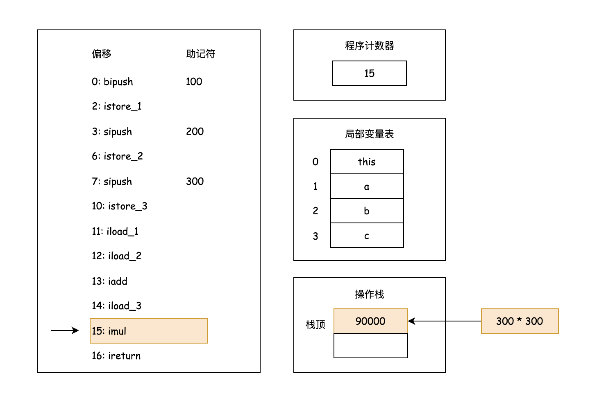

## 前言

熟悉 Java 语言的朋友应该都听过 `Write Once, Run Anywhere.` 这样的口号，它主要阐述地是 Java 语言的跨平台特性。工程师只需要编写一次 Java 源码，再通过 Java 编译器将源码编译为字节码文件，就可以很方便地在不同操作系统的 JVM 上进行分发运行。**Java 字节码技术是 Java 语言实现平台无关性的基石，也是学习 JVM 虚拟机实现的基础**，了解 Java 字节码技术，可以帮助大家理解后续的类加载机制，以及 JVM 编译优化相关的内容。因此，本系列首先从 Java 字节码技术开始，和大家一起初步探究字节码的设计和实现。

## 什么是字节码

字节码即 `Java ByteCode`，它由单个字节（`byte`）的指令组成，理论上最多可以支持 256 个操作码（`opcode`），而实际上 Java 只使用了 200 左右的操作码，还有一些操作码则保留下来，用于调试等操作。操作码通常也称为指令，后面会跟随零至多个参数，即操作数（`operand`）。根据指令的特性，可以将字节码分为如下的 4 大类：

1. **栈操作指令**，包括与局部变量交互的指令；
2. **程序流程控制指令**；
3. **对象操作指令**，包括方法调用指令；
4. **算术运算以及类型转换指令**。

除此之外，还有一些用于执行专门任务的指令，例如**同步指令、异常指令**等，完整的 JVM 指令可以参考 [Java 虚拟机指令操作码和助记符映射关系](https://strongduanmu.com/blog/opcode-mnemonics-by-opcode.html)。

## 如何查看字节码

### 通过 `javap` 命令查看

JDK 工具自带了 `javap` 命令，可以用于查看 class 文件中的字节码，执行 `javap -h` 可以查看该命令详细的使用说明。用户使用 `javap` 命令时，需要在后面指定参数以及 class 字节码文件名，常用的参数有 `-c` 和  `-v` ，`-c` 参数用于对代码进行反编译，可以查看 class 文件中的字节码信息，`-v` 参数则用于打印附加信息，例如：`constant pool` 常量池信息。

```bash
❯ javap -h
Usage: javap <options> <classes>
where possible options include:
  -? -h --help -help               Print this help message # 打印帮助信息
  -version                         Version information # 版本信息
  -v  -verbose                     Print additional information # 打印附加信息，例如：constant pool 常量池信息
  -l                               Print line number and local variable tables # 打印行号和本地变量表
  -public                          Show only public classes and members # 仅显示 public 类和成员
  -protected                       Show protected/public classes and members # 显示 protected/public 类和成员
  -package                         Show package/protected/public classes 
                                   and members (default) # 显示 package/protected/public 类和成员（默认）
  -p  -private                     Show all classes and members # 显示所有类和成员
  -c                               Disassemble the code # 对代码进行反编译
  -s                               Print internal type signatures # 打印内部类型签名
  -sysinfo                         Show system info (path, size, date, MD5 hash) 
                                   of class being processed # 显示系统信息（路径、大小、日期、MD5 哈希值）
  -constants                       Show final constants # 显示 final 常量
  --module <module>, -m <module>   Specify module containing classes to be disassembled
  --module-path <path>             Specify where to find application modules
  --system <jdk>                   Specify where to find system modules
  --class-path <path>              Specify where to find user class files
  -classpath <path>                Specify where to find user class files
  -cp <path>                       Specify where to find user class files
  -bootclasspath <path>            Override location of bootstrap class files
```

我们编写一个如下的简单 `HelloByteCode` 程序作为示例，程序 `main` 方法创建了一个 `HelloByteCode` 对象（源码请参考 [HelloByteCode](https://github.com/strongduanmu/jvm-lecture/blob/b6d9fdb4ed79fc3c77de5e70e75c4f1630a04475/src/main/java/com/strongduanmu/jvm/bytecode/HelloByteCode.java#L3)），并调用了 `sayHello` 方法，输出 `Hello, ByteCode!` 字符串。

```java
public final class HelloByteCode {
    
    public static void main(String[] args) {
        HelloByteCode helloByteCode = new HelloByteCode();
        helloByteCode.sayHello();
    }
    
    private void sayHello() {
        System.out.println("Hello, ByteCode!");
    }
}
```

然后我们使用 `javac` 命令将源码编译为字节码，`-g` 参数用于生成所有 debug 信息，`javac` 命令默认开启了优化功能，会去除字节码中的本地变量表 `LocalVariableTable`。

```bash
javac -g HelloByteCode.java
```

获取到字节码文件后，我们再通过 `javap` 命令查看字节码信息，`-c` 参数用于对代码进行反编译，`-v` 参数则用于打印附加信息。如下展示了完整的字节码信息，大家可以先尝试理解下字节码的含义，在下个小节我们将对字节码进行深入探究。

```bash
❯ javap -c -v HelloByteCode
Warning: File ./HelloByteCode.class does not contain class HelloByteCode
Classfile /Users/duanzhengqiang/IdeaProjects/jvm-lecture/src/main/java/com/strongduanmu/jvm/bytecode/HelloByteCode.class
  Last modified 2024年7月5日; size 736 bytes
  MD5 checksum 591e8e496f42a858607d95d6db85bdd8
  Compiled from "HelloByteCode.java"
public final class com.strongduanmu.jvm.bytecode.HelloByteCode
  minor version: 0
  major version: 55
  flags: (0x0031) ACC_PUBLIC, ACC_FINAL, ACC_SUPER
  this_class: #2                          // com/strongduanmu/jvm/bytecode/HelloByteCode
  super_class: #8                         // java/lang/Object
  interfaces: 0, fields: 0, methods: 3, attributes: 1
Constant pool:
   #1 = Methodref          #8.#24         // java/lang/Object."<init>":()V
   #2 = Class              #25            // com/strongduanmu/jvm/bytecode/HelloByteCode
   #3 = Methodref          #2.#24         // com/strongduanmu/jvm/bytecode/HelloByteCode."<init>":()V
   #4 = Methodref          #2.#26         // com/strongduanmu/jvm/bytecode/HelloByteCode.sayHello:()V
   #5 = Fieldref           #27.#28        // java/lang/System.out:Ljava/io/PrintStream;
   #6 = String             #29            // Hello, ByteCode!
   #7 = Methodref          #30.#31        // java/io/PrintStream.println:(Ljava/lang/String;)V
   #8 = Class              #32            // java/lang/Object
   #9 = Utf8               <init>
  #10 = Utf8               ()V
  #11 = Utf8               Code
  #12 = Utf8               LineNumberTable
  #13 = Utf8               LocalVariableTable
  #14 = Utf8               this
  #15 = Utf8               Lcom/strongduanmu/jvm/bytecode/HelloByteCode;
  #16 = Utf8               main
  #17 = Utf8               ([Ljava/lang/String;)V
  #18 = Utf8               args
  #19 = Utf8               [Ljava/lang/String;
  #20 = Utf8               helloByteCode
  #21 = Utf8               sayHello
  #22 = Utf8               SourceFile
  #23 = Utf8               HelloByteCode.java
  #24 = NameAndType        #9:#10         // "<init>":()V
  #25 = Utf8               com/strongduanmu/jvm/bytecode/HelloByteCode
  #26 = NameAndType        #21:#10        // sayHello:()V
  #27 = Class              #33            // java/lang/System
  #28 = NameAndType        #34:#35        // out:Ljava/io/PrintStream;
  #29 = Utf8               Hello, ByteCode!
  #30 = Class              #36            // java/io/PrintStream
  #31 = NameAndType        #37:#38        // println:(Ljava/lang/String;)V
  #32 = Utf8               java/lang/Object
  #33 = Utf8               java/lang/System
  #34 = Utf8               out
  #35 = Utf8               Ljava/io/PrintStream;
  #36 = Utf8               java/io/PrintStream
  #37 = Utf8               println
  #38 = Utf8               (Ljava/lang/String;)V
{
  public com.strongduanmu.jvm.bytecode.HelloByteCode();
    descriptor: ()V
    flags: (0x0001) ACC_PUBLIC
    Code:
      stack=1, locals=1, args_size=1
         0: aload_0
         1: invokespecial #1                  // Method java/lang/Object."<init>":()V
         4: return
      LineNumberTable:
        line 3: 0
      LocalVariableTable:
        Start  Length  Slot  Name   Signature
            0       5     0  this   Lcom/strongduanmu/jvm/bytecode/HelloByteCode;

  public static void main(java.lang.String[]);
    descriptor: ([Ljava/lang/String;)V
    flags: (0x0009) ACC_PUBLIC, ACC_STATIC
    Code:
      stack=2, locals=2, args_size=1
         0: new           #2                  // class com/strongduanmu/jvm/bytecode/HelloByteCode
         3: dup
         4: invokespecial #3                  // Method "<init>":()V
         7: astore_1
         8: aload_1
         9: invokevirtual #4                  // Method sayHello:()V
        12: return
      LineNumberTable:
        line 6: 0
        line 7: 8
        line 8: 12
      LocalVariableTable:
        Start  Length  Slot  Name   Signature
            0      13     0  args   [Ljava/lang/String;
            8       5     1 helloByteCode   Lcom/strongduanmu/jvm/bytecode/HelloByteCode;
}
SourceFile: "HelloByteCode.java"
```

### 通过 `jclasslib` 查看

除了通过 `javap` 命令查看之外，我们还可以通过 [jclasslib](https://github.com/ingokegel/jclasslib) 可视化查看字节码。`jclasslib` 不仅提供了 Idea 插件，还提供了独立的软件包，大家可以按需选择使用。由于使用方式类似，本文以 Idea 插件的方式展示如何通过 `jclasslib` 查看字节码，首先选中 `HelloByteCode` 源码文件，然后选择 `View -> Show Bytecode With Jclasslib`。


选择完成后，可以在右侧的 Tab 中查看字节码。此外，`jclasslib` 插件在查看字节码时，可以点击 `Show JVM Spec` 查看 JVM 虚拟机规范，查看相关字节码指令的作用。


## 深入理解字节码

### Classfile

前文介绍了两种查看字节码的方法，想必大家对于字节码中的内容还有诸多疑问。本节我将带领大家逐行分析，一起深入探究字节码的内容，尝试理解字节码的含义与作用。首先，我们来看下字节码中的 `Classfile`，具体内容如下：

```plaintext
Classfile /Users/duanzhengqiang/IdeaProjects/jvm-lecture/src/main/java/com/strongduanmu/jvm/bytecode/HelloByteCode.class
  Last modified 2024年7月5日; size 736 bytes
  MD5 checksum 591e8e496f42a858607d95d6db85bdd8
  Compiled from "HelloByteCode.java"
```

`Classfile` 声明了当前字节码来源的 `class` 文件路径，并在 Classfile 下方显示了 `class` 文件的最近修改时间，MD5 校验值以及编译的来源文件。

### Class 基础信息

```plaintext
public final class com.strongduanmu.jvm.bytecode.HelloByteCode
  minor version: 0
  major version: 55
  flags: (0x0031) ACC_PUBLIC, ACC_FINAL, ACC_SUPER
  this_class: #2                          // com/strongduanmu/jvm/bytecode/HelloByteCode
  super_class: #8                         // java/lang/Object
  interfaces: 0, fields: 0, methods: 3, attributes: 1
```

第二部分 `public final class com.strongduanmu.jvm.bytecode.HelloByteCode` 则展示了 Class 类的版本号区间 `[minor version: 0, major version: 55]`，`major version: 55` 对应了 JDK 11，表示当前 Class 类支持 JDK 11 及以下版本。

`flags` 代表了访问标识符，`0x0031` 是访问标识符值的累加，`ACC_PUBLIC` 表示当前是一个 public 类，`ACC_FINAL` 表示当前是一个 final 类，`ACC_SUPER` 则是 JDK 早期用于标记当前类显式声明的父类，从 JDK 1.1 开始，所有类都必须显式声明它们的父类（即使是 `Object`），因此 `ACC_SUPER` 访问标志实际上总是被设置。更多访问标识符的说明请参考下表：

| 标记名         | 值     | 含义                                                  |
| -------------- | ------ | ----------------------------------------------------- |
| ACC_PUBLIC     | 0x0001 | 可以被包的类外访问。                                  |
| ACC_FINAL      | 0x0010 | 不允许有子类。                                        |
| ACC_SUPER      | 0x0020 | 当用到 invokespecial 指令时，需要特殊处理的父类方法。 |
| ACC_INTERFACE  | 0x0200 | 标识定义的是接口而不是类。                            |
| ACC_ABSTRACT   | 0x0400 | 不能被实例化。                                        |
| ACC_SYNTHETIC  | 0x1000 | 标识并非 Java 源码生成的代码。                        |
| ACC_ANNOTATION | 0x2000 | 标识注解类型。                                        |
| ACC_ENUM       | 0x4000 | 标识枚举类型。                                        |

`this_class` 表示当前 class 类，后面跟随的 `#2` 表示引用常量池中的第二个常量，即注释中显示的 `com/strongduanmu/jvm/bytecode/HelloByteCode`。`super_class` 表示当前 class 类的超类，`#8` 表示常量池中的第八个常量，即 `java/lang/Object`。`interfaces: 0, fields: 0, methods: 3, attributes: 1` 表示当前 class 类中接口、字段、方法和属性的数量。

### 常量池

```plaintext
Constant pool:
   #1 = Methodref          #8.#24         // java/lang/Object."<init>":()V
   #2 = Class              #25            // com/strongduanmu/jvm/bytecode/HelloByteCode
   #3 = Methodref          #2.#24         // com/strongduanmu/jvm/bytecode/HelloByteCode."<init>":()V
   #4 = Methodref          #2.#26         // com/strongduanmu/jvm/bytecode/HelloByteCode.sayHello:()V
   #5 = Fieldref           #27.#28        // java/lang/System.out:Ljava/io/PrintStream;
   #6 = String             #29            // Hello, ByteCode!
   #7 = Methodref          #30.#31        // java/io/PrintStream.println:(Ljava/lang/String;)V
   #8 = Class              #32            // java/lang/Object
   #9 = Utf8               <init>
  #10 = Utf8               ()V
  #11 = Utf8               Code
  #12 = Utf8               LineNumberTable
  #13 = Utf8               LocalVariableTable
  #14 = Utf8               this
  #15 = Utf8               Lcom/strongduanmu/jvm/bytecode/HelloByteCode;
  #16 = Utf8               main
  #17 = Utf8               ([Ljava/lang/String;)V
  #18 = Utf8               args
  #19 = Utf8               [Ljava/lang/String;
  #20 = Utf8               helloByteCode
  #21 = Utf8               sayHello
  #22 = Utf8               SourceFile
  #23 = Utf8               HelloByteCode.java
  #24 = NameAndType        #9:#10         // "<init>":()V
  #25 = Utf8               com/strongduanmu/jvm/bytecode/HelloByteCode
  #26 = NameAndType        #21:#10        // sayHello:()V
  #27 = Class              #33            // java/lang/System
  #28 = NameAndType        #34:#35        // out:Ljava/io/PrintStream;
  #29 = Utf8               Hello, ByteCode!
  #30 = Class              #36            // java/io/PrintStream
  #31 = NameAndType        #37:#38        // println:(Ljava/lang/String;)V
  #32 = Utf8               java/lang/Object
  #33 = Utf8               java/lang/System
  #34 = Utf8               out
  #35 = Utf8               Ljava/io/PrintStream;
  #36 = Utf8               java/io/PrintStream
  #37 = Utf8               println
  #38 = Utf8               (Ljava/lang/String;)V
```

`Constant pool` 表示常量池，其中声明了字节码中需要使用的常量，`#1`、`#2` 等表示常量的编号，字节码中使用常量时，只需要引用相关的编号即可。`Methodref`、`Class`、`Fieldref` 是常量的类型，分别表示方法引用，Class 类以及字段引用，更多常量类型可参考如下常量类型表格。常量中可以通过编号引用其他常量，例如：`#8.#24`，代表了对 `Object` 对象 `init` 方法的引用，字节码注释 `java/lang/Object."<init>":()V` 已经很好地向我们展示了方法引用。

| 常量类型                    | 值   | 含义                                                         |
| --------------------------- | ---- | ------------------------------------------------------------ |
| CONSTANT_Class              | 7    | 类或接口                                                     |
| CONSTANT_Fieldref           | 9    | 字段引用                                                     |
| CONSTANT_Methodref          | 10   | 类方法引用                                                   |
| CONSTANT_InterfaceMethodref | 11   | 接口方法引用                                                 |
| CONSTANT_String             | 8    | `java.lang.String` 类型的常量                                |
| CONSTANT_Integer            | 3    | 4 字节整型常量                                               |
| CONSTANT_Float              | 4    | 4 字节浮点型常量                                             |
| CONSTANT_Long               | 5    | 8 字节长整型常量                                             |
| CONSTANT_Double             | 6    | 8 字节双精度浮点型常量                                       |
| CONSTANT_NameAndType        | 12   | 字段或方法的名称和类型，类型通过字段描述符（例如：`[Ljava/lang/String;`）或方法描述符（例如：`(Ljava/lang/String;)V`）进行表示 |
| CONSTANT_Utf8               | 1    | `UTF-8` 编码表示的字符串常量值                               |
| CONSTANT_MethodHandle       | 15   | 方法句柄                                                     |
| CONSTANT_MethodType         | 16   | 方法类型                                                     |
| CONSTANT_InvokeDynamic      | 18   | `invohecynamic` 动态方法调用                                 |

### 字节码

介绍完常量池后，我们再来关注下最核心的字节码指令，由于本文示例程序中包含了私有方法，因此需要使用 `javap -c -v -p HelloByteCode` 查看包含私有方法在内的所有成员变量和方法。如下展示了字节码信息，可以看到总共包含了 3 个方法——`HelloByteCode` 构造方法、`main` 方法、`sayHello` 方法，下面我们将分别进行探究学习。

```java
{
  public com.strongduanmu.jvm.bytecode.HelloByteCode();
    descriptor: ()V
    flags: (0x0001) ACC_PUBLIC
    Code:
      stack=1, locals=1, args_size=1
         0: aload_0
         1: invokespecial #1                  // Method java/lang/Object."<init>":()V
         4: return
      LineNumberTable:
        line 3: 0
      LocalVariableTable:
        Start  Length  Slot  Name   Signature
            0       5     0  this   Lcom/strongduanmu/jvm/bytecode/HelloByteCode;

  public static void main(java.lang.String[]);
    descriptor: ([Ljava/lang/String;)V
    flags: (0x0009) ACC_PUBLIC, ACC_STATIC
    Code:
      stack=2, locals=2, args_size=1
         0: new           #7                  // class com/strongduanmu/jvm/bytecode/HelloByteCode
         3: dup
         4: invokespecial #9                  // Method "<init>":()V
         7: astore_1
         8: aload_1
         9: invokevirtual #10                 // Method sayHello:()V
        12: return
      LineNumberTable:
        line 6: 0
        line 7: 8
        line 8: 12
      LocalVariableTable:
        Start  Length  Slot  Name   Signature
            0      13     0  args   [Ljava/lang/String;
            8       5     1 helloByteCode   Lcom/strongduanmu/jvm/bytecode/HelloByteCode;

  private void sayHello();
    descriptor: ()V
    flags: (0x0002) ACC_PRIVATE
    Code:
      stack=2, locals=1, args_size=1
         0: getstatic     #13                 // Field java/lang/System.out:Ljava/io/PrintStream;
         3: ldc           #19                 // String Hello, ByteCode!
         5: invokevirtual #21                 // Method java/io/PrintStream.println:(Ljava/lang/String;)V
         8: return
      LineNumberTable:
        line 11: 0
        line 12: 8
      LocalVariableTable:
        Start  Length  Slot  Name   Signature
            0       9     0  this   Lcom/strongduanmu/jvm/bytecode/HelloByteCode;
}
```

#### HelloByteCode 构造方法

```java
public com.strongduanmu.jvm.bytecode.HelloByteCode();
  descriptor: ()V
  flags: (0x0001) ACC_PUBLIC
  Code:
    stack=1, locals=1, args_size=1
       0: aload_0
       1: invokespecial #1                  // Method java/lang/Object."<init>":()V
       4: return
    LineNumberTable:
      line 3: 0
    LocalVariableTable:
      Start  Length  Slot  Name   Signature
          0       5     0  this   Lcom/strongduanmu/jvm/bytecode/HelloByteCode;
```

HelloByteCode 构造方法是 Java 编译器默认生成的，了解 Java 的朋友都知道，当我们在程序中没有定义任何构造方法时，Java 编译器会默认生成无参的构造方法。`public com.strongduanmu.jvm.bytecode.HelloByteCode();` 是构造方法的方法声明，HelloByteCode 前面会带上完整的包路径。

`descriptor` 则是方法描述符，`()V` 中 `()` 表示入参，默认构造方法的入参为空，`()` 之后是返回值，由于构造方法没有任何返回值，因此返回值为 `void`，缩写为 `V`。

`flags` 表示访问标识符，`ACC_PUBLIC` 表示该构造方法为 `public` 构造方法，更多访问标识符类型可参考 [Class 基础信息](#class-基础信息)。

`Code` 则对应了具体的代码逻辑，`stack=1, locals=1, args_size=1` 中的 `stack` 表示当前方法执行时最大的栈使用深度，`HelloByteCode` 构造方法栈深度为 1，`locals` 表示本地变量表中槽位的个数，`args_size` 表示方法的参数个数。

> 好奇的同学可能会问：默认无参构造方法的参数个数为什么是 1？因为在 Java 中，非静态方法（包括构造方法）会有一个 `this` 引用，并且 `this` 会作为方法的隐藏参数，`this` 会存储在本地变量表的第 1 个槽位，所以字节码里 `args_size` 为 1。

`0: aload_0` 中的 `0` 表示当前指令位于该方法指令的 0 位置，`aload_0` 表示将第一个引用类型本地变量压入栈顶。下图展示了 `Local Variable` 和 `Stack` 关系，由于 JVM 是一个基于栈的计算机器，因此在计算的过程中会执行很多压入和弹出操作，即 Load 和 Store 指令。


`1: invokespecial #1` 中的 `1` 表示当前指令位于该方法指令的 1 位置，`invokespecial` 表示调用超类构造方法、实例初始化方法或私有方法，`#1` 引用了常量池中的第一个常量，即 `#1 = Methodref #8.#24 // java/lang/Object."<init>":()V`。从整个指令来看，调用的是超类构造方法：`Object` 类的 `init` 方法。

`4: return` 中的 `4` 表示当前指令位于该方法指令的 4 位置，`return` 表示从当前方法返回 void。

`LineNumberTable` 行号表记录了源码中行号和方法指令的位置，`line 3: 0` 中的 `3` 表示源码中的第 3 行，`0` 表示方法指令的第 0 个位置，即 `0: aload_0`。

`LocalVariableTable` 本地变量表记录了当前方法中的本地变量，`Start` 表示起始位置，标识了该变量在字节码中的哪行开始起作用，`Length` 表示指令作用范围，对应的是字节码中的位置。可以看到，默认构造方法有一个 `this` 变量，`Slot` 表示槽位，`Signature` 表示变量的签名信息，其中 `L<ClassName>` 是引用类型的字段描述符。下表展示了常用类型的字段描述符，在字节码中我们会经常看到这些字段描述符信息，大家可以随时查阅表格加强理解。

| 字符         | 类型      | 含义                      |
| ------------ | --------- | ------------------------- |
| B            | byte      | 有符号字节型数            |
| C            | char      | Unicode 字符，UTF-16 编码 |
| D            | double    | 双精度浮点数              |
| F            | float     | 单精度浮点数              |
| I            | int       | 整型数                    |
| J            | long      | 长整数                    |
| S            | short     | 有符号短整数              |
| Z            | boolean   | 布尔值 true/false         |
| L Classname; | reference | 一个名为 Classname 的实例 |
| [            | reference | 一个一维数组              |

字段描述符示例：

* `int` 实例变量的描述符是 `I`；
* `java.lang.Object` 描述符是 `Ljava/lang/Object;`；
* `double` 的三维数组 `double d[][][]` 描述符是 `[[[D`。

#### main 方法

```java
public static void main(java.lang.String[]);
  descriptor: ([Ljava/lang/String;)V
  flags: (0x0009) ACC_PUBLIC, ACC_STATIC
  Code:
    stack=2, locals=2, args_size=1
       0: new           #7                  // class com/strongduanmu/jvm/bytecode/HelloByteCode
       3: dup
       4: invokespecial #9                  // Method "<init>":()V
       7: astore_1
       8: aload_1
       9: invokevirtual #10                 // Method sayHello:()V
      12: return
    LineNumberTable:
      line 6: 0
      line 7: 8
      line 8: 12
    LocalVariableTable:
      Start  Length  Slot  Name   Signature
          0      13     0  args   [Ljava/lang/String;
          8       5     1 helloByteCode   Lcom/strongduanmu/jvm/bytecode/HelloByteCode;
```

有了 HelloByteCode 构造方法的基础，我们阅读 `main` 方法的字节码会很轻松，`descriptor` 表示了方法描述符，`([Ljava/lang/String;)V` 表示入参为 `String` 数组，返回值为 `void`，这和我们记忆中的 `main` 方法声明是完全一致的。`flags` 声明了 `main` 方法为 `public` 公有方法，并且是 `static` 静态方法。

`Code` 部分 `stack=2, locals=2, args_size=1` 中的 `stack=2`表示当前方法执行时使用的最大栈深度为 2，我们将在后文**字节码执行过程**小节中，为大家详细介绍栈在执行过程中的作用。`locals=2` 表示该方法的本地变量数为 2，即：`args` 和 `helloByteCode`，那么为什么 `main` 方法的本地变量没有 `this`？我们前文介绍过，只有非静态方法会有当前对象的 `this` 引用，而 `main` 方法是一个静态方法。`args_size=1` 表示了 `main` 方法有一个参数 `args`。

字节码部分，为了方便大家理解，可以参考下面的字节码指令图。`0: new #7` 表示方法字节码的第 0 个位置，`new` 是一个操作码，表示创建一个对象，并将其引用值压入栈顶，后面紧跟着的 `#7` 是操作数，引用的是常量池中的第 7 个常量，由于 JVM 操作数栈是基于槽（`Slot`），每个槽默认为 32 位宽，即 4 位 16 进制数，因此 07 之前需要用 00 补位。参考 [Java 虚拟机指令操作码和助记符映射关系](https://strongduanmu.com/blog/opcode-mnemonics-by-opcode.html)，我们可以快速查阅到 `new` 操作码对应的 16 进制为 bb，因此 `0: new #7` 使用 16 进制的表现形式为 `bb0007`。

`3: dup` 表示字节码的第 3 个位置，`dup`（全称 `duplicate`） 表示复制栈顶数值，并将复制值压入栈顶，后面没有操作数，因此它的 16 进制表示为 `59`。

`4: invokespecial #9` 前文已经介绍，该操作码表示调用超类构造方法，实例初始化方法或私有方法，此处表示对 HelloByteCode 初始化时 `init` 方法的调用，`invokespecial` 操作码对应的 16 进制为 b7，同样操作数需要用 00 补位，最终 `4: invokespecial #9` 16 进制表示为 `b70009`。

`astore_1` 表示将栈顶引用型数值存入第二个本地变量，`aload_1` 表示将第二个引用类型本地变量推至栈顶，这两个操作码后面都没有操作数，它们 16 进制的表示分别为 `4c` 和 `2b`。

`9: invokevirtual #10` 表示调用实例方法，此处为调用 `sayHello` 实例方法，`invokevirtual` 操作码对应的 16 进制为 b6，经过补位后的 16 进制表示为 `b6000a`。最后 `return` 操作码表示了方法返回 void，对应的 16 进制表示为 `b1`。


那么，根据字节码助记符转换出来的 16 进制存储在哪里呢？答案是 class 文件。我们可以使用 `Sublime Text` 文本编辑器查看 class 文件中的内容，具体内容如下，通过比对能够找到 `main` 方法对应的 16 进制内容——`bb00 0759 b700 094c 2bb6 000a b1`。


`main` 方法中其他的 `LineNumberTable` 和 `LocalVariableTable`，和前文介绍的内容基本一致，感兴趣的读者可以自行尝试理解，本小节就不再一一介绍。

#### sayHello 方法

```java
private void sayHello();
  descriptor: ()V
  flags: (0x0002) ACC_PRIVATE
  Code:
    stack=2, locals=1, args_size=1
       0: getstatic     #13                 // Field java/lang/System.out:Ljava/io/PrintStream;
       3: ldc           #19                 // String Hello, ByteCode!
       5: invokevirtual #21                 // Method java/io/PrintStream.println:(Ljava/lang/String;)V
       8: return
    LineNumberTable:
      line 11: 0
      line 12: 8
    LocalVariableTable:
      Start  Length  Slot  Name   Signature
          0       9     0  this   Lcom/strongduanmu/jvm/bytecode/HelloByteCode;
```

最后，我们再来看下 `sayHello` 方法，和构造方法及 `main` 方法不同的是，`sayHello` 方法是一个私有方法，因此 `flags` 对应的是 `ACC_PRIVATE`。

`Code` 部分，`sayHello` 方法使用到了 `getstatic` 和 `ldc` 两个操作码，`getstatic` 操作码表示获取指定类的静态域，并将其压入栈顶，此处表示对 `System` 类中的静态成员变量 `PrintStream out` 的调用。`ldc` 操作码表示将 int，float 或 String 型常量值从常量池中推至栈顶，此处指将字符串常量 `Hello, ByteCode!` 推至栈顶。`invokevirtual` 操作码前文已经介绍，表示调用实例方法，此处表示调用 PrintStream 对象的 `println` 方法。

### SourceFile

`SourceFile` 内容比较简单，用于声明当前 class 文件的源文件，此处为 `HelloByteCode.java`。

## 字节码执行过程

### 抽象执行流程

前文我们详细介绍了 `javap` 命令展示字节码信息的具体含义，本节我们再来了解下字节码的执行过程。如果不考虑 JVM 中的异常处理逻辑，我们可以用下面的伪代码来表示字节码的执行过程。首先，JVM 会自动计算 PC 程序计数器的值进行加 1，然后根据 PC 程序计数器指示的位置，读取字节码流中的操作码，由于字节码中一些操作码后面存在操作数，因此会判断当前操作码是否存在操作数，存在则继续读取操作数，不存在或者读取完则执行**指令（操作码 + 操作数）**，执行完成后继续读取剩余的字节码内容。

```java
do {
    自动计算 PC 程序计数器的值加 1;
  	根据 PC 程序计数器指示的位置，从字节码流中取出操作码; 
  	if (字节码存在操作数) 
      	从字节码流中取出操作数;
    执行操作码所定义的操作;
} while (字节码流长度 > 0);
```

### 执行流程说明

了解了字节码抽象执行流程，我们再结合下面的 `BasicCalculator` 示例，来观察下具体每个字节码执行时，局部变量表和操作栈之间的交互变化。

```java
public final class BasicCalculator {
    
    public static void main(String[] args) {
        System.out.println(new BasicCalculator().calculate());
    }
    
    private int calculate() {
        int a = 100;
        int b = 200;
        int c = 300;
        return (a + b) * c;
    }
}
```

我们分别使用 `javac -g BasicCalculator.java` 和 `javap -c -v -p BasicCalculator` 编译和查看字节码信息，可以得到如下的核心逻辑：

```java
private int calculate();
  descriptor: ()I
  flags: (0x0002) ACC_PRIVATE
  Code:
    stack=2, locals=4, args_size=1
       0: bipush        100
       2: istore_1
       3: sipush        200
       6: istore_2
       7: sipush        300
      10: istore_3
      11: iload_1
      12: iload_2
      13: iadd
      14: iload_3
      15: imul
      16: ireturn
    LineNumberTable:
      line 10: 0
      line 11: 3
      line 12: 7
      line 13: 11
    LocalVariableTable:
      Start  Length  Slot  Name   Signature
          0      17     0  this   Lcom/strongduanmu/jvm/bytecode/BasicCalculator;
          3      14     1     a   I
          7      10     2     b   I
         11       6     3     c   I
```

从上面的字节码可以看到，这段计算逻辑总共包含了 4 个本地变量，分别是：`this`、`a`、`b` 和 `c`，执行计算逻辑时，多次调用了 `push` 和 `store` 指令。

#### 执行 bipush 100 指令


首先，我们来看下第 1 个指令 `bipush`，它表示将单字节的常量值（`-128 ~ 127`）推至栈顶，此案例是将 100 推至栈顶。上图展示了程序计数器、局部变量表和操作栈的状态，程序计数器指向了当前需要执行字节码的位置 0，JVM 首先会读取 bipush 操作码，由于该操作码包含了 1 个字节的操作数，因此会继续读取对应的值 100，读取完成后执行指令，会将 100 推至操作栈的栈顶。

#### 执行 istore_1 指令


然后 JVM 会继续执行 `istore_1` 指令，该指令表示将栈顶 int 型数值存入第二个本地变量，即上图所示的 a 变量中。

#### 执行 sipush 200 指令


根据程序计数器指示的位置 3，JVM 会继续执行对应的 `sipush` 指令，该指令会将短整型常量（`-32768 ~ 32767`）推至栈顶，此处会将 200 推至操作栈的栈顶。执行完成后程序计数器会变更为 6，因为操作码 `sipush` 占用 1 个字节，操作数 `200` 占用 2 个字节。

#### 执行 istore_2 指令


然后继续执行 `istore_2` 指令，该指令会将栈顶 int 型数值存入第三个本地变量，即上图所示的 b 变量。

#### 执行 sipush 300 指令


`sipush` 指令前文已经介绍其作用，此处只有操作数不同，该指令会将 300 压入到栈顶。

#### 执行 istore_3 指令


根据程序计数器指示的位置 10，JVM 会执行 istore_3 指令，该指令会将栈顶 int 型数值存入第四个本地变量，即存入变量 c 的槽位。

#### 执行 iload_1 指令


程序计数器 11 位置指向了 `iload_1` 指令，该指令表示将第二个 int 型本地变量推至栈顶，上图展示了将变量 a 的值 100 推至栈顶的过程。

#### 执行 iload_2 指令


程序计数器 12 位置指向了 `iload_2` 指令，该指令表示将第三个 int 型本地变量推至栈顶，上图展示了将变量 b 的值 200 推至栈顶的过程。

#### 执行 iadd 指令

TODO


#### 执行 iload_3 指令


#### 执行 imul 指令




#### 执行 ireturn 指令


TODO

## 常用字节码指令

TODO

## 结语

TODO
