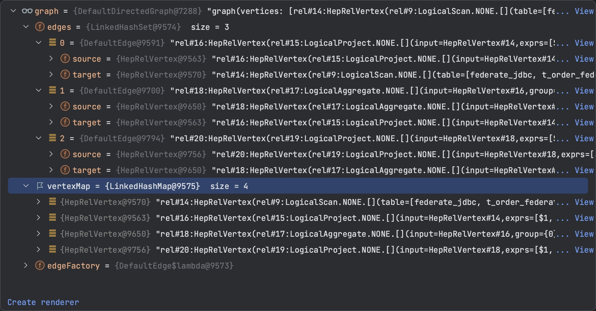

> 注意：本文基于 [Calcite 1.35.0](https://github.com/apache/calcite/tree/75750b78b5ac692caa654f506fc1515d4d3991d6) 版本源码进行学习研究，其他版本可能会存在实现逻辑差异，对源码感兴趣的读者**请注意版本选择**。

## 什么是 RBO


## Calcite 中的 RBO 规则


## HepPlanner 中的基础概念

* `HepPlanner`：基于规则的启发式优化器，实现了 RelOptPlanner 优化器接口；
* `HepProgram`：提供了维护各种类型 HepInstruction 的容器，并支持指定 HepInstruction 被 HepPlanner 优化时处理的顺序；
* `HepProgramBuilder`：用于创建 HepProgram；
* `HepInstruction`：代表了 HepProgram 中的一个指令，目前包含了许多实现类，具体实现类的用途如下表所示：

```
BeginGroup, EndGroup: 开始和结束一组指令组
CommonRelSubExprRels: 寻找公共子关系表达式的指令
ConverterRules: 
MatchLimit: 修改当前 Program 匹配 limit 的指令
MatchOrder: 修改当前 Program 匹配次序的指令
Placeholder: 
RuleClass: 执行 rules 中符合指定规则类型 allRules 的规则的指令(对 allRules 的过滤)
RuleCollection: 执行多个 rules 的指令(不必在 allRules 中)
RuleInstance: 执行一个 rule 的指令(不必在 allRules 中)
RuleLookup: 
SubProgram: 用来执行子 HepProgram 的指令
```

## HepPlanner 优化器原理


代码版本：HEAD is now at 413eded69 [CALCITE-5275] Release Calcite 1.32.0 

https://github.com/apache/calcite/commit/413eded693a9087402cc1a6eefeca7a29445d337	


以如下 SQL 为例：

```sql
SELECT MAX(order_id), MIN(order_id), SUM(order_id), AVG(order_id), COUNT(1) FROM t_order_federate GROUP BY user_id
```

逻辑计划如下：

```
LogicalProject(EXPR$0=[$1], EXPR$1=[$2], EXPR$2=[$3], EXPR$3=[$4], EXPR$4=[$5])
  LogicalAggregate(group=[{0}], EXPR$0=[MAX($1)], EXPR$1=[MIN($1)], EXPR$2=[SUM($2)], EXPR$3=[AVG($2)], EXPR$4=[COUNT()])
    LogicalProject(user_id=[$1], order_id=[$0], $f2=[CAST($0):DECIMAL(19, 9)])
      LogicalScan(table=[[federate_jdbc, t_order_federate]])
```

HepPlanner 构建逻辑如下，内部会维护 HepProgram。

```java
  /**
   * Create new instance of hep planner.
   *
   * @return hep planner instance
   */
  public static RelOptPlanner createHepPlanner() {
      HepProgramBuilder builder = new HepProgramBuilder();
      builder.addGroupBegin().addRuleCollection(getFilterRules()).addGroupEnd().addMatchOrder(HepMatchOrder.BOTTOM_UP);
      builder.addGroupBegin().addRuleCollection(getProjectRules()).addGroupEnd().addMatchOrder(HepMatchOrder.BOTTOM_UP);
      builder.addGroupBegin().addRuleCollection(getAggregationRules()).addGroupEnd().addMatchOrder(HepMatchOrder.BOTTOM_UP);
      builder.addGroupBegin().addRuleCollection(getCalcRules()).addGroupEnd().addMatchOrder(HepMatchOrder.BOTTOM_UP);
      builder.addGroupBegin().addRuleCollection(getSubQueryRules()).addGroupEnd().addMatchOrder(HepMatchOrder.BOTTOM_UP);
      builder.addMatchLimit(DEFAULT_MATCH_LIMIT);
      return new HepPlanner(builder.build());
  }
```

HepProgram 结构如下：


**setRoot:** 

```java
// 从 LogicalProject 开始将 rel 添加到 graph 中
-> addRelToGraph
-> graph.vertexSet() 是否包含 rel，包含则返回
-> inputs = rel.getInputs() 获取子节点，此处是 LogicalAggregate
-> 循环 inputs 递归调用 addRelToGraph

-> 递归 Tree 叶子节点，以 LogicalScan 为例
-> Util.equalShallow 浅判断 inputs 和 new inputs 是否相同，newInputs 中存储的是 HepRelVertex 对象，也是一种 AbstractRelNode
-> 不相同则调用 rel = rel.copy(rel.getTraitSet(), newInputs); 替换原有 rel，并将原有 rel 赋给 oldRel
-> 调用 rel.recomputeDigest(); 清除摘要信息

-> 判断 noDag 标识，默认为 false，表示使用 dag 构建 hep planner，true 则使用 tree 构建 hep planner
  -> false 则通过 mapDigestToVertex.get(rel.getRelDigest()); 获取等价的 equivVertex，getRelDigest 获取 rel 摘要信息
  -> 获取到 equivVertex 则返回

-> noDag 为 true 或者未获取到 equivVertex 继续执行
-> new HepRelVertex(rel); 创建一个新的 vertex 顶点对象，并添加到 graph 中
-> 调用 updateVertex 方法将 vertex 添加到 mapDigestToVertex 中，key 为 digest

-> 有了 vertex 顶点后，再循环 rel inputs，graph.addEdge 添加边，此处 LogicalScan 没有 input 因此跳过

// LogicalScan 创建完 vertex 后，会返回到递归上一层的 for 循环中，此时对象为 LogicalProject，此时会将 LogicalScan 创建的 vertex 添加到 newInputs 中
-> Util.equalShallow 浅判断 inputs 和 newInputs 是否相等
  -> LogicalProject 这层循环不相同，input 为 LogicalScan，newinput 为 HepRelVertex(LogicalScan)
  -> 调用 LogicalProject copy 方法，用原有的 trait 和 newInputs 创建新的 LogicalProject

-> noDag 为 false，从 mapDigestToVertex 中获取 equivVertex

-> 获取不到则 new HepRelVertex(rel) 创建 LogicalProject 对应的边 Vertex，然后添加到 graph 中
-> 调用 updateVertex 更新 mapDigestToVertex，将 LogicalProject Vertex 添加进去，key 为 digest
-> 循环 LogicalProject input 构建 edge 边（从 project 到 input），此处 input 为 LogicalScan 的 vertex（前面通过 copy 方法生成）
  -> 调用 getVertex(vertex) 方法获取当前 projection 的 VertexInfo（前面 addVertex 时添加，默认构建空的 VertexInfo），
  -> 调用 getVertex(targetVertex) 获取 input 的 VertexInfo（前面
  -> 通过 edgeFactory.createEdge(vertex, targetVertex) 创建当前节点到子节点的 edge
  -> 然后调用 edges.add(edge) 添加 edge，并判断是否是新添加的 edge
    -> 如果 edge 是新添加的，则 info.outEdges.add(edge); 为当前节点的 vert info 添加外边，为 targetInfo.inEdges.add(edge) 子节点添加内边
    -> 否则返回 null
-> nTransformations++ 记录变换的次数

// LogicalProject 创建 Vertex后，返回递归上一层，此时 rel 为 LogicalAggregate，会将 LogicalProject 创建的 Vertex 添加到 newInputs
-> 同上一步的逻辑，使用 newInputs 复制新的 LogicalAggregate
-> 创建 Vertex，然后添加到 graph 中
-> 循环 LogicalProject input 构建 edge（从 LogicalAggregate 指向 LogicalProject）

// LogicalAggregate 创建 Vertex后，返回递归上一层，此时 rel 为 LogicalProject
-> 同上一步的逻辑，使用 newInputs 复制新的 LogicalProject
-> 创建 Vertex，然后添加到 graph 中
-> 循环 LogicalProject input 构建 edge（从 LogicalProject 指向 LogicalAggregate）

// 最终生成了四个顶点，以及三条边，由父节点指向子节点
// 生成的 HepRelVertex 会赋值给 root
```



**findBestExp:**

```
-> 判断 root 是否为空
// mainProgram 是构建 HepPlanner 时传入的
-> executeProgram(mainProgram)
	// 初始化的 PrepareContext 中只有 planner，programState 和 endGroupState 暂时为空
	-> 调用 HepInstruction.PrepareContext.create 创建 PrepareContext 对象，用于为 Instruction 初始化 state
  -> 调用 program.prepare(px) 初始化 HepState
  	-> new State(px, instructions) 构建 State 对象
  		-> matchLimit 默认值为 Integer.MAX_VALUE
  		// HepMatchOrder 指定了遍历图的顺序，包含：ARBITRARY 任意，BOTTOM_UP 自底向上，从叶子节点开始，TOP_DOWN 自顶向下，DEPTH_FIRST 深度优先
  		-> matchOrder 默认值为 HepMatchOrder.DEPTH_FIRST
  		-> PrepareContext 对象初始化 ProgramState
  		-> 遍历所有的指令 instructions
        -> 判断 instruction 是否为 BeginGroup
          -> 构建 actions，key 为 BeginGroup 对应的 EndGroup，value 为 Consumer 函数式接口，定义了重新构建 State 的动作，动作中将新状态 set 到 states 中
          -> 初始化 HepState state 为 null，并添加到 states 中
        -> 非 BeginGroup 指令
          -> 调用 instruction.prepare(px2) 初始化 state，并添加到 states 中
          // 在 EndGroup 时，执行前面 BeginGroup 定义的动作，设置 BeginGroup 对应的 state
          -> 如果 actions.containsKey(instruction) 则执行 action
      // 将 states 复制到 instructionStates 中
      -> this.instructionStates = ImmutableList.copyOf(states);
  -> 调用 state.execute() 执行
  	-> 调用 planner.executeProgram(HepProgram.this, this);
  		-> state.init(); 初始化 HepProgram.State matchLimit = Integer.MAX_VALUE，matchOrder = HepMatchOrder.DEPTH_FIRST
  		-> 遍历 instructionStates
  			// BeginGroup
  			-> 调用 instructionState.execute() 方法，内部调用 planner.executeBeginGroup
  				-> 设置 BeginGroup 中的 state.programState.group = state.endGroup
        -> 执行 collectGarbage（暂时忽略）
        
        // RuleCollection
        -> 调用 instructionState.execute() 方法, planner.executeRuleCollection(RuleCollection.this, this);
        	-> applyRules
        		-> 将 rules 添加到 group.ruleSet 中，group 为 EndGroup#State
        
        // EndGroup
        -> 调用 instructionState.execute() 方法, 内部调用 planner.executeEndGroup(EndGroup.this, this);
        	-> applyRules
        		-> 根据 fixedPoint 标记循环执行
	  					-> 调用 getGraphIterator 获取图遍历器
	  						-> 判断 programState.matchOrder 决定遍历顺序，此处为深度优先
              -> 遍历迭代器 getGraphIterator
              	-> 循环当前 group 中的 rules
              		-> 调用 applyRule，使用当前 rule 进行优化
              			-> 判断 rule 是否为 ConverterRule
              				// 暂时忽略
                    -> 判断 rule 是否为 CommonRelSubExprRule
                    	// 暂时忽略
                    -> 调用 matchOperands 判断是否匹配操作符
              
  			
  			
```

PushProjectIntoScanRule 匹配之后，会调用 transformTo 修改当前的 rel，然后会重新调用 addToGraph 方法，新节点看起来 digest 未变更，导致获取到仍然是之前未下推的 HepRelVertex。


```java
private void applyRules(HepProgram.State programState,
    Collection<RelOptRule> rules, boolean forceConversions) {
  final HepInstruction.EndGroup.State group = programState.group;
  if (group != null) {
    checkArgument(group.collecting);
    Set<RelOptRule> ruleSet = requireNonNull(group.ruleSet, "group.ruleSet");
    ruleSet.addAll(rules);
    return;
  }

  LOGGER.trace("Applying rule set {}", rules);

  final boolean fullRestartAfterTransformation =
      programState.matchOrder != HepMatchOrder.ARBITRARY
          && programState.matchOrder != HepMatchOrder.DEPTH_FIRST;

  int nMatches = 0;

  boolean fixedPoint;
  do {
    Iterator<HepRelVertex> iter =
        getGraphIterator(programState, requireNonNull(root, "root"));
    fixedPoint = true;
    while (iter.hasNext()) {
      HepRelVertex vertex = iter.next();
      for (RelOptRule rule : rules) {
        HepRelVertex newVertex =
            applyRule(rule, vertex, forceConversions);
        if (newVertex == null || newVertex == vertex) {
          continue;
        }
        ++nMatches;
        if (nMatches >= programState.matchLimit) {
          return;
        }
        if (fullRestartAfterTransformation) {
          iter = getGraphIterator(programState, requireNonNull(root, "root"));
        } else {
          // To the extent possible, pick up where we left
          // off; have to create a new iterator because old
          // one was invalidated by transformation.
          iter = getGraphIterator(programState, newVertex);
          if (programState.matchOrder == HepMatchOrder.DEPTH_FIRST) {
            nMatches =
                depthFirstApply(programState, iter, rules, forceConversions, nMatches);
            if (nMatches >= programState.matchLimit) {
              return;
            }
          }
          // Remember to go around again since we're
          // skipping some stuff.
          fixedPoint = false;
        }
        break;
      }
    }
  } while (!fixedPoint);
}
```


1.1. 先执行 executeProgram(mainProgram) 逻辑，并将 mainProgram 赋予 currentProgram，然后循环 currentProgram.instructions。

```java
    for (HepInstruction instruction : currentProgram.instructions) {
      instruction.execute(this);
      int delta = nTransformations - nTransformationsLastGC;
      if (delta > graphSizeLastGC) {
        // The number of transformations performed since the last
        // garbage collection is greater than the number of vertices in
        // the graph at that time.  That means there should be a
        // reasonable amount of garbage to collect now.  We do it this
        // way to amortize garbage collection cost over multiple
        // instructions, while keeping the highwater memory usage
        // proportional to the graph size.
        collectGarbage();
      }
    }
```

​      instruction.execute(this); execute 方法内部调用 applyRules 方法，按照规则进行优化。

```
applyRules(instruction.rules, true);
```

可以看到有三个优化规则。


HepMatchOrder 代表了基于规则优化的顺序，包含了 ARBITRARY（任意顺序）、BOTTOM_UP（自底向上）、TOP_DOWN（自顶向下） 和 DEPTH_FIRST（深度优先）。然后循环进行匹配：

```java
    boolean fixedPoint;
    do {
      Iterator<HepRelVertex> iter = getGraphIterator(requireNonNull(root, "root"));
      fixedPoint = true;
      while (iter.hasNext()) {
        HepRelVertex vertex = iter.next();
        for (RelOptRule rule : rules) {
          HepRelVertex newVertex =
              applyRule(rule, vertex, forceConversions);
          if (newVertex == null || newVertex == vertex) {
            continue;
          }
          ++nMatches;
          if (nMatches >= requireNonNull(currentProgram, "currentProgram").matchLimit) {
            return;
          }
          if (fullRestartAfterTransformation) {
            iter = getGraphIterator(requireNonNull(root, "root"));
          } else {
            // To the extent possible, pick up where we left
            // off; have to create a new iterator because old
            // one was invalidated by transformation.
            iter = getGraphIterator(newVertex);
            if (requireNonNull(currentProgram, "currentProgram").matchOrder
                == HepMatchOrder.DEPTH_FIRST) {
              nMatches =
                  depthFirstApply(iter, rules, forceConversions, nMatches);
              if (nMatches >= requireNonNull(currentProgram, "currentProgram").matchLimit) {
                return;
              }
            }
            // Remember to go around again since we're
            // skipping some stuff.
            fixedPoint = false;
          }
          break;
        }
      }
    } while (!fixedPoint);
```




笔者因为工作原因接触到 Calcite，前期学习过程中，深感 Calcite 学习资料之匮乏，因此创建了 [Calcite 从入门到精通知识星球](https://wx.zsxq.com/dweb2/index/group/51128414222814)，希望能够将学习过程中的资料和经验沉淀下来，为更多想要学习 Calcite 的朋友提供一些帮助。


