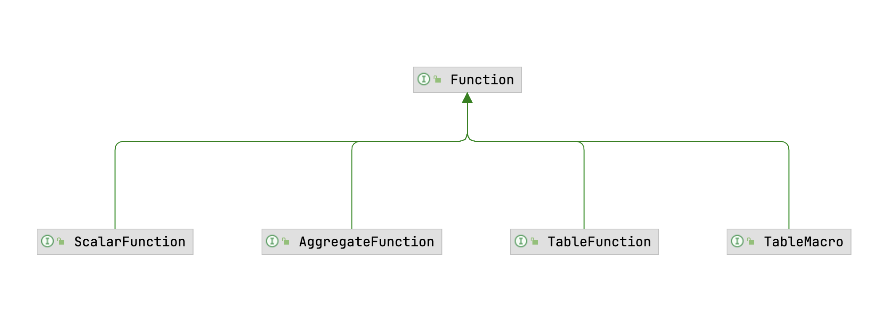

> 注意：本文基于 [Calcite 1.35.0](https://github.com/apache/calcite/tree/75750b78b5ac692caa654f506fc1515d4d3991d6) 版本源码进行学习研究，其他版本可能会存在实现逻辑差异，对源码感兴趣的读者**请注意版本选择**。

## 前言

在上一篇 [Apache Calcite SQL Parser 原理剖析](https://strongduanmu.com/blog/implementation-principle-of-apache-calcite-sql-parser.html)一文中，我们详细介绍了 Apache Calcite SQL 解析引擎的实现原理，从基础的 JavaCC 使用，再到 Caclite SQL 解析引擎的内部实现，最后介绍了 Calcite SqlNode 体系和 SQL 生成。Calcite 在完成基础的 SQL 解析后，第二个关键的步骤就是 SQL 校验，而 SQL 校验则依赖用户向 Calcite 注册的系统目录（`System Catalog`），本文会先重点关注 Calcite 系统目录的实现，下一篇再深入探究 Calcite 校验器的内部机制。

## 什么是 System Catalog


在 [CMU 15-445 Query Planning & Optimization I](https://15445.courses.cs.cmu.edu/fall2019/slides/14-optimization1.pdf) 课程中介绍了数据库系统的整体架构，系统目录（`System Catalog`）主要负责存储数据库的元数据信息，具体包括：表、列、索引、视图、用户、权限以及内部统计信息等。从上图可以看出，系统目录在数据库绑定校验、逻辑计划树改写和执行计划优化等阶段发挥了重要作用。

不同数据库系统都有自己的元数据信息获取方法，ANSI 标准规定通过 [INFORMATION_SCHEMA](https://en.wikipedia.org/wiki/Information_schema) 只读视图查询元数据信息，目前大部分数据库都遵循了这个规范，同时也都提供了一些快捷命令，例如：MySQL `SHOW TABLES` 命令，PostgreSQL `\d` 命令等。

Calcite 作为流行的查询引擎，也提供了系统目录的支持，但是 Calcite 不直接存储系统目录中的元数据信息，用户需要通过 API 将元数据注册到 Calcite 中，才可以使用系统目录提供的能力。下面这个部分，让我们一起来深入了解下 `Calcite System Catalog` 体系及其内部实现。

## Calcite System Catalog 体系

在 Caclite 中，Catalog 主要用来定义 SQL 查询过程中所需要的`元数据`和`命名空间`，具体实现是抽象类 `CalciteSchema`（如下所示），CalciteSchema 有 `CachingCalciteSchema` 和 `SimpleCalciteSchema` 两个子类，他们的区别主要是是否缓存表、函数和子模式。CalciteSchema 类中包含了 `Schema`、`Table`、`RelDataType`、`Function` 等核心对象，下面我们将针对这些对象进行逐一的介绍，了解他们在 Calcite System Catalog 体系中的具体作用。

```java
public abstract class CalciteSchema {
  	
    private final @Nullable CalciteSchema parent;
    public final Schema schema;
    public final String name;
  	
    /**
     * Tables explicitly defined in this schema. Does not include tables in
     * {@link #schema}.
     */
    protected final NameMap<TableEntry> tableMap;
    protected final NameMultimap<FunctionEntry> functionMap;
    protected final NameMap<TypeEntry> typeMap;
    protected final NameMap<LatticeEntry> latticeMap;
    protected final NameSet functionNames;
    protected final NameMap<FunctionEntry> nullaryFunctionMap;
    protected final NameMap<CalciteSchema> subSchemaMap;
    private @Nullable List<? extends List<String>> path;
```

### Schema

根据 SQL 标准定义，Schema 是一个描述符的持久命名集合（`a persistent, named collection of descriptors`），Schema 中通常包含了`表`、`列`、`数据类型`、`视图`、`存储过程`、`关系`、`主键`和`外键`等对象。而 Schema 在 Calcite 中，则是针对数据库 Database 或 Catalog 的抽象，Schema 中可以包含子 Schema，也可以包含若干个表。

如下图所示，Calcite Schema 支持任意层级的嵌套，可以很方便地适配不同的数据库，借助 Schema 的嵌套结构，Calcite 衍生出了 `NameSpace` 概念，通过 NameSpace 可以对不同 Schema 下的对象进行有效地隔离。例如在最底层 SubSchema 中定义的表、函数等对象，只能在当前的 Schema 中使用，如果想要在多个 Schema 中共享对象，则可以考虑在共同的父 Schema 中进行定义。


[Schema](https://github.com/apache/calcite/blob/c4042a34ef054b89cec1c47fefcbc8689bad55be/core/src/main/java/org/apache/calcite/schema/Schema.java) 接口定义如下，可以看到它提供了 `getTable`、`getType`、`getFunctions` 和 `getSubSchema` 等访问方法，常见的 Schema 接口实现类有 AbstractSchema、CsvSchema、JdbcCatalogSchema 等。`AbstractSchema` 对 Schema 接口的方法进行了实现，并提供了可重写的 `getTableMap`、`getFunctionMultimap` 和 `getSubSchemaMap` 方法，用于向 Schema 中注册表、函数和子 Schema。CsvSchema 和 JdbcCatalogSchema 都是继承了 AbstractSchema 完成 Schema 注册，大家也可以参考该方式简化注册 Schema 的流程。

```java
public interface Schema {

    @Nullable Table getTable(String name);

    Set<String> getTableNames();
    
    @Nullable RelProtoDataType getType(String name);
    
    Set<String> getTypeNames();
    
  	// 根据名称查询具有相同名称，但参数列表不同的重载函数，Calcite 将调用 Schemas.resolve 选择合适的函数
    Collection<Function> getFunctions(String name);
    
    Set<String> getFunctionNames();
    
    @Nullable Schema getSubSchema(String name);
    
    Set<String> getSubSchemaNames();
  	...
}
```

通过上面介绍的方式，我们可以实现 Schema 的初始注册及查询，但如果我们需要在运行过程中对 Schema 进行修改，那又该如何操作呢？Calcite 提供了 Schema 的子接口 `SchemaPlus`，它对 Schema 接口进行了扩展，能够支持表、函数及 Schema 的添加和删除操作。用户通常无需直接实例化 SchemaPlus 的子类，Calcite 内部提供了 SchemaPlus 的生成方法，例如：`CalciteSchema#plus()` 方法。

```java
public interface SchemaPlus extends Schema {
    
    SchemaPlus add(String name, Schema schema);
    
    void add(String name, Table table);
    
    /**
     * Removes a table from this schema, used e.g. to clean-up temporary tables.
     */
    default boolean removeTable(String name) {
        // Default implementation provided for backwards compatibility, to be removed before 2.0
        return false;
    }
    
    void add(String name, Function function);
    
    void add(String name, RelProtoDataType type);
    
    void add(String name, Lattice lattice);
  	...
}
```

此外，在 Schema 接口中还包含了 `Table`、`RelDataType`、`Function` 等对象，这些和全局共享的  `Table`、`RelProtoDataType`、`Function` 对象作用一样，只是生效的范围不同，我们将在下面的全局对象中分别介绍。

### Table

`Table` 表示 Calcite 中的一张表，Table 可以定义在某个 Schema 中，也可以定义在全局范围，全局表会在所有 Schema 中生效。Table 接口包含的主要方法如下，`getRowType` 方法用于获取表的行类型，行类型包含了所有列及其类型。`getStatistic` 方法用于获取 `Statistic` 统计信息对象，用于在查询优化阶段计算代价。`getJdbcTableType` 方法则用于获取表类型。

```java
public interface Table {

  	// 获取表的行类型
    RelDataType getRowType(RelDataTypeFactory typeFactory);

    // 获取表的统计信息
    Statistic getStatistic();

    // 获取表类型
    Schema.TableType getJdbcTableType();
}
```

Calcite Table 接口有很多实现类，分别适用于不同的场景，它的继承体系如下图所示：


`AbstractTable` 抽象类是对 Table 接口的基础实现，Caclite 中的大多数表都是继承 AbstractTable。`TranslatableTable` 、`ProjectableFilterableTable` 和 `FilterableTable` 我们在 [Apache Calcite 快速入门指南 - Calcite 元数据定义](https://strongduanmu.com/blog/apache-calcite-quick-start-guide.html#calcite-%E5%85%83%E6%95%B0%E6%8D%AE%E5%AE%9A%E4%B9%89) 小节中介绍过他们的区别，具体如下：

- `TranslatableTable`：`TranslatableTable` 则通过 `toRel` 方法将 RelOptTable 对象转换为 RelNode，例如之前文章介绍的 CsvTableScan，后续可以使用优化规则对 CsvTableScan 进行变换从而实现下推等优化；
- `ScannableTable`：`ScannableTable` 接口，用于扫描全部数据记录，Calcite 会调用 `scan` 方法获取全部数据；
- `FilterableTable`：`FilterableTable` 接口，可以在扫描数据过程中，根据 scan 方法传入的 `List<RexNode> filters` 参数进行数据过滤。

`ModifiableTable` 类用于处理对表进行更新的场景，例如执行 `INSERT`、`UPDATE` 和 `DELETE` 语句，通过调用 `toModificationRel` 方法将 `RelOptTable` 转换为 `TableModify` 算子。

`ViewTable` 类则用于视图处理，通过将视图定义语句 `viewSql` 转化为 AST 及关系代数，并在 `toRel` 处理过程中将原有的视图查询语句展开，变换为对原始表的查询，从而实现视图语义。

### RelDataType

`RelDataType` 代表了关系表达式返回的数据行类型或者标量表达式的类型，Calcite 支持了所有的 SQL 数据类型，也包括结构和数组类型。RelDataType 接口中的主要方法如下：

```java
public interface RelDataType {

  	// 获取结构类型中的字段，Calcite 中关系表达式返回的数据行类型使用 RelDataType 表示，每一列的类型通过 RelDataTypeField 表示
  	// RelDataTypeField 内部仍然封装了 RelDataType 表示字段类型
    List<RelDataTypeField> getFieldList();
		
  	// 当前类型是否支持为空
    boolean isNullable();

    RelDataType getComponentType();

    RelDataType getKeyType();

    RelDataType getValueType();
		
  	// 当前类型的字符集编码
    Charset getCharset();
		
  	// 当前类型的排序规则
    SqlCollation getCollation();
	
  	// 获取该类型的 JDBC 精度（字段长度，例如：-4.75，precision 为 3）
    int getPrecision();
		
  	// 获取该类型的范围（小数位数，例如：-4.75，scale 为 2）
    int getScale();
	
  	// 获取 SQL 类型
    SqlTypeName getSqlTypeName();
}
```

`getFieldList` 方法用于获取结构类型中的字段，Calcite 中关系表达式返回的数据行类型使用 RelDataType 表示，每一列的类型通过 `RelDataTypeField` 表示，RelDataTypeField 内部仍然封装了 RelDataType 表示字段类型。`isNullable` 方法表示当前类型是否支持为空，`getCharset` 用于获取当前类型的字符集编码，`getCollation` 用于获取当前类型的排序规则。`getPrecision` 和 `getScale` 方法分别用于获取该类型的精度和范围，精度表示字段的长度，范围则表示小数的位数。

### Function

Calcite 对函数的定义是：接受参数并返回结果的命名表达式。函数通过 Schema 进行注册，可以通过 `Schema#getFunctions` 获取函数，然后根据参数类型获取对应的函数。下面是 `Function` 接口声明：

```java
public interface Function {
    
  	// 获取函数参数
    List<FunctionParameter> getParameters();
}
```

Function 接口提供了 `getParameters` 获取函数参数的方法，Function 接口有 `ScalarFunction`、`AggregateFunction`、`TableFunction` 和 `TableMarco` 等几个主要的子接口。ScalarFunction 对应标量函数，也就是函数返回的结果为一个标量，AggregateFunction 对应聚合函数，会将多个值聚合计算为一个标量返回。

TableFunction 和 TableMacro 都对应了表函数，会返回一个表，他们的区别是 TableMacro 会在编译期间进行调用，编译器展开表达式允许 Calcite 实现更加强大的查询优化，例如我们可以对视图在编译期进行展开。相比于 TableMacro，TableFunction 则需要在执行阶段才能知道表的结果。



以上我们介绍了 Calcite System Catalog 体系中涉及到的类及其主要作用，下面小节我们将结合源码一起看看 Calcite System Catalog 逻辑是如何实现的。

## Calcite System Catalog 实现

为了更好地结合源码进行介绍，我们使用 [CsvTest#testPushDownProjectAggregateNested](https://github.com/apache/calcite/blob/2dba40e7a0a5651eac5a30d9e0a72f178bd9bff2/example/csv/src/test/java/org/apache/calcite/test/CsvTest.java#L308) 单测作为示例，测试 Case 中包含了表、列、函数等基本对象，并且涉及了分组查询和子查询等复杂语句，可以很好地覆盖到前文介绍的 Catalog 对象。

```java
final String sql = "explain plan " + extra + " for\n"
    + "select gender, max(qty)\n"
    + "from (\n"
    + "  select name, gender, count(*) qty\n"
    + "  from EMPS\n"
    + "  group by name, gender) t\n"
    + "group by gender";
sql("smart", sql).returns(expected).ok();
```

### System Catalog 初始化

首先我们来探究下 System Catalog 初始化流程，单测程序使用了 Calcite JDBC，在执行 `DriverManager.getConnection("jdbc:calcite:", info)` 方法获取连接时会进行 Catalog 初始化，该方法内部会创建 `CalciteConnectionImpl` 对象，而 CalciteConnectionImpl 内部又会创建 rootSchema，具体逻辑如下：

```java
// CalciteConnectionImpl 初始化
this.rootSchema = requireNonNull(rootSchema !=null ? rootSchema : CalciteSchema.createRootSchema(true));
```

`CalciteSchema.createRootSchema` 方法会根据参数传递的标识决定是否创建 `metadata` Schema，metadata Schema 会注册 `COLUMNS`、`TABLES` 等系统表以提供相关的查询。


MetadataSchema 类继承了 AbstractSchema，并提供了 getTableMap 方法来获取表的元数据信息，具体的实现逻辑如下。在定义表的元数据时，案例中使用了 `CalciteMetaImpl.MetadataTable` 类，它继承了 `AbstractQueryableTable` 和 `AbstractTable`，`enumerator` 方法负责返回系统表对应的结果集，`getJdbcTableType` 方法则返回了 `Schema.TableType.SYSTEM_TABLE`，表明当前注册的表是系统表。

```java
class MetadataSchema extends AbstractSchema {
  	// 定义表的元数据信息
    private static final Map<String, Table> TABLE_MAP = ImmutableMap.of("COLUMNS", new CalciteMetaImpl.MetadataTable<MetaColumn>(MetaColumn.class) {
        @Override
        public Enumerator<MetaColumn> enumerator(final CalciteMetaImpl meta) {
            final String catalog;
            try {
                catalog = meta.getConnection().getCatalog();
            } catch (SQLException e) {
                throw new RuntimeException(e);
            }
          	// 查询元数据中注册表的列信息
            return meta.tables(catalog).selectMany(meta::columns).enumerator();
        }
    }, "TABLES", new CalciteMetaImpl.MetadataTable<MetaTable>(MetaTable.class) {
        @Override
        public Enumerator<MetaTable> enumerator(CalciteMetaImpl meta) {
            final String catalog;
            try {
                catalog = meta.getConnection().getCatalog();
            } catch (SQLException e) {
                throw new RuntimeException(e);
            }
            // 查询元数据中注册表信息
            return meta.tables(catalog).enumerator();
        }
    });
  	
  	// 重写 AbstractSchema#getTableMap 以提供表的元数据信息
    @Override
    protected Map<String, Table> getTableMap() {
        return TABLE_MAP;
    }
}
```

业务相关的 Schema 和表信息注册，则是通过单测中配置的 `model` 进行声明，此案例中 model 为 `smart.json`。[ModelHandler 类](https://github.com/apache/calcite/blob/5d93ed4c89f048d30f83e6046159920044f4a8fe/core/src/main/java/org/apache/calcite/model/ModelHandler.java#L72)负责读取 model 文件，并解析 JSON 中的内容，再通过 SchemaPlus 注册新的 Schema，注册完成后会使用 `connection.setSchema(jsonRoot.defaultSchema);` 为当前连接设置默认 Schema。

```java
// ModelHandler#visit 方法
public void visit(JsonCustomSchema jsonSchema) {
    try {
      	// 获取当前 Schema 对象
        final SchemaPlus parentSchema = currentMutableSchema("sub-schema");
      	// 初始化 SchemaFactory
        final SchemaFactory schemaFactory = AvaticaUtils.instantiatePlugin(SchemaFactory.class, jsonSchema.factory);
      	// 调用 SchemaFactory 创建 Schema 对象
        final Schema schema = schemaFactory.create(parentSchema, jsonSchema.name, operandMap(jsonSchema, jsonSchema.operand));
      	// 通过 SchemaPlus 注册新的 Schema
        final SchemaPlus schemaPlus = parentSchema.add(jsonSchema.name, schema);
        populateSchema(jsonSchema, schemaPlus);
    } catch (Exception e) {
        throw new RuntimeException("Error instantiating " + jsonSchema, e);
    }
}
```

系统表和业务表 Schema 注册完成后，我们得到了如下的元数据信息，可以看到 `SALES` Schema 中的 tableMap 暂时为空，因为它使用了懒加载的方式，在具体需要使用到这些元数据时，才会去读取 CSV 文件注册表的元数据信息。CSV 元数据注册我们在 [Apache Calcite 快速入门指南 - Calcite 元数据定义](https://strongduanmu.com/blog/apache-calcite-quick-start-guide.html#calcite-%E5%85%83%E6%95%B0%E6%8D%AE%E5%AE%9A%E4%B9%89) 中已经详细进行了介绍，感兴趣的朋友可以阅读学习。


### System Catalog 使用场景

完成 System Catalog 初始化后，我们再来探究下 Catalog 具体的使用场景。让我们回到 [CsvTest#testPushDownProjectAggregateNested](https://github.com/apache/calcite/blob/2dba40e7a0a5651eac5a30d9e0a72f178bd9bff2/example/csv/src/test/java/org/apache/calcite/test/CsvTest.java#L308) 单测，`statement.executeQuery(sql);` 方法负责执行 SQL，内部会调用 [CalciteMetaImpl#prepareAndExecute](https://github.com/apache/calcite/blob/9600147e7dcbb062d69a7277d7ba8304b27f5ca1/core/src/main/java/org/apache/calcite/jdbc/CalciteMetaImpl.java#L617) 方法进行准备和执行。准备阶段会调用 [CalcitePrepareImpl#prepareSql](https://github.com/apache/calcite/blob/967bb5acc5448bc8d6ee9b9f5fa3c5f0d71405c2/core/src/main/java/org/apache/calcite/prepare/CalcitePrepareImpl.java#L482) 方法，prepareSql 核心逻辑如下，首先会使用 Catalog 信息初始化 `CalciteCatalogReader`，然后通过 Planner Factory 创建优化器 RelOptPlanner，最终使用 prepare2_ 方法对 SQL 进行解析、校验、优化以及代码生成。

```java
<T> CalciteSignature<T> prepare_(Context context, Query<T> query, Type elementType, long maxRowCount) {
    if (SIMPLE_SQLS.contains(query.sql)) {
        return simplePrepare(context, castNonNull(query.sql));
    }
    final JavaTypeFactory typeFactory = context.getTypeFactory();
  	// 初始化 CalciteCatalogReader
    CalciteCatalogReader catalogReader = new CalciteCatalogReader(context.getRootSchema(), context.getDefaultSchemaPath(), typeFactory, context.config());
		// 创建 Planner Factory
  	final List<Function1<Context, RelOptPlanner>> plannerFactories = createPlannerFactories();
    RuntimeException exception = Util.FoundOne.NULL;
    for (Function1<Context, RelOptPlanner> plannerFactory : plannerFactories) {
      	// 获取优化器 RelOptPlanner
        final RelOptPlanner planner = plannerFactory.apply(context);
        try {
            CalcitePreparingStmt preparingStmt = getPreparingStmt(context, elementType, catalogReader, planner);
          	// 解析、校验、优化并生成执行代码
            return prepare2_(context, query, elementType, maxRowCount, catalogReader, preparingStmt);
        } catch (RelOptPlanner.CannotPlanException e) {
            exception = e;
        }
    }
    throw exception;
}
```

由于本文主要探讨 Calcite System Catalog 相关的实现，因此主要聚焦在 `CalciteCatalogReader` 类，后续流程中的 SQL 校验、SQL AST 转关系代数 RelNode 都会使用到 CalciteCatalogReader。


上图展示了 `CatalogReder` 相关接口和类，CatalogReder 是校验器和优化器读取表元数据的接口，它继承了 `RelOptSchema`、`SqlValidatorCatalogReader` 和 `SqlOperatorTable` 接口。RelOptSchema 接口是 `RelOptTable` 对象的集合，接口提供了 `getTableForMember` 方法用于获取指定名称的 RelOptTable 对象。SqlValidatorCatalogReader 接口用于为 SqlValidator 提供元数据信息，SqlValidatorCatalogReader 接口的主要方法如下：

```java
public interface SqlValidatorCatalogReader extends Wrapper {

  	// 根据名称查找表
    SqlValidatorTable getTable(List<String> names);
		
  	// 根据名称查找自定义类型
    RelDataType getNamedType(SqlIdentifier typeName);
		
  	// 根据名称查找模式中的对象
    List<SqlMoniker> getAllSchemaObjectNames(List<String> names);

  	// 返回用于查找表的所有 schema 路径
    List<List<String>> getSchemaPaths();
		
  	// 返回 SqlNameMatcher 对象，用于大小写匹配
    SqlNameMatcher nameMatcher();

  	// 根据 projection 创建对应的 RelDataType
    RelDataType createTypeFromProjection(RelDataType type, List<String> columnNameList);    
  	
  	// 获取 root schema
    CalciteSchema getRootSchema();
    
    CalciteConnectionConfig getConfig();
}
```

SqlOperatorTable 接口用于查找 SQL 运算符和函数，内部提供了 `lookupOperatorOverloads` 方法，会根据运算符名称以及语法类型进行查找，并根据 SqlNameMatcher 决定是否区分大小写，查找到的结果会追加到 operatorList 中返回。

```java
public interface SqlOperatorTable {
    /**
     * Retrieves a list of operators with a given name and syntax. For example,
     * by passing SqlSyntax.Function, the returned list is narrowed to only
     * matching SqlFunction objects.
     *
     * @param opName       name of operator
     * @param category     function category to look up, or null for any matching operator
     * @param syntax       syntax type of operator
     * @param operatorList mutable list to which to append matches
     * @param nameMatcher  Name matcher
     */
    void lookupOperatorOverloads(SqlIdentifier opName, @Nullable SqlFunctionCategory category, SqlSyntax syntax, List<SqlOperator> operatorList, SqlNameMatcher nameMatcher);

    /**
     * Retrieves a list of all functions and operators in this table. Used for
     * automated testing. Depending on the table type, may or may not be mutable.
     *
     * @return list of SqlOperator objects
     */
    List<SqlOperator> getOperatorList();
}
```

了解了这三个接口主要提供的方法后，我们来看下 CalciteCatalogReader 中具体的实现逻辑。CalciteCatalogReader 在初始化时，会传入 `rootSchema`、`defaultSchema`、`typeFactory` 和 `config`，然后根据 config 中的 caseSensitive 属性初始化 SqlNameMatcher，用于名称的大小写匹配。

```java
public CalciteCatalogReader(CalciteSchema rootSchema, List<String> defaultSchema, RelDataTypeFactory typeFactory, CalciteConnectionConfig config) {
    this(rootSchema, SqlNameMatchers.withCaseSensitive(config != null && config.caseSensitive()), ImmutableList.of(Objects.requireNonNull(defaultSchema, "defaultSchema"), ImmutableList.of()), typeFactory, config);
}
```

CalciteCatalogReader 类主要提供了 `getTable` 和 `lookupOperatorOverloads` 方法，getTable 用于获取表的元数据信息，主要实现逻辑如下，`names` 参数会传入表的完整路径，此案例中为 `SALES -> EMPS` 表示 SALES schema 下的 EMPS 表。然后调用 `SqlValidatorUtil.getTableEntry` 方法先获取 schema 信息，再从 schema 中获取 table，如果 table 实现了 Wrapper 接口则转换为 Prepare.PreparingTable，否则使用 `RelOptTableImpl.create` 直接创建一个 RelOptTableImpl 对象。

```java
@Override
public Prepare.@Nullable PreparingTable getTable(final List<String> names) {
  	// 通过 getTableEntry 查找 TableEntry，先获取 schema，再获取 table
    CalciteSchema.TableEntry entry = SqlValidatorUtil.getTableEntry(this, names);
    if (entry != null) {
        final Table table = entry.getTable();
      	// 如果实现了 Wrapper 接口则转换为 Prepare.PreparingTable
        if (table instanceof Wrapper) {
            final Prepare.PreparingTable relOptTable = ((Wrapper) table).unwrap(Prepare.PreparingTable.class);
            if (relOptTable != null) {
                return relOptTable;
            }
        }
        return RelOptTableImpl.create(this, table.getRowType(typeFactory), entry, null);
    }
    return null;
}
```

lookupOperatorOverloads 方法：

TODO

```java
@Override
public void lookupOperatorOverloads(final SqlIdentifier opName, @Nullable SqlFunctionCategory category, SqlSyntax syntax, List<SqlOperator> operatorList, SqlNameMatcher nameMatcher) {
    if (syntax != SqlSyntax.FUNCTION) {
        return;
    }
    final Predicate<org.apache.calcite.schema.Function> predicate;
    if (category == null) {
        predicate = function -> true;
    } else if (category.isTableFunction()) {
        predicate = function -> function instanceof TableMacro || function instanceof TableFunction;
    } else {
        predicate = function -> !(function instanceof TableMacro || function instanceof TableFunction);
    }
    getFunctionsFrom(opName.names).stream().filter(predicate).map(function -> toOp(opName, function)).forEachOrdered(operatorList::add);
}

private Collection<org.apache.calcite.schema.Function> getFunctionsFrom(List<String> names) {
    final List<org.apache.calcite.schema.Function> functions2 = new ArrayList<>();
    final List<List<String>> schemaNameList = new ArrayList<>();
    if (names.size() > 1) {
        // Name qualified: ignore path. But we do look in "/catalog" and "/",
        // the last 2 items in the path.
        if (schemaPaths.size() > 1) {
            schemaNameList.addAll(Util.skip(schemaPaths));
        } else {
            schemaNameList.addAll(schemaPaths);
        }
    } else {
        for (List<String> schemaPath : schemaPaths) {
            CalciteSchema schema = SqlValidatorUtil.getSchema(rootSchema, schemaPath, nameMatcher);
            if (schema != null) {
                schemaNameList.addAll(schema.getPath());
            }
        }
    }
    for (List<String> schemaNames : schemaNameList) {
        CalciteSchema schema = SqlValidatorUtil.getSchema(rootSchema, Iterables.concat(schemaNames, Util.skipLast(names)), nameMatcher);
        if (schema != null) {
            final String name = Util.last(names);
            boolean caseSensitive = nameMatcher.isCaseSensitive();
            functions2.addAll(schema.getFunctions(name, caseSensitive));
        }
    }
    return functions2;
}
```


TODO

## 结语

TODO




笔者因为工作原因接触到 Calcite，前期学习过程中，深感 Calcite 学习资料之匮乏，因此创建了 [Calcite 从入门到精通知识星球](https://wx.zsxq.com/dweb2/index/group/51128414222814)，希望能够将学习过程中的资料和经验沉淀下来，为更多想要学习 Calcite 的朋友提供一些帮助。


