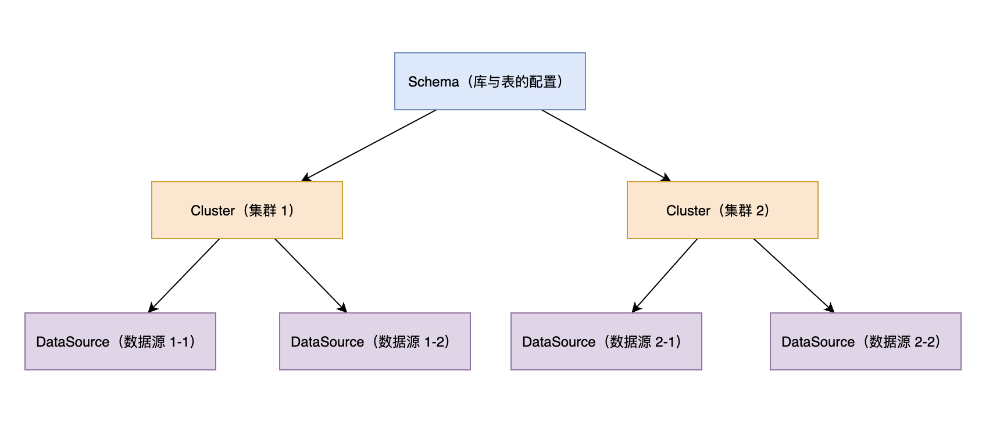
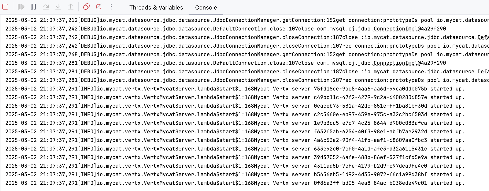
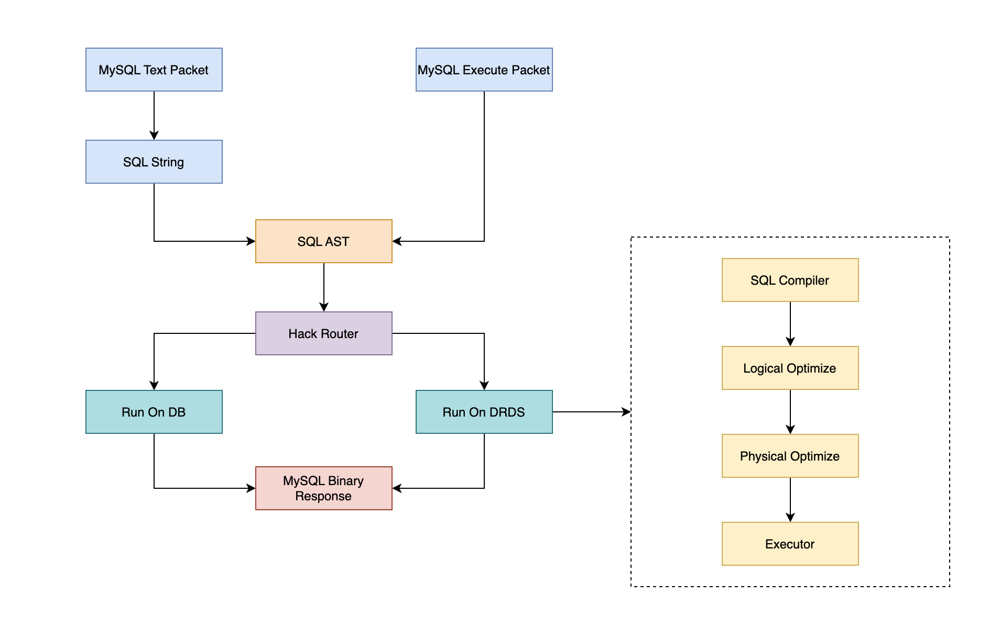
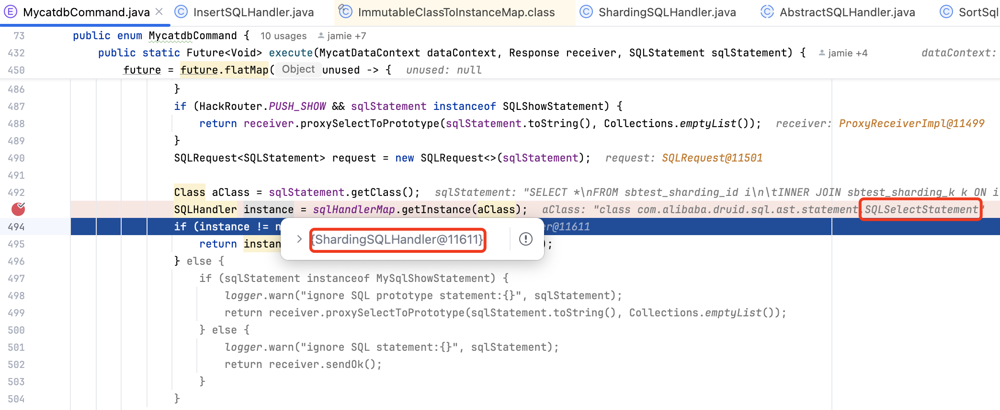
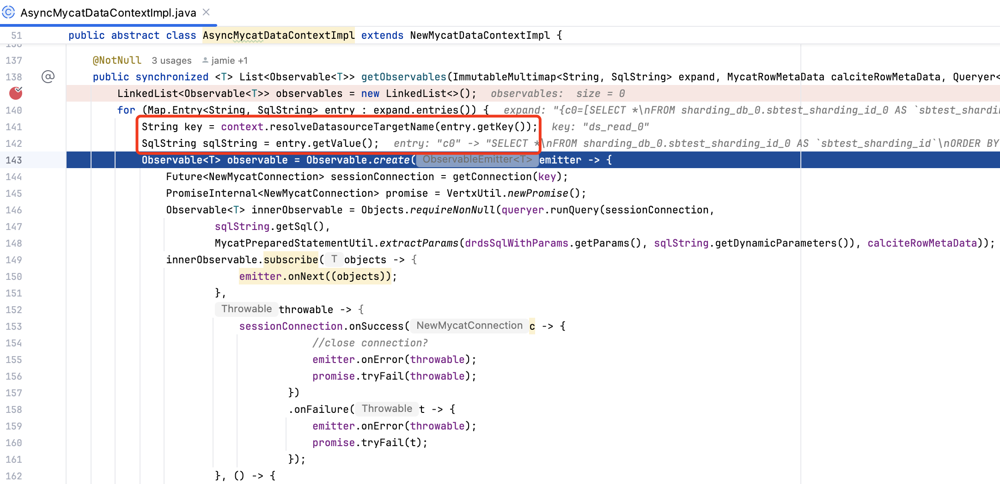

> 注意：本文基于 [MyCat2 main 分支 ced134b](https://github.com/strongduanmu/Mycat2/commit/ced134b06ce8ed0b5b7a9894359a50513532bbb7) 版本源码进行学习研究，其他版本可能会存在实现逻辑差异，对源码感兴趣的读者**请注意版本选择**。

## 前言

[MyCat](https://www.mycat.org.cn/) 是曾经较为流行的一款分库分表中间件，能够支持海量数据的水平分片，以及读写分离、分布式事务等功能。[MyCat2](http://mycatone.top/) 在原有功能的基础上增加了分布式查询引擎，该引擎基于 [Calcite](https://calcite.apache.org/) 项目实现，能够**将 SQL 编译为关系代数表达式，并基于规则优化引擎和代价优化引擎，生成物理执行计划，实现对跨库、跨实例的分布式 SQL 的支持**。虽然 MyCat 项目已经停止维护，但是`分布式查询引擎功能`仍然值得我们学习，本文将带领大家一起探索 `Apache Calcite` 在 `MyCat2` 中的实践，学习如何基于 Calcite 构建分布式查询引擎。

## MyCat2 环境搭建

首先，我们需要本地启动 MyCat2 服务，参考[入门 MyCat2](https://www.yuque.com/ccazhw/ml3nkf/fb2285b811138a442eb850f0127d7ea3?)，MyCat2 配置分为服务器配置和 Schema 配置。服务器配置  `server.json` 中可以指定 MyCat2 对外提供服务的 IP 和端口，`serverVersion` 用于模拟 MySQL 版本，此处我们将 `serverVersion` 调整为 `8.0.40-mycat-2.0`。

```json
{
    "server": {
        "ip": "127.0.0.1",
        "mycatId": 1,
        "port": 8066,
        // 注意设置模拟的 MySQL 版本，与后端客户端版本对应
        "serverVersion": "8.0.40-mycat-2.0"
    }
}
```

Schema 对应了 MySQL 中的库，MyCat2 Schema 配置包含了库与表的配置，它是建立在集群的基础上，而集群则是建立在数据源的基础上。因此，我们在配置时，需要自下而上进行配置，先配置数据源，再加数据源构建为集群，然后在集群上配置库与表。



MyCat2 中将 **Schema 划分为 2 类：原型库和业务库**，原型库 `prototype` 用于支持 MySQL 的**兼容性 SQL 和系统表 SQL**，这些 SQL 通常是由客户端或者 DAO 框架请求，普通用户一般不会使用。业务库顾名思义，就是指用户业务数据存储的库，通常会对这些库表进行水平分片、读写分离的配置。原型库和业务库都遵循上面的 Schema 配置方式，都可以配置在集群之上。

### 原型库配置

按照前文所属，我们先配置下 `prototype` 原型库的数据源，修改 `prototypeDs.datasource.json` 文件，将 MySQL 中的系统库 `mysql` 注册进来，数据源的名称为 `prototypeDs`。

```json
{
    "dbType": "mysql",
    "idleTimeout": 60000,
    "initSqls": [],
    "initSqlsGetConnection": true,
    "instanceType": "READ_WRITE",
    "maxCon": 1000,
    "maxConnectTimeout": 30000,
    "maxRetryCount": 5,
    "minCon": 1,
    "name": "prototypeDs",
    "password": "123456",
    "type": "JDBC",
    "url": "jdbc:mysql://localhost:3306/mysql?useUnicode=true&serverTimezone=Asia/Shanghai&characterEncoding=UTF-8",
    "user": "root",
    "weight": 0
}
```

然后修改 `prototype.cluster.json`，将 `prototypeDs` 数据源构建为原型库集群，`prototype.cluster.json` 配置文件如下：

```json
{
    "clusterType": "MASTER_SLAVE",
    "heartbeat": {
        "heartbeatTimeout": 1000,
        "maxRetry": 3,
        "minSwitchTimeInterval": 300,
        "slaveThreshold": 0
    },
    "masters": [
        "prototypeDs"
    ],
    "maxCon": 200,
    "name": "prototype",
    "readBalanceType": "BALANCE_ALL",
    "switchType": "SWITCH"
}
```

配置完成后，我们搜索 `MycatCore` 类进行本地启动，出现如下的日志表示启动成功。



启动成功后，可以使用 `mysql -h127.0.0.1 -uroot -p -P8066 --binary-as-hex=0 -c -A` 命令连接 MyCat2，密码为 `123456`。通过 `SHOW DATABASES` 可以看到，MyCat2 通过原型库默认提供了 3 个系统库。

```sql
> mysql -h127.0.0.1 -uroot -p -P8066 --binary-as-hex=0 -c -A                                                                                                                                           1 ✘ │ 13s
Enter password:
Welcome to the MySQL monitor.  Commands end with ; or \g.
Your MySQL connection id is 0
Server version: 8.0.40-mycat-2.0 MySQL Community Server - GPL

Copyright (c) 2000, 2024, Oracle and/or its affiliates.

Oracle is a registered trademark of Oracle Corporation and/or its
affiliates. Other names may be trademarks of their respective
owners.

Type 'help;' or '\h' for help. Type '\c' to clear the current input statement.

mysql> SHOW DATABASES;
+--------------------+
| `Database`         |
+--------------------+
| information_schema |
| mysql              |
| performance_schema |
+--------------------+
3 rows in set (0.14 sec)
```

### 业务库配置

完成原型库配置后，我们再来配置业务库。和原型库的配置类似，我们同样需要先注册 MySQL 数据源，然后将数据源构建为集群。MyCat2 提供了一种注释 SQL，用来注册数据源和集群。我们使用 `mysql -h127.0.0.1 -uroot -p -P8066 --binary-as-hex=0 -c -A` 连接 MyCat2 服务，并执行以下 SQL 注册数据源。为了模拟 MySQL 主从同步，我们将从库的数据库设置为和主库相同。

```sql
/*+ mycat:createDataSource{
	"name":"ds_write_0",
	"url":"jdbc:mysql://127.0.0.1:3306/ds_write_0",
	"user":"root",
	"password":"123456"
} */;

/*+ mycat:createDataSource{
	"name":"ds_read_0",
	"url":"jdbc:mysql://127.0.0.1:3306/ds_write_0",
	"user":"root",
	"password":"123456"
} */;

/*+ mycat:createDataSource{
	"name":"ds_write_1",
	"url":"jdbc:mysql://127.0.0.1:3306/ds_write_1",
	"user":"root",
	"password":"123456"
} */;

/*+ mycat:createDataSource{
	"name":"ds_read_1",
	"url":"jdbc:mysql://127.0.0.1:3306/ds_write_1",
	"user":"root",
	"password":"123456"
} */;
```

然后，我们基于创建的数据源构建集群，执行以下 SQL 创建集群：

```sql
/*! mycat:createCluster{
	"name":"c0",
	"masters":["ds_write_0"],
	"replicas":["ds_read_0"]
} */;

/*! mycat:createCluster{
	"name":"c1",
	"masters":["ds_write_1"],
	"replicas":["ds_read_1"]
} */;
```

创建完集群后，我们就可以创建一些不同维度的分片表，并通过这些表来观察 MyCat2 是如何支持分布式 SQL 的，执行如下 SQL 创建分片表。

```sql
CREATE DATABASE sharding_db;
USE sharding_db;

-- 创建 3 张不同维度的分片表
CREATE TABLE `sbtest_sharding_id` (
  `id` int(11) NOT NULL AUTO_INCREMENT,
  `k` int(11) NOT NULL DEFAULT '0',
  `c` char(120) NOT NULL DEFAULT '',
  `pad` char(60) NOT NULL DEFAULT '',
  PRIMARY KEY (`id`)
) DBPARTITION BY HASH(id) DBPARTITIONS 2;
  
CREATE TABLE `sbtest_sharding_k` (
  `id` int(11) NOT NULL AUTO_INCREMENT,
  `k` int(11) NOT NULL DEFAULT '0',
  `c` char(120) NOT NULL DEFAULT '',
  `pad` char(60) NOT NULL DEFAULT '',
  PRIMARY KEY (`id`)
) DBPARTITION BY HASH(k) DBPARTITIONS 2;

CREATE TABLE `sbtest_sharding_c` (
  `id` int(11) NOT NULL AUTO_INCREMENT,
  `k` int(11) NOT NULL DEFAULT '0',
  `c` char(120) NOT NULL DEFAULT '',
  `pad` char(60) NOT NULL DEFAULT '',
  PRIMARY KEY (`id`)
) DBPARTITION BY HASH(c) DBPARTITIONS 2;
```

### 初始化数据

创建好分片表后，我们再使用 [sysbench](https://github.com/akopytov/sysbench) 工具向 `sbtest1` 表插入 10w 条数据，执行如下脚本初始化数据：

```bash
sysbench /opt/homebrew/Cellar/sysbench/1.0.20_6/share/sysbench/oltp_read_write.lua --tables=1 --table_size=100000 --mysql-user=root --mysql-password=123456 --mysql-host=127.0.0.1 --mysql-port=8066 --mysql-db=sharding_db prepare
```

由于 MyCat2 不支持 `INSERT ... SELECT ...` 语句，因此需要先使用 `mysqldump` 将 `sbtest1` 中的数据导出到文件。

```bash
mysqldump -h127.0.0.1 -uroot -p -P8066 sharding_db sbtest1 > sbtest1.sql
```

然后修改 `sbtest1.sql` 文件，注释掉文件中除了 `INSERT` 外的语句，并将 `sbtest1` 分别修改为 `sbtest_sharding_id`、`sbtest_sharding_k` 和 `sbtest_sharding_c`，然后执行 `mysql> source ~/sbtest1.sql` 导入数据到目标表。使用 `SELECT COUNT(1)` 检查各个表的数据量，都是 10w 条记录，符合我们的预期。

```sql
mysql> SELECT COUNT(1) FROM sbtest_sharding_id;
+----------+
| COUNT(1) |
+----------+
|   100000 |
+----------+

mysql> SELECT COUNT(1) FROM sbtest_sharding_k;
+----------+
| COUNT(1) |
+----------+
|   100000 |
+----------+

mysql> SELECT COUNT(1) FROM sbtest_sharding_c;
+----------+
| COUNT(1) |
+----------+
|   100000 |
+----------+
```




## MyCat2 Calcite 实践探究

### 执行流程概览

参考 [MyCat2 SQL 编写指导](https://www.yuque.com/ccazhw/ml3nkf/hdqguz)，MyCat2 SQL 执行流程如下，服务端接收到 SQL 字符串或模板化 SQL 后，会先将 SQL 解析为 SQL AST，然后使用 `Hack Router` 进行路由判断，如果是一些简单的单节点 SQL，`Hack Router` 会直接将 SQL 路由到 DB 中执行，其他复杂的 SQL 则会进入 DRDS 处理流程。DRDS 处理流程中，会使用 Calcite 对 SQL 语句进行编译，然后生成关系代数树，并经过逻辑优化和物理优化两步，最终执行返回 SQL 结果。



### 初看 SQL 执行

由于本文主要关注 MyCat2 对于 Calcite 的应用，因此后续介绍中其他流程不会过多探究，感兴趣的朋友可以下载源码自行研究。我们执行如下的 SQL 示例，来跟踪 MyCat2 的执行流程，并探索在 SQL 执行过程中，Calcite 查询引擎都进行了哪些优化。

```sql
SELECT * FROM sbtest_sharding_id i INNER JOIN sbtest_sharding_k k ON i.id = k.id INNER JOIN sbtest_sharding_c c ON k.id = c.id LIMIT 10;
```

首先，我们可以执行 `EXPLAIN` 语句，先观察下这条语句的执行计划（省略了执行计划中生成的执行代码 `Code` 部分）。对于这 3 张表的 JOIN 处理，MyCat2 优化器选择了 `SortMergeJoin` 的方式，从 MySQL 中查询 `sharding_db.sbtest_sharding_id` 和 `sharding_db.sbtest_sharding_k` 表时，会使用 `Join Key` 进行排序，对于已经排序的结果集，再拉取到内存中进行 `SortMergeJoin`。处理完 Join 后，会对结果集进行一次内存排序，然后和 `sharding_db.sbtest_sharding_c` 表再进行一次 `SortMergeJoin`，最终的结果集经过内存排序后获取出前 10 条结果。

可以看到，MyCat2 中将分片的逻辑表封装为 MycatView，MycatView 在内部下推执行时，会根据分片的规则改写为不同的真实 SQL，执行计划中的 `Each` 部分展示了下推 DB 执行的 SQL 语句，由于使用了 `SortMergeJoin`，因此下推语句中包含了 `ORDER BY` 排序处理。

```sql
mysql> EXPLAIN SELECT * FROM sbtest_sharding_id i INNER JOIN sbtest_sharding_k k ON i.id = k.id INNER JOIN sbtest_sharding_c c ON k.id = c.id LIMIT 10;
+----------------------------------------------------------------------------------------------------------------------------------------------------------------------------------------------------------------------------------------------------------------------------------------------------------------------------------------------------------------------------------------------------------------------------------------------------------------------------------------------------------------------------------------------------------------------------------------------------------------------------------------------------------+
| plan                                                                                                                                                                                                                                                                                                                                                                                                                                                                                                                                                                                                                                                     |
+----------------------------------------------------------------------------------------------------------------------------------------------------------------------------------------------------------------------------------------------------------------------------------------------------------------------------------------------------------------------------------------------------------------------------------------------------------------------------------------------------------------------------------------------------------------------------------------------------------------------------------------------------------+
| Plan:                                                                                                                                                                                                                                                                                                                                                                                                                                                                                                                                                                                                                                                    |
| MycatMemSort(fetch=[?0])                                                                                                                                                                                                                                                                                                                                                                                                                                                                                                                                                                                                                                 |
|   MycatSortMergeJoin(condition=[=($4, $8)], joinType=[inner])                                                                                                                                                                                                                                                                                                                                                                                                                                                                                                                                                                                            |
|     MycatMemSort(sort0=[$4], dir0=[ASC])                                                                                                                                                                                                                                                                                                                                                                                                                                                                                                                                                                                                                 |
|       MycatSortMergeJoin(condition=[=($0, $4)], joinType=[inner])                                                                                                                                                                                                                                                                                                                                                                                                                                                                                                                                                                                        |
|         MycatView(distribution=[[sharding_db.sbtest_sharding_id]], mergeSort=[true])                                                                                                                                                                                                                                                                                                                                                                                                                                                                                                                                                                     |
|         MycatView(distribution=[[sharding_db.sbtest_sharding_k]], mergeSort=[true])                                                                                                                                                                                                                                                                                                                                                                                                                                                                                                                                                                      |
|     MycatView(distribution=[[sharding_db.sbtest_sharding_c]], mergeSort=[true])                                                                                                                                                                                                                                                                                                                                                                                                                                                                                                                                                                          |
| Each(targetName=c0, sql=SELECT * FROM sharding_db_0.sbtest_sharding_id_0 AS `sbtest_sharding_id` ORDER BY (`sbtest_sharding_id`.`id` IS NULL), `sbtest_sharding_id`.`id`)                                                                                                                                                                                                                                                                                                                                                                                                                                                                                |
| Each(targetName=c1, sql=SELECT * FROM sharding_db_1.sbtest_sharding_id_0 AS `sbtest_sharding_id` ORDER BY (`sbtest_sharding_id`.`id` IS NULL), `sbtest_sharding_id`.`id`)                                                                                                                                                                                                                                                                                                                                                                                                                                                                                |
| Each(targetName=c0, sql=SELECT * FROM sharding_db_0.sbtest_sharding_k_0 AS `sbtest_sharding_k` ORDER BY (`sbtest_sharding_k`.`id` IS NULL), `sbtest_sharding_k`.`id`)                                                                                                                                                                                                                                                                                                                                                                                                                                                                                    |
| Each(targetName=c1, sql=SELECT * FROM sharding_db_1.sbtest_sharding_k_0 AS `sbtest_sharding_k` ORDER BY (`sbtest_sharding_k`.`id` IS NULL), `sbtest_sharding_k`.`id`)                                                                                                                                                                                                                                                                                                                                                                                                                                                                                    |
| Each(targetName=c0, sql=SELECT * FROM sharding_db_0.sbtest_sharding_c_0 AS `sbtest_sharding_c` ORDER BY (`sbtest_sharding_c`.`id` IS NULL), `sbtest_sharding_c`.`id`)                                                                                                                                                                                                                                                                                                                                                                                                                                                                                    |
| Each(targetName=c1, sql=SELECT * FROM sharding_db_1.sbtest_sharding_c_0 AS `sbtest_sharding_c` ORDER BY (`sbtest_sharding_c`.`id` IS NULL), `sbtest_sharding_c`.`id`)                                                                                                                                                                                                                                                                                                                                                                                                                                                                                    |
+----------------------------------------------------------------------------------------------------------------------------------------------------------------------------------------------------------------------------------------------------------------------------------------------------------------------------------------------------------------------------------------------------------------------------------------------------------------------------------------------------------------------------------------------------------------------------------------------------------------------------------------------------------+
170 rows in set (0.46 sec)
```

### 从 SQL 到执行计划

通过 MyCat2 的执行计划，我们对于分片表的多表关联查询有了初步的认识，下面我们来探究下 MyCat2 的代码实现，看看一条 SQL 是如何转换为执行计划的。我们执行如下的 SQL 语句：

```sql
SELECT * FROM sbtest_sharding_id i INNER JOIN sbtest_sharding_k k ON i.id = k.id INNER JOIN sbtest_sharding_c c ON k.id = c.id LIMIT 10;
```

MyCat2 SQL 执行的入口在 [MycatdbCommand](https://github.com/strongduanmu/Mycat2/blob/803bda6a02aa64d7fc16b521f04da06ce4bce2db/mycat2/src/main/java/io/mycat/commands/MycatdbCommand.java#L493) 类中，它会根据 SQL 语句的类型生成不同的 Handler 类，`SQLSelectStatement` 查询语句对应的是 `ShardingSQLHandler`。



获取到 `ShardingSQLHandler` 后，会调用 `AbstractSQLHandler#execute` 方法，最终会调用到 `ShardingSQLHandler#onExecute` 方法中，方法内部会使用 `hackRouter` 的 `analyse` 方法进行分析，用来决定 SQL 直接执行还是走 DRDS 执行。`analyse` 方法内部会先提取出语句中的表，然后调用 `checkVaildNormalRoute` 方法，对不同表的路由进行 `check` 并记录数据分布结果，最后根据数据分布结果决定执行方式。

```java
public class ShardingSQLHandler extends AbstractSQLHandler<SQLSelectStatement> {

    @Override
    protected Future<Void> onExecute(SQLRequest<SQLSelectStatement> request,
        MycatDataContext dataContext, Response response) {
        Optional<Future<Void>> op = Optional.empty();
        ...
        // SQL 模板化处理，转换为 select * from `sharding_db`.sbtest_sharding_id i inner join `sharding_db`.sbtest_sharding_k k on i.id = k.id inner join `sharding_db`.sbtest_sharding_c c on k.id = c.id limit ? 和参数 10
        DrdsSqlWithParams drdsSqlWithParams = DrdsRunnerHelper.preParse(request.getAst(), dataContext.getDefaultSchema());
        HackRouter hackRouter = new HackRouter(drdsSqlWithParams.getParameterizedStatement(), dataContext);
        try {
            // 分析 SQL 中表的数据分布，然后决定透传执行还是走 DRDS 执行
            if (hackRouter.analyse()) {
                Pair<String, String> plan = hackRouter.getPlan();
                return response.proxySelect(Collections.singletonList(plan.getKey()), plan.getValue(), drdsSqlWithParams.getParams());
            } else {
                return DrdsRunnerHelper.runOnDrds(dataContext, drdsSqlWithParams, response);
            }
        } catch (Throwable throwable) {
            LOGGER.error(request.getAst().toString(), throwable);
            return Future.failedFuture(throwable);
        }
    }
}
```

`DrdsRunnerHelper#runOnDrds` 方法逻辑如下，`getPlan` 用于获取 SQL 对应的执行计划，然后再调用 `getPlanImplementor` 获取执行计划的执行器，并执行 SQL 语句，然后返回 Future 对象等待返回结果。

```java
public static Future<Void> runOnDrds(MycatDataContext dataContext, DrdsSqlWithParams drdsSqlWithParams, Response response) {
    PlanImpl plan = getPlan(drdsSqlWithParams);
    PlanImplementor planImplementor = getPlanImplementor(dataContext, response, drdsSqlWithParams);
    return impl(plan, planImplementor);
}

@NotNull
public static PlanImpl getPlan(DrdsSqlWithParams drdsSqlWithParams) {
    QueryPlanner planner = MetaClusterCurrent.wrapper(QueryPlanner.class);
    PlanImpl plan;
    ParamHolder paramHolder = ParamHolder.CURRENT_THREAD_LOCAL.get();
    try {
        paramHolder.setData(drdsSqlWithParams.getParams(), drdsSqlWithParams.getTypeNames());
        CodeExecuterContext codeExecuterContext = planner.innerComputeMinCostCodeExecuterContext(drdsSqlWithParams);
        plan = new PlanImpl(codeExecuterContext.getMycatRel(), codeExecuterContext, drdsSqlWithParams.getAliasList());
    } finally {
    }
    return plan;
}
```

我们先重点关注 `getPlan` 方法是如何生成执行计划的，该方法内部调用的是 `QueryPlanner#innerComputeMinCostCodeExecuterContext` 方法，它负责从缓存中获取 `MyCatRelList` 执行计划，如果缓存中不存在则调用 `add` 方法生成执行计划，并将执行计划添加到缓存中。

```java
public CodeExecuterContext innerComputeMinCostCodeExecuterContext(DrdsSql sqlSelectStatement) {
    // 创建 RelOptCluster，内部注册 HintStrategyTable 处理 Hint 语法
    RelOptCluster relOptCluster = DrdsSqlCompiler.newCluster();
    // 从缓存中获取 MyCatRelList，如果不存在，则生成 MyCatRelList
    List<CodeExecuterContext> codeExecuterContexts = getAcceptedMycatRelList(sqlSelectStatement);
    int size = codeExecuterContexts.size();
    // 比较 Cost 获取最小的 CodeExecuterContext
}

public List<CodeExecuterContext> getAcceptedMycatRelList(DrdsSql drdsSql) {
    List<CodeExecuterContext> acceptedMycatRelList = planCache.getAcceptedMycatRelList(drdsSql);
    if (acceptedMycatRelList.isEmpty()) {
        synchronized (this) {
            // 从缓存中获取 MyCatRelList，存在直接返回
            acceptedMycatRelList = planCache.getAcceptedMycatRelList(drdsSql);
            if (!acceptedMycatRelList.isEmpty()) {
                return acceptedMycatRelList;
            } else {
                // 不存在则调用 add 方法生成 MyCatRelList，并添加到缓存中
                PlanResultSet add = planCache.add(false, drdsSql);
                return Collections.singletonList(add.getContext());
            }
        }
    } else {
        return acceptedMycatRelList;
    }
}
```

`add` 方法内部首先会获取 SQL 执行计划的基线，用于提供稳定的执行计划，然后调用 `drdsSqlCompiler#dispatch` 方法，内部包含了 CBO 和 RBO 优化，会生成 `MycatRel` 执行计划树。生成的执行计划树通过 `RelJsonWriter` 工具类转换为字符串，存储到新的执行计划基线中，最终调用 `saveBaselinePlan` 保存下来。

```java
public synchronized PlanResultSet add(boolean fix, DrdsSql drdsSql) {
    Long baselineId = null;
    // 获取 SQL 执行计划基线，用于提供稳定的执行计划
    Baseline baseline = this.getBaseline(drdsSql);
    DrdsSqlCompiler drdsSqlCompiler = MetaClusterCurrent.wrapper(DrdsSqlCompiler.class);
    OptimizationContext optimizationContext = new OptimizationContext();
    // 生成 MycatRel 执行计划树，内部包含了 RBO 和 CBO 优化
    MycatRel mycatRel = drdsSqlCompiler.dispatch(optimizationContext, drdsSql);
    RelJsonWriter relJsonWriter = new RelJsonWriter();
    mycatRel.explain(relJsonWriter);
    long hash = planIds.nextPlanId();
    // 生成新的执行计划基线
    BaselinePlan newBaselinePlan = new BaselinePlan(drdsSql.getParameterizedSQL(), relJsonWriter.asString(), hash, baselineId = baseline.getBaselineId(), null);
    getCodeExecuterContext(baseline,newBaselinePlan,optimizationContext, mycatRel);
    return saveBaselinePlan(fix, false, baseline, newBaselinePlan);
}
```

`drdsSqlCompiler#dispatch` 方法负责将不同的 SQL 语句进行转换处理，如果是 `SQLSelectStatement`，则会调用 `compileQuery` 方法，方法实现逻辑如下：

```java
public MycatRel compileQuery(OptimizationContext optimizationContext, SchemaPlus plus, DrdsSql drdsSql) {
    RelNode logPlan;
    RelNodeContext relNodeContext = null;
    {
        // 创建 SqlToRelConverter 将 SQL AST 转换为 RelNode 关系代数树
        relNodeContext = getRelRoot(plus, drdsSql);
        logPlan = relNodeContext.getRoot().rel;
        optimizationContext.relNodeContext = relNodeContext;
    }
    RelDataType finalRowType = logPlan.getRowType();
    // RBO 优化
    RelNode rboLogPlan = optimizeWithRBO(logPlan);
    // CBO 优化
    MycatRel mycatRel = optimizeWithCBO(rboLogPlan, Collections.emptyList());
    if (!RelOptUtil.areRowTypesEqual(mycatRel.getRowType(), finalRowType, true)) {
        Project relNode = (Project) relNodeContext.getRelBuilder().push(mycatRel).rename(finalRowType.getFieldNames()).build();
        mycatRel = MycatProject.create(relNode.getInput(), relNode.getProjects(), relNode.getRowType());
    }
    return mycatRel;
}
```

`optimizeWithRBO` 主要进行逻辑优化，包括：子查询优化、聚合查询优化、JOIN 顺序优化、其他优化（包括 MyCat2 自定义的优化），逻辑优化基本都采用了 `HepPlanner` 优化器，通过 `HepProgramBuilder` 添加的优化规则，builder 中可以调用 `addMatchLimit` 设置最大匹配次数。

```java
private RelNode optimizeWithRBO(RelNode logPlan) {
    // 子查询优化
    Program subQueryProgram = getSubQueryProgram();
    RelNode unSubQuery = subQueryProgram.run(null, logPlan, null, Collections.emptyList(), Collections.emptyList());
    // 聚合查询优化
    RelNode unAvg = resolveAggExpr(unSubQuery);
    ...
    // JOIN 顺序优化
    RelNode joinClustering = toMultiJoin(unAvg).map(relNode -> {
        HepProgramBuilder builder = new HepProgramBuilder();
        builder.addMatchLimit(1024);
        builder.addGroupBegin();
        builder.addRuleInstance(MycatHepJoinClustering.Config.DEFAULT.toRule());
        builder.addGroupEnd();
        builder.addMatchLimit(64);
        builder.addGroupBegin();
        builder.addRuleInstance(CoreRules.MULTI_JOIN_OPTIMIZE);
        builder.addGroupEnd();
        HepPlanner planner = new HepPlanner(builder.build());
        planner.setRoot(relNode);
        RelNode bestExp = planner.findBestExp();
        return bestExp;
    }...;
    // 其他优化规则
    HepProgramBuilder builder = new HepProgramBuilder();
    builder.addMatchLimit(1024);
    builder.addGroupBegin().addRuleCollection(ImmutableList.of(AggregateExpandDistinctAggregatesRule.Config.DEFAULT.toRule(), CoreRules.AGGREGATE_ANY_PULL_UP_CONSTANTS, CoreRules.PROJECT_MERGE, CoreRules.PROJECT_CORRELATE_TRANSPOSE, CoreRules.PROJECT_SET_OP_TRANSPOSE, CoreRules.PROJECT_JOIN_TRANSPOSE, CoreRules.PROJECT_WINDOW_TRANSPOSE, CoreRules.PROJECT_FILTER_TRANSPOSE, ProjectRemoveRule.Config.DEFAULT.toRule())).addGroupEnd().addMatchOrder(HepMatchOrder.BOTTOM_UP);
    builder.addMatchLimit(1024);
    builder.addGroupBegin().addRuleCollection(FILTER).addGroupEnd().addMatchOrder(HepMatchOrder.BOTTOM_UP);
    builder.addMatchLimit(1024);
    builder.addGroupBegin().addRuleInstance(CoreRules.PROJECT_MERGE).addGroupEnd().addMatchOrder(HepMatchOrder.ARBITRARY);
    builder.addMatchLimit(1024);
    // MyCat2 自定义规则，包括：单表、广播表下推，JOIN ER 表下推等
    builder.addGroupBegin().addRuleCollection(LocalRules.RBO_RULES).addRuleInstance(MycatAggDistinctRule.Config.DEFAULT.toRule()).addGroupEnd().addMatchOrder(HepMatchOrder.BOTTOM_UP);
    builder.addMatchLimit(1024);
    HepPlanner planner = new HepPlanner(builder.build());
    planner.setRoot(joinClustering);
    RelNode bestExp = planner.findBestExp();
    return bestExp;
}
```

`optimizeWithCBO` 主要进行物理优化，它根据这种方案的 Cost 选择最优的执行计划。`optimizeWithCBO` 逻辑如下，如果 `logPlan` 已经是 `MycatRel`，则直接返回，否则继续执行进行优化。MyCat2 物理优化中使用了许多 Calcite 内置的优化规则，同时也扩展了一些适合于 MyCat2 的规则，例如：`MycatTableLookupSemiJoinRule`、`MycatJoinTableLookupTransposeRule`，感兴趣的朋友可以构造相关的 SQL 研究具体的优化规则逻辑。

`optimizeWithCBO` 方法最后使用 `MatierialRewriter` 对执行计划树进行改写，`MatierialRewriter` 主要用于处理计算过程中需要消耗较多内存、网络调用的场景，例如：`MycatNestedLoopJoin`，会将右表 `right` 替换为 `MycatMatierial`，然后在执行时 `MycatMatierial` 会一次读取右表（Inner）的数据，并写入到本地文件中，这样计算 `MycatNestedLoopJoin` 时，MyCat2 就无需频繁地去 MySQL 中获取 Inner 表中的数据，直接从本地文件就可以快速获取。

```java
public MycatRel optimizeWithCBO(RelNode logPlan, Collection<RelOptRule> relOptRules) {
    if (logPlan instanceof MycatRel) {
        return (MycatRel) logPlan;
    } else {
        RelOptCluster cluster = logPlan.getCluster();
        RelOptPlanner planner = cluster.getPlanner();
        planner.clear();
        MycatConvention.INSTANCE.register(planner);
        ImmutableList.Builder<RelOptRule> listBuilder = ImmutableList.builder();
        listBuilder.addAll(MycatExtraSortRule.RULES);
        listBuilder.addAll(LocalRules.CBO_RULES);
        // 算子交换
        // Filter/Join, TopN/Join, Agg/Join, Filter/Agg, Sort/Project, Join/TableLookup
        listBuilder.add(CoreRules.JOIN_PUSH_EXPRESSIONS);
        listBuilder.add(CoreRules.FILTER_INTO_JOIN);
        // TopN/Join
        listBuilder.add(CoreRules.SORT_JOIN_TRANSPOSE.config.withOperandFor(MycatTopN.class, Join.class).toRule());
        listBuilder.add(CoreRules.FILTER_SET_OP_TRANSPOSE.config.toRule());
        listBuilder.add(CoreRules.AGGREGATE_JOIN_TRANSPOSE.config.withOperandFor(Aggregate.class, Join.class, false).toRule());
        // Sort/Project
        listBuilder.add(CoreRules.SORT_PROJECT_TRANSPOSE.config.withOperandFor(Sort.class, Project.class).toRule());
        // index
        listBuilder.add(MycatViewIndexViewRule.DEFAULT_CONFIG.toRule());
        if (DrdsSqlCompiler.RBO_BKA_JOIN) {
            // TABLELOOKUP
            listBuilder.add(MycatTableLookupSemiJoinRule.INSTANCE);
            listBuilder.add(MycatTableLookupCombineRule.INSTANCE);
            listBuilder.add(MycatJoinTableLookupTransposeRule.LEFT_INSTANCE);
            listBuilder.add(MycatJoinTableLookupTransposeRule.RIGHT_INSTANCE);
            listBuilder.add(MycatValuesJoinRule.INSTANCE);
        }
        listBuilder.build().forEach(c -> planner.addRule(c));
        MycatConvention.INSTANCE.register(planner);
        if (relOptRules != null) {
            for (RelOptRule relOptRule : relOptRules) {
                planner.addRule(relOptRule);
            }
        }
        ...
        logPlan = planner.changeTraits(logPlan, cluster.traitSetOf(MycatConvention.INSTANCE));
        planner.setRoot(logPlan);
        RelNode bestExp = planner.findBestExp();
        // MatierialRewriter 对需要消耗内存、网络调用的算子进行改写，将数据物化存储到本地文件
        RelNode accept = bestExp.accept(new MatierialRewriter());
        return (MycatRel) accept;
    }
}
```

完成 CBO 优化后，最后会判断逻辑计划和优化后的执行计划 `RowType` 是否相同，如果不同则使用 `RelBuilder` 对优化后的执行计划进行改名，保证最终返回的列名和逻辑计划中的一致。执行到这里，就完成了从 SQL 到执行计划的全过程，其中有一些涉及优化规则的细节，由于文章的篇幅就不再一一研究，感兴趣的读者可以对照代码进行调试学习。

```java
if (!RelOptUtil.areRowTypesEqual(mycatRel.getRowType(), finalRowType, true)) {
    Project relNode = (Project) relNodeContext.getRelBuilder().push(mycatRel).rename(finalRowType.getFieldNames()).build();
    mycatRel = MycatProject.create(relNode.getInput(), relNode.getProjects(), relNode.getRowType());
}
```

### 执行代码生成

有了物理执行计划后，最后一步就是根据执行计划生成可执行代码，并执行 SQL 返回结果。执行代码生成的逻辑在 `DrdsExecutorCompiler#getCodeExecuterContext` 方法中，MyCat2 生成代码的方式和 Calcite 一致，都是采用 Linq4j 进行生成，MyCat2 根据自身项目需求，调整了一些算子生成代码的逻辑。

```java
public static CodeExecuterContext getCodeExecuterContext(Map<RexNode, RexNode> constantMap, MycatRel relNode, boolean forUpdate) {
    HashMap<String, Object> varContext = new HashMap<>(2);
    StreamMycatEnumerableRelImplementor mycatEnumerableRelImplementor = new StreamMycatEnumerableRelImplementor(varContext);
    HashMap<String, MycatRelDatasourceSourceInfo> stat = new HashMap<>();
    ...
    ClassDeclaration classDeclaration = mycatEnumerableRelImplementor.implementHybridRoot(relNode, EnumerableRel.Prefer.ARRAY);
    String code = Expressions.toString(classDeclaration.memberDeclarations, "\n", false);
    CodeContext codeContext = new CodeContext(classDeclaration.name, code);
    CodeExecuterContext executerContext = CodeExecuterContext.of(constantMap, stat, varContext, relNode, codeContext);
    return executerContext;
}
```

`StreamMycatEnumerableRelImplementor` 是代码生成的入口类，调用 `implementHybridRoot` 方法遍历执行计划树。生成代码过程中通过 `visitChild` 方法访问子节点，从而调用子节点 `implement` 方法（每个物理算子都实现了 implement 方法），最终实现整个执行计划树的代码生成。`MycatSortMergeJoin` 的 implement 方法如下：

```java
@Override
public Result implement(MycatEnumerableRelImplementor implementor, Prefer pref) {
    BlockBuilder builder = new BlockBuilder();
    // visitChild 访问 left 节点，并生成代码，存储在 Result 对象中
    final Result leftResult = implementor.visitChild(this, 0, (EnumerableRel) left, pref);
    final Expression leftExpression = toEnumerate(builder.append("left", leftResult.block));
    final ParameterExpression left_ = Expressions.parameter(leftResult.physType.getJavaRowType(), "left");
    final Result rightResult = implementor.visitChild(this, 1, (EnumerableRel) right, pref);
    final Expression rightExpression = toEnumerate(builder.append("right", rightResult.block));
    final ParameterExpression right_ = Expressions.parameter(rightResult.physType.getJavaRowType(), "right");
    final JavaTypeFactory typeFactory = implementor.getTypeFactory();
    final PhysType physType = PhysTypeImpl.of(typeFactory, getRowType(), pref.preferArray());
    final List<Expression> leftExpressions = new ArrayList<>();
    final List<Expression> rightExpressions = new ArrayList<>();
    for (Pair<Integer, Integer> pair : Pair.zip(joinInfo.leftKeys, joinInfo.rightKeys)) {
        final RelDataType keyType = typeFactory.leastRestrictive(ImmutableList.of(left.getRowType().getFieldList().get(pair.left).getType(), right.getRowType().getFieldList().get(pair.right).getType()));
        final Type keyClass = typeFactory.getJavaClass(keyType);
        leftExpressions.add(EnumUtils.convert(leftResult.physType.fieldReference(left_, pair.left), keyClass));
        rightExpressions.add(EnumUtils.convert(rightResult.physType.fieldReference(right_, pair.right), keyClass));
    }
    Expression predicate = Expressions.constant(null);
    if (!joinInfo.nonEquiConditions.isEmpty()) {
        final RexNode nonEquiCondition = RexUtil.composeConjunction(getCluster().getRexBuilder(), joinInfo.nonEquiConditions, true);
        if (nonEquiCondition != null) {
            predicate = EnumUtils.generatePredicate(implementor, getCluster().getRexBuilder(), left, right, leftResult.physType, rightResult.physType, nonEquiCondition);
        }
    }
    final PhysType leftKeyPhysType = leftResult.physType.project(joinInfo.leftKeys, JavaRowFormat.LIST);
    final PhysType rightKeyPhysType = rightResult.physType.project(joinInfo.rightKeys, JavaRowFormat.LIST);
    // Generate the appropriate key Comparator (keys must be sorted in ascending order, nulls last).
    final int keysSize = joinInfo.leftKeys.size();
    final List<RelFieldCollation> fieldCollations = new ArrayList<>(keysSize);
    for (int i = 0; i < keysSize; i++) {
        fieldCollations.add(new RelFieldCollation(i, RelFieldCollation.Direction.ASCENDING, RelFieldCollation.NullDirection.LAST));
    }
    final RelCollation collation = RelCollations.of(fieldCollations);
    final Expression comparator = leftKeyPhysType.generateComparator(collation);
    // 生成调用 MERGE_JOIN 方法的代码，内部调用 EnumerableDefaults#mergeJoin 方法
    return implementor.result(physType, builder.append(Expressions.call(BuiltInMethod.MERGE_JOIN.method, Expressions.list(leftExpression, rightExpression, Expressions.lambda(leftKeyPhysType.record(leftExpressions), left_), Expressions.lambda(rightKeyPhysType.record(rightExpressions), right_), predicate, EnumUtils.joinSelector(joinType, physType, ImmutableList.of(leftResult.physType, rightResult.physType)), Expressions.constant(EnumUtils.toLinq4jJoinType(joinType)), comparator))).toBlock());
}
```

MycatSortMergeJoin 生成代码的逻辑，主要都是围绕 `BuiltInMethod.MERGE_JOIN.method` 方法进行的，该方法是排序合并连接的核心逻辑，它的具体实现是 `EnumerableDefaults#mergeJoin`。调用 `mergeJoin` 方法需要传递左表（outer）、右表（inner）的结果集遍历器 `Enumerable`，以及左表和右表关联 Key 的选择器，通过选择器能够从行记录中选择出关联 Key，`comparator` 则是判断关联条件是否成立的比较器。

```java
@API(since = "1.23", status = API.Status.EXPERIMENTAL)
public static <TSource, TInner, TKey extends Comparable<TKey>, TResult> Enumerable<TResult> mergeJoin(final Enumerable<TSource> outer, final Enumerable<TInner> inner, final Function1<TSource, TKey> outerKeySelector, final Function1<TInner, TKey> innerKeySelector, final Predicate2<TSource, TInner> extraPredicate, final Function2<TSource, TInner, TResult> resultSelector, final JoinType joinType, final Comparator<TKey> comparator) {
    if (!isMergeJoinSupported(joinType)) {
        throw new UnsupportedOperationException("MergeJoin unsupported for join type " + joinType);
    }
    return new AbstractEnumerable<TResult>() {
        public Enumerator<TResult> enumerator() {
            return new MergeJoinEnumerator<>(outer, inner, outerKeySelector, innerKeySelector, extraPredicate, resultSelector, joinType, comparator);
        }
    };
}
```

最终生成的可执行代码如下，**笔者个人是不太推荐 Calcite 代码生成的方式，因为不管是生成代码的逻辑，还是生成后的执行代码，他们的可阅读性都比较差，后期维护的压力会比较大**。

```java
public Object bindObservable(final org.apache.calcite.runtime.NewMycatDataContext root) {
    final java.util.Comparator comparator = new java.util.Comparator() {
        public int compare(Object[] v0, Object[] v1) {
            int c;
            return 0;
        }
        
        public int compare(Object o0, Object o1) {
            return this.compare((Object[]) o0, (Object[]) o1);
        }
    };
    return org.apache.calcite.linq4j.EnumerableDefaults.orderBy(org.apache.calcite.util.RxBuiltInMethodImpl.toEnumerable(org.apache.calcite.linq4j.EnumerableDefaults.mergeJoin(org.apache.calcite.util.RxBuiltInMethodImpl.toEnumerable(org.apache.calcite.linq4j.EnumerableDefaults.orderBy(org.apache.calcite.util.RxBuiltInMethodImpl.toEnumerable(org.apache.calcite.linq4j.EnumerableDefaults.mergeJoin(org.apache.calcite.util.RxBuiltInMethodImpl.toEnumerable(root.getObservable("MycatView.MYCAT2.[0](relNode=LocalSort#107,distribution=[sharding_db.sbtest_sharding_id],mergeSort=true)", new org.apache.calcite.linq4j.function.Function1() {
        public long apply(Object[] v) {
            return org.apache.calcite.runtime.SqlFunctions.toLong(v[0]);
        }
        
        public Object apply(Object v) {
            return apply((Object[]) v);
        }
    }, org.apache.calcite.linq4j.function.Functions.nullsComparator(false, false), 0, 2147483647)), org.apache.calcite.util.RxBuiltInMethodImpl.toEnumerable(root.getObservable("MycatView.MYCAT2.[0](relNode=LocalSort#111,distribution=[sharding_db.sbtest_sharding_k],mergeSort=true)", new org.apache.calcite.linq4j.function.Function1() {
        public long apply(Object[] v) {
            return org.apache.calcite.runtime.SqlFunctions.toLong(v[0]);
        }
        
        public Object apply(Object v) {
            return apply((Object[]) v);
        }
    }, org.apache.calcite.linq4j.function.Functions.nullsComparator(false, false), 0, 2147483647)), new org.apache.calcite.linq4j.function.Function1() {
        public long apply(Object[] left) {
            return org.apache.calcite.runtime.SqlFunctions.toLong(left[0]);
        }
        
        public Object apply(Object left) {
            return apply((Object[]) left);
        }
    }, new org.apache.calcite.linq4j.function.Function1() {
        public long apply(Object[] right) {
            return org.apache.calcite.runtime.SqlFunctions.toLong(right[0]);
        }
        
        public Object apply(Object right) {
            return apply((Object[]) right);
        }
    }, null, new org.apache.calcite.linq4j.function.Function2() {
        public Object[] apply(Object[] left, Object[] right) {
            return new Object[]{left[0], left[1], left[2], left[3], right[0], right[1], right[2], right[3]};
        }
        
        public Object[] apply(Object left, Object right) {
            return apply((Object[]) left, (Object[]) right);
        }
    }, org.apache.calcite.linq4j.JoinType.INNER, new java.util.Comparator() {
        public int compare(Long v0, Long v1) {
            final int c;
            c = org.apache.calcite.runtime.Utilities.compare(v0, v1);
            if (c != 0) {
                return c;
            }
            return 0;
        }
        
        public int compare(Object o0, Object o1) {
            return this.compare((Long) o0, (Long) o1);
        }
        
    })), new org.apache.calcite.linq4j.function.Function1() {
        public long apply(Object[] v) {
            return org.apache.calcite.runtime.SqlFunctions.toLong(v[4]);
        }
        
        public Object apply(Object v) {
            return apply((Object[]) v);
        }
    }, org.apache.calcite.linq4j.function.Functions.nullsComparator(false, false), 0, 2147483647)), org.apache.calcite.util.RxBuiltInMethodImpl.toEnumerable(root.getObservable("MycatView.MYCAT2.[0](relNode=LocalSort#140,distribution=[sharding_db.sbtest_sharding_c],mergeSort=true)", new org.apache.calcite.linq4j.function.Function1() {
        public long apply(Object[] v) {
            return org.apache.calcite.runtime.SqlFunctions.toLong(v[0]);
        }
        
        public Object apply(Object v) {
            return apply((Object[]) v);
        }
    }, org.apache.calcite.linq4j.function.Functions.nullsComparator(false, false), 0, 2147483647)), new org.apache.calcite.linq4j.function.Function1() {
        public long apply(Object[] left) {
            return org.apache.calcite.runtime.SqlFunctions.toLong(left[4]);
        }
        
        public Object apply(Object left) {
            return apply((Object[]) left);
        }
    }, new org.apache.calcite.linq4j.function.Function1() {
        public long apply(Object[] right) {
            return org.apache.calcite.runtime.SqlFunctions.toLong(right[0]);
        }
        
        public Object apply(Object right) {
            return apply((Object[]) right);
        }
    }, null, new org.apache.calcite.linq4j.function.Function2() {
        public Object[] apply(Object[] left, Object[] right) {
            return new Object[]{left[0], left[1], left[2], left[3], left[4], left[5], left[6], left[7], right[0], right[1], right[2], right[3]};
        }
        
        public Object[] apply(Object left, Object right) {
            return apply((Object[]) left, (Object[]) right);
        }
    }, org.apache.calcite.linq4j.JoinType.INNER, new java.util.Comparator() {
        public int compare(Long v0, Long v1) {
            final int c;
            c = org.apache.calcite.runtime.Utilities.compare(v0, v1);
            if (c != 0) {
                return c;
            }
            return 0;
        }
        
        public int compare(Object o0, Object o1) {
            return this.compare((Long) o0, (Long) o1);
        }        
    })), org.apache.calcite.linq4j.function.Functions.identitySelector(), comparator, 0, (Integer) root.get("?0"));
}

public boolean isObservable() {
    return false;
}

public Class getElementType() {
    return java.lang.Object[].class;
}
```

生成了可执行代码字符串后，MyCat2 会获取 `PlanImplementor`，此处获取的实现类是 `ObservableColocatedImplementor`。由于本文的 Case 是查询语句，执行时会调用 executeQuery 方法，内部调用 `executorProvider#prepare` 方法时会通过 janino 编译并创建 ArrayBindable 实例。

获取到 ArrayBindable 后，MyCat2 会调用 `PrepareExecutor#getMysqlPayloadObjectObservable` 方法，为 ArrayBindable 绑定可观察对象 `AsyncMycatDataContextImpl`。AsyncMycatDataContextImpl 类内部提供了 `getObservables` 方法，如下图所示，getObservables 方法会在对应的数据源上执行下推的 SQL，并封装为 Observable 对象。



获取到 observable 对象后，MyCat2 会增加执行结果订阅，将 observable 内部执行返回的结果数据存储到 `MysqlObjectArrayRow` 对象中，再作为新的 `Observable<MysqlPayloadObject>` 可观察对象。最终查询结果通过 `MysqlPayloadObjectObserver` 类进行输出，根据 MySQL 协议的要求进行封包，然后返回给客户端程序。

```java
observable.subscribe(objects -> emitter.onNext(new MysqlObjectArrayRow(objects)), throwable -> {
    newMycatDataContext.endFuture().onComplete(event -> emitter.onError(throwable));
}, () -> {
    CompositeFuture compositeFuture = newMycatDataContext.endFuture();
    compositeFuture.onSuccess(event -> emitter.onComplete());
    compositeFuture.onFailure(event -> emitter.onError(event));
});
```

## 结语

本文主要介绍了 Apache Calcite 在 MyCat2 分布式查询引擎中的实践应用。我们首先搭建了一个 MyCat2 开发环境，了解了 MyCat2 中原型库、业务库等基础概念，然后借助 sysbench 工具初始化了 10w 条数据，并创建了 3 张不同维度的分片表，方便后续探究 SQL 内部实现。

实践探究部分，我们参考 MyCat2 官方文档，学习了 MyCat2 中 SQL 的执行流程，MyCat2 的执行流程和传统的关系型数据库类似，需要经过 **SQL 编译、逻辑优化、物理优化、SQL 执行**等关键步骤。我们通过 SQL 执行计划，初步了解了 SQL 是如何执行的，然后结合一个 SQL 示例，探究了 MyCat2 如何使用 Apache Calcite 生成执行计划，MyCat2 也结合项目特点，扩展了很多优化规则。获取到执行计划后，MyCat2 最后会通过 Linq4j 生成可执行代码，并通过 Janio 编译创建实例对象，生成的代码中使用 RxJava 异步处理数据流。

尽管 MyCat2 项目已停止维护，但其基于 Calcite 的优化器设计仍具借鉴意义。通过规则优化与代价模型的结合，MyCat2 实现了对跨库复杂查询的支持，尤其在分片键路由、多表 Join 优化等场景中展现了 Calcite 的灵活性。大家如果工作中有类似的 Calcite 实践需求，也可以参考 MyCat2 的实现进行增强，欢迎大家一起研究探讨。




笔者因为工作原因接触到 Calcite，前期学习过程中，深感 Calcite 学习资料之匮乏，因此创建了 [Calcite 从入门到精通知识星球](https://wx.zsxq.com/dweb2/index/group/51128414222814)，希望能够将学习过程中的资料和经验沉淀下来，为更多想要学习 Calcite 的朋友提供一些帮助。




欢迎关注「**端小强的博客**」微信公众号，会不定期分享日常学习和工作经验，欢迎大家关注交流。


