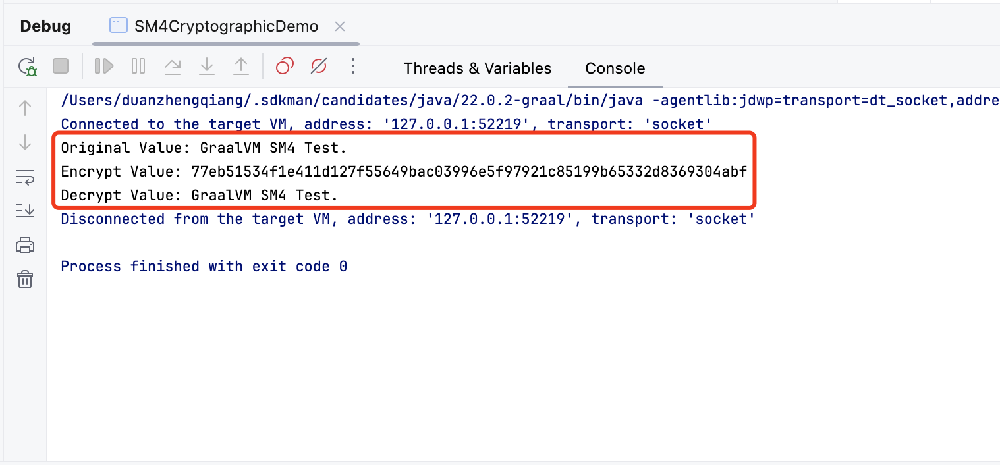
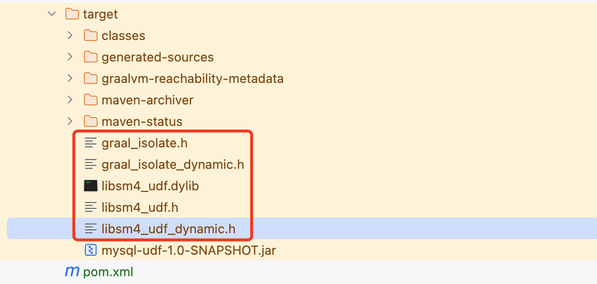
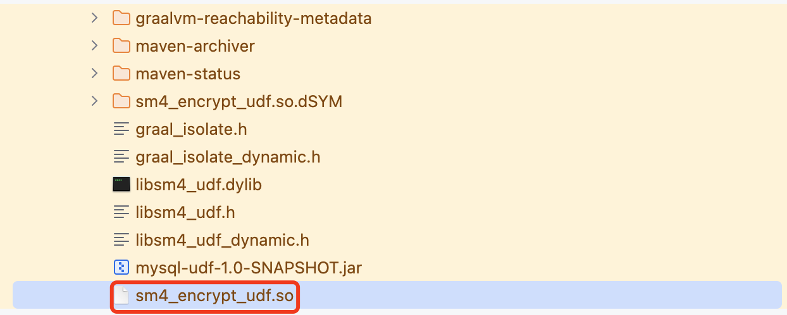
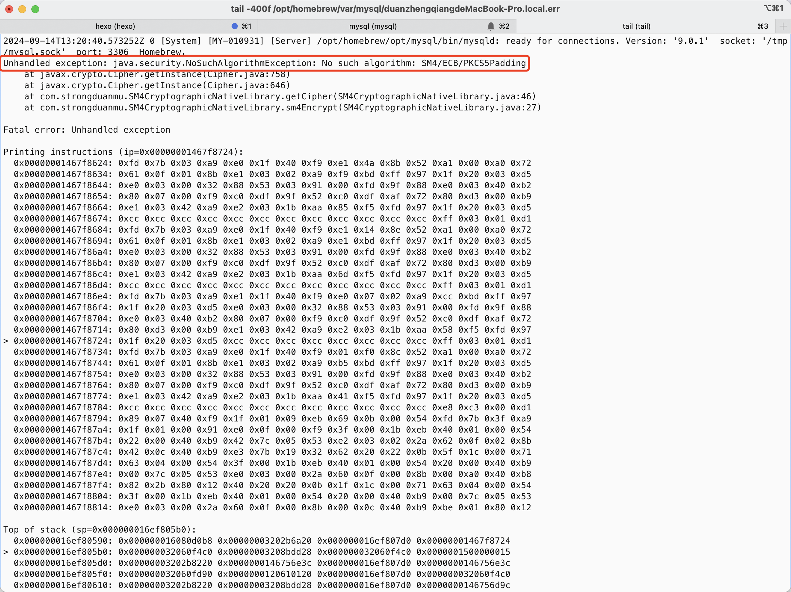

## 前言

在之前发布的 [Java AOT 编译框架 GraalVM 快速入门](https://strongduanmu.com/blog/java-aot-compiler-framework-graalvm-quick-start.html)一文中，我们介绍了 `GraalVM` 编译器的基础知识，对比了 GraalVM 和传统 JVM 之间的优势和劣势，并通过 Demo 示例展示了如何将 JVM 程序编译为原生可执行程序。GraalVM 除了编译原生可执行程序外，还可以用于编译动态链接库，提供给 `C`、`C++` 等原生语言调用，GraalVM 编译动态链接库的能力大大提升了 Java 和原生语言之间的互操作性。本文将为大家介绍如何使用 GraalVM 编译动态链接库，并使用 C 语言调用动态链接库，从而实现基于 `SM4` 加解密的 `MySQL UDF`。

## GraalVM 动态链接库规范

首先，我们来了解如何使用 GraalVM 编译动态链接库，参考官方文档 [Build a Native Shared Library](https://www.graalvm.org/latest/reference-manual/native-image/guides/build-native-shared-library/)，GraalVM 编译动态链接库，需要将 `--shared` 参数传递给 `native-image` 工具，默认会将 `main` 方法作为动态链接库的入口点方法，具体的编译命令如下：

```bash
# 指定 class name
native-image <class name> --shared
# 指定 jar 文件
native-image -jar <jarfile> --shared
```

如果类中不包含 `mian` 方法，则需要通过 `-o` 参数指定库名称，并且在 Java 类中通过 `@CEntryPoint` 注解，指定需要导出的入口点方法，使用 `-o` 参数指定库名称的命令如下：

```bash
native-image --shared -o <libraryname> <class name>
native-image --shared -jar <jarfile> -o <libraryname>
```

使用 `@CEntryPoint` 注解导出某个方法为动态链接库，需要满足以下条件：

* 方法必须声明为静态方法；
* 在要导出的方法上，使用 `@CEntryPoint` 注解进行标记；
* 方法参数需要增加额外的 `IsolateThread` 或 `Isolate` 类型参数，该参数用于提供当前线程的执行上下文；
* 方法返回类型只能是 Java 基础类型，以及 `org.graalvm.nativeimage.c.type` 包中的类型；
* 导出方法的名称必须保证唯一，否则 `native-image` 构建将会失败，如果未在 `@CEntryPoint` 注解中通过 `name` 指定名称，则必须在构建时提供 `-o <libraryName>` 选项。

下面展示了动态链接库入口方法示例，通过 `name` 指定了动态链接库函数名为 `add`，该函数有 3 个参数：`thread`、`a` 和 `b`，`thread` 用于提供当前线程的执行上下文，`a` 和 `b` 都是基础类型，因此可以直接使用在函数中。函数逻辑比较简单，将入参 `a` 和 `b` 的值相加求和，然后返回 `int` 类型的结果。

```java
@CEntryPoint(name = "add")
static int add(IsolateThread thread, int a, int b) {
    return a + b;
}
```

当我们使用 `native-image` 工具编译动态链接库时，它会生成一个动态链接库文件，以及一个 C 头文件，头文件中声明了导出的函数，可以直接在 C 代码中引入头文件，并调用 `add` 函数。

```c
int add(graal_isolatethread_t* thread, int a, int b);
```




## MySQL UDF 规范

介绍完 GraalVM 编译动态链接库，我们再来了解下 MySQL UDF 的使用规范。MySQL 8.0 官方文档 [Adding a Loadable Function](https://dev.mysql.com/doc/extending-mysql/8.0/en/adding-loadable-function.html) 详细介绍了如何使用 `C/C++` 编写 MySQL UDF，并将其编译为动态链接库部署到 MySQL `plugin` 目录中，然后通过 `CREATE FUNCTION ... RETURNS ... SONAME 'xxx.so'` 语句创建 UDF 函数。

编写 MySQL UDF 需要实现 3 个函数，分别是：初始化函数 `xxx_init()`、主函数 `xxx()` 和析构函数 `xxx_deinit()`。MySQL 会先调用 `xxx_init()` 进行初始化，如果 `xxx_init()` 返回异常，则主函数 `xxx()` 和析构函数 `xxx_deinit()` 都不会被调用，整个语句会抛出异常信息。如果 `xxx_init()` 执行成功，MySQL 会调用主函数 `xxx()` 执行函数逻辑，通常情况下每行数据都会调用一次。当所有数据行调用完主函数后，最后会调用 `xxx_deinit()` 对资源进行清理。

### xxx_init 函数

`xxx_init()` 函数是 MySQL UDF 的初始化函数，可以用来完成如下的初始化工作：

* 检查传入函数的参数个数；
* 检验传入函数的参数数据类型，是否可为空，以及对参数类型进行类型转换；
* 分配函数所需的内存；
* 指定返回值的最大长度；
* 指定返回值的精度（针对返回值是 `REAL` 类型的函数）；
* 指定返回值是否可以为 `NULL`。

初始化函数的声明如下：

```c
bool xxx_init(UDF_INIT *initid, UDF_ARGS *args, char *message);
```

`initid` 参数中存储了初始化信息，它会传递给 UDF 涉及的 3 个函数，`UDF_INIT` 结构包含如下成员：

* `bool maybe_null`：用于标识当前 UDF 函数是否可以返回 `NULL`，如果可以返回 `NULL`，则需要在初始化时设置成 `true`。如果函数中的任意参数设置了 `maybe_null` 为 `true`，则函数 `maybe_null` 的默认值也为 `true`；
* `unsigned int decimals`：指定小数点右侧的小数位数。默认值是传递给函数参数中最大的小数位数，例如，函数参数 `1.34`、`1.345` 和 `1.3`，则默认值为 3，因为 `1.345` 有 3 个小数数字。对于没有固定小数位数的参数，`decimals` 值设置为 31，这比 [`DECIMAL`](https://dev.mysql.com/doc/refman/8.0/en/fixed-point-types.html)、[`FLOAT`](https://dev.mysql.com/doc/refman/8.0/en/floating-point-types.html) 和 [`DOUBLE`](https://dev.mysql.com/doc/refman/8.0/en/floating-point-types.html) 数据类型允许的最大小数位数多 1；
* `unsigned int max_length`：指定返回值的最大长度。对于不同的返回值类型，`max_length` 的默认值不同，对于 `STRING` 类型，默认值和最长的函数参数相等。对于 `INTEGER` 类型， 默认值为 21。而对于 BLOB 类型的，可以将它设置成 65KB 或 16MB；
* `char *ptr`：可实现 UDF 特定需求的指针，一般在 `xxx_init()` 中申请内存，在 `xxx_deinit()` 中释放内存，例如：用来存储 UDF 函数过长（长度超过 255 个字符）的字符串结果，默认情况下 UDF 主函数中的 `result` 只能存储 255 个字符，超过 255 个字符需要自行通过 `ptr` 指针申请内存，用于存储字符串结果；

```c
initid -> ptr = allocated_memory;
```

* `bool const_item`：如果 `xxx()` 函数总是返回相同值，`xxx_init()` 中可以把该值设置成 true。

`args` 参数用于存储 UDF 函数的参数信息，`UDF_ARGS` 结构包含如下成员：

* `unsigned int arg_count`：UDF 函数参数个数，可以在 `xxx_init()` 函数中检查参数个数是否符合预期，例如：

```c
if (args -> arg_count != 2) {
    strcpy(message,"XXX() requires two arguments");
    return 1;
}
```

* `enum Item_result *arg_type`：用于定义参数类型的数组，可选值包括：`STRING_RESULT`、`INT_RESULT`、`REAL_RESULT` 和 `DECIMAL_RESULT`，可以在 `xxx_init` 函数中检查参数类型，也可以将 `arg_type` 元素设置为所需的类型，MySQL 在每次调用 `xxx` 函数时都会进行强制类型转换；

```c
// 类型检查
if (args -> arg_type[0] != STRING_RESULT || args -> arg_type[1] != INT_RESULT) {
    strcpy(message,"XXX() requires a string and an integer");
    return 1;
}

// 强制类型转换
args -> arg_type[0] = STRING_RESULT;
args -> arg_type[1] = INT_RESULT;
args -> arg_type[2] = REAL_RESULT;
```

* `char **args`：对于初始化函数 `xxx_init()`，当参数是常量时，例如：`3`、`4 * 7 - 2`  或 `SIN(3.14)`，`args -> args[i]` 指向参数值，当参数是非常量时 `args -> args[i]` 为 `NULL`。对于主函数 `xxx()`，`args -> args[i]` 总是指向参数的值，如果参数 `i` 为 `NULL`，则 `args -> args[i]` 为 `NULL`。对于 `STRING_RESULT` 类型，`args -> args[i]` 指向对应的字符串，`args -> lengths[i]` 代表字符串长度。对于 `INT_RESULT` 类型，需要强制转型为 `long long`，对于 `REAL_RESULT` 类型，需要转型为 `double`；

```c
// INT_RESULT 类型参数强转为 long long
long long int_val = *(long long *) args -> args[i];

// REAL_RESULT 类型参数强转为 double
double real_val = *(double *) args -> args[i];
```

* `unsigned long *lengths`：对于初始化函数 `xxx_init()`，`lengths` 数组表示每个参数的最大长度，对于主函数 `xxx()`，`lengths` 数组表示每个参数的实际长度；
* `char *maybe_null`：对于初始化函数 `xxx_init()`，`maybe_null` 表示对应的参数是否可以为 `NULL`；
* `char **attributes`：表示传入参数的参数名，参数名对应的长度存储在 `args -> attribute_lengths[i]` 中，以 `SELECT my_udf(expr1, expr2 AS alias1, expr3 alias2);` 为例，对应的参数名和参数名长度如下；

```c
args -> attributes[0] = "expr1"
args -> attribute_lengths[0] = 5

args -> attributes[1] = "alias1"
args -> attribute_lengths[1] = 6

args -> attributes[2] = "alias2"
args -> attribute_lengths[2] = 6
```

* `unsigned long *attribute_lengths`：表示传入参数名称的长度。

### xxx 函数

`xxx` 函数是 MySQL UDF 的主函数，在 SQL 中调用对应的 UDF 函数时，每行记录都会调用 `xxx` 函数，SQL 的数据类型和 `C/C++` 的数据类型对应关系如下，这些数据类型可以用于函数参数和返回值。

| SQL 类型                                                     | C/C++ 类型  |
| :----------------------------------------------------------- | :---------- |
| `STRING`                                                     | `char *`    |
| [`INTEGER`](https://dev.mysql.com/doc/refman/8.0/en/integer-types.html) | `long long` |
| [`REAL`](https://dev.mysql.com/doc/refman/8.0/en/floating-point-types.html) | `double`    |

> 注意：也可以声明 [`DECIMAL`](https://dev.mysql.com/doc/refman/8.0/en/fixed-point-types.html) 函数，但该值只能以字符串形式返回，因此你应该将函数编写为 `STRING` 函数。

对于不同的返回值类型，`xxx` 函数的定义不同，下面分别列举了返回值 `STRING`、`INTEGER` 和 `REAL` 类型的 UDF 函数定义：

```c
// 返回值是 STRING 或 DECIMAL
char *xxx(UDF_INIT *initid, UDF_ARGS *args, char *result, unsigned long *length, char *is_null, char *error);

// 返回值是 INTEGER
long long xxx(UDF_INIT *initid, UDF_ARGS *args, char *is_null, char *error);

// 返回值是 REAL
double xxx(UDF_INIT *initid, UDF_ARGS *args, char *is_null, char *error);
```

主函数 `xxx` 如果出现了异常，需要将 `*error` 设置为 `1`：

```c
*error = 1;
```

此时，MySQL 执行到主函数时，会直接返回 NULL 结果，并忽略后续的数据行。和 `xxx_init()` 初始化函数不同的是，`xxx` 函数无法通过 `message` 返回错误，只能返回 NULL 值，并通过 `fprintf` 函数将错误日志输出到 MySQL `ERROR` 日志中（**如果笔者理解错误，欢迎 MySQL 大佬指正**）。

### xxx_deinit 函数

`xxx_deinit()` 函数是 UDF 的析构函数，用于释放初始化函数分配的内存，以及进行其他的清理工作。`xxx_deinit()` 函数是可选的，如果 UDF 函数无需释放资源，则可以不实现该函数。 `xxx_deinit()` 函数的定义如下：

```c
void xxx_deinit(UDF_INIT *initid);
```

## GraalVM 实现 MySQL UDF 实战

前文我们已经介绍了如何使用 GraalVM 编译动态链接库，并了解了实现 MySQL UDF 的规范，下面我们通过一个实战案例，具体介绍下如何使用 GraalVM 实现基于 SM4 的加解密 UDF 函数。

### 基于 SM4 实现加解密

[SM4](https://zh.wikipedia.org/wiki/SM4) 加密算法是国家密码管理局于 2012 年发布的，它是一种分组加密算法，目前 SM4 系列算法已经广泛应用于国内的安全加密领域。由于 SM4 系列算法主要应用于国内，JDK 的标准库中并未提供支持，因此我们需要通过第三方库 [BouncyCastle](https://www.bouncycastle.org/) 来实现 SM4 加解密。

使用 BouncyCastle 比较简单，首先需要在项目中依赖 BouncyCastle 库的 jar 包，我们可以通过如下的 Maven 坐标进行依赖：

```xml
<dependency>
    <groupId>org.bouncycastle</groupId>
    <artifactId>bcprov-jdk18on</artifactId>
    <version>1.78.1</version>
</dependency>
```

然后借助 `java.security` 提供的扩展机制，使用 `Security.addProvider(new BouncyCastleProvider());` 注册 `BouncyCastle` 提供器。下面展示了一个简单的 SM4 算法加解密示例，通过 `Cipher.getInstance("SM4/ECB/PKCS5Padding"` 可以获取一个采用 `ECB` 模式的 `SM4` 算法，然后调用 `init` 方法分别对加密和解密模式进行初始化，最后调用 `doFinal` 方法执行加密和解密的逻辑。

```java
public final class SM4CryptographicDemo {
    
    @SneakyThrows
    public static void main(String[] args) {
        // 注册 BouncyCastle
        Security.addProvider(new BouncyCastleProvider());
        byte[] securityKey = Hex.decodeHex("4D744E003D713D054E7E407C350E447E");
        String originalValue = "GraalVM SM4 Test.";
        System.out.println("Original Value: " + originalValue);
        // 加密处理
        Cipher encryptCipher = Cipher.getInstance("SM4/ECB/PKCS5Padding", BouncyCastleProvider.PROVIDER_NAME);
        encryptCipher.init(Cipher.ENCRYPT_MODE, new SecretKeySpec(securityKey, "SM4"));
        String encryptValue = Hex.encodeHexString((encryptCipher.doFinal(originalValue.getBytes())));
        System.out.println("Encrypt Value: " + encryptValue);
        // 解密处理
        Cipher decryptCipher = Cipher.getInstance("SM4/ECB/PKCS5Padding", BouncyCastleProvider.PROVIDER_NAME);
        decryptCipher.init(Cipher.DECRYPT_MODE, new SecretKeySpec(securityKey, "SM4"));
        String decryptValue = new String((decryptCipher.doFinal(Hex.decodeHex(encryptValue))));
        System.out.println("Decrypt Value: " + decryptValue);
    }
}
```

SM4 算法加密和解密的执行结果如下图：



### 编译 SM4 加解密动态链接库

使用 BouncyCastle 库实现基础的 SM4 加密和解密后，我们尝试使用 GraalVM 来编译一个动态链接库。根据前文的介绍，GraalVM 编译动态链接库需要通过 `@CEntryPoint` 注解，由于我们需要实现加密和解密两个函数，因此需要分别定义加密和解密方法，并使用 `@CEntryPoint` 进行标记。如下的 `SM4CryptographicNativeLibrary` 类，展示了 SM4 加密和解密动态链接库的逻辑：

```java
@SuppressWarnings("unused")
public final class SM4CryptographicNativeLibrary {
    
    static {
        // 注册 BouncyCastle
        Security.addProvider(new BouncyCastleProvider());
    }
    
    @SneakyThrows
    @CEntryPoint(name = "sm4_encrypt")
    private static CCharPointer sm4Encrypt(final IsolateThread thread, final CCharPointer plainValue, final CCharPointer cipherValue) {
        String encryptValue = Hex.encodeHexString(getCipher(Cipher.ENCRYPT_MODE).doFinal(CTypeConversion.toJavaString(plainValue).getBytes()));
        // C 语言中会在字符串结尾自动添加 \0 转义符，所以这里需要 +1
        int encryptValueLength = encryptValue.getBytes().length + 1;
        CTypeConversion.toCString(encryptValue, cipherValue, WordFactory.unsigned(encryptValueLength));
        return cipherValue;
    }
    
    @SneakyThrows
    @CEntryPoint(name = "sm4_decrypt")
    private static CCharPointer sm4Decrypt(final IsolateThread thread, final CCharPointer cipherValue, final CCharPointer plainValue) {
        String decryptValue = new String(getCipher(Cipher.DECRYPT_MODE).doFinal(Hex.decodeHex(CTypeConversion.toJavaString(cipherValue))));
        // C 语言中会在字符串结尾自动添加 \0 转义符，所以这里需要 +1
        int decryptValueLength = decryptValue.getBytes().length + 1;
        CTypeConversion.toCString(decryptValue, plainValue, WordFactory.unsigned(decryptValueLength));
        return plainValue;
    }
    
    @SneakyThrows
    private static Cipher getCipher(final int cipherMode) {
        Cipher result = Cipher.getInstance("SM4/ECB/PKCS5Padding", BouncyCastleProvider.PROVIDER_NAME);
        result.init(cipherMode, new SecretKeySpec(Hex.decodeHex("4D744E003D713D054E7E407C350E447E"), "SM4"));
        return result;
    }
}
```

首先，`SM4CryptographicNativeLibrary` 类 `static` 静态代码块中注册 `BouncyCastle`，从而保证 `java.security` 扩展机制能够识别到 BouncyCastle。然后在类中我们定义了 `sm4Encrypt` 和 `sm4Decrypt` 两个方法，并使用 `@CEntryPoint` 进行了方法导出，分别命名为 `sm4_encrypt` 和 `sm4_decrypt`。方法内部会调用 `getCipher` 获取 `SM4` 加解密方法，并通过 GraalVM 提供的 `CTypeConversion.toCString()` 方法，将加密、解密后的结果存储到 `CCharPointer` 类型的缓冲区对象中，存储到缓冲区过程中需要指定 `bufferSize`，由于 C 语言中会在字符串结尾自动添加 `\0` 转义符，所以这里需要 `+1` 处理。

我们执行如下的命令进行编译：

```bash
./mvnw -Pnative clean package -f mysql-udf
```

编译成功后，`target` 目录下会生成动态链接库 `libsm4_udf.dylib`，以及头文件 `libsm4_udf.h`，后续我们可以使用 C 语言编写 MySQL UDF，并调用 GraalVM 生成的动态链接库。



### 使用 C 实现 MySQL UDF

根据前文介绍我们知道，使用 C/C++ 编写 MySQL UDF，需要实现 `xxx_init`、`xxx` 和 `xxx_deinit` 3 个函数，其中 `xxx_init` 和 `init` 函数是必须实现的，而 `xxx_deinit` 则是可选的，如果没有资源需要释放，则可以不实现。笔者由于水平有限，简单使用 C 语言实现了 `sm4_encrypt_udf` 和 `sm4_decrypt_udf` 两个函数，分别用于 SM4 加密和解密操作。`thread` 对象的创建参考了 [GraalVM 动态链接库文档](https://www.graalvm.org/latest/reference-manual/native-image/guides/build-native-shared-library/)，需要在调用动态链接库函数时传入 thread 参数，并且在最后通过 `graal_tear_down_isolate` 函数清理 thread 对象。

```c
#include <stdio.h>
#include <string.h>

#include "mysql.h"
#include "libsm4_udf.h"

bool sm4_encrypt_udf_init(UDF_INIT *initid, UDF_ARGS *args, char *message) {
    return false;
}

char * sm4_encrypt_udf(UDF_INIT *initid, UDF_ARGS *args, char *result, unsigned long *length, char *is_null, char *error) {
    graal_isolate_t *isolate = NULL;
    graal_isolatethread_t *thread = NULL;
    if (0 != graal_create_isolate(NULL, &isolate, &thread)) {
        fprintf(stderr, "initialization error\n" );
        return "";
    }
    sm4_encrypt(thread, args -> args[0], result);
    *length = strlen(result);
    graal_tear_down_isolate(thread);
    return result;
}

bool sm4_decrypt_udf_init(UDF_INIT *initid, UDF_ARGS *args, char *message) {
    return false;
}

char * sm4_decrypt_udf(UDF_INIT *initid, UDF_ARGS *args, char *result, unsigned long *length, char *is_null, char *error) {
    graal_isolate_t *isolate = NULL;
    graal_isolatethread_t *thread = NULL;
    if (0 != graal_create_isolate(NULL, &isolate, &thread)) {
        fprintf(stderr, "initialization error\n" );
        return "";
    }
    sm4_decrypt(thread, args -> args[0], result);
    *length = strlen(result);
    graal_tear_down_isolate(thread);
    return result;
}
```

我们尝试使用 `GCC` 工具将 C 源码编译为动态链接库，通过 `-I` 指定编译时头文件位置，`-L/path/to` 用于指定编译时库文件的位置，`-l` 则用于指定库的名称，通常库名称不包含前面的 lib 前缀。`-Wl,-rpath=/path/to` 指定了运行时的库搜索路径，经笔者测试 MacOS 指定该参数会编译报错，Linux 下不指定该参数，运行时会找不到依赖库报错（具体原因有待进一步探索）。`-shared` 表示当前编译结果是动态链接库，`-o` 指定的输出的位置及动态链接库名称，最后则指定了 C 源码的位置。

```bash
# -I 指定编译时头文件位置
# -L/path/to 指定编译时库文件的位置
# -Wl,-rpath=/path/to 指定了运行时的库搜索路径（MacOS 指定会编译报错，Linux 下需要指定）
gcc -I/opt/homebrew/opt/mysql/include/mysql -I./mysql-udf/target -L./mysql-udf/target -lsm4_udf -fPIC -g -shared -o ./mysql-udf/target/sm4_encrypt_udf.so ./mysql-udf/src/main/native/sm4_encrypt_udf.c
```

编译完成后，我们在 `target` 目录中可以看到 `sm4_encrypt_udf.so` 文件，这个就是我们需要的 MySQL UDF 动态链接库。



使用如下的命令将 `libsm4_udf.dylib` 和 `sm4_encrypt_udf.so` 库复制到 MySQL `/lib/plugin` 目录下：

```bash
cp mysql-udf/target/libsm4_udf.dylib /opt/homebrew/opt/mysql/lib/plugin/
cp mysql-udf/target/sm4_encrypt_udf.so /opt/homebrew/opt/mysql/lib/plugin/
```

然后执行 `CREATE FUNCTION` 语句，创建 `sm4_encrypt_udf` 和 `sm4_decrypt_udf`  函数。

```sql
CREATE FUNCTION sm4_encrypt_udf RETURNS STRING SONAME 'sm4_encrypt_udf.so';
CREATE FUNCTION sm4_decrypt_udf RETURNS STRING SONAME 'sm4_encrypt_udf.so';
```

我们使用 `SELECT sm4_encrypt_udf('123');` 测试 UDF 查询语句，但是出现了如下的异常信息，MySQL 服务由于 UDF 函数异常出现了重启。

```
mysql>  SELECT sm4_encrypt_udf('123');
No connection. Trying to reconnect...
Connection id:    8
Current database: test

ERROR 2013 (HY000): Lost connection to MySQL server during query
No connection. Trying to reconnect...
ERROR 2003 (HY000): Can't connect to MySQL server on '127.0.0.1:3306' (61)
ERROR:
Can't connect to the server
```

为了搞清楚异常的原因，我们使用 `tail -400f /opt/homebrew/var/mysql/duanzhengqiangdeMacBook-Pro.local.err` 命令查看 `MySQL Error` 日志。如下展示了完整的异常信息，可以看出 GraalVM 生成的动态链接库没有找到 `SM4/ECB/PKCS5Padding` 算法，异常的根本原因是 GraalVM 只能在编译期注册 `Security Provider`，无法在运行期注册，因此我们需要手动注册 `Security Provider`。



参考[从零放弃学习 Spring - 在 Native Image 中使用 Bouncy Castle](https://vizee.org/2023/08/02/bouncy-castle-on-native-image/)，可以使用 GraalVM 的 Feature 机制注册 `BouncyCastleProvider`，我们编写如下的 `SM4BouncyCastleFeature` 类，实现 `org.graalvm.nativeimage.hosted.Feature` 接口，并通过 `RuntimeClassInitialization` 初始化 `org.bouncycastle` 相关的动态类。

```java
@SuppressWarnings("unused")
public final class SM4BouncyCastleFeature implements Feature {
    
    @Override
    public void afterRegistration(final AfterRegistrationAccess access) {
        RuntimeClassInitialization.initializeAtBuildTime("org.bouncycastle");
        RuntimeClassInitialization.initializeAtRunTime("org.bouncycastle.jcajce.provider.drbg.DRBG$Default");
        RuntimeClassInitialization.initializeAtRunTime("org.bouncycastle.jcajce.provider.drbg.DRBG$NonceAndIV");
        Security.addProvider(new BouncyCastleProvider());
    }
}
```

然后将 `SM4BouncyCastleFeature` 类路径配置到 `native-maven-plugin` 插件的 `buildArgs` 中，完整配置为 `--features=com.strongduanmu.SM4BouncyCastleFeature`。

```xml
<build>
    <plugins>
        <plugin>
            <groupId>org.graalvm.buildtools</groupId>
            <artifactId>native-maven-plugin</artifactId>
            <version>${native.maven.plugin.version}</version>
            <extensions>true</extensions>
            <configuration>
                <imageName>${native.image.name}</imageName>
                <buildArgs>
                    <buildArg>--no-fallback</buildArg>
                    <buildArg>--features=com.strongduanmu.SM4BouncyCastleFeature</buildArg>
                </buildArgs>
                <sharedLibrary>true</sharedLibrary>
            </configuration>
            <executions>
                <execution>
                    <id>build-native</id>
                    <goals>
                        <goal>compile-no-fork</goal>
                    </goals>
                    <phase>package</phase>
                </execution>
                <execution>
                    <id>test-native</id>
                    <goals>
                        <goal>test</goal>
                    </goals>
                    <phase>test</phase>
                </execution>
            </executions>
        </plugin>
    </plugins>
</build>
```

然后执行 `./mvnw -Pnative clean package -f mysql-udf` 以及 `gcc -I/opt/homebrew/opt/mysql/include/mysql -I./mysql-udf/target -L./mysql-udf/target -lsm4_udf -fPIC -g -shared -o ./mysql-udf/target/sm4_encrypt_udf.so ./mysql-udf/src/main/native/sm4_encrypt_udf.c` 重新编译生成动态链接库，打包完成后将动态链接库复制到 `/opt/homebrew/opt/mysql/lib/plugin/` 目录下，并使用 `brew services restart mysql` 重启 MySQL 服务。

重启完成后，执行以下的 SQL 脚本，删除之前创建的 UDF 函数，并重新创建新的 UDF：

```sql
# 删除已创建 UDF
DROP FUNCTION sm4_encrypt_udf;
DROP FUNCTION sm4_decrypt_udf;

# 重新创建 UDF
CREATE FUNCTION sm4_encrypt_udf RETURNS STRING SONAME 'sm4_encrypt_udf.so';
CREATE FUNCTION sm4_decrypt_udf RETURNS STRING SONAME 'sm4_encrypt_udf.so';
```

然后我们再次测试 SM4 UDF 加解密功能，可以看到现在加密和解密都能够完美支持，完整的示例程序请参考 [mysql-udf](https://github.com/strongduanmu/graalvm-lecture/tree/main/mysql-udf)。

```sql
mysql> SELECT sm4_encrypt_udf('123');
+----------------------------------+
| sm4_encrypt_udf('123')           |
+----------------------------------+
| 2e5d924b4e9f26831c5cbcb087bd3439 |
+----------------------------------+
1 row in set (0.00 sec)

mysql> SELECT sm4_decrypt_udf('2e5d924b4e9f26831c5cbcb087bd3439');
+-----------------------------------------------------+
| sm4_decrypt_udf('2e5d924b4e9f26831c5cbcb087bd3439') |
+-----------------------------------------------------+
| 123                                                 |
+-----------------------------------------------------+
1 row in set (0.01 sec)
```

## 结语

本文首先介绍了如何使用 GraalVM 编译动态链接库，需要在 GraalVM 编译时增加 `--shared` 参数，并将需要导出的动态链接库方法，使用 `@CEntryPoint` 注解进行标记，方法参数中需要增加额外的 `IsolateThread` 或 `Isolate` 参数，用于提供当前线程的执行上下文。

然后又结合 MySQL 官方文档，为大家介绍了 MySQL UDF 函数的实现规范，UDF 函数中通常包含了 `xxx_init()`、`xxx()` 和 `xxx_deinit()` 3 个主要函数，大家可以结合 UDF 函数的逻辑需要，在不同的函数中进行参数校验、UDF 逻辑实现等处理。

最后一个部分，我们使用 GraalVM 实现了一个基于 SM4 国密算法的加解密 UDF，核心的算法逻辑部分使用 GraalVM 编译，MySQL UDF 部分使用 C 语言实现，并调用 GraalVM 编译的动态链接库，最终我们完美地实现了加密和解密功能。

**GraalVM 为 Java 生态带来了全新的应用场景，如何使用 GraalVM 将 Java 生态连接到原生应用中，这些都需要大家不断地思考和探索，欢迎大家积极留言交流 GraalVM 应用场景**。另外，由于笔者水平有限，本文如有问题，也欢迎留言指正。




欢迎关注「**端小强的博客**」微信公众号，会不定期分享日常学习和工作经验，欢迎大家关注交流。


