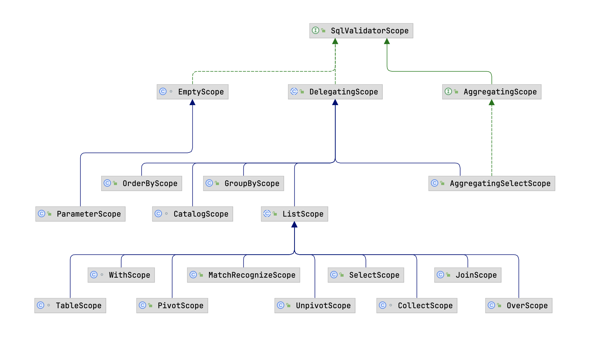
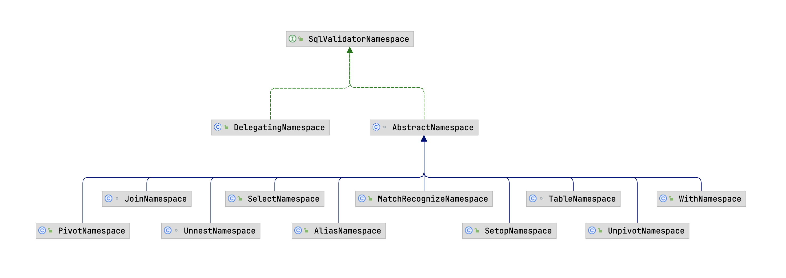

> 注意：本文基于 [Calcite 1.35.0](https://github.com/apache/calcite/tree/75750b78b5ac692caa654f506fc1515d4d3991d6) 版本源码进行学习研究，其他版本可能会存在实现逻辑差异，对源码感兴趣的读者**请注意版本选择**。

## 前言

在上一篇 [Apache Calcite System Catalog 实现探究](https://strongduanmu.com/blog/explore-apache-calcite-system-catalog-implementation.html)中，我们介绍了经典的数据库的处理流程，包括：`SQL 解析`、`SQL 绑定`、`SQL 优化`以及`计划执行`。SQL 绑定主要的作用是将 SQL 解析生成的 AST 和数据库的元数据进行绑定，从而生成具有语义的 AST。SQL 绑定会通过自底向上的方式遍历 AST，对抽象语法树中的节点进行绑定分析，绑定的过程中会将表、列等元数据附在语法树上，最后生成具有语义的语法树 `Bounded AST`。

Calcite 通过 SQL 校验器实现 SQL 绑定，SQL 校验器所需的 System Catalog 信息，我们在上篇文章已经做了详细的介绍，感兴趣的读者可以阅读回顾相关内容。本文将重点介绍 Calcite SQL 校验器的整体设计，梳理校验器中不同类的用途，然后通过具体案例来展示 SQL 校验器的整体流程，并对流程中的关键方法进行代码级别的分析，力求让大家能够深刻理解 Calcite 的 SQL 校验器。

## SQL 校验器整体设计

SQL 校验器的核心类为 `SqlValidator`，它负责使用 Calcite 元数据信息对 AST 进行验证，最终生成具有语义信息的 AST。在 Calcite 中，可以通过 `SqlValidatorUtil.newValidator` 方法快速创建一个 SqlValidator。

除了 SqlValidator 校验器类之外，Calcite 为了将 SQL 中的名称解析为对象，还在校验器内部构建了两个对象：`SqlValidatorScope` 和 `SqlValidatorNamespace`，SqlValidatorScope 表示名称解析的范围，代表了在查询中的某一个位置，当前可见的字段名和表名。`SqlValidatorNamespace` 则表示了校验过程中查询语句的数据来源，不同的查询位置都有不同类型的 namespace 类，例如：表名对应的 `IdentifierNamespace`，Select 语句对应的 `SelectNamespace`，以及 `UNION`、`EXCEPT`、`INTERSECT` 对应的 `SetopNamespace`。下面我们针对核心的 SqlValidator、SqlValidatorScope 和 SqlValidatorNamespace 分别进行探究，了解其设计细节以及适用场景。

### SqlValidator

`SqlValidator` 校验器根据元数据对 SQL 解析的 AST 进行校验，得到具有语义信息的绑定 AST。SqlValidator 通过访问者模式对 AST 进行校验，调用 `SqlNode#validate` 方法时，校验器内部会调用 validateXxx 方法，例如：调用 `SqlLiteral.validate(SqlValidator, SqlValidatorScope)` 会调用 `validateLiteral(SqlLiteral);` ，调用 `SqlCall.validate(SqlValidator, SqlValidatorScope)` 则会调用 `validCall(SqlCall, SqlValidatorScope);`。

SqlValidator 接口定义了 Calcite 校验器的主要方法，它提供了基础的 `getCatalogReader` 和 `getOperatorTable` 方法，分别用于获取元数据信息和运算符、函数。校验 SqlNode 则是通过 `validate` 方法，会按照 AST 结构进行遍历校验，最终返回已校验 SqlNode。

```java
public interface SqlValidator {
  	
  	// 获取校验器使用的 CatalogReader，用于获取元数据信息
    SqlValidatorCatalogReader getCatalogReader();

  	// 获取校验器使用的 SqlOperatorTable，用于获取运算符和函数
    SqlOperatorTable getOperatorTable();

  	// 校验 SqlNode 对应的表达式树，返回已校验的树
    SqlNode validate(SqlNode topNode);

  	// 获取已验证节点的类型
    RelDataType getValidatedNodeType(SqlNode node);

  	// 获取 SqlNode 所属的 Namespace
    SqlValidatorNamespace getNamespace(SqlNode node);

  	// 展开 * 号对应的列
    SqlNodeList expandStar(SqlNodeList selectList, SqlSelect query, boolean includeSystemVars);

    // 展开 order by 子句中的序号和别名列
    SqlNode expandOrderExpr(SqlSelect select, SqlNode orderExpr);

  	// 返回 SqlNode 结果集列的原始类型，该类型中包含 catalog, schema, table, column
    List<@Nullable List<String>> getFieldOrigins(SqlNode sqlQuery);
}
```

此外，为了对 SqlValidator 校验过程中的一些行为进行控制，Calcite 提供了 `SqlValidator#Config` 配置类，通过 `withXxx` 方法可以方便地设置校验器的属性，常见的属性设置方法如下，`withDefaultNullCollation` 可以设置 NULL 值排序规则，`withColumnReferenceExpansion` 则可以用于指定 `Order By` 语句中的列引用是否展开，`withConformance` 方法用于设置 SQL 兼容模式。

```java
interface Config {

  	// 默认 SqlValidator 配置类
    SqlValidator.Config DEFAULT = ImmutableSqlValidator.Config.builder().withTypeCoercionFactory(TypeCoercions::createTypeCoercion).build();
		
  	// 配置默认 NULL 值排序规则
    Config withDefaultNullCollation(NullCollation nullCollation);

  	// 配置列引用是否展开
    Config withColumnReferenceExpansion(boolean expand);

  	// 配置 SQL 兼容模式
    Config withConformance(SqlConformance conformance);
}
```

### SqlValidatorScope

`SqlValidatorScope` 主要用于声明校验过程中**名称解析的范围**，Calcite 对 `SqlValidatorScope` 的具体描述为 `A SqlValidatorScope describes the tables and columns accessible at a particular point in the query`，即：SqlValidatorScope 描述了查询中的某个具体位置可以访问的表和列。

Calcite 根据不同的 SQL 类型实现了众多 SqlValidatorScope 子类，以满足不同场景下的 SQL 校验需求，SqlValidatorScope 继承体系如下：



`SelectScope` 表示查询语句的名称解析范围，该范围中可见的对象包含了 FROM 子句的对象以及从父节点继承的对象。如下展示了一个常见的查询语句，该语句中包含了关联查询、子查询以及排序。

```sql
SELECT expr1
  FROM t1,
      t2,
      (SELECT expr2 FROM t3) AS q3
  WHERE c1 IN (SELECT expr3 FROM t4)
  ORDER BY expr4
```

Calcite 会将该语句拆分为 4 个 SelectScope 分别表示不同表达式对象的可见范围。

* `expr1` 可以访问 `t1, t2, q3` 中的对象；
* `expr2` 可以访问 `t3` 中的对象；
* `expr3` 可以访问 `t4, t1, t2` 中的对象（实际测试 MySQL，`expr3` 同样可以访问 `q3` 临时表）；
* `expr4` 可以访问 `t1, t2, q3`, 以及在 SELECT 子句中定义的任何列别名（取决于方言）。

### SqlValidatorNamespace

`SqlValidatorNamespace` 描述了由 SQL 查询某个部分返回的关系（`Relation`，关系是一组无序的元素或记录，这些元素或记录的属性用来表示实体），例如：在查询 `SELECT emp.deptno, age FROM emp, dept` 时，FROM 子句形成了一个包含 `emp` 和 `dept` 两张表，以及这些表中列组成的行类型在内的命名空间。不同的 RelNode 类型有与之对应的 Namespace 对象，下图展示了 Calcite 中定义的常见 SqlValidatorNamespace 实现类。



`SelectNamespace` 表示了查询语句对应的命名空间，我们同样以如下的查询语句为例：

```sql
SELECT expr1
  FROM t1,
      t2,
      (SELECT expr2 FROM t3) AS q3
  WHERE c1 IN (SELECT expr3 FROM t4)
  ORDER BY expr4
```

Calcite 会从查询语句中提取出 4 个命名空间，分别如下所示，命名空间代表的关系，简单理解可以认为是查询过程中的数据来源。

* `t1`：t1 表所代表的关系；
* `t2`：t2 表所代表的关系；
* `(SELECT expr2 FROM t3) AS q3`：子查询所代表的关系；
* `(SELECT expr3 FROM t4)`：子查询所代表的关系。

## SQL 校验器执行流程

前文我们对 Caclite 校验器中核心的 SqlValidator、SqlValidatorScope 和 SqlValidatorNamespace 类进行了介绍，想必大家对校验器有了一些基础的认识。本节我们通过如下所示的 `CsvTest#testPushDownProjectAggregateNested` 单测，来跟踪下 SQL 校验器的执行流程，该示例 SQL 中包含了常用的子查询、聚合查询以及 `MAX` 和 `COUNT` 聚合函数，可以帮助大家了解这些核心类在校验流程中是如何使用的。

```sql
final String sql = "explain plan " + extra + " for\n" 
        + "select gender, max(qty)\n"
        + "from (\n"
        + "  select name, gender, count(*) qty\n"
        + "  from EMPS\n"
        + "  group by name, gender) t\n"
        + "group by gender";
```

### SqlValidator 初始化

首先，会初始化 SqlValidator 对象，初始化时会将校验器所需的 SqlOperatorTable 和 SqlValidatorCatalogReader 等对象传入进来，SqlOperatorTable 用于查找 SQL 运算符和函数，SqlValidatorCatalogReader 则用于校验时查找元数据信息。此外，初始化时还会创建不同的 AggFinder 对象，用于后续从 AST 中提取不同的聚合函数，以及创建 TypeCoercion 类型转换类，它主要用于 SQL 中可能存在的隐式类型转换。

```java
protected SqlValidatorImpl(SqlOperatorTable opTab, SqlValidatorCatalogReader catalogReader, RelDataTypeFactory typeFactory, Config config) {
    // 初始化 SqlOperatorTable，用于查找 SQL 运算符和函数
    this.opTab = requireNonNull(opTab, "opTab");
    // 用于查找元数据信息
    this.catalogReader = requireNonNull(catalogReader, "catalogReader");
    this.typeFactory = requireNonNull(typeFactory, "typeFactory");
    final RelDataTypeSystem typeSystem = typeFactory.getTypeSystem();
    // 获取类型系统中的时间框架集合
    this.timeFrameSet = requireNonNull(typeSystem.deriveTimeFrameSet(TimeFrames.CORE), "timeFrameSet");
    this.config = requireNonNull(config, "config");

    // It is assumed that unknown type is nullable by default
    unknownType = typeFactory.createTypeWithNullability(typeFactory.createUnknownType(), true);
    booleanType = typeFactory.createSqlType(SqlTypeName.BOOLEAN);

    final SqlNameMatcher nameMatcher = catalogReader.nameMatcher();
    // 初始化 AggFinder，用于从 AST 中遍历获取不同的聚合函数
    aggFinder = new AggFinder(opTab, false, true, false, null, nameMatcher);
    aggOrOverFinder = new AggFinder(opTab, true, true, false, null, nameMatcher);
    overFinder = new AggFinder(opTab, true, false, false, aggOrOverFinder, nameMatcher);
    groupFinder = new AggFinder(opTab, false, false, true, null, nameMatcher);
    aggOrOverOrGroupFinder = new AggFinder(opTab, true, true, true, null, nameMatcher);
    // 初始化类型转换类，用于隐式类型转换
    TypeCoercion typeCoercion = config.typeCoercionFactory().create(typeFactory, this);
    this.typeCoercion = typeCoercion;
    ...
}
```

### validate 流程

介绍完 SqlValidator 初始化逻辑，我们再来深入探究下校验器的核心逻辑 `validate` 方法，其实现逻辑如下。首先会创建用于 root 节点校验的 EmptyScope，并将 EmptyScope 作为 CatalogScope 的父类，CatalogScope 可以查看所有 Schema 中的元数据，在校验过程中能够帮助对 `schema.table.column` 进行列解析。

```java
@Override
public SqlNode validate(SqlNode topNode) {
  	// 创建 EmptyScope 用于 root 节点校验
    SqlValidatorScope scope = new EmptyScope(this);
  	// CatalogScope 可以查看所有 Schema 中的元数据，它的父类是 EmptyScope
    scope = new CatalogScope(scope, ImmutableList.of("CATALOG"));
  	// 校验名称解析范围内的表达式
    final SqlNode topNode2 = validateScopedExpression(topNode, scope);
  	// 获取校验后的节点类型
    final RelDataType type = getValidatedNodeType(topNode2);
    Util.discard(type);
    return topNode2;
}
```

然后会调用 `validateScopedExpression` 进行校验，这部分是 SQL 校验器的核心逻辑。下面展示了该方法的代码实现，内部依次调用了 `performUnconditionalRewrites`、`registerQuery`、`validate` 和 `deriveType` 方法，我们将对这些方法内部实现细节进行深入探究。

```java
private SqlNode validateScopedExpression(SqlNode topNode, SqlValidatorScope scope) {
  	// 重写 SqlNode 进行标准化，以方便后续的逻辑计划优化
    SqlNode outermostNode = performUnconditionalRewrites(topNode, false);
    cursorSet.add(outermostNode);
    top = outermostNode;
    if (outermostNode.isA(SqlKind.TOP_LEVEL)) {
      	// 注册 Scope 和 Namespace
        registerQuery(scope, null, outermostNode, outermostNode, null, false);
    }
  	// 校验 SqlNode
    outermostNode.validate(this, scope);
    if (!outermostNode.isA(SqlKind.TOP_LEVEL)) {
        // 推断类型
        deriveType(scope, outermostNode);
    }
    return outermostNode;
}
```

#### performUnconditionalRewrites

首先，我们来探究下 `performUnconditionalRewrites` 的内部实现逻辑，它主要用于 SqlNode 重写标准化，从而方便后续的逻辑计划优化。首先，方法内部会判断当前 SqlNode 的类型，根据 `SqlCall` 和 `SqlNodeList` 分别进行处理。Calcite SqlNode 体系我们之前在 [Apache Calcite SQL Parser 原理剖析](https://strongduanmu.com/blog/implementation-principle-of-apache-calcite-sql-parser.html#calcite-sqlnode-%E4%BD%93%E7%B3%BB-sql-%E7%94%9F%E6%88%90)中已经进行了详细介绍，不熟悉的朋友可以阅读下这篇文章。

如果当前 SqlNode 是 SqlCall（SqlCall 代表了对 SqlOperator 的调用，Calcite 中每个操作都可以对应一个 SqlCall，例如查询操作是 SqlSelectOperator，对应的 SqlNode 是 `SqlSelect`），则会获取 SqlCall 对应的 `SqlKind` 和 `OperandList`。SqlKind 是一个枚举类，表示了 SqlNode 对应的类型，常用的类型有：SELECT、INSERT、ORDER_BY、WITH 等，更多类型可以查看 [SqlKind 源码](https://github.com/apache/calcite/blob/fb6f43192c4253caea63c0705067a9aa12a3fa74/core/src/main/java/org/apache/calcite/sql/SqlKind.java#L81)。

TODO

```java
// 判断当前 SqlNode 是否为 SqlCall
if (node instanceof SqlCall) {
...
    SqlCall call = (SqlCall) node;
    // 获取 SqlKind 类型
    final SqlKind kind = call.getKind();
    // 获取 SqlNode 中包含的运算符
    final List<SqlNode> operands = call.getOperandList();
    for (int i = 0; i < operands.size(); i++) {
        SqlNode operand = operands.get(i);
        boolean childUnderFrom;
        if (kind == SqlKind.SELECT) {
            childUnderFrom = i == SqlSelect.FROM_OPERAND;
        } else if (kind == SqlKind.AS && (i == 0)) {
            // for an aliased expression, it is under FROM if
            // the AS expression is under FROM
            childUnderFrom = underFrom;
        } else {
            childUnderFrom = false;
        }
        SqlNode newOperand = performUnconditionalRewrites(operand, childUnderFrom);
        if (newOperand != null && newOperand != operand) {
            call.setOperand(i, newOperand);
        }
    }

    if (call.getOperator() instanceof SqlUnresolvedFunction) {
        assert call instanceof SqlBasicCall;
        final SqlUnresolvedFunction function = (SqlUnresolvedFunction) call.getOperator();
        // This function hasn't been resolved yet.  Perform
        // a half-hearted resolution now in case it's a
        // builtin function requiring special casing.  If it's
        // not, we'll handle it later during overload resolution.
        final List<SqlOperator> overloads = new ArrayList<>();
        opTab.lookupOperatorOverloads(function.getNameAsId(), function.getFunctionType(), SqlSyntax.FUNCTION, overloads, catalogReader.nameMatcher());
        if (overloads.size() == 1) {
            ((SqlBasicCall) call).setOperator(overloads.get(0));
        }
    }
    if (config.callRewrite()) {
        node = call.getOperator().rewriteCall(this, call);
    }
}
```

如果 SqlNode 是否为 SqlNodeList，则会遍历其中的 SqlNode，并调用 performUnconditionalRewrites，然后将新的 SqlNode 设置到 SqlNodeList 中。

```java
// 判断当前 SqlNode 是否为 SqlNodeList
} else if (node instanceof SqlNodeList) {
    // SqlNodeList 会遍历其中的 SqlNode 并调用 performUnconditionalRewrites，并将新的 SqlNode 设置到 SqlNodeList 中
    final SqlNodeList list = (SqlNodeList) node;
    for (int i = 0; i < list.size(); i++) {
        SqlNode operand = list.get(i);
        SqlNode newOperand = performUnconditionalRewrites(operand, false);
        if (newOperand != null) {
            list.set(i, newOperand);
        }
    }
}
```


TODO

#### registerQuery


#### validate


#### deriveType


### 流程总结


## 结语

TODO




笔者因为工作原因接触到 Calcite，前期学习过程中，深感 Calcite 学习资料之匮乏，因此创建了 [Calcite 从入门到精通知识星球](https://wx.zsxq.com/dweb2/index/group/51128414222814)，希望能够将学习过程中的资料和经验沉淀下来，为更多想要学习 Calcite 的朋友提供一些帮助。


