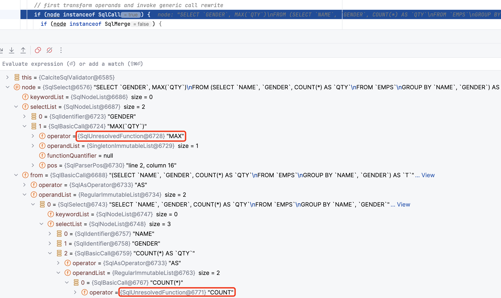
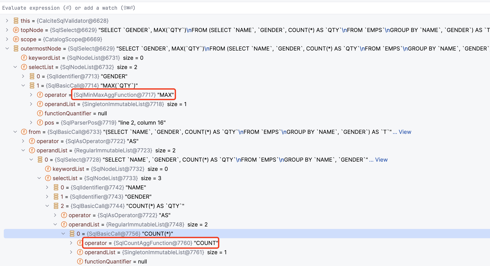
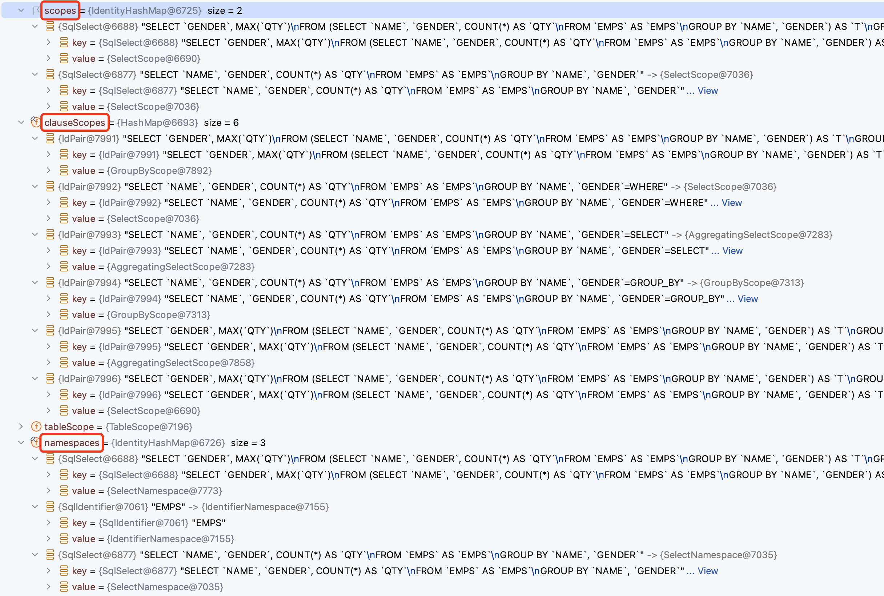
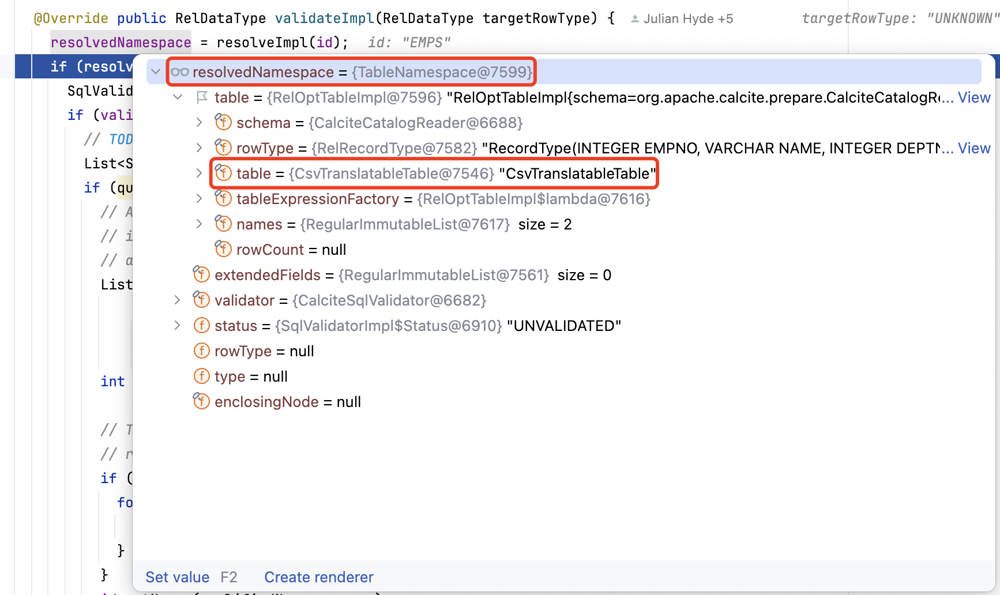
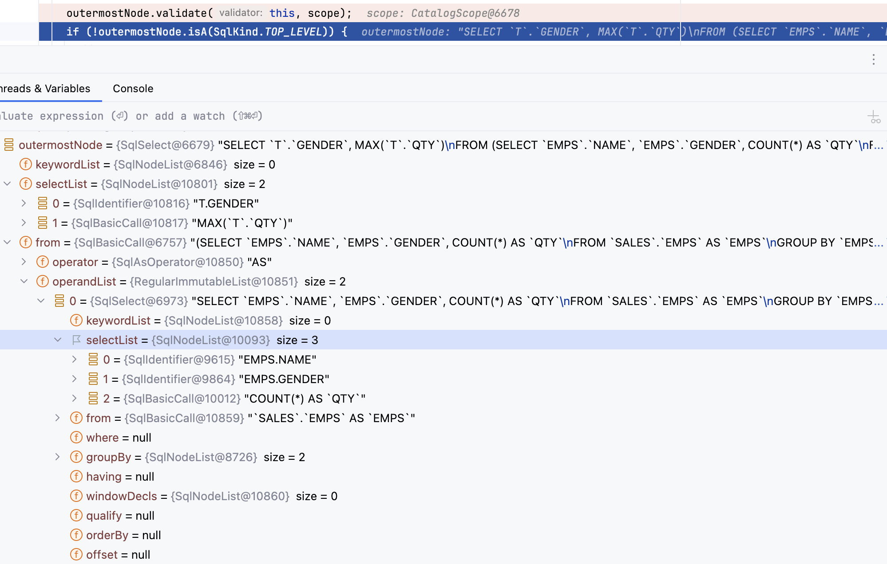

> 注意：本文基于 [Calcite 1.35.0](https://github.com/apache/calcite/tree/75750b78b5ac692caa654f506fc1515d4d3991d6) 版本源码进行学习研究，其他版本可能会存在实现逻辑差异，对源码感兴趣的读者**请注意版本选择**。

## 前言

在上一篇 [Apache Calcite System Catalog 实现探究](https://strongduanmu.com/blog/explore-apache-calcite-system-catalog-implementation.html)中，我们介绍了经典的数据库的处理流程，包括：`SQL 解析`、`SQL 绑定`、`SQL 优化`以及`计划执行`。SQL 绑定主要的作用是将 SQL 解析生成的 AST 和数据库的元数据进行绑定，从而生成具有语义的 AST。SQL 绑定会通过自底向上的方式遍历 AST，对抽象语法树中的节点进行绑定分析，绑定的过程中会将表、列等元数据附在语法树上，最后生成具有语义的语法树 `Bounded AST`。

Calcite 通过 SQL 校验器实现 SQL 绑定，SQL 校验器所需的 System Catalog 信息，我们在上篇文章已经做了详细的介绍，感兴趣的读者可以阅读回顾相关内容。本文将重点介绍 Calcite SQL 校验器的整体设计，梳理校验器中不同类的用途，然后通过具体案例来展示 SQL 校验器的整体流程，并对流程中的关键方法进行代码级别的分析，力求让大家能够深刻理解 Calcite 的 SQL 校验器。

## SQL 校验器整体设计

SQL 校验器的核心类为 `SqlValidator`，它负责使用 Calcite 元数据信息对 AST 进行验证，最终生成具有语义信息的 AST。在 Calcite 中，可以通过 `SqlValidatorUtil.newValidator` 方法快速创建一个 SqlValidator。

除了 SqlValidator 校验器类之外，Calcite 为了将 SQL 中的名称解析为对象，还在校验器内部构建了两个对象：`SqlValidatorScope` 和 `SqlValidatorNamespace`，SqlValidatorScope 表示名称解析的范围，代表了在查询中的某一个位置，当前可见的字段名和表名。`SqlValidatorNamespace` 则表示了校验过程中查询语句的数据来源，不同的查询位置都有不同类型的 namespace 类，例如：表名对应的 `IdentifierNamespace`，Select 语句对应的 `SelectNamespace`，以及 `UNION`、`EXCEPT`、`INTERSECT` 对应的 `SetopNamespace`。下面我们针对核心的 SqlValidator、SqlValidatorScope 和 SqlValidatorNamespace 分别进行探究，了解其设计细节以及适用场景。

### SqlValidator

`SqlValidator` 校验器根据元数据对 SQL 解析的 AST 进行校验，得到具有语义信息的绑定 AST。SqlValidator 通过访问者模式对 AST 进行校验，调用 `SqlNode#validate` 方法时，校验器内部会调用 validateXxx 方法，例如：调用 `SqlLiteral.validate(SqlValidator, SqlValidatorScope)` 会调用 `validateLiteral(SqlLiteral);` ，调用 `SqlCall.validate(SqlValidator, SqlValidatorScope)` 则会调用 `validCall(SqlCall, SqlValidatorScope);`。

SqlValidator 接口定义了 Calcite 校验器的主要方法，它提供了基础的 `getCatalogReader` 和 `getOperatorTable` 方法，分别用于获取元数据信息和运算符、函数。校验 SqlNode 则是通过 `validate` 方法，会按照 AST 结构进行遍历校验，最终返回已校验 SqlNode。

```java
public interface SqlValidator {
  	
  	// 获取校验器使用的 CatalogReader，用于获取元数据信息
    SqlValidatorCatalogReader getCatalogReader();

  	// 获取校验器使用的 SqlOperatorTable，用于获取运算符和函数
    SqlOperatorTable getOperatorTable();

  	// 校验 SqlNode 对应的表达式树，返回已校验的树
    SqlNode validate(SqlNode topNode);

  	// 获取已验证节点的类型
    RelDataType getValidatedNodeType(SqlNode node);

  	// 获取 SqlNode 所属的 Namespace
    SqlValidatorNamespace getNamespace(SqlNode node);

  	// 展开 * 号对应的列
    SqlNodeList expandStar(SqlNodeList selectList, SqlSelect query, boolean includeSystemVars);

    // 展开 order by 子句中的序号和别名列
    SqlNode expandOrderExpr(SqlSelect select, SqlNode orderExpr);

  	// 返回 SqlNode 结果集列的原始类型，该类型中包含 catalog, schema, table, column
    List<@Nullable List<String>> getFieldOrigins(SqlNode sqlQuery);
}
```

此外，为了对 SqlValidator 校验过程中的一些行为进行控制，Calcite 提供了 `SqlValidator#Config` 配置类，通过 `withXxx` 方法可以方便地设置校验器的属性，常见的属性设置方法如下，`withDefaultNullCollation` 可以设置 NULL 值排序规则，`withColumnReferenceExpansion` 则可以用于指定 `Order By` 语句中的列引用是否展开，`withConformance` 方法用于设置 SQL 兼容模式。

```java
interface Config {

  	// 默认 SqlValidator 配置类
    SqlValidator.Config DEFAULT = ImmutableSqlValidator.Config.builder().withTypeCoercionFactory(TypeCoercions::createTypeCoercion).build();
		
  	// 配置默认 NULL 值排序规则
    Config withDefaultNullCollation(NullCollation nullCollation);

  	// 配置列引用是否展开
    Config withColumnReferenceExpansion(boolean expand);

  	// 配置 SQL 兼容模式
    Config withConformance(SqlConformance conformance);
}
```

### SqlValidatorScope

`SqlValidatorScope` 主要用于声明校验过程中**名称解析的范围**，Calcite 对 `SqlValidatorScope` 的具体描述为 `A SqlValidatorScope describes the tables and columns accessible at a particular point in the query`，即：SqlValidatorScope 描述了查询中的某个具体位置可以访问的表和列。

Calcite 根据不同的 SQL 类型实现了众多 SqlValidatorScope 子类，以满足不同场景下的 SQL 校验需求，SqlValidatorScope 继承体系如下：


`SelectScope` 表示查询语句的名称解析范围，该范围中可见的对象包含了 FROM 子句的对象以及从父节点继承的对象。如下展示了一个常见的查询语句，该语句中包含了关联查询、子查询以及排序。

```sql
SELECT expr1
  FROM t1,
      t2,
      (SELECT expr2 FROM t3) AS q3
  WHERE c1 IN (SELECT expr3 FROM t4)
  ORDER BY expr4
```

Calcite 会将该语句拆分为 4 个 SelectScope 分别表示不同表达式对象的可见范围。

* `expr1` 可以访问 `t1, t2, q3` 中的对象；
* `expr2` 可以访问 `t3` 中的对象；
* `expr3` 可以访问 `t4, t1, t2` 中的对象（实际测试 MySQL，`expr3` 同样可以访问 `q3` 临时表）；
* `expr4` 可以访问 `t1, t2, q3`, 以及在 SELECT 子句中定义的任何列别名（取决于方言）。

### SqlValidatorNamespace

`SqlValidatorNamespace` 描述了由 SQL 查询某个部分返回的关系（`Relation`，关系是一组无序的元素或记录，这些元素或记录的属性用来表示实体），例如：在查询 `SELECT emp.deptno, age FROM emp, dept` 时，FROM 子句形成了一个包含 `emp` 和 `dept` 两张表，以及这些表中列组成的行类型在内的命名空间。不同的 RelNode 类型有与之对应的 Namespace 对象，下图展示了 Calcite 中定义的常见 SqlValidatorNamespace 实现类。


`SelectNamespace` 表示了查询语句对应的命名空间，我们同样以如下的查询语句为例：

```sql
SELECT expr1
  FROM t1,
      t2,
      (SELECT expr2 FROM t3) AS q3
  WHERE c1 IN (SELECT expr3 FROM t4)
  ORDER BY expr4
```

Calcite 会从查询语句中提取出 4 个命名空间，分别如下所示，命名空间代表的关系，简单理解可以认为是查询过程中的数据来源。

* `t1`：t1 表所代表的关系；
* `t2`：t2 表所代表的关系；
* `(SELECT expr2 FROM t3) AS q3`：子查询所代表的关系；
* `(SELECT expr3 FROM t4)`：子查询所代表的关系。

## SQL 校验器执行流程

前文我们对 Caclite 校验器中核心的 SqlValidator、SqlValidatorScope 和 SqlValidatorNamespace 类进行了介绍，想必大家对校验器有了一些基础的认识。本节我们通过如下所示的 `CsvTest#testPushDownProjectAggregateNested` 单测，来跟踪下 SQL 校验器的执行流程，该示例 SQL 中包含了常用的子查询、聚合查询以及 `MAX` 和 `COUNT` 聚合函数，可以帮助大家了解这些核心类在校验流程中是如何使用的。

```sql
final String sql = "explain plan " + extra + " for\n" 
        + "select gender, max(qty)\n"
        + "from (\n"
        + "  select name, gender, count(*) qty\n"
        + "  from EMPS\n"
        + "  group by name, gender) t\n"
        + "group by gender";
```

### SqlValidator 初始化

首先，会初始化 SqlValidator 对象，初始化时会将校验器所需的 SqlOperatorTable 和 SqlValidatorCatalogReader 等对象传入进来，SqlOperatorTable 用于查找 SQL 运算符和函数，SqlValidatorCatalogReader 则用于校验时查找元数据信息。此外，初始化时还会创建不同的 AggFinder 对象，用于后续从 AST 中提取不同的聚合函数，以及创建 TypeCoercion 类型转换类，它主要用于 SQL 中可能存在的隐式类型转换。

```java
protected SqlValidatorImpl(SqlOperatorTable opTab, SqlValidatorCatalogReader catalogReader, RelDataTypeFactory typeFactory, Config config) {
    // 初始化 SqlOperatorTable，用于查找 SQL 运算符和函数
    this.opTab = requireNonNull(opTab, "opTab");
    // 用于查找元数据信息
    this.catalogReader = requireNonNull(catalogReader, "catalogReader");
    this.typeFactory = requireNonNull(typeFactory, "typeFactory");
    final RelDataTypeSystem typeSystem = typeFactory.getTypeSystem();
    // 获取类型系统中的时间框架集合
    this.timeFrameSet = requireNonNull(typeSystem.deriveTimeFrameSet(TimeFrames.CORE), "timeFrameSet");
    this.config = requireNonNull(config, "config");

    // It is assumed that unknown type is nullable by default
    unknownType = typeFactory.createTypeWithNullability(typeFactory.createUnknownType(), true);
    booleanType = typeFactory.createSqlType(SqlTypeName.BOOLEAN);

    final SqlNameMatcher nameMatcher = catalogReader.nameMatcher();
    // 初始化 AggFinder，用于从 AST 中遍历获取不同的聚合函数
    aggFinder = new AggFinder(opTab, false, true, false, null, nameMatcher);
    aggOrOverFinder = new AggFinder(opTab, true, true, false, null, nameMatcher);
    overFinder = new AggFinder(opTab, true, false, false, aggOrOverFinder, nameMatcher);
    groupFinder = new AggFinder(opTab, false, false, true, null, nameMatcher);
    aggOrOverOrGroupFinder = new AggFinder(opTab, true, true, true, null, nameMatcher);
    // 初始化类型转换类，用于隐式类型转换
    TypeCoercion typeCoercion = config.typeCoercionFactory().create(typeFactory, this);
    this.typeCoercion = typeCoercion;
    ...
}
```

### validate 流程

介绍完 SqlValidator 初始化逻辑，我们再来深入探究下校验器的核心逻辑 `validate` 方法，其实现逻辑如下。首先会创建用于 root 节点校验的 EmptyScope，并将 EmptyScope 作为 CatalogScope 的父类，CatalogScope 可以查看所有 Schema 中的元数据，在校验过程中能够帮助对 `schema.table.column` 进行列解析。

```java
@Override
public SqlNode validate(SqlNode topNode) {
  	// 创建 EmptyScope 用于 root 节点校验
    SqlValidatorScope scope = new EmptyScope(this);
  	// CatalogScope 可以查看所有 Schema 中的元数据，它的父类是 EmptyScope
    scope = new CatalogScope(scope, ImmutableList.of("CATALOG"));
  	// 校验名称解析范围内的表达式
    final SqlNode topNode2 = validateScopedExpression(topNode, scope);
  	// 获取校验后的节点类型
    final RelDataType type = getValidatedNodeType(topNode2);
    Util.discard(type);
    return topNode2;
}
```

然后会调用 `validateScopedExpression` 进行校验，这部分是 SQL 校验器的核心逻辑。下面展示了该方法的代码实现，内部依次调用了 `performUnconditionalRewrites`、`registerQuery`、`validate` 和 `deriveType` 方法，我们将对这些方法内部实现细节进行深入探究。

```java
private SqlNode validateScopedExpression(SqlNode topNode, SqlValidatorScope scope) {
  	// 重写 SqlNode 进行标准化，以方便后续的逻辑计划优化
    SqlNode outermostNode = performUnconditionalRewrites(topNode, false);
    cursorSet.add(outermostNode);
    top = outermostNode;
    if (outermostNode.isA(SqlKind.TOP_LEVEL)) {
      	// 注册 Scope 和 Namespace
        registerQuery(scope, null, outermostNode, outermostNode, null, false);
    }
  	// 校验 SqlNode
    outermostNode.validate(this, scope);
    if (!outermostNode.isA(SqlKind.TOP_LEVEL)) {
        // 推断类型
        deriveType(scope, outermostNode);
    }
    return outermostNode;
}
```

#### performUnconditionalRewrites

首先，我们来探究下 `performUnconditionalRewrites` 的内部实现逻辑，它主要用于 SqlNode 重写标准化，从而方便后续的逻辑计划优化。首先，方法内部会判断当前 SqlNode 的类型，根据 `SqlCall` 和 `SqlNodeList` 分别进行处理。Calcite SqlNode 体系我们之前在 [Apache Calcite SQL Parser 原理剖析](https://strongduanmu.com/blog/implementation-principle-of-apache-calcite-sql-parser.html#calcite-sqlnode-%E4%BD%93%E7%B3%BB-sql-%E7%94%9F%E6%88%90)中已经进行了详细介绍，不熟悉的朋友可以阅读下这篇文章。

如果当前 SqlNode 是 SqlCall（SqlCall 代表了对 SqlOperator 的调用，Calcite 中每个操作都可以对应一个 SqlCall，例如查询操作是 SqlSelectOperator，对应的 SqlNode 是 `SqlSelect`），则会获取 SqlCall 对应的 `SqlKind` 和 `OperandList`。SqlKind 是一个枚举类，表示了 SqlNode 对应的类型，常用的类型有：SELECT、INSERT、ORDER_BY、WITH 等，更多类型可以查看 [SqlKind 源码](https://github.com/apache/calcite/blob/fb6f43192c4253caea63c0705067a9aa12a3fa74/core/src/main/java/org/apache/calcite/sql/SqlKind.java#L81)。

```java
// 判断当前 SqlNode 是否为 SqlCall
if (node instanceof SqlCall) {
    ...
    SqlCall call = (SqlCall) node;
    // 获取 SqlKind 类型
    final SqlKind kind = call.getKind();
    // 获取 SqlNode 中包含的运算符
    final List<SqlNode> operands = call.getOperandList();
    for (int i = 0; i < operands.size(); i++) {
        SqlNode operand = operands.get(i);
        ...
        // 每一个运算法调用 performUnconditionalRewrites 并设置到 SqlCall 中
        SqlNode newOperand = performUnconditionalRewrites(operand, childUnderFrom);
        if (newOperand != null && newOperand != operand) {
            call.setOperand(i, newOperand);
        }
    }

    // 当前运算符为未解析函数 SqlUnresolvedFunction
    if (call.getOperator() instanceof SqlUnresolvedFunction) {
        final SqlUnresolvedFunction function = (SqlUnresolvedFunction) call.getOperator();
        final List<SqlOperator> overloads = new ArrayList<>();
        // 从 SqlOperatorTable 中查找函数，查找的范围包括内置函数以及元数据中注册的函数
        opTab.lookupOperatorOverloads(function.getNameAsId(), function.getFunctionType(), SqlSyntax.FUNCTION, overloads, catalogReader.nameMatcher());
        if (overloads.size() == 1) {
          	// 查找到函数则设置新的运算符
            ((SqlBasicCall) call).setOperator(overloads.get(0));
        }
    }
}
```

然后对 OperandList 进行遍历，此处 SqlCall 为 SqlSelect，而 SqlSelect 中的 OperandList 会按照 `keywordList, selectList, from, where, groupBy, having, windowDecls, qualify, orderBy, offset, fetch, hints` 的顺序进行返回，后续操作都会基于这个从 0 开始的顺序进行处理。下图展示了单测中 SQL 对应的初始 SqlNode，OperandList 包含了下图所示的 keywordList、selectList 等运算符，会逐个调用 performUnconditionalRewrites 进行处理。

如果当前 SqlCall 运算符为未解析函数 `SqlUnresolvedFunction`，则会调用 `SqlOperatorTable#lookupOperatorOverloads` 方法，从内置函数以及元数据中查找函数，并重新设置运算符。



如果 SqlNode 为 SqlNodeList，则会遍历其中的 SqlNode。本案例中 selectList 就是 SqlNodeList 类型，此时会遍历 SqlNode 并调用 performUnconditionalRewrites，然后将新的 SqlNode 设置到 SqlNodeList 中。

```java
// 判断当前 SqlNode 是否为 SqlNodeList
} else if (node instanceof SqlNodeList) {
    // SqlNodeList 会遍历其中的 SqlNode 并调用 performUnconditionalRewrites，并将新的 SqlNode 设置到 SqlNodeList 中
    final SqlNodeList list = (SqlNodeList) node;
    for (int i = 0; i < list.size(); i++) {
        SqlNode operand = list.get(i);
        SqlNode newOperand = performUnconditionalRewrites(operand, false);
        if (newOperand != null) {
            list.set(i, newOperand);
        }
    }
}
```

除了前面介绍的会将 SqlUnresolvedFunction 转换为对应解析函数外，performUnconditionalRewrites 主要会将如下的非标准 SqlNode 转换为标准的 SqlNode，具体包括：`VALUES`、`ORDER_BY`、`EXPLICIT_TABLE`、`DELETE`、`UPDATE` 和 `MERGE`。VALUES 改写由于在类似 `FROM (VALUES(...)) [ AS alias ]` 场景中存在问题，目前已经不进行改写。ORDER_BY 语句则会被改写为 SqlSelect 和 SqlWith，并将排序相关的子句下沉到 SqlSelect 中。EXPLICIT_TABLE 则会将 将 `Table t` 子句改写为 `SELECT * FROM t` 语句。DELETE 和 UPDATE 会根据条件改写生成 SqlSelect，代表了删除和更新语句所需要删除和更新的数据。MERGE 改写会将 SqlMerge 改写为 SqlUpdate 或 SqlInsert，以复用 SqlUpdate 和 SqlInsert 的处理逻辑。

```java
final SqlKind kind = node.getKind();
switch (kind) {
    case VALUES:
        // VALUES 改写由于在类似 FROM (VALUES(...)) [ AS alias ] 场景中存在问题，目前已经不进行改写
        return node;
    case ORDER_BY: {
        SqlOrderBy orderBy = (SqlOrderBy) node;
        handleOffsetFetch(orderBy.offset, orderBy.fetch);
        if (orderBy.query instanceof SqlSelect) {
            SqlSelect select = (SqlSelect) orderBy.query;
            // 将 SqlOrderBy 转换为 SqlSelect，排序子句下沉到 SqlSelect 中
            if (select.getOrderList() == null) {
                // push ORDER BY into existing select
                select.setOrderBy(orderBy.orderList);
                select.setOffset(orderBy.offset);
                select.setFetch(orderBy.fetch);
                return select;
            }
        }
        // 将 SqlOrderBy 转换为 SqlWith，排序子句下沉到 SqlWith 的 SqlSelect 子句中
        if (orderBy.query instanceof SqlWith && ((SqlWith) orderBy.query).body instanceof SqlSelect) {
            SqlWith with = (SqlWith) orderBy.query;
            SqlSelect select = (SqlSelect) with.body;
            if (select.getOrderList() == null) {
                // push ORDER BY into existing select
                select.setOrderBy(orderBy.orderList);
                select.setOffset(orderBy.offset);
                select.setFetch(orderBy.fetch);
                return with;
            }
        }
        final SqlNodeList selectList = new SqlNodeList(SqlParserPos.ZERO);
        selectList.add(SqlIdentifier.star(SqlParserPos.ZERO));
        final SqlNodeList orderList;
        SqlSelect innerSelect = getInnerSelect(node);
        ...
        return new SqlSelect(SqlParserPos.ZERO, null, selectList, orderBy.query, null, null, null, null, null, orderList, orderBy.offset, orderBy.fetch, null);
    }

    case EXPLICIT_TABLE: {
        // 将 Table t 子句改写为 SELECT * FROM t
        // (TABLE t) is equivalent to (SELECT * FROM t)
        SqlCall call = (SqlCall) node;
        final SqlNodeList selectList = new SqlNodeList(SqlParserPos.ZERO);
        selectList.add(SqlIdentifier.star(SqlParserPos.ZERO));
        return new SqlSelect(SqlParserPos.ZERO, null, selectList, call.operand(0), null, null, null, null, null, null, null, null, null);
    }

    case DELETE: {
        SqlDelete call = (SqlDelete) node;
        SqlSelect select = createSourceSelectForDelete(call);
      	// 为 SqlDelete 增加待删除数据的 SqlSelect 子句
        call.setSourceSelect(select);
        break;
    }

    case UPDATE: {
        SqlUpdate call = (SqlUpdate) node;
        SqlSelect select = createSourceSelectForUpdate(call);
        // 为 SqlUpdate 增加待删除数据的 SqlSelect 子句
        call.setSourceSelect(select);
        ...
        break;
    }

    case MERGE: {
      	// 将 SqlMerge 改写为 SqlUpdate 或 SqlInsert
        SqlMerge call = (SqlMerge) node;
        rewriteMerge(call);
        break;
    }
    default:
        break;
}
return node;
```

执行完 performUnconditionalRewrites 方法，最终生成的 SqlNode 如下图所示，可以看到 SqlUnresolvedFunction 函数已经被改写为对应的内置函数，由于本示例中没有包含 OrderBy、Update 等语句，感兴趣的读者可以自行调整单测中的 SQL 以覆盖对应的逻辑。



#### registerQuery

对 SqlNode 重写标准化之后，Calcite 会调用 `registerQuery` 方法生成 SqlValidatorScope 和 SqlValidatorNamespace 对象，这两个对象在前文中已经进行了介绍，他们分别用于声明校验过程中**名称解析的范围**，以及描述由 SQL 查询某个部分返回的关系（简单理解可以认为是查询过程中的数据来源）。

在调用 registerQuery 方法前，Calcite 会判断当前的 SqlNode 是否为顶层节点，SqlKind 类中定义的顶层节点包含了 `QUERY`、`DML` 和 `DDL` 语句，而 QUERY 中又包含了 `SELECT`、`UNION`、`INTERSECT`、`EXCEPT`、`VALUES`、`WITH`、`ORDER_BY` 和 `EXPLICIT_TABLE` 等具体类型，更多类型可以参考 [SqlKind 源码](https://github.com/apache/calcite/blob/fb6f43192c4253caea63c0705067a9aa12a3fa74/core/src/main/java/org/apache/calcite/sql/SqlKind.java#L1347)。

```java
private SqlNode validateScopedExpression(SqlNode topNode, SqlValidatorScope scope) {
    ...
    // 判断 SqlNode 是否为顶层节点  
    if (outermostNode.isA(SqlKind.TOP_LEVEL)) {
        registerQuery(scope, null, outermostNode, outermostNode, null, false);
    }
    ...
    return outermostNode;
}

// SqlKind 中定义的 TOP_LEVEL
public static final EnumSet<SqlKind> TOP_LEVEL = concat(QUERY, DML, DDL);

public static final EnumSet<SqlKind> QUERY = EnumSet.of(SELECT, UNION, INTERSECT, EXCEPT, VALUES, WITH, ORDER_BY, EXPLICIT_TABLE);
```

判断 SqlNode 为顶层节点后， 会继续调用 registerQuery 方法并传入参数，下面展示了 registerQuery 方法的实现，`parentScope` 表示当前 SqlNode 的父名称解析范围，顶层节点的 parentScope 为 `CatalogScope`（CatalogScope 可以查看所有 Schema 中的元数据，它的父类是 EmptyScope）。`usingScope` 则用于添加当前 Scope 需要使用的子 Scope，`node` 表示当前的 SqlNode，`enclosingNode` 和 `node` 通常是相同的，enclosingNode 通常表示 FROM 子句最顶层的节点 ，可以从 enclosingNode 中获取别名等信息，`alias` 表当前查询在父查询中的名称，如果 usingScope 不为空则必须指定 alias。

```java
private void registerQuery(SqlValidatorScope parentScope, @Nullable SqlValidatorScope usingScope, SqlNode node, SqlNode enclosingNode, @Nullable String alias, boolean forceNullable) {
    Preconditions.checkArgument(usingScope == null || alias != null);
    registerQuery(parentScope, usingScope, node, enclosingNode, alias, forceNullable, true);
}
```

`registerQuery` 方法内部会根据 SqlKind 进行判断，对不同类型的 SQL 进行处理，本文示例为 SELECT 语句，因此我们先专注于 SELECT 相关的逻辑。下面展示了 registerQuery 方法的实现逻辑，首先会创建 SelectNamespace 对象，该对象会记录 SqlSelect 及当前的校验器。然后调用 registerNamespace 方法，将 SelectNamespace 记录在 namespaces 对象中，namespaces 的结构为 `<SqlNode, SqlValidatorNamespace>`，如果 usingScope 不为 null，则将当前 SelectNamespace 注册为 usingScope 的子节点。再创建 SelectScope，并将其记录到全局的 scopes 中，scopes 的结构为 `<SqlNode, SqlValidatorScope>`。

```java
SqlCall call;
List<SqlNode> operands;
switch (node.getKind()) {
    case SELECT:
        final SqlSelect select = (SqlSelect) node;
        // 创建 SelectNamespace，记录 SqlSelect 和当前的校验器
        final SelectNamespace selectNs = createSelectNamespace(select, enclosingNode);
        // 将 SelectNamespace 记录在 namespaces 对象中，namespaces 的结构为 `<SqlNode, SqlValidatorNamespace>`
        // 如果 usingScope 不为 null，则将当前 SelectNamespace 注册为 usingScope 的子节点
        registerNamespace(usingScope, alias, selectNs, forceNullable);
        // 选择第一个不为 null 的 scope 作为 windowParentScope，此处为 CatalogScope
        final SqlValidatorScope windowParentScope = first(usingScope, parentScope);
        // 创建 SelectScope，会记录 parentScope，windowParentScope 以及 SqlSelect
        SelectScope selectScope = new SelectScope(parentScope, windowParentScope, select);
        // 将 selectScope 记录到全局的 scopes 中, scopes 的结构为 <SqlNode, SqlValidatorScope>
        scopes.put(select, selectScope);
        ...
}
```

然后 Calcite 会对各个不同的子句进行注册，首先会从 WHERE 语句开始，并将 WHERE 对应的 Scope 存储到 clauseScopes 中，再调用 `registerOperandSubQueries` 注册 WHERE 运算符中的子查询，最终整个方法会将 SELECT 语句中的 `Projection`、`From`、`Where`、`Order By`、`Group By`、`Having` 等子句都进行注册，生成对应的 Scope 和 Namespace 对象。

```java
SqlCall call;
List<SqlNode> operands;
switch (node.getKind()) {
    case SELECT:
        ...
        // Start by registering the WHERE clause
        // clauseScopes 用于记录 Select 中的子句，用于后续子句的注册
        clauseScopes.put(IdPair.of(select, Clause.WHERE), selectScope);
        // 注册 WHERE 运算符中的子查询
        registerOperandSubQueries(selectScope, select, SqlSelect.WHERE_OPERAND);
        
        // 注册 QUALIFY 子句中的子查询，QUALIFY 子句通常用于 WINDOW 函数结果的过滤
        registerOperandSubQueries(
            selectScope,
            select,
            SqlSelect.QUALIFY_OPERAND);
        
        // Register FROM with the inherited scope 'parentScope', not
        // 'selectScope', otherwise tables in the FROM clause would be
        // able to see each other.
        final SqlNode from = select.getFrom();
        if (from != null) {
            // 注册 FROM，本示例中包含了 FROM 子查询，因此子查询会再次调用 registerQuery
            final SqlNode newFrom = registerFrom(parentScope, selectScope, true, from, from, null, null, false, false);
            if (newFrom != from) {
                select.setFrom(newFrom);
            }
        }
        
        // If this is an aggregating query, the SELECT list and HAVING
        // clause use a different scope, where you can only reference
        // columns which are in the GROUP BY clause.
        SqlValidatorScope aggScope = selectScope;
        if (isAggregate(select)) {
            aggScope = new AggregatingSelectScope(selectScope, select, false);
            clauseScopes.put(IdPair.of(select, Clause.SELECT), aggScope);
        } else {
            clauseScopes.put(IdPair.of(select, Clause.SELECT), selectScope);
        }
        if (select.getGroup() != null) {
            GroupByScope groupByScope = new GroupByScope(selectScope, select.getGroup(), select);
            clauseScopes.put(IdPair.of(select, Clause.GROUP_BY), groupByScope);
            // 注册 GROUP BY 中的子句
            registerSubQueries(groupByScope, select.getGroup());
        }
        // 注册 HAVING 运算符中的子查询
        registerOperandSubQueries(aggScope, select, SqlSelect.HAVING_OPERAND);
        // 注册投影列中的子查询，并会将子查询转换为标量子查询
        registerSubQueries(aggScope, SqlNonNullableAccessors.getSelectList(select));
        final SqlNodeList orderList = select.getOrderList();
        if (orderList != null) {
            // If the query is 'SELECT DISTINCT', restrict the columns
            // available to the ORDER BY clause.
            if (select.isDistinct()) {
                aggScope = new AggregatingSelectScope(selectScope, select, true);
            }
            OrderByScope orderScope = new OrderByScope(aggScope, orderList, select);
            clauseScopes.put(IdPair.of(select, Clause.ORDER), orderScope);
            // 注册 ORDER BY 中的子句
            registerSubQueries(orderScope, orderList);
            // ...
        }
        break;
}
```

registerQuery 执行完成后，注册的信息会存储在 SqlValidatorImpl 对象中，下图展示了对象中存储的内容，分别包括了 `scopes`、`clauseScopes` 和 `namespaces`。`scopes` 对象用于存储查询节点和它们对应的 SqlValidatorScope 之间的映射，此案例中查询节点为两个 SELECT 语句，分别对应了不同的 SelectScope 对象。`clauseScopes` 对象则用于存储子句和 SqlValidatorScope 之间的映射，用于表示当前子句可见的范围。`namespaces` 代表了数据来源，此案例中共有 3 个 namespace，分别是：`EMPS` 代表的表数据源，以及另外两个查询数据源。



#### validate

完成 registerQuery 后，校验器中以及包含了校验所需的 Scope 和 Namespace 对象，下面我们再来探究下核心的校验逻辑。校验器首先会调用 `SqlNode#validate` 方法，该方法在不同的 SqlNode 中具有不同的实现。由于本文案例为查询语句，因此先关注 SqlSelect 的实现逻辑，其它类型的 SqlNode 读者可以自行探究。

```java
// 校验 SqlNode
outermostNode.validate(this, scope);

// SqlSelect#validate 实现
@Override
public void validate(SqlValidator validator, SqlValidatorScope scope) {
    validator.validateQuery(this, scope, validator.getUnknownType());
}
```

从上面的源码可以看到，`SqlSelect#validate` 方法会调用校验器的 validateQuery 方法，validateQuery 中核心的处理逻辑为 `validateNamespace` 和 `validateAccess`，分别校验 Namespace 以及对表的访问。

```java
@Override
public void validateQuery(SqlNode node, SqlValidatorScope scope, RelDataType targetRowType) {
    ...
    // 校验 Namespace
    validateNamespace(ns, targetRowType);
    switch (node.getKind()) {
        case EXTEND:
            // Until we have a dedicated namespace for EXTEND
            deriveType(requireNonNull(scope, "scope"), node);
            break;
        default:
            break;
    }
    if (node == top) {
        validateModality(node);
    }
    // 校验对表的访问
    validateAccess(node, ns.getTable(), SqlAccessEnum.SELECT);
    
    validateSnapshot(node, scope, ns);
}
```

##### validateNamespace

`validateNamespace` 方法内部会调用 `SqlValidatorNamespace#validate` 方法，然后设置校验后的节点类型。

```java
/**
 * Validates a namespace.
 *
 * @param namespace Namespace
 * @param targetRowType Desired row type, must not be null, may be the data
 * type 'unknown'.
 */
protected void validateNamespace(final SqlValidatorNamespace namespace, RelDataType targetRowType) {
    // 调用 SqlValidatorNamespace 实现类的 validate
    namespace.validate(targetRowType);
    SqlNode node = namespace.getNode();
    if (node != null) {
        // 设置已校验节点类型
        setValidatedNodeType(node, namespace.getType());
    }
}
```

本案例中 SqlValidatorNamespace 实现类为 `SelectNamespace`，SelectNamespace 则继承了抽象类 `AbstractNamespace`，在调用 `SelectNamespace#validate` 方法时，会调用父类 `AbstractNamespace#validate` 方法，该方法会根据 AbstractNamespace 中记录的 status 状态决定如何处理。如果 status 为 `UNVALIDATED` 状态，则会调用 `validateImpl` 方法，validateImpl 方法是一个抽象方法，具体的实现逻辑在 AbstractNamespace 子类中。

```java
@Override
public final void validate(RelDataType targetRowType) {
    switch (status) {
        case UNVALIDATED:
            try {
                status = SqlValidatorImpl.Status.IN_PROGRESS;
                Preconditions.checkArgument(rowType == null, "Namespace.rowType must be null before validate has been called");
                RelDataType type = validateImpl(targetRowType);
                Preconditions.checkArgument(type != null, "validateImpl() returned null");
                setType(type);
            } finally {
                status = SqlValidatorImpl.Status.VALID;
            }
            break;
        case IN_PROGRESS:
            throw new AssertionError("Cycle detected during type-checking");
        case VALID:
            break;
        default:
            throw Util.unexpected(status);
    }
}

protected abstract RelDataType validateImpl(RelDataType targetRowType);
```

`SelectNamespace#validateImpl` 内部则会调用 `validator.validateSelect` 方法，`SqlValidatorImpl#validateSelect` 具体实现逻辑如下，方法内会依次调用 `validateFrom`、`validateWhereClause`、`validateGroupClause`、`validateHavingClause`、`validateWindowClause`、`validateQualifyClause`、`validateSelectList` 和 `validateOrderList` 子句。

```java
protected void validateSelect(SqlSelect select, RelDataType targetRowType) {
    // Namespace is either a select namespace or a wrapper around one.
    final SelectNamespace ns = getNamespaceOrThrow(select).unwrap(SelectNamespace.class);
    // 获取 Select 语句中的投影列表
    final SqlNodeList selectItems = SqlNonNullableAccessors.getSelectList(select);
    RelDataType fromType = unknownType;
    ...
    // Make sure that items in FROM clause have distinct aliases.
    final SelectScope fromScope = (SelectScope) getFromScope(select);
    ...
    if (select.getFrom() == null) {
        if (this.config.conformance().isFromRequired()) {
            throw newValidationError(select, RESOURCE.selectMissingFrom());
        }
    } else {
        // 校验 From 子句
        validateFrom(select.getFrom(), fromType, fromScope);
    }
    // 校验 Where 子句
    validateWhereClause(select);
    // 校验 Group 子句
    validateGroupClause(select);
    // 校验 Having 子句
    validateHavingClause(select);
    // 校验 Window 子句
    validateWindowClause(select);
    // 校验 Qualify 子句
    validateQualifyClause(select);
    handleOffsetFetch(select.getOffset(), select.getFetch());
    
    // Validate the SELECT clause late, because a select item might
    // depend on the GROUP BY list, or the window function might reference
    // window name in the WINDOW clause etc.
    // 校验 Select 投影列
    final RelDataType rowType = validateSelectList(selectItems, select, targetRowType);
    ns.setType(rowType);
    
    // Validate ORDER BY after we have set ns.rowType because in some
    // dialects you can refer to columns of the select list, e.g.
    // "SELECT empno AS x FROM emp ORDER BY x"
    // 校验 Order 子句
    validateOrderList(select);
    ...
}
```

从前文 `registerQuery` 结果可以看出，From 子句对应的 Namespace 为 IdentifierNamespace，执行 validateFrom 时内部会调用 `IdentifierNamespace#validateImpl` 方法，该方法内部实现逻辑如下。

```java
@Override
public RelDataType validateImpl(RelDataType targetRowType) {
    // 从元数据中解析表名，并组装为 TableNamespace
    resolvedNamespace = resolveImpl(id);
    if (resolvedNamespace instanceof TableNamespace) {
        // 从 TableNamespace 中获取 table
        SqlValidatorTable table = ((TableNamespace) resolvedNamespace).getTable();
        // 判断是否需要将 identifier 展开为全限定名称
        if (validator.config().identifierExpansion()) {
            // TODO:  expand qualifiers for column references also
            List<String> qualifiedNames = table.getQualifiedName();
            if (qualifiedNames != null) {
                // Assign positions to the components of the fully-qualified
                // identifier, as best we can. We assume that qualification
                // adds names to the front, e.g. FOO.BAR becomes BAZ.FOO.BAR.
                List<SqlParserPos> poses = new ArrayList<>(Collections.nCopies(qualifiedNames.size(), id.getParserPosition()));
                int offset = qualifiedNames.size() - id.names.size();
                
                // Test offset in case catalog supports fewer qualifiers than catalog reader.
                if (offset >= 0) {
                    for (int i = 0; i < id.names.size(); i++) {
                        poses.set(i + offset, id.getComponentParserPosition(i));
                    }
                }
                id.setNames(qualifiedNames, poses);
            }
        }
    }
    
    RelDataType rowType = resolvedNamespace.getRowType();
    ...
    return rowType;
}
```

`resolveImpl` 方法会根据 id 从元数据中解析出表名，并封装为 TableNamespace 对象，下图展示了解析之后的对象，对象中包含了从元数据中获取的 table 对象。然后会判断是否需要将 identifier 展开为全限定名称，此案例中会将 `EMPS` 展开为 `SALES.EMPS` 并设置到 names 属性中。



TODO validate select list

##### validateAccess

`validateAccess` 方法用于校验当前节点对表是否具有访问权限，`node` 参数表示当前节点，`table` 表示要访问的表，`requiredAccess` 则表示需要访问的类型。`table.getAllowedAccess()` 会从 `RelOptTableImpl#getAllowedAccess` 获取可访问类型，会返回全部类型，包括：SELECT、UPDATE、INSERT 和 DELETE，如果不具有访问权限，则抛出异常。

```java
/**
 * Validates access to a table.
 *
 * @param table Table
 * @param requiredAccess Access requested on table
 */
private void validateAccess(SqlNode node, @Nullable SqlValidatorTable table, SqlAccessEnum requiredAccess) {
    if (table != null) {
        // RelOptTableImpl#getAllowedAccess 返回全局访问类型，包括了 SELECT、UPDATE、INSERT 和 DELETE
        SqlAccessType access = table.getAllowedAccess();
        // 如果不具有访问权限，则抛出异常
        if (!access.allowsAccess(requiredAccess)) {
            throw newValidationError(node, RESOURCE.accessNotAllowed(requiredAccess.name(), table.getQualifiedName().toString()));
        }
    }
}
```

完成校验后，返回的 outermostNode 结构如下，可以看到 SqlNode 的 Identifier 都进行了全限定名展开，根据 names 属性可以很快速地获取到列对象所属的表，以及表对象所属的 Schema，函数对象则会查找到 Calcite 内置的函数，或者用户在元数据中定义的函数。




TODO

#### deriveType


### 流程总结


## 结语

TODO




笔者因为工作原因接触到 Calcite，前期学习过程中，深感 Calcite 学习资料之匮乏，因此创建了 [Calcite 从入门到精通知识星球](https://wx.zsxq.com/dweb2/index/group/51128414222814)，希望能够将学习过程中的资料和经验沉淀下来，为更多想要学习 Calcite 的朋友提供一些帮助。


