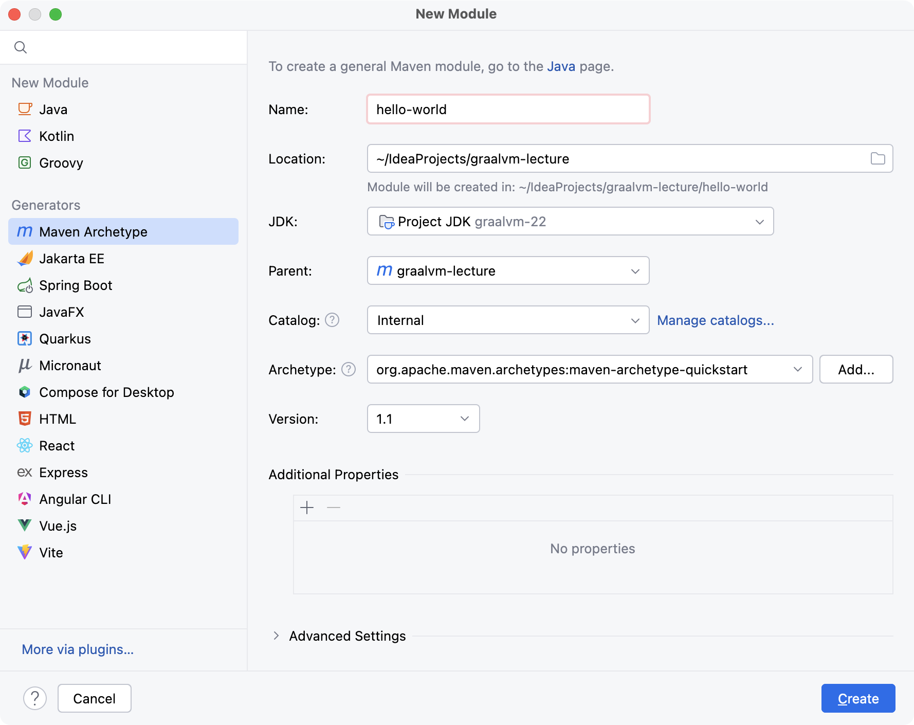

## GraalVM 诞生的背景

过去 20 多年，Java 通过语言层虚拟化，实现了`平台无关`、`架构中立`等特性，彻底屏蔽了不同操作系统、不同指令集架构带来的差异，因而 Java 语言也取得了巨大的成功。但随着云原生时代的到来，面对相同的问题，云原生选择了操作系统层虚拟化方案——通过容器实现不可变基础设施，将程序连同它的运行环境一起封装到镜像里，这种方案越来越成为一种主流的应用程序分发方式。

云原生的兴起，同时也促进了微服务、`Serverless` 等技术发展，它们**对镜像体积、内存消耗、启动速度，以及达到最高性能的时间等方面提出了新的要求**，而这些却是 Java 语言所不擅长的领域。由于 Java 基于 JVM 虚拟机运行，哪怕再小的程序都需要带着完整的虚拟机和标准类库，使得镜像拉取和容器创建的效率降低。此外，Java 语言还存在**基础内存开销和冷启动**等问题，这些问题限制了 Java 语言在云原生环境下的应用。

为了紧跟云原生时代的发展，应对来自 Go、Rust 等原生语言的挑战，Java 社区提出了 `GraalVM` 方案，即通过 GraalVM 中的 `AOT` 提前编译技术，将 Java 生成的字节码文件，提前编译生成二进制的机器码，从而**规避冷启动以及依赖 JVM 运行带来的诸多问题**。

## 初识 GraalVM AOT 编译

### GraalVM 简介

GraalVM 是一个**高性能、支持多种编程语言的执行环境**。它既可以在传统的 OpenJDK 上运行，也可以通过 AOT（`Ahead-Of-Time`）**编译成可执行文件单独运行**，甚至可以**集成到数据库中运行**。除此之外，它还移除了编程语言之间的边界，并且支持通过即时编译技术，将混杂了不同编程语言的代码编译到同一段二进制中，从而**实现不同语言之间的无缝切换**。


上图展示了 GraalVM 作为开放生态系统的体系结构，上层虚拟化层展示了 GraalVM 支持的编程语言，包括了：**基于 JVM 的 Java、Kotlin、Scala，动态语言 JavaScript、Ruby、R、Python，以及基于 LLVM 的 C、C++ 和 Rust**。这些语言经过 GraalVM 编译，可以运行在 OpenJDK、NodeJs 及 Oracle 数据库中，也可以作为二进制程序独立运行。

可以看到 GraalVM 对多语言及多运行环境提供了强大的支持，本文先重点关注 GraalVM AOT 技术在 Java 语言上的应用，其他相关的 GraalVM 主题我们在后续的文章中再做探讨。

### AOT 编译简介

**那么什么是 AOT 技术呢**？熟悉 C、C++ 语言的同学对这个概念一定不陌生，所谓 AOT 编译，是指**在程序运行之前**，便将程序源码或字节码转换为机器码的过程，编译完成后的输出的是可执行文件或者动态链接库文件。和 AOT 编译相对的是 JIT 编译，JIT 编译是指**在程序运行过程中**，将字节码编译为可在硬件上直接执行的机器码，在 Java 语言中，HotSpot 虚拟机会将热点代码通过 JIT 编译器编译为机器码，从而提升程序的执行性能。

下图展示了 AOT 和 JIT 编译的运行流程，他们都需要通过 `javac` 编译器将 Java 源码编译为 Java 字节码。AOT 和 JIT 编译的差异主要体现在获得字节码后如何执行，传统的 Java 程序会运行在 JVM 之上，JVM 会通过解释执行的方式执行字节码逻辑，如果执行的代码是热点代码，则会通过 JIT 即时编译器，将字节码编译为二进制代码。AOT 编译则脱离了 JVM 运行时环境，直接通过 GraalVM 编译器将 Java 字节码编译为二进制文件，然后直接在操作系统上运行。


AOT 编译最突出的特点是脱离了 JVM 运行时环境，直接编译生成二进制可执行文件，**无需在程序运行过程中耗费 CPU 资源来进行即时编译，程序能够在启动后立刻达到期望的最佳性能**。下图展示了 [Quarkus 框架](https://cn.quarkus.io/)使用 GraalVM AOT 性能对比，可以看到使用 AOT 编译后的程序消耗内存更少，并且启动后首次执行的耗时大幅度缩短。


### AOT 编译的优势和劣势

混迹于技术圈的朋友，可能都听过这句话——**没有银弹**（西方传说中，使用银子弹可以杀死吸血鬼、狼人或怪兽，银弹引申为解决问题的有效方法）。对于 AOT 编译技术也是同样，它在带来低内存消耗、快速启动等优势的同时，同样也会带来一些问题，下面我们就来探讨下 AOT 编译的优势和劣势。


上图展示了 AOT 编译和传统的 JIT 编译的对比，相比 JIT 编译，AOT 编译具有如下的一些优势：

* **启动速度更快**：AOT 编译直接生成了平台相关的机器码，无需再使用解释执行和 JIT 编译的方式，避免了解释执行低效，也避免了 JIT 编译带来的 CPU 开销。AOT 编译还解决了传统 Java 执行模型中无法充分预热，始终存在解释执行的问题，因此可以大幅度提升启动速度，并稳定保持较好的性能；
* **占用内存更少**：由于 JVM 虚拟机运行需要占用内存，Java 语言实现动态特性也需要额外消耗内存，AOT 编译后程序无需运行在 JVM 虚拟机上，同时也去除了 Java 语言的动态特性，因此程序内存消耗会更少；
* **更小的应用包**：AOT 编译后的程序无需依赖 JVM 虚拟机，因此打包的应用会更小，可以很方便地进行分发。

虽然 AOT 编译有如上众多的优点，但是鱼和熊掌不可兼得，由于 AOT 编译采用了静态执行的方式，不可避免地会带来如下的问题：

* **峰值吞吐量降低**：由于 AOT 编译在编译器需要将全部的代码转换为机器码，因此 AOT 编译无法像 JVM 一样，在程序运行时动态地获取指标，来指导编译器编译出性能更优的机器码，因此峰值吞吐量相比于 JVM 会有所下降（最新的 Oracle GraalVM 版本提供了 `Profile-Guided Optimizations` 用来指导 AOT 编译，取得了不错的效果，更多信息可以参考 [Optimizing Performance with GraalVM](https://archive.qconsf.com/system/files/presentation-slides/qconsf2019-alina-yurenko-jit-vs-aot-performance-with-graalvm.pdf) 及 [A New GraalVM Release and New Free License](https://medium.com/graalvm/a-new-graalvm-release-and-new-free-license-4aab483692f5)）；
* **最大延迟增大**：AOT 编译目前仅支持常规的 `STOP&COPY` 垃圾收集器，因此最大延迟相比 JVM 会增加（最新的 Oracle GraalVM 版本提供了 G1 垃圾回收器，最大延迟相比 GraalVM CE 会更小）；
* **封闭性**：AOT 编译的基本原则是**封闭性假设**，即程序在编译期必须掌握运行时所需的所有信息，在运行时不能出现任何编译器未知的内容。这会导致 Java 程序中的很多动态特性无法继续使用，例如：**反射、动态类加载、动态代理、JCA 加密机制（内部依赖了反射）、JNI、序列化等**，如果程序中包含了这些动态特性，则需要通过额外的适配工作进行处理；
* **平台相关性**：AOT 静态编译后程序由原来的平台无关性，变为平台相关性，用户需要考虑部署的平台架构，然后编译出不同的二进制程序；
* **生态变化**：传统面向 Java 程序的调试、监控、Agent 等技术不再适用，因为运行的程序由 Java 程序变成了本地程序，用户需要使用 GDB 才能调试本地程序。可以说，AOT 编译除了源码仍然是 Java 外，其他的生态完全不同了，这些会成为 AOT 编译推广的阻力。




## GraalVM AOT 编译实战

### 安装 GraalVM SDK

GraalVM 官方文档 [Getting Started](https://www.graalvm.org/latest/docs/getting-started/) 页面提供了主流 Linux、Mac 和 Windows 平台安装 GraalVM 的教程，大家可以按照教程进行安装。由于笔者更喜欢 SDKMAN 这个工具，因此本小节会介绍下 SDKMAN 安装 GraalVM SDK 的步骤，大家可以按照自己熟悉的方式进行安装。

首先，我们需要安装 SDKMAN，参考官方文档 [Installation](https://sdkman.io/install)，执行以下脚本即可完成安装，安装完成后使用 `sdk version` 查看版本信息。

```bash
curl -s "https://get.sdkman.io" | bash
source "$HOME/.sdkman/bin/sdkman-init.sh"
sdk version
```

然后我们执行 `sdk list java` 查看 Java SDK 可用版本：

```bash
================================================================================
Available Java Versions for macOS ARM 64bit
================================================================================
 Vendor        | Use | Version      | Dist    | Status     | Identifier
--------------------------------------------------------------------------------
 GraalVM Oracle|     | 24.ea.8      | graal   |            | 24.ea.8-graal
               |     | 24.ea.7      | graal   | installed  | 24.ea.7-graal
               |     | 23.ea.22     | graal   |            | 23.ea.22-graal
               |     | 23.ea.21     | graal   |            | 23.ea.21-graal
               |     | 22.0.2       | graal   | installed  | 22.0.2-graal
               |     | 21.0.4       | graal   |            | 21.0.4-graal
================================================================================
Omit Identifier to install default version 21.0.4-tem:
    $ sdk install java
Use TAB completion to discover available versions
    $ sdk install java [TAB]
Or install a specific version by Identifier:
    $ sdk install java 21.0.4-tem
Hit Q to exit this list view
================================================================================
```

可以选择最新稳定版 `22.0.2-graal` 进行安装，执行 `sdk install java 22.0.2-graal`，安装完成后可以通过 `sdk default java 22.0.2-graal` 设置当前默认 JDK 版本，然后执行 `java -version` 查看 JDK 版本号。

```bash
java version "22.0.2" 2024-07-16
Java(TM) SE Runtime Environment Oracle GraalVM 22.0.2+9.1 (build 22.0.2+9-jvmci-b01)
Java HotSpot(TM) 64-Bit Server VM Oracle GraalVM 22.0.2+9.1 (build 22.0.2+9-jvmci-b01, mixed mode, sharing)
```

安装完 GraalVM SDK 后，我们还需要安装 AOT 静态编译所需的本地工具链，例如：C 库的头文件、`glibc-devel`、`zlib`、`gcc` 和 `libstdc++-static`。本地工具链安装脚本如下：

```bash
# MacOS
xcode-select --install
# CentOS
sudo yum install gcc glibc-devel zlib-devel
# Ubuntu
sudo apt-get install build-essential zlib1g-dev
```

更多关于本地工具链的安装步骤，请大家参考 [GraalVM 官方文档先决条件](https://www.graalvm.org/latest/reference-manual/native-image/#prerequisites)。

### GraalVM HelloWorld

学习一门新语言，通常都是从 `HelloWorld` 开始，我们也尝试使用 GraalVM 编译一个 Java 的 HelloWorld 程序，输出 `Hello World! GraalVM!`。

```java
public final class HelloWorld {
    
    public static void main(String[] args) {
        System.out.println("Hello World! GraalVM!");
    }
}
```

我们按照前文介绍的步骤，先使用 `javac HelloWorld.java` 命令将源码编译为字节码，再使用 `GraalVM` 编译器将字节码编译为本地代码，GraalVM 编译器的命令为 `native-image`，执行如下的命令可以编译出本地代码。`native-image` 命令参数较多，大家可以使用 `native-image --help` 查看完整列表进行探究。

```bash
# 编译生成 HelloWorld
native-image HelloWorld
```


上图展示了 GraalVM 编译过程，编译后会默认会生成 class 文件名对应的小写二进制文件，我们也可以使用 `-o` 参数指定二进制文件名，执行 `./helloworld` 可以输出字符串。

```bash
# 执行 Native Image
./helloworld
Hello World! GraalVM!
```

我们使用 `time` 命令对比 Java 执行方式和 Native 执行方式，可以明显看到不论是执行时间，还是 CPU 使用率，Native 执行方式都更有优势。

```bash
time java HelloWorld
Hello World! GraalVM!
java HelloWorld  0.04s user 0.04s system 60% cpu 0.136 total

time ./helloworld
Hello World! GraalVM!
./helloworld  0.00s user 0.01s system 46% cpu 0.032 total
```

### 使用 Maven 构建 Native Image

在实际工作中，我们通常会使用 Maven 或 Gradle 工具，来构建 Native Image。本文将以 Maven 工具为例，为大家介绍下实际项目中如何构建一个 Native Image 可执行文件，Gradle 工具的使用大家可以参考官方文档 [Native-Image#Gradle](https://www.graalvm.org/latest/reference-manual/native-image/#gradle)。

我们使用 IDEA 工具创建 Maven 项目，首先创建一个名为 `graalvm-lecture` 的 `Empty Project`，然后再其下创建子模块 [hello-world](https://github.com/strongduanmu/graalvm-lecture/tree/main/hello-world)， Archetype 使用 `quickstart`，它可以创建出一个包含 `Hello World!` Demo 的 Maven 项目。



然后在 `pom.xml` 文件中添加 `maven-compiler-plugin` 和 `maven-jar-plugin` 插件，用于编译 Java 源码，并将源码打包为可执行 jar 文件。

```xml
<build>
     <plugins>
         <plugin>
             <groupId>org.apache.maven.plugins</groupId>
             <artifactId>maven-compiler-plugin</artifactId>
             <version>3.12.1</version>
             <configuration>
                 <fork>true</fork>
             </configuration>
         </plugin>
         <plugin>
             <groupId>org.apache.maven.plugins</groupId>
             <artifactId>maven-jar-plugin</artifactId>
             <version>3.3.0</version>
             <configuration>
                 <archive>
                     <manifest>
                         <mainClass>com.example.App</mainClass>
                         <addClasspath>true</addClasspath>
                     </manifest>
                 </archive>
             </configuration>
         </plugin>
     </plugins>
 </build>
```

再添加一个新的 `profile`，id 可以设置为 `native`，并在改 profile 下添加 `native-maven-plugin` 插件，用于将字节码文件编译为二进制的 Native Image，`configuration` 下可以配置本地镜像名称 `imageName`，以及构建时的参数 `buildArg`，此处 `--no-fallback` 代表的是不进入 `fallback` 模式。当 GraalVM 发现使用了未被配置的动态特性时会默认回退到 JVM 模式。本选项会关闭回退行为，总是执行静态编译。

```xml
<properties>
    <native.image.name>HelloWorld</native.image.name>
    <native.maven.plugin.version>0.10.2</native.maven.plugin.version>
</properties>

<profiles>
    <profile>
        <id>native</id>
        <build>
            <plugins>
                <plugin>
                    <groupId>org.graalvm.buildtools</groupId>
                    <artifactId>native-maven-plugin</artifactId>
                    <version>${native.maven.plugin.version}</version>
                    <extensions>true</extensions>
                    <configuration>
                        <imageName>${native.image.name}</imageName>
                        <buildArgs>
                            <buildArg>--no-fallback</buildArg>
                        </buildArgs>
                    </configuration>
                    <executions>
                        <execution>
                            <id>build-native</id>
                            <goals>
                                <goal>compile-no-fork</goal>
                            </goals>
                            <phase>package</phase>
                        </execution>
                        <execution>
                            <id>test-native</id>
                            <goals>
                                <goal>test</goal>
                            </goals>
                            <phase>test</phase>
                        </execution>
                    </executions>
                </plugin>
            </plugins>
        </build>
    </profile>
</profiles>
```

配置完成后，我们再执行 ` mvn -Pnative package` 编译二进制文件，如下图所示会在 `target` 目录下编译生成 `HelloWorld` 可执行文件。


执行 `./target/HelloWorld` 会输出 `Hello World!`。

```bash
./target/HelloWorld
Hello World!
```

### 使用 Tracing Agent 收集元数据

根据前文的介绍，我们知道 GraalVM AOT 基于**封闭性假设**，即程序在编译期必须掌握运行时所需的所有信息，在运行时不能出现任何编译器未知的内容。Java 程序中包含了很多动态特性，例如：**反射、动态类加载、动态代理、JCA 加密机制（内部依赖了反射）、JNI、序列化等**，这些都违反了封闭性假设。

GraalVM 允许通过配置将缺失的信息补充给编译器以满足封闭性，为此 GraalVM 设计了 `jni-config.json`、`reflect-config.json`、`proxy-config.json`、`resource-config.json`、`predefined-classes-config.json` 和 `serialization-config.json` 配置文件，分别用于JNI 回调目标信息、反射目标信息、动态代理目标接口信息、资源文件信息、提前定义动态类信息、序列化信息。虽然 JSON 格式便于阅读和编写，但是通过人工方式编写 JSON 配置工作量比较大，也容易出现遗漏，因此 GraalVM 提供了基于 `JVMTI（JVM Tool Interface）` 的 `native-image-agent`，用于挂载在应用程序上，在运行时监控并记录和动态特性相关的函数调用信息。

使用 GraalVM SDK，执行 `java -agentlib:native-image-agent=config-output-dir=/path/to/config-dir/ ...`（注意：`-agentlib` 参数声明在 `-jar`、类名或者参数命令之前指定） 命令启动代理，在程序运行时，Agent 工具会查找 `native-image` 需要的类、字段、方法和资源等信息，当程序运行结束时，会将可达性元数据 [Reachability Metadata](https://www.graalvm.org/latest/reference-manual/native-image/metadata/) 写入到指定目录的 JSON 文件中。

此外，Agent 工具还支持使用 `config-write-period-secs=n` 指定写入元数据的间隔，以及使用 `config-write-initial-delay-secs=n` 指定首次写入元数据的延迟时间。

```bash
java -agentlib:native-image-agent=config-output-dir=/path/to/config-dir/,config-write-period-secs=300,config-write-initial-delay-secs=5 ...
```

通常，建议将元数据文件写入到类路径 `META-INF/native-image/` 下，这样 `native-image` 工具就能自动地查找该目录下定义的 JSON 文件，满足 GraalVM AOT 封闭性。在 Java 程序中，最常见的动态特性是反射，下面我们以一个简单的反射程序为例，介绍下如何使用 Tracing Agent 收集元数据，以及如何使用元数据来执行包含反射的 Native 程序。

我们在上一个案例的 Maven 项目中创建一个 [reflection](https://github.com/strongduanmu/graalvm-lecture/tree/main/reflection) 子模块，并添加如下的 `Reflection` 和 `StringReverser` 类，Reflection 类根据参数传递的类名、方法名和方法参数，进行反射调用。

```java
public final class Reflection {
    
    @SneakyThrows
    public static void main(final String[] args) {
        if (3 != args.length) {
            throw new IllegalArgumentException("You must provide class name, method name and arguments.");
        }
        String className = args[0];
        String methodName = args[1];
        String arguments = args[2];
        Class<?> clazz = Class.forName(className);
        Method method = clazz.getDeclaredMethod(methodName, String.class);
        Object result = method.invoke(null, arguments);
        System.out.println(result);
    }
}
```

StringReverser 类逻辑也比较简单，根据输入的字符串，实现反转并输出。

```java
@SuppressWarnings("unused")
public final class StringReverser {
    
    public static String reverse(final String input) {
        return new StringBuilder(input).reverse().toString();
    }
}
```

然后我们通过 IDEA 运行反射程序，并传入参数 `com.strongduanmu.StringReverser reverse "Hello World!"`，执行后输出 `!dlroW olleH`。


JVM 运行反射很容易，下面我们再来使用 GraalVM AOT 编译，尝试下运行反射程序，首先在 pom 中添加 `native-maven-plugin` 插件，然后执行 `./mvnw -Pnative clean package -f reflection` 进行编译。

```xml
<properties>
    <project.build.sourceEncoding>UTF-8</project.build.sourceEncoding>
    <native.image.name>Reflection</native.image.name>
    <native.maven.plugin.version>0.10.2</native.maven.plugin.version>
</properties>

<build>
    <plugins>
        <plugin>
            <groupId>org.apache.maven.plugins</groupId>
            <artifactId>maven-compiler-plugin</artifactId>
            <version>3.12.1</version>
            <configuration>
                <fork>true</fork>
            </configuration>
        </plugin>
        <plugin>
            <groupId>org.apache.maven.plugins</groupId>
            <artifactId>maven-jar-plugin</artifactId>
            <version>3.3.0</version>
            <configuration>
                <archive>
                    <manifest>
                        <mainClass>com.strongduanmu.Reflection</mainClass>
                        <addClasspath>true</addClasspath>
                    </manifest>
                </archive>
            </configuration>
        </plugin>
    </plugins>
</build>

<profiles>
    <profile>
        <id>native</id>
        <build>
            <plugins>
                <plugin>
                    <groupId>org.graalvm.buildtools</groupId>
                    <artifactId>native-maven-plugin</artifactId>
                    <version>${native.maven.plugin.version}</version>
                    <extensions>true</extensions>
                    <configuration>
                        <imageName>${native.image.name}</imageName>
                        <buildArgs>
                            <buildArg>--no-fallback</buildArg>
                        </buildArgs>
                    </configuration>
                    <executions>
                        <execution>
                            <id>build-native</id>
                            <goals>
                                <goal>compile-no-fork</goal>
                            </goals>
                            <phase>package</phase>
                        </execution>
                        <execution>
                            <id>test-native</id>
                            <goals>
                                <goal>test</goal>
                            </goals>
                            <phase>test</phase>
                        </execution>
                    </executions>
                </plugin>
            </plugins>
        </build>
    </profile>
</profiles>
```

编译完成后，我们执行 `./reflection/target/Reflection com.strongduanmu.StringReverser reverse "Hello World\!"`，出现了如下报错：

```
Exception in thread "main" java.lang.ClassNotFoundException: com.strongduanmu.StringReverser
        at org.graalvm.nativeimage.builder/com.oracle.svm.core.hub.ClassForNameSupport.forName(ClassForNameSupport.java:143)
        at org.graalvm.nativeimage.builder/com.oracle.svm.core.hub.ClassForNameSupport.forName(ClassForNameSupport.java:106)
        at java.base@22.0.2/java.lang.Class.forName(DynamicHub.java:1387)
        at java.base@22.0.2/java.lang.Class.forName(DynamicHub.java:1352)
        at java.base@22.0.2/java.lang.Class.forName(DynamicHub.java:1346)
        at com.strongduanmu.Reflection.main(Reflection.java:17)
        at java.base@22.0.2/java.lang.invoke.LambdaForm$DMH/sa346b79c.invokeStaticInit(LambdaForm$DMH)
```

提示无法找到 `com.strongduanmu.StringReverser` 类，我们的源码中不是已经定义了这个类吗？这个异常是因为 GraalVM AOT 编译时，会进行静态分析，由于 StringReverser 类程序中没有明确的调用，因此静态分析不会将其包含在本地执行文件中。为了支持反射功能，我们需要借助 GraalVM Tracing Agent 进行元数据收集，并将其以 JSON 格式配置在项目的 `META-INF/native-image` 目录中。

首先，我们在项目中创建 `META-INF/native-image` 目录：

```bash
mkdir -p ./reflection/src/main/resources/META-INF/native-image
```

然后，在 JVM 反射程序中开启 Agent 代理，添加如下参数并执行字符串反转程序（**注意，Tracing Agent 是 GraalVM 提供的功能，需要注意 JDK 的选择**）：

```shell
-agentlib:native-image-agent=config-output-dir=reflection/src/main/resources/META-INF/native-image
```


执行完成后会生成前面介绍的 6 个 JSON 文件，我们以 `reflect-config.json` 为例，文件里面声明了程序运行过程中使用到的类、方法和参数。

```json
[
{
  "name":"com.strongduanmu.StringReverser",
  "methods":[{"name":"reverse","parameterTypes":["java.lang.String"] }]
}
]
```

我们使用 `./mvnw -Pnative clean package -f reflection` 再次进行编译，然后执行 `./reflection/target/Reflection com.strongduanmu.StringReverser reverse "Hello World\!"`，此时程序可以正常运行。

```bash
./reflection/target/Reflection com.strongduanmu.StringReverser reverse "Hello World\!"
!dlroW olleH
```

## 结语

本文首先介绍了 GraalVM 诞生的背景，随着云原生时代的发展，应用体积、内存消耗以及启动速度越来越成为人们关注的问题，为了解决云原生环境下 Java 程序存在的问题，以及应对来自 Go、Rust 等原生语言的挑战，Java 社区提出了 `GraalVM` 方案，通过 GraalVM 中的 `AOT` 提前编译技术，将 Java 生成的字节码文件，提前编译生成二进制的机器码，从而**规避冷启动以及依赖 JVM 运行带来的诸多问题**。

然后我们对比了 GraalVM AOT 编译和传统的 JIT 编译之间的优势和劣势，GraalVM AOT 目前更适用于对启动速度、内存消耗有较高要求的场景，而对于吞吐量、延迟有较高要求的场景，则更推荐采用传统的 JIT 编译方式。此外，GraalVM AOT 编译带来的生态变化，会导致传统 Java 程序的监控、调试、Agent 技术不再适用，这些需要在选型 GraalVM AOT 技术时进行充分考虑。

最后一个部分，我们介绍了 GraalVM AOT 实战，从基础的 SDK 安装，到第一个 HelloWorld 程序，带大家一起体验了下 GraalVM 的基础使用。然后我们参考了项目实际情况，使用 Maven 工具构建了一个简单的二进制程序。此外，由于现实中的 Java 程序具有很多动态特性，我们展示了反射程序如何通过 Agent 收集元数据，并将元数据维护在 `META-INF/native-image` 目录下，最终成功执行了带有反射的本地程序。

GraalVM 为 Java 领域带来新的发展机遇，相信随着 GraalVM 的成熟，越来越多应用程序将以 Native 的方式运行在不同环境中。作为 Java 工程师，也需要紧跟时代发展，不断探索新的技术，完善自己的技能栈。本系列后续还会探究更多关于 GraalVM 的新技术，欢迎感兴趣的朋友持续关注，本文如有不足之处，也欢迎留言探讨。




欢迎关注「**端小强的博客**」微信公众号，会不定期分享日常学习和工作经验，欢迎大家关注交流。


