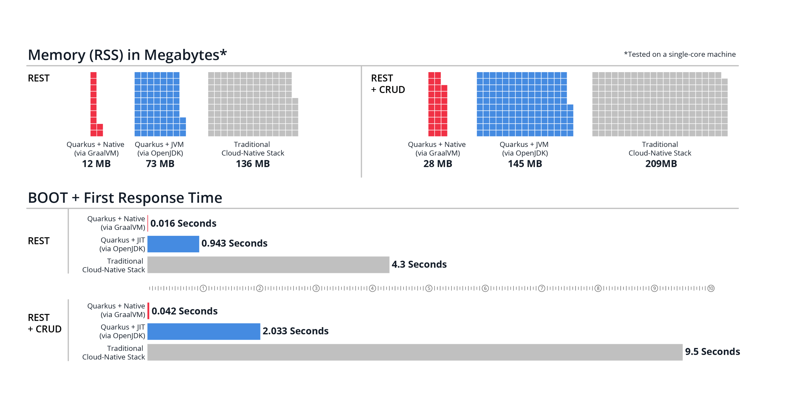

## GraalVM 诞生的背景

过去 20 多年，Java 通过语言层虚拟化，实现了`平台无关`、`架构中立`等特性，彻底屏蔽了不同操作系统、不同指令集架构带来的差异，因而 Java 语言也取得了巨大的成功。但随着云原生时代的到来，面对相同的问题，云原生选择了操作系统层虚拟化方案——通过容器实现不可变基础设施，将程序连同它的运行环境一起封装到镜像里，这种方案越来越成为一种主流的应用程序分发方式。

云原生的兴起，同时也促进了微服务、`Serverless` 等技术发展，它们**对镜像体积、内存消耗、启动速度，以及达到最高性能的时间等方面提出了新的要求**，而这些却是 Java 语言所不擅长的领域。由于 Java 基于 JVM 虚拟机运行，哪怕再小的程序都需要带着完整的虚拟机和标准类库，使得镜像拉取和容器创建的效率降低。此外，Java 语言还存在**基础内存开销和冷启动**等问题，这些问题限制了 Java 语言在云原生环境下的应用。

为了紧跟云原生时代的发展，应对来自 Go、Rust 等原生语言的挑战，Java 社区提出了 `GraalVM` 方案，即通过 GraalVM 中的 `AOT` 提前编译技术，将 Java 生成的字节码文件，提前编译生成二进制的机器码，从而**规避冷启动以及依赖 JVM 运行带来的诸多问题**。

## 初识 GraalVM AOT 编译

### GraalVM 简介

GraalVM 是一个**高性能、支持多种编程语言的执行环境**。它既可以在传统的 OpenJDK 上运行，也可以通过 AOT（`Ahead-Of-Time`）**编译成可执行文件单独运行**，甚至可以**集成到数据库中运行**。除此之外，它还移除了编程语言之间的边界，并且支持通过即时编译技术，将混杂了不同编程语言的代码编译到同一段二进制中，从而**实现不同语言之间的无缝切换**。

上图展示了 GraalVM 作为开放生态系统的体系结构，上层虚拟化层展示了 GraalVM 支持的编程语言，包括了：**基于 JVM 的 Java、Kotlin、Scala，动态语言 JavaScript、Ruby、R、Python，以及基于 LLVM 的 C、C++ 和 Rust**。这些语言经过 GraalVM 编译，可以运行在 OpenJDK、NodeJs 及 Oracle 数据库中，也可以作为二进制程序独立运行。

可以看到 GraalVM 对多语言及多运行环境提供了强大的支持，本文先重点关注 GraalVM AOT 技术在 Java 语言上的应用，其他相关的 GraalVM 主题我们在后续的文章中再做探讨。

### AOT 编译简介

**那么什么是 AOT 技术呢**？熟悉 C、C++ 语言的同学对这个概念一定不陌生，所谓 AOT 编译，是指**在程序运行之前**，便将程序源码或字节码转换为机器码的过程，编译完成后的输出的是可执行文件或者动态链接库文件。和 AOT 编译相对的是 JIT 编译，JIT 编译是指**在程序运行过程中**，将字节码编译为可在硬件上直接执行的机器码，在 Java 语言中，HotSpot 虚拟机会将热点代码通过 JIT 编译器编译为机器码，从而提升程序的执行性能。

下图展示了 AOT 和 JIT 编译的运行流程，他们都需要通过 `javac` 编译器将 Java 源码编译为 Java 字节码。AOT 和 JIT 编译的差异主要体现在获得字节码后如何执行，传统的 Java 程序会运行在 JVM 之上，JVM 会通过解释执行的方式执行字节码逻辑，如果执行的代码是热点代码，则会通过 JIT 即时编译器，将字节码编译为二进制代码。AOT 编译则脱离了 JVM 运行时环境，直接通过 GraalVM 编译器将 Java 字节码编译为二进制文件，然后直接在操作系统上运行。

AOT 编译最突出的特点是脱离了 JVM 运行时环境，直接编译生成二进制可执行文件，**无需在程序运行过程中耗费 CPU 资源来进行即时编译，程序能够在启动后立刻达到期望的最佳性能**。下图展示了 [Quarkus 框架](https://cn.quarkus.io/)使用 GraalVM AOT 性能对比，可以看到使用 AOT 编译后的程序消耗内存更少，并且启动后首次执行的耗时大幅度缩短。

### AOT 编译的优势和劣势

混迹于技术圈的朋友，可能都听过这句话——**没有银弹**（欧美传说中，使用银子弹可以杀死吸血鬼、狼人或怪兽，银弹引申为解决问题的有效方法）。对于 AOT 编译技术也是同样，它在带来低内存消耗、快速启动等优势的同时，同样也会带来一些问题，下面我们就来探讨下 AOT 编译的优势和劣势。

TODO

## 结语

TODO
