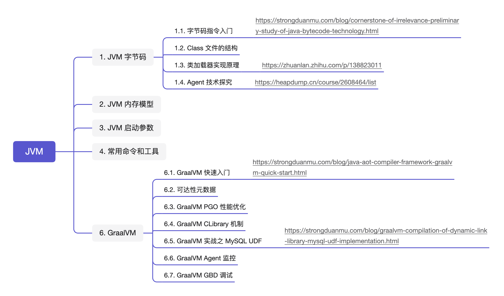

## 前言

JVM 虚拟机原理及其相关的调优技术是每一位 Java 工程师必备的技能，随着 JDK 不断地发展，新的底层实现和调优方法需要我们不断跟进学习。正所谓「**常学常新、常悟常进、常践常得**」，笔者将重新学习和梳理 JVM 虚拟机相关知识，并会整理成博文以加深自己对 JVM 的理解，也希望能够帮助其他学习 JVM 的同学。

## 个人整理

* JVM 知识图谱：[思维导图（密码: y7km）](https://www.mubu.com/doc/MsZQtBYGFR)
* 重学 JVM 第 1 弹：[无关性的基石之 Java 字节码技术初探](https://strongduanmu.com/blog/cornerstone-of-irrelevance-preliminary-study-of-java-bytecode-technology.html)
* 重学 JVM 第 2 弹：TODO
* 重学 JVM 第 3 弹：TODO
* 重学 JVM 第 4 弹：TODO
* 重学 JVM 第 5 弹：TODO
* 重学 JVM 第 6 弹：TODO
* 重学 JVM 第 7 弹：TODO
* 重学 JVM 第 8 弹：TODO
* 重学 JVM 第 9 弹：TODO
* 重学 JVM 第 10 弹：[Java AOT 编译框架 GraalVM 快速入门](https://strongduanmu.com/blog/java-aot-compiler-framework-graalvm-quick-start.html)
* 重学 JVM 第 11 弹：[GraalVM 编译动态链接库之 MySQL UDF 实现](https://strongduanmu.com/blog/graalvm-compilation-of-dynamic-link-library-mysql-udf-implementation.html)

## 网络资料

### 经典书籍

* [JVM 虚拟机规范（SE7）中文版](https://strongduanmu.com/share/jvm/JVM%20%E8%99%9A%E6%8B%9F%E6%9C%BA%E8%A7%84%E8%8C%83%EF%BC%88SE7%EF%BC%89%E4%B8%AD%E6%96%87%E7%89%88.pdf)
* [深入理解Java虚拟机：JVM高级特性与最佳实践（第3版）](https://strongduanmu.com/share/jvm/%E6%B7%B1%E5%85%A5%E7%90%86%E8%A7%A3Java%E8%99%9A%E6%8B%9F%E6%9C%BA%EF%BC%9AJVM%E9%AB%98%E7%BA%A7%E7%89%B9%E6%80%A7%E4%B8%8E%E6%9C%80%E4%BD%B3%E5%AE%9E%E8%B7%B5%EF%BC%88%E7%AC%AC3%E7%89%88%EF%BC%89.pdf)
* [深入理解 JAVA 内存模型](https://strongduanmu.com/share/jvm/%E6%B7%B1%E5%85%A5%E7%90%86%E8%A7%A3%20JAVA%20%E5%86%85%E5%AD%98%E6%A8%A1%E5%9E%8B.pdf)
* [自己动手写 Java 虚拟机](https://strongduanmu.com/share/jvm/%E8%87%AA%E5%B7%B1%E5%8A%A8%E6%89%8B%E5%86%99%20Java%20%E8%99%9A%E6%8B%9F%E6%9C%BA.pdf)

### 综合介绍

* [RednaxelaFX 大神资料合集](https://zhuanlan.zhihu.com/p/25042028)

### 字节码

* [大咖微讲堂之《JVM 字节码的探索与实践应用》](https://heapdump.cn/course/2608464/list)

### GraalVM

* [GraalVM 与 Java 静态编译：原理与应用](https://weread.qq.com/web/bookDetail/05e320207280c16e05e5bc3)
* [Java Developer's Introduction to GraalVM](https://www.youtube.com/watch?v=llmdMhED0Qc)

* [Optimizing Performance with GraalVM](https://archive.qconsf.com/system/files/presentation-slides/qconsf2019-alina-yurenko-jit-vs-aot-performance-with-graalvm.pdf)

* [Run Code in Any Language Anywhere with GraalVM](https://www.youtube.com/watch?v=JoDOo4FyYMU)



欢迎关注「**端小强的博客**」微信公众号，会不定期分享日常学习和工作经验，欢迎大家关注交流。

