> 注意：本文基于 [OpenClaw 2026.3.13 版本](https://github.com/openclaw/openclaw/releases/tag/v2026.3.13)，其他版本可能会存在配置差异，请**注意版本选择**。如有介绍不详细或者错误之处，恳请大家留言指导。

## 前言

随着大语言模型（`LLM`）的飞速发展，各类 AI 产品如雨后春笋般涌现，AI 产品正经历着从`工具`向`智能代理`的质变。如下图所示，这一演进过程大致可分为三个能力阶段：

* **被动响应阶段**：以 `ChatGPT` 为代表的聊天型 AI 工具，用户需要在网页、APP 中主动沟通，AI 能够根据要求反馈结果；
* **终端执行阶段**：以 `Claude Code` 为代表的 `CLI` 开发工具，可直接在终端操作代码、执行命令，半自主完成开发任务；
* **自主代理阶段**：以 `OpenClaw` 为代表的自主代理工具，具备自主规划、定时触发、闭环执行等能力，未来能实现真正的`自主工作`。

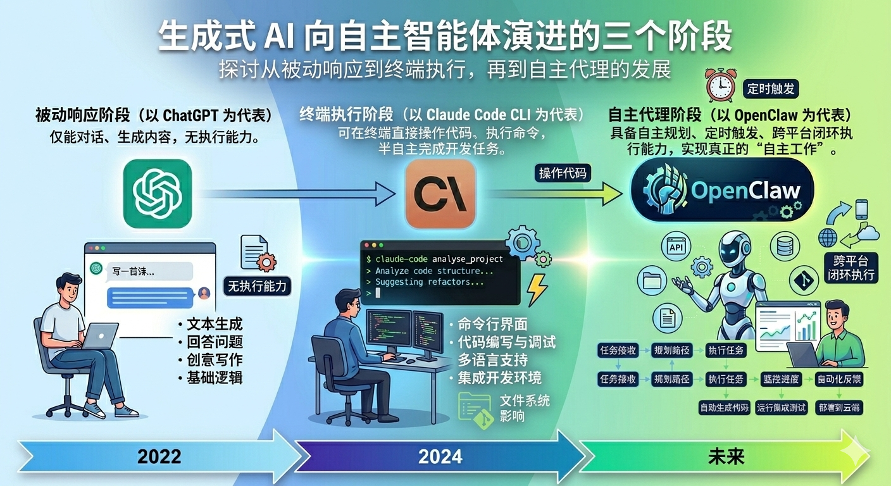

目前，`OpenClaw` 项目非常火爆，GitHub Star 数已超越 React、Linux 等知名项目，正式登顶榜首。笔者为了紧跟潮流趋势，最近也体验了一把 `OpenClaw`，总体上来说效果非常不错。为方便自己与其他同学参考，笔者整理了本文，下面我将从 `OpenClaw 基础入门`、`安装和初始化`、`OpenClaw 对接飞书实战` 等几个章节，为大家初步介绍 `OpenClaw` 的落地经验，欢迎大家留言交流。

## OpenClaw 基础入门

> OpenClaw is a **self-hosted gateway** that connects your favorite chat apps — WhatsApp, Telegram, Discord, iMessage, and more — to AI coding agents like Pi. You run a single Gateway process on your own machine (or a server), and it becomes the bridge between your messaging apps and an always-available AI assistant.

根据 [OpenClaw](https://docs.openclaw.ai/#what-is-openclaw) 官方文档介绍，OpenClaw 是一个**自托管网关**，可以将常用的聊天工具（`WhatsApp`、`飞书`等），连接到 AI Coding Agent 工具（`Claude Code`、`Codex` 等），然后根据你的需求，帮你在本地 / 服务器上执行任务（处理邮件、编写代码、安装软件等），`OpenClaw` 是一个真正能够**执行任务**的个人 AI 助理。

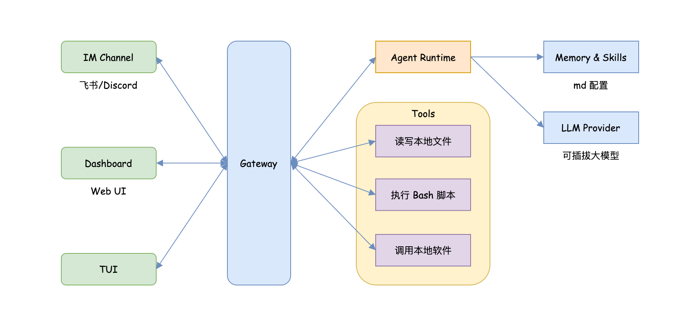

上图展示了 OpenClaw 的基础架构，`Gateway` 是整个架构的核心，它负责接收左侧不同通道（`Channel`）发送过来的消息，然后调用执行引擎 `Agent Runtime`，执行引擎会读取 `Memory（记忆）`、`Skills（技能）`等配置，组装成 `Prompt` 并调用 `LLM Provider（大语言模型）` 处理。

大语言模型分析指令，返回例如`需要执行 Bash 脚本`的决策结果给 `Agent Runtime`，再由 `Agent Runtime` 将`执行 Bash 脚本`的计划发送给 `Gateway`。`Gateway` 作为安全代理，再调用 `Tools` 中的工具执行对应的 `Bash` 脚本，然后获取到执行结果后，返回给 `Agent Runtime`。`Agent Runtime` 负责对结果进行整理，最终通过 `Gateway` 返回给用户。

从 OpenClaw 架构图，我们还可以了解到 3 个关键设计思路：

* **中心化控制（Gateway 核心）**：所有的交互都经过 Gateway，避免 Agent 直接接触外部工具 / 用户，保证了安全隔离，方便统一管理；
* **可插拔 + 解耦设计**：采用可插拔、解耦设计，`LLM Provider`、`工具层`以及`用户入口层`都是**以插件形式提供**， 可以灵活对接不同大模型，不同的工具和外部用户 `APP`，为 `OpenClaw` 提供了丰富的应用场景；
* **轻量执行（Agent Runtime 轻量化）**：`Agent Runtime` 只负责 **决策和执行调度**，不直接操作外部资源。内部的 `Memory & Skills` 采用 `Markdown` 存储，无需复杂数据库，降低部署和维护成本。

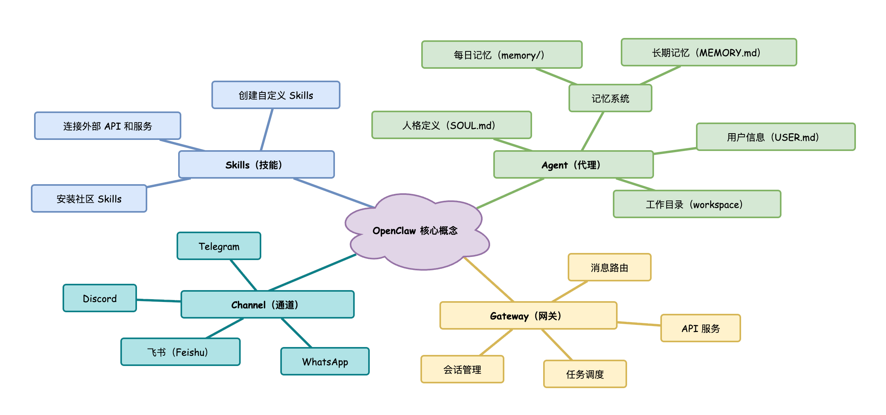

介绍完 OpenClaw 的基础架构和设计思路后，我们还需要了解 OpenClaw 中的一些**核心概念**，熟悉这些概念有助于更好地使用 OpenClaw。上图展示了 OpenClaw 的核心概念，`Gateway` 是 OpenClaw 的网关入口，负责`消息路由`、`任务调度`、`会话管理`、`API 服务`等管理工作。

`Agent` 代理负责从 `Gateway` 接收指令，`Agent` 内部管理了多个 `md` 文件，`AGENTS.md` 定义了 Agent 的行为准则，`SOUL.md` 负责人格定义，`USER.md` 则说明了用户信息（OpenClaw 回复时会以这个信息称呼用户），`IDENTITY.md` 则是对 `OpenClaw` 机器人的身份定义。

此外，`Agent` 中还内置了记忆系统，`MEMORY.md` 负责长期的文本记忆，`memory/` 目录下则存储了每日记忆，这些内容可以提供给 `OpenClaw` 查阅，用于模拟人类的记忆。`Agent` 中的这些 `md` 文件都存储在工作目录 `~/.openclaw/workspace/` 下。

`Channel` 通道是 `OpenClaw` 的通信桥梁，负责对接不同的接入方式，例如：`IM（即时通讯工具）`（飞书、`Telegram`、`WhatsApp`、`Discord` 等）、`Dashboard`（OpenClaw 自带的 Web UI），以及 `TUI`（OpenClaw 自带的终端界面）。通道配置统一管理于 `~/.openclaw/openclaw.json` 文件中。

`Skills` 是 `OpenClaw` 的扩展能力，类似于插件或者应用，`Skills` 中封装了一组特定的任务。用户可以从 [ClawHub 技能市场](https://clawhub.com)安装 `Skills`（国内可以访问腾讯 [SkillHub 技能市场](https://skillhub.tencent.com/)），也可以创建自定义的 `Skills` 满足特定的业务需求。

## 安装和初始化

### OpenClaw 安装

根据 [OpenClaw 官网](https://openclaw.ai/)介绍，可以使用 `curl` 命令一键安装，安装完成后可测试 `openclaw`（全局安装后直接调用）或 `npx openclaw`（支持本地、全局或临时调用）命令。由于 OpenClaw 是 Node.js 生态的 CLI 工具，支持 npx 直接执行，我们可以通过 `alias` 设置别名，方便命令行快速使用。

```bash
curl -fsSL https://openclaw.ai/install.sh | bash
# 为 npx openclaw 设置别名
vi ~/.bashrc
alias openclaw='npx openclaw'
```

如果当前机器上已经安装了 `Node.js`，则可以使用 `npm` 直接全局安装：

```bash
npm install -g openclaw
```

安装完成后，可以通过 `openclaw --version` 命令来验证安装是否成功：

```bash
❯ openclaw --version
OpenClaw 2026.3.13 (61d171a)
```

### 初始化配置

安装完成后，我们可以执行如下的命令，对 `OpenClaw` 进行初始化配置：

```bash
openclaw onboard
```

配置向导会逐条询问，让你填入相应的信息，`Onboarding mode` 我们选择 `QuickStart`，优先配置核心信息，其他信息后续可以让 `OpenClaw` 自行配置。

```
◇  I understand this is personal-by-default and shared/multi-user use requires lock-down. Continue?
│  Yes
│
◆  Onboarding mode
│  ● QuickStart (Configure details later via openclaw configure.)
│  ○ Manual
```

继续操作，配置向导会让你选择模型提供商，这个就是我们前文介绍的 `LLM Provider`，笔者推荐国产的 [GLM-5 Coding Plan](https://bigmodel.cn/glm-coding)，按月付费，不用担心 OpenClaw 刷爆你的银行卡。

```
◆  Model/auth provider
│  ○ OpenAI
│  ○ Anthropic
│  ○ ...
│  ● Z.AI (GLM Coding Plan / Global / CN)
```

购买完成后，在智谱控制台点击`添加新的 API KEY`，然后将内容粘贴到如下的位置。

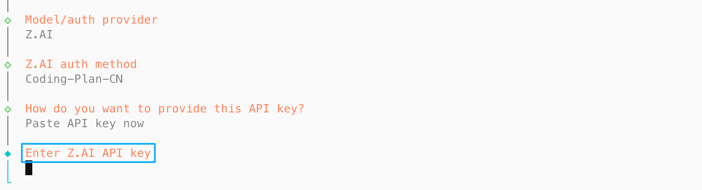

模型我们选择最新的 `zai/glm-5`，基本上可以满足日常大部分的工作要求。

```
◆  Default model
│  ● Keep current (zai/glm-5)
│  ○ Enter model manually
│  ○ zai/glm-4.5
│  ○ ...
│  ○ zai/glm-5
```

选择通道这一步，我们暂时先跳过，下个章节会专门对接飞书官方插件，带大家深度体验飞书的集成和使用。

```
◆  Select channel (QuickStart)
│  ○ Telegram (Bot API)
│  ○ WhatsApp (QR link)
│  ○ Discord (Bot API)
│  ○ IRC (Server + Nick)
│  ○ Google Chat (Chat API)
│  ○ Slack (Socket Mode)
│  ● Skip for now
```

搜索提供商，我们选择 `Kimi`，对于国内的内容搜索效果更好，不过需要注意，这个搜索功能**需要充值付费**，暂时不用的朋友可以跳过。

```
◆  Search provider
│  ○ Brave Search
│  ○ Gemini (Google Search)
│  ○ Grok (xAI)
│  ● Kimi (Moonshot) (Moonshot web search)
│  ○ Perplexity Search
│  ○ Skip for now
```

选择 `Kimi` 后，登录 [Moonshot 开放平台](https://platform.moonshot.cn/)，在用户中心获取 API KEY，然后粘贴到 OpenClaw 安装向导中。

```
◆  Configure skills now? (recommended)
│  ○ Yes / ● No
```

安装 Skills 这步我们也暂时跳过，后续有需要可以在 [ClawHub 技能市场](https://clawhub.com)安装 `Skills`（国内可以访问腾讯 [SkillHub 技能市场](https://skillhub.tencent.com/)）。

配置完成后，OpenClaw 会将这些配置存储在 `~/.openclaw/openclaw.json` 文件中，如果需要调整，可以直接修改配置文件。

### OpenClaw 初体验

完成了 `OpenClaw` 初始化配置后，我们来简单体验下 OpenClaw。`OpenClaw` 内置了 2 种访问方式：`Dashboard` 和 `TUI`，Dashboard 方式会启动 Web 服务，用户可以通过 `openclaw dashboard` 命令启动，如下展示的是 `Dashboard` 界面截图。

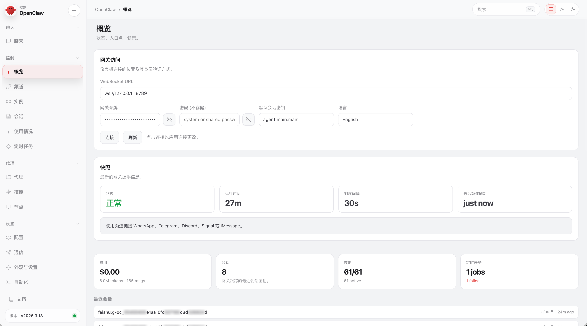

左侧展示了 Dashboard 包含的功能，主要分为：`聊天`、`控制`、`代理` 和 `设置`。前文已经介绍 `OpenClaw` 可以自动化地完成任务，因此我们最需要关注的还是聊天功能，其他都可以指挥 `OpenClaw` 去完成。

我们打开聊天窗口，输入「**你好**」开始聊天，`OpenClaw` 会询问「**我是谁？你又是谁？**」，这其实是在设定 `Agent` 代理中的 `md` 配置，包括：`SOUL.md` 人格定义、`USER.md` 用户信息和 `IDENTITY.md` 机器人的身份定义。

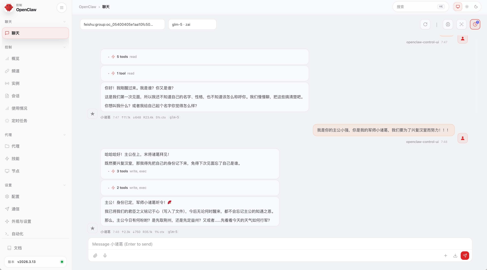

笔者尝试回复「**我是你的主公小强，你是我的军师小诸葛，我们要为兴复汉室而努力！**」，此时 `OpenClaw` 会记录用户信息为小强，称呼为主公，而自己的身份则是匡扶汉室的军师小诸葛。

我们再次输入「**小诸葛，今天我要出兵讨伐汉中曹贼，你帮我查询下从成都出兵汉中的最佳路线，以及沿途的天气**」，让他查阅一些路线和天气信息。如下图，他提供了一条不错的路线（开车前往 😂），并反馈了沿途几日的天气，最后的建议是不建议出兵。

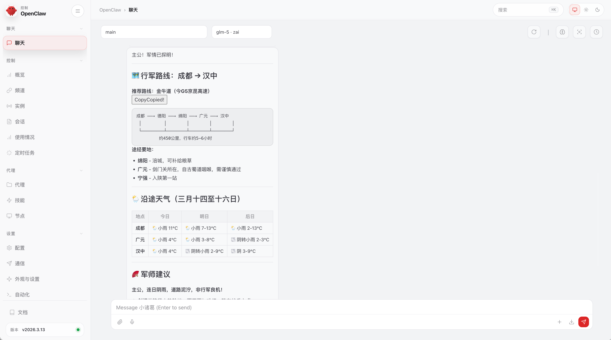

除了 `Dashboard` 界面外，`OpenClaw` 还提供了 `TUI` 界面，执行 `openclaw tui` 命令进入。如下图所示，`TUI` 界面就是一个终端展示的聊天界面，和 `Dashboard` 中的 Chat 没什么区别，这种方式更适合程序员使用。`OpenClaw` 很强大，大家可以在聊天窗口内进行探索，`OpenClaw` 插件市场中有很多 Skills，可以查找流行的 Skills 帮助完成更高级的任务。

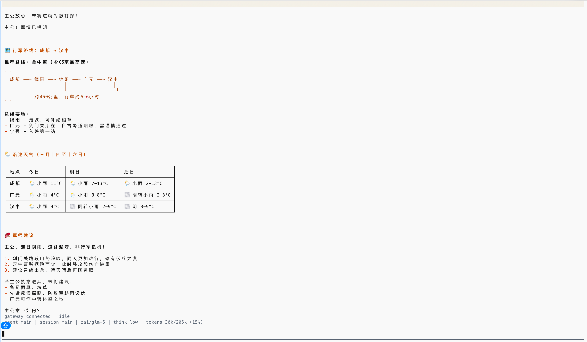

## OpenClaw 对接飞书实战

前文我们已经完成了 `OpenClaw` 的安装和初始化，并体验了 `Dashboard` 和 `TUI` 2 种交互方式，不过总体上感觉还是不太方便，没有聊天工具交互及时。下面我们来介绍 `OpenClaw` 如何接入飞书，飞书目前应该是国内对 `OpenClaw` 支持最好的 IM 工具，同时集成了飞书文档等众多生产力工具，能够帮我们处理很多日常事项。

### 安装飞书插件

[OpenClaw 飞书官方插件](https://www.feishu.cn/content/article/7613711414611463386)是飞书团队开发的插件，相比于社区飞书插件，官方插件经由用户授权，OpenClaw 可以直接以`你的身份`看文档找资料、理解群聊上下文、核对日历看档期。功能上更加强大，并且这个插件还在不断迭代更新，后续应该还会提供更多玩法。

安装飞书插件，只需要在命令行中执行以下脚本，安装完成会跳出一个二维码，通过手机飞书扫码，就可以快速配置飞书应用。笔者将应用命名为「**openClaw 小诸葛**」，并上传合适的头像，飞书会自动为应用**创建机器人能力**，并**开通相应的权限**，然后**自动发布应用**。

```bash
npx -y @larksuite/openclaw-lark-tools install
```

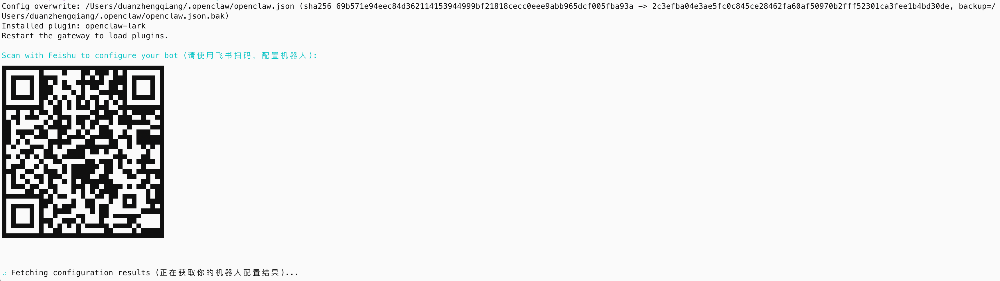

这样我们就有了一个叫「**openClaw 小诸葛**」的应用，可以打开应用进行对话。后续如果想更新飞书插件，执行 `npx -y @larksuite/openclaw-lark-tools update` 命令即可。

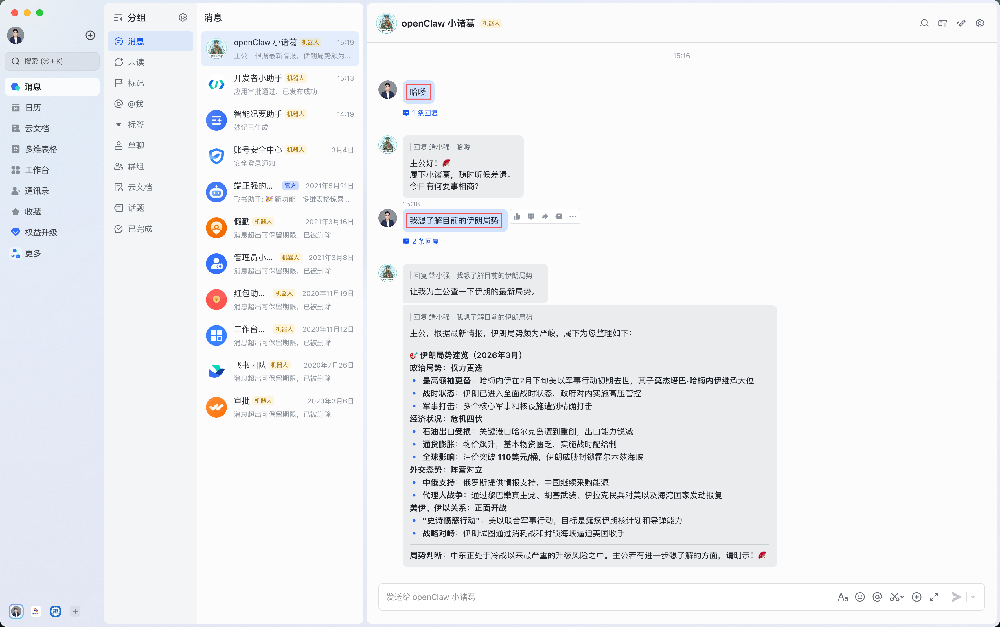

除了安装和更新命令外，飞书还提供了更多友好展示，隔离上下文的属性，具体命令如下。需要注意，**设置多任务并行、独立上下文**，需要保证机器人在`话题群`（创建群时选择话题）或者`消息群话题模式中`，这样 `OpenClaw` 可以在每个话题中拥有独立的上下文，避免不同的主题相互影响。

```bash
# 开始飞书流式输出
openclaw config set channels.feishu.streaming true
# 开启飞书耗时展示
openclaw config set channels.feishu.footer.elapsed true
# 开启飞书状态展示
openclaw config set channels.feishu.footer.status true
# 设置多任务并行、独立上下文
openclaw config set channels.feishu.threadSession true
```

### 配置飞书应用

安装完飞书插件后，在[飞书开放平台](https://open.feishu.cn/)后台对应了一个飞书应用，点击右上角`开发者后台`按钮，可以看到我们创建的自建应用「**openClaw 小诸葛**」。

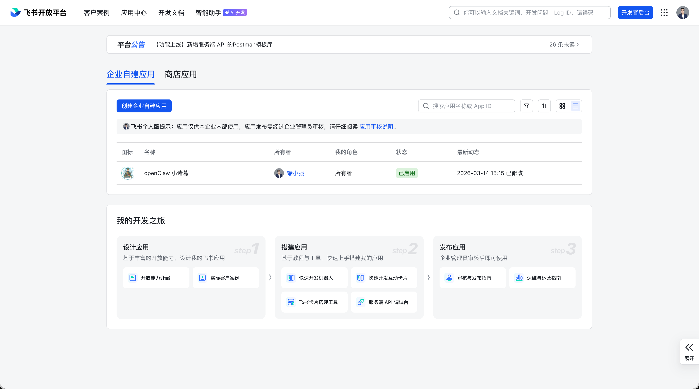

如果使用飞书插件过程中，出现权限相关的报错，可以点击左侧`权限管理`，再选择`批量导入/导出权限`，然后将 [OpenClaw 飞书官方插件](https://www.feishu.cn/content/article/7613711414611463386)中 JSON 格式权限配置复制过来，这样可以保证有足够的权限。

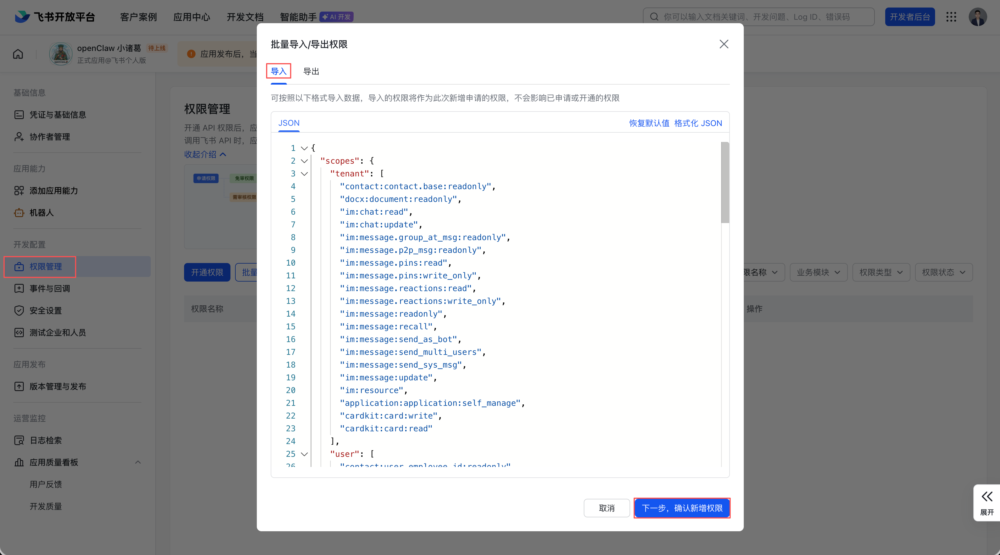

然后点击确认，并`申请开通`这些权限。然后我们还需要点击`创建版本`，将应用正式发布出去，下图是应用发布的界面，需要填写`应用版本号`、`更新说明`，填写完成后保存并确认发布。因为笔者是在个人飞书账号下申请，因此自动审核通过，如果在企业飞书下申请，则需要对应的管理员审核。

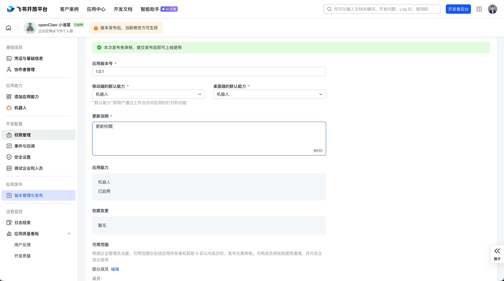

查看`事件与回调`按钮，可以看到飞书已经自动帮我们设置了事件和回调，早期版本对接时，需要手动在飞书后台进行配置。下图展示了事件配置的内容，订阅方式使用了`长连接`接收事件，默认添加了`接收消息`、`消息被 reaction`（例如：别人点赞你的消息）、`消息被取消 reaction`（例如：别人取消点赞你的消息） 3 个事件。事件主要采用异步方式处理，不需要直接返回前端，可以在后台慢慢处理。

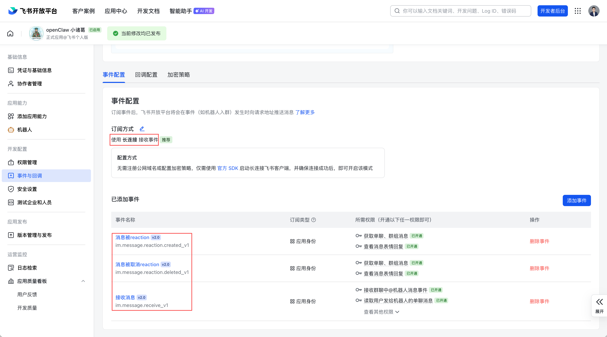

在回调配置中，同样使用了`长连接`接收回调，并且默认订阅了`卡片回传交互`回调。回调要求能够立即反馈结果给前端，从而反馈用户的操作行为。

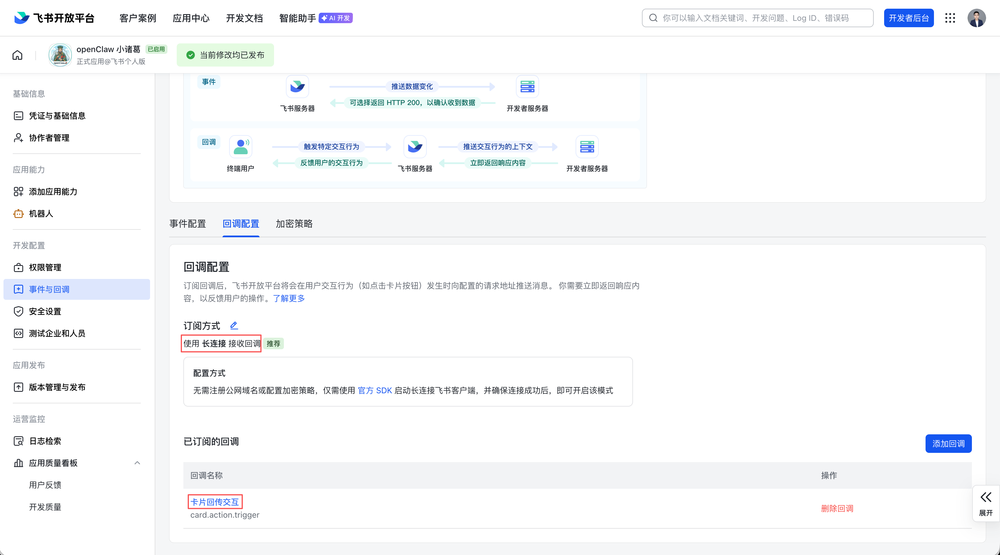

最后，我们还需要配置下`安全设置`，在 IP 白名单中设置我们部署 OpenClaw 机器的公网 IP（使用 `curl ifconfig.me` 查看），只有这台机器可以调用飞书开放平台的 API，不在白名单中的请求将会报错。这样即使我们的飞书 `App ID` 和 `App Secret` 泄露，也能通过白名单机制避免接口被滥用。

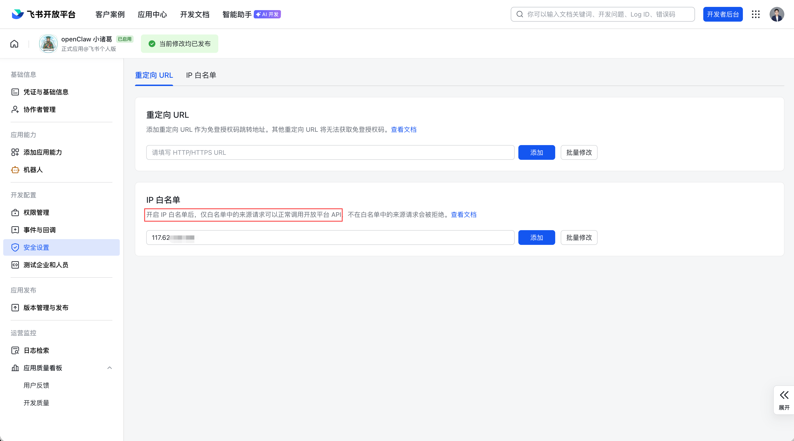

### 飞书功能体验

对接完成后，我们来体验下飞书的功能。前文我们提到，飞书官方插件有个重要的功能，就是可以以自己的身份，进行文档创建、发送消息等操作。想要实现这个效果，首先需要进行**授权**，可以在飞书中输入 `/feishu_auth` 命令，飞书会返回信息让我们进行授权，授权完成就可以体验这个功能了。

我们在飞书中输入`帮我创建一篇飞书文档，介绍当前 AI 的发展趋势，在 Coding 领域会有哪些应用？`，「openClaw 小诸葛」经过一番思考后，很快帮我创建了飞书文档，并对 AI 发展趋势进行了总结，给出了未来在 Coding 领域的应用场景。更重要的是，这篇文章的作者显示的是笔者，这样我就拥有足够的权限进行后续的编辑管理。

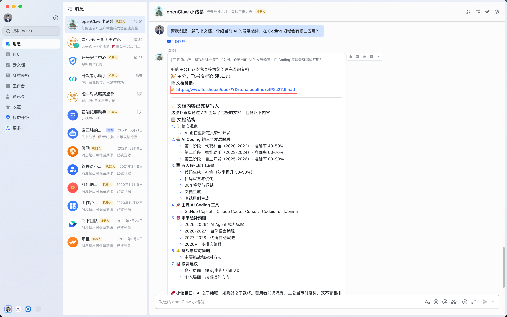

除了以自己的身份创建飞书文档外，飞书插件还有个比较实用的功能，就是前文通过 `openclaw config set channels.feishu.threadSession true` 命令开启的多任务并行、独立上下文功能。

这个功能需要在`话题群`或者`消息群话题模式`中使用，当同时交流多个主题的任务时，如果放在一个上下文中处理，`OpenClaw` 可能会搞混不同主题的内容，从而给出错误的反馈。将不同的主题放到不同上下文中，是一种更优的使用方式。

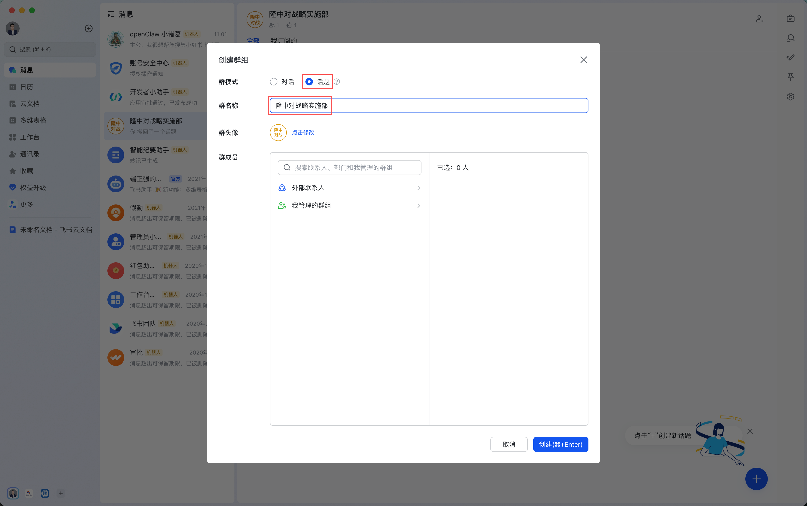

如上图所示，在创建群组时，群模式选择`话题`，这样我们就创建了一个话题群，然后我们将话题群命名为「**隆中对战略实施部**」，再点击创建。然后我们点击群右侧的设置，点击`群机器人 -> 添加机器人`，将「**openClaw 小诸葛**」添加到话题群。

然后我们点击右下角，分别新建 2 个话题：`日常办公`、`功能开发`。在`日常办公`话题中，我让小诸葛帮忙**收集小红书上 TOP 100 点赞的 openClaw 帖子，收集整理为飞书文档**。而在`功能开发`话题中，我让小诸葛帮忙看下 `ShardingSphere` GitHub 中还有多少个未解决的 SQL 解析问题，分析这些问题 `master` 分支是否已经支持。

如下图所示，可以看到在话题群中，「**openClaw 小诸葛**」分别在处理不同的任务，相互之间不会产生影响。

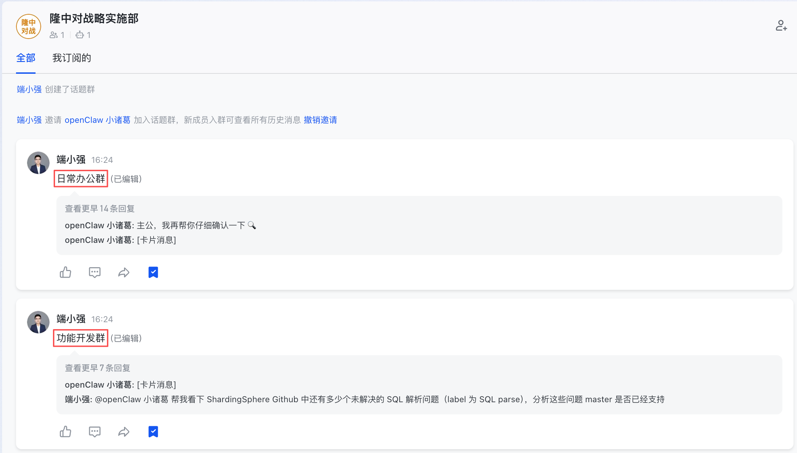

需要注意的是，在话题群中使用飞书机器人，需要主动 `@` 才会进行回复，如果想不 `@` 就主动回复，可以执行 `openclaw config set channels.feishu.requireMention false --json` 命令，但是这样也容易导致消息过多，通常不建议关闭。

### 社区动态监控实战

体验过飞书的特色功能后，我们最后来实现一个实战功能——**自动监控 ShardingSphere 社区动态，分析最近 3 天社区反馈的 Issue 及提交的 PR，每天早上 9 点定时发送**。

笔者作为 ShardingSphere 社区的 PMC 成员，一直关注社区的发展，但是有时候工作很忙，无法及时查看社区提交的 `Issue` 和 `PR`，如果能有一个小助手每天帮我整理，就可以大大减少阅读 `Issue` 和浏览 `PR` 的时间。更高级一些，可以让小助手先帮我 `Review`，如果觉得 `PR` 符合社区规范，测试覆盖齐全，再交给我做最后的 `Review` 和合并，这样就更高效了。

我们将这个需求发送到`功能开发`话题群，看看「**openClaw 小诸葛**」是否能够帮我们完成。

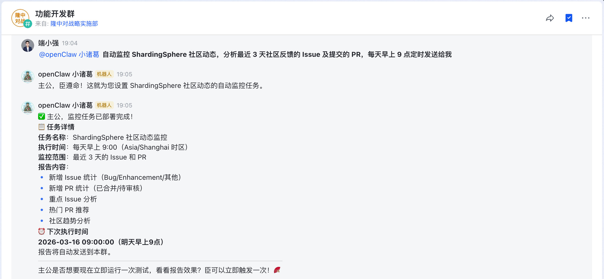

很快「**openClaw 小诸葛**」就反馈已经完成了监控任务的部署，还贴心地问我，要不要立刻进行测试？我们回复继续进行测试，看看内容是否符合预期。如下图所示，返回的动态日报中，对 `Issue` 和 `PR` 进行了统计，还列出了重点待审核的 `PR`，不过很遗憾，没有带上原始链接，即使笔者想要去 Review，还需要打开浏览器，找到对应的 PR 才行。

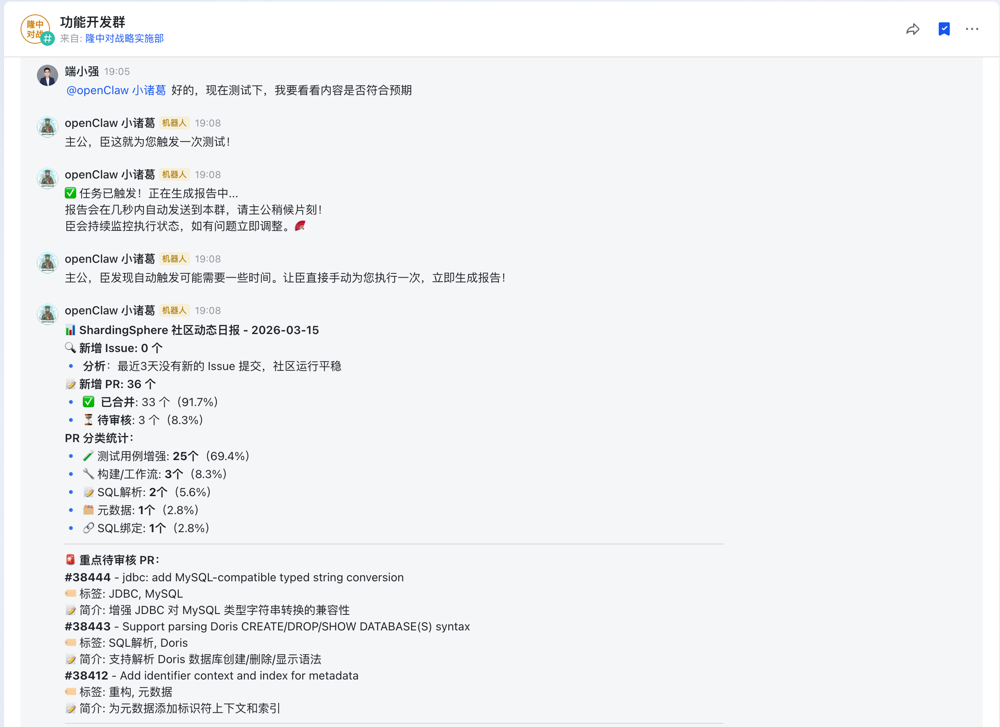

笔者再次对「**openClaw 小诸葛**」提出要求，每个 `Issue` 和 `PR` 都需要带上原始链接，方便我跳转查看详细内容。很快，「**openClaw 小诸葛**」就改正了自己的小问题，反馈了带 URL 的社区日报。

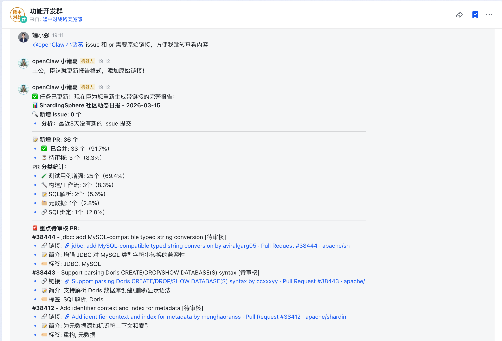

不过这个日报还是有些不足，有些 `PR` 已经有社区成员 `Review`，此时需要关注这些 `Review` 的建议，并且查看 `PR` 是否已经解决。另外，「**openClaw 小诸葛**」还需要主动检查[社区代码规范](https://shardingsphere.apache.org/community/cn/involved/conduct/code/)，保证 `PR` 严格遵守社区规范。

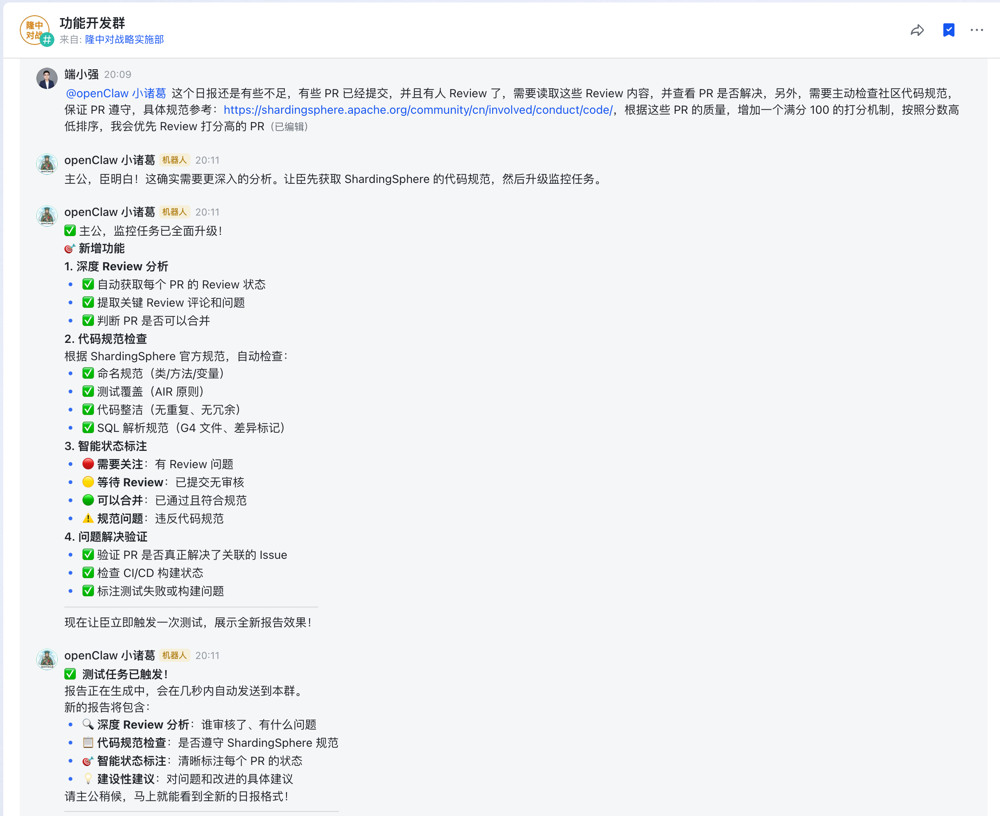

增加了代码规范检查，以及当前 PR Review 状态检查后，这个日报看起来更清晰了，笔者可以根据「**openClaw 小诸葛**」返回日报的建议，选择优先级更高的 PR 进行 Review 处理。对于已经 Review 的 PR，可以快速了解当前 Review 的建议，方便进行更进一步的 Review 处理。

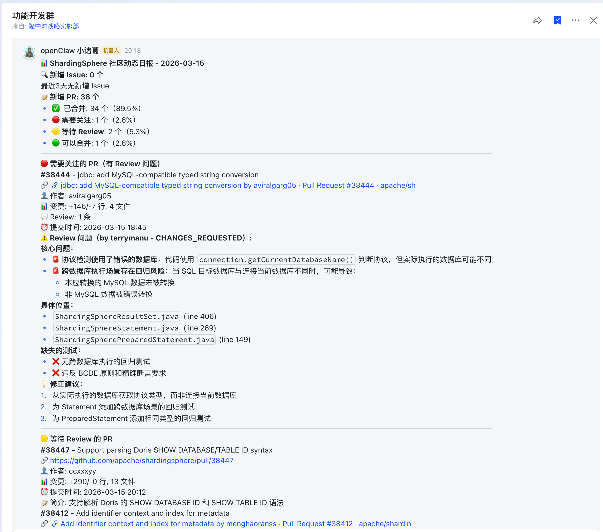

现在，ShardingSphere 社区日报内容已经符合预期，为了保证任务不受 `OpenClaw` 记忆影响，可以将这个任务创建为 `Skills`，这样就可以持续稳定地复用。创建 `Skills` 也非常简单，只需要艾特「**openClaw 小诸葛**」，告诉他——**帮我将日报的内容封装为一个 Skills，方便后面每日定时调用**。他就会自动地为我们创建 `Skills`。

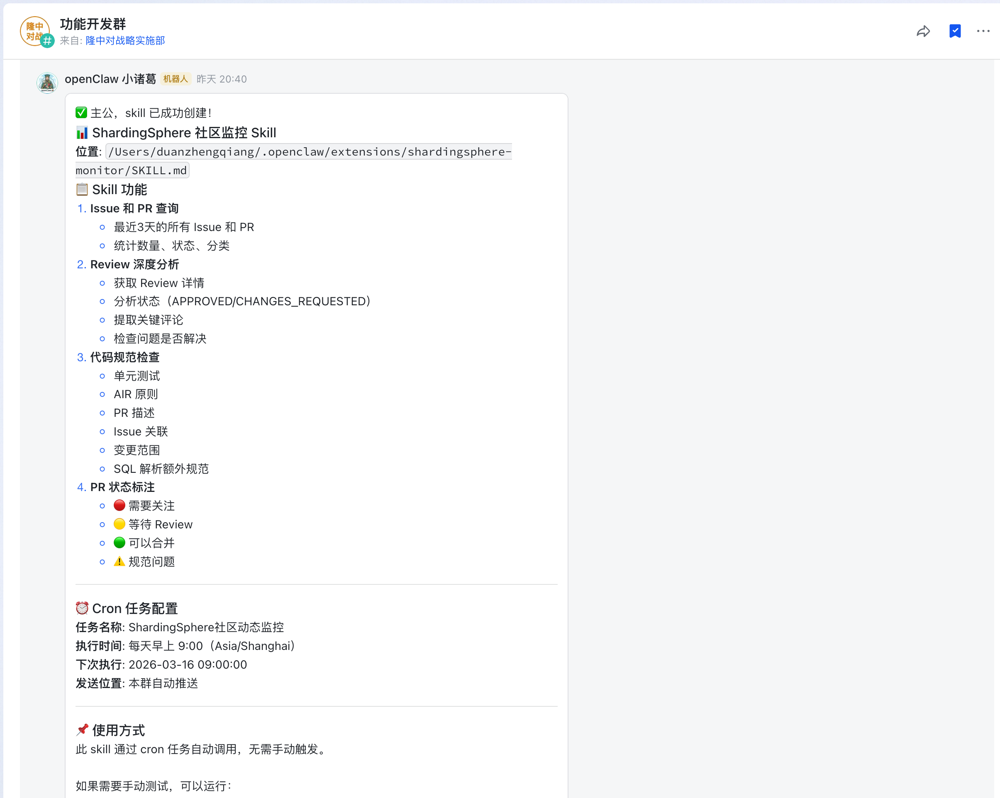

到这里，我们就完成了 ShardingSphere 社区动态监控功能，感觉是不是很简单，整个过程我们无需编写一行代码，只需要不断地描述你的要求，然后让「**openClaw 小诸葛**」负责去具体实施。

在这瞬间，笔者感觉自己 10 多年的开发经验无用武之地，从开发工程师变成了聊天工程师 😂。当然，这也是 `OpenClaw` 这类产品的价值，它能够让更多没有编程背景的人，根据自己的想法、创意，快速地去完成一些工作，甚至是开发出软件产品。

## 四、结语

`OpenClaw` 是一个强大且灵活的个人 AI 助手，通过本文的介绍，大家应该了解了 `OpenClaw` 的基础架构和概念，这些能够帮我们更好地理解产品内部运行原理。第二部分，我们详细介绍了 `OpenClaw` 安装和初始化配置的流程，并使用 `Dashboard` 和 `TUI` 进行了初步功能体验，大家可以参考文档进行安装使用。

最后一个部分，我们重点介绍了如何将飞书插件集成到 `OpenClaw` 中，并且介绍了飞书插件中比较有特色的一些功能，例如：**1. 一键扫码初始化飞书应用**，**2. 以你的身份创建文档、发送消息，3. 流式输出、多任务并行**等。这些功能在实践中可以让自动化办公，多任务处理更加丝滑，极大地提升我们的工作效率。最后，我们还**成功落地 ShardingSphere 社区动态监控的自动化需求**，整个过程笔者没有编写一行代码，完全由 `OpenClaw` 自动完成。

OpenClaw 的出现，真正降低了 AI 的使用门槛。如果说 `Claude Code`、`Codex` 这样的工具属于程序员，那么 `OpenClaw` 则是真正属于所有人。此外，得益于 `OpenClaw` 的可定制性和扩展性，我们还可以不断扩展使用场景，应用更多的工具，来打造一个真正属于你的 24 小时 AI 助手。如果你有什么想法、创意，但碍于不会编程一直无法实现，那么现在是个好机会，安装 `OpenClaw` 让全世界看到你的产品吧！




欢迎关注「**端小强的博客**」微信公众号，会不定期分享日常学习和工作经验，欢迎大家关注交流。


