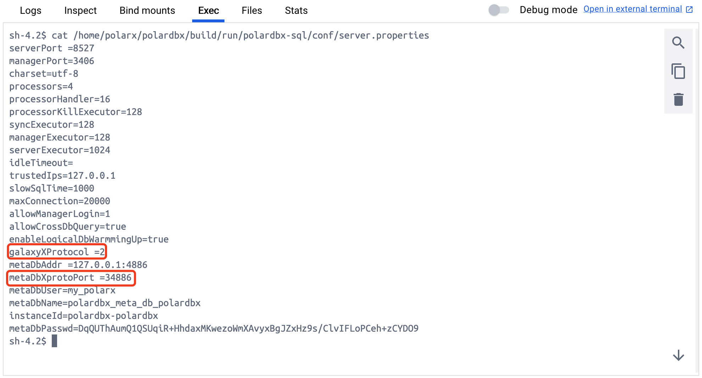
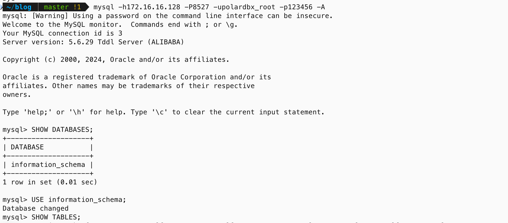

> 注意：本文基于 [PolarDB-X main 分支 6309889](https://github.com/polardb/polardbx-sql/commit/63098891f8ad59d51f1d336db7c46539cc0ed91b) 版本源码进行学习研究，其他版本可能会存在实现逻辑差异，对源码感兴趣的读者**请注意版本选择**。

## 前言

笔者为了学习 `Calcite` 相关的技术，最近尝试在本地搭建 `PolarDB-X` 开发环境，从而可以**深入探索 PolarDB-X 是如何基于 Calcite 构建 HTAP 数据库**。本文记录了完整的搭建过程，并简单介绍了 PolarDB-X 如何使用以及如何跟踪代码，希望能够帮助到对 Calcite 以及 PolarDB-X 感兴趣的朋友。

## PolarDB-X 简介

首先，我们先来了解下 PolarDB-X 数据库，根据[官方文档](https://polardbx.com/document?type=PolarDB-X)介绍，PolarDB-X 是一款面向**超高并发、海量存储、复杂查询场景**设计的云原生分布式数据库系统。其采用 `Shared Nothing` 与存储计算分离架构，支持**水平扩展、分布式事务、混合负载**等能力，具备企业级、云原生、高可用、高度兼容 MySQL 系统及生态等特点。


如上图所示，PolarDB-X 采用 `Shared Nothing` 与`存储计算分离`架构进行设计，系统由 `CN`、`DN`、`GMS` 和 `CDC` 4 个核心组件组成，下面我们简单介绍下不同组件的功能职责。

- 计算节点（`CN, Compute Node`，代码仓库：[polardbx-sql](https://github.com/polardb/polardbx-sql)）：

计算节点是系统的入口，采用无状态设计，包括 `SQL 解析器`、`优化器`、`执行器`等模块。负责数据分布式路由、计算及动态调度，负责分布式事务 2PC 协调、全局二级索引维护等，同时提供 SQL 限流、三权分立等企业级特性。

- 存储节点（`DN, Data Node`，代码仓库：[polardbx-engine](https://github.com/polardb/polardbx-engine)）：

存储节点负责数据的持久化，基于多数派 `Paxos` 协议提供数据高可靠、强一致保障，同时**通过 MVCC 维护分布式事务可见性**。

- 元数据服务（`GMS, Global Meta Service`，代码仓库：[polardbx-engine](https://github.com/polardb/polardbx-engine)）：

元数据服务负责维护全局强一致的 `Table/Schema`、`Statistics` 等系统 `Meta` 信息，维护账号、权限等安全信息，同时**提供全局授时服务**（即 `TSO`）。

- 日志节点（`CDC, Change Data Capture`，代码仓库：[polardbx-cdc](https://github.com/polardb/polardbx-cdc)）：

日志节点提供完全兼容 `MySQL Binlog` 格式和协议的增量订阅能力，提供兼容 `MySQL Replication` 协议的主从复制能力。

## PolarDB-X 开发环境搭建

### 源码下载编译

前文我们介绍了 PolarDB-X 的基本信息，了解到 PolarDB-X 从架构层面主要可以分为：`计算节点 CN`、`存储节点 DN`、`元数据服务 GMS` 以及`日志节点 CDC`。由于笔者学习 PolarDB-X 的重点是计算节点 CN，因此先从 [polardbx-sql](https://github.com/polardb/polardbx-sql) 仓库下载对应的源码，下载完成后使用 IDEA 打开项目，并在项目根目录下，使用 JDK 8 执行 Maven 命令，安装 PolarDB-X 项目所需的依赖：

```bash
# 确保 polardbx-rpc 子模块 (PolarDB-X Glue) 已初始化
git submodule update --init
# 编译打包
mvn install -Denv=release -DskipTests
```

### DN & GMS 初始化

编译打包完成后，我们通过 Docker 镜像拉起 CN 依赖的 DN 和 GMS 服务，执行以下脚本启动容器：

```bash
# 运行 PolarDB-X 远程镜像并建立端口映射
# 默认使用 4886 作为 MySQL 端口，32886 作为私有协议端口
docker run -d --name some-dn-and-gms --env mode=dev -p 4886:4886 -p 32886:32886 polardbx/polardb-x
```

由于 PolarDB-X 的元数据存储在 MetaDB 中，我们需要使用 `mysql -h127.0.0.1 -P4886 -uroot -padmin -D polardbx_meta_db_polardbx -e "select passwd_enc from storage_info where inst_kind=2"` 查看 `metaDbPasswd`。执行出现如下异常，官方文档提供的 `root/admin` 的账号无法连接到 `some-dn-and-gms` 容器提供的 MySQL 服务。

```
mysql: [Warning] Using a password on the command line interface can be insecure.
ERROR 1045 (28000): Access denied for user 'root'@'192.168.65.1' (using password: YES)
```

观察容器输出的日志，可以看到容器内启动了完整的 PolarDB-X 服务，包含了 CN、DN、GMS 等关键组件，输出的日志如下：

```
2024-08-30 09:18:49 JAVA_OPTS : -server -Xms2g -Xmx2g -Dtxc.vip.skip=true -Xss4m -XX:+AggressiveOpts -XX:-UseBiasedLocking -XX:-OmitStackTraceInFastThrow -XX:+UseG1GC -XX:MaxGCPauseMillis=250 -XX:+UseGCOverheadLimit -XX:+ExplicitGCInvokesConcurrent -Djava.awt.headless=true -Dcom.alibaba.java.net.VTOAEnabled=true -Djava.net.preferIPv4Stack=true -Dfile.encoding=UTF-8 -Ddruid.logType=slf4j -Xlog:gc*:/home/polarx/polardbx/build/run/polardbx-sql/bin/../logs/tddl/gc.log:time -XX:+HeapDumpOnOutOfMemoryError -XX:HeapDumpPath=/home/polarx/polardbx/build/run/polardbx-sql/bin/../logs/tddl -XX:+CrashOnOutOfMemoryError -XX:ErrorFile=/home/polarx/polardbx/build/run/polardbx-sql/bin/../logs/tddl/hs_err_pid%p.log
2024-08-30 09:18:49 TDDL_OPTS : -DinitializeGms=false -DforceCleanup=false -DappName=tddl -Dlogback.configurationFile=/home/polarx/polardbx/build/run/polardbx-sql/bin/../conf/logback.xml -Dtddl.conf=/home/polarx/polardbx/build/run/polardbx-sql/bin/../conf/server.properties
2024-08-30 09:18:49 start polardb-x
2024-08-30 09:18:49 cd to /home/polarx for continue
2024-08-30 09:18:49 cn starts.
```

我们进入容器，并查看 `/home/polarx/polardbx/build/run/polardbx-sql/conf/server.properties` 配置的内容，里面包含了启动 CN 所需的 `metaDbPasswd` 配置。

```properties
serverPort =8527
managerPort=3406
charset=utf-8
processors=4
processorHandler=16
processorKillExecutor=128
syncExecutor=128
managerExecutor=128
serverExecutor=1024
idleTimeout=
trustedIps=127.0.0.1
slowSqlTime=1000
maxConnection=20000
allowManagerLogin=1
allowCrossDbQuery=true
enableLogicalDbWarmmingUp=true
galaxyXProtocol =2
metaDbAddr =127.0.0.1:4886
metaDbXprotoPort =34886
metaDbUser=my_polarx
metaDbName=polardbx_meta_db_polardbx
instanceId=polardbx-polardbx
metaDbPasswd=DqQUThAumQ1QSUqiR+HhdaxMKwezoWmXAvyxBgJZxHz9s/ClvIFLoPCeh+zCYDO9
```

我们使用 [PasswdUtil#decrypt](https://github.com/polardb/polardbx-sql/blob/dc06b74cfe71af3a543111fea1de3f5c259faeb9/polardbx-gms/src/main/java/com/alibaba/polardbx/gms/util/PasswdUtil.java#L69) 方法可以将密码解密为明文密码，`dnPasswordKey` 使用默认值 `asdf1234ghjk5678`，解密可以得到明文密码 `qA1(F3$qK4)+R5+wZ5*^*eV0#eB2(iM7_wK9@`，这样我们可以通过 `my_polarx/qA1(F3$qK4)+R5+wZ5*^*eV0#eB2(iM7_wK9@` 访问 DN/GMS 服务，登录后我们可以查看 DN 和 GMS 服务中存储的数据。

```bash
mysql -h127.0.0.1 -P4886 -umy_polarx -p -D polardbx_meta_db_polardbx
# 输入密码 qA1(F3$qK4)+R5+wZ5*^*eV0#eB2(iM7_wK9@
mysql> SHOW DATABASES;
+---------------------------+
| Database                  |
+---------------------------+
| __recycle_bin__           |
| information_schema        |
| mysql                     |
| performance_schema        |
| polardbx_meta_db_polardbx |
| sys                       |
+---------------------------+
6 rows in set (0.04 sec)
```

### IDEA 启动 TddlLauncher

#### IDEA 配置调整

配置完成 DN 和 GMS 后，我们需要修改 `resources/server.properties` 配置，将 `serverPort` 改为 `8527`，`metaDbAddr` 改为 `127.0.0.1:4886`，`metaDbXprotoPort` 改为 `32886`，并增加 `metaDbPasswd=DqQUThAumQ1QSUqiR+HhdaxMKwezoWmXAvyxBgJZxHz9s/ClvIFLoPCeh+zCYDO9`，修改后的完整配置如下：

```properties
# PolarDB-X 服务端口
serverPort=8527
managerPort=3406
# PolarDB-X RPC 端口
rpcPort=9090
charset=utf-8
processors=4
processorHandler=16
processorKillExecutor=128
timerExecutor=8
managerExecutor=256
serverExecutor=1024
idleTimeout=
trustedIps=127.0.0.1
slowSqlTime=1000
maxConnection=20000
allowManagerLogin=1
allowCrossDbQuery=true
galaxyXProtocol=1
# MetaDB 地址
metaDbAddr=127.0.0.1:4886
# MetaDB 私有协议端口
metaDbXprotoPort=32886
# MetaDB 用户
metaDbUser=my_polarx
metaDbName=polardbx_meta_db_polardbx
# PolarDB-X 实例名
instanceId=polardbx-polardbx
# metaDb 密码，通过查询获得
metaDbPasswd=DqQUThAumQ1QSUqiR+HhdaxMKwezoWmXAvyxBgJZxHz9s/ClvIFLoPCeh+zCYDO9
```

然后使用 IDEA 先启动一次 `TddlLauncher` 入口类，然后选择 `Edit Configurations` 修改启动配置，并添加环境变量 `dnPasswordKey=asdf1234ghjk5678`。


然后选择 IDEA 中的 `Preference -> Build,Execution,Deployment -> Build tools -> maven -> importing -> VM options for importer`，并将其设置为 `-Xmx2048m -Xms2048m`。再将 `Preference -> Build,Execution,Deployment -> Compiler -> Build Process -> Shared heap size` 设置为 `4096`。


然后我们修改 `resources/logback.xml` 文件，将日志配置最后的级别改为 `DEBUG`，并输出日志到 `STDOUT`，方便我们学习 PolarDB-X 时在控制台观察日志信息。

```xml
<root level="DEBUG">
    <appender-ref ref="STDOUT"/>
</root>
```

#### ERR_X_PROTOCOL_CLIENT 异常排查

完成 IDEA 配置调整后，我们尝试启动 TddlLauncher，观察启动日志，可以发现如下的错误信息：

```
2024-09-02 08:12:44.168 [main] ERROR com.alibaba.polardbx.CobarConfig - [] Failed to init cobar server.
com.alibaba.polardbx.common.exception.TddlRuntimeException: ERR-CODE: [PXC-10001][ERR_X_PROTOCOL_CLIENT] XDataSource to my_polarx#1c31783e@127.0.0.1:32886 Failed to init new TCP. XClientPool to my_polarx#1c31783e@127.0.0.1:32886 now 0 TCP(0 aging), 0 sessions(0 running, 0 idle), 0 waiting connection. 
	at com.alibaba.polardbx.rpc.compatible.XDataSource.getConnection(XDataSource.java:210)
	at com.alibaba.polardbx.gms.metadb.MetaDbDataSource.initTsoServicesX(MetaDbDataSource.java:139)
	at com.alibaba.polardbx.gms.metadb.MetaDbDataSource.initXDataSourceByJdbcProps(MetaDbDataSource.java:202)
	at com.alibaba.polardbx.gms.metadb.MetaDbDataSource.initMetaDbDataSource(MetaDbDataSource.java:213)
	at com.alibaba.polardbx.gms.metadb.MetaDbDataSource.doInit(MetaDbDataSource.java:135)
	at com.alibaba.polardbx.common.model.lifecycle.AbstractLifecycle.init(AbstractLifecycle.java:43)
	at com.alibaba.polardbx.gms.metadb.MetaDbDataSource.getInstance(MetaDbDataSource.java:530)
	at com.alibaba.polardbx.gms.util.MetaDbUtil.getConnection(MetaDbUtil.java:53)
	at com.alibaba.polardbx.gms.metadb.schema.SchemaChangeAccessor.create(SchemaChangeAccessor.java:79)
	at com.alibaba.polardbx.gms.metadb.schema.SchemaChangeAccessor.doInit(SchemaChangeAccessor.java:75)
	at com.alibaba.polardbx.common.model.lifecycle.AbstractLifecycle.init(AbstractLifecycle.java:43)
	at com.alibaba.polardbx.gms.metadb.schema.SchemaChangeManager.doInit(SchemaChangeManager.java:62)
	at com.alibaba.polardbx.common.model.lifecycle.AbstractLifecycle.init(AbstractLifecycle.java:43)
	at com.alibaba.polardbx.gms.metadb.schema.SchemaChangeManager.getInstance(SchemaChangeManager.java:55)
	at com.alibaba.polardbx.config.loader.ServerLoader.initPolarDbXComponents(ServerLoader.java:222)
	at com.alibaba.polardbx.config.loader.ServerLoader.load(ServerLoader.java:191)
	at com.alibaba.polardbx.config.loader.ServerLoader.doInit(ServerLoader.java:96)
	at com.alibaba.polardbx.common.model.lifecycle.AbstractLifecycle.init(AbstractLifecycle.java:43)
	at com.alibaba.polardbx.CobarConfig.initCobarConfig(CobarConfig.java:80)
	at com.alibaba.polardbx.CobarConfig.<init>(CobarConfig.java:61)
	at com.alibaba.polardbx.CobarServer.<init>(CobarServer.java:154)
	at com.alibaba.polardbx.CobarServer.<clinit>(CobarServer.java:108)
	at com.alibaba.polardbx.server.TddlLauncher.main(TddlLauncher.java:126)
Caused by: com.alibaba.polardbx.common.exception.TddlNestableRuntimeException: Failed to init new TCP. XClientPool to my_polarx#1c31783e@127.0.0.1:32886 now 0 TCP(0 aging), 0 sessions(0 running, 0 idle), 0 waiting connection.
	at com.alibaba.polardbx.rpc.pool.XConnectionManager.getConnection(XConnectionManager.java:514)
	at com.alibaba.polardbx.rpc.compatible.XDataSource.getConnection(XDataSource.java:193)
	... 22 common frames omitted
Caused by: com.alibaba.polardbx.common.exception.TddlNestableRuntimeException: Failed to init new TCP.
	at com.alibaba.polardbx.rpc.pool.XClientPool.getConnection(XClientPool.java:491)
	at com.alibaba.polardbx.rpc.pool.XClientPool.getConnection(XClientPool.java:287)
	at com.alibaba.polardbx.rpc.pool.XConnectionManager.getConnection(XConnectionManager.java:502)
	... 23 common frames omitted
Caused by: com.alibaba.polardbx.common.exception.TddlRuntimeException: ERR-CODE: [PXC-10001][ERR_X_PROTOCOL_CLIENT] XClientPool to my_polarx#1c31783e@127.0.0.1:32886 connect fail. 
	at com.alibaba.polardbx.rpc.pool.XClientPool.getConnection(XClientPool.java:474)
	... 25 common frames omitted
2024-09-02 08:12:44.171 [main] ERROR com.alibaba.polardbx.server.TddlLauncher - [] ## Something goes wrong when starting up the tddl server:
 java.lang.ExceptionInInitializerError
	at com.alibaba.polardbx.server.TddlLauncher.main(TddlLauncher.java:126)
Caused by: ERR-CODE: [PXC-10001][ERR_X_PROTOCOL_CLIENT] XDataSource to my_polarx#1c31783e@127.0.0.1:32886 Failed to init new TCP. XClientPool to my_polarx#1c31783e@127.0.0.1:32886 now 0 TCP(0 aging), 0 sessions(0 running, 0 idle), 0 waiting connection. 
	at com.alibaba.polardbx.rpc.compatible.XDataSource.getConnection(XDataSource.java:210)
	at com.alibaba.polardbx.gms.metadb.MetaDbDataSource.initTsoServicesX(MetaDbDataSource.java:139)
	at com.alibaba.polardbx.gms.metadb.MetaDbDataSource.initXDataSourceByJdbcProps(MetaDbDataSource.java:202)
	at com.alibaba.polardbx.gms.metadb.MetaDbDataSource.initMetaDbDataSource(MetaDbDataSource.java:213)
	at com.alibaba.polardbx.gms.metadb.MetaDbDataSource.doInit(MetaDbDataSource.java:135)
	at com.alibaba.polardbx.common.model.lifecycle.AbstractLifecycle.init(AbstractLifecycle.java:43)
	at com.alibaba.polardbx.gms.metadb.MetaDbDataSource.getInstance(MetaDbDataSource.java:530)
	at com.alibaba.polardbx.gms.util.MetaDbUtil.getConnection(MetaDbUtil.java:53)
	at com.alibaba.polardbx.gms.metadb.schema.SchemaChangeAccessor.create(SchemaChangeAccessor.java:79)
	at com.alibaba.polardbx.gms.metadb.schema.SchemaChangeAccessor.doInit(SchemaChangeAccessor.java:75)
	at com.alibaba.polardbx.common.model.lifecycle.AbstractLifecycle.init(AbstractLifecycle.java:43)
	at com.alibaba.polardbx.gms.metadb.schema.SchemaChangeManager.doInit(SchemaChangeManager.java:62)
	at com.alibaba.polardbx.common.model.lifecycle.AbstractLifecycle.init(AbstractLifecycle.java:43)
	at com.alibaba.polardbx.gms.metadb.schema.SchemaChangeManager.getInstance(SchemaChangeManager.java:55)
	at com.alibaba.polardbx.config.loader.ServerLoader.initPolarDbXComponents(ServerLoader.java:222)
	at com.alibaba.polardbx.config.loader.ServerLoader.load(ServerLoader.java:191)
	at com.alibaba.polardbx.config.loader.ServerLoader.doInit(ServerLoader.java:96)
	at com.alibaba.polardbx.common.model.lifecycle.AbstractLifecycle.init(AbstractLifecycle.java:43)
	at com.alibaba.polardbx.CobarConfig.initCobarConfig(CobarConfig.java:80)
	at com.alibaba.polardbx.CobarConfig.<init>(CobarConfig.java:61)
	at com.alibaba.polardbx.CobarServer.<init>(CobarServer.java:154)
	at com.alibaba.polardbx.CobarServer.<clinit>(CobarServer.java:108)
	... 1 more
Caused by: Failed to init new TCP. XClientPool to my_polarx#1c31783e@127.0.0.1:32886 now 0 TCP(0 aging), 0 sessions(0 running, 0 idle), 0 waiting connection.
	at com.alibaba.polardbx.rpc.pool.XConnectionManager.getConnection(XConnectionManager.java:514)
	at com.alibaba.polardbx.rpc.compatible.XDataSource.getConnection(XDataSource.java:193)
	... 22 more
Caused by: Failed to init new TCP.
	at com.alibaba.polardbx.rpc.pool.XClientPool.getConnection(XClientPool.java:491)
	at com.alibaba.polardbx.rpc.pool.XClientPool.getConnection(XClientPool.java:287)
	at com.alibaba.polardbx.rpc.pool.XConnectionManager.getConnection(XConnectionManager.java:502)
	... 23 more
Caused by: ERR-CODE: [PXC-10001][ERR_X_PROTOCOL_CLIENT] XClientPool to my_polarx#1c31783e@127.0.0.1:32886 connect fail. 
	at com.alibaba.polardbx.rpc.pool.XClientPool.getConnection(XClientPool.java:474)
	... 25 more
```

从日志信息可以大致看出，是 CN 节点无法连接到 Docker 容器中的 DN 和 GMS 服务，搜索官方 Issue 列表，发现该问题反馈较多，官方同学之前回复的答案是将 `server.properties` 中的 `galaxyXProtocol` 设置为 1，具体参考 [issues-34](https://github.com/polardb/polardbx-sql/issues/34)，笔者检查了该配置，目前使用的分支已经使用了相同的设置。

最近反馈的 [issues-214](https://github.com/polardb/polardbx-sql/issues/214) 同样记录了该问题，目前还没有解决。笔者查看源码，发现 `galaxyXProtocol` 配置主要用于控制 CN 和 DN/GMS 节点通信的协议，可以配置为 1 和 2，分别对应了 `GALAXY_X_PROTOCOL` 和 `OPEN_XRPC_PROTOCOL` 协议。

```java
String galaxyXProtocol = serverProps.getProperty("galaxyXProtocol");
if (!StringUtil.isEmpty(galaxyXProtocol)) {
    final int i = Integer.parseInt(galaxyXProtocol);
    if (1 == i) {
        XConfig.GALAXY_X_PROTOCOL = true;
        XConfig.OPEN_XRPC_PROTOCOL = false;
    } else if (2 == i) {
        XConfig.GALAXY_X_PROTOCOL = false;
        XConfig.OPEN_XRPC_PROTOCOL = true;
    } else {
        XConfig.GALAXY_X_PROTOCOL = false;
        XConfig.OPEN_XRPC_PROTOCOL = false;
    }
} else {
    XConfig.GALAXY_X_PROTOCOL = false;
    XConfig.OPEN_XRPC_PROTOCOL = false;
}
```

进入容器查看 `server.properties` 配置，可以发现 `galaxyXProtocol` 配置为 `2`，并且私有协议的端口 `metaDbXprotoPort` 配置为 `34886`，正常情况下 CN 和 DN/GMS 通信需要保证协议类型以及端口一致，才能正常通信。



为了保证协议类型和协议端口一致，我们需要重新启动一个容器，并将 `34886` 端口映射到宿主机，执行以下脚本重新启动容器：

```bash
docker stop some-dn-and-gms
docker rm some-dn-and-gms
# 映射 34886 端口
docker run -d --name some-dn-and-gms --env mode=dev -p 4886:4886 -p 34886:34886 polardbx/polardb-x
```

然后修改项目 `resources/server.properties` 配置，将 `galaxyXProtocol` 设置为 2，`metaDbXprotoPort` 设置为 `34886`。

```properties
# PolarDB-X 服务端口
serverPort=8527
managerPort=3406
# PolarDB-X RPC 端口
rpcPort=9090
charset=utf-8
processors=4
processorHandler=16
processorKillExecutor=128
timerExecutor=8
managerExecutor=256
serverExecutor=1024
idleTimeout=
trustedIps=127.0.0.1
slowSqlTime=1000
maxConnection=20000
allowManagerLogin=1
allowCrossDbQuery=true
galaxyXProtocol=2
# MetaDB 地址
metaDbAddr=127.0.0.1:4886
# MetaDB 私有协议端口
metaDbXprotoPort=34886
# MetaDB 用户
metaDbUser=my_polarx
metaDbName=polardbx_meta_db_polardbx
# PolarDB-X 实例名
instanceId=polardbx-polardbx
# metaDb 密码，通过查询获得
metaDbPasswd=DqQUThAumQ1QSUqiR+HhdaxMKwezoWmXAvyxBgJZxHz9s/ClvIFLoPCeh+zCYDO9
```

再次启动 TddlLauncher，并观察启动日志，可以发现 `ERR_X_PROTOCOL_CLIENT` 异常已经解决。

#### SigarException 异常排查

根据日志显示，TddlLauncher 启动过程中又出现了新的错误，具体异常信息如下：

```
0 [main] DEBUG Sigar  - no libsigar-universal64-macosx.dylib in java.library.path
org.hyperic.sigar.SigarException: no libsigar-universal64-macosx.dylib in java.library.path
	at org.hyperic.sigar.Sigar.loadLibrary(Sigar.java:172)
	at org.hyperic.sigar.Sigar.<clinit>(Sigar.java:100)
	at com.alibaba.polardbx.executor.handler.LogicalShowHtcHandler.<clinit>(LogicalShowHtcHandler.java:48)
	at com.alibaba.polardbx.repo.mysql.handler.CommandHandlerFactoryMyImp.<init>(CommandHandlerFactoryMyImp.java:397)
	at com.alibaba.polardbx.repo.mysql.spi.MyRepository.doInit(MyRepository.java:62)
	at com.alibaba.polardbx.common.model.lifecycle.AbstractLifecycle.init(AbstractLifecycle.java:43)
	at com.alibaba.polardbx.repo.mysql.spi.RepositoryFactoryMyImp.buildRepository(RepositoryFactoryMyImp.java:34)
	at com.alibaba.polardbx.executor.repo.RepositoryHolder.getOrCreateRepository(RepositoryHolder.java:54)
	at com.alibaba.polardbx.executor.common.TopologyHandler.createOne(TopologyHandler.java:279)
	at com.alibaba.polardbx.matrix.config.MatrixConfigHolder.initGroups(MatrixConfigHolder.java:844)
	at com.alibaba.polardbx.matrix.config.MatrixConfigHolder.doInit(MatrixConfigHolder.java:172)
	at com.alibaba.polardbx.common.model.lifecycle.AbstractLifecycle.init(AbstractLifecycle.java:43)
	at com.alibaba.polardbx.matrix.jdbc.TDataSource.doInit(TDataSource.java:201)
	at com.alibaba.polardbx.common.model.lifecycle.AbstractLifecycle.init(AbstractLifecycle.java:43)
	at com.alibaba.polardbx.matrix.jdbc.utils.TDataSourceInitUtils.initDataSource(TDataSourceInitUtils.java:33)
	at com.alibaba.polardbx.config.loader.AppLoader.loadSchema(AppLoader.java:121)
	at com.alibaba.polardbx.config.loader.GmsAppLoader.loadApp(GmsAppLoader.java:72)
	at com.alibaba.polardbx.config.loader.BaseAppLoader.loadApps(BaseAppLoader.java:90)
	at com.alibaba.polardbx.config.loader.GmsAppLoader.initDbUserPrivsInfo(GmsAppLoader.java:55)
	at com.alibaba.polardbx.config.loader.GmsClusterLoader.initClusterAppInfo(GmsClusterLoader.java:363)
	at com.alibaba.polardbx.config.loader.GmsClusterLoader.loadPolarDbXCluster(GmsClusterLoader.java:234)
	at com.alibaba.polardbx.config.loader.GmsClusterLoader.loadCluster(GmsClusterLoader.java:213)
	at com.alibaba.polardbx.config.loader.GmsClusterLoader.doInit(GmsClusterLoader.java:178)
	at com.alibaba.polardbx.common.model.lifecycle.AbstractLifecycle.init(AbstractLifecycle.java:43)
	at com.alibaba.polardbx.CobarConfig.doInit(CobarConfig.java:145)
	at com.alibaba.polardbx.common.model.lifecycle.AbstractLifecycle.init(AbstractLifecycle.java:43)
	at com.alibaba.polardbx.CobarServer.doInit(CobarServer.java:213)
	at com.alibaba.polardbx.common.model.lifecycle.AbstractLifecycle.init(AbstractLifecycle.java:43)
	at com.alibaba.polardbx.server.TddlLauncher.main(TddlLauncher.java:128)
```

参考 StackOverflow 上 [Hyperic Sigar Mac Osx Error - No Library](https://stackoverflow.com/questions/11266895/hyperic-sigar-mac-osx-error-no-library) 讨论，需要下载 Mac 平台对应的动态链接库（[hyperic-sigar-1.6.4.tar.gz 下载地址](https://strongduanmu.com/share/polardb-x/hyperic-sigar-1.6.4.tar.gz)），然后将 `libsigar-universal64-macosx.dylib` 拷贝至 `/Library/Java/Extensions/`。由于笔者使用的是最新的 Mac M3 版本，目前官方并未提供 ARM 架构的 sigar 动态链接库，因此只好参考 [CentOS 开发环境搭建笔记](https://strongduanmu.com/blog/centos-dev-environment-setup-note.html)，在虚拟机中安装 CentOS 7，然后通过 IDEA 远程执行功能进行启动。

使用虚拟机启动时，同样会出现 `SigarException`，会提示在 `java.library.path` 中没有 `libsigar-aarch64-linux.so`，我们可以从 [libsigar-aarch64-linux.so](https://strongduanmu.com/share/polardb-x/libsigar-aarch64-linux.so) 下载 Linux 平台下的动态链接库，并将该文件复制到 `java.library.path` 对应的路径中。`java.library.path` 对应的具体路径，我们可以从 TddlLauncher 启动日志中获得，日志中输出的配置为 `java.library.path=/usr/java/packages/lib/aarch64:/lib:/usr/lib`，因此可以执行以下脚本，将动态链接库文件复制到对应目录中。

```bash
# java.library.path=/usr/java/packages/lib/aarch64:/lib:/usr/lib
# 创建 java.library.path 目录
mkdir -p /usr/java/packages/lib/aarch64/
# 复制 libsigar-aarch64-linux.so
cp ~/libsigar-aarch64-linux.so /usr/java/packages/lib/aarch64/
```

然后重启 TddlLauncher，可以发现 SigarException 已经解决，我们使用 `mysql -h172.16.16.128 -P8527 -upolardbx_root -p123456 -A` 访问虚拟机上的 PolarDB-X 服务，可以正常使用执行 SQL 语句。



#### AssertionError: bad type null 异常排查

执行 `SELECT TABLE_SCHEMA, TABLE_NAME, TABLE_TYPE FROM information_schema.TABLES` 语句查询系统表时，出现了如下的 `AssertionError: bad type null` 异常，从堆栈信息看是在优化器部分出现了报错。

```
Caused by: java.lang.AssertionError: bad type null
	at org.apache.calcite.plan.volcano.Dumpers.provenanceRecurse(Dumpers.java:116)
	at org.apache.calcite.plan.volcano.Dumpers.provenance(Dumpers.java:79)
	at org.apache.calcite.plan.volcano.VolcanoPlanner.findBestExp(VolcanoPlanner.java:537)
	at com.alibaba.polardbx.optimizer.core.planner.Planner.getCheapestFractionalPlan(Planner.java:1412)
	at com.alibaba.polardbx.optimizer.core.planner.Planner.optimizeByCBO(Planner.java:1324)
	at com.alibaba.polardbx.optimizer.core.planner.Planner.optimizeByPlanEnumerator(Planner.java:1239)
	at com.alibaba.polardbx.optimizer.core.planner.Planner.sqlRewriteAndPlanEnumerate(Planner.java:1186)
	at com.alibaba.polardbx.optimizer.core.planner.Planner.optimize(Planner.java:1160)
	at com.alibaba.polardbx.optimizer.core.planner.Planner.getPlan(Planner.java:945)
	at com.alibaba.polardbx.optimizer.core.planner.Planner.doBuildPlan(Planner.java:474)
	at com.alibaba.polardbx.optimizer.core.planner.Planner.doBuildPlan(Planner.java:510)
	at com.alibaba.polardbx.optimizer.core.planner.Planner.doPlan(Planner.java:2699)
	at com.alibaba.polardbx.optimizer.core.planner.Planner.plan(Planner.java:375)
	at com.alibaba.polardbx.optimizer.core.planner.Planner.plan(Planner.java:347)
	at com.alibaba.polardbx.optimizer.core.planner.Planner.planAfterProcessing(Planner.java:342)
	at com.alibaba.polardbx.optimizer.core.planner.Planner.plan(Planner.java:311)
	at com.alibaba.polardbx.optimizer.core.planner.Planner.plan(Planner.java:278)
	at com.alibaba.polardbx.repo.mysql.handler.LogicalShowTablesMyHandler.handle(LogicalShowTablesMyHandler.java:95)
	at com.alibaba.polardbx.executor.handler.HandlerCommon.handlePlan(HandlerCommon.java:153)
	at com.alibaba.polardbx.executor.AbstractGroupExecutor.executeInner(AbstractGroupExecutor.java:74)
	at com.alibaba.polardbx.executor.AbstractGroupExecutor.execByExecPlanNode(AbstractGroupExecutor.java:52)
	at com.alibaba.polardbx.executor.TopologyExecutor.execByExecPlanNode(TopologyExecutor.java:50)
	at com.alibaba.polardbx.transaction.TransactionExecutor.execByExecPlanNode(TransactionExecutor.java:141)
	at com.alibaba.polardbx.executor.ExecutorHelper.executeByCursor(ExecutorHelper.java:170)
	at com.alibaba.polardbx.executor.ExecutorHelper.execute(ExecutorHelper.java:92)
	at com.alibaba.polardbx.executor.ExecutorHelper.execute(ExecutorHelper.java:84)
	at com.alibaba.polardbx.executor.PlanExecutor.execByExecPlanNodeByOne(PlanExecutor.java:223)
	at com.alibaba.polardbx.executor.PlanExecutor.execute(PlanExecutor.java:91)
	at com.alibaba.polardbx.matrix.jdbc.TConnection.executeQuery(TConnection.java:737)
	at com.alibaba.polardbx.matrix.jdbc.TConnection.executeSQL(TConnection.java:510)
	... 19 common frames omitted
```

尝试咨询了下 PolarDB-X 社区大佬，反馈日志级别 Debug 会进入优化器更为严格的类型检查，会出现类型一致性的情况，可以通过调整日志级别来解决这个问题。


我们修改 `polardbx-server` 模块下的 `logback.xml` 文件，将 DEBUG 级别为 INFO 级别，然后重启 TddlLauncher 并再次执行系统表查询 SQL。

```xml
<root level="INFO">
    <appender-ref ref="STDOUT"/>
</root>
```

此时 `SELECT TABLE_SCHEMA, TABLE_NAME, TABLE_TYPE FROM information_schema.TABLES LIMIT 5;` 语句可以正常查询出结果。

```sql
mysql> SELECT TABLE_SCHEMA, TABLE_NAME, TABLE_TYPE FROM information_schema.TABLES LIMIT 5;
+--------------------+----------------------------+-------------+
| TABLE_SCHEMA       | TABLE_NAME                 | TABLE_TYPE  |
+--------------------+----------------------------+-------------+
| __cdc__            | __cdc_ddl_record__         | BASE TABLE  |
| __cdc__            | __cdc_instruction__        | BASE TABLE  |
| information_schema | INFORMATION_SCHEMA_TABLES  | SYSTEM VIEW |
| information_schema | INFORMATION_SCHEMA_COLUMNS | SYSTEM VIEW |
| information_schema | SCHEDULE_JOBS              | SYSTEM VIEW |
+--------------------+----------------------------+-------------+
5 rows in set (0.35 sec)
```

## PolarDB-X 入门使用 & Debug

### 创建分片表

前文我们成功地启动了 PolarDB-X 服务，并通过 `mysql -h172.16.16.128 -P8527 -upolardbx_root -p123456 -A` 成功连接上数据库。下面我们参考 [CREATE DATABASE](https://doc.polardbx.com/zh/dev-guide/topics/create-database.html) 和 [CREATE TABLE](https://doc.polardbx.com/zh/dev-guide/topics/create-table.html) 文档，创建测试数据库以及多张分片表，进行简单地功能测试：

```sql
-- 指定分区模式为 Sharding
CREATE DATABASE sharding_db PARTITION_MODE=sharding DEFAULT CHARACTER SET UTF8;
USE sharding_db;

-- 创建 3 张不同维度的分片表
CREATE TABLE `sbtest_sharding_id` (
  `id` int(11) NOT NULL AUTO_INCREMENT,
  `k` int(11) NOT NULL DEFAULT '0',
  `c` char(120) NOT NULL DEFAULT '',
  `pad` char(60) NOT NULL DEFAULT '',
  PRIMARY KEY (`id`)
) DBPARTITION BY HASH(id);
  
CREATE TABLE `sbtest_sharding_k` (
  `id` int(11) NOT NULL AUTO_INCREMENT,
  `k` int(11) NOT NULL DEFAULT '0',
  `c` char(120) NOT NULL DEFAULT '',
  `pad` char(60) NOT NULL DEFAULT '',
  PRIMARY KEY (`id`)
) DBPARTITION BY HASH(k);

CREATE TABLE `sbtest_sharding_c` (
  `id` int(11) NOT NULL AUTO_INCREMENT,
  `k` int(11) NOT NULL DEFAULT '0',
  `c` char(120) NOT NULL DEFAULT '',
  `pad` char(60) NOT NULL DEFAULT '',
  PRIMARY KEY (`id`)
) DBPARTITION BY HASH(c);
```

通过 `SHOW TOPOLOGY FROM sbtest_sharding_id;` 语句可以查看分片表的拓扑结构，因为我们指定的是 `DBPARTITION`，即分库模式，默认会将分片表拆分到 8 个物理库中存储：

```sql
mysql> SHOW TOPOLOGY FROM sbtest_sharding_id;
+------+--------------------------+-------------------------+----------------+-------------------+--------------------+---------------+
| ID   | GROUP_NAME               | TABLE_NAME              | PARTITION_NAME | SUBPARTITION_NAME | PHY_DB_NAME        | DN_ID         |
+------+--------------------------+-------------------------+----------------+-------------------+--------------------+---------------+
|    0 | SHARDING_DB_000000_GROUP | sbtest_sharding_id_85GE |                |                   | sharding_db_000000 | polardbx_dn_0 |
|    1 | SHARDING_DB_000001_GROUP | sbtest_sharding_id_85GE |                |                   | sharding_db_000001 | polardbx_dn_0 |
|    2 | SHARDING_DB_000002_GROUP | sbtest_sharding_id_85GE |                |                   | sharding_db_000002 | polardbx_dn_0 |
|    3 | SHARDING_DB_000003_GROUP | sbtest_sharding_id_85GE |                |                   | sharding_db_000003 | polardbx_dn_0 |
|    4 | SHARDING_DB_000004_GROUP | sbtest_sharding_id_85GE |                |                   | sharding_db_000004 | polardbx_dn_0 |
|    5 | SHARDING_DB_000005_GROUP | sbtest_sharding_id_85GE |                |                   | sharding_db_000005 | polardbx_dn_0 |
|    6 | SHARDING_DB_000006_GROUP | sbtest_sharding_id_85GE |                |                   | sharding_db_000006 | polardbx_dn_0 |
|    7 | SHARDING_DB_000007_GROUP | sbtest_sharding_id_85GE |                |                   | sharding_db_000007 | polardbx_dn_0 |
+------+--------------------------+-------------------------+----------------+-------------------+--------------------+---------------+
8 rows in set (0.06 sec)

mysql> SHOW TOPOLOGY FROM sbtest_sharding_k;
+------+--------------------------+------------------------+----------------+-------------------+--------------------+---------------+
| ID   | GROUP_NAME               | TABLE_NAME             | PARTITION_NAME | SUBPARTITION_NAME | PHY_DB_NAME        | DN_ID         |
+------+--------------------------+------------------------+----------------+-------------------+--------------------+---------------+
|    0 | SHARDING_DB_000000_GROUP | sbtest_sharding_k_Irx4 |                |                   | sharding_db_000000 | polardbx_dn_0 |
|    1 | SHARDING_DB_000001_GROUP | sbtest_sharding_k_Irx4 |                |                   | sharding_db_000001 | polardbx_dn_0 |
|    2 | SHARDING_DB_000002_GROUP | sbtest_sharding_k_Irx4 |                |                   | sharding_db_000002 | polardbx_dn_0 |
|    3 | SHARDING_DB_000003_GROUP | sbtest_sharding_k_Irx4 |                |                   | sharding_db_000003 | polardbx_dn_0 |
|    4 | SHARDING_DB_000004_GROUP | sbtest_sharding_k_Irx4 |                |                   | sharding_db_000004 | polardbx_dn_0 |
|    5 | SHARDING_DB_000005_GROUP | sbtest_sharding_k_Irx4 |                |                   | sharding_db_000005 | polardbx_dn_0 |
|    6 | SHARDING_DB_000006_GROUP | sbtest_sharding_k_Irx4 |                |                   | sharding_db_000006 | polardbx_dn_0 |
|    7 | SHARDING_DB_000007_GROUP | sbtest_sharding_k_Irx4 |                |                   | sharding_db_000007 | polardbx_dn_0 |
+------+--------------------------+------------------------+----------------+-------------------+--------------------+---------------+
8 rows in set (0.01 sec)

mysql> SHOW TOPOLOGY FROM sbtest_sharding_c;
+------+--------------------------+------------------------+----------------+-------------------+--------------------+---------------+
| ID   | GROUP_NAME               | TABLE_NAME             | PARTITION_NAME | SUBPARTITION_NAME | PHY_DB_NAME        | DN_ID         |
+------+--------------------------+------------------------+----------------+-------------------+--------------------+---------------+
|    0 | SHARDING_DB_000000_GROUP | sbtest_sharding_c_nfaT |                |                   | sharding_db_000000 | polardbx_dn_0 |
|    1 | SHARDING_DB_000001_GROUP | sbtest_sharding_c_nfaT |                |                   | sharding_db_000001 | polardbx_dn_0 |
|    2 | SHARDING_DB_000002_GROUP | sbtest_sharding_c_nfaT |                |                   | sharding_db_000002 | polardbx_dn_0 |
|    3 | SHARDING_DB_000003_GROUP | sbtest_sharding_c_nfaT |                |                   | sharding_db_000003 | polardbx_dn_0 |
|    4 | SHARDING_DB_000004_GROUP | sbtest_sharding_c_nfaT |                |                   | sharding_db_000004 | polardbx_dn_0 |
|    5 | SHARDING_DB_000005_GROUP | sbtest_sharding_c_nfaT |                |                   | sharding_db_000005 | polardbx_dn_0 |
|    6 | SHARDING_DB_000006_GROUP | sbtest_sharding_c_nfaT |                |                   | sharding_db_000006 | polardbx_dn_0 |
|    7 | SHARDING_DB_000007_GROUP | sbtest_sharding_c_nfaT |                |                   | sharding_db_000007 | polardbx_dn_0 |
+------+--------------------------+------------------------+----------------+-------------------+--------------------+---------------+
8 rows in set (0.02 sec)
```

### 初始化数据

创建好分片表后，我们再使用 [sysbench](https://github.com/akopytov/sysbench) 工具向 `sbtest1` 表插入 10w 条数据，执行如下脚本初始化数据：

```bash
sysbench /opt/homebrew/Cellar/sysbench/1.0.20_6/share/sysbench/oltp_read_write.lua --tables=1 --table_size=100000 --mysql-user=polardbx_root --mysql-password=123456 --mysql-host=172.16.16.128 --mysql-port=8527 --mysql-db=sharding_db prepare
```

然后可以执行 `INSERT ... SELECT ...` 语句，将 `sbtest1` 中的数据复制到 `sbtest_sharding_id`、`sbtest_sharding_k` 和 `sbtest_sharding_c` 中。

```sql
INSERT INTO sbtest_sharding_id SELECT * FROM sbtest1;
INSERT INTO sbtest_sharding_k SELECT * FROM sbtest1;
INSERT INTO sbtest_sharding_c SELECT * FROM sbtest1;
```

使用 `SELECT COUNT(1)` 检查各个表的数据量，都是 10w 条记录，符合我们的预期。

```sql
mysql> SELECT COUNT(1) FROM sbtest_sharding_id;
+----------+
| COUNT(1) |
+----------+
|   100000 |
+----------+
mysql> SELECT COUNT(1) FROM sbtest_sharding_k;
+----------+
| COUNT(1) |
+----------+
|   100000 |
+----------+

mysql> SELECT COUNT(1) FROM sbtest_sharding_c;
+----------+
| COUNT(1) |
+----------+
|   100000 |
+----------+
```

### 调用流程初探

初始化数据完成后，我们执行如下的关联查询语句，使用 `k` 字段关联 `sbtest_sharding_id` 和 `sbtest_sharding_k` 表，并通过 `LIMIT 10` 获取前 10 条记录，可以看到 PolarDB-X 查询的效率还是挺高的。

```sql
mysql> SELECT sid.* FROM sbtest_sharding_id sid INNER JOIN sbtest_sharding_k sk ON sid.k = sk.k LIMIT 10;
+----+-------+-------------------------------------------------------------------------------------------------------------------------+-------------------------------------------------------------+
| id | k     | c                                                                                                                       | pad                                                         |
+----+-------+-------------------------------------------------------------------------------------------------------------------------+-------------------------------------------------------------+
|  5 | 49982 | 44257470806-17967007152-32809666989-26174672567-29883439075-95767161284-94957565003-35708767253-53935174705-16168070783 | 34551750492-67990399350-81179284955-79299808058-21257255869 |
|  5 | 49982 | 44257470806-17967007152-32809666989-26174672567-29883439075-95767161284-94957565003-35708767253-53935174705-16168070783 | 34551750492-67990399350-81179284955-79299808058-21257255869 |
|  5 | 49982 | 44257470806-17967007152-32809666989-26174672567-29883439075-95767161284-94957565003-35708767253-53935174705-16168070783 | 34551750492-67990399350-81179284955-79299808058-21257255869 |
|  5 | 49982 | 44257470806-17967007152-32809666989-26174672567-29883439075-95767161284-94957565003-35708767253-53935174705-16168070783 | 34551750492-67990399350-81179284955-79299808058-21257255869 |
|  5 | 49982 | 44257470806-17967007152-32809666989-26174672567-29883439075-95767161284-94957565003-35708767253-53935174705-16168070783 | 34551750492-67990399350-81179284955-79299808058-21257255869 |
|  5 | 49982 | 44257470806-17967007152-32809666989-26174672567-29883439075-95767161284-94957565003-35708767253-53935174705-16168070783 | 34551750492-67990399350-81179284955-79299808058-21257255869 |
|  5 | 49982 | 44257470806-17967007152-32809666989-26174672567-29883439075-95767161284-94957565003-35708767253-53935174705-16168070783 | 34551750492-67990399350-81179284955-79299808058-21257255869 |
|  5 | 49982 | 44257470806-17967007152-32809666989-26174672567-29883439075-95767161284-94957565003-35708767253-53935174705-16168070783 | 34551750492-67990399350-81179284955-79299808058-21257255869 |
|  5 | 49982 | 44257470806-17967007152-32809666989-26174672567-29883439075-95767161284-94957565003-35708767253-53935174705-16168070783 | 34551750492-67990399350-81179284955-79299808058-21257255869 |
|  5 | 49982 | 44257470806-17967007152-32809666989-26174672567-29883439075-95767161284-94957565003-35708767253-53935174705-16168070783 | 34551750492-67990399350-81179284955-79299808058-21257255869 |
+----+-------+-------------------------------------------------------------------------------------------------------------------------+-------------------------------------------------------------+
10 rows in set (0.19 sec)
```

通过 EXPLAIN 语句可以查看该语句的执行计划，`LogicalView` 代表了对分片表的访问，括号内表示访问了分片表的哪些物理节点，并显示了对应的下推 SQL。`Gather` 表示对分片表底层的真实表进行了汇总处理，内部访问时采用了并发执行的方式。`HashJoin` 表示该语句物理执行时使用了 `Hash Join` 算法，关联的类型是 `inner`，关联字段是 `k`。`Project` 代表了投影列，我们逻辑 SQL 中指定的是 `sid.*`，PolarDB-X 执行时将 `sid.*` 展开为具体的列。`Limit` 则表示的是逻辑 SQL 中的 `LIMIT 10`，可以看出 PolarDB-X 采用了参数化 Plan 的方式，将字面量 10 转换为了参数形式。

```sql
mysql> EXPLAIN SELECT sid.* FROM sbtest_sharding_id sid INNER JOIN sbtest_sharding_k sk ON sid.k = sk.k LIMIT 10;
+---------------------------------------------------------------------------------------------------------------------------------------------------------------------------+
| LOGICAL EXECUTIONPLAN                                                                                                                                                     |
+---------------------------------------------------------------------------------------------------------------------------------------------------------------------------+
| Limit(offset=0, fetch=?0)                                                                                                                                                 |
|   Project(id="id", k="k", c="c", pad="pad")                                                                                                                               |
|     HashJoin(condition="k = k", type="inner")                                                                                                                             |
|       Gather(concurrent=true)                                                                                                                                             |
|         LogicalView(tables="[000000-000007].sbtest_sharding_id_85GE", shardCount=8, sql="SELECT `id`, `k`, `c`, `pad` FROM `sbtest_sharding_id` AS `sbtest_sharding_id`") |
|       Gather(concurrent=true)                                                                                                                                             |
|         LogicalView(tables="[000000-000007].sbtest_sharding_k_Irx4", shardCount=8, sql="SELECT `k` FROM `sbtest_sharding_k` AS `sbtest_sharding_k`")                      |
| HitCache:true                                                                                                                                                             |
| Source:SPM_ACCEPT                                                                                                                                                         |
| BaselineInfo Id: 1669894141                                                                                                                                               |
| PlanInfo Id: 1700287147                                                                                                                                                   |
| TemplateId: 63888ffd                                                                                                                                                      |
+---------------------------------------------------------------------------------------------------------------------------------------------------------------------------+
12 rows in set (0.13 sec)
```

简单体验了下 PolarDB-X 查询功能后，我们来看看基本的调用流程，前面展示的查询语句，首先会经过 `FrontendCommandHandler` 处理，该类会根据 MySQL 命令类型，将 SQL 请求分发到不同的 `FrontendConnection` 实现类中，此处 `source` 变量对应的子类为 `ServerConnection`，`source.query(data)` 方法则会调用抽象父类 `FrontendConnection#query` 的方法。

```java
/**
 * @param data requests on one connection must be processed sequentially
 */
@Override
synchronized public void handle(byte[] data) {
    source.buildMDC();
    source.setPacketId((byte) (0 & 0xff));
    source.setLastActiveTime(System.nanoTime());
    source.setSqlBeginTimestamp(System.currentTimeMillis());

    switch (data[4]) {
    case Commands.COM_INIT_DB:
        commandCount.doInitDB();
        source.initDB(data);
        break;
    case Commands.COM_PING:
        commandCount.doPing();
        source.ping();
        break;
    case Commands.COM_QUIT:
        commandCount.doQuit();
        source.close();
        break;
    case Commands.COM_QUERY:
        commandCount.doQuery();
        // 调用父类 FrontendConnection#query 方法
        source.query(data);
        break;
        ...
}
```

而 `FrontendConnection#query` 方法则会继续调用 `queryHandler.queryRaw` 方法，queryRaw 方法会根据 SQL 语句的类型，调用不同的 Handler 进行处理，此处调用的是 `SelectHandler.handle(sql, c, rs >>> 8, hasMore)` 处理。

```java
// 执行查询
if (queryHandler != null) {
    queryHandler.queryRaw(mm.bytes(), mm.position(), mm.length() - mm.position(), cs);
} else {
    writeErrMessage(ErrorCode.ER_YES, "Empty QueryHandler");
}
```

内部逻辑会调用到 `TConnection#executeQuery` 方法，该方法是 SQL 执行的核心执行逻辑，包含了**执行计划生成**、**执行计划执行**两个重要步骤。逻辑中通过 `Planner.getInstance().plan(sql, executionContext)` 方法获取执行计划，内部会使用 Calcite 框架，基于 RBO 和 CBO 的优化规则，以及统计信息等计算代价，并生成最优的执行计划。由于执行计划生成相对耗时，因此 PolarDB-X 内部增加了执行计划缓存，用来提升查询的性能。

最优执行计划生成后，会交由执行器负责执行，执行器会根据执行计划中的不同算子，选择不同的执行器，例如：`HashJoin` 算子会选择 `ParallelHashJoinExec` 执行器，以并行的方式完成 Hash Join 的运算逻辑。最终，整个执行计划会由一个个不同的执行器进行计算，然后生成最终的结果集 `ResultCursor`。执行完成后，还会调用 `updateTableStatistic` 方法更新统计信息，从而保证后续执行计划能够生成最优 Plan。

```java
/**
 * Separate execute(sql, ec) into two parts: plan and execute. If it's
 * writing into broadcast table and has no transaction, a new transaction
 * will be open.
 */
private ResultCursor executeQuery(ByteString sql, ExecutionContext executionContext,
                                  AtomicBoolean trxPolicyModified) {
    ...
  	// 获取元数据快照
    final long[] metaVersions = MdlContext.snapshotMetaVersions();

    final Parameters originParams = executionContext.getParams().clone();
  	// 获取执行计划
    ExecutionPlan plan = Planner.getInstance().plan(sql, executionContext);
    ...
    // 如果元数据变更则重建执行计划
    if (trxPolicyModified != null) {
        trxPolicyModified.set(updateTransactionAndConcurrentPolicy(plan, executionContext));
        if (PlanManagerUtil.canOptByForcePrimary(plan, executionContext) && executionContext.isTsoTransaction()) {
            // If this plan can be optimized, rebuild plan.
            plan = rebuildPlan(sql, executionContext, originParams, false);
        }
    }
    ...
    // 调用执行器执行
    ResultCursor resultCursor = executor.execute(plan, executionContext);
  	// 更新表统计信息
    updateTableStatistic(plan, resultCursor, executionContext);
    return resultCursor;
}
```

由于**执行计划生成**、**执行计划执行**内部的逻辑非常复杂，本文就不过多介绍，感兴趣的朋友可以自行探索。后续的文章，我们会逐步探究 PolarDB-X 的实现细节，学习 PolarDB-X 实践 Calcite 框架的宝贵经验，并将这些优化经验用于实际的项目中。

## 结语

本文介绍了 PolarDB-X 开发环境搭建的基本步骤，以及在这个过程中遇到的问题及其解决方案，希望能够帮助大家快速上手 PolarDB-X 进行源码学习。搭建完成后简单介绍了 PolarDB-X 中分片表的创建和使用，借助 `sysbench` 工具，我们初始化了 3 张 10w 数据量的分片表，并展示了不同维度分片表之间的关联查询。

最后，以关联查询 SQL 为例，简单探索了下 PolarDB-X 的调用流程，流程中最核心的逻辑是：**执行计划生成（优化器）和执行计划执行（执行器）**。优化器和执行器的实现逻辑非常复杂，本文没有展开介绍，我们会在后续的文章中继续分享，欢迎感兴趣的朋友持续关注。




笔者因为工作原因接触到 Calcite，前期学习过程中，深感 Calcite 学习资料之匮乏，因此创建了 [Calcite 从入门到精通知识星球](https://wx.zsxq.com/dweb2/index/group/51128414222814)，希望能够将学习过程中的资料和经验沉淀下来，为更多想要学习 Calcite 的朋友提供一些帮助。




欢迎关注「**端小强的博客**」微信公众号，会不定期分享日常学习和工作经验，欢迎大家关注交流。


