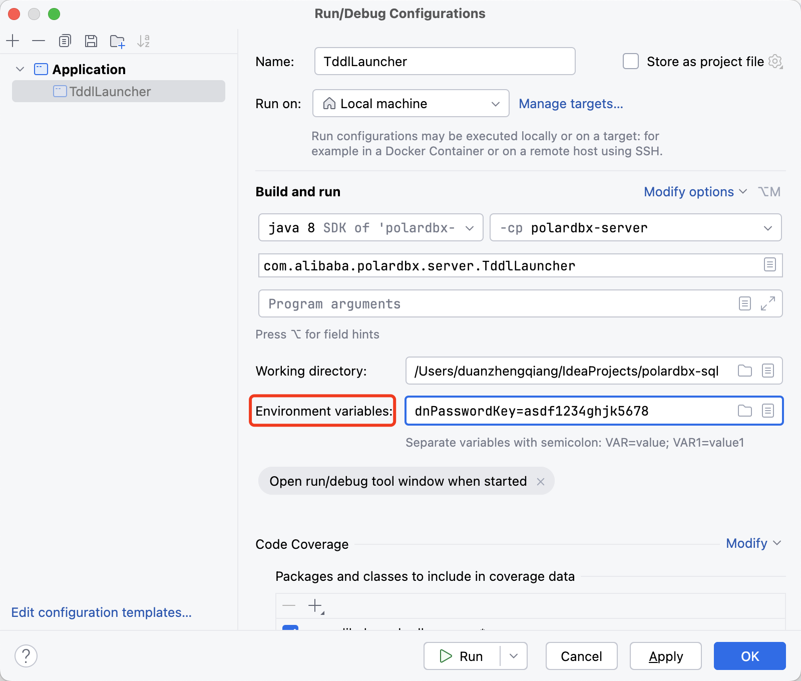
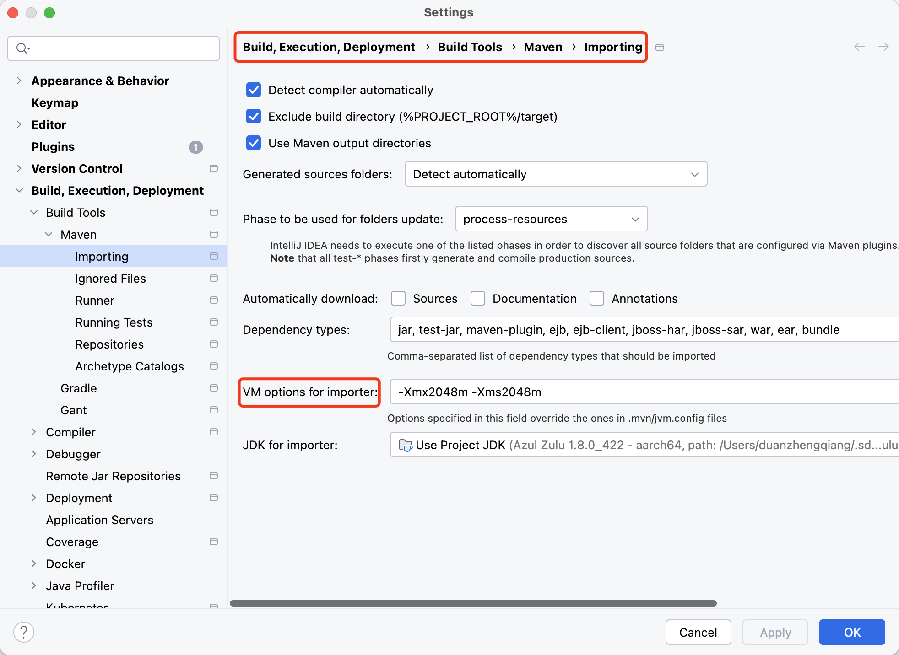

> 注意：本文基于 [PolarDB-X main 分支 6309889](https://github.com/polardb/polardbx-sql/commit/63098891f8ad59d51f1d336db7c46539cc0ed91b) 版本源码进行学习研究，其他版本可能会存在实现逻辑差异，对源码感兴趣的读者**请注意版本选择**。

## 前言

笔者为了学习 `Calcite` 相关的技术，最近尝试在本地搭建 `PolarDB-X` 开发环境，从而可以**深入探索 PolarDB-X 是如何基于 Calcite 构建 HTAP 数据库**。本文记录了完整的搭建过程，希望能够帮助对 Calcite 或者 PolarDB-X 其他功能感兴趣的朋友。

## PolarDB-X 简介

首先，我们先来了解下 PolarDB-X 数据库，根据[官方文档](https://polardbx.com/document?type=PolarDB-X)介绍，PolarDB-X 是一款面向**超高并发、海量存储、复杂查询场景**设计的云原生分布式数据库系统。其采用 `Shared Nothing` 与存储计算分离架构，支持**水平扩展、分布式事务、混合负载**等能力，具备企业级、云原生、高可用、高度兼容 MySQL 系统及生态等特点。


如上图所示，PolarDB-X 采用 `Shared Nothing` 与`存储计算分离`架构进行设计，系统由 `CN`、`DN`、`GMS` 和 `CDC` 4 个核心组件组成，下面我们分别介绍下不同组件的功能职责。

- 计算节点（`CN, Compute Node`，代码仓库：[polardbx-sql](https://github.com/polardb/polardbx-sql)）：

计算节点是系统的入口，采用无状态设计，包括 `SQL 解析器`、`优化器`、`执行器`等模块。负责数据分布式路由、计算及动态调度，负责分布式事务 2PC 协调、全局二级索引维护等，同时提供 SQL 限流、三权分立等企业级特性。

- 存储节点（`DN, Data Node`，代码仓库：[polardbx-engine](https://github.com/polardb/polardbx-engine)）：

存储节点负责数据的持久化，基于多数派 `Paxos` 协议提供数据高可靠、强一致保障，同时**通过 MVCC 维护分布式事务可见性**。

- 元数据服务（`GMS, Global Meta Service`，代码仓库：[polardbx-engine](https://github.com/polardb/polardbx-engine)）：

元数据服务负责维护全局强一致的 `Table/Schema`、`Statistics` 等系统 `Meta` 信息，维护账号、权限等安全信息，同时**提供全局授时服务**（即 `TSO`）。

- 日志节点（`CDC, Change Data Capture`，代码仓库：[polardbx-cdc](https://github.com/polardb/polardbx-cdc)）：

日志节点提供完全兼容 `MySQL Binlog` 格式和协议的增量订阅能力，提供兼容 `MySQL Replication` 协议的主从复制能力。

## PolarDB-X 开发环境搭建

### 源码下载编译

前文我们学习了 PolarDB-X 的基本信息，了解到 PolarDB-X 从架构层面主要可以分为：`计算节点 CN`、`存储节点 DN`、`元数据服务 GMS` 以及`日志节点 CDC`。由于笔者学习 PolarDB-X 的重点是计算节点 CN，因此先从 [polardbx-sql](https://github.com/polardb/polardbx-sql) 仓库下载对应的源码，下载完成后使用 IDEA 打开项目，并在项目根目录下，使用 JDK 8 执行 Maven 命令，安装 PolarDB-X 项目所需的依赖：

```bash
# 确保 polardbx-rpc 子模块 (PolarDB-X Glue) 已初始化
git submodule update --init
# 编译打包
mvn install -Denv=release -DskipTests
```

### DN & GMS 初始化

编译打包完成后，我们通过 Docker 镜像拉起 CN 依赖的 DN 和 GMS 服务，执行以下脚本启动容器：

```bash
# 运行 PolarDB-X 远程镜像并建立端口映射
# 默认使用 4886 作为 MySQL 端口，32886 作为私有协议端口
docker run -d --name some-dn-and-gms --env mode=dev -p 4886:4886 -p 32886:32886 polardbx/polardb-x
```

由于 PolarDB-X 的元数据存储在 MetaDB 中，我们需要使用 `mysql -h127.0.0.1 -P4886 -uroot -padmin -D polardbx_meta_db_polardbx -e "select passwd_enc from storage_info where inst_kind=2"` 查看 `metaDbPasswd`。执行出现如下异常，官方文档提供的 `root/admin` 的账号无法连接到 `some-dn-and-gms` 容器提供的 MySQL 服务。

```
mysql: [Warning] Using a password on the command line interface can be insecure.
ERROR 1045 (28000): Access denied for user 'root'@'192.168.65.1' (using password: YES)
```

观察容器输出的日志，可以看到容器内启动了完整的 PolarDB-X 服务，包含了 CN、DN、GMS 等关键组件，输出的日志如下：

```
2024-08-30 09:18:49 JAVA_OPTS : -server -Xms2g -Xmx2g -Dtxc.vip.skip=true -Xss4m -XX:+AggressiveOpts -XX:-UseBiasedLocking -XX:-OmitStackTraceInFastThrow -XX:+UseG1GC -XX:MaxGCPauseMillis=250 -XX:+UseGCOverheadLimit -XX:+ExplicitGCInvokesConcurrent -Djava.awt.headless=true -Dcom.alibaba.java.net.VTOAEnabled=true -Djava.net.preferIPv4Stack=true -Dfile.encoding=UTF-8 -Ddruid.logType=slf4j -Xlog:gc*:/home/polarx/polardbx/build/run/polardbx-sql/bin/../logs/tddl/gc.log:time -XX:+HeapDumpOnOutOfMemoryError -XX:HeapDumpPath=/home/polarx/polardbx/build/run/polardbx-sql/bin/../logs/tddl -XX:+CrashOnOutOfMemoryError -XX:ErrorFile=/home/polarx/polardbx/build/run/polardbx-sql/bin/../logs/tddl/hs_err_pid%p.log
2024-08-30 09:18:49 TDDL_OPTS : -DinitializeGms=false -DforceCleanup=false -DappName=tddl -Dlogback.configurationFile=/home/polarx/polardbx/build/run/polardbx-sql/bin/../conf/logback.xml -Dtddl.conf=/home/polarx/polardbx/build/run/polardbx-sql/bin/../conf/server.properties
2024-08-30 09:18:49 start polardb-x
2024-08-30 09:18:49 cd to /home/polarx for continue
2024-08-30 09:18:49 cn starts.
```

我们进入容器，并查看 `/home/polarx/polardbx/build/run/polardbx-sql/conf/server.properties` 配置的内容，里面包含了启动 CN 所需的 `metaDbPasswd` 配置。

```properties
serverPort =8527
managerPort=3406
charset=utf-8
processors=4
processorHandler=16
processorKillExecutor=128
syncExecutor=128
managerExecutor=128
serverExecutor=1024
idleTimeout=
trustedIps=127.0.0.1
slowSqlTime=1000
maxConnection=20000
allowManagerLogin=1
allowCrossDbQuery=true
enableLogicalDbWarmmingUp=true
galaxyXProtocol =2
metaDbAddr =127.0.0.1:4886
metaDbXprotoPort =34886
metaDbUser=my_polarx
metaDbName=polardbx_meta_db_polardbx
instanceId=polardbx-polardbx
metaDbPasswd=DqQUThAumQ1QSUqiR+HhdaxMKwezoWmXAvyxBgJZxHz9s/ClvIFLoPCeh+zCYDO9
```

我们使用 [PasswdUtil#decrypt](https://github.com/polardb/polardbx-sql/blob/dc06b74cfe71af3a543111fea1de3f5c259faeb9/polardbx-gms/src/main/java/com/alibaba/polardbx/gms/util/PasswdUtil.java#L69) 方法可以将密码解密为明文密码，`dnPasswordKey` 使用默认值 `asdf1234ghjk5678`，解密可以得到明文密码 `qA1(F3$qK4)+R5+wZ5*^*eV0#eB2(iM7_wK9@`，这样我们可以通过 `my_polarx/qA1(F3$qK4)+R5+wZ5*^*eV0#eB2(iM7_wK9@` 访问 DN/GMS 服务，登录后我们可以查看 DN 和 GMS 服务中存储的数据。

```bash
mysql -h127.0.0.1 -P4886 -umy_polarx -p -D polardbx_meta_db_polardbx
# 输入密码 qA1(F3$qK4)+R5+wZ5*^*eV0#eB2(iM7_wK9@
mysql> SHOW DATABASES;
+---------------------------+
| Database                  |
+---------------------------+
| __recycle_bin__           |
| information_schema        |
| mysql                     |
| performance_schema        |
| polardbx_meta_db_polardbx |
| sys                       |
+---------------------------+
6 rows in set (0.04 sec)
```

### IDEA 启动 TddlLauncher

配置完成 DN 和 GMS 后，我们需要修改 `resources/server.properties` 配置，将 `serverPort` 改为 `8527`，`metaDbAddr` 改为 `127.0.0.1:4886`，`metaDbXprotoPort` 改为 `32886`，并增加 `metaDbPasswd=DqQUThAumQ1QSUqiR+HhdaxMKwezoWmXAvyxBgJZxHz9s/ClvIFLoPCeh+zCYDO9`，修改后的完整配置如下：

```properties
# PolarDB-X 服务端口
serverPort=8527
managerPort=3406
# PolarDB-X RPC 端口
rpcPort=9090
charset=utf-8
processors=4
processorHandler=16
processorKillExecutor=128
timerExecutor=8
managerExecutor=256
serverExecutor=1024
idleTimeout=
trustedIps=127.0.0.1
slowSqlTime=1000
maxConnection=20000
allowManagerLogin=1
allowCrossDbQuery=true
galaxyXProtocol=1
# MetaDB 地址
metaDbAddr=127.0.0.1:4886
# MetaDB 私有协议端口
metaDbXprotoPort=32886
# MetaDB 用户
metaDbUser=my_polarx
metaDbName=polardbx_meta_db_polardbx
# PolarDB-X 实例名
instanceId=polardbx-polardbx
# metaDb 密码，通过查询获得
metaDbPasswd=DqQUThAumQ1QSUqiR+HhdaxMKwezoWmXAvyxBgJZxHz9s/ClvIFLoPCeh+zCYDO9
```

然后使用 IDEA 先启动一次 `TddlLauncher` 入口类，然后选择 `Edit Configurations` 修改启动配置，并添加环境变量 `dnPasswordKey=asdf1234ghjk5678`。



然后选择 IDEA 中的 `Preference -> Build,Execution,Deployment -> Build tools -> maven -> importing -> VM options for importer`，并将其设置为 `-Xmx2048m -Xms2048m`。再将 `Preference -> Build,Execution,Deployment -> Compiler -> Build Process -> Shared heap size` 设置为 `4096`。



然后我们修改 `resources/logback.xml` 文件，将日志配置最后的级别改为 `DEBUG`，并输出日志到 `STDOUT`，方便我们学习 PolarDB-X 时在控制台观察日志信息。

```xml
<root level="DEBUG">
    <appender-ref ref="STDOUT"/>
</root>
```

然后我们启动 TddlLauncher，观察启动日志，可以发现如下的错误信息：

```
0 [main] DEBUG Sigar  - no libsigar-universal64-macosx.dylib in java.library.path
org.hyperic.sigar.SigarException: no libsigar-universal64-macosx.dylib in java.library.path
	at org.hyperic.sigar.Sigar.loadLibrary(Sigar.java:172)
	at org.hyperic.sigar.Sigar.<clinit>(Sigar.java:100)
	at com.alibaba.polardbx.executor.handler.LogicalShowHtcHandler.<clinit>(LogicalShowHtcHandler.java:48)
	at com.alibaba.polardbx.repo.mysql.handler.CommandHandlerFactoryMyImp.<init>(CommandHandlerFactoryMyImp.java:397)
	at com.alibaba.polardbx.repo.mysql.spi.MyRepository.doInit(MyRepository.java:62)
	at com.alibaba.polardbx.common.model.lifecycle.AbstractLifecycle.init(AbstractLifecycle.java:43)
	at com.alibaba.polardbx.repo.mysql.spi.RepositoryFactoryMyImp.buildRepository(RepositoryFactoryMyImp.java:34)
	at com.alibaba.polardbx.executor.repo.RepositoryHolder.getOrCreateRepository(RepositoryHolder.java:54)
	at com.alibaba.polardbx.executor.common.TopologyHandler.createOne(TopologyHandler.java:279)
	at com.alibaba.polardbx.matrix.config.MatrixConfigHolder.initGroups(MatrixConfigHolder.java:844)
	at com.alibaba.polardbx.matrix.config.MatrixConfigHolder.doInit(MatrixConfigHolder.java:172)
	at com.alibaba.polardbx.common.model.lifecycle.AbstractLifecycle.init(AbstractLifecycle.java:43)
	at com.alibaba.polardbx.matrix.jdbc.TDataSource.doInit(TDataSource.java:201)
	at com.alibaba.polardbx.common.model.lifecycle.AbstractLifecycle.init(AbstractLifecycle.java:43)
	at com.alibaba.polardbx.matrix.jdbc.utils.TDataSourceInitUtils.initDataSource(TDataSourceInitUtils.java:33)
	at com.alibaba.polardbx.config.loader.AppLoader.loadSchema(AppLoader.java:121)
	at com.alibaba.polardbx.config.loader.GmsAppLoader.loadApp(GmsAppLoader.java:72)
	at com.alibaba.polardbx.config.loader.BaseAppLoader.loadApps(BaseAppLoader.java:90)
	at com.alibaba.polardbx.config.loader.GmsAppLoader.initDbUserPrivsInfo(GmsAppLoader.java:55)
	at com.alibaba.polardbx.config.loader.GmsClusterLoader.initClusterAppInfo(GmsClusterLoader.java:363)
	at com.alibaba.polardbx.config.loader.GmsClusterLoader.loadPolarDbXCluster(GmsClusterLoader.java:234)
	at com.alibaba.polardbx.config.loader.GmsClusterLoader.loadCluster(GmsClusterLoader.java:213)
	at com.alibaba.polardbx.config.loader.GmsClusterLoader.doInit(GmsClusterLoader.java:178)
	at com.alibaba.polardbx.common.model.lifecycle.AbstractLifecycle.init(AbstractLifecycle.java:43)
	at com.alibaba.polardbx.CobarConfig.doInit(CobarConfig.java:145)
	at com.alibaba.polardbx.common.model.lifecycle.AbstractLifecycle.init(AbstractLifecycle.java:43)
	at com.alibaba.polardbx.CobarServer.doInit(CobarServer.java:213)
	at com.alibaba.polardbx.common.model.lifecycle.AbstractLifecycle.init(AbstractLifecycle.java:43)
	at com.alibaba.polardbx.server.TddlLauncher.main(TddlLauncher.java:128)
```

参考 stackoverflow 上 [Hyperic Sigar Mac Osx Error - No Library](https://stackoverflow.com/questions/11266895/hyperic-sigar-mac-osx-error-no-library) 讨论，需要下载 Mac 平台对应的动态链接库，然后将 `libsigar-universal64-macosx.dylib` 拷贝至 `/Library/Java/Extensions/`，


## PolarDB-X 入门使用 & Debug


