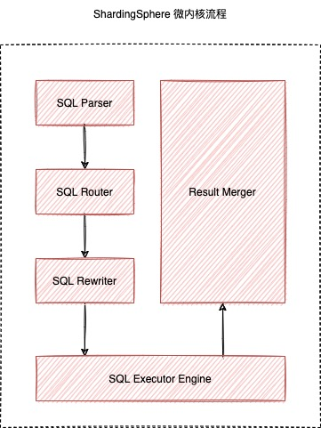
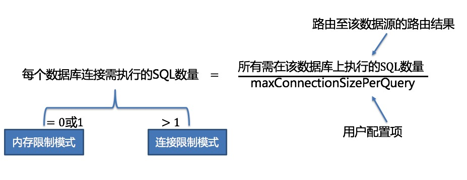
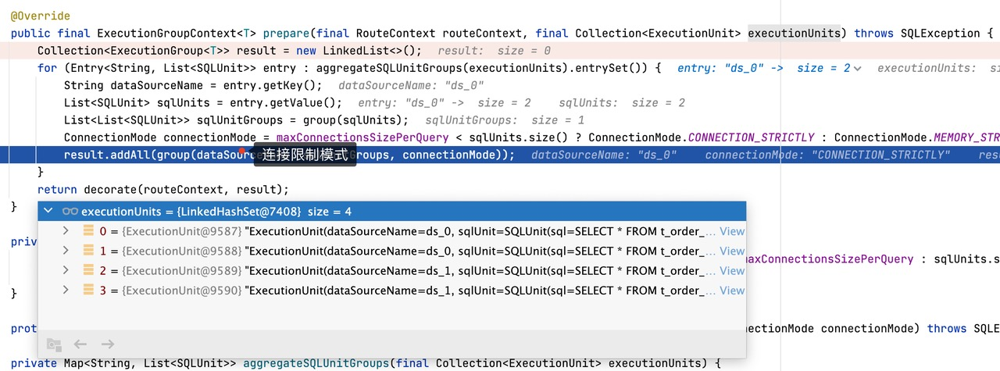
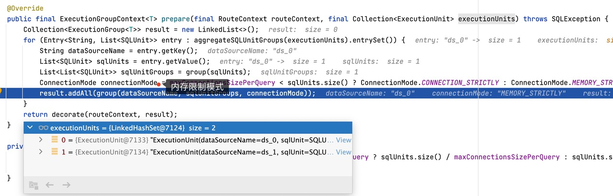
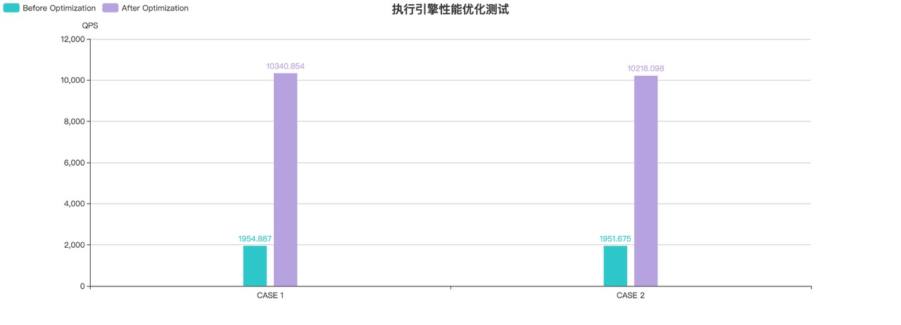

> 本文首发于 [Apache ShardingSphere 微信公众号](https://mp.weixin.qq.com/s/Mn9K-mn1P7oX0G5PorZRMw)，欢迎关注公众号，后续将会有更多技术分享。

## **前言**

在 Apache ShardingSphere 5.1.0 前几篇技术解读文章中，我们了解了解析引擎提供的 SQL 格式化功能，以及最新优化的高可用功能。除了不断为用户提供实用的新特性外，Apache ShardingSphere 社区一直在努力提升性能。

以单库 10 分片的 `t_order` 表为例，`max-connections-size-per-query` 使用默认配置 1，如果用户执行 `SELECT * FROM t_order` 语句则会导致全路由。由于每个查询只允许在同一个数据库上创建一个数据库连接，因此底层真实执行的 SQL 结果会被提前加载至内存进行处理，该场景限制了数据库连接资源的消耗，但是会占用更多的内存资源。如果用户将 `max-connections-size-per-query` 调整为 10，则可以在执行真实 SQL 时，同时创建 10 个数据库连接，由于数据库连接能够持有结果集，因此该场景不会额外占用内存资源，但是很显然会消耗更多的数据库连接资源。

为了更好地解决数据库连接资源和内存资源占用的问题，在刚刚发布的 `5.1.0` 版本中，我们对 SQL 执行引擎的性能进行了优化，通过 SQL 改写引擎进行优化性改写，将同一个数据源上的多条真实 SQL，使用 UNION ALL 语句进行合并，从而有效降低了执行引擎对数据库连接资源的消耗，同时减少了内存归并的发生，大幅度提升了 OLTP 场景下 SQL 查询性能。下面我们将结合具体的 SQL 实例，为大家详细解读执行引擎性能优化的细节。

## **执行引擎原理**

在解读执行引擎性能优化之前，让我们先来回顾下 Apache ShardingSphere 微内核及内核流程中执行引擎的原理。如下图所示，Apache ShardingSphere 微内核包含了 `SQL 解析`、`SQL 路由`、`SQL 改写`、`SQL 执行`和`结果归并`等核心流程。



SQL 解析引擎负责对用户输入的 SQL 语句进行解析，并生成包含上下文信息的 SQLStatement。SQL 路由引擎则根据解析上下文提取出分片条件，再结合用户配置的分片规则，计算出真实 SQL 需要执行的数据源并生成路由结果。SQL 改写引擎根据 SQL 路由引擎返回的结果，对原始 SQL 进行改写，具体包括了正确性改写和优化性改写。SQL 执行引擎则负责将 SQL 路由和改写引擎返回的真实 SQL 安全且高效地发送到底层数据源执行，执行的结果集最终会由归并引擎进行处理，生成统一的结果集返回给用户。

从整个微内核的执行流程可以看出，SQL 执行引擎直接与底层数据库交互，并负责持有执行的结果集，可以说执行引擎的性能和资源消耗，直接关系到整个 Apache ShardingSphere 的性能和资源消耗，因此 Apache ShardingSphere 内部采用了一套自动化的 SQL 执行引擎，负责在执行性能和资源消耗间进行权衡。

从执行性能的角度来看，为每个分片的执行语句分配一个独立的数据库连接，可以充分利用多线程来提升执行性能，也可以将 I/O 所产生的消耗并行处理。此外，为每个分片分配一个独立的数据库连接，还能够避免过早的将查询结果集加载至内存，独立的数据库连接，能够持有查询结果集游标位置的引用，在需要获取相应数据时移动游标即可。

从资源控制的角度来看，应当对业务访问数据库的连接数量进行限制，避免某一业务占用过多的数据库连接资源，影响其他业务的正常访问。 特别是在一个数据库实例中存在较多分表的情况下，一条不包含分片键的逻辑 SQL 将产生落在同库不同表的大量真实 SQL ，如果每条真实 SQL 都占用一个独立的连接，那么一次查询无疑将会占用过多的资源。

为了解决执行性能和资源控制的冲突问题，Apache ShardingSphere 提出了连接模式的概念，下面是 Apache ShardingSphere 源码对于连接模式的定义。

```Java
/**
 * Connection Mode.
 */
public enum ConnectionMode {

    MEMORY_STRICTLY, CONNECTION_STRICTLY
}
```

从 ConnectionMode 枚举类中成员的命名可以看出，SQL 执行引擎将数据库连接划分为 `MEMORY_STRICTLY` 和 `CONNECTION_STRICTLY`。

- `MEMORY_STRICTLY` 代表内存限制模式，当采用内存限制模式时，对于同一个数据源，如果逻辑表对应了 10 个真实表，那么 SQL 执行引擎会创建 10 个连接并行地执行，由于每个分片的结果集都有对应的连接进行持有，因此无需将结果集提前加载到内存中，从而有效地降低了内存占用；

- `CONNECTION_STRICTLY` 代表连接限制模式，当采用连接限制模式时，SQL 执行引擎只会在同一个数据源上创建一个连接，严格控制对数据库连接资源的消耗，在真实 SQL 执行之后立即将结果集加载至内存，因此会占用部分内存空间。

那么，Apache ShardingSphere SQL 执行引擎是如何帮助用户选择连接模式的呢？SQL 执行引擎选择连接模式的逻辑可以参考下图：



用户通过配置 `maxConnectionSizePerQuery` 参数，可以指定每条语句在同一个数据源上最大允许的连接数。通过上面的计算公式，当每个数据库连接需执行的 SQL 数量小于等于 1 时，说明当前可以满足每条真实执行的 SQL 都分配一个独立的数据库连接，此时会选择内存限制模式，同一个数据源允许创建多个数据库连接进行并行执行。反之则会选择连接限制模式，同一个数据源只允许创建一个数据库连接进行执行，然后将结果集加载进内存结果集，再提供给归并引擎使用。

## **执行引擎优化**

在熟悉了 Apache ShardingSphere SQL 执行引擎的内部原理之后，我们发现使用内存限制模式时，会消耗更多的数据库连接，但是能够通过并发执行获得更好的性能，使用连接限制模式能够有效控制连接资源的使用，但是会占用过多的内存，执行的性能也会受到影响。

那么，有没有可能使用尽可能少的数据库连接，同时占用较少内存的执行方式呢？根据前文对 SQL 执行引擎的分析，执行模式的选择主要是根据同一个数据源上路由结果的数量，因此最直接的优化思路，就是对同一个数据源上的路由结果进行合并。SQL 语句天然支持通过 UNION ALL 对多条查询语句进行合并，因此我们采用 UNION ALL 方案，对同一个数据源中的多条真实 SQL 进行优化性改写，从而将多条真实 SQL 改写为一条 SQL，这样能够大大减少数据库连接的获取，同时也可以将内存结果集转换为流式结果集，减少内存的占用。

考虑到不同数据库方言对于 UNION ALL 语句的使用存在限制，我们调研了 MySQL、PostgreSQL、Oracle 以及 SQLServer 的官方文档，梳理之后得到了如下信息。

**MySQL UNION ALL 使用规范**：

- UNION 之后的列名使用第一个 SELECT 语句中的列名；

- UNION 中包含 ORDER BY 和 LIMIT 时，需要使用括号将各个查询语句括起来，UNION 无法保证最终的结果集有序，如果需要对 UNION 结果集进行排序，需要在 UNION 语句最后添加 ORDER BY LIMIT 子句；

```SQL
# 无法保证 UNION 结果集有序
(SELECT a FROM t1 WHERE a=10 AND B=1 ORDER BY a LIMIT 10) UNION (SELECT a FROM t2 WHERE a=11 AND B=2 ORDER BY a LIMIT 10);
# 保证 UNION 结果集有序
(SELECT a FROM t1 WHERE a=10 AND B=1) UNION (SELECT a FROM t2 WHERE a=11 AND B=2) ORDER BY a LIMIT 10;
```

- UNION 不支持 `SELECT HIGH_PRIORITY` 语句和 `SELECT INTO file` 语句；

**PostgreSQL UNION ALL 使用规范**：

- UNION 之后的列名使用第一个 SELECT 语句中的列名；

- UNION 中包含 ORDER BY 和 LIMIT 时，需要使用括号将各个查询语句括起来，最后一个 UNION 子句可以不使用括号，不使用括号，则 ORDER BY LIMIT 子句应用于整个 UNION 结果。

- UNION 语句不支持 FOR NO KEY UPDATE、FOR UPDATE、FOR SHARE 和 FOR KEY SHARE；

**Oracle UNION ALL 使用规范**：

- UNION 语句不支持 BLOB, CLOB, BFILE, VARRAY, LONG 类型或者 nested table；

- UNION 语句不支持 for_update_clause；

- UNION 语句不支持 select 子句中包含 order_by_clause，只能在 UNION 语句最后添加 order_by_clause；

```SQL
SELECT product_id FROM order_items UNION SELECT product_id FROM inventories ORDER BY product_id;
```

- UNION 语句不支持 SELECT 语句中包含 TABLE collection expressions；

**SQLServer UNION ALL 使用规范**：

- UNION 语句中使用 ORDER BY 子句时，必须放在最后一个 select 子句之上，对 UNION 结果进行排序；

综合以上梳理的信息来看，不同的数据库方言都能够支持简单的 `SELECT * FROM table WHERE` 语句，对于 `ORDER BY LIMIT` 也能通过语法调整进行支持，只是使用上存在一些语法差异，而对于更加复杂的分组查询、子查询及关联查询，官方文档上并未进行详细描述。考虑到 SQL 优化性改写需要保证 SQL 兼容性，Apache ShardingSphere 5.1.0 只选择了简单的 `SELECT * FROM table WHERE` 语句进行改写，旨在快速提升 OLTP 场景下的查询性能。

下面展示了 RouteSQLRewriteEngine 改写引擎的最新逻辑，Apache ShardingSphere 5.1.0 中添加了对于 `SELECT * FROM table WHERE` 语句的优化性改写逻辑，首先通过 isNeedAggregateRewrite 进行判断，只有当同一个数据源中的路由结果大于 1，并且真实执行的 SQL 满足 `SELECT * FROM table WHERE` 结构时，才会进行 UNION ALL 改写。

```Java
/**
 * Rewrite SQL and parameters.
 *
 * @param sqlRewriteContext SQL rewrite context
 * @param routeContext route context
 * @return SQL rewrite result
 */
public RouteSQLRewriteResult rewrite(final SQLRewriteContext sqlRewriteContext, final RouteContext routeContext) {
    Map<RouteUnit, SQLRewriteUnit> result = new LinkedHashMap<>(routeContext.getRouteUnits().size(), 1);
    for (Entry<String, Collection<RouteUnit>> entry : aggregateRouteUnitGroups(routeContext.getRouteUnits()).entrySet()) {
        Collection<RouteUnit> routeUnits = entry.getValue();
        if (isNeedAggregateRewrite(sqlRewriteContext.getSqlStatementContext(), routeUnits)) {
            result.put(routeUnits.iterator().next(), createSQLRewriteUnit(sqlRewriteContext, routeContext, routeUnits));
        } else {
            result.putAll(createSQLRewriteUnits(sqlRewriteContext, routeContext, routeUnits));
        }
    }
    return new RouteSQLRewriteResult(result);
}
```

由于使用了 UNION ALL 改写，归并引擎中对于 queryResults 的判断逻辑也需要同步进行调整，原先多个 queryResults 可能被 UNION ALL 合并为一个 queryResults，这种场景下仍然需要执行归并逻辑。

```Java
@Override
public MergedResult merge(final List<QueryResult> queryResults, final SQLStatementContext<?> sqlStatementContext, final ShardingSphereSchema schema) throws SQLException {
    if (1 == queryResults.size() && !isNeedAggregateRewrite(sqlStatementContext)) {
        return new IteratorStreamMergedResult(queryResults);
    }
    Map<String, Integer> columnLabelIndexMap = getColumnLabelIndexMap(queryResults.get(0));
    SelectStatementContext selectStatementContext = (SelectStatementContext) sqlStatementContext;
    selectStatementContext.setIndexes(columnLabelIndexMap);
    MergedResult mergedResult = build(queryResults, selectStatementContext, columnLabelIndexMap, schema);
    return decorate(queryResults, selectStatementContext, mergedResult);
}
```

为了方便大家理解优化前后的逻辑，我们使用如下分片配置，通过 `SELECT * FROM t_order` 来具体说明下优化的效果，示例中 `max-connections-size-per-query` 参数使用默认值 `1`。

```YAML
rules:
- !SHARDING
  tables:
    t_order:
      actualDataNodes: ds_${0..1}.t_order_${0..1}
      tableStrategy:
        standard:
          shardingColumn: order_id
          shardingAlgorithmName: t_order_inline
      databaseStrategy:
        standard:
          shardingColumn: user_id
          shardingAlgorithmName: database_inline

  shardingAlgorithms:
    database_inline:
      type: INLINE
      props:
        algorithm-expression: ds_${user_id % 2}
    t_order_inline:
      type: INLINE
      props:
        algorithm-expression: t_order_${order_id % 2}
        allow-range-query-with-inline-sharding: true
```

在 `5.0.0` 版本中，我们执行 `SELECT * FROM t_order` 语句后，可以得到如下路由结果，结果中包含 ds_0 和 ds_1 两个数据源，并且各自包含了两个路由结果，由于 `max-connections-size-per-query` 设置为 1，此时无法满足每个真实执行 SQL 都有一个数据库连接，因此会选择连接限制模式。



同时由于使用了连接限制模式，在并行执行后会将结果集加载至内存中，使用 JDBCMemoryQueryResult 进行存储，当用户结果集较大时，会占用较多的内存。内存结果集的使用也会导致归并时只能使用内存归并，而无法使用流式归并。

```Java
private QueryResult createQueryResult(final ResultSet resultSet, final ConnectionMode connectionMode) throws SQLException {
    return ConnectionMode.MEMORY_STRICTLY == connectionMode ? new JDBCStreamQueryResult(resultSet) : new JDBCMemoryQueryResult(resultSet);
}
```

在 `5.1.0` 版本中，我们使用了 UNION ALL 对执行的 SQL 进行优化，同一个数据源中多个路由结果会被合并为一条 SQL 执行。由于能够满足一个数据库连接持有一个结果集，因此会选择内存限制模式。在内存限制模式下，会使用流式结果集 JDBCStreamQueryResult 对象持有结果集，在需要使用数据时，可以按照流式查询的方式查询数据。



## **性能优化测试**

从前面小节的示例中，我们可以看出使用 UNION ALL 进行优化性改写，可以有效减少对数据库连接的消耗，也能够将内存结果集转换为流式结果集，从而避免过多地占用内存。为了更加具体说明优化对于性能的提升，我们针对优化前后的逻辑进行了压测，压测所采用的软件版本如下，使用 5.0.1-SNAPSHOT 版本的 ShardingSphere-Proxy 以及 5.7.26 版本的 MySQL。

| 组件                 | 版本                                                      |
| :------------------- | :-------------------------------------------------------- |
| ShardingSphere-Proxy | 5.0.1-SNAPSHOT (b073e622d58c6c3d4b79295fff261184c50d8968) |
| MySQL                | 5.7.26                                                    |

压测环境对应的机器配置如下：

| 组件                 | 机器配置 |
| :------------------- | :------- |
| ShardingSphere-Proxy | 32C 64G  |
| MySQL 5.7            | 32C 64G  |
| JMH                  | 32C 64G  |


我们参考 sysbench 表结构，创建了 sbtest1~sbtest10 等 10 张分片表，每个分片表又分为 5 库，每个库分为 10 张表，具体的 `config-sharding.yaml` 配置文件如下。

```YAML
schemaName: sbtest_sharding
dataSources:
  ds_0:
    url: jdbc:mysql://127.0.0.1:3306/sbtest?useSSL=false&useServerPrepStmts=true&cachePrepStmts=true&prepStmtCacheSize=8192&prepStmtCacheSqlLimit=1024
    username: root
    password: 123456
    connectionTimeoutMilliseconds: 10000
    idleTimeoutMilliseconds: 60000
    maxLifetimeMilliseconds: 1800000
    maxPoolSize: 50
    minPoolSize: 1
  ds_1:
    url: jdbc:mysql://127.0.0.1:3306/sbtest?useSSL=false&useServerPrepStmts=true&cachePrepStmts=true&prepStmtCacheSize=8192&prepStmtCacheSqlLimit=1024
    username: root
    password: 123456
    connectionTimeoutMilliseconds: 10000
    idleTimeoutMilliseconds: 60000
    maxLifetimeMilliseconds: 1800000
    maxPoolSize: 50
    minPoolSize: 1
  ds_2:
    url: jdbc:mysql://127.0.0.1:3306/sbtest?useSSL=false&useServerPrepStmts=true&cachePrepStmts=true&prepStmtCacheSize=8192&prepStmtCacheSqlLimit=1024
    username: root
    password: 123456
    connectionTimeoutMilliseconds: 10000
    idleTimeoutMilliseconds: 60000
    maxLifetimeMilliseconds: 1800000
    maxPoolSize: 50
    minPoolSize: 1
  ds_3:
    url: jdbc:mysql://127.0.0.1:3306/sbtest?useSSL=false&useServerPrepStmts=true&cachePrepStmts=true&prepStmtCacheSize=8192&prepStmtCacheSqlLimit=1024
    username: root
    password: 123456
    connectionTimeoutMilliseconds: 10000
    idleTimeoutMilliseconds: 60000
    maxLifetimeMilliseconds: 1800000
    maxPoolSize: 50
    minPoolSize: 1
  ds_4:
    url: jdbc:mysql://127.0.0.1:3306/sbtest?useSSL=false&useServerPrepStmts=true&cachePrepStmts=true&prepStmtCacheSize=8192&prepStmtCacheSqlLimit=1024
    username: root
    password: 123456
    connectionTimeoutMilliseconds: 10000
    idleTimeoutMilliseconds: 60000
    maxLifetimeMilliseconds: 1800000
    maxPoolSize: 50
    minPoolSize: 1

rules:
- !SHARDING
  tables:
    sbtest1:
      actualDataNodes: ds_${0..4}.sbtest1_${0..9}
      tableStrategy:
        standard:
          shardingColumn: id
          shardingAlgorithmName: table_inline_1
      keyGenerateStrategy:
        column: id
        keyGeneratorName: snowflake
    sbtest2:
      actualDataNodes: ds_${0..4}.sbtest2_${0..9}
      tableStrategy:
        standard:
          shardingColumn: id
          shardingAlgorithmName: table_inline_2
      keyGenerateStrategy:
        column: id
        keyGeneratorName: snowflake
    sbtest3:
      actualDataNodes: ds_${0..4}.sbtest3_${0..9}
      tableStrategy:
        standard:
          shardingColumn: id
          shardingAlgorithmName: table_inline_3
      keyGenerateStrategy:
        column: id
        keyGeneratorName: snowflake
    sbtest4:
      actualDataNodes: ds_${0..4}.sbtest4_${0..9}
      tableStrategy:
        standard:
          shardingColumn: id
          shardingAlgorithmName: table_inline_4
      keyGenerateStrategy:
        column: id
        keyGeneratorName: snowflake
    sbtest5:
      actualDataNodes: ds_${0..4}.sbtest5_${0..9}
      tableStrategy:
        standard:
          shardingColumn: id
          shardingAlgorithmName: table_inline_5
      keyGenerateStrategy:
        column: id
        keyGeneratorName: snowflake
    sbtest6:
      actualDataNodes: ds_${0..4}.sbtest6_${0..9}
      tableStrategy:
        standard:
          shardingColumn: id
          shardingAlgorithmName: table_inline_6
      keyGenerateStrategy:
        column: id
        keyGeneratorName: snowflake
    sbtest7:
      actualDataNodes: ds_${0..4}.sbtest7_${0..9}
      tableStrategy:
        standard:
          shardingColumn: id
          shardingAlgorithmName: table_inline_7
      keyGenerateStrategy:
        column: id
        keyGeneratorName: snowflake
    sbtest8:
      actualDataNodes: ds_${0..4}.sbtest8_${0..9}
      tableStrategy:
        standard:
          shardingColumn: id
          shardingAlgorithmName: table_inline_8
      keyGenerateStrategy:
        column: id
        keyGeneratorName: snowflake
    sbtest9:
      actualDataNodes: ds_${0..4}.sbtest9_${0..9}
      tableStrategy:
        standard:
          shardingColumn: id
          shardingAlgorithmName: table_inline_9
      keyGenerateStrategy:
        column: id
        keyGeneratorName: snowflake
    sbtest10:
      actualDataNodes: ds_${0..4}.sbtest10_${0..9}
      tableStrategy:
        standard:
          shardingColumn: id
          shardingAlgorithmName: table_inline_10
      keyGenerateStrategy:
        column: id
        keyGeneratorName: snowflake

  defaultDatabaseStrategy:
    standard:
      shardingColumn: id
      shardingAlgorithmName: database_inline

  shardingAlgorithms:
    database_inline:
      type: INLINE
      props:
        algorithm-expression: ds_${id % 5}
        allow-range-query-with-inline-sharding: true
    table_inline_1:
      type: INLINE
      props:
        algorithm-expression: sbtest1_${id % 10}
        allow-range-query-with-inline-sharding: true
    table_inline_2:
      type: INLINE
      props:
        algorithm-expression: sbtest2_${id % 10}
        allow-range-query-with-inline-sharding: true
    table_inline_3:
      type: INLINE
      props:
        algorithm-expression: sbtest3_${id % 10}
        allow-range-query-with-inline-sharding: true
    table_inline_4:
      type: INLINE
      props:
        algorithm-expression: sbtest4_${id % 10}
        allow-range-query-with-inline-sharding: true
    table_inline_5:
      type: INLINE
      props:
        algorithm-expression: sbtest5_${id % 10}
        allow-range-query-with-inline-sharding: true
    table_inline_6:
      type: INLINE
      props:
        algorithm-expression: sbtest6_${id % 10}
        allow-range-query-with-inline-sharding: true
    table_inline_7:
      type: INLINE
      props:
        algorithm-expression: sbtest7_${id % 10}
        allow-range-query-with-inline-sharding: true
    table_inline_8:
      type: INLINE
      props:
        algorithm-expression: sbtest8_${id % 10}
        allow-range-query-with-inline-sharding: true
    table_inline_9:
      type: INLINE
      props:
        algorithm-expression: sbtest9_${id % 10}
        allow-range-query-with-inline-sharding: true
    table_inline_10:
      type: INLINE
      props:
        algorithm-expression: sbtest10_${id % 10}
        allow-range-query-with-inline-sharding: true
  keyGenerators:
    snowflake:
      type: SNOWFLAKE
      props:
        worker-id: 123
```

我们使用如下 JMH 测试程序对不同 CASE 进行测试：

```Java
@State(Scope.Thread)
public class QueryOptimizationTest {

    private PreparedStatement unionAllForCaseOneStatement;

    private PreparedStatement unionAllForCaseTwoStatement;

    @Setup(Level.Trial)
    public void setup() throws Exception {
        Connection connection = DriverManager.getConnection("jdbc:mysql://127.0.0.1:3307/sharding_db?useSSL=false", "root", "123456");
        // CASE 1
        unionAllForCaseOneStatement = connection.prepareStatement("SELECT COUNT(k) AS countK FROM sbtest1 WHERE id < ?;");
        // CASE 2
        unionAllForCaseTwoStatement = connection.prepareStatement("SELECT SUM(k) AS sumK FROM sbtest1 WHERE id < ?;");
    }

    @Benchmark
    public void testUnionAllForCaseOne() throws SQLException {
        unionAllForCaseOneStatement.setInt(1, 200);
        unionAllForCaseOneStatement.executeQuery();
    }

    @Benchmark
    public void testUnionAllForCaseTwo() throws SQLException {
        unionAllForCaseTwoStatement.setInt(1, 200);
        unionAllForCaseTwoStatement.executeQuery();
    }
}
```

性能测试会对每个 CASE 分别测试 3 组，然后取平均值，再切换到优化前的版本 `aab226b72ba574061748d8f94c461ea469f9168f` 进行编译打包，同样测试 3 组取平均值，最终性能测试结果如下。

| Threads | 数据量 | CASE SQL                                               | Before Optimization | After Optimization |
| :------ | :----- | :----------------------------------------------------- | :------------------ | :----------------- |
| 100     | 100w   | SELECT COUNT(k) AS countK FROM sbtest1 WHERE id < 200; | 1954.887            | 10340.854          |
| 100     | 100w   | SELECT SUM(k) AS sumK FROM sbtest1 WHERE id < 200;     | 1951.675            | 10218.098          |




CASE 1 与 CASE 2 都是基于 100 万数据量下的 sysbench 表结构进行测试，由于测试表分片数较多，整体性能提升了 4 倍左右，理论上随着分片数的增加，性能提升的效果会更加明显。

## **结语**

Apache ShardingSphere 5.1.0 进行了大量的性能优化，针对协议层和内核层进行了全面的优化提升，本文限于篇幅只对 SQL 执行引擎进行了解读，后续的系列文章还会带来更加专业和全面的性能优化指南，希望感兴趣的同学继续关注。同时，也欢迎社区的同学积极参与进来，共同提升 Apache ShardingSphere 的性能，为社区提供更好的使用体验。




欢迎关注「**端小强的博客**」微信公众号，会不定期分享日常学习和工作经验，欢迎大家关注交流。


