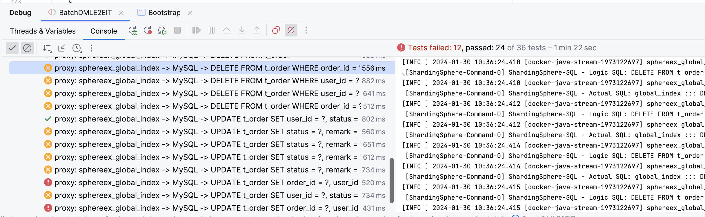
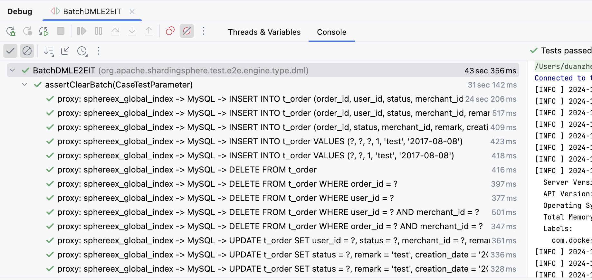

## 问题背景

MySQL JDBC 驱动支持使用 `addBatch` 和 `executeBatch` 方法，进行批量写入操作。MySQL 提供了 `allowMultiQueries` 和 `rewriteBatchedStatements` 两个属性用于控制是否开启批量写入，如果用户在 JDBC URL 上开启 `&allowMultiQueries=true&rewriteBatchedStatements=true` 属性，那么 MySQL 驱动会将多条 `INSERT` 语句改写成多组 `VALUES`，将 `DELETE` 和 `UPDATE` 语句改写成 `;` 分隔的多语句。如果用户不配置 `allowMultiQueries` 和 `rewriteBatchedStatements` 属性，MySQL 驱动则会以单条 SQL 方式逐一请求。

ShardingSphere Proxy 实现了完整的 MySQL 协议，因此对 MySQL 批量写入也进行了兼容，但是笔者在开发 DBPlusEngine 全局索引功能时，发现新增的批量写入 Case 断言报错（如下图），`executeBatch` 返回的 `int[]` 不正确，需要进一步分析和适配。



## 问题分析

### 最小化 Demo 复现

首先，由于 E2E 程序不方便调试，我们编写一个最小化 Demo 复现这个异常，如下是最小化 Demo 的源码，使用了 PreparedStatement 方式创建预编译 SQL，然后再通过 `addBatch()`  添加多组参数，此处需要注意，只有当 `batchCount > 3` 时，MySQL 驱动才会将 SQL 改写为批量 SQL。

```Java
@Test
void assertGlobalIndex() throws SQLException {
    try (
        // Connection connection = DriverManager.getConnection("jdbc:shardingsphere:classpath:config/driver/foo-driver-fixture-global-index.yaml");
        Connection connection = DriverManager.getConnection("jdbc:mysql://127.0.0.1:3307/sphereex_global_index?useSSL=false&useServerPrepStmts=true&useLocalSessionState=true&characterEncoding=utf-8&allowMultiQueries=true&rewriteBatchedStatements=true", "root", "root");
        // Connection connection = DriverManager.getConnection("jdbc:mysql://127.0.0.1:3306/global_index?useSSL=false&useServerPrepStmts=true&useLocalSessionState=true&characterEncoding=utf-8&allowMultiQueries=true&rewriteBatchedStatements=true", "root", "123456");
        PreparedStatement preparedStatement = connection.prepareStatement("DELETE FROM t_order WHERE order_id = ?")) {
        // PreparedStatement preparedStatement = connection.prepareStatement("DELETE FROM t_order_1 WHERE order_id = ?")) {
        connection.setAutoCommit(false);
        preparedStatement.setObject(1, 1001);
        preparedStatement.addBatch();
        preparedStatement.setObject(1, 1101);
        preparedStatement.addBatch();
        preparedStatement.setObject(1, 999);
        preparedStatement.addBatch();
        preparedStatement.setObject(1, 998);
        preparedStatement.addBatch();
        final int[] ints = preparedStatement.executeBatch();
        System.out.println(ints);
        preparedStatement.clearBatch();
        
        preparedStatement.setObject(1, 1000);
        preparedStatement.addBatch();
        preparedStatement.setObject(1, 1100);
        preparedStatement.addBatch();
        preparedStatement.setObject(1, 999);
        preparedStatement.addBatch();
        preparedStatement.setObject(1, 998);
        preparedStatement.addBatch();
        final int[] ints2 = preparedStatement.executeBatch();
        System.out.println(ints2);
        preparedStatement.clearBatch();
        connection.rollback();
    }
}
```

Demo 中我们连接的是 `3307` 端口，该端口指向的是 Proxy 服务，我们需要将如下的配置添加到 Proxy 配置文件中（**如下展示的全局索引配置为 ShardingSphere 商业版功能，开源版本需要删除全局索引配置**）：

```YAML
databaseName: sphereex_global_index

dataSources:
  global_index:
    url: jdbc:mysql://localhost:3306/global_index?serverTimezone=UTC&useSSL=false&characterEncoding=utf-8&allowPublicKeyRetrieval=true
    username: root
    password: 123456
    connectionTimeoutMilliseconds: 30000
    idleTimeoutMilliseconds: 60000
    maxLifetimeMilliseconds: 1800000
    maxPoolSize: 50
    minPoolSize: 2

rules:
- !SINGLE
  tables:
    - "*.*"
- !SHARDING
  tables:
    t_order:
      actualDataNodes: global_index.t_order_${0..9}
      tableStrategy:
        standard:
          shardingColumn: order_id
          shardingAlgorithmName: t_order_inline
      globalIndexStrategy:
        globalIndexNames:
          - t_order_user_id_idx
          - t_order_merchant_id_idx
        consistencyLevel: STRONG
  globalIndexes:
    t_order_user_id_idx:
      actualDataNodes: global_index.t_order_user_id_idx_${0..9}
      databaseStrategy:
        none:
      tableStrategy:
        standard:
          shardingColumn: user_id
          shardingAlgorithmName: t_order_user_id_idx_inline
      coveringColumns:
        - order_id
    t_order_merchant_id_idx:
      actualDataNodes: global_index.t_order_merchant_id_idx_${0..9}
      databaseStrategy:
        none:
      tableStrategy:
        standard:
          shardingColumn: merchant_id
          shardingAlgorithmName: t_order_merchant_id_idx_inline
      coveringColumns:
        - order_id
        - creation_date
  
  shardingAlgorithms:
    t_order_inline:
      type: INLINE
      props:
        algorithm-expression: t_order_${order_id % 10}
    t_order_user_id_idx_inline:
      type: INLINE
      props:
        algorithm-expression: t_order_user_id_idx_${user_id % 10}
    t_order_merchant_id_idx_inline:
      type: INLINE
      props:
        algorithm-expression: t_order_merchant_id_idx_${merchant_id % 10}
```

启动 Demo 程序，可以复现和 E2E 中相同的异常，下面我们就来分析下异常的具体原因。

### 返回多个 MySQLOKPacket

我们使用最小化 Demo 进行 Debug，可以发现 Proxy 多语句的入口类是 `MySQLMultiStatementsHandler`，该类目前返回的结果为 `UpdateResponseHeader`，UpdateResponseHeader 会被封装为单个 MySQLOKPacket，目前执行多语句时，只会简单地将 `updated` 进行了累加，因此断言时结果不正确。

```java
private UpdateResponseHeader executeBatchedStatements(final ExecutionGroupContext<JDBCExecutionUnit> executionGroupContext) throws SQLException {
    boolean isExceptionThrown = SQLExecutorExceptionHandler.isExceptionThrown();
    ResourceMetaData resourceMetaData = metaDataContexts.getMetaData().getDatabase(connectionSession.getUsedDatabaseName()).getResourceMetaData();
    JDBCExecutorCallback<int[]> callback = new BatchedJDBCExecutorCallback(resourceMetaData, sqlStatementSample, isExceptionThrown);
    List<int[]> executeResults = jdbcExecutor.execute(executionGroupContext, callback);
    int updated = 0;
    for (int[] eachResult : executeResults) {
        for (int each : eachResult) {
            updated += each;
        }
    }
    // TODO Each logic SQL should correspond to an OK Packet.
    return new UpdateResponseHeader(sqlStatementSample, Collections.singletonList(new UpdateResult(updated, 0L)));
}
```

根据此处的 TODO 标记可以看出，MySQL 执行多语句时，需要返回批量的 MySQLOKPacket 集合，分别对应每条语句的执行结果。为了解决这个问题，需要增加一个 `MultiStatementsUpdateResponseHeader` 类进行封装，将多个 MySQLOKPacket 集合封装到其中：

```Java
/**
 * Multi statements update response header.
 */
@RequiredArgsConstructor
@Getter
public final class MultiStatementsUpdateResponseHeader implements ResponseHeader {
    
    private final Collection<UpdateResponseHeader> updateResponseHeaders;
}
```

然后在 `MySQLComQueryPacketExecutor` 执行器类中，对 `MultiStatementsUpdateResponseHeader` 进行处理，具体处理逻辑如下，根据 MultiStatementsUpdateResponseHeader 中维护的 UpdateResponseHeader 集合，将其组装为多个 MySQLOKPacket。 

```Java
@Override
public Collection<DatabasePacket> execute() throws SQLException {
    ResponseHeader responseHeader = proxyBackendHandler.execute();
    if (responseHeader instanceof QueryResponseHeader) {
        return processQuery((QueryResponseHeader) responseHeader);
    }
    responseType = ResponseType.UPDATE;
    if (responseHeader instanceof MultiStatementsUpdateResponseHeader) {
        return processMultiStatementsUpdate((MultiStatementsUpdateResponseHeader) responseHeader);
    }
    return processUpdate((UpdateResponseHeader) responseHeader);
}

private Collection<DatabasePacket> processMultiStatementsUpdate(final MultiStatementsUpdateResponseHeader responseHeader) {
    Collection<DatabasePacket> result = new LinkedList<>();
    int index = 0;
    for (UpdateResponseHeader each : responseHeader.getUpdateResponseHeaders()) {
        boolean lastPacket = ++index == responseHeader.getUpdateResponseHeaders().size();
        result.addAll(ResponsePacketBuilder.buildUpdateResponsePackets(each, ServerStatusFlagCalculator.calculateFor(connectionSession, lastPacket)));
    }
    return result;
}
```

此时，我们再次进行测试，但是发现结果仍然不正确，这又是为什么呢？想要搞清楚 MySQL 内部协议的交互逻辑，我们需要通过 WireShark 进行抓包，对比原生 MySQL 批量语句执行和 Proxy 批量语句执行之间的差异。

### ServerStatusFlag 增加 SERVER_MORE_RESULTS_EXISTS

为了搞清楚 Proxy 和 MySQL 之间的差异，我们分别执行 Demo 程序中的 Proxy 示例和 MySQL 示例，并使用 WireShark 进行抓包（WireShark 使用可参考[使用 Wireshark 解决 BenchmarkSQL 压测 Proxy 异常](https://strongduanmu.com/blog/use-wireshark-to-solve-benchmarksql-exception-with-shardingsphere-proxy.html)）。首先，我们执行 MySQL 批量写入并进行抓包，如下记录了抓包的内容，包括了 1 次 Request 和 4 次 Response。


然后我们再执行 Proxy 批量写入，并使用 WireShark 抓包，如下记录了 Proxy 抓包的内容，只有 1 次 Request 和 1 次 Response。


对比 MySQL 和 Proxy 抓包的差异，可以发现 MySQL 直到最后一个 MySQLOKPacket `Server Status` 才变为 1，前三个 MySQLOKPacket `Server Status` 都为 9（8 多语句 `SERVER_MORE_RESULTS_EXISTS` + 1 事务中 `SERVER_STATUS_IN_TRANS`），而 Proxy 第一个 Response 就返回了 1，并且后续不再返回 Response。

排查 MySQL 驱动可以发现，如果 SQL Response 中的 `ServerStatusFlag` 不包含 `MySQLStatusFlag.SERVER_MORE_RESULTS_EXISTS`，MySQL 驱动就只会读取第一个 MySQLOKPacket，并填充到客户端 `int[]` 数组中。因此可以考虑在封装多语句 MySQLOKPacket 时，根据多语句是否为最后一条，决定该标记的设置，当 MySQLOKPacket 未遍历到最后一条记录时，应设置 `SERVER_MORE_RESULTS_EXISTS` 标记。

我们调整 `ServerStatusFlagCalculator#calculateFor` 方法的实现逻辑，根据传入的 lastPacket 标记，决定是否设置 `SERVER_MORE_RESULTS_EXISTS`，具体实现逻辑如下：

```java
/**
 * Calculate server status flag for specified connection.
 *
 * @param connectionSession connection session
 * @param lastPacket last packet
 * @return server status flag
 */
public static int calculateFor(final ConnectionSession connectionSession, final boolean lastPacket) {
    int result = 0;
    result |= connectionSession.isAutoCommit() ? MySQLStatusFlag.SERVER_STATUS_AUTOCOMMIT.getValue() : 0;
    result |= connectionSession.getTransactionStatus().isInTransaction() ? MySQLStatusFlag.SERVER_STATUS_IN_TRANS.getValue() : 0;
    result |= lastPacket ? 0 : MySQLStatusFlag.SERVER_MORE_RESULTS_EXISTS.getValue();
    return result;
}
```

修改完成后，我们再次运行测试程序，发现此时直接出现了 NPE，需要进一步分析 NPE 的原因。

### capabilityFlags 增加 CLIENT_MULTI_RESULTS/CLIENT_PS_MULTI_RESULTS


根据出现 NPE 的位置，我们大致可以定位到 `NativeProtocol#readNextResultset` 方法，通过 Debug 可以发现，在 MySQL 驱动获取下一个结果集时，`currentProtocolEntity` 为空导致了 NPE。排查 `currentProtocolEntity` 赋值的地方，发现是 `serverSession.useMultiResults()` 返回 false，导致 `currentProtocolEntity` 未赋值，而 `useMultiResults` 方法的判断逻辑如下，会从 `clientParam` 标记中获取 `CLIENT_MULTI_RESULTS` 和 `CLIENT_PS_MULTI_RESULTS`。

```Java
// /Users/duanzhengqiang/.m2/repository/com/mysql/mysql-connector-j/8.0.31/mysql-connector-j-8.0.31-sources.jar!/com/mysql/cj/protocol/a/NativeServerSession.java:220
@Override
public boolean useMultiResults() {
    return (this.clientParam & CLIENT_MULTI_RESULTS) != 0 || (this.clientParam & CLIENT_PS_MULTI_RESULTS) != 0;
}
```

可以看到该判断主要依赖 `clientParam` 变量，`NativeAuthenticationProvider` 方法会在登录认证通过后，调用 `setClientParam` 方法初始化该变量，具体代码逻辑位置如下。

```Java
/Users/duanzhengqiang/.m2/repository/com/mysql/mysql-connector-j/8.0.31/mysql-connector-j-8.0.31-sources.jar!/com/mysql/cj/protocol/a/NativeAuthenticationProvider.java:201
```

Proxy 端通过 `MySQLAuthenticationEngine` 处理 MySQL 登录认证，会将握手结果封装在 `MySQLHandshakePacket` 中，其中包含了 `capabilityFlags` 服务端能力标志位的信息。

```Java
@Override
public int handshake(final ChannelHandlerContext context) {
    int result = ConnectionIdGenerator.getInstance().nextId();
    connectionPhase = MySQLConnectionPhase.AUTH_PHASE_FAST_PATH;
    boolean sslEnabled = ProxySSLContext.getInstance().isSSLEnabled();
    if (sslEnabled) {
        context.pipeline().addFirst(MySQLSSLRequestHandler.class.getSimpleName(), new MySQLSSLRequestHandler());
    }
    context.writeAndFlush(new MySQLHandshakePacket(result, sslEnabled, authPluginData));
    MySQLStatementIdGenerator.getInstance().registerConnection(result);
    return result;
}
```

参考 [MySQL Client/Server Protocol 文档 - Capabilities Flags](https://dev.mysql.com/doc/dev/mysql-server/latest/group__group__cs__capabilities__flags.html#details)，能力标志位共 32 个 bit 位，每个 bit 位代表协议的一个可选功能，客户端和服务端的交集，共同决定了将使用协议的哪些可选部分。

按照功能属于高 16 位，还是低 16 位，需要分别将功能设置到 `capabilityFlagsLower` 和 `capabilityFlagsUpper` 中。查看 `CLIENT_MULTI_RESULTS` 和 `CLIENT_PS_MULTI_RESULTS`，它们属于高位功能，因此**在 calculateHandshakeCapabilityFlagsUpper 中增加 Flags 即可**，如下是具体设置代码。

```Java
CLIENT_MULTI_RESULTS(0x00020000),

CLIENT_PS_MULTI_RESULTS(0x00040000),

/**
 * Get handshake capability flags upper bit.
 *
 * @return handshake capability flags upper bit
 */
public static int calculateHandshakeCapabilityFlagsUpper() {
    return calculateCapabilityFlags(CLIENT_MULTI_STATEMENTS, CLIENT_PLUGIN_AUTH, CLIENT_MULTI_RESULTS, CLIENT_PS_MULTI_RESULTS) >> 16;
}
```

修改完成后，再次使用 Demo 程序测试，发现已经能够返回正确的结果，通过 JDBC 可以正常执行 `addBatch/executeBatch` 并返回 `int[]` 数组。

## 功能测试

最后，我们使用全局索引功能 E2E 再次进行测试，原先断言失败的 Case 现在终于可以通过，大家终于可以放心使用商业版全局索引功能。在此，也真心向大家推荐 SphereEx 的 DBPlusEngine，相比开源的 ShardingSphere，它具有更完善的企业级功能，不仅能够进行海量数据的分片管理，还可以用于数据安全加密和数据库替换等场景，更多信息可以查看 [SphereEx 官网](https://www.sphere-ex.cn/)。



## 结语

本文介绍了 E2E 测试 Proxy 发现批量写入返回结果错误后，如何一步步梳理 Proxy 代码，使用 Wireshark 抓包对比分析，以及排查 MySQL 驱动源码，最终完美解决了问题。提升 Proxy 对 MySQL 协议的兼容度，很直接的方法就是同测试用例比对，通过强大的 Wireshark 工具，我们可以很清晰地观测到请求过程中的差异，进而快速找到解决问题的方案。本案例的排查思路也适合其他 Proxy 接入端的问题，希望对大家有用，由于本人对 Wireshark 使用经验有限，如果问题也欢迎指正。




欢迎关注「**端小强的博客**」微信公众号，会不定期分享日常学习和工作经验，欢迎大家关注交流。


