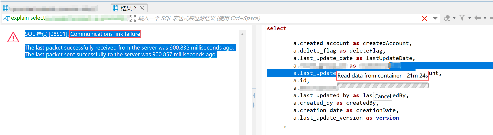
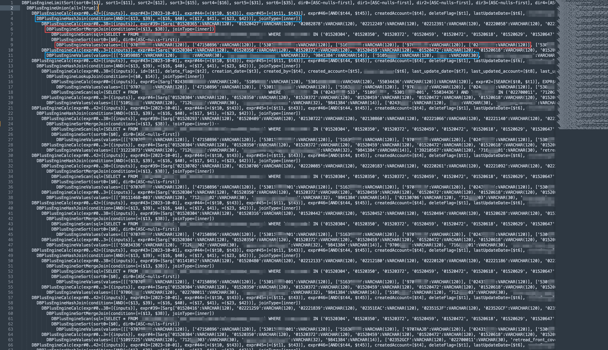

## 问题背景

最近，用户在测试 ShardingSphere 联邦查询功能时，反馈了 1 条 `2w6k` 行的超长 SQL，执行时出现了 `Communications link failure` 异常，SQL 在 Proxy 接入端执行了 20 多分钟后最终超时断开。



笔者刚看到这个异常时，怀疑是超长 SQL 过于复杂，导致在 **SQL 解析、SQL 绑定或者生成执行计划**的过程中出现问题，但是看到这条 SQL 的执行计划时，大概了解了问题的原因——Calcite 对于 IN 查询，会通过 `SubQueryRemoveRule` 规则，将 `IN` 查询转换为 JOIN。由于超长 SQL 中包含了大量的 IN 查询过滤条件，转换为 JOIN 方式执行，会导致下推的 SQL 缺失 IN 过滤条件，查询数据量相比预期要多很多，从而触发多轮磁盘文件交换，最终导致执行超时异常。

为了彻底解决 IN 查询的问题，笔者对 Calcite IN 查询内部处理逻辑进行了深入探究，通过对 `SubQueryRemoveRule` 规则进行优化，以及联邦查询谓词下推规则 `PushFilterIntoScanRule` 的适配，同时还重写了 `Calcite RelToSqlConverter` 中 IN 语法树转换 SQL 逻辑，最终将 `2w6k` 行超长 SQL 的查询耗时缩减到 1s 左右，实现了百倍以上的性能提升。

## 问题分析

为了深入分析这个问题，我们通过 `EXPLAIN` 语句来观察联邦查询的执行计划。如下展示了 `2w6k` 行超长 SQL 的执行计划，可以看到除了最外层的 `DBPlusEngineLimitSort` 算子，内部全部是由 `UNION ALL` 组合的多个查询语句，每个查询语句中包含了单列 IN 和多列 IN 查询条件。

原始 SQL 中的单列 IN 被转换为红色部分的 `DBPlusEngineSortMergeJoin`，通过关联 `DBPlusEngineValues` 中的常量实现 IN 过滤，而多列 IN 则被转换为蓝色部分的 `DBPlusEngineHashJoin`，同样通过关联 `DBPlusEngineValues` 中的常量实现多列 IN 过滤。这样的转换逻辑影响了 `DBPlusEngineScan` 中下推 SQL 的过滤条件，导致部分 IN 过滤条件没有下推下去，下推 SQL 查询的数据量过大。



为了方便问题分析，我们使用如下精简 SQL 进行探究，这条 SQL 和执行计划中的 SQL 结构一致，只是少了一些 UNION ALL 子查询，以及 IN 批量查询条件。

```sql
SELECT *
FROM (
	SELECT *
	FROM t_order
	WHERE creation_date = '2023-10-01'
		AND order_id IN (1000, 1003, 1004, 1006, 1007, 1008, 1100, 1102, 1104, 1106, 1107, 1109, 1200, 1202, 1204, 1207, 1209, 1300, 1400, 1405, 1407, 1409, 1501, 1507, 1602)
		AND (order_id, user_id, status, merchant_id) IN ((1000, 10, 'init', 1), (1001, 10, 'init', 2), (1002, 10, 'init', 3))
	UNION ALL
	SELECT *
	FROM t_order
	WHERE creation_date = '2023-10-01'
		AND order_id IN (1000, 1003, 1004, 1006, 1007, 1008, 1100, 1102, 1104, 1106, 1107, 1109, 1200, 1202, 1204, 1207, 1209, 1300, 1400, 1405, 1407, 1409, 1501, 1507, 1602)
		AND (order_id, user_id, status, merchant_id) IN ((1003, 10, 'init', 4), (1004, 10, 'init', 5), (1005, 10, 'init', 6))
) a
ORDER BY order_id ASC
LIMIT 0, 10;
```

TODO 参考如下的结构，复现问题并进行分析

* SQL TO Rel，对于 IN Caclite 是如何处理的，原始的执行计划是什么样
* SubQueryRemoveRule 会对 IN 过滤条件如何处理，哪里存在问题


## 问题解决


## 结语




笔者因为工作原因接触到 Calcite，前期学习过程中，深感 Calcite 学习资料之匮乏，因此创建了 [Calcite 从入门到精通知识星球](https://wx.zsxq.com/dweb2/index/group/51128414222814)，希望能够将学习过程中的资料和经验沉淀下来，为更多想要学习 Calcite 的朋友提供一些帮助。




欢迎关注「**端小强的博客**」微信公众号，会不定期分享日常学习和工作经验，欢迎大家关注交流。


