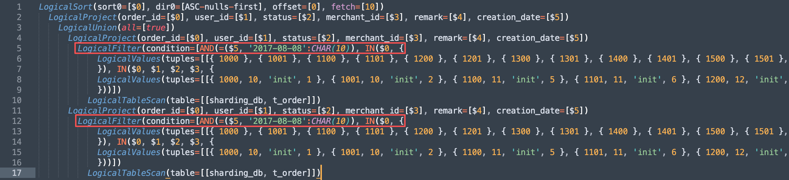
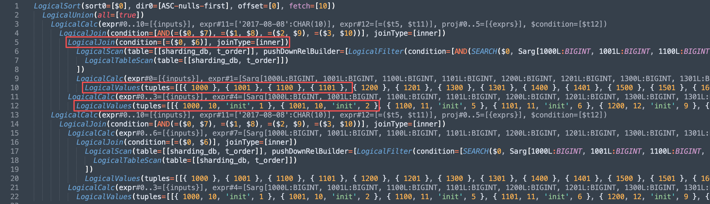
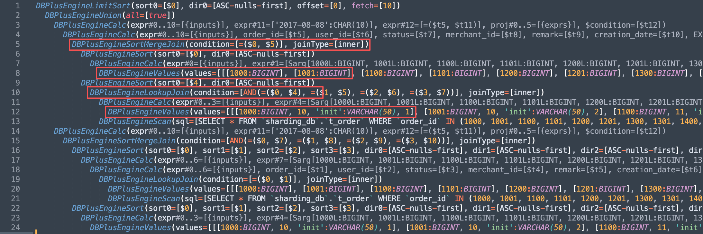
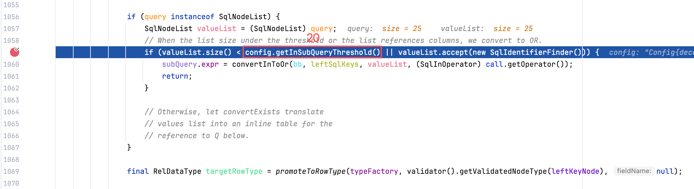
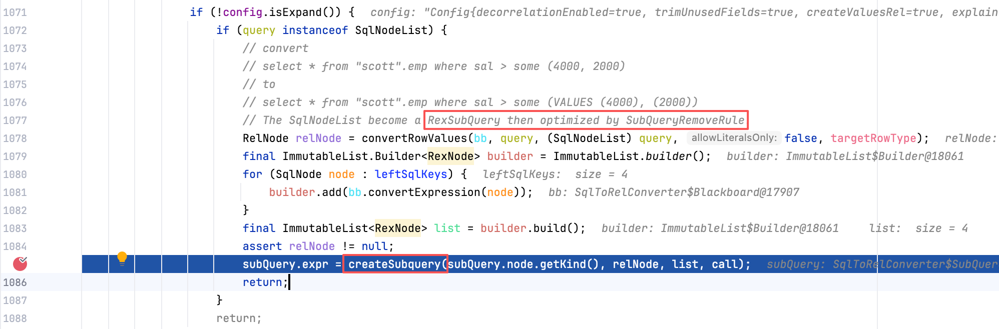
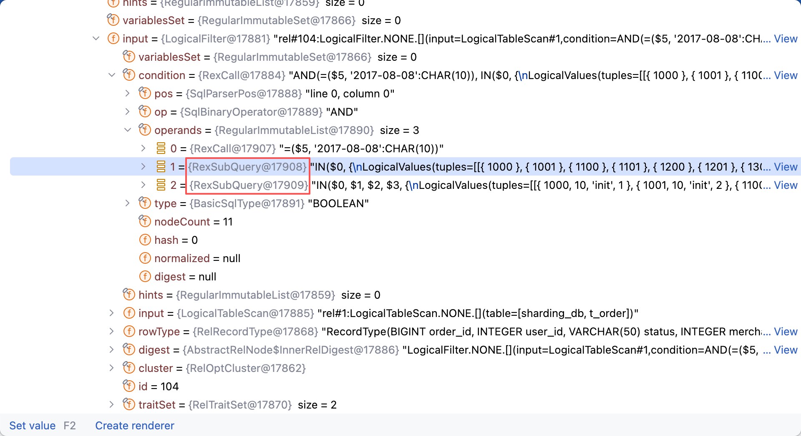

## 问题背景

最近，用户在测试 ShardingSphere 联邦查询功能时，反馈了 1 条 `2w6k` 行的超长 SQL，执行时出现了 `Communications link failure` 异常，SQL 在 Proxy 接入端执行了 20 多分钟后最终超时断开。


笔者刚看到这个异常时，怀疑是超长 SQL 过于复杂，导致在 **SQL 解析、SQL 绑定或者生成执行计划**的过程中出现问题，但是看到这条 SQL 的执行计划时，大概了解了问题的原因——Calcite 对于 IN 查询，会通过 `SubQueryRemoveRule` 规则，将 `IN` 查询转换为 JOIN。由于超长 SQL 中包含了大量的 IN 查询过滤条件，转换为 JOIN 方式执行，会导致下推的 SQL 缺失 IN 过滤条件，查询数据量相比预期要多很多，从而触发多轮磁盘文件交换，最终导致执行超时异常。

为了彻底解决 IN 查询的问题，笔者对 Calcite IN 查询内部处理逻辑进行了深入探究，通过对 `SubQueryRemoveRule` 规则进行优化，以及联邦查询谓词下推规则 `PushFilterIntoScanRule` 的适配，同时还重写了 `Calcite RelToSqlConverter` 中 IN 语法树转换 SQL 逻辑，最终将 `2w6k` 行超长 SQL 的查询耗时缩减到 1s 左右，实现了百倍以上的性能提升。

## 问题分析

为了深入分析这个问题，我们通过 `EXPLAIN` 语句来观察联邦查询的执行计划。如下展示了 `2w6k` 行超长 SQL 的执行计划，可以看到除了最外层的 `DBPlusEngineLimitSort` 算子，内部全部是由 `UNION ALL` 组合的多个查询语句，每个查询语句中包含了单列 IN 和多列 IN 查询条件。

原始 SQL 中的单列 IN 被转换为红色部分的 `DBPlusEngineSortMergeJoin`，通过关联 `DBPlusEngineValues` 中的常量实现 IN 过滤，而多列 IN 则被转换为蓝色部分的 `DBPlusEngineHashJoin`，同样通过关联 `DBPlusEngineValues` 中的常量实现多列 IN 过滤。这样的转换逻辑影响了 `DBPlusEngineScan` 中下推 SQL 的过滤条件，导致部分 IN 过滤条件没有下推下去，下推 SQL 查询的数据量过大。


为了方便问题分析，我们使用如下精简 SQL 进行探究，这条 SQL 和执行计划中的 SQL 结构一致，只是少了一些 UNION ALL 子查询，以及 IN 批量查询条件。

```sql
SELECT *
FROM (
  SELECT *
  FROM t_order
  WHERE creation_date = '2017-08-08'
    AND order_id IN (1000, 1001, 1100, 1101, 1200, 1201, 1300, 1301, 1400, 1401, 1500, 1501, 1600, 1601, 1700, 1701, 1800, 1801, 1900, 1901, 2000, 2001, 2100, 2101, 2200)
    AND (order_id, user_id, status, merchant_id) IN ((1000, 10, 'init', 1), (1001, 10, 'init', 2), (1100, 11, 'init', 5), (1101, 11, 'init', 6), (1200, 12, 'init', 9), (1201, 12, 'init', 10), (1300, 13, 'init', 13), (1301, 13, 'init', 14), (1400, 14, 'init', 17), (1401, 14, 'init', 18), (1500, 15, 'init', 1), (1501, 15, 'init', 2), (1600, 15, 'init', 5), (1601, 15, 'init', 6), (1700, 17, 'init', 9), (1701, 17, 'init', 10), (1800, 18, 'init', 13), (1801, 18, 'init', 14), (1900, 19, 'init', 17), (1901, 19, 'init', 18), (2000, 20, 'init', 3), (2001, 20, 'init', 4), (2100, 21, 'init', 7), (2101, 21, 'init', 8))
  UNION ALL
  SELECT *
  FROM t_order
  WHERE creation_date = '2017-08-08'
    AND order_id IN (1000, 1001, 1100, 1101, 1200, 1201, 1300, 1301, 1400, 1401, 1500, 1501, 1600, 1601, 1700, 1701, 1800, 1801, 1900, 1901, 2000, 2001, 2100, 2101, 2200)
    AND (order_id, user_id, status, merchant_id) IN ((1000, 10, 'init', 1), (1001, 10, 'init', 2), (1100, 11, 'init', 5), (1101, 11, 'init', 6), (1200, 12, 'init', 9), (1201, 12, 'init', 10), (1300, 13, 'init', 13), (1301, 13, 'init', 14), (1400, 14, 'init', 17), (1401, 14, 'init', 18), (1500, 15, 'init', 1), (1501, 15, 'init', 2), (1600, 15, 'init', 5), (1601, 15, 'init', 6), (1700, 17, 'init', 9), (1701, 17, 'init', 10), (1800, 18, 'init', 13), (1801, 18, 'init', 14), (1900, 19, 'init', 17), (1901, 19, 'init', 18), (2000, 20, 'init', 3), (2001, 20, 'init', 4), (2100, 21, 'init', 7), (2101, 21, 'init', 8))
) a
ORDER BY order_id ASC
LIMIT 0, 10;
```

我们执行 EXPLAIN 观察这条 SQL 的执行计划，可以看到和用户反馈 SQL 的执行计划类似，2 个 `IN` 过滤条件依次被转换为 `DBPlusEngineLookupJoin` 和 `DBPlusEngineSortMergeJoin`，这些 `JOIN` 通过关联 `DBPlusEngineValues` 中的常量列表来实现数据过滤。此外，`DBPlusEngineScan` 算子中的下推 SQL，只包含了单列 IN 过滤条件，没有包含多列 IN 过滤条件，这会导致查询到内存的数据量比预期要大，通过内存过滤多列 IN，查询的性能要差很多。

```sql
+---------------------------------------------------------------------------------------------------------------------------------------------------------------------------------------------------------------------------------------------------------------------------------------------------------------------------------------------------------------------------------------------------------------------------------------------------------------------------------------------------------------------------------------------------------------------------------------------------------------------------------------------------------------------------------------------------------------------------------------------------------------------------------------------------------------------------------------------------------------------------------------------------------------------------------------------------------------------------------------------------------------------------------------------------------------------------------------------------------+
| PLAN                                                                                                                                                                                                                                                                                                                                                                                                                                                                                                                                                                                                                                                                                                                                                                                                                                                                                                                                                                                                                                                             |
+---------------------------------------------------------------------------------------------------------------------------------------------------------------------------------------------------------------------------------------------------------------------------------------------------------------------------------------------------------------------------------------------------------------------------------------------------------------------------------------------------------------------------------------------------------------------------------------------------------------------------------------------------------------------------------------------------------------------------------------------------------------------------------------------------------------------------------------------------------------------------------------------------------------------------------------------------------------------------------------------------------------------------------------------------------------------------------------------------------+
| DBPlusEngineLimitSort(sort0=[$0], dir0=[ASC-nulls-first], offset=[0], fetch=[10])                                                                                                                                                                                                                                                                                                                                                                                                                                                                                                                                                                                                                                                                                                                                                                                                                                                                                                                                                                                |
|   DBPlusEngineUnion(all=[true])                                                                                                                                                                                                                                                                                                                                                                                                                                                                                                                                                                                                                                                                                                                                                                                                                                                                                                                                                                                                                                  |
|     DBPlusEngineCalc(expr#0..10=[{inputs}], expr#11=['2017-08-08':CHAR(10)], expr#12=[=($t5, $t11)], proj#0..5=[{exprs}], $condition=[$t12])                                                                                                                                                                                                                                                                                                                                                                                                                                                                                                                                                                                                                                                                                                                                                                                                                                                                                                                     |
|       DBPlusEngineSortMergeJoin(condition=[AND(=($0, $7), =($1, $8), =($2, $9), =($3, $10))], joinType=[inner])                                                                                                                                                                                                                                                                                                                                                                                                                                                                                                                                                                                                                                                                                                                                                                                                                                                                                                                                                  |
|         DBPlusEngineSort(sort0=[$0], sort1=[$1], sort2=[$2], sort3=[$3], dir0=[ASC-nulls-first], dir1=[ASC-nulls-first], dir2=[ASC-nulls-first], dir3=[ASC-nulls-first])                                                                                                                                                                                                                                                                                                                                                                                                                                                                                                                                                                                                                                                                                                                                                                                                                                                                                         |
|           DBPlusEngineCalc(expr#0..6=[{inputs}], expr#7=[Sarg[1000L:BIGINT, 1001L:BIGINT, 1100L:BIGINT, 1101L:BIGINT, 1200L:BIGINT, 1201L:BIGINT, 1300L:BIGINT, 1301L:BIGINT, 1400L:BIGINT, 1401L:BIGINT, 1500L:BIGINT, 1501L:BIGINT, 1600L:BIGINT, 1601L:BIGINT, 1700L:BIGINT, 1701L:BIGINT, 1800L:BIGINT, 1801L:BIGINT, 1900L:BIGINT, 1901L:BIGINT, 2000L:BIGINT, 2001L:BIGINT, 2100L:BIGINT, 2101L:BIGINT]:BIGINT], expr#8=[SEARCH($t0, $t7)], expr#9=[Sarg[10, 11, 12, 13, 14, 15, 17, 18, 19, 20, 21]], expr#10=[SEARCH($t1, $t9)], expr#11=['init':VARCHAR(50)], expr#12=[=($t2, $t11)], expr#13=[Sarg[1, 2, 3, 4, 5, 6, 7, 8, 9, 10, 13, 14, 17, 18]], expr#14=[SEARCH($t3, $t13)], expr#15=[AND($t8, $t10, $t12, $t14)], proj#0..6=[{exprs}], $condition=[$t15])                                                                                                                                                                                                                                                                                         |
|             DBPlusEngineCalc(expr#0..6=[{inputs}], order_id=[$t1], user_id=[$t2], status=[$t3], merchant_id=[$t4], remark=[$t5], creation_date=[$t6], EXPR$0=[$t0])                                                                                                                                                                                                                                                                                                                                                                                                                                                                                                                                                                                                                                                                                                                                                                                                                                                                                              |
|               DBPlusEngineLookupJoin(condition=[=($0, $1)], joinType=[inner])                                                                                                                                                                                                                                                                                                                                                                                                                                                                                                                                                                                                                                                                                                                                                                                                                                                                                                                                                                                    |
|                 DBPlusEngineValues(values=[[[1000:BIGINT], [1001:BIGINT], [1100:BIGINT], [1101:BIGINT], [1200:BIGINT], [1201:BIGINT], [1300:BIGINT], [1301:BIGINT], [1400:BIGINT], [1401:BIGINT], [1500:BIGINT], [1501:BIGINT], [1600:BIGINT], [1601:BIGINT], [1700:BIGINT], [1701:BIGINT], [1800:BIGINT], [1801:BIGINT], [1900:BIGINT], [1901:BIGINT], [2000:BIGINT], [2001:BIGINT], [2100:BIGINT], [2101:BIGINT], [2200:BIGINT]]])                                                                                                                                                                                                                                                                                                                                                                                                                                                                                                                                                                                                                             |
|                 DBPlusEngineScan(sql=[SELECT * FROM `sharding_db`.`t_order` WHERE `order_id` IN (1000, 1001, 1100, 1101, 1200, 1201, 1300, 1301, 1400, 1401, 1500, 1501, 1600, 1601, 1700, 1701, 1800, 1801, 1900, 1901, 2000, 2001, 2100, 2101, 2200) AND `order_id` IN ('...')])                                                                                                                                                                                                                                                                                                                                                                                                                                                                                                                                                                                                                                                                                                                                                                               |
|         DBPlusEngineSort(sort0=[$0], sort1=[$1], sort2=[$2], sort3=[$3], dir0=[ASC-nulls-first], dir1=[ASC-nulls-first], dir2=[ASC-nulls-first], dir3=[ASC-nulls-first])                                                                                                                                                                                                                                                                                                                                                                                                                                                                                                                                                                                                                                                                                                                                                                                                                                                                                         |
|           DBPlusEngineCalc(expr#0..3=[{inputs}], expr#4=[Sarg[1000L:BIGINT, 1001L:BIGINT, 1100L:BIGINT, 1101L:BIGINT, 1200L:BIGINT, 1201L:BIGINT, 1300L:BIGINT, 1301L:BIGINT, 1400L:BIGINT, 1401L:BIGINT, 1500L:BIGINT, 1501L:BIGINT, 1600L:BIGINT, 1601L:BIGINT, 1700L:BIGINT, 1701L:BIGINT, 1800L:BIGINT, 1801L:BIGINT, 1900L:BIGINT, 1901L:BIGINT, 2000L:BIGINT, 2001L:BIGINT, 2100L:BIGINT, 2101L:BIGINT, 2200L:BIGINT]:BIGINT], expr#5=[SEARCH($t0, $t4)], proj#0..3=[{exprs}], $condition=[$t5])                                                                                                                                                                                                                                                                                                                                                                                                                                                                                                                                                           |
|             DBPlusEngineValues(values=[[[1000:BIGINT, 10, 'init':VARCHAR(50), 1], [1001:BIGINT, 10, 'init':VARCHAR(50), 2], [1100:BIGINT, 11, 'init':VARCHAR(50), 5], [1101:BIGINT, 11, 'init':VARCHAR(50), 6], [1200:BIGINT, 12, 'init':VARCHAR(50), 9], [1201:BIGINT, 12, 'init':VARCHAR(50), 10], [1300:BIGINT, 13, 'init':VARCHAR(50), 13], [1301:BIGINT, 13, 'init':VARCHAR(50), 14], [1400:BIGINT, 14, 'init':VARCHAR(50), 17], [1401:BIGINT, 14, 'init':VARCHAR(50), 18], [1500:BIGINT, 15, 'init':VARCHAR(50), 1], [1501:BIGINT, 15, 'init':VARCHAR(50), 2], [1600:BIGINT, 15, 'init':VARCHAR(50), 5], [1601:BIGINT, 15, 'init':VARCHAR(50), 6], [1700:BIGINT, 17, 'init':VARCHAR(50), 9], [1701:BIGINT, 17, 'init':VARCHAR(50), 10], [1800:BIGINT, 18, 'init':VARCHAR(50), 13], [1801:BIGINT, 18, 'init':VARCHAR(50), 14], [1900:BIGINT, 19, 'init':VARCHAR(50), 17], [1901:BIGINT, 19, 'init':VARCHAR(50), 18], [2000:BIGINT, 20, 'init':VARCHAR(50), 3], [2001:BIGINT, 20, 'init':VARCHAR(50), 4], [2100:BIGINT, 21, 'init':VARCHAR(50), 7], [2101:BIGINT, 21, 'init':VARCHAR(50), 8]]]) |
|     DBPlusEngineCalc(expr#0..10=[{inputs}], expr#11=['2017-08-08':CHAR(10)], expr#12=[=($t5, $t11)], proj#0..5=[{exprs}], $condition=[$t12])                                                                                                                                                                                                                                                                                                                                                                                                                                                                                                                                                                                                                                                                                                                                                                                                                                                                                                                     |
|       DBPlusEngineCalc(expr#0..10=[{inputs}], order_id=[$t5], user_id=[$t6], status=[$t7], merchant_id=[$t8], remark=[$t9], creation_date=[$t10], EXPR$0=[$t0], EXPR$00=[$t1], EXPR$1=[$t2], EXPR$2=[$t3], EXPR$3=[$t4])                                                                                                                                                                                                                                                                                                                                                                                                                                                                                                                                                                                                                                                                                                                                                                                                                                         |
|         DBPlusEngineSortMergeJoin(condition=[=($0, $5)], joinType=[inner])                                                                                                                                                                                                                                                                                                                                                                                                                                                                                                                                                                                                                                                                                                                                                                                                                                                                                                                                                                                       |
|           DBPlusEngineSort(sort0=[$0], dir0=[ASC-nulls-first])                                                                                                                                                                                                                                                                                                                                                                                                                                                                                                                                                                                                                                                                                                                                                                                                                                                                                                                                                                                                   |
|             DBPlusEngineCalc(expr#0=[{inputs}], expr#1=[Sarg[1000L:BIGINT, 1001L:BIGINT, 1100L:BIGINT, 1101L:BIGINT, 1200L:BIGINT, 1201L:BIGINT, 1300L:BIGINT, 1301L:BIGINT, 1400L:BIGINT, 1401L:BIGINT, 1500L:BIGINT, 1501L:BIGINT, 1600L:BIGINT, 1601L:BIGINT, 1700L:BIGINT, 1701L:BIGINT, 1800L:BIGINT, 1801L:BIGINT, 1900L:BIGINT, 1901L:BIGINT, 2000L:BIGINT, 2001L:BIGINT, 2100L:BIGINT, 2101L:BIGINT]:BIGINT], expr#2=[SEARCH($t0, $t1)], EXPR$0=[$t0], $condition=[$t2])                                                                                                                                                                                                                                                                                                                                                                                                                                                                                                                                                                                 |
|               DBPlusEngineValues(values=[[[1000:BIGINT], [1001:BIGINT], [1100:BIGINT], [1101:BIGINT], [1200:BIGINT], [1201:BIGINT], [1300:BIGINT], [1301:BIGINT], [1400:BIGINT], [1401:BIGINT], [1500:BIGINT], [1501:BIGINT], [1600:BIGINT], [1601:BIGINT], [1700:BIGINT], [1701:BIGINT], [1800:BIGINT], [1801:BIGINT], [1900:BIGINT], [1901:BIGINT], [2000:BIGINT], [2001:BIGINT], [2100:BIGINT], [2101:BIGINT], [2200:BIGINT]]])                                                                                                                                                                                                                                                                                                                                                                                                                                                                                                                                                                                                                               |
|           DBPlusEngineSort(sort0=[$4], dir0=[ASC-nulls-first])                                                                                                                                                                                                                                                                                                                                                                                                                                                                                                                                                                                                                                                                                                                                                                                                                                                                                                                                                                                                   |
|             DBPlusEngineLookupJoin(condition=[AND(=($0, $4), =($1, $5), =($2, $6), =($3, $7))], joinType=[inner])                                                                                                                                                                                                                                                                                                                                                                                                                                                                                                                                                                                                                                                                                                                                                                                                                                                                                                                                                |
|               DBPlusEngineCalc(expr#0..3=[{inputs}], expr#4=[Sarg[1000L:BIGINT, 1001L:BIGINT, 1100L:BIGINT, 1101L:BIGINT, 1200L:BIGINT, 1201L:BIGINT, 1300L:BIGINT, 1301L:BIGINT, 1400L:BIGINT, 1401L:BIGINT, 1500L:BIGINT, 1501L:BIGINT, 1600L:BIGINT, 1601L:BIGINT, 1700L:BIGINT, 1701L:BIGINT, 1800L:BIGINT, 1801L:BIGINT, 1900L:BIGINT, 1901L:BIGINT, 2000L:BIGINT, 2001L:BIGINT, 2100L:BIGINT, 2101L:BIGINT, 2200L:BIGINT]:BIGINT], expr#5=[SEARCH($t0, $t4)], proj#0..3=[{exprs}], $condition=[$t5])                                                                                                                                                                                                                                                                                                                                                                                                                                                                                                                                                       |
|                 DBPlusEngineValues(values=[[[1000:BIGINT, 10, 'init':VARCHAR(50), 1], [1001:BIGINT, 10, 'init':VARCHAR(50), 2], [1100:BIGINT, 11, 'init':VARCHAR(50), 5], [1101:BIGINT, 11, 'init':VARCHAR(50), 6], [1200:BIGINT, 12, 'init':VARCHAR(50), 9], [1201:BIGINT, 12, 'init':VARCHAR(50), 10], [1300:BIGINT, 13, 'init':VARCHAR(50), 13], [1301:BIGINT, 13, 'init':VARCHAR(50), 14], [1400:BIGINT, 14, 'init':VARCHAR(50), 17], [1401:BIGINT, 14, 'init':VARCHAR(50), 18], [1500:BIGINT, 15, 'init':VARCHAR(50), 1], [1501:BIGINT, 15, 'init':VARCHAR(50), 2], [1600:BIGINT, 15, 'init':VARCHAR(50), 5], [1601:BIGINT, 15, 'init':VARCHAR(50), 6], [1700:BIGINT, 17, 'init':VARCHAR(50), 9], [1701:BIGINT, 17, 'init':VARCHAR(50), 10], [1800:BIGINT, 18, 'init':VARCHAR(50), 13], [1801:BIGINT, 18, 'init':VARCHAR(50), 14], [1900:BIGINT, 19, 'init':VARCHAR(50), 17], [1901:BIGINT, 19, 'init':VARCHAR(50), 18], [2000:BIGINT, 20, 'init':VARCHAR(50), 3], [2001:BIGINT, 20, 'init':VARCHAR(50), 4], [2100:BIGINT, 21, 'init':VARCHAR(50), 7], [2101:BIGINT, 21, 'init':VARCHAR(50), 8]]]) |
|               DBPlusEngineScan(sql=[SELECT * FROM `sharding_db`.`t_order` WHERE `order_id` IN (1000, 1001, 1100, 1101, 1200, 1201, 1300, 1301, 1400, 1401, 1500, 1501, 1600, 1601, 1700, 1701, 1800, 1801, 1900, 1901, 2000, 2001, 2100, 2101) AND `user_id` IN (10, 11, 12, 13, 14, 15, 17, 18, 19, 20, 21) AND `status` = 'init' AND `merchant_id` IN (1, 2, 3, 4, 5, 6, 7, 8, 9, 10, 13, 14, 17, 18) AND (`order_id`, `user_id`, `status`, `merchant_id`) IN ('...', '...', '...', '...')])                                                                                                                                                                                                                                                                                                                                                                                                                                                                                                                                                                   |
+---------------------------------------------------------------------------------------------------------------------------------------------------------------------------------------------------------------------------------------------------------------------------------------------------------------------------------------------------------------------------------------------------------------------------------------------------------------------------------------------------------------------------------------------------------------------------------------------------------------------------------------------------------------------------------------------------------------------------------------------------------------------------------------------------------------------------------------------------------------------------------------------------------------------------------------------------------------------------------------------------------------------------------------------------------------------------------------------------------+
24 rows in set (0.97 sec)
```

为了找到解决问题的方案，我们来跟踪下这条 SQL 的优化过程，观察从最开始的逻辑执行计划，依次经过 `RBO` 和 `CBO` 优化后，执行计划的变化情况。下图展示了 Calcite 生成的原始执行计划，可以看到原始 SQL 中的 2 个 `IN` 过滤条件，都包含在 `LogicalFilter` 算子的 `condition` 中。



经过 `RBO` 优化的执行计划如下图所示，此时 `LogicalFilter` 算子已经被优化， `condition` 中的 2 个 `IN` 过滤条件被转换为 `JOIN`，因此可以将问题的范围缩小到 `RBO` 优化过程。



由于 `RBO` 优化已经将 `IN` 转换为 `JOIN`，后续 `CBO` 继续处理时，只能基于 `JOIN` 的运算方式，选择代价最小的物理算子，无法再对执行方式进行修改。



现在我们已经将问题的范围缩小到 `RBO` 优化过程，但是 `RBO` 优化使用的优化规则很多，具体是哪一个优化规则导致的呢？我们首先来 Debug，观察原始逻辑执行计划生成的过程，了解 `IN` 算组在 `RelNode` 中是如何表示的，再根据 `RelNode` 去排查优化规则。

Calcite 在转换逻辑执行计划时，会从 `WHERE` 中首先提取出 `IN` 子查询，然后尝试将 `IN` 子查询进行替换，如下是 `replaceSubQueries` 实现逻辑：

```java
protected void replaceSubQueries(final Blackboard bb, final SqlNode expr, RelOptUtil.Logic logic) {
    // 查找 expr 中的子查询，本案例中是查找 where 条件的 in 子查询
    findSubQueries(bb, expr, logic, false);
    for (SubQuery node : bb.subQueryList) {
        // 替换 in 子查询
        substituteSubQuery(bb, node);
    }
}
```

在 `substituteSubQuery` 替换逻辑中，会判断当前 IN 运算值的个数，如果个数小于 20（或者值列表中引用了列），则会将 IN 转换为 OR 拼接的条件。由于我们的查询 Case 模拟业务场景，IN 个数都超过了 20，感兴趣的朋友可以自行尝试，生成对应的执行计划。



由于我们的 IN 值个数不小于 20，逻辑会继续向下执行，将 IN 转换为 `RexSubQuery` 子查询。从源码注释中，我们也可以看到，后续这个对象会通过 `SubQueryRemoveRule` 规则进行优化。



如下图所示，在 Calcite 最终生成的逻辑执行计划中，`IN` 被表示为 `RexSubQuery` 对象。而在 `RBO` 优化中，和子查询转 `JOIN` 相关的规则是 `CoreRules.FILTER_SUB_QUERY_TO_CORRELATE`，内部实现对应的是 `SubQueryRemoveRule` 规则，负责将谓词中的子查询转换为其他结构。




TODO 参考如下的结构，复现问题并进行分析

* SQL TO Rel，对于 IN Caclite 是如何处理的，原始的执行计划是什么样
* SubQueryRemoveRule 会对 IN 过滤条件如何处理，哪里存在问题


## 问题解决


## 结语




笔者因为工作原因接触到 Calcite，前期学习过程中，深感 Calcite 学习资料之匮乏，因此创建了 [Calcite 从入门到精通知识星球](https://wx.zsxq.com/dweb2/index/group/51128414222814)，希望能够将学习过程中的资料和经验沉淀下来，为更多想要学习 Calcite 的朋友提供一些帮助。




欢迎关注「**端小强的博客**」微信公众号，会不定期分享日常学习和工作经验，欢迎大家关注交流。


