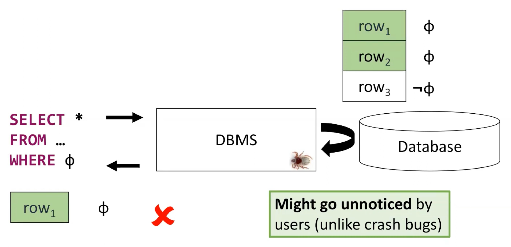
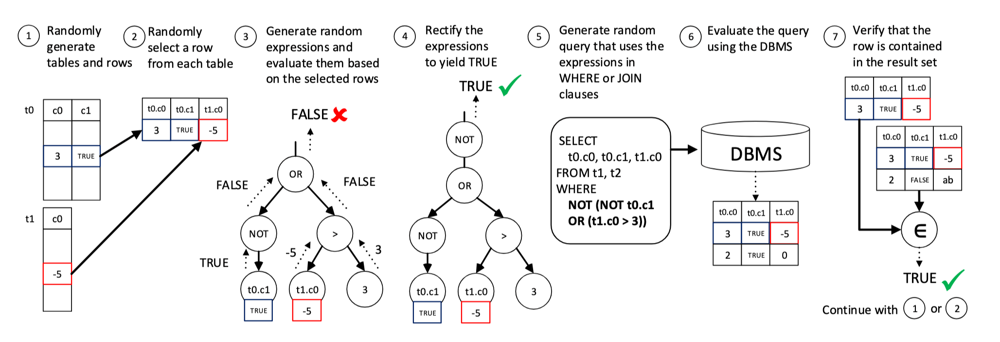
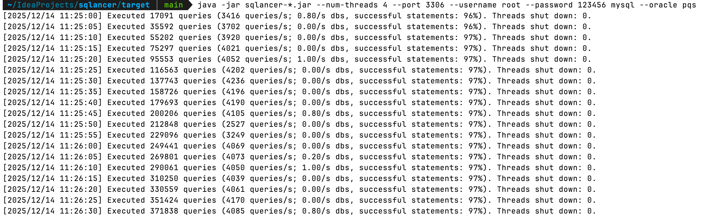
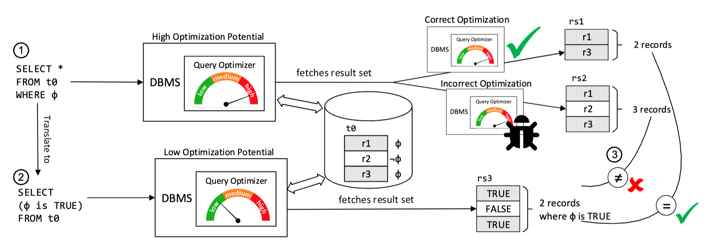
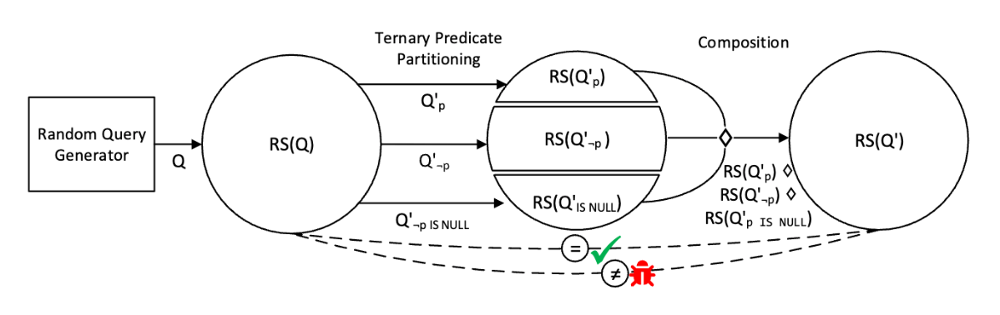
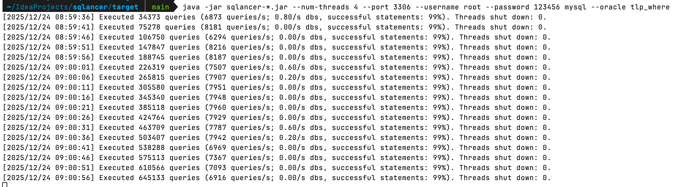

## 前言

在上一篇文章 [ShardingSphere 联邦查询 GROUPING 聚合结果问题分析](http://localhost:4000/blog/analyze-wrong-result-for-shardingsphere-sql-federation-grouping-function.html)中，我们详细介绍了联邦查询引擎实现 `GROUPING` 聚合函数存在的问题，当时笔者曾提到 [SQLacner](https://github.com/sqlancer/sqlancer) 测试工具，它能够通过一些科学的方法来发现 SQL 逻辑问题，帮助提升联邦查询引擎的 SQL 支持度。本文将为大家详细介绍 SQLacner 测试工具，以及工具中内置的几种测试方法，然后我们会使用 SQLacner 工具，直接对联邦查询引擎进行测试，看看这个工具是否能够达到预期的测试效果，发现一些有价值的 SQL 漏洞。

## 什么是 SQLacner

[SQLacner](https://github.com/sqlancer/sqlancer) 项目，是由 [Manuel Rigger](https://www.manuelrigger.at/) 教授创建的，旨在发现数据库 SQL 引擎的逻辑 BUG，Manuel Rigger 教授曾在 Andy 组织的线上分享中介绍过 SQLacner，感兴趣的朋友可以观看 [Finding Logic Bugs in Database Management Systems](https://www.youtube.com/watch?v=Np46NQ6lqP8) 视频了解。

> SQLancer is a tool to automatically test Database Management Systems (DBMSs) in order to find bugs in their implementation. That is, it finds bugs in the code of the DBMS implementation, rather than in queries written by the user. SQLancer has found hundreds of bugs in mature and widely-known DBMSs.

根据官方文档介绍，SQLancer 是一款用于自动测试数据库管理系统的工具，用于查找**数据库实现逻辑中的错误**。它查找的是 **DBMS 实现代码中的错误**，而不是用户编写 SQL 中的错误。目前，SQLancer 已在众多主流的 DBMS 中发现了数百个错误。

下图展示了一个具体的逻辑错误：当用户输入 SQL 语句查询数据时，原本数据库中存在 2 条匹配的数据，但由于数据库的 SQL 引擎存在**逻辑错误**，最终只返回了 1 条数据。除了**少返回数据行**外，逻辑错误还包含：**错误返回过滤条件外的结果**，**返回的数据行内容错误**等。



**数据库逻辑错误**相比于**语法错误**危害性更大，语法错误会在执行阶段通过异常码反馈出来，中断当前的 SQL 执行，逻辑错误则会返回不正确的查询结果，用户无法通过任何信息识别出当前的逻辑错误，最终可能会导致严重的业务错误。

使用 SQLancer 测试工具，可以快速发现 SQL 逻辑问题，帮助提升 SQL 引擎的正确性，下面我们将分别介绍 SQLancer 常用的几种测试方法，看看这些方法是如何检测 SQL 逻辑问题。

## PQS 测试方法

PQS 全称为 `Pivoted Query Synthesis（枢轴查询合成）`，该方法详细的介绍可以参考论文——[Testing Database Engines via
Pivoted Query Synthesis](https://arxiv.org/pdf/2001.04174)。它的**核心思想**是：**随机选择一条记录（即枢轴记录），然后基于这条记录生成过滤条件和查询语句，再去 DBMS 中执行查询，如果 DBMS 返回的结果集没有包含这条记录，则说明 DBMS 存在问题**。



上图展示了 PQS 测试方法的详细步骤，总结下来包括如下 7 个步骤：

1. 随机生成一些表（`t0` 和 `t1` 表）和数据行（`t0` 表 `c0:3, c1:TRUE` 数据行，`t1` 表 `c0:-5` 数据行）；
2. 从每张表中随机的选择一行数据，将这行数据作为基准行；
3. 基于选择的基准行，随机生成表达式，并根据基准行的值计算出表达式结果；
4. 根据表达式的计算结果调整表达式，直到表达式的计算结果为 `TRUE`，例如：上图步骤 3 中表达式计算结果为 `FALSE`，步骤 4 中通过增加 `NOT` 将计算结果调整为 `TRUE`；
5. 基于表达式随机生成查询语句，表达式使用在查询的 `WHERE` 或者 `JOIN` 子句中，查询语句会返回基准行对应的列（`SELECT t0.c0, t0.c1, t1.c0`）；
6. 将查询语句提交到 DBMS 中执行，获取返回的结果集；
7. 校验结果集是否包含最初选择的基准行，如果不包含，说明 DBMS 可能存在缺陷。

PQS 测试方法是 SQLancer 支持的第一个测试方法，它支持 `SQLite（3.28）`、`MySQL（8.0.16）` 及 `PostgreSQL（11.4）` 数据库，由于该测试方法实现的工作量巨大，需要为每个 DB 实现 AST 解释器，并且无法支持聚合函数、窗口函数测试，目前 **SQLancer 已经不再维护**，官方推荐使用其他测试方法。如果大家对这个测试方法感兴趣，仍然可以使用如下的命令执行 PQS 测试，`--oracle pqs` 属性用于指定测试预言机的类型。

```bash
java -jar sqlancer-*.jar --num-threads 4 --port 3306 --username root --password 123456 mysql --oracle pqs
```

下图展示了使用 SQLancer PQS 方法测试 MySQL 的截图，测试出的不支持 SQL 可以在 `target/logs` 目录下查看。



## NoREC 测试方法

`NoREC` 是 SQLancer 支持的第二个测试方法，全称是 `Non-Optimizing Reference Engine Construction（非优化参考引擎构造）`，该方法的详细内容可参考论文——[Detecting Optimization Bugs in Database Engines via Non-Optimizing Reference Engine Construction](https://arxiv.org/pdf/2007.08292)。

`NoREC` 的**核心思想**是：**通过对比优化查询与非优化查询的结果差异，来检测 SQL 优化可能存在的漏洞**。优化查询具体指：`SELECT * FROM t0 WHERE φ`，这条 SQL 可能会被 SQL 引擎优化，`NoREC` 测试方法会将这条 SQL 转换为非优化查询——`SELECT (φ IS TRUE) FROM t0`，将过滤条件移动到投影列中。通过 `NoREC` 测试方法，可以测试出数据库管理系统中的优化错误。



上图展示了 NoREC 测试方法的详细步骤，测试逻辑非常简单，具体如下：

1. 随机生成一条较高优化潜力的 SQL（数据库中大多数优化都和过滤相关，因此生成包含 WHERE 条件的 SQL，预期将会被数据库管理系统进行优化），例如：`SELECT * FROM t0 WHERE φ`；
2. 将优化 SQL 转换为无法优化的形式，具体来说，是将 WHERE 条件中的表达式移动到投影列中，例如：`SELECT (φ IS TRUE) FROM t0`，这种查询缺乏 WHERE 条件，数据库管理系统必须检索所有记录；
3. 执行优化 SQL 和未优化 SQL 并比较结果集，如果未优化 SQL 返回 TRUE 的行数不等于优化 SQL 返回行数，则说明存在 BUG。

NoREC 测试方法支持 `SQLite`、`MariaDB`、`PostgreSQL` 和 `CockroachDB` 数据库，支持 `WHERE`、`JOIN`、`ORDER BY` 等子句测试，暂不支持 `DISTINCT`、`窗口函数` 测试。相比于 PQS，NoREC 增加了对聚合函数的支持，并且可以检测重复记录错误。执行如下的命令测试 NoREC 方法，通过 `--oracle norec` 参数指定 NoREC 方法：

```bash
java -jar sqlancer-*.jar --num-threads 4 --port 3344 --username root --password 123456 mariadb --oracle norec
```

下图展示了使用 SQLancer PQS 方法测试 MariaDB 的截图，测试出的不支持 SQL 可以在 `target/logs` 目录下查看。


## TLP 测试方法

`TLP` 测试方法全称为 `Ternary Logic Partitioning（三元逻辑分区）`，该方法的详细介绍可以参考论文——[Finding bugs in database systems via query partitioning](https://dl.acm.org/doi/pdf/10.1145/3428279)。

`TLP` 测试方法的**核心思想**是：将一个原始查询分解为多个分区查询，每个分区查询计算原始查询结果的一个子集，然后通过组合操作将这些子集合并，验证合并结果是否与原始查询结果一致，不一致则说明存在 BUG。从 `TLP` 的命名我们可以看出，在进行分区查询时，该方法采用了**三元逻辑分区**，基于 SQL 的三值逻辑（`TRUE`、`FALSE`、`NULL`），将原始查询分解为三个分区查询，分别对应谓词为 `TRUE`、`FALSE` 和 `NULL` 的情况。



上图展示了 TLP 测试方法的实现原理，具体测试流程如下：

1. 随机生成数据库和查询语句；
2. 根据原始查询生成分区查询，例如：`WHERE p`、`WHERE NOT p`、`WHERE p IS NULL`；
3. 执行分区查询并合并查询结果；
4. 与原始查询结果对比，不一致则发现 DB BUG。

如下表所示，`TLP` 测试方法相比 `PQS`（主要测试 WHERE）和 `NoREC`（主要测试 WHERE，部分聚合），能够支持更多的语法类型，包括：`WHERE`、`GROUP BY`、`HAVING`、聚合函数（如 `MIN`、`MAX`、`SUM`、`COUNT`、`AVG`）和 `DISTINCT` 查询。目前，`TLP` 测试方法已经支持了 `SQLite`、`MySQL`、`PostgreSQL` 等多种数据库，可以将 `TLP` 和其他测试方法结合，覆盖更多的测试场景。


执行如下的命令测试 TLP 方法，通过 `--oracle tlp_where` 参数指定 TLP 方法：

```bash
java -jar sqlancer-*.jar --num-threads 4 --port 3306 --username root --password 123456 mysql --oracle tlp_where
```

下图展示了使用 SQLancer TLP 方法测试 MySQL 的截图，测试出的不支持 SQL 可以在 `target/logs` 目录下查看。



## DQE 测试方法

TODO

## 联邦查询测试实战

SQLancer 测试 java -jar sqlancer-*.jar --num-threads 4 --port 3307 --username root --password root mysql

TODO




欢迎关注「**端小强的博客**」微信公众号，会不定期分享日常学习和工作经验，欢迎大家关注交流。


