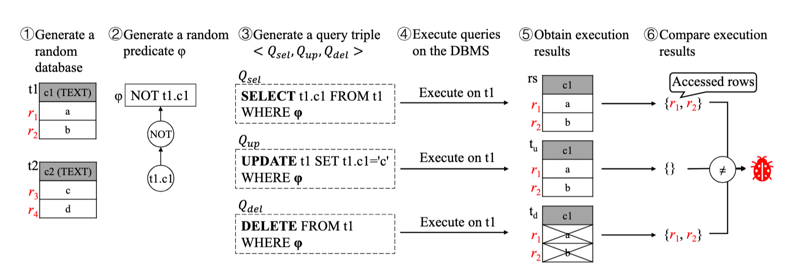
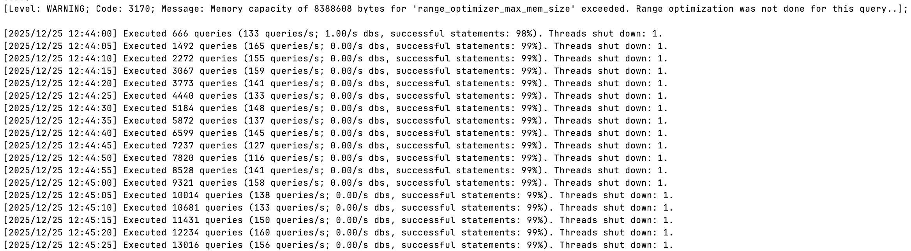
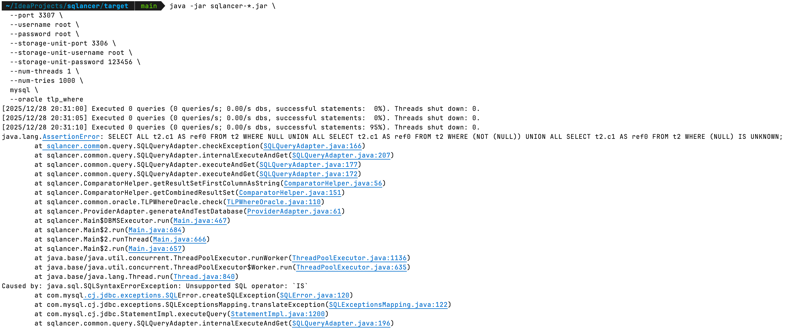

## 前言

在上一篇文章 [ShardingSphere 联邦查询 GROUPING 聚合结果问题分析](http://localhost:4000/blog/analyze-wrong-result-for-shardingsphere-sql-federation-grouping-function.html)中，我们详细介绍了联邦查询引擎实现 `GROUPING` 聚合函数存在的问题，当时笔者曾提到 [SQLacner](https://github.com/sqlancer/sqlancer) 测试工具，它能够通过一些科学的方法来发现 SQL 逻辑问题，帮助提升联邦查询引擎的 SQL 支持度。本文将为大家详细介绍 SQLacner 测试工具，以及工具中内置的几种测试方法，然后我们会使用 SQLacner 工具，直接对联邦查询引擎进行测试，看看这个工具是否能够达到预期的测试效果，发现一些有价值的 SQL 漏洞。

## 什么是 SQLacner

[SQLacner](https://github.com/sqlancer/sqlancer) 项目，是由 [Manuel Rigger](https://www.manuelrigger.at/) 教授创建的，旨在发现数据库 SQL 引擎的逻辑 BUG，Manuel Rigger 教授曾在 Andy 组织的线上分享中介绍过 SQLacner，感兴趣的朋友可以观看 [Finding Logic Bugs in Database Management Systems](https://www.youtube.com/watch?v=Np46NQ6lqP8) 视频了解。

> SQLancer is a tool to automatically test Database Management Systems (DBMSs) in order to find bugs in their implementation. That is, it finds bugs in the code of the DBMS implementation, rather than in queries written by the user. SQLancer has found hundreds of bugs in mature and widely-known DBMSs.

根据官方文档介绍，SQLancer 是一款用于自动测试数据库管理系统的工具，用于查找**数据库实现逻辑中的错误**。它查找的是 **DBMS 实现代码中的错误**，而不是用户编写 SQL 中的错误。目前，SQLancer 已在众多主流的 DBMS 中发现了数百个错误。

下图展示了一个具体的逻辑错误：当用户输入 SQL 语句查询数据时，原本数据库中存在 2 条匹配的数据，但由于数据库的 SQL 引擎存在**逻辑错误**，最终只返回了 1 条数据。除了**少返回数据行**外，逻辑错误还包含：**错误返回过滤条件外的结果**，**返回的数据行内容错误**等。


**数据库逻辑错误**相比于**语法错误**危害性更大，语法错误会在执行阶段通过异常码反馈出来，中断当前的 SQL 执行，逻辑错误则会返回不正确的查询结果，用户无法通过任何信息识别出当前的逻辑错误，最终可能会导致严重的业务错误。

使用 SQLancer 测试工具，可以快速发现 SQL 逻辑问题，帮助提升 SQL 引擎的正确性，下面我们将分别介绍 SQLancer 常用的几种测试方法，看看这些方法是如何检测 SQL 逻辑问题。

## PQS 测试方法

PQS 全称为 `Pivoted Query Synthesis（枢轴查询合成）`，该方法详细的介绍可以参考论文——[Testing Database Engines via
Pivoted Query Synthesis](https://arxiv.org/pdf/2001.04174)。它的**核心思想**是：**随机选择一条记录（即枢轴记录），然后基于这条记录生成过滤条件和查询语句，再去 DBMS 中执行查询，如果 DBMS 返回的结果集没有包含这条记录，则说明 DBMS 存在问题**。


上图展示了 PQS 测试方法的详细步骤，总结下来包括如下 7 个步骤：

1. 随机生成一些表（`t0` 和 `t1` 表）和数据行（`t0` 表 `c0:3, c1:TRUE` 数据行，`t1` 表 `c0:-5` 数据行）；
2. 从每张表中随机的选择一行数据，将这行数据作为基准行；
3. 基于选择的基准行，随机生成表达式，并根据基准行的值计算出表达式结果；
4. 根据表达式的计算结果调整表达式，直到表达式的计算结果为 `TRUE`，例如：上图步骤 3 中表达式计算结果为 `FALSE`，步骤 4 中通过增加 `NOT` 将计算结果调整为 `TRUE`；
5. 基于表达式随机生成查询语句，表达式使用在查询的 `WHERE` 或者 `JOIN` 子句中，查询语句会返回基准行对应的列（`SELECT t0.c0, t0.c1, t1.c0`）；
6. 将查询语句提交到 DBMS 中执行，获取返回的结果集；
7. 校验结果集是否包含最初选择的基准行，如果不包含，说明 DBMS 可能存在缺陷。

PQS 测试方法是 SQLancer 支持的第一个测试方法，它支持 `SQLite（3.28）`、`MySQL（8.0.16）` 及 `PostgreSQL（11.4）` 数据库，由于该测试方法实现的工作量巨大，需要为每个 DB 实现 AST 解释器，并且无法支持聚合函数、窗口函数测试，目前 **SQLancer 已经不再维护**，官方推荐使用其他测试方法。如果大家对这个测试方法感兴趣，仍然可以使用如下的命令执行 PQS 测试，`--oracle pqs` 属性用于指定测试预言机的类型。

```bash
java -jar sqlancer-*.jar --num-threads 4 --port 3306 --username root --password 123456 mysql --oracle pqs
```

下图展示了使用 SQLancer PQS 方法测试 MySQL 的截图，测试出的不支持 SQL 可以在 `target/logs` 目录下查看。


## NoREC 测试方法

`NoREC` 是 SQLancer 支持的第二个测试方法，全称是 `Non-Optimizing Reference Engine Construction（非优化参考引擎构造）`，该方法的详细内容可参考论文——[Detecting Optimization Bugs in Database Engines via Non-Optimizing Reference Engine Construction](https://arxiv.org/pdf/2007.08292)。

`NoREC` 的**核心思想**是：**通过对比优化查询与非优化查询的结果差异，来检测 SQL 优化可能存在的漏洞**。优化查询具体指：`SELECT * FROM t0 WHERE φ`，这条 SQL 可能会被 SQL 引擎优化，`NoREC` 测试方法会将这条 SQL 转换为非优化查询——`SELECT (φ IS TRUE) FROM t0`，将过滤条件移动到投影列中。通过 `NoREC` 测试方法，可以测试出数据库管理系统中的优化错误。


上图展示了 NoREC 测试方法的详细步骤，测试逻辑非常简单，具体如下：

1. 随机生成一条较高优化潜力的 SQL（数据库中大多数优化都和过滤相关，因此生成包含 WHERE 条件的 SQL，预期将会被数据库管理系统进行优化），例如：`SELECT * FROM t0 WHERE φ`；
2. 将优化 SQL 转换为无法优化的形式，具体来说，是将 WHERE 条件中的表达式移动到投影列中，例如：`SELECT (φ IS TRUE) FROM t0`，这种查询缺乏 WHERE 条件，数据库管理系统必须检索所有记录；
3. 执行优化 SQL 和未优化 SQL 并比较结果集，如果未优化 SQL 返回 TRUE 的行数不等于优化 SQL 返回行数，则说明存在 BUG。

NoREC 测试方法支持 `SQLite`、`MariaDB`、`PostgreSQL` 和 `CockroachDB` 数据库，支持 `WHERE`、`JOIN`、`ORDER BY` 等子句测试，暂不支持 `DISTINCT`、`窗口函数` 测试。相比于 PQS，NoREC 增加了对聚合函数的支持，并且可以检测重复记录错误。执行如下的命令测试 NoREC 方法，通过 `--oracle norec` 参数指定 NoREC 方法：

```bash
java -jar sqlancer-*.jar --num-threads 4 --port 3344 --username root --password 123456 mariadb --oracle norec
```

下图展示了使用 SQLancer PQS 方法测试 MariaDB 的截图，测试出的不支持 SQL 可以在 `target/logs` 目录下查看。


## TLP 测试方法

`TLP` 测试方法全称为 `Ternary Logic Partitioning（三元逻辑分区）`，该方法的详细介绍可以参考论文——[Finding bugs in database systems via query partitioning](https://dl.acm.org/doi/pdf/10.1145/3428279)。

`TLP` 测试方法的**核心思想**是：将一个原始查询分解为多个分区查询，每个分区查询计算原始查询结果的一个子集，然后通过组合操作将这些子集合并，验证合并结果是否与原始查询结果一致，不一致则说明存在 BUG。从 `TLP` 的命名我们可以看出，在进行分区查询时，该方法采用了**三元逻辑分区**，基于 SQL 的三值逻辑（`TRUE`、`FALSE`、`NULL`），将原始查询分解为三个分区查询，分别对应谓词为 `TRUE`、`FALSE` 和 `NULL` 的情况。


上图展示了 TLP 测试方法的实现原理，具体测试流程如下：

1. 随机生成数据库和查询语句；
2. 根据原始查询生成分区查询，例如：`WHERE p`、`WHERE NOT p`、`WHERE p IS NULL`；
3. 执行分区查询并合并查询结果；
4. 与原始查询结果对比，不一致则发现 DB BUG。

如下表所示，`TLP` 测试方法相比 `PQS`（主要测试 WHERE）和 `NoREC`（主要测试 WHERE，部分聚合），能够支持更多的语法类型，包括：`WHERE`、`GROUP BY`、`HAVING`、聚合函数（如 `MIN`、`MAX`、`SUM`、`COUNT`、`AVG`）和 `DISTINCT` 查询。目前，`TLP` 测试方法已经支持了 `SQLite`、`MySQL`、`PostgreSQL` 等多种数据库，可以将 `TLP` 和其他测试方法结合，覆盖更多的测试场景。


执行如下的命令测试 TLP 方法，通过 `--oracle tlp_where` 参数指定 TLP 方法：

```bash
java -jar sqlancer-*.jar --num-threads 4 --port 3306 --username root --password 123456 mysql --oracle tlp_where
```

下图展示了使用 SQLancer TLP 方法测试 MySQL 的截图，测试出的不支持 SQL 可以在 `target/logs` 目录下查看。


## DQE 测试方法

`DQE` 测试方法全称为 `Differential Query Execution（差分查询执行）`，该方法由国内研究团队提出，详细论文内容可以参考——[Testing Database Systems via Differential Query Execution](https://share.note.youdao.com/s/1IGOxnvZ)。

`DQE` 测试方法的**核心思想**是：使用相同谓词（WHERE 条件）生成 `SELECT`、`UPDATE` 和 `DELETE` 语句，然后分别执行这 3 条语句，观察他们操作的数据行，如果操作的数据行不一致，则可能存在逻辑错误。



上图展示了 DQE 测试方法的详细流程，具体测试细节如下：

1. 生成随机的库（`t1`、`t2`）和表（`c1`、`c2`）；
2. 生成随机谓词，例如：`NOT t1.c1`；
3. 基于相同的谓词，生成一个查询元组，包含 `SELECT`、`UPDATE` 和 `DELETE` 语句；
4. 在相同的数据库状态下，执行 `SELECT`、`UPDATE` 和 `DELETE` 语句；
5. 获取 `SELECT`、`UPDATE` 和 `DELETE` 语句执行结果；
6. 比较执行结果：`SELECT` 语句返回 `rowId`，确定访问的数据行范围。`UPDATE` 语句除了更新常规字段外，还额外更新 `updated` 为 1，执行后检查 `updated = 1` 的数据行及其 `rowId`，确认修改行是否和 `SELECT` 一致。`DELETE` 语句执行前记录所有 `rowId`，执行后比较出删除的 `rowId` 范围，并和 `SELECT` 语句对比是否一致。

`DQE` 相比前文提到的其他测试方法，首次提出了针对 `UPDATE` 和 `DELETE` 语句逻辑错误的检测方法，并且支持 `MySQL`、`MariaDB`、`CockroachDB` 等数据库，完善了 SQLancer 测试工具覆盖的 SQL 场景。但是差分测试也存在一定的局限性，例如：无法测试出 `SELECT`、`UPDATE` 和 `DELETE` 语句同时出现相同错误的场景，不支持 `DISTINCT`、`GROUP BY` 等语法，以及包含非确定函数的场景（例如：`RAND` 函数）。

执行如下的命令测试 DQE 方法，通过 `--oracle dqe` 参数指定 DQE 方法：

```bash
java -jar sqlancer-*.jar --num-threads 4 --port 3306 --username root --password 123456 mysql --oracle dqe
```

下图展示了使用 SQLancer DQE 方法测试 MySQL 的截图，测试出的不支持 SQL 可以在 `target/logs` 目录下查看。



## 联邦查询测试实战

前文我们介绍了 SQLancer 常用的 4 种测试方法，通过这 4 种方法，可以较为全面地覆盖 `SELECT`、`UPDATE` 和 `DELETE` 语句，测试出 SQL 引擎的逻辑错误。本小节我们再来研究下，如何将 SQLancer 应用到 ShardingSphere 联邦查询功能中，帮助我们发现更多联邦查询的功能漏洞。

在开始测试联邦查询前，我们先了解下 SQLancer 工具如何使用，按照如下的命令克隆源码（Fork 仓库增加了对 ShardingSphere 的适配），然后进行编译打包，最后执行 `java -jar sqlancer-*.jar --num-threads 4 sqlite3 --oracle NoREC` 命令来开始测试。

```bash
git clone git@github.com:strongduanmu/sqlancer.git
cd sqlancer
mvn package -DskipTests
cd target
java -jar sqlancer-*.jar --num-threads 4 sqlite3 --oracle NoREC
```

执行 `java -jar sqlancer-*.jar -h` 命令可以查看 SQLancer 所有命令参数及说明，下面展示的内容进行了一些截取，重点展示 SQLancer 全局选项（`options`） 以及 MySQL 数据库的参数选项。从 Usage 格式可以看出（`Usage: SQLancer [options] [command] [command options]`），SQLancer 命令需要先指定全局选项 `options`（例如：`--num-threads 4`），然后再指定数据库专属命令 `command`（例如：`sqlite3`） 以及数据库专属选项 `command options`（例如：`--oracle NoREC`）。

```properties
Usage: SQLancer [options] [command] [command options]
  Options:
    --canonicalize-sql-strings
      # 自动给 SQL 末尾加分号，适配严格要求语句结束符的 DBMS
      Should canonicalize query string (add ';' at the end
      Default: true
    --database-prefix
      # 生成数据库的名称前缀，便于识别测试库（如 database_1、database_2）
      The prefix used for each database created
      Default: database
    --help, -h
      Lists all supported options and commands
    --host
      # 数据库服务器地址
      The host used to log into the DBMS
    --max-expression-depth
      # 随机生成表达式的最大嵌套深度，增大值（如 5）可测试复杂表达式
      Specifies the maximum depth of randomly-generated expressions
      Default: 3
    --max-num-inserts
      # 每个测试周期执行的 INSERT 语句数，控制测试数据量
      Specifies how many INSERT statements should be issued
      Default: 30
    --num-queries
      # 每个数据库执行的查询数，达到该数量后自动创建新数据库继续测试
      Specifies the number of queries to be issued to a database before 
      creating a new database
      Default: 100000
    --num-threads
      # 并发测试的线程数，线程数越多测试效率越高，但需避免 DBMS 资源耗尽
      How many threads should run concurrently to test separate databases
      Default: 16
    --num-tries
      # 发现错误后停止测试的阈值，找到 100 个错误即终止，可设更大值（如 1000）延长测试
      Specifies after how many found errors to stop testing
      Default: 100
    --password
      # 登录数据库的密码
      The password used to log into the DBMS
      Default: sqlancer
    --port
      # 数据库端口
      The port used to log into the DBMS
      Default: -1
    --pqs-test-aggregates
      # 仅当表只有 1 行时，测试聚合函数（非 PQS 测试方法特有属性）
      Partially test aggregate functions when all tables contain only a single 
      row. 
      Default: false
    --print-progress-information
      # 打印进度（生成的数据库数 / 执行的查询数），用于监控测试进度
      Whether to print progress information such as the number of databases 
      generated or queries issued
      Default: true
    --print-progress-summary
      # 退出时打印执行汇总（总查询数 / 错误数等），测试结束后统计结果
      Whether to print an execution summary when exiting SQLancer
      Default: true
    --random-seed
      # 随机种子，设为非 -1 值（如 12345）可复现测试过程（确定性生成）
      A seed value != -1 that can be set to make the query and database 
      generation deterministic
      Default: -1
    --random-string-generation
      # 随机字符串生成策略，NUMERIC（纯数字）、ALPHANUMERIC（字母数字）、ALPHANUMERIC_SPECIALCHAR（含特殊字符）、SOPHISTICATED（复杂混合）
      Select the random-string eneration approach
      Default: SOPHISTICATED
      Possible Values: [NUMERIC, ALPHANUMERIC, ALPHANUMERIC_SPECIALCHAR, SOPHISTICATED]
    --serialize-reproduce-state
      # 序列化测试状态，用于测出 BUG 后复现问题
      Serialize the state to reproduce
      Default: false
    --storage-unit-host
      # ShardingSphere 存储单元数据库服务器地址
      Storage unit host for ShardingSphere
      Default: 127.0.0.1
    --storage-unit-password
      # ShardingSphere 存储单元密码
      Storage unit password for ShardingSphere
      Default: 123456
    --storage-unit-port
      # ShardingSphere 存储单元端口
      Storage unit port for ShardingSphere
      Default: 3306
    --storage-unit-username
      # ShardingSphere 存储单元用户名
      Storage unit username for ShardingSphere
      Default: root
    --string-constant-max-length
      # 生成字符串常量的最大长度，增大值（如 50）可测试长字符串场景
      Specify the maximum-length of generated string constants
      Default: 10
    --username
      # 数据库用户名
      The user name used to log into the DBMS
      Default: sqlancer
  Commands:
    mysql      MySQL (default port: 3306, default host: localhost)
      Usage: mysql [options]
        Options:
          # 指定 MySQL 测试使用的测试预言机，默认值 为 TLP_WHERE
          --oracle
            Default: [TLP_WHERE]
```

由于 ShardingSphere 有逻辑库和存储单元（物理库）的概念，因此需要对 SQLancer 进行一些改造，才能测试 ShardingSphere 联邦查询。从上面的属性可以看出，我们新增了 `storage-unit-host`、`storage-unit-port`、`storage-unit-username` 和 `storage-unit-password` 属性，用于指定 ShardingSphere 存储单元的连接信息。而 SQLancer 原有的属性 `host`、`port`、`username`、`password`，则用于连接 ShardingSphere Proxy 接入端。

当 SQLancer 工具创建测试库时，不仅会在 Proxy 接入端创建逻辑库，还会额外通过 DistSQL 注册物理存储单元，然后再进行建表、生成数据和 SQL 测试等操作。我们执行如下的命令测试 ShardingSphere 联邦查询，`--storage-unit-*` 属性用于指定存储单元的连接信息，`--num-threads` 用来指定测试线程数，`--num-tries` 则用于控制发现多少个错误则终止测试。

```bash
java -jar sqlancer-*.jar \
  --port 3307 \
  --username root \
  --password root \
  --storage-unit-port 3306 \
  --storage-unit-username root \
  --storage-unit-password 123456 \
  --num-threads 1 \
  --num-tries 1000 \
  mysql \
  --oracle tlp_where
```

ShardingSphere 商业联邦查询的配置可以参考[联邦查询-配置示例](https://docs.sphere-ex.com/sphereex-dbplussuite/master/zh/docs/plugin-guide/sql-federation/#%E9%85%8D%E7%BD%AE%E7%A4%BA%E4%BE%8B)文档，首先在 Proxy 端执行以下的 DistSQL 开启联邦查询，`ALL_QUERY_USE_SQL_FEDERATION` 设置为 `true`，保证所有的 DML SQL 使用联邦查询引擎执行。

```sql
ALTER SQL_FEDERATION RULE (
    SQL_FEDERATION_ENABLED=true,
    ALL_QUERY_USE_SQL_FEDERATION=true,
    EXECUTION_PLAN_CACHE(INITIAL_CAPACITY=2000, MAXIMUM_SIZE=65535, TTL_MILLI_SECONDS=86400000),
    MAX_USAGE_MEMORY_PER_QUERY='10M',
    SPILL_ENABLED=true,
    SPILL_PATH="file:///tmp/dbplusengine/spill",
    SPILL_COMPRESSION_ENABLED=true
);
```

然后我们再开启统计信息收集功能，支持 SQLancer 对库、表、列等信息的查询，确保 SQLancer 测试逻辑能够正常运行。

```sql
ALTER STATISTICS_STORAGE RULE (
    NAME_PREFIX=sphereex,
    STORAGE UNIT (
        URL = "jdbc:mysql://127.0.0.1:3306?serverTimezone=UTC&useSSL=false&allowPublicKeyRetrieval=true",
        USER = "root",
        PASSWORD = "123456",
        PROPERTIES("minPoolSize"=1, "maxPoolSize"=2)
    )
);
```

开启统计信息收集，需要在 MySQL 中执行 Grant 语句给 `STATISTICS_STORAGE Rule` 中的账号赋权（如下数据库账号按照实际情况修改）。

```sql
GRANT CREATE, SELECT, INSERT, UPDATE, DELETE, DROP ON sphereex_information_schema.* TO 'root'@'%';
GRANT CREATE, SELECT, INSERT, UPDATE, DELETE, DROP ON sphereex_shardingsphere.* TO 'root'@'%';
```

再执行 DistSQL 设置统计信息收集间隔，并开启统计信息收集功能。

```sql
SET DIST VARIABLE proxy_meta_data_collector_cron = '0 0/30 * * * ?';
SET DIST VARIABLE proxy_meta_data_collector_enabled = 'true';
```

首次开启统计信息功能，我们可以主动执行 `REFRESH STATISTICS METADATA;` 更新统计信息。

```sql
REFRESH STATISTICS METADATA;
```

配置完联邦查询功能，并开启统计信息收集后，我们可以执行前面的 SQLancer 命令，来测试下 ShardingSphere 联邦查询功能，很快我们就测试出了第一个联邦查询不支持的 Case——`IS UNKNOWN` 语法（异常 Case 会输出到 `target/logs/mysql` 目录下）。



SQLancer 提供的报错信息很全面，不仅包含了异常堆栈信息，还提供了复现这个异常所需的 SQL 操作步骤，我们依次执行 SQL 语句，就可以快速复现异常。

```sql
java.lang.AssertionError: SELECT ALL t2.c1 AS ref0 FROM t2 WHERE NULL UNION ALL SELECT t2.c1 AS ref0 FROM t2 WHERE (NOT (NULL)) UNION ALL SELECT t2.c1 AS ref0 FROM t2 WHERE (NULL) IS UNKNOWN;
        at sqlancer.common.query.SQLQueryAdapter.checkException(SQLQueryAdapter.java:166)
        at sqlancer.common.query.SQLQueryAdapter.internalExecuteAndGet(SQLQueryAdapter.java:207)
        at sqlancer.common.query.SQLQueryAdapter.executeAndGet(SQLQueryAdapter.java:177)
        at sqlancer.common.query.SQLQueryAdapter.executeAndGet(SQLQueryAdapter.java:172)
        at sqlancer.ComparatorHelper.getResultSetFirstColumnAsString(ComparatorHelper.java:56)
        at sqlancer.ComparatorHelper.getCombinedResultSet(ComparatorHelper.java:151)
        at sqlancer.common.oracle.TLPWhereOracle.check(TLPWhereOracle.java:110)
        at sqlancer.ProviderAdapter.generateAndTestDatabase(ProviderAdapter.java:61)
        at sqlancer.Main$DBMSExecutor.run(Main.java:467)
        at sqlancer.Main$2.run(Main.java:684)
        at sqlancer.Main$2.runThread(Main.java:666)
        at sqlancer.Main$2.run(Main.java:657)
        at java.base/java.util.concurrent.ThreadPoolExecutor.runWorker(ThreadPoolExecutor.java:1136)
        at java.base/java.util.concurrent.ThreadPoolExecutor$Worker.run(ThreadPoolExecutor.java:635)
        at java.base/java.lang.Thread.run(Thread.java:840)
Caused by: java.sql.SQLSyntaxErrorException: Unsupported SQL operator: `IS`
        at com.mysql.cj.jdbc.exceptions.SQLError.createSQLException(SQLError.java:120)
        at com.mysql.cj.jdbc.exceptions.SQLExceptionsMapping.translateException(SQLExceptionsMapping.java:122)
        at com.mysql.cj.jdbc.StatementImpl.executeQuery(StatementImpl.java:1200)
        at sqlancer.common.query.SQLQueryAdapter.internalExecuteAndGet(SQLQueryAdapter.java:196)
        ... 13 more
--java.lang.AssertionError: SELECT ALL t2.c1 AS ref0 FROM t2 WHERE NULL UNION ALL SELECT t2.c1 AS ref0 FROM t2 WHERE (NOT (NULL)) UNION ALL SELECT t2.c1 AS ref0 FROM t2 WHERE (NULL) IS UNKNOWN;
--      at sqlancer.common.query.SQLQueryAdapter.checkException(SQLQueryAdapter.java:166)
--      at sqlancer.common.query.SQLQueryAdapter.internalExecuteAndGet(SQLQueryAdapter.java:207)
--      at sqlancer.common.query.SQLQueryAdapter.executeAndGet(SQLQueryAdapter.java:177)
--      at sqlancer.common.query.SQLQueryAdapter.executeAndGet(SQLQueryAdapter.java:172)
--      at sqlancer.ComparatorHelper.getResultSetFirstColumnAsString(ComparatorHelper.java:56)
--      at sqlancer.ComparatorHelper.getCombinedResultSet(ComparatorHelper.java:151)
--      at sqlancer.common.oracle.TLPWhereOracle.check(TLPWhereOracle.java:110)
--      at sqlancer.ProviderAdapter.generateAndTestDatabase(ProviderAdapter.java:61)
--      at sqlancer.Main$DBMSExecutor.run(Main.java:467)
--      at sqlancer.Main$2.run(Main.java:684)
--      at sqlancer.Main$2.runThread(Main.java:666)
--      at sqlancer.Main$2.run(Main.java:657)
--      at java.base/java.util.concurrent.ThreadPoolExecutor.runWorker(ThreadPoolExecutor.java:1136)
--      at java.base/java.util.concurrent.ThreadPoolExecutor$Worker.run(ThreadPoolExecutor.java:635)
--      at java.base/java.lang.Thread.run(Thread.java:840)
--Caused by: java.sql.SQLSyntaxErrorException: Unsupported SQL operator: `IS`
--      at com.mysql.cj.jdbc.exceptions.SQLError.createSQLException(SQLError.java:120)
--      at com.mysql.cj.jdbc.exceptions.SQLExceptionsMapping.translateException(SQLExceptionsMapping.java:122)
--      at com.mysql.cj.jdbc.StatementImpl.executeQuery(StatementImpl.java:1200)
--      at sqlancer.common.query.SQLQueryAdapter.internalExecuteAndGet(SQLQueryAdapter.java:196)
--      ... 13 more
--
-- Time: 2025/12/28 20:31:14
-- Database: database0
-- Database version: 5.7.22-DBPlusEngine-Proxy 5.5.3-SNAPSHOT-82e26ad
-- seed value: 1766925060265
DROP DATABASE IF EXISTS database0;
CREATE DATABASE database0;
USE database0;
CREATE TABLE t0(c0 VARCHAR(500)  COMMENT 'asdf'  NULL COLUMN_FORMAT DEFAULT, c1 DECIMAL  STORAGE MEMORY) ;
INSERT INTO t0(c0) VALUES(0.5415928422036966);
UPDATE t0 SET c1=0.6302674886178765, c0="0.6302674886178765";
INSERT DELAYED INTO t0(c1, c0) VALUES(NULL, 'h{|Ij#k}');
INSERT INTO t0(c1) VALUES(0.3379070670876593);
UPDATE t0 SET c1=-947955752 WHERE CAST(' *Y' AS SIGNED);
UPDATE t0 SET c1=(NOT ( EXISTS (SELECT 1 wHERE FALSE))), c0=t0.c0;
INSERT INTO t0(c1) VALUES("(g");
INSERT IGNORE INTO t0(c1) VALUES("9");
DELETE IGNORE FROM t0;
INSERT IGNORE INTO t0(c1) VALUES(NULL), (NULL), (0.2584659624758967), (NULL), ("i|&");
DELETE IGNORE FROM t0;
ALTER TABLE t0 DELAY_KEY_WRITE 0, COMPRESSION 'ZLIB';
SHOW TABLES;
INSERT HIGH_PRIORITY IGNORE INTO t0(c1) VALUES(1634001425);
INSERT LOW_PRIORITY INTO t0(c0) VALUES("");
SHOW TABLES;
UPDATE t0 SET c0=-1148055694;
UPDATE t0 SET c0=17125872;
INSERT IGNORE INTO t0(c1, c0) VALUES(0.3283236604697395, NULL);
INSERT INTO t0(c1) VALUES(0.048050841555574375);
ALTER TABLE t0 DROP c0, FORCE, CHECKSUM 1;
INSERT LOW_PRIORITY INTO t0(c1) VALUES(0.07787208116702882);
DELETE LOW_PRIORITY QUICK IGNORE FROM t0;
INSERT IGNORE INTO t0(c1) VALUES(829218842);
INSERT LOW_PRIORITY INTO t0(c1) VALUES(NULL);
INSERT IGNORE INTO t0(c1) VALUES(NULL);
INSERT INTO t0(c1) VALUES(0.02242428818878528);
DELETE QUICK IGNORE FROM t0;
ALTER TABLE t0 INSERT_METHOD FIRST, PACK_KEYS 1, DISABLE KEYS, COMPRESSION 'NONE', ROW_FORMAT FIXED, CHECKSUM 0, STATS_PERSISTENT DEFAULT, FORCE, RENAME AS t0, DELAY_KEY_WRITE 0, ALGORITHM DEFAULT, STATS_AUTO_RECALC DEFAULT;
ALTER TABLE t0 ENABLE KEYS, ALGORITHM INPLACE, STATS_PERSISTENT 0, CHECKSUM 0, PACK_KEYS 0, INSERT_METHOD LAST;
ALTER TABLE t0 FORCE, ROW_FORMAT REDUNDANT, INSERT_METHOD NO, STATS_AUTO_RECALC DEFAULT, PACK_KEYS 0, ENABLE KEYS, STATS_PERSISTENT 1, RENAME AS t0, ALGORITHM DEFAULT;
ALTER TABLE t0 PACK_KEYS 0, STATS_PERSISTENT DEFAULT, ENABLE KEYS, ALGORITHM COPY, ROW_FORMAT DYNAMIC, RENAME t2, CHECKSUM 0, COMPRESSION 'NONE', STATS_AUTO_RECALC 1, DELAY_KEY_WRITE 0, INSERT_METHOD NO, FORCE;
INSERT HIGH_PRIORITY IGNORE INTO t2(c1) VALUES(-1656112204);
UPDATE t2 SET c1= EXISTS (SELECT 1 wHERE FALSE);
INSERT DELAYED IGNORE INTO t2(c1) VALUES('1e500');
SHOW TABLES;
INSERT HIGH_PRIORITY IGNORE INTO t2(c1) VALUES(0.9546301382857064);
```

另外，我们还可以根据 `seed value: 1766925060265` 来控制 SQLancer 生成的 Case，使用相同的种子值（通过参数 `--random-seed 1766925060265` 控制），可以生成相同的测试 Case，这样我们就可以稳定复现异常。

```bash
java -jar sqlancer-*.jar \
  --port 3307 \
  --username root \
  --password root \
  --storage-unit-port 3306 \
  --storage-unit-username root \
  --storage-unit-password 123456 \
  --random-seed 1766925060265 \
  --num-threads 1 \
  --num-tries 1000 \
  mysql \
  --oracle tlp_where
```

SQLancer 测试工具功能强大，目前已经测试出一批 ShardingSphere 联邦查询不支持的 Case，由于篇幅限制，本文就不一一介绍了，笔者会根据这些异常信息，逐个进行分析和修复，不断提升 ShardingSphere 联邦查询的 SQL 支持度。大家如果有 SQL 引擎的测试需求，不妨也尝试下 SQLancer，相信它一定能够发现更多潜在的问题，帮助大家提升 SQL 引擎的稳定性。由于笔者也是初次探索和使用 SQLancer，如果文章有错误之处，或者其他 SQLancer 使用技巧，欢迎大家留言指导。




欢迎关注「**端小强的博客**」微信公众号，会不定期分享日常学习和工作经验，欢迎大家关注交流。


