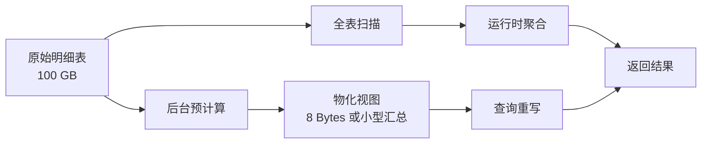
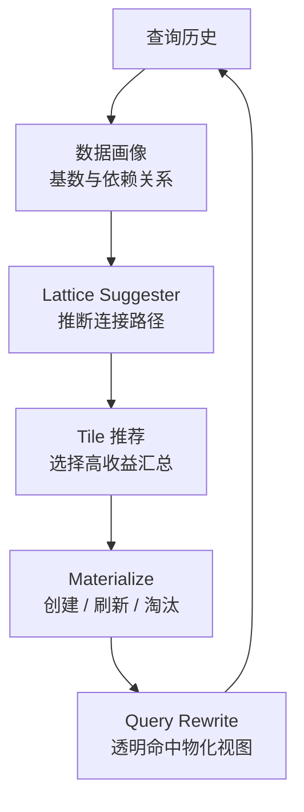

# Calcite：跳出 SQL 查询优化，转向数据优化

## 引言：从查询微调到数据架构的演进

在数据库架构和数据仓库的演进过程中，传统优化方法论长期由一个核心假设主导：分析型系统的性能瓶颈，可以通过对查询语句的精细调优来克服。数据库管理员（`DBA`）和数据工程师通常会耗费数千小时进行查询重构、连接重排序（`Join Reordering`）、谓词下推（`Predicate Pushdown`），以及手动创建单维度的 `B` 树索引，以期在面对呈指数级增长的数据量时，维持系统的响应速度。然而，这种基于**查询优化**的传统范式，正面临物理硬件和计算复杂性上的双重极限。

对此，现代数据工程领域正在经历一场架构范式转移。这一转变由顶尖数据架构师 `Julian Hyde` 进行了详尽而有力的阐述。`Julian Hyde` 是开源关系型查询优化框架 `Apache Calcite` 的初始开发者，也是 `Mondrian OLAP` 引擎、`SQLstream` 的联合创始人，并曾担任 `Looker`（2020 年被 `Google` 收购）的查询处理团队负责人，随后于 2025 年离开 `Google`，开发下一代函数式查询语言 `Morel`。他在顶级数据科学会议 `AI Council` 上发表了题为 **Don't Optimize My Queries, Optimize My Data!** 的开创性演讲。

这一论断的逻辑很直接：当数据本身的组织结构处于次优状态时，再先进的查询优化器也无法突破物理 `I/O` 带宽的硬限制。通过在逻辑层面提前重组、格式化和物化（`Materialize`）数据，现代数据系统可以从被动响应式的查询解析引擎，蜕变为能够根据查询历史自我演进、自适应优化的 **Self-driving** 数据库。

本文将围绕这一范式转移展开分析：从硬件暴力扩展为何失效，到关系代数如何为逻辑等价重写提供数学基础，再到 `Apache Calcite` 如何通过 **Lattice** 结构实现自动化数据物化。此外，文章还会将这一理念延伸到空间数据（空间填充曲线降维索引）和流式数据（`Stream-Table Duality` 统一流批计算）两个具体领域。

## 数据处理的物理极限与传统优化的衰退

### 硬件带宽的物理桎梏与全表扫描的必然失败

反对过度依赖查询优化的最基本论据，来自计算硬件的物理限制。如果数据库的底层设计依赖于对原始的、未建立有效索引或排序混乱的数据表进行扫描，那么即使是最顶级的查询优化器，也会受到物理硬件速度的绝对限制。这种限制在磁盘读取能力和分布式系统中的网络洗牌（`Network Shuffle`）瓶颈中表现得尤为明显。

为了具象化这一物理限制，可以考察一个标准的分析型工作负载场景：美国人口普查数据集（`US Census Data`）。假设分析师需要对一个包含 1 亿条记录、总容量约为 100 GB 的未压缩原始人口统计表进行查询。在不改变数据物理组织形式的前提下，执行引擎的耗时将严格受限于底层存储介质的连续读取速度。如果企业级存储集群的持续读取带宽为每秒 1 `GB`，那么计算一个基础的聚合指标（例如针对特定人口特征求和），仅进行全表顺序扫描就不可避免地需要至少 100 秒的绝对时间。


在现代交互式分析（`Interactive Analytics`）的语境下，业务用户通常期望仪表板和数据可视化的刷新延迟控制在 5 秒以内。100 秒的执行底线显然无法接受。为了弥合这 95 秒的性能差距，企业往往只能采取粗暴的硬件扩展策略，而这些策略通常伴随着高昂的成本和递减的边际收益。

### 粗暴物理扩展（`Brute Force`）的成本与技术问题

传统的硬件扩展路径主要分为横向扩展和纵向扩展，两者在应对海量未优化数据时均暴露出致命的结构性缺陷：

1. 横向扩展（`Scale-Out`）与分布式 `I/O` 的陷阱：这种策略旨在通过扩展 `Hadoop` 集群或云原生对象存储集群，增加几十乃至上百个计算节点，以期通过大规模并行化来分摊磁盘读取压力。然而，在处理复杂的表连接（`Join`）和全局聚合时，横向扩展会引发灾难性的网络开销。由于数据在节点间的分布并不一定符合查询键（`Query Key`）的逻辑，系统必须在洗牌阶段（`Shuffle Phase`）通过网络重新分配海量数据。这不仅消耗惊人的硬件资源，往往还会导致网络带宽成为新的瓶颈，最终使资源增加无法带来线性的性能提升。

2. 纵向扩展（`Scale-Up`）与内存缓存的脆弱性：另一种极端的物理优化是购买海量随机存取存储器（`RAM`），试图将整个 100 `GB` 甚至数 TB 字节（`TB`）的数据集全部缓存至内存中。尽管 `RAM` 的访问延迟在纳秒级别，但这种做法成本极高且不可持续。更关键的是，将原始的、未聚合的数据直接缓存到内存中，是对稀缺内存资源的浪费。由于缓存空间始终有限（例如系统仅分配了 10 `GB` 缓存用于 100 `GB` 数据），缓存不可避免地会迅速达到饱和，迫使系统不断执行高昂的缓存驱逐（`Eviction`）策略，导致缓存命中率暴跌，查询性能最终退化回磁盘扫描水平。

### 逻辑优化相对于物理计算的维度级优势

与其在原始数据扫描的物理瓶颈中挣扎，战术数据工程倡导通过逻辑优化，从根本上改变工作负载的数学复杂度。通过预测分析路径并预先计算分析结果，这一在学术上被正式定义为 **Materialized Views** 的技术，可以使数据库实现处理需求的大幅缩减。

回到上述美国人口普查案例，如果数据库引擎已经通过后台进程，对所需的人口统计总和进行了预计算和物化，那么当用户提交查询时，系统需要处理的数据量将从 100 `GB` 的原始事务行数据，骤降至一个仅占用 8 字节（`Bytes`）存储空间的汇总指标。在此场景下，查询优化器会在抽象语法树（`AST`）层面进行数学映射，将针对 100 `GB` 基表的请求，瞬间重定向至这 8 字节的物化视图上。这种重定向绕过了所有磁盘扫描和网络洗牌，在亚秒级延迟内返回精准答案。查询性能由此提升了五个数量级——这是任何查询级手段（循环优化、谓词下推、哈希连接微调）都无法企及的。



## 战术数据工程与关系代数的数学合法性

要理解为何数据库能够安全、一致地重定向查询，并利用替代性的数据布局，必须深入探讨支撑现代查询优化框架的数学基石：关系代数（`Relational Algebra`）。关系代数不仅是一种理论模型，更是确保数学等价性（`Mathematical Equivalence`）的契约。它保证了针对高度聚合的、有损的物化视图执行的查询，只要优化器能够正确推导其结构派生关系，就必然能产生与针对原始基表执行穷举扫描完全相同的逻辑结果。

### 查询优化的分配律：基于代数解析优化逻辑

关系代数在数据工程中的核心威力，可以通过简单的代数来清晰阐释。在 `Julian Hyde` 的论述中，他构建了一个关于计算消费品成本的场景：假设单份冰淇淋的定价为 `x`，附加的特殊配料定价为 `y`。如果消费者购买了三份均带有配料的冰淇淋，总成本的计算可以通过两条完全不同但结果等价的代数路径进行：

- 路径 1（原始执行/延迟聚合）：`(x + y) + (x + y) + (x + y)`。
- 路径 2（代数优化/提前聚合）：`3 * (x + y)`。

在纯粹的数学层面，这两种路径产生的结果毫无二致，但路径 2 通过提取公因数，有效减少了数学运算的绝对步骤。将这一逻辑映射至关系型数据库的执行引擎中，路径 1 代表着一个极其低效的查询计划：引擎首先在数十亿行的原始明细表上执行消耗大量内存的表连接（`Join`）操作，随后才对庞大的结果集进行聚合运算。相比之下，路径 2 代表了优化器利用关系代数规则进行的查询树重写：它将聚合操作（`Aggregation`）强制**下推**至表连接之前，在执行高成本的关系连接前大幅缩减数据体积，从而极大地缓解内存压力。

然而，战术数据工程的终极目标并非仅仅是在运行时进行代数变换，而是通过物化彻底消除运行时的计算开销。如果在数据摄入阶段，系统就已经将 `(x + y)` 的结果作为派生表（`Derived Table`）进行了物化存储，那么在执行分析查询时，优化器将无需解析内部括号中的加法逻辑，只需直接读取预先计算的标量值并应用最终的乘数即可。这种模糊了传统 `ETL`（提取、转换、加载）管道与查询期缓存之间界限的策略，正是 `Looker` 等现代 `BI` 平台内部派生表机制的核心原理。

### 重新定义索引：作为物化视图的物理排序

在战术数据工程带来的认知冲击中，最根本的一个是对传统数据库**索引**本质的重新定义。在传统的数据库管理学说中，`DBA` 普遍将索引（尤其是最常见的 `B+` 树）视为依附于数据表之上、具有特殊物理结构的辅助寻址工具。但在基于现代代数原理的查询优化器眼中，索引在逻辑功能和数学定义上，完全等同于一个物化视图。它本质上是一个仅包含部分列（投影）、并以特定键值重新排序的基表派生副本。

为了证明这一等价性，可以审视一个标准的人力资源表索引创建过程：

```sql
CREATE TABLE Emp (empno INT, name VARCHAR(20), deptno INT);
CREATE INDEX I_Emp_Deptno ON Emp (deptno, name);
```

当分析师提交如下查询，以获取特定区间内的去重部门编号时：

```sql
SELECT DISTINCT deptno FROM Emp WHERE deptno BETWEEN 20 AND 40;
```

在缺乏高度智能优化器的旧式系统中，引擎可能会通过索引定位行，然后回表读取数据。但现代的智能优化器（如 `Apache Calcite`）在解析抽象语法树时会敏锐地察觉到：`I_Emp_Deptno` 这个索引结构已经完美地**覆盖**（Covering）了查询所请求的所有列（即仅包含 `deptno`），并且由于索引本身的特性，这些数据在物理磁盘上已经是严格预排序的。

因此，优化器不会去扫描庞大且杂乱的 `Emp` 基表，而是运用关系代数直接将查询重写为仅针对派生关系 `I_Emp_Deptno` 执行。这种覆盖索引（`Covering Index`）由于其本身就是必要数据子集在逻辑上优化后的无损副本，因此能够以极高的效率加速范围扫描（`Range Scans`）、相关查找、排序以及去重聚合（`Distinct`）操作。这种将底层物理索引提升至逻辑代数层面进行统一调度和重写的能力，是现代分析引擎实现性能飞跃的关键所在。

## 多层次的数据组织战略：从存储介质到逻辑派生

数据优化不是单一动作，而是贯穿物理编码、内存布局和逻辑复制的多层次工程。核心原则是让数据的组织形式契合查询的访问模式，从而降低 `I/O` 并提升 `CPU` 缓存利用率。

### 物理层的深度重构：格式、布局与介质

数据组织的基础构筑于底层的序列化格式和存储布局之上。典型的分析型工作负载表现出高度集中的列访问偏好：它们通常需要在包含数十乃至数百列的表中，仅对少数几个维度指标跨越数百万行进行聚合。在传统的基于行的格式（如 `CSV`、`JSON` 或早期 `OLTP` 数据库行存储）上执行此类查询效率极其低下，因为系统在物理上被迫将每一行的完整记录从磁盘加载到内存中，仅仅为了提取其中的一个目标属性。


为了彻底消除这一 `I/O` 冗余，现代数据架构引入了以下三个层面的物理重构：

| 数据优化层级   | 核心技术 / 代表性格式           | 核心分析收益            | 物理优化机制解析                                                                                                                                                                                                                                                                  |
| -------------- | ------------------------------- | ----------------------- | --------------------------------------------------------------------------------------------------------------------------------------------------------------------------------------------------------------------------------------------------------------------------------- |
| 持久化存储布局 | `Apache Parquet`、`Apache ORC`  | 磁盘 `I/O` 呈指数级缩减 | 在磁盘层面按列而非按行连续组织数据。这种高度同质化的数据排列允许应用深度压缩算法，如游程编码（`Run-length Encoding`）和字典编码（`Dictionary Encoding`）。最关键的是，它赋予执行引擎**列裁剪**能力，严格只扫描 `SELECT` 或 `WHERE` 子句中显式引用的属性列，跳过所有无关数据区块。 |
| 内存交换布局   | `Apache Arrow`                  | 消除 `CPU` 反序列化开销 | 提供一种标准化的、极其契合现代 `CPU` 缓存结构（`Cache-friendly`）的列式内存格式。在复杂生态系统中，例如从基于 `Python` 的 `Pandas` 清洗任务转移至基于 `JVM` 的分布式 `SQL` 分析引擎，`Arrow` 彻底消除了异构执行引擎间传输数据时高昂的序列化与反序列化（`Zero-Copy`）惩罚。        |
| 物理存储介质   | `NVRAM`、闪存（`Flash`）、`RAM` | 访问延迟的分层消除      | 基于数据热度进行战略分层。高频访问的、经过高度聚合的**热**汇总表被强制驻留（`Pinned`）在 `RAM` 中，而未经聚合的历史海量原始日志则被下沉至廉价磁盘或云端对象存储中，实现成本与性能的帕累托最优。                                                                                   |

### 派生副本的两类形态：无损复制与有损压缩

除了底层物理格式的变更，数据优化的核心手段在于根据特定查询几何学（`Query Geometries`）生成源数据集的替代性逻辑副本。根据信息论原则，这些派生副本在数学上可以被严格划分为两大类别：

1. 无损副本（`Non-lossy Copies`）：这种派生涉及对原始数据集的彻底重组，但在结构重塑的过程中保留源表中 100% 的细粒度原始信息。最典型的无损操作包括数据的重新排序（`Sorted`）和重新分区（`Partitioned`）。例如，如果在企业数据仓库中，两张巨大的事实表频繁通过特定的地理区域键进行连接，那么通过将这两张表的物理副本按该键对齐分区（`Aligning Partition Keys`），可以确保分布式查询引擎在执行连接时，仅在包含相同键值的本地节点内部进行数据匹配。这一优化直接规避了触发全局网络洗牌（`Global Shuffle`）的灾难性后果。

2. 有损副本（`Lossy Copies`）：与无损副本力求保留所有信息不同，有损副本通过故意丢弃大量细粒度的底层数据，换取存储空间的极度压缩和特定分析路径的极致加速。有损转换的技术手段极为丰富，包括投影（`Project`，永久丢弃在某类分析中永远不会用到的列）、过滤（`Filter`，仅保留特定时间段或区域的行）、聚合（`Aggregate`，将事务级日志向上卷起到日或月级别的汇总指标），以及预连接（`Join`，将复杂的星型模型外键关系预先解析并展平为反范式的宽表记录）。尽管一个有损副本无法应对未知的、需要下钻到最底层明细的探索性查询，但对于它所设计的特定查询集，其响应速度相较于源表具有压倒性优势。

## 对抗组合爆炸：数据立方体难题与成本效益算法

虽然汇总表和物化视图的应用能够带来数量级层面的性能飞跃，但在工程实践中，决定应该构建哪些视图，是一个被称为 **Data Cube Problem** 的极其复杂的计算挑战。

在标准的企业级数据仓库中，数据模型通常以星型模式（`Star Schema`）构建，即一个中央事实表（例如海量交易流水）被多个维度表（例如时间、地理位置、产品层级、客户画像）所包围。如果一个中央销售事实表在其连接的维度网络中总共拥有 30 个不同的离散属性，那么在理论上，可以被物化存储的潜在汇总表组合数量高达 `2^30` 种，即超过 10.7 亿种不同的维度交叉汇总可能。


在物理世界中，没有任何一家企业能够承担实例化并维护超过十亿个物化视图的代价。一方面，这将消耗天文数字般的昂贵磁盘空间；另一方面，在日常 `ETL` 数据增量加载过程中，为了保持这十亿个视图与底层事务表的数据一致性，庞大的级联更新计算将瞬间瘫痪整个数据库集群的 `CPU` 资源。

### `Harinarayan` 等人的理论奠基与自适应蒙特卡洛算法

为了在浩瀚的组合空间中找到最优解，现代查询优化框架必须依赖先进的统计算法，以甄别出能够提供最高投资回报率（`ROI`）的极少数汇总表。这一领域的理论基石源自 1996 年计算机科学家 `Harinarayan`、`Rajaraman` 和 `Ullman` 发表的开创性学术论文：《高效实现数据立方体》（[Implementing Data Cubes Efficiently](https://thodrek.github.io/CS839_spring18/papers/p205-harinarayan.pdf)）。

这项研究建立了一种严密的贪心算法（`Greedy Algorithm`）框架，用于评估潜在物化视图的经济效用。在 `Apache Calcite` 等现代数据引擎的底层实现中，具体如 `org.pentaho.aggdes.algorithm.impl.AdaptiveMonteCarloAlgorithm` 自适应蒙特卡洛算法，系统会不断对候选表的**成本**与**效益**进行动态建模。

该成本效益模型的参数定义极其严格：

- 成本变量 `C(v)`：定义为物化视图 `v` 所占据的物理体积，通常以行数（`Rows`）或存储字节（`Bytes`）作为计量单位。如果一个视图的维度划分极为细致，保留了高度的颗粒度，其 `C(v)` 就会极其高昂，因为它的生成和存储成本巨大。
- 效益变量 `B(v)`：定义为如果在系统中实例化了视图 `v`，在面对一整套模拟的或基于历史日志记录的真实查询负载时，引擎所能节省的总计查询计算时间。

蒙特卡洛算法通过在多维空间中进行海量迭代采样，试图构建一个视图集合，使得在受到严格总体存储配额限制（即 `ΣC(v) <= Budget`）的前提下，系统总效益（`ΣB(v)`）能够达到最大化。

`Julian Hyde` 在其演示中提供了一个直观的数据优化案例：假设系统在一个复杂的网格结构中评估涉及 `zipcode`、`state`、`gender`、`year`、`month` 五个维度的汇总表。算法经过统计后发现，如果毫无保留地物化包含所有五个维度 `（zipcode、state、gender、year、month）` 的顶级全量汇总表，将产生多达 91.2 万行记录，占用巨大的存储配额；但如果剔除掉 `zipcode` 维度，仅物化降维后的 `（state、gender、year、month）` 切片，行数将断崖式下跌至仅 6000 行。如果通过查询分析发现，业务终端用户在日常报表中极其罕见地使用到 `zipcode` 这个特定维度，贪心算法就会果断否决建立 91.2 万行全量表的提议，转而将宝贵的存储资源分配给具有更高性价比的 6000 行精简表。对于那些极少数确实需要查询 `zipcode` 维度的请求，系统将退回到在运行时进行动态实时聚合的策略。

## `Apache Calcite` 与网格（`Lattice`）架构的深度融合

要实现这种根据成本效益自我调优的能力，现代数据系统需要一个模块化、与底层存储解耦的查询优化中心。`Apache Calcite`（在 2014 年最初孵化时名为 **Optiq**）正是为扮演这一基础架构角色而诞生的。目前，它已经成为驱动 `Apache Hive`、`Apache Drill`、`Apache Kylin`、`Apache Phoenix` 以及流处理引擎 `Apache Flink` 等庞大开源生态系统的核心查询优化引擎。

`Calcite` 在设计哲学上的最大价值在于其纯粹的逻辑性：它完全剥离了数据的物理存储、执行节点的管理以及事务并发控制，专注于构建一个纯粹的查询优化与关系代数重写框架。

### `Calcite` 框架的模块化架构解析

`Calcite` 通过一系列高度专业化、能够对数据流进行代数操纵的内部组件，实现了其灵活性：

| `Calcite` 核心组件             | 在数据优化中的机制与功能                                     | 战略价值与技术影响                                           |
| ------------------------------ | ------------------------------------------------------------ | ------------------------------------------------------------ |
| `RelNode`（关系代数树）        | 将输入的 `SQL` 查询转化为严谨的数学表达式树，例如节点包含 `Filter`、`Project`、`Join`、`Aggregate`。 | 使框架能够应用数学变换规则，安全地对操作节点进行重新排序，如谓词下推逻辑，并保证最终查询结果的绝对等价性。 |
| `RelBuilder`（关系代数构建器） | 提供程序化 `API` 以直接在内存中组装 `RelNode` 结构树，完全绕过繁琐且容易出错的 `SQL` 字符串解析。 | 对于查询不是由人工编写，而是由机器学习模型、复杂 `UI` 界面或高级 `BI` 语义层工具动态生成的应用场景，具有重要集成价值。 |
| 数据分析器（`Data Profiler`）  | 通过高效算法扫描海量数据集，估算单列及多列组合中唯一值的基数（`Cardinality`）。 | 能够挖掘隐藏的数据函数依赖（`Functional Dependencies`），例如在数据模型中探测到**城市**列的值唯一决定**省份**列的值。这些高保真度的统计基数是驱动成本效益贪心算法的关键输入。 |
| `SqlDialect`（方言翻译器）     | 具备将内部抽象的关系代数重新编译回针对特定底层数据库的专用 `SQL` 方言（如 `Oracle`、`MySQL`、`Postgres` 方言）的能力。 | 实现联邦查询优化（`Federated Query Planning`）。`Calcite` 可以在全局层面进行逻辑优化，随后将执行步骤精准翻译并下推至异构数据源。 |

### 网格建议器（`Lattice Suggester`）的自动化闭环

为了将理论层面的**数据立方体**选择算法转化为工程现实，`Apache Calcite` 引入了一种强大的高级关系结构：网格（`Lattice`）。网格不仅是一种用于定义星型模式维度的框架，更是一个能够跟踪查询模式、并自动化生成及销毁最优汇总表（在内部被称为**瓦片**，`Tiles`）的自动化引擎。


通过网格，基于数据优化的自动化**自驾驶**闭环得以实现，其生命周期如下：

1. 网格边界的定义：系统首先基于一个中央事实表（例如 `Sales`）实例化一个网格，该网格划定了通向周边维度表（例如 `Time`、`Customers`、`Products`）的合法连接路径（`Join Paths`）。

2. 查询观察与隐式推断：在现实商业环境中，业务用户和普通开发者很难拥有足够的时间和全局视野去手动设计完美的网格结构。为解决这一痛点，`Calcite` 开发了 **Lattice Suggester**。当海量原始 `SQL` 分析查询不断涌入系统时，建议器在后台持续监听并记录工作负载历史。它通过识别高频复用的连接模式和聚合分组，隐式地推断出底层数据中最优的星型结构逻辑。

3. 瓦片（`Tiles`）的自动化实例化：基于数据分析器收集的基数，以及蒙特卡洛算法的成本效益输出，系统的**物化视图管理器**开始自主构建瓦片。如果过去一周的查询记录显示，大量分析请求集中在按 `year` 和 `zipcode` 对销售额进行聚合，网格引擎将自动在后台触发 `SQL` 指令，显式地为这两个维度的交叉点创建一个高度压缩的物化视图。

4. 无缝查询重写机制：当下一次同类查询请求到达，试图对拥有数 `TB` 记录的原始事实表进行**年份/邮编**聚合时，`Calcite` 的代数优化器会立即拦截该请求。优化器识别出新生成的瓦片在数学上与该查询请求等价，随后重写底层执行树，将扫描操作精准路由至新创建的小型瓦片上。这一过程对发出查询的用户而言完全透明。同时，如果查询的范畴比单一瓦片稍大，`Calcite` 具备强大的**缝合**能力：它可以将查询重写为读取瓦片中的主体数据，仅将缺失的**孔洞**（`Holes`）部分路由回原始数据表，从而最大化利用缓存资源。

5. 生态的演进与淘汰：随着企业数据探索重心的转移，例如月末财务对账的重点转变为新季度产品线预测，网格结构能够自适应地发生演进。物化视图管理器会侦测到某些瓦片已失去活性，从而自动清理这些**冷**物化视图以释放宝贵的存储资源，并将算力转移到实例化新的、符合当前查询趋势的数据切片上。



## 多维空间数据的降维优化与希尔伯特曲线的应用

虽然上述关系代数与物化技术在优化一维数据（如标准的数字、时间戳、文本字符串）方面表现强劲，但在面对多维空间数据（`Geospatial Data`）时，传统策略往往遭遇失败。空间查询优化的历史，生动展示了**重组数据架构**优先于**调整查询引擎**的必要性。

### 一维 `B` 树索引在二维空间的几何学崩塌

考察一个典型的物流系统空间查询场景：平台需要迅速检索出特定配送中心半径一定距离内所有活跃配送车辆。如果沿用传统数据库优化思维，`DBA` 会试图在经度（`Longitude`）和纬度（`Latitude`）字段上建立标准 `B` 树索引。然而，`B` 树作为一种底层数据结构，其物理特性注定是严格一维的。它可以完美地顺着单一坐标轴（仅经度，或仅纬度）对数据进行排序和二分查找，但在数学层面，它无法同时沿着两个正交坐标轴进行空间交叉排序。

在此类架构下，当查询优化器试图利用上述单维索引执行空间邻近查询时，系统会陷入巨大的效率陷阱。由于索引只能过滤单个维度（例如设定一个经度区间），引擎扫描后返回的将是一个横跨整个地球的狭长地带数据。为了剔除海量误报（`False Positives`），`CPU` 必须耗费极长时间，对这条地带上所有不符合纬度限制的点逐一进行几何距离计算并予以丢弃。在处理二维空间坐标时，基于标准排序和哈希（`Hash`）的传统数据库优化技术遭遇根本性的机制失效。

### 空间填充曲线的降维奇迹：数据的物理拓扑重组

为了彻底扭转这一局面，现代战术数据工程引入了一种名为 **Space-filling Curves** 的高级数学降维技术，其中应用最广泛的当属希尔伯特曲线（`Hilbert Curve`）。希尔伯特曲线是一种连续的、在极限状态下能够填满整个多维空间的数学分形结构。它的核心价值在于：能够将二维地理空间坐标 `(x, y)` 映射并降维成一维数字直线 `h`，同时最大程度地保持原始多维空间局部性（`Spatial Locality`）。


应用该理论进行数据优化时，系统会在底层对空间数据进行彻底的拓扑重组。数据库不再孤立地存储 `X` 和 `Y` 坐标，而是预先为每一个地理位置计算出其对应的希尔伯特值（一个单一的 `1D` 整数），并将整张数据表依据这个新生成的一维整数键进行严格的物理排序和索引。由于希尔伯特曲线保留了空间局部性，在真实物理世界中彼此相邻的两个地理点，经过转换后在这根一维数字直线上，其对应的整数值有很大概率也是高度相邻的。

### 将空间逻辑融合于传统关系代数

通过实施这种深度的数据结构改造，哪怕是最普通的、仅支持基础一维键值扫描的**香草数据库**（`Vanilla Databases`，如 `Apache HBase` 等分布式 `NoSQL` 存储），也突然拥有了执行极速空间分析的能力。

当应用程序发起一个复杂的空间范围请求时，例如使用 `SQL` 语法：

```sql
SELECT s.stateId, t.tileId
FROM States AS s,
LATERAL TABLE(ST_MakeGrid(s.geometry, x, y)) AS t;
```

借助 `Calcite` 框架内部的空间拓展支持（如空间索引特性和开放式地理信息系统标准 `OpenGIS`），优化器会在解析阶段将查询中定义二维边界框的几何谓词（`Geometric Predicates`），悄无声息地翻译，并降维成一系列针对一维希尔伯特曲线的离散区间扫描指令（`Range Scans`）。

随后，底层引擎只需要利用最成熟的 `1D` 索引机制，在转换后的曲线上执行极速的局部连续扫描，就能瞬间提取出一个候选点集合（`Superset`）。虽然受限于分形曲线的物理折叠特性，这种一维扫描不可避免地会裹挟极少量误报，即在 `1D` 曲线上距离极近，但在 `2D` 真实空间中刚好处于折叠边界两侧而偏离搜索半径的点，但这部分误报的数据量已经极其微小。引擎只需在内存中快速应用剩余的精确空间函数（如 `ST_Distance` 或 `ST_Intersects`）作为过滤器，即可轻松完成最终筛选。

通过引入 `TileSemiJoinRule`（瓦片半连接规则）和生成列（`Generated Columns`），关系代数在此处优雅地融合了传统事务型数据处理与高阶几何空间计算。这里的启示很明确：空间数据处理速度的百倍提升，不是因为查询引擎的几何算法变得更**聪明**，而是因为数据的物理存放形式被重组成 `1D` 分形索引，让现有标准引擎处理起来效率最高。

## 流表二象性与流批混合计算引擎的统一

优化数据结构的原则不只适用于静态数据仓库，也在重塑实时流式分析的架构。企业面临的一个实际需求是：将实时数据流（传感器日志、`Web` 点击流）与庞大的历史数据进行持续的混合计算。

以金融科技防欺诈或车联网车辆监控为例，系统可能需要执行持续运转的监控查询，例如**每隔一分钟，持续输出与特定城市网格发生空间相交的所有历史与当前车辆轨迹总数**。其底层流式 `SQL` 表达如下：

```sql
SELECT STREAM c.name, COUNT(*)
FROM Journeys AS j
CROSS JOIN Cities AS c
ON ST_Intersects(c.geometry, j.geometry)
GROUP BY c.name, FLOOR(j.rowtime TO HOUR);
```

在缺乏战术数据工程思维的原始架构中，当查询引擎试图融合来自实时消息队列（如 `Kafka`）的无尽数据流，并连接分布在廉价冷存储（如 `Hadoop HDFS`）中的历史海量数据，以计算某种移动平均趋势时，引擎会被迫在一分钟的微小时间窗口内，向 `HDFS` 发起极其低效且高频的重复扫描。这不仅会瞬间击穿分布式文件系统的 `NameNode` 负载极限，还会导致数据处理延迟飙升至系统崩溃边缘。

### 运用流表二象性驱动内存混合缓存

为了从根源上化解流批计算之间的架构冲突，现代战术数据工程师开始在架构中深入利用 **Stream-Table Duality** 的理论。这一理论指出，在数学抽象层面，**流**本质上是一个处于永恒运动和无界累加状态的数据库；而**表**则是截取了某个特定静态时间切片的固化**流**。通过采用像 `Apache Calcite` 这样具有高度抽象能力的基础框架，查询优化器能够在关系代数节点（`Relational Nodes`）的映射上，抹平实时流数据与历史归档数据的物理鸿沟，将两者视为代数空间中平等的参与者。

在具体的物理执行层面，系统应避免对冷存储发起高频重复扫描。取而代之的是，引擎会在低延迟的高速内存中，实例化并持续维护一个包含历史聚合指标（例如上一小时维度的各类移动平均值）的物化视图。当每秒数万条实时事件通过消息总线不断涌入时，优化器直接将这些事件映射到驻留在内存中的物化视图上，进行极速碰撞与状态评估。更巧妙的是，优化器在处理连续流查询时，只在内存中做小规模的增量状态更新，避免因新数据到来而触发全量重算。

这种统一架构还为交互式探索查询提供了支持。当分析师提出新的探索性假设时，引擎先做一次全量扫描，然后将结果动态物化为 `Arrow` 列式格式，钉在内存缓存中。在后续数小时的探索中，只要新查询与缓存数据有交集，引擎就直接命中内存中的 `Arrow` 数据块，绕过磁盘读取。这种长期静态物化视图与短期动态内存缓存嵌套的混合结构，是数据优化在工程实践中的一次重要演进。

## 核心结论与自适应数据库工程的战略指南

综合工程实践和学术研究的经验，可以得出一个清晰的结论：对数据的物理分布、逻辑派生结构和内存格式进行前瞻性优化，带来的性能收益远超任何被动的查询微调。长期以来，业界依赖堆砌计算节点和 `DBA` 手工维护索引的模式，在数据规模爆炸和亚秒级延迟的要求下已难以为继。

基于 `Julian Hyde` 等人通过 `Apache Calcite` 确立的架构原则，数据工程团队应当转向以下方法论：

1. 将逻辑物化置于硬件扩容之前：遇到性能瓶颈时，第一反应不应该是加节点或买内存。团队应优先用成本效益模型评估物化预计算的可行性——将 `O(n)` 的全表扫描重写为 `O(1)` 的小瓦片读取，是系统在数据量持续增长下保持亚秒响应的关键。

2. 部署**自驾驶**引擎：面对数十上百个维度的星型模型，靠人力设计完美汇总表不现实。数据基础设施需要集成自动数据分析器和网格建议器，从历史查询日志中识别高频路径，自动创建、组合甚至销毁物化视图。

3. 将关系代数范式推向更多场景：关系代数不应局限于传统表格数据。通过希尔伯特曲线等降维技术，将多维数据重组为一维索引，底层系统无需引入专用执行器，仅靠成熟的标准引擎就能高效处理原本被认为高度特殊的工作负载。

4. 统一存储与内存协议：数据优化建立在底层格式协议之上。静态数据湖统一采用列式存储（`Parquet`、`ORC`），引擎间内存交换统一采用 `Arrow` 格式。这样即使物化视图失效、系统退回全表扫描，`I/O` 惩罚也能被控制在最低限度。

现代数据库工程的核心，早已不是比拼谁扫描数据更快，而是构筑一个足够聪明的系统，从物理和逻辑两个层面尽量避免触碰原始数据。将索引提升为物化视图的代数对等体，用蒙特卡洛算法驯服维度爆炸，用统一的关系代数优化器缝合批流割裂——企业由此才能构建出随业务需求自动伸缩的数据处理引擎。

## 结语：从理念到工程落地

本文围绕数据优化的核心理念——从物理极限的认识到关系代数的合法性，从多层次数据组织到 Lattice 自动化闭环，再到空间降维与流表二象性——共同构成了一套完整的**数据优先**哲学。然而，理念本身并不能直接转化为生产力。在下一篇 **《Calcite：战术数据工程：数据优先理念的工程落地》** 中，我们将深入探讨如何将这些理论原则通过 Apache Calcite 框架落实到具体的工程实践中，包括联邦查询的实现机制、物化视图的代数重写算法、语义层中 Measures 度量的革命性引入，以及从 SQL 到函数式语言 Morel 的范式探索。欢迎大家持续关注，并留言探讨交流。

## 参考文档

- [Don’t optimize my queries, optimize my data!](https://aicouncil.com/talks26/dont-optimize-my-queries-optimize-my-data)
- [Calcite Lattices 文档](https://calcite.apache.org/docs/lattice.html)
- [Calcite Lattices 文档中文版](https://strongduanmu.com/wiki/calcite/lattice.html)
- [Spatial query on vanilla databases](https://es.slideshare.net/julianhyde/spatial-query-on-vanilla-databases)
- [Streaming SQL](https://pt.slideshare.net/slideshow/streaming-sql-63554778/63554778?nway-=)
- [Fast federated SQL with Apache Calcite](https://www.slideshare.net/slideshow/fast-federated-sql-with-apache-calcite/187123911)



笔者因为工作原因接触到 Calcite，前期学习过程中，深感 Calcite 学习资料之匮乏，因此创建了 [Calcite 从入门到精通知识星球](https://wx.zsxq.com/dweb2/index/group/51128414222814)，希望能够将学习过程中的资料和经验沉淀下来，为更多想要学习 Calcite 的朋友提供一些帮助。




欢迎关注「**端小强的博客**」微信公众号，会不定期分享日常学习和工作经验，欢迎大家关注交流。


